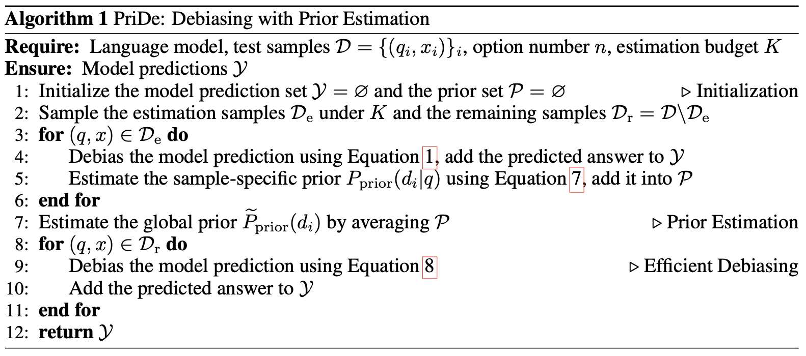
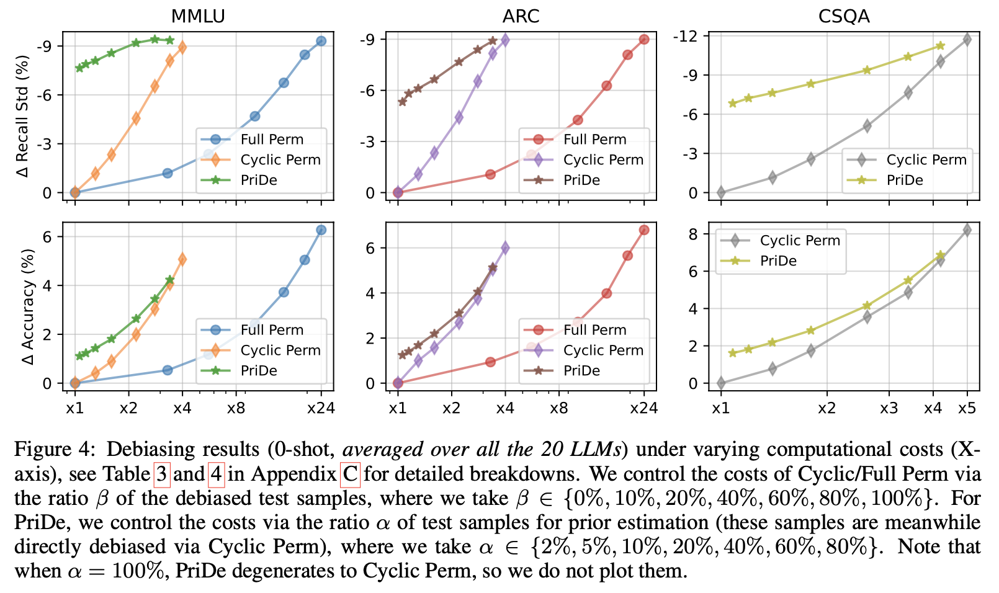
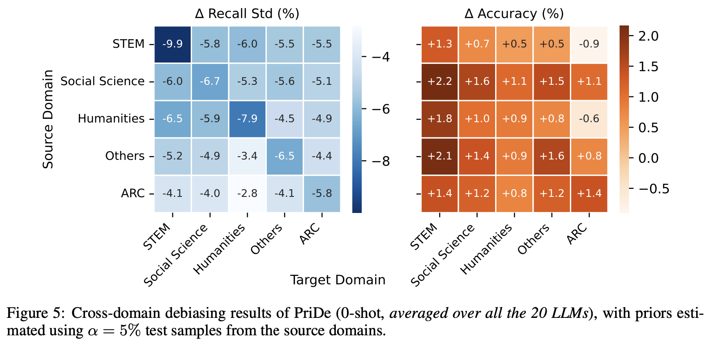

<!--  -->

# **Large Language Models Are Not Robust Multiple Choice Selectors** 

## **1. Preliminary**  

The paper investigates a performance issue in large language models (LLMs) when answering multiple-choice questions (MCQs). While MCQs are a common way to test LLMs, the models are susceptible to the order of the answer choices. The authors call this bias towards specific answer positions "**selection bias**".

### 1.1 Measurement of Selection Bias

To measure selection bias in LLMs answering multiple-choice questions, a simple way is to count how often the model picks each answer choice. However, this can be misleading if some answer choices are much more common than others, i.e., label imbalance.

Alternatively, the proposed way is to

* first, calculate **the balance of recalls** for each answer choice. This measures how often the model picks each choice when it is the correct answer, and
* next, compute **the standard deviation of those recalls (RStd)** as a quantitative metric. A higher standard deviation of recalls, implying more variation, indicates a stronger bias towards certain answer IDs. Formally, the mathematical expression of this metric is $\textrm{RStd} = \textrm{Std} \{ \textrm{Recall}(d_i)_ {i=1}^ {n} \} = \sqrt{\frac{\sum_ {i=1}^ {n} (\textrm{Recall}(d_ i) - \mu)^ 2}{n}}$, where $\mu = \frac{1}{n} \sum_ {i=1}^ {n} \textrm{Recall}(d_ i)$ 

<!-- and the recall of an option ID $d_ i$ is defined as $\textrm{Recall}(d_i) = \frac{\(d_i)}{1}$ -->

and the recall of an option ID $d_ i$ is defined as $\textrm{Recall}(d_ i) = \frac{\textrm{#}(\textrm{correct answer is }d_ i \, \& \, \textrm{prediction is }d_ i)}{\textrm{#}(\textrm{correct answer is }d_ i)} \times 100\%$

<!-- and the recall of an option ID $d_ i$ is defined as $\textrm{Recall}(d_ i) = \frac{\#(\textrm{correct answer is }d_ i \, \& \, \textrm{prediction is }d_ i)}{\#(\textrm{correct answer is }d_ i)} \times 100\%$ -->

This method is more reliable because it is not affected by how common each answer choice is overall. Also, this method reflects how well the model will perform when the order of the answer choice is changed, because it focuses on how likely the model is to pick each option regardless of its position.

### 1.2 Observations

The paper studied how selection bias affects different LLM models. The major insights are as follows:

* **Selection bias is common but inconsistent**: While most models show bias, it varies between models and sizes. Interestingly, even models trained on the same data (e.g., llama family) can exhibit different biases. This suggests a complex interrelation between training data, model capacity, and other factors.

* **Selection bias shows some consistency within a model**: While not perfect, a model might favor certain answer choices (like A or B) across different MCQ tests. This suggests bias leans more towards inherent model behavior than the specific task or domain.

* **In-context examples can be a double-edged sword**: Providing additional context (like a few examples) can reduce the original bias, but it might also introduce new ones. These new biases seem unpredictable even within the same model family, making selection bias even more intricate.

There are two main hypotheses of selection bias in LLMs when dealing with MCQs:

1. **Token Bias**: This hypothesis suggests that in the standard MCQ prompt, LLMs might inherently favor certain option IDs (e.g., A or C) when selecting answers, assigning them higher probabilities.
2. **Position Bias**: Alternatively, models may exhibit a bias towards options presented at specific ordering positions, such as favoring options presented first or last.

To differentiate between two potential causes, two ablation experiments are conducted:

* Shuffling option IDs: This experiment involves randomly shuffling the default ID ordering, effectively eliminating the impact of position bias and focusing solely on token bias. However, this approach may affect the naturalness and quality of the MCQ prompt, potentially leading to degraded model performance.
* Removing option IDs: The option IDs are removed, and the model is asked to directly select option contents. This experiment helps gauge the impact of token bias, as any change in selection bias indicates the influence of token bias, while the remaining bias corresponds to position bias.

The results indicate that the removal of option IDs notably reduces selection bias, **primarily indicating the influence of token bias**. However, the remaining selection bias, corresponding to position bias, varies across models and tasks, suggesting its presence but irregularity. Some models exhibit marginal remaining bias, while others still demonstrate pronounced bias even after reducing it significantly. This variability suggests that **position bias exists but is highly model- and task-dependent**.

Further, removing option IDs is evidently not a promising solution to selection bias in LLMs for MCQs. The first reason is regarding performance drop. While removing IDs reduces bias, it generally hurts how well the model answers the questions. This is because we have to estimate the answer by comparing the likelihood of each option, which is less effective than using the original option IDs. The second reason is due to implementation difficulty. Using likelihood is cumbersome compared to the simpler method of having the model predict the answer ID directly. In conclusion, removing option IDs is not a practical solution for mitigating selection bias.

Besides, the paper explores two ways to potentially reduce selection bias in LLMs with MCQs. One attempt is to involve explicit debiasing instruction. Adding a message telling the model to consider all options fairly shows no improvement. Another trial is to apply chain-of-thought (CoT) prompting. This technique involves prompting the LLM to explain its though process before giving the answer. Even with this prompt, the bias remains, thus the CoT prompting is inefficient. The two results suggest that selection bias is a deep-rooted issue within the LLM itself and cannot be easily fixed with basic changes to how the question is presented.

## **2. Method**  

To address the problem of selection bias, a new method called **PriDe** is proposed. It can remove this bias without needing any additional training data by estimating the bias based on a small number of samples and then corrects for it during the normal operation of the LLM.

### 2.1 Permutation-based Debiasing Baseline and Formulation

First, we need to define a baseline to compared with the newly proposed debiasing method. Here, the baseline averages the model's prediction distribution across various permutations of options, countervailing both the model's token bias and position bias.

Formally, let $q$ denote the MCQ question. Suppose the $n$ default-ordered option IDs (e.g., A/B/C/D) are $d_ i$ and the default-ordered option contents are $o_ i$, $i\in \{1,2,...,n\}$. Denote $I$ a permutation of $\{1,2,...,n\}$, $\mathcal{I}$ a set of possible permutations, $g_ I (i)$ the index of $i$ in $I$, and $x^ I$ the concatenation of the default-ordered option IDs and the $I$-permuted option contents, so that $o_ i$ is tied with $d_ {g_ I (i)}$ in $x^ I$. The permutation-based debiasing baseline can be formulated as

$\begin{equation} 
    \tilde{P}_ {\textrm{debiased}} (o_ i \vert q, x) = \frac{1}{\vert \mathcal{I} \vert} \sum_ {I \in \mathcal{I}} P_ {\textrm{observed}} (d_ {g_ I (i)} \vert q, x^ I), \quad i \in \{1,2,...,n\},
\end{equation}$

where $x$ is the default input of option IDs and option contents, $P_ {\textrm{observed}} (d_ {g_ I (i)} \vert q, x^ I)$ is the observed prediction probability for the option ID $d_ {g_ I (i)}$ (meaning $o_ i$ being correct) under the option permutation $I$, and $\tilde{P}_ {\textrm{debiased}} (o_ i \vert q, x)$ denotes the debiased prediction probability for the option content $o_ i$. However, due to expensive computation, *cyclic permutation*, where $\mathcal{I} = \{ (i, i+1, ..., n, 1, ..., i-1) \}_ {i=1}^ n$, is alternatively considered to reduce the computational cost. In the case of the baseline, the overhead of Cyclic Permutation is still somewhat high, hence required more efficient debiasing methods.

### 2.2 Prediction Probability Decomposition

The core idea is to obtain a debiased prediction distribution by separating the model's prior bias for option IDs from the overall prediction distribution. In other words, the observed prediction distribution $P_ {\textrm{observed}}$ over $d_ i$ can be decomposed as a prior distribution $P_ {\textrm{prior}}$ over $d_ i$ and a debiased distribution $P_ {\textrm{debiased}}$ over $d_ i$:

$\begin{equation}
    P_ {\textrm{observed}} (d_ i \vert q, x^ I) = Z_ {q, x^ I}^ {-1} P_ {\textrm{prior}} (d_ i \vert q, x^ I) P_ {\textrm{debiased}} (o_ {f_ I (i)} \vert q, x^ I), \forall I \in \mathcal{I}, \quad i \in \{1, 2, ..., n\},
\end{equation}$

where $f_ I (i)$ denotes $i$-th element in $I$. Note that the form of $P_ {\textrm{observed}}$ can be rewritten as a joint probability $P(d_ i , o_ j \vert q, x^ I)$ for $d_ i$ and $o_ j$, which equals to $P_ {\textrm{observed}} (d_ i \vert q, x^ I)$ if $j = f_ I (i)$ and $0$ otherwise. Thus, the above prediction probability decomposition can be interpreted as the conditional independent assumption (ignore the normalization $Z_ {q, x^ I}^ {-1}$), where the model holds independent beliefs about $d_ i$ and $o_ j$. Specifically, $P_ {\textrm{debiased}} (o_ j \vert q, x^ I)$ reflects the model's **true belief about the option content** $o_ j$, which is not influenced by the option ID $d_ i$. In constrast, $P_ {\textrm{prior}} (d_ i \vert q, x^ I)$ indicates the model's **prior bias for the option ID** $d_ i$, which actually involves not only the model's token bias but also position bias, due to the natural binding between option IDs and options' ordering positions. Thus, instead of strictly distinguishing the two biases, we can address them together by eliminating $P_ {\textrm{prior}}$.

For tractable derivation, assuming that $P_ {\textrm{debiased}}$ is not affected by option ordering, implying its invariance to option permutation $I$, allows $x_ I$ to be replaced with the default input $x$. Moreover, we assume $P_ {\textrm{prior}}$ to be independent of $x_ I$, meaning that the prior for option IDs depends on only the question $q$. Then, $(2)$ can be simplified to

$\begin{equation}
    P_ {\textrm{observed}} (d_ i \vert q, x^ I) = Z_ {q, x^ I}^ {-1} P_ {\textrm{prior}} (d_ i \vert q) P_ {\textrm{debiased}} (o_ {f_ I (i)} \vert q, x), \quad \forall I \in \mathcal{I}, i \in \{1, 2, ..., n\}.
\end{equation}$

### 2.3 Debiasing With Prior Estimation

Taking the logarithm of both sides of $(3)$ and summing over all $I \in \mathcal{I}$ gives

$\begin{equation}
    \sum_ {I \in \mathcal{I}} \log P_ {\textrm{observed}} (d_ i \vert q, x^ I) = \vert \mathcal{I} \vert \log P_ {\textrm{prior}} (d_ i \vert q) + \left( \sum_ {I \in \mathcal{I}} \log P_ {\textrm{debiased}} (o_ {f_ I (i)} \vert q, x) \right) + C
\end{equation}$
$\begin{equation}
    = \vert \mathcal{I} \vert \log P_ {\textrm{prior}} (d_ i \vert q) + \left( \frac{\vert \mathcal{I} \vert}{n} \sum_ {j = 1}^ {n} \log P_ {\textrm{debiased}} (o_ {f_ I (i)} \vert q, x) \right) + C
\end{equation}$
$\begin{equation}
    = \vert \mathcal{I} \vert \log P_ {\textrm{prior}} (d_ i \vert q) + C', \quad i \in \{1, 2, ..., n\}.
\end{equation}$

Without any sample labels, we get

$\begin{equation}
    P_ {\textrm{prior}} (d_ i \vert q) = \textrm{softmax} \left( \frac{1}{\vert \mathcal{I} \vert} \sum_ {I \in \mathcal{I}} \log P_ {\textrm{observed}} (d_ i \vert q, x^ I) \right), \quad i \in \{1, 2, ... , n\}.
\end{equation}$

According to the observation that selection bias within the same model shows a moderate cross-domain similarity, it infers that the prior for option IDs is likely to transfer across different samples and domains, suggesting the computation for the priors of partial test samples and utilize them as an approximation for the remaining samples. This can tremendously enhance debiasing efficiency since no more computational overhead is required for the remaining samples upon the estimated prior.

Based on the mentioned motivation, PriDe at the beginning takes $K$ test samples $\mathcal{D}_ {\textrm{e}}$ from the test set $\mathcal{D}$, where $K$ can be adjusted depending on the esimation budget. Each sample in $\mathcal{D}_ {\textrm{e}}$ undergoes the standard permutation-based debiasing in $(1)$, during which we estimate each sample-specific prior $P_ {\textrm{prior}} (d_ i \vert q)$ using $(7)$. For the remaining samples $\mathcal{D}_ {\textrm{r}} = \mathcal{D} \setminus \mathcal{D}_ {\textrm{e}}$, the "global prior" $\tilde{P}_ {\textrm{prior}} (d_ i)$ is computed by averaging the previously computed priors as an approximation to the new sample's $P_ {\textrm{prior}} (d_ i \vert q)$ in $(3)$. Thus, the approximated $\tilde{P}_ {\textrm{debiased}} (o_ i \vert q, x)$ can be computed, resulting in the debiased prediction as follows:

$\begin{equation}
    \tilde{P}_ {\textrm{debiased}} (o_ i \vert q, x) \propto P_ {\textrm{observed}} (d_ i \vert q, x) / \tilde{P}_ {\textrm{prior}} (d_ i), \quad i \in \{1, 2, ..., n\}.
\end{equation}$

When $K \ll \vert \mathcal{D} \vert$, the overhead for prior estimation will become negligible compared to the whole inference cost. Figure 1 summarizes PriDe:

*Figure 1: PriDe Algorithm*

## **3. Experiment**  

### **3.1 Experiment setup**  

* Models:
    * Causal, decoder-only LLMs are used due to prevalent uses of this kind of architecture.
    * 20 LLMs from various families and sizes are included:
        * llama-7/13/65B (Touvron et al., 2023a)
        * llama-2(-chat)-7/13/70B (Touvron et al., 2023b)
        * vicuna-v1.3-7/13/33B, vicuna-v1.5-7/13B (Chiang et al., 2023)
        * falcon(-inst)-7/40B (Almazrouei et al., 2023)
        * gpt-3.5-turbo-0613 (OpenAI, 2022)
    * All models except gpt-3.5-turbo are open-source on HuggingFace and allow access to output probabilities.
    * gpt-3.5-turbo is a commercial API that only provides generated text, not output probabilities.
* Benchmarks:
    * 3 MCQ benchmarks are utilized:
        * MMLU (Hendrycks et al., 2020): 4-option MCQs; domains across 57 subjects
        * ARC-Challenge (Clark et al., 2018): 4-option MCQs
        * CommonsenseQA (CSQA) (Talmor et al., 2019): 5-option MCQs
* Evaluation:
    * The evaluation follows established LLM evaluation frameworks:
        * HuggingFace LLM Leaderboard
        * EleutherAI lm-harness
        * Original MMLU implementation
        * OpenAI Evals
    * Open-source models: output probabilities of option IDs (A/B/C/D/E) are used, with the highest probability indicating the prediction.
    * gpt-3.5-turbo: the first generated token is compared to the golder answer (decoding temperature set to 0).
    * The primary evaluation focuses on the 0-shot setting to avoid bias from additional information.
    * 5-shot experiments are also conducted, where in-context examples are provided from development sets and shared across all test samples within the same task.

### **3.2 Results**  
  
By comparing a new debiasing method called PriDe with two existing methods (Cyclic Permutation and Full Permutation) for reducing selection bias in LLMs answering MCQs, some key findings are, according to Figure 2, that
* PriDe achieves better debiasing and improves performance compared to the other two methods, especially when considering the computational cost. This holds true even when additional context (in-context examples) is provided to the LLM.
* The estimated bias using PriDe correlates well with the actual selection bias observed in the model, suggesting PriDe effectively identifies the underlying cause of the bias.
* PriDe can achieve reliable bias estimation even with a limited amount of data (by sampling $K=\alpha \vert \mathcal{D} \vert$ test samples), indicating that the model's bias for answer choices is consistent across different samples.
* PriDe can be combined with simpler debiasing methods (using fewer random permutations) to further improve efficiency while maintaining effectiveness.

*Figure 2: Debiasing results*

Nonetheless, there are some limitations:
* Full Permutation was not evaluated on the 5-option MCQ benchmark due to its high computational cost.
* For gpt-3.5-turbo, the debiasing process relies on an approximation because it does not provide the necessary output probabilities.

Furthermore, an analysis on transferability across different domains is performed. In reality, questions might come from various domains, so it is crucial to ensure that the debiasing method works even if it was not trained on that specific domain. The result, according to Figure 3, shows that the bias estimated from one domain with a small number of samples can be used to debias questions from other domains as well. Also, there might be a slight performance drop for LLMs when the domain shift is significant (e.g., STEM to NON-STEM). While PriDe aims to reduce bias, not boost performance, the authors suggest updating the estimated bias with a few new samples from the new domain if a large domain shift is expected. This update would have negligible extra cost compared to the overall process.

*Figure 3: Cross-domain debiasing results*

In addition, the consequence of model predictions by debiasing methods is also taken into consideration. While the main goal was to reduce bias, the debiasing often leads to improved performance as well. There are 3 insights from the experiment:
* Both methods (PriDe and Cyclic Permutation) improve more predictions than they worsen. This means debiasing generally helps the model make better choices.
* PriDe seems to mostly affect predictions where the model itself was not very confident at first. The new, debiased predictions tend to be among the top two choices the model considered before debiasing, especially for larger models. This suggests PriDe corrects the model's bias for certain answer IDs when it is unsure and pushes the model towards a more likely answer.
* Cyclic Permutation changes even high-confidence predictions more frequently and can lead to more dramatic shifts in the answer choice. Also, it is inclined to pick the originally lowest-ranked option more often as the debiased answer. Additionally, it flattens the model's confidence distribution across all answer choices. This is due to the nature of the permutation-based debiasing which is a sort of mixture of experts, where each expert considers the options in a different order. This leads to more neutral, i.e., less certain, predictions yet requires more computation compared to PriDe.

## **4. Conclusion**  

<!-- Please summarize the paper.  
It is free to write all you want. e.g, your opinion, take home message(오늘의 교훈), key idea, and etc. -->

The study investigates a common issue in LLMs where their answers to MCQs can be influenced by the way the answer choices are presented. This presence is called selection bias, encompassing two main reasons: token bias and position bias. A new method called PriDe is then proposed to fix this bias. The mechanism of this approach is to estimate the model's preference for certain answer IDs and corrects for it without needing any additional information about the questions themselves. This method is efficient, interpretable, and applicable for different domains, leading to the enhancement in the overall reliability of LLMs in answering MCQs.

---  
## **Author Information**  

* Author name: Rawat Padungkiettiwong
    * Affiliation: KAIST School of Computing
    * Research Topic: Natural Language Processing, Trustworthy LLMs

## **6. Reference & Additional materials**  

* [Github Implementation](https://github.com/chujiezheng/LLM-MCQ-Bias) 
* References

Zheng, Chujie, Hao Zhou, Fandong Meng, Jie Zhou, and Minlie Huang. "Large language models are not robust multiple choice selectors." In The Twelfth International Conference on Learning Representations. 2023.

Hugo Touvron, Thibaut Lavril, Gautier Izacard, Xavier Martinet, Marie-Anne Lachaux, Timothe ́e Lacroix, Baptiste Rozie`re, Naman Goyal, Eric Hambro, Faisal Azhar, et al. Llama: Open and efficient foundation language models. arXiv preprint arXiv:2302.13971, 2023a.

Hugo Touvron, Louis Martin, Kevin Stone, Peter Albert, Amjad Almahairi, Yasmine Babaei, Niko- lay Bashlykov, Soumya Batra, Prajjwal Bhargava, Shruti Bhosale, et al. Llama 2: Open founda- tion and fine-tuned chat models. arXiv preprint arXiv:2307.09288, 2023b.

Wei-Lin Chiang, Zhuohan Li, Zi Lin, Ying Sheng, Zhanghao Wu, Hao Zhang, Lianmin Zheng, Siyuan Zhuang, Yonghao Zhuang, Joseph E. Gonzalez, Ion Stoica, and Eric P. Xing. Vicuna: An open-source chatbot impressing gpt-4 with 90%* chatgpt quality, March 2023. URL https: //lmsys.org/blog/2023-03-30-vicuna/.

Ebtesam Almazrouei, Hamza Alobeidli, Abdulaziz Alshamsi, Alessandro Cappelli, Ruxandra Co- jocaru, Merouane Debbah, Etienne Goffinet, Daniel Heslow, Julien Launay, Quentin Malartic, Badreddine Noune, Baptiste Pannier, and Guilherme Penedo. Falcon-40B: an open large lan- guage model with state-of-the-art performance, 2023.

OpenAI. https://chat.openai.com.chat, 2022.

Dan Hendrycks, Collin Burns, Steven Basart, Andy Zou, Mantas Mazeika, Dawn Song, and Jacob Steinhardt. Measuring massive multitask language understanding. In International Conference on Learning Representations, 2020.

Peter Clark, Isaac Cowhey, Oren Etzioni, Tushar Khot, Ashish Sabharwal, Carissa Schoenick, and Oyvind Tafjord. Think you have solved question answering? try arc, the ai2 reasoning challenge. arXiv preprint arXiv:1803.05457, 2018.

Alon Talmor, Jonathan Herzig, Nicholas Lourie, and Jonathan Berant. CommonsenseQA: A ques- tion answering challenge targeting commonsense knowledge. In Proceedings of the 2019 Con- ference of the North American Chapter of the Association for Computational Linguistics: Human Language Technologies, Volume 1 (Long and Short Papers), pp. 4149–4158, Minneapolis, Min- nesota, June 2019. Association for Computational Linguistics. doi: 10.18653/v1/N19-1421. URL https://aclanthology.org/N19-1421.