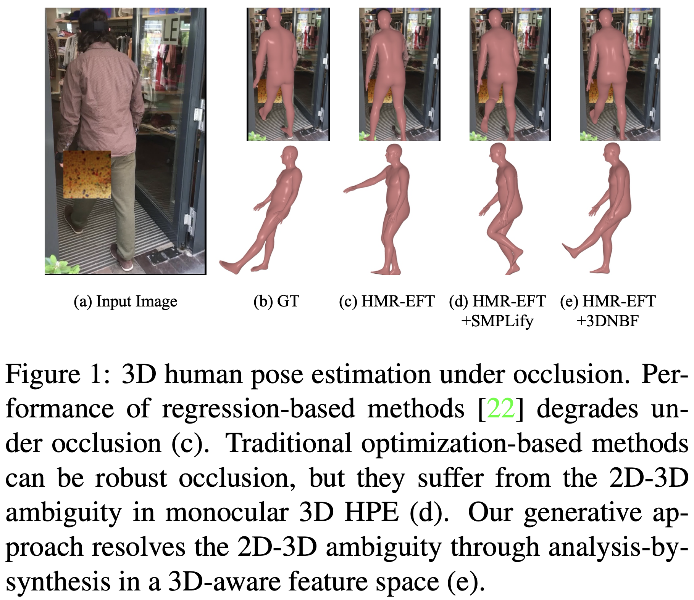
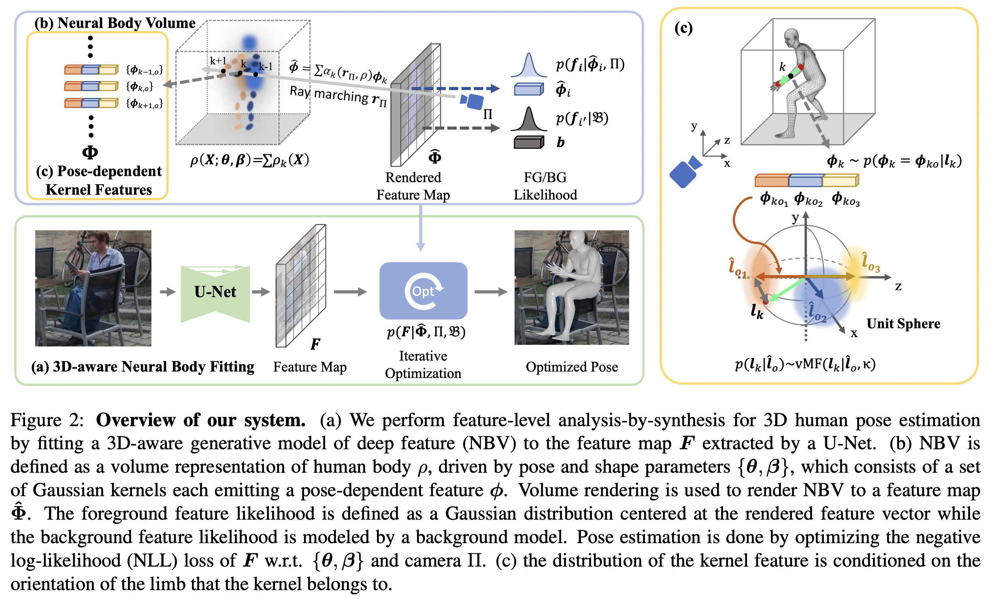
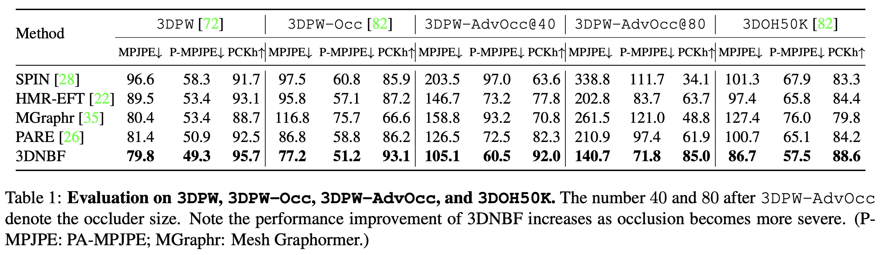
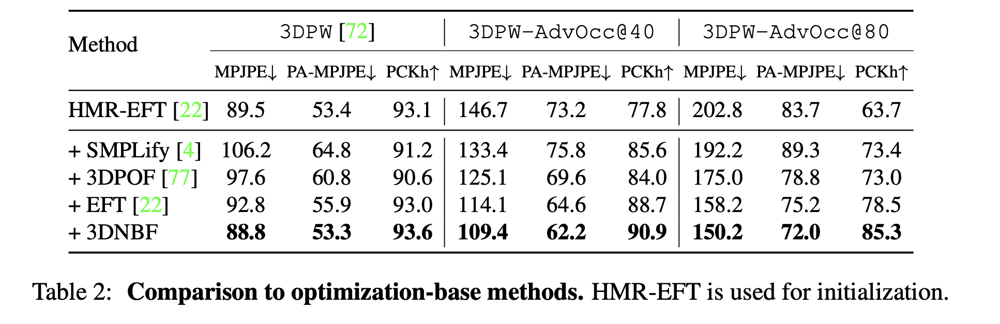
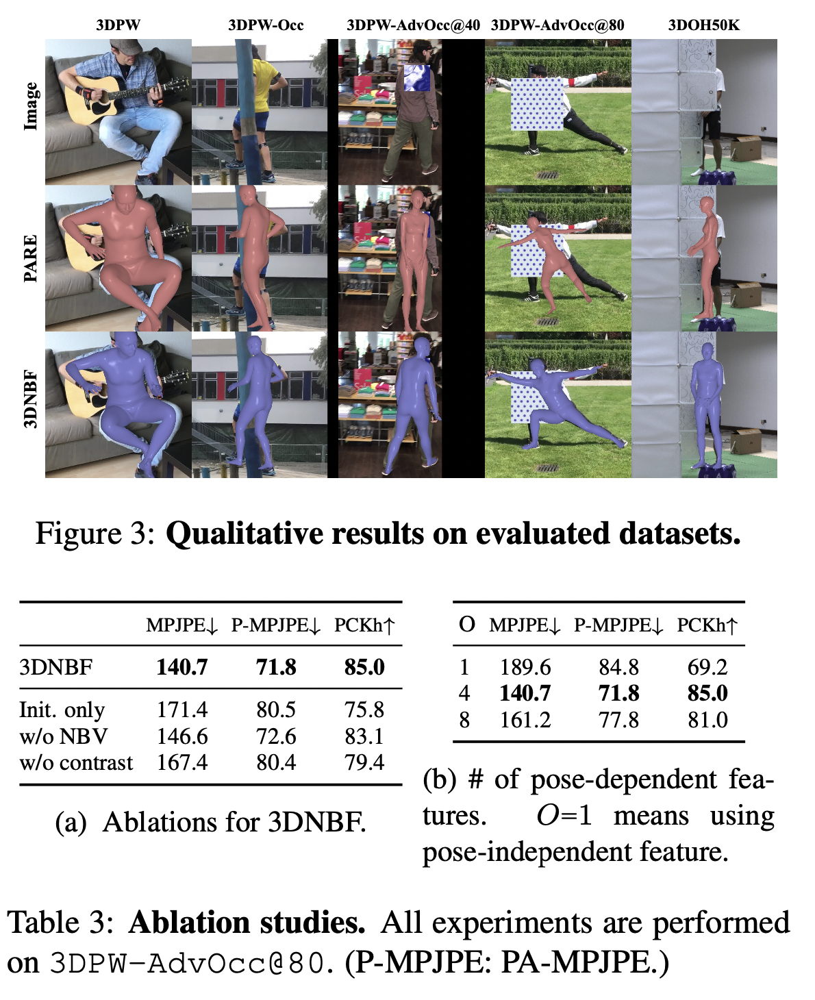

---
title:  "[ICCV 2023] 3D-Aware Neural Body Fitting for Occlusion Robust 3D Human Pose Estimation"
permalink: 3D_Aware_Neural_Body_Fitting_for_Occlusion_Robust_3D_Human_Pose_Estimation.html
tags: [reviews]
use_math: true
usemathjax: true
---

## 1. Problem Definition and Motivation

Human pose estimation (HPE) generally refers to detecting and tracking human body's posture and movements. Human pose estimation has been one of the most challenging subjects in recent years and it is widely used in human-computer interaction, fall detection, ergonomic risk assessment, rehabilitation, sports, etc. Specifically, single-view 3D pose estimation using only one RGB camera is a research hotspot in computer vision due to its easy and cost-effective setup. Although computer vision algorithms have significantly improved the accuracy of single-view RGB 2D pose estimation, accurate 3D pose estimation using a single RGB camera faces challenges like lack of depth information and occlusion.

3D human pose estimation is a computer vision task that involves estimating the 3D positions and orientations of body joints and bones from 2D images or videos. There are several approaches to estimating 3D human pose estimation. The regression-based approach is one of the traditional approaches that uses deep networks to predict the 3D pose estimation from 2D images or video. However, these approaches are not efficient in occluded situations.

There are some optimization-based methods that employ an iterative process, refining a parametric model of the human body to correspond with the 2D image features, such as edges and contours. Although they have a potentially better performance in occlusion, they encounter challenges due to the inherent 2D-3D ambiguity—a scenario where multiple distinct 3D poses may yield indistinguishable 2D projections.

A recent research that uses a generative model for 2D object detection in certain categories, has shown to be robust to occlusion with an innovative inverse graphics analysis-by-synthesis approach that tries to find model parameters that best explain the observed image and estimate occluded parts using an outlier process. Analysis-by-synthesis in RGB pixel space can be challenging because firstly, there are not many good generative models and secondly, there are no efficient algorithms to invert these generative models. So they conducted an approximate analysis-by-synthesis in deep feature space.

In this study, the 3D-aware Neural Body Fitting (3DNBF) framework was proposed that uses a volume-based parametric model called Neural Body Volumes (NBV) to analyze and synthesize features for 3D Human Pose Estimation (HPE). This model, comprised of Gaussian ellipsoidal kernels, excels in handling occlusions and differentiating body features analytically, offering smooth gradients for efficient optimization. In contrast to traditional optimization-based methods that may lose critical information, this framework has a contrastive learning approach to learn data-driven features that are robust to variations such as clothing color and adept at capturing essential local 3D pose information. The effectiveness of 3DNBF is validated on three existing 3D HPE datasets and a newly proposed adversarial protocol designed to assess occlusion robustness, showing superior performance over both state-of-the-art regression and optimization-based methods in occluded and non-occluded scenarios. Combining these innovative strategies addresses common errors in pose estimation, particularly in occluded body parts, demonstrating the framework's advanced capability in resolving 2D-3D pose ambiguities.

 

## 2. Method: 3D-Aware Neural Body Fitting

### 2.1. Formulation

For input image $I \in \mathbb{R}^{H \times W \times 3}$, they defined 3D human pose parameters $\theta$ and with Bayes rule, they formulate the problem as follows:

$\theta^{\*} = \underset{\theta}{\mathrm{argmax}} \ p(\theta \vert I) = \underset{\theta}{\mathrm{argmax}} \ p(I \vert \theta) p(\theta)$

where $p(\theta)$ is a prior distribution learned from data and $p(I\|\theta)$ is the likelihood, that is typically derived from a generative forward model. The goal is to find the parameter $\theta^{\*}$ that best describes the input image.

### 2.2. Feature-Level Analysis-by-Synthesis

In this method, they perform analysis-by-synthesis at the feature-level to make it invariant to the image's unnecessary information, such as colors, background, clothing, etc, that are not useful in human pose estimation. if the output of a deep convolutional neural network $\zeta$ is feature respresentation of an input image $\zeta(I) = F \in \mathbb{R}^{H \times W \times D}$ and $f_ i \in \mathbb{R}^D$ is a feature vector in $F$ at pixel $i$ on the feature map. They defined $G( \theta) = \hat{\Phi} \in \mathbb{R}^{H \times W \times D}$, a generative model in feature level which produces a feature map $\hat{\Phi}$ given the pose $\theta$.

They defined the occlusion-robust likelihood as.

$p(F\|G(\theta), B, Z) = \prod_ {i \in \mathcal{FG}} p(f_ i\|\hat{\phi}_ i, z_ i) \prod_ {i' \in \mathcal{BG}} p(f_ {i'}\|B)$

$p(f_ i \| \hat{\Phi}_ i, z_ i) = [p(f_ i \| \hat{\Phi}_ i)]^{z_ i} [p(f_ i \| \mathcal{B})]^{(1 - z_ i)}$

Following existing work on occlusion-robust analysis-by-synthesis where $z_ i \in\{0,1\}$ and $p(z_ i=1) = p(z_ i=0)= 0.5$ and $z_ i$ is for background model ($\mathcal{BG}$) that explains the information that cannot be explained by foreground model ($\mathcal{FG}$).

### 2.3. Neural Body Volumes

Local information can be missed in the Feature-Level Analysis-by-Synthesis process (e.g., shading useful for 2D to 3D inference). So, in previous studies, implicit volume representation was used to reconstruct continuous surfaces of the body without necessarily focusing on the probabilistic distribution of points, also, this method needs multi-view or video that does not align with this paper's purpose with a single RGB image in occluded situations. Therefore, they presented a novel model called Neural Body Volumes (NBV) that represents the volume density of a human body using a sum of Gaussian kernels, effectively a continuous function over space. At spatial location $X \in \mathbb{R}^3$ each kernel $\rho_ k(X) = \mathcal{N}(M_ k, \Sigma_ k)$ is parameterized by a mean vector $M_ k(\theta, \beta) \in \mathbb{R}^3$ and a covariance matrix $\Sigma_ k(\theta, \beta) \in \mathbb{R}^3$, which are conditioned on human pose and shape parameters. The overall volume density is defined as a sum of these individual kernel densities $\rho(X)=\sum_ {k=1}^K\rho_ k(X)$.

A volume rendering model projects 3D Gaussian kernels and their associated feature vectors onto a 2D plane as follows

$\hat{\phi}(r_ \Pi) = \int_ {t_ n}^{t_ f} T(t) \sum_ {k=1}^K \rho_ k (r_ \Pi(t)) \phi_ {k} dt,$

, where $r_ \Pi(t)$ $t\in [t_ n,t_ f]$ is a ray, and the transmittance function is:

$T(t) = \exp\left(-\int_ {t_ n}^{t} \rho(r_ \Pi(s)) \, ds\right)$

$T(t)$ describes how the light's intensity decreases as it travels through each kernel when the features, such as color or texture, are added. The final analytic form of integral is $\hat{\phi}(r) = \sum_ {k=1}^{K} \alpha_ k(\pi_ 1, \rho)\phi_ k$ where for $K$ Gaussian kernels, $\Phi = \{\phi_ k\}$ is corresponding features. For each input image, the model tries to optimize $\theta$ and shape $\beta$ parameters to change the position $M_ k(\theta, \beta)$ and the shape $\Sigma_ k(\theta, \beta)$ of the Gaussian ellipsoids. With a wise choice of $K$, the model can accurately capture a wide variety of human body shapes.

**Conditioning on pose and shape.** $J\in \mathbb{R}^{N\times3}$ is set of body joints and $\bar{J}$ is the template joints set. The pose is defined by corresponding rotation matrices $\Omega \in \mathbb{R}^{N\times3\times3}$. They articulated Gaussian kernels using Linear Blend Skinning (LBS) which uses $G(J,\Omega)$ transformation matrix to transform the center of these kernels and uses a linear combination of set of $L$ basis shape displacements $S \in \mathbb{R}^{L \times K \times 3}$ to estimate the body part shapes. The location $M_ k$ of each kernel is computed using a weighted sum of the joint transformations ($\sum_ {i=1}^{N} w_ {k,i}=1$) and shape displacements ($\sum_ {l=1}^{L} \beta_ {l}=1$), as shown below

$M_ k = \sum_ {i=1}^{N} w_ {k,i} \cdot G_ i[\bar{M_ k} + \sum_ {l=1}^{L} \beta_ {l} \cdot S_ {l,k}][1]$

where $\bar{M_ k}$ is the rest position kernal. The covariance matrices are similarly updated to match the rotations of the joints.

$\Sigma_ k^{-1} = \sum_ {i=1}^{N} w_ {k,i} \cdot R_ {i}^T \cdot \bar{\sum}_ {k}^{-1}\cdot R_ i$

where $R_ {i}$ is the product of rotations from the root to the joint $i$. ($R_ i=\prod_ {j\in A(i)} \Omega_ i$) and $\bar{\Sigma_ k}$ is the rest position kernal.

The template joint locations $\bar{J}$ are adjusted to reflect individual body shapes by regressing the template joint locations from the deformed Gaussian kernels’ locations using the following formula:

$\bar{J} = g\left(\bar{M} + \sum_ {l=1}^{L} \beta_ l S_ l\right)$

Here, $\bar{M}$ is dedicated to the mean position of the kernels, $\beta_ l$ are the coefficients that control the influence of each of the $L$ basis shape displacements $S_ l$, and the linear function $g$ maps these adjusted positions to the joint locations in 3D space.

In conclusion, through the volume rendering process, each pixel in the feature map is associated with a feature vector $\hat{\phi}$, which is an aggregation of the contributions from all the Gaussian kernels to ensure a realistic human body model output.

### 2.4. A Generative Model of 3D-Aware Features

To overcome the 2D-3D ambiguity in human pose estimation, they made a 3D-aware generative model by introducing _ pose-dependent feature representations. The generative model, NBV, utilizes Gaussian ellipsoidal kernels positioned relative to the body joints, each kernel feature captures the 3D orientation of body limbs.

The innovation is conditioning the kernel features on the orientation of body limbs. This is formulated as a distribution over the features, conditioned on human pose and shape:

$p(\phi_ k = \phi_ {ko} \| l_ k(\theta, \beta)) = \frac{p(l_ k \| \hat{l}_ o)}{\sum_ {o=1}^O p(l_ k \| \hat{l}_ o)}$

The limb orientation $l_ k(\theta, \beta)$ influences the features $\phi_ k$, making them pose-dependent. The von Mises-Fisher distribution, $vMF(l_ k \| \hat{l}_ o, \kappa_ o)$, models the probability of the limb's orientation given a predefined orientation $\hat{l}_ o$.

During inference, the expected feature $E(\phi_ k \| \theta, \beta)$ of kernel $k$ is used for volume rendering, ensuring the process is differentiable.

This method bridges the gap between 2D image features and their corresponding 3D human poses, significantly enhancing the robustness of pose estimation, particularly in cases of occlusion.

### 2.5. Training

**Formulation.**

- Template Gaussian kernels and associated features $\bar{M}, \bar{\Sigma}, \Phi$,

- Template joints $\bar{J}$,

- Blend weights $W$,

- Basis shape displacements $S$,

- Joint regressor $g$,

- UNet feature extractor $\zeta$.

**Learning pose and shape parameters. in NBV**

After initialization $\bar{M}$ and $\bar{\Sigma}$ from a downsampled version of a template body mesh, template joints $\bar{J}$, linear joint regressor, and blend weights are established through manual segmentation. Pose and shape parameters are learned by registering the NBV to the training set and minimizing the reconstruction error between Gaussian kernels and ground truth shape.

**MLE learning of NBV kernel features**

Maximum Likelihood Estimation (MLE) is used for NBV kernel features learning with a negative log-likelihood loss:

$\begin{equation}
    \mathcal{L}_ {\text{NLL}}(\hat{F}, \Phi) = - \sum_ {i \in \mathcal{F}_ G} \log p(f_ i|\Phi_ i)
\end{equation}$

**3D-aware contrastive learning of the UNet feature ex-tractor.**

UNet feature extractor is trained through 3D-aware contrastive learning with three contrastive losses:

- Feature contrastive loss ($\mathcal{L}_ {\mathcal{FG}}$) encourages features of different pixels to be distinct:

$\mathcal{L}_ {\mathcal{FG}}(F, \mathcal{FG}) = - \sum_ {i \in \mathcal{F}_ G} \sum_ {i' \in \mathcal{FG} \backslash \{i\}} \left\| f_ i - f_ {i'} \right\|^2$

- 3D contrastive loss $\mathcal{L}_ {3D}$ encourages features of the same kernel in different 3D poses to be distinct:

$\mathcal{L}_ {3D}(F) = - \sum_ k \sum_ {o \in \mathcal{O}\backslash{\{o\}}} \sum_ {i \in \mathcal{K}_ o} \sum_ {i' \in \mathcal{K}_ {o'}} \left\| f_ {ik_ o} - f_ {ik_ {o'}} \right\|^2$

- Background contrastive loss $\mathcal{L}_ {\mathcal{BG}}$ encourages features on the human to be distinct from the background:

$\mathcal{L}_ {\mathcal{BG}}(F, \mathcal{FG}, \mathcal{BG}) = - \sum_ {i \in \mathcal{F}_ G} \sum_ {j \in \mathcal{BG}} \left\| f_ i - f_ j \right\|^2$

So the total contrastive loss is:

$\mathcal{L}_ {\text{contrast}}=\mathcal{L}_ {\mathcal{FG}}+\mathcal{L}_ {3D}+\mathcal{L}_ {\mathcal{BG}}$

The total loss for training $\zeta$ is:

$\mathcal{L}_ {\text{train}} = \mathcal{L}_ {\text{NLL}} + \mathcal{L}_ {\text{contrast}}$

**Bottom-up initialization with regression heads.**

Lastly, for efficient inference, a regression head is added to the UNet to predict pose and shape parameters $\{\theta,\beta\}$ from observed feature maps. The regression head and the UNet are learned jointly.

### 2.6 Implementation Details

For the technical specifics:

- The neutral SMPL model is converted to NBV with 858 kernels.

- A U-Net-styled network with a ResNet-50 backbone and three upsampling blocks is used as a feature extractor.

- The regression head design is based on reference [26].

- A 320 x 320 crop around the subject forms the input image.

- The feature map has a downsampled resolution of 64x64, improving performance and computation cost.

- Adam optimizer with a learning rate of 0.00005 and a batch size of 64 is utilized.

- Data augmentation includes random flipping, scaling, and rotation.

The model accounts for limb orientation projected to the yz-plane and splits the body into 9 limbs, including the torso. The torso accounts for the head and orientation is determined from the mid-hip to the neck joint. For inference optimization, the Adam optimizer is again used with a rate of 0.02 and a maximum of 80 steps. VPoseur is the chosen 3D pose prior, and the NLL of the pose and its 180° y-axis rotated version is used for initialization. Inference speed achieves approximately 1.7fps on 32 NVIDIA Titan Xp GPUs.

## 3. Experiments

### 3.1 Training Setup and Datasets

**Training:** The NBV is trained on Human3.6M and MPI-INF-3DHP datasets, and later fine-tuned with COCO dataset. The initial fitting of the EFT is used for COCO-labeled ground truth. A two-step training process is employed:

1. Train the feature extractor for 175K iterations.

2. Fine-tune on 50% Human3.6M, 20% MPI-INF-3DHP, and 30% COCO datasets.

**Occlusion Robustness Evaluation:** Evaluations are carried out on 3DPW-Occluded and 3DHP-Occluded datasets without prior training on them to test robustness against occlusion. The metrics used are Procrustes-aligned mean per joint position error (PA-MPJPE) and PCKh.

**Adversarial Occlusion Robustness Evaluation:** The robustness against occlusion is further evaluated using a tool called 3DPW-AdvOcclusion which applies adversarial patches to find the worst prediction. Two different square patch sizes are tested: Occlusion@40 and Occlusion@80.

### 3.2 Performance Evaluation

**Baselines:** NBV is compared against state-of-the-art regression-based methods showing superior occlusion robustness and performance as shown in Table 1. For fair comparisons, they used the same ResNet-50 backbone for all the methods.

**Evaluation Metrics:**
- **Mean Per Joint Position Error (MPJPE)***
MPJPE measures the average distance between the predicted and actual positions of each joint in a 3D space.
- **Procrustes-Aligned Mean Per Joint Position Error (P-MPJPE)**
Procrustes-Aligned refers to the alignment of predicted and ground truth poses using Procrustes analysis. This analysis involves translating, scaling, and rotating the predicted pose to best match the ground truth pose, minimizing the distance between corresponding joints.
- **Percentage of Correct Keypoints with head-normalized distances (PCKh)**
PCK measures the percentage of keypoints correctly predicted within a specified distance from the ground truth positions. PCKh normalizes this threshold by the head size, using a fraction of the head size (denoted as αh) to account for variations in body sizes.

**Comparison to SOTA:** NBV shows significant improvements on standard 3DPW test set and 3DHP dataset. According to Table 1, As occlusion becomes more severe, their method, 3DNBF, significantly outperforms regression-based models, SPIN, HMRT-EFT, Mesh Graphormer, and PARE.

Also, they compared their method with Other Optimization-Based Methods. They used HMR-EFT for initialization and all the methods used the same 2D keypoints detected by OpenPos. Although some optimization methods achieve a better performance compared to regression-based approaches, the proposed method had the best performance for both occluded and non-occluded cases.

### 3.3 Ablation Studies

Ablation studies confirm the contribution of different components in 3DNBF including the NBV, pose-dependent kernels, and the contrastive loss learning framework.

- Pose-dependent kernel features are validated to be more effective than pose-independent features.

- The model trained without contrastive learning exhibits performance degradation.

- Regression head demonstrates higher occlusion robustness compared to other regression-based methods.

### 4. Conclusion

The paper introduces 3D Neural Body Fitting (3DNBF), an innovative analysis-by-synthesis method for three-dimensional Human Pose Estimation (3D HPE). The key contributions are:

- **NBV (Neural Blendshape Vector):** An explicit volume-based generative model tailored for pose-dependent feature representation of the human body.

- **Contrastive Learning Framework:** Developed to train feature extractors, this framework effectively captures 3D pose information, addressing the inherent 2D-3D ambiguity in monocular 3D HPE.

- **Benchmark Performance:** Demonstrated superiority of 3DNBF in challenging datasets over both state-of-the-art (SOTA) regression-based and optimization-based methods, especially regarding occlusion robustness.

authors expect their method to be not only robust to occluded situations but also robust to other adversarial examinations.

### 5. Discussion and future work
This paper proves that the proposed method is robust to occlusion. However, the method is primarily focused on estimating the pose of a single person in an image. Multi-person pose estimation could be a future direction. Moreover, there is significant potential for real-time applications, such as motion capture for animation, sports analytics, and human-computer interaction. Further enhancements in generative models, improved handling of complex occlusions, and integration with more diverse datasets and advanced neural architectures can also be explored to enhance robustness and accuracy.

## **Author Information**

- Mahsa Aghazadeh

- Affiliation: [Human Factors and Ergonomics Lab](http://hfel.kaist.ac.kr/)

- Research Topic: Computer Vision, Human Factors and Ergonomics

- Contact: mahsa_ agz@kaist.ac.kr
