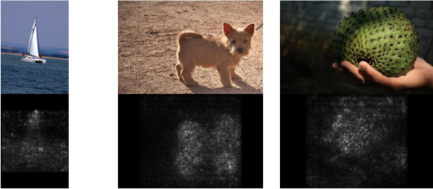
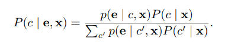
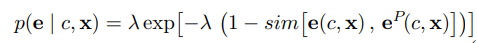
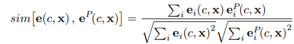
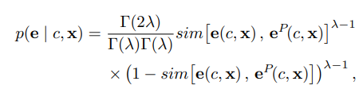
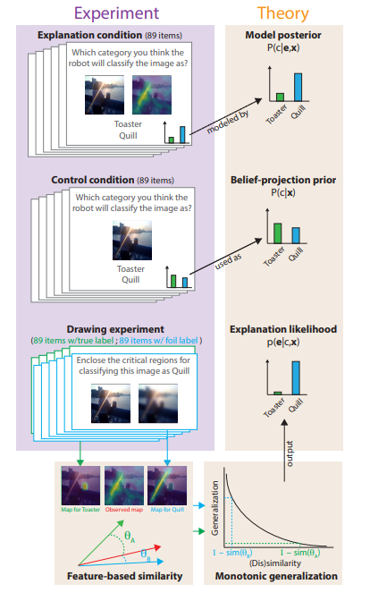
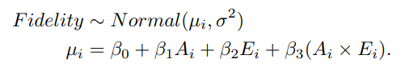
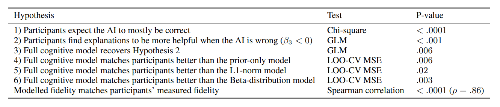
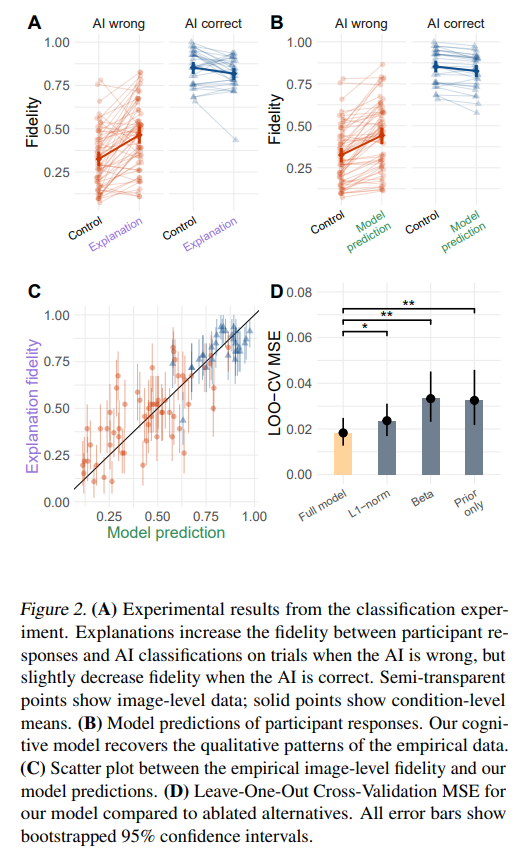
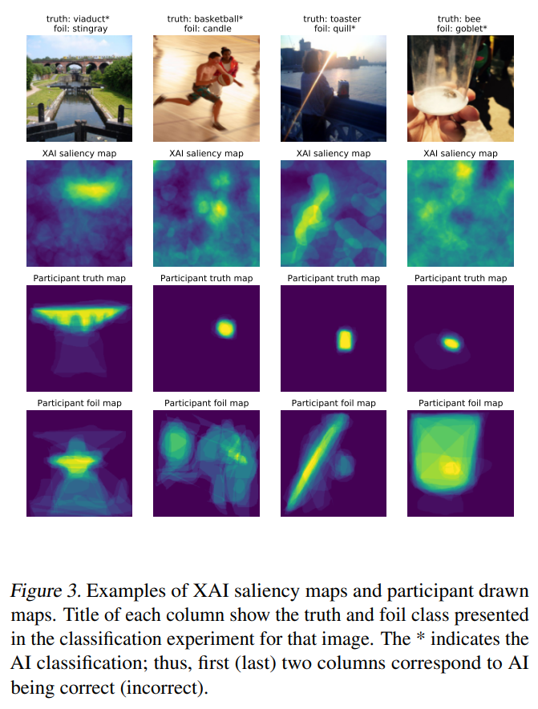

# **[Review] A Psychological Theory of Explainability**
##### - _Scott Cheng-Hsin Yang, Tomas Folke, Patrick Shafto_
--- 
## **0. Background**

- **Explainable Aritificial Intelligence(XAI)**
	- 사용자가 머신러닝 알고리즘으로 생성된 결과와 출력을 이해하고, 신뢰할 수 있게 하는 일련의 프로세스와 방법

- **Saliency Map(중요도 맵)**
	- 하나의 이미지 샘플이 모델의 입력값으로 들어가면, 그 샘플의 예측 결과에 대한 설명을 이미지에 중요한 부분을 하이라이트하여 나타낸 Map

<!--  -->

- **Shepard's Universal Law (Universal law of generalization)**
	- [Toward a Universal Law of Generalization for Psychological Science - Roger N. Shepard, 1987](https://www.science.org/doi/epdf/10.1126/science.3629243?adobe_mc=MCMID%3D07004964442004243812920810229554019954%7CMCORGID%3D242B6472541199F70A4C98A6%2540AdobeOrg%7CTS%3D1712640865)
	- 하나의 자극에 대한 반응이 다른 자극에 일반화될 확률이 심리적 공간에서 두 자극사이의 "거리"의 함수라는 인지이론
	- EX) 이전 벌레에 대한 경험을 바탕으로 다른 벌레가 식용 가능한지 결정하는 새 
		→ 이전의 벌레와 새로운 벌레가 심리적 거리가 가까울수록 일반화가 됨
		→ 심리적 거리(X축)와 일반화의 확률(Y축)이 단조감소의 관계의 가지고 있음

<!-- 
  
 -->

---
## **1. Introduction**

Explainable Artificial Intelligence (XAI)의 목적은 사람이 이해할 수 있는 설명을 만들어내는 것이다. 이는 사람이 target AI 시스템을 이해(Understanding)한다는 것은 의미하는데, 이해란 AI의 input-output mapping이 인간의 정신적 모델과 얼마나 조화되는지를 의미한다. 기존의 XAI연구들은 신뢰도와 설명 복잡도에 연관된 기술적인 지표에서 높은 성능을 내는 방법 개발에 초점을 맞춰왔다. 하지만 주어진 상황에서 어떤 방법이 잘 들어맞는지 평가하는 방법이 없다. 즉, AI가 생성한 설명을 사람이 어떻게 해석하는지 계산할 수 있는 정확한 이론이 부재하다. 

좋은 설명은 AI의 추론이 인간의 정신적 모델과 조화를 이루도록 인간의 정신적 모델을 변형시킨다. 따라서 설명이론(Theory of Explainability)은 베이지안 추론으로 모델링 할 수 있다. AI의 추론에 대한 인간의 초기 인식을 사전분포(Prior)로 설정하고, AI의 설명을 우도함수(Likelihood)로 설정하면 이 우도함수가 인간의 추론 과정을 포착한다. 

본 논문은 인간이 AI시스템을 다른 일반적인 사물들처럼 받아들인다고 가정하고, 심리학적인 이론을 활용한 모델을 제안한다. 즉, 사람들은 자신의 신념을 AI모델에 투영하고 자신의 설명을 AI의 설명과 비교하여 이 신념을 업데이트 한다. 저자는 이러한 아이디어를 구체화하기 위해 인지모델을 구축했고, 이 모델의 예측을 실제 인간의 추론 결과와 비교했다.    

---
## **2. Motivation**  
 
 >**Calls for human-centered explainability**
>>최근 들어 기존 XAI분야의 지식을 종합하고 분류하려는 시도들이 매우 많이 되고 있다. 영향력 있는 연구들은 **'설명 가능성'** 의 정의에서 인간의 이해를 핵심 가치로 두고 있고, 이에 대한 수학적 형식화(formalization)의 부재를 지적한다. 하지만 XAI에 대한 연구는 인간의 해석 가능성 보다 설명하고자 하는 AI 시스템의 동작을 얼마나 정확하게 포착하는지에 많이 집중되고 있다. 이처럼 해석 가능성에 대한 이론 연구가 없는 경우, XAI 연구의 해석 가능성(interpretability of explanations) 은 비용이 높고 운영이 어려운 사용자 연구를 통해서만 평가할 수 있다. 또한, XAI의 응용 분야가 다양하고 새로운 방법이 등장하는 속도가 빠르기 때문에 이러한 경험주의적 관점으로는 특정 문제에 적합한 XAI방법을 결정하기 어렵다. 따라서 경험적인 관점을 어느 정도 일반화 하기 위한 이론이 필요하다. 

>**Practical issues with explanations** 
>>경험적인 실증 연구에 대한 문제점도 존재한다. 실무자들은 잘못된 믿음을 조장하기 위해 설명을 과잉 해석하거나 과소 사용할 수 있다. 또 서로 다른 XAI의 설명이 일치하지 않거나 잘못된 설명이 사람들을 오도 할 수 있다. 따라서 정량적인 이론을 구축하는 것이 필요하다. 

>**Interpretability and explanation sparsity**
>>일부 연구자들은 해석가능성을 해석의 간결성(Sparsity of the explanation, 간결성이라고 번역함)과 혼동하기도 한다. 일반적으로 해석이 복잡한 것 보다 간결한 것이 선호되는 것은 사실이지만 해석 가능성을 이야기 할 때 간결성 만을 고려할 수는 없다. 해석 가능성과 표현력 간에 Trade-off가 존재하기에, 해석 복잡도를 낮추는 게 항상 좋지 만은 않다. 무엇보다도 해석의 간결성에만 초점을 맞추게 되면 인간이 이해를 하는데 있어서 가장 중요한 인간의 추론적 편향을 무시하게 된다.

>**Black-box models of inference from explanations**
>>BlackBox 통계 기법으로 설명이 인간들에게 미치는 영향을 시뮬레이션 하려는 시도가 있었다. 그들은 지도학습을 활용하여 설명자 모델을 구축했고 이를 테스트 했지만, 이 또한 실제 인간들의 설명과 정성적으로 비교했을 뿐이었다. 이 모델이 정량적으로 설명가능성을 테스트 했다고 하더라도 모델 자체가 BlackBox이기 때문에 일반화 측면에서 여전히 부족하다. 

---
## **3. Theory**  
### **3.1. Hypotheses**

본 논문에서는 사회 인지와 신경과학 이론들을 차용해 모델을 구축하였고, 이에 대한 타당성을 검증하기 위해 다음 6가지 가설을 세웠다.

사람들은 각자 자신의 신념을 AI에 투영하고, AI의 행동을 예측하기 위해서 유사성 공간(Similarity space)에서 일반화된 설명을 통해 자신의 신념을 업데이트 한다. 다시 말해 신념 업데이트는 사람들이 자신의 설명과 AI의 설명을 비교하여 이 둘이 합치하도록 기존 신념을 업데이트 한다는 의미이다.   
* _**Hypothesis1**_
  인간은 AI 시스템을 완전히 새로운 객체로 보지 않고 기본적으로 자신의 신념을 투영할 것이다.
* _**Hypothesis2**_
  성공적인 설명은 AI에 대한 인간의 신념 투영이 잘못되었을 때, 이를 올바른 방향으로 개선시킬 수 있도록 정보를 제공한다.  (AI의 행동과 인간의 신념 간의 fidelity가 높아진다는 의미)
    \* fidelity : 인간이 예측한 AI의 추론과 실제 AI의 추론이 일치할 확률  
* _**Hypothesis3**_
  인간의 신념에 대한 설명의 효과는 AI의 설명이 인간의 설명과 얼마나 잘 일치하는지에 따라 달라지며, 이는 유사성 공간에서 일반화를 통해 정량적으로 예측될 수 있다.

성공적인 설명은 AI에 대한 인간의 신념을 실제 AI의 행동을 기반으로 업데이트 한다. 따라서 이는 베이지안 추론으로 모델링 할 수 있다. 정확한 인지 모델은 기존의 인간 신념(Prior)에만 의존하지 않고 AI의 설명(Likelihood)에 노출된 이후의 신념을 더 잘 포착해야한다. 
* _**Hypothesis4**_
  사전 정보만을 활용한 모델보다 AI의 설명 정보를 포함하는 우리의 이론이 설명의 측면에서 더 우월할 것이다.  
	\*  $(Prior, 인간의 신념) < (Prior+Likelihood, 인간의 신념 + AI의 설명)$

신념 업데이트에 대한 정량적인 평가는 유사성 공간(Similarity space)에서 진행된다. 인간의 설명과 AI의 설명이 유사성 공간에서 얼마나 가까운지 평가하기 위해서 Slomon similarity (Symmetric feature based similarity meaure, _Slomon & Rips, 1998_, 코사인 유사도와 같음)를 활용했고, 이를 L1 거리와 비교했다. 
* _**Hypothesis5**_
  심리학적으로 더 자연스러운 유사성 공간(코사인 유사도)에서 인간의 설명과 AI의 설명의 유사성이 L1거리보다 더 가까울 것이다.

Shepard는 유사성 공간에서 자극 사이의 일반화가 지수함수처럼 단조 감소한다는 것을 증명했다(_Shepard, 1987_). 이 법칙을 테스트 하기 위해 단조 감소 개형을 따르지 않는 베타분포    $\beta(\lambda, \lambda)$ 를 하나의 우도함수로 설정하고 제안된 모델과 비교했다. 
* _**Hypothesis6**_
  단조 감소하는 우도함수가 비단조적인 우도함수보다 인간의 신념을 더 잘 포착할 것이다.
### **3.2. Formalism**

**Image Classification Task** 상황에서 실험을 진행했고 수식화에 대한 설명은 다음과 같다.
- $c$ = 클래스의 수 
- $\mathbf{x}$ = input image (W x H pixels)
- $f(\mathbf{x},c)$ = black-box  AI  model
    * $\mathbf{x},c$ 를 input으로 넣으면 $\mathbf{x}$가 $c$일 확률을 ouput으로 산출함
- $g(\mathbf{x},c,f)$ = saliency-map XAI method (중요도 맵, 이미지의 어떤 부분을 보고 인간이 판단하는지나타내는 기술)  
- $\mathbf{e}\in[0,1]^{W \* H}$ = explanation (이미지에서 각 픽셀의 중요도)

본 논문에서 모델링 하고자 하는 주된 지표는 이미지, 중요도(설명) 그리고 클래스가 주어졌을 때, 인간의 추론이다. 이는  $P(c\vert\mathbf{e,x})$로 표현 가능하고 베이지안 법칙에 따라 다음과 같이 나타낼 수 있다.  

 (1)

<!--   (1)   -->
여기서 $P(c\vert\mathbf{x})$는 어떤 설명도 없을 때 인간의 신념을 나타낸 사전분포(Prior) 이고, $p(\mathbf{e}\vert c,\mathbf{x})$는 AI의 설명을 우도함수(Likelihood)로 표현한 것이다. 
#### **Likelihood construction**
  우도함수를 구성하기 위해 직관적으로 인간이 AI의 설명을 자신의 설명과 비교하여 해석한다고 생각할 수 있다. 만약 AI의 설명이 자신의 설명과 유사하다면 그 설명은 관찰자의 추론을 해당 클래스에 더 가깝도록 만들어준다. 이러한 직관을 정량화 하기 위해 Shepard's universal law of generalization (Shepard, 1987)을 활용했다. 이에 따라 우도함수를 AI의 Saliency map($\mathbf{e}$)(AI의 설명)과 인간의 Saliecy map($\mathbf{e}^P$)(인간의 설명) 간 비유사성이 감소하도록 다음과 같이 설정했다.

 (2)
<!--   (2)   -->

  $\lambda$ 는 유일한 하이퍼 파라미터로, 일반화와 유사성 사이의 감소속도를 보정한다.

  유사도 함수로는 Sloman similarity(Sloman & Rips, 1998) 즉, 코사인 유사도를 사용한다.
 (3)
<!--   (3)   -->

#### **Ablation models**
  인지모델이 Saliency map을 통한 인간의 신념 업데이트를 성공적으로 포착하는지 평가하기 위해서 3가지 Ablation model을 만들었다.
  
 **1. prior-only model**
  우도함수를 제외한 Prior only 모델 (Prior = Posterior)

 **2. L1-norm model**
  유사도 함수에서 코사인 유사도(3)가 아닌 L1-norm을 사용한 모델 
  - 사람의 인지모델에는 코사인 유사도가 더욱 자연스러움
 
 **3. Beta-distribution model**
  (2)에서 지수분포 기반 우도함수가 아닌 베타분포 ($\beta(\lambda,\lambda)$) 우도함수를 설정 
  - Shepard에 의하면 유사성과 일반화의 관계는 단조감소를 따름

 (4)
<!--    (4)   -->

  $\Gamma(\cdot) = gamma function , \quad (\alpha = \beta = \lambda)$

**Figure1. 실험과정의 수식화 framework**  

<!--  -->

---
## **4. Experiments**  

본 논문에서 제안한 인지 모델을 검증하기 위해 Image Classification 상황에서 실험을 진행했다. 참가자들은 이미지 $\mathbf{x}$를 보고 AI가 두 가지 클래스 중에 어떤 클래스로 이미지를 분류할지 대답하게 된다.**(Classification Experiment)**  
그리고 Saliency map의 영향을 보기 위해서 참가자들에게 이미지의 어떤 영역이 분류를 함에 있어서 중요한지 표시해달라고 한다.**(Drawing Experiment)**

- **Classification Experiment**  
	* 참가자들은 이미지를 보고 AI이 어떻게 이미지를 분류할 것 같은지 예측한다.
	* 2가지 상황에서 실험
		* Control Condition (without explanation)
		* Explanation Condition (with saliency map )

- **Drawing Experiment**  
	 * 참가자들은 이미지를 보고 이미지의 어떤 부분이 분류에 중요한지 표시한다.
	 * 2가지 상황에서 실험
		 * Ground-truth condition → "enclose CATEGORY_NAME" 
		 * Foil condition → "enclose the critical regions you believe the robot attended to when determining the image contains CATEGORY NAME”

- **Model evaluation**  
	* Fitting Parameter : MSE를 최소화하는 $\lambda$값 설정
	* Leave-one-out cross-validation : LOO-CV MSE를 통해 Full model과 ablated models간 paired t-test 진행

#### **Statistical analysis Strategy** 
  
  앞서 설정한 6가지 가설에 대하여 어떻게 통계적으로 검정할 것인지를 기술한다.

> _**Hypothesis1**_
>> AI에 대해 인간은 기본적으로 신념을 투영한다.  
>> → AI에 대한 인간의 신념이 Uniform distribution이 아님을 검정 (Chi-squared test)

  \* $P(c=c_ {AI}\vert\mathbf{x})$ : control condition에서 fidelity , $P^*(c=c_ {AI}\vert\mathbf{e,x})$ : explanation condition에서 fidelity
> _**Hypothesis2**_
>> 성공적인 설명은 인간의 신념투영이 틀렸을 때, fidelity를 개선하는 방향으로 정보를 제공한다.  
>> → 인간이 예측한 AI의 추론과 실제 AI의 추론 간의 fidelity를 선형회귀를 사용하여 계산
>> 
<!-- >>    -->
>>
>> $A_ i = AI가\;이미지를\;제대로\;분류하면\;\;1,아니면\;\;0$
>> $E_ i = explanatioin\;condition(설명\;제공)\;이면\;\;1,control\;condition(설명\;비제공)이면\;\;0$

  > _**Hypothesis3**_
>> 제안된 모델은 Control condition에서 Explanation condition으로 갈 때의 fidelity 변화를 포착한다.   
  → Hypothesis2에서 fidelity를 $P(c=c_ {AI}\vert\mathbf{e,x})$ : control condition, $P^*(c=c_ {AI}\vert\mathbf{e,x})$ : explanation condition으로 변형하여 회귀분석을 시행

> _**Hypothesis4**_
>> 사전 정보만을 활용한 모델보다 우리의 이론이 설명의 측면에서 더 우월할 것이다.   
>> → Prior-only model과 full model 간의 MSE 비교

> _**Hypothesis5**_
>> 코사인 유사도로 우도함수를 계산하는 것이 L1-norm보다 좋을 것이다.  
>> → L1-norm을 활용했을 때와 코사인 유사도를 사용했을 때 MSE 비교

> _**Hypothesis6**_
>> 유사성과 일반화 사이에는 단조감소의 관계가 있다.  
>> → 베타분포를 우도함수로 사용한 모델과와 MSE 비교
 
> _**Not preregistered analysis**_
>> 사전에 설명한 가설은 아니지만 모델의 사후분포가 경험적 분포와 얼마나 잘 일치하는지 확인  
>> → 두 분포의 fidelty간 관계를 Spearman correlation 테스트
---
## **5. Results**  

테스트 하고자 했던 6가지 가설과 추가적인 상관분석 까지 총 7가지의 통계적 테스트 결과는 다음과 같다. 모든 결과가 통계적으로 유의함을 확인할 수 있다. 
<!--  -->

<!--    -->

A: AI의 설명은 AI가 틀렸을 때, 인간의 응답과 AI의 추론결과 간의 fidelity를 더욱 향상시켰다. (_Hypothesis2_)  
B: 제안된 인지모델은 경험적인 결과와 비슷한 경향성을 보임으로써 해당 모델이 실제 상황과 정성적으로 일치함을 확인할 수 있다.  
C: 경험적 데이터의 fidelity와 model이 예측한 fidelify간의 상관관계를 그래프에 도시하여 나타내었다. ($Spearman's\;\rho = 0.86,\;p<0.0001$)  
D: Full model의 경우 다른 ablated model보다 MSE측면에서 더 높은 성능을 보이고 있다.

<!--   -->

본 그림은 XAI의 설명(Saliency map)과 인간의 설명을 비교하여 나타낸 것이다. 이는 AI의 설명이 사람에게 미치는 영향을 좀 더 직관적으로 해석할 수 있게 해준다. 즉, 제안된 인지모델이 설명에 노출된 이후 fidelity의 변화를 잘 포착하고 있다.

---
## **6. Conclusion**  

본 논문에서는 심리학적인 이론을 바탕으로 간단하지만 정량적인 XAI 인지모델을 제안했다. 이 모델이 시사하는 것은 인간이 자신의 신념을 투영함으로써 AI시스템을 자신들과 같은 방식으로 생각할 것이라고 여긴다는 점이다. 이 모델은 XAI분야에서 인간의 추론을 정량적으로 평가했다는 점에서 의미가 있고, 또 인지과학의 이론구조를 XAI에 분야에 접목시켜서 두 분야를 연결했다는 점에서 의미가 있다.  
#### **Broader impacts** 
  
1. 이 이론은 인지과학의 이론을 차용함으로써 인간의 행동을 더욱 잘 표현하고, XAI의 성능을 향상시킨다.
2. AI의 설명에 대한 인간의 추론을 일반화한 이론을 개발하였으므로 다른 XAI방법론에서 검증없이 재사용 할 수 있다.
3. 본 논문은 인간과 머신 구성요소를 더 잘 통합함으로써 설명가능성에 대한 이해를 향상시킨다.

---
* [[ICML2022] Short Talks](https://slideslive.com/38983796/a-psychological-theory-of-explainability?locale=cs&ref=recommended)
* [[ICML2022] A Psychological Theory of Explainability](https://arxiv.org/abs/2205.08452)
