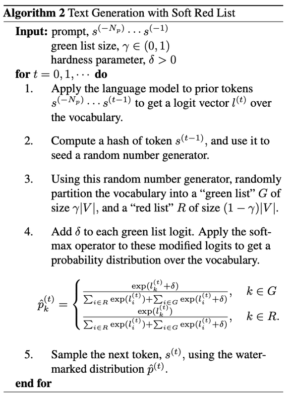
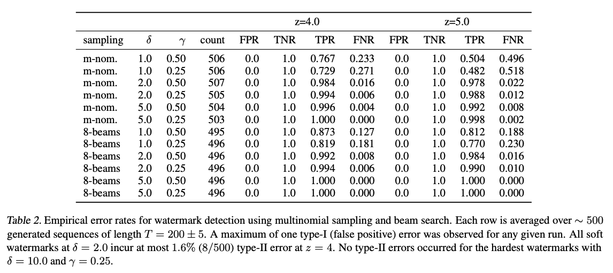
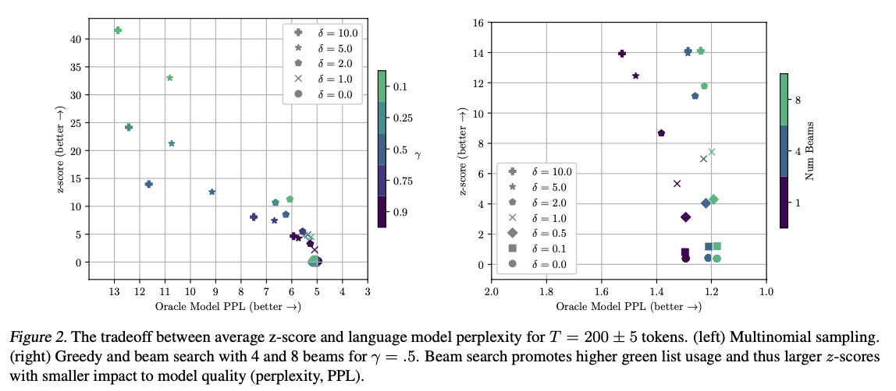

# A Watermark for Large Language Models

## Introduction/motivation
Since the introduction of the transformer architecture there has been a revolution in the capabilities of AI models, more specifically Large Language Models (LLM), when it comes to process and generate text. These new abilities have in many terms changed the way we handle text data, by making it exceedingly easier to reform and generate any sort of text in any style one wants. As there are many positive aspects of this there are also associated risks with potential misuse in terms of manipulation campaigns on social media, where LLMs could be used to generate false information. There are also problems with academic cheating where a LLM could be used to generate code or text on a human level capability. Hence, there exists a need to be able to differentiate humanely produced code or text to that of an AI. 

Kirchenbauer et.al (2023) propose a soft-watermark for LLMs which makes detection of AI generated text easily available with a very small error. 

## Method
The basic idea of this soft-watermark algorithm proposed in the paper is to divide the tokens in the model's vocabulary $V$ into a red list and a green list of tokens, before the next token of the sequence is generated. The split itself, i.e. which tokens that fall into the red respective green list, is dependent on the previous token in the sequence, which is used as a hashed seed to a pseudo-random algorithm defined as the 'red list rule' in the paper. The model should then, to some probability threshold, choose tokens from the green list over the tokens in the red list. Before diving into the process in greater detail I find it important to explain some terminology used:

- To represent sequence of tokens of length $T$ it is denoted as $s^{(0)}, \ldots, s^{(T)}$, where $s^{(i)}$ represent token $i$. In the sense of input prompts, it is usually represented with negative indices $s^{(-N)}, \ldots, s^{(-1)}$ where $N$ in this case is the length of the input. 
- The Null hypothesis used is $H_0$: "The text sequence is generated with no knowledge of the red list rule." (Kirchenbauer et.al, 2023).
- In the paper a z-test is used to evaluate the null hypothesis, i.e statistically assess how likely a text was generated by an AI. This is done by analyzing the distribution of green tokens in the text and estimate how likely that distribution would have been under normal conditions. The Null hypothesis is rejected when the z-value is over a certain threshold, thus the distribution of green words is unlikely without knowledge of the red list rule. 
- The parameters to the soft-watermarked algorithm are green list size proportion, $\gamma \in (0, 1)$, and hardness, $\delta > 0$, to which extent the algorithm should choose a token from the green list over the red list. 

To understand the algorithm in greater detail it is essential to understand the mechanism behind the red list rule. By the nature of the inner workings of a LLM, the logit vector produced for token $T+1$ in the sequence depends on earlier tokens in the sequence, i.e. $s^{(-N)}, \ldots, s^{(T)}$. The idea of the hashing to the random number generator is similar, using the earlier token of the sequence, $s^{(T)}$. The hashed value is then used as a seed to the random number generator which partition the vocabulary $V$ into a green list of size $\gamma \times \vert V \vert$ and a red list of size $(1-\gamma) \times \vert V \vert$ for the next token in the sequence, $s^{(T+1)}$. The next step is to add the hardness $\delta$ to the logit vector for each token in the green list before applying the softmax function:

$
P_k^{(T+1)} = \frac{\exp(l_k^{(T+1)})}{\sum_i \exp(l_i^{(T+1)})}
$
, where $l_k^{(T+1)}$ is the logit value for token $k$ at the position $T+1$, and $P_k^{(T+1)}$ is the probability of choosing token $k$ at position $T+1$. The last step is to sample the token at position $T+1$ from the distribution $P^{(T+1)}$. 

<!--  -->

*Figure 1 shows pseudocode for the soft red list watermark algorithm provided in A Watermark for Large Language Models by Kirchenbauer et.al, 2023.*

### Metric for text quality
As the soft-watermark algorithm favors a subset of the tokens available in the model's vocabulary (tokens in the green list), one might assume that there is a negative side effect on the text quality. To measure text quality the paper uses perplexity as metric. The method involves comparing the watermarked output to that of an, as described in the appendix of the paper, "oracle model" to assess how well the watermarked output matches the "perfect" oracle's sequence.

### Watermark detection algorithm
For the detection of a watermarked text one needs the pseudo-random algorithm to identify the red respectively green tokens. This can be granted without access to the model itself. Secondly, a statistical test as the z-test is used to measure the deviation of green list tokens used to that if the red list wasn't known. If the deviation is significant, e.i. over a predetermined threshold, the text is identified as watermarked. 

## Entropy
Before analyzing the results it is crucial to understand the concept of entropy and how it relates to watermarking an AI produced text. In the context of watermarking, entropy aims to explain the distribution of meaningful tokens as the next token in the sequence. Essentially, if there are many meaningful tokens to choose from, the distribution can be explained to be more uniform and hence the entropy is high, reversely if there are only a few or one token that meaningfully fits the sequence, the entropy is low. Therefore watermarking won't be as effective given a low entropy sequence as the sequence will be more predictable. Mathematically the spike entropy as the paper uses can be explained as:
$
S(p, z) = \sum_k \left(\frac{p_k}{1 + z p_k}\right) 
$
where $p$ is a discrete probability vector over the tokens and $z$ is a scalar. 

For clarification, a concrete example of how low entropy negatively affects watermarking is "The band who created Bohemian Rhapsody is...". Here the mass of probability is centered around one single token which is "Queen", therefore the partitioning between the red and green list has no effect as the soft watermarking algorithm will choose "Queen" regardless of which list it is in. Fortunately, as the effectiveness depends on the average entropy over the sequence, a long enough sequence will include sufficiently many green tokens to significantly deviate from a distribution of tokens where the red list rule is not known. The paper mathematically explains the the expected amount of green tokens for a sequence of length $T$ as:

$
E {\vert s \vert}_ {G} \geq \frac{\gamma \alpha T S^{\*}}{1 + (\alpha - 1) \gamma}
$
 .where 
$S^{\*} \leq \frac{1}{T} \sum_{t} S\left(p^{(t)}, \frac{(1-\gamma)(\alpha-1)}{1 + (\alpha-1)\gamma}\right)$
i.e. the average spike entropy of the sequence given length $T$, $\vert s \vert _G$ the number of green list tokens in the sequence, $\alpha$ is $exp(\delta)$, $\delta$ hardness, $\gamma$ green list size proportion.

With the variance: 
$
\text{Var} {\vert s \vert}_ {G} \leq \frac{T \gamma \alpha S^{\*}}{1 + (\alpha - 1)\gamma} \left(1 - \frac{\gamma \alpha S^{\*}}{1 + (\alpha - 1)\gamma}\right)
$.

## Experiment
- There is a deviation in the experiments from a real world application in that the paper assumes that the red list is sampled randomly from a uniform distribution and not produced by a semi-random algorithm.
- The LLM used for generating the synthetic text is the OPT-1.3B model (Zhang et al., 2022). 
- For sampling the next token in the sequence multinomial sampling and beam search was used.
- The paper primarily focuses on two types of errors, type-I and type-II:

  - Type-I, also known as False Positive, describes an error when the watermark detection algorithm incorrectly identifies a text to be AI generated.
  - Type-II, also known as False Negative, describes an error when the watermark detection algorithm fails to recognize a text as AI generated. 

## Result

*Error depending on input parameters and statistical significance*

<!--  -->

*Tradeoff between watermark strength and text quality*

<!--  -->

## Discussion
The result shows that the type-I error is 0 for all combinations of parameter values, i.e none of the human written samples were incorrectly identified as AI-generated. However, there is a small type-II error for the majority of the used parameter values, where the watermark fails to be detected and some AI-generated text therefore is identified as human written. Primarily, this is due to a low hardness, which makes it hard to distinguish a human written text to that of an AI when the entropy is low and therefore contains less green tokens. To increase the hardness is not an obvious solution here, as there is a tradeoff, shown in Figure 2, between watermarking strength and perplexity, i.e. text quality. Therefore one has to make a tradeoff between the two using the parameters  $\delta$ and $\gamma$.

I find it worth mentioning that the paper delves into several other topics regarding the watermarking, such as private watermarking and attacking the watermarking. However, since I find these topics as not directly related to the result, but more towards the application and implementation of the algorithm, I decided to leave them out of the summarization. 

## References

Kirchenbauer, J., Geiping, J., Wen, Y., Katz, J., Miers, I., & Goldstein, T. (2023). A Watermark for Large Language Models. Available at: https://doi.org/10.48550/arXiv.2301.10226 

Zhang, S., Roller, S., Goyal, N., Artetxe, M., Chen, M., Chen, S., Dewan, C., Diab, M., Li, X., Lin, X. V., Mi- haylov, T., Ott, M., Shleifer, S., Shuster, K., Simig, D., Koura, P. S., Sridhar, A., Wang, T., and Zettlemoyer, L. (2022). OPT: Open Pre-trained Transformer Language Models. Available at: https://doi.org/10.48550/arXiv.2205.01068 
