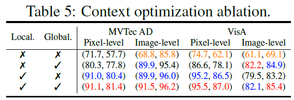

# **[ICLR 24] [AnomalyCLIP: Object-agnostic Prompt Learning for Zero-shot Anomaly Detection](https://arxiv.org/pdf/2310.18961.pdf)** 

## **1. Introduction**  
Zero-shot Anomaly Detection(ZSAD)이란 target dataset에 대한 어떠한 training sample도 사용하지 않고 anomalies를 감지하는 task를 일컫는다.
다음과 같은 상황일 때, ZSAD를 필요로 한다.
1. Training dataset에 대한 접근이 데이터 보호 정책 위반인 경우
2. Target domain에 관련된 training sample이 없는 경우

시나리오에 따라 Anomalies의 형태가 다양하기 때문에, ZSAD는 강력한 generalization 능력이 필요하다. 최근에는 CLIP과 같은 pre-trained Vision-Language Model(VLM)이 다양한 task에서 강력한 generalization 능력을 보여주고 있다.

CLIP와 같은 VLM은 주로 이미지의 foreground object의 의미론적 정보와 일치하도록 훈련되어 있어 이상/정상을 구분하는 능력이 부족하다. 게다가 현재의 ZSAD 방식은 text prompt를 수동(ex. "_a photo of a [cls] for visual inspection_")으로 정의하거나 학습 가능한 prompt를 사용하는 데, 종종 전역적인 특징을 위한 prompt embedding이 사용되어 미세한 지역적인 특징에서 나타나는 이상치를 효과적으로 포착하지 못한다. Fig.1d와 Fig.1e를 통해, 이를 확인할 수 있다.

<!--  -->

Fig.1a와 Fig.1b를 보면, 전경 object의 의미론적 정보는 다르지만, 이상 패턴은 비슷하다는 것을 알 수 있다. Fig. 1c와 Fig. 1f를 비교했을 때, CLIP 모델의 text prompt embedding은 다른 domain에 일반화 되어있지 않지만 AnomalyCLIP의 object-agnostic text prompt embedding은 다른 domain에서 이상을 감지하는 데에 일반화 되어있음을 알 수 있다.

## **2. Preliminary: CLIP**  
CLIP 모델은 Text Encoder와 Visual Encoder로 구성된다. 두 Encoder는 ViT와 같은 mainstream multi-layer network이다. 일반적으로 Zero-shot recognition을 위해 다른 class의 Embedding을 얻는 방법으로 text prompt를 사용한다. 
class name $c$와 함께 text prompt template $G$가 text encoder $T(\cdot)$을 통과하면 그에 상응하는 text embedding $g_c$을 얻을 수 있다. CLIP에서 흔히 사용되는 text prompt template은 “_A photo of a_ [cls]” 이다. 여기서 [cls]는 target class의 이름을 의미한다.
image $x_i$가 image encoder $F(\cdot)$을 통과하면 global visual embedding $f_i$와 local visual embedding $f_i^m$을 얻을 수 있다.

CLIP은 textual embedding과 visual embedding 사이 cosine similarity를 측정함으로써 Zero-shot recognition을 수행한다.
$p(y=c \mid x_i) =P(g_c,f_i)=\frac{exp(<g_c,f_i>/\tau)}{\sum_{c \in \mathcal{C}}exp(<g_c,f_i>/\tau)}$
>$\tau$ = temperature hyperparameter

>$<\cdot,\cdot>$ = cosine similarity

ZSAD를 수행할 때, 정상 text prompt $g_n$, 이상 text prompt $g_a$를 설계하고, 위 식에 따라 두 class의 가능성을 계산한다. 
Anomaly Score로는 $P(g_a,f_i)$를 사용한다.

각 pixel entry $(j,k)$에서 정상 및 이상 segmentation map $S_n,S_a$은 다음과 같이 구한다.
$S_n = P(g_n, f_i^{m(j,k)}),  S_a = P(g_a, f_i^{m(j,k)})$

## **3. Method**  
### Overview

<!--  -->
AnomalyCLIP은 object-agnostic prompt learning을 통해 CLIP을 ZSAD에 adaptation 합니다.
먼저 일반화된 embedding을 학습하기 위해 정상(normality)과 이상(abnormality) text prompt를 설계하는 object-agnostic text prompt template을 도입한다.
이러한 text prompt template의 학습하기 위해, global and local anomaly sementics를 포함하는 global and local context optimization을 사용한다.
Text prompt tuning과 DPAM이 CLIP의 textual space와 local visual space에서 학습을 돕기 위해 사용된다.
Text encoder와 visual encoder의 여러 중간 layer를 통합하여 생성한 similarity map을 통해 local visual detail을 제공한다.
훈련 중에는 모든 module이 global context와 local context의 조합에 의해 공동으로 최적화 된다.
추론 중에는 text와 global/local visual embedding의 불일치를 양적으로 측정하여 anomaly score와 anomaly map을 각각 얻는다.

### Object-agnostic text prompt design
CLIP에서 보통 “_A photo of a_ [cls]”의 형태로 text prompt template을 사용하며 주로 object의 의미론적 정보에 초점을 둔다. 그 결과, visual embedding에 상응하는 정상 및 이상 의미론적 정보를 포착한 textual embedding을 생성하지 못한다.
해결책으로 특정한 이상 종류를 포함하여 “_A photo of a_ [cls] _with scratches_”처럼 template을 설계 할 수 있다.

[Example] MVTec dataset의 metal nut class
<!--  -->

다양한 결함을 감지하고 종합적인 이상 의미론적 정보를 다루도록  "_damaged_ [cls]"로 template을 설계했다. 그럼에도 pre-trained CLIP이 정상 및 이상 대신에 object 의미론적 정보의 정렬에 집중해서 문제를 해결 할 수 없었다. 이러한 한계를 극복하기 위해, learnable text prompt template과 AD와 관련 있는 보조 데이터를 활용한 prompt tuning을 도입했다.
 이러한 과정에서 learnable template은 정상과 이상을 잘 구분하는 text embedding을 초래하며, 넓고 자세한 이상 의미론적 정보를 포함할 수 있다. 이 template을 object-aware text prompt templates로 정의한다.
#### _object-aware text prompt templates_
$g_n = [V_1][V_2] \ldots |V_E|[\text{cls}]$

$g_a =  [W_1][W_2] \ldots |W_E|[\text{damaged}][\text{cls}]$
> $[V]_i,[W]_i (i \in 1, \ldots , E)$ = learnable word embedding

ZSAD에는 학습에 방해되는 object 의미론적 정보가 필요 없다. 따라서 object 의미론적 정보를 object-aware text prompt templates에 포함시키는 것은 불필요하다. 
$g_n$과 $g_a$의 class name을 "_object_"로 교체하여 object의 class 의미론적 정보를 차단한다. 이 template을 object-agnostic prompt templates로 정의한다.

#### _object-agnostic text prompt templates_
$g_n = [V_1][V_2] \ldots |V_E|[\text{object}]$

$g_a =  [W_1][W_2] \ldots |W_E|[\text{damaged}][\text{object}]$
> $[V]_i,[W]_i (i \in 1, \ldots , E)$ = learnable word embedding

object-agnostic prompt learning은 object 의미론적 정보와 관계없이 이미지의 일반적인 정상 및 이상을 포착하는 것을 목표로 한다.

### Learning Generic abnormality and normality prompt
#### _1) Glocal context optimization_
지역 및 전역적인 관점에서 정상 및 이상 prompt를 학습하는 공동 optimization 전략이다.

#### _Global context optimization_ 
* $L_{global}$  = 보조 데이터에서 정상 및 이상 이미지의 object-agnostic textual embedding과 visual embedding 간의 cosine similarity를 일치시키는 cross-entropy 손실

textual embedding이 이미지의 전역 visual embedding과 일치되어 전역 feature 관점에서 정상 및 이상 의미론적 정보를 포착하는 것을 돕는다.

#### _local context optimization_
* $L_ {local}=Focal(Up([S_{n,M_k}, S_{a,M_k}]),S) + Dice(Up(S_{n,M_k}), I - S)+Dice(Up(S_{a,M_k}),S)$
  
  $S_{n,Mk}^{(j,k)} = P(g_n, f_{i,M_k}^{m(j,k)}), \quad S_{a,Mk}^{(j,k)} = P(g_a, f_{i,M_k}^{m(j,k)}), \text{where} \quad j \in [1, H], k \in [1, W]$
  
>Ground truth segmentation mask $S \in \mathbb{R}^{H_{\text{image}} \times W_{\text{image}}}$
>
>(j,k)에 위치한 pixel이 이상치일 경우에는 $S^{(j,k)} = 1$, 그렇지 않을 경우에는 $S^{(j,k)} = 0$  
>$Up$ = Bilinear interpolation Upsampling  
>$I$ = 모든 값이 1인 행  

이상 영역은 일반적로 정상 영역보다 작다. 이러한 불균형 문제를 해결하기 위해 Focal loss를 사용한다.  
예측된 segmentation mask와 ground truth mask 간의 겹침을 측정하기 위해 Dice loss를 사용하여 정확한 decision boundary를 설정하도록 한다.  
결과적으로 object-agnostic text prompt가 visual encoder의 중간 layer M으로부터 미세한 지역 이상치 부분을 포착하도록 돕는다.

최종적으론 두 손실 함수를 함께 사용하여 최적화 한다.
* $L_{total}  = L_{global} + \lambda \sum_{M_k \in \mathcal{M}} L_\mathrm{local}^{M_k}$
>$\mathcal{M}$ = 사용된 중간 layer의 집합, $\lambda$ = hyperparameter

#### _2) Refinement of the textual space_
더 구별적인 text space의 학습을 용이하게 하기 위해, text prompt tuning을 도입해 CLIP의 text space를 개선한다.
text space를 정제하는 정도를 제어하기 위해서 learnable token embedding을 CLIP Text Encoder의 하단에서 상단 layer로 삽입한다.

$T_ m ([t_ m, {t'}_ m]) = [t_ {m+1} , {r'} _{m+1}]$

$T_ {m+1} ([t_ {m+1}, {t'}_ {m+1}]) = [t_ {m+2} , {r'}_ {m+2}]$
<!-- $T_{m+1}([t_{m+1},t'_{m+1}])=[t_{m+2},r'_{m+2}]$ -->
$\ldots$
$T_{M}(t_{M})=[t_{M+1}]$
>$[\cdot,\cdot]$ = concatenation 

CLIP Text Encoder의 m번째 layer인 Tm에 랜덤 초기화된 learnable token embedding ${t'}_ m$ 과 원래 token embedding $t_m$ 을 연결하여 전달한다. 그 결과로 $t_ {m+1}$ 과 ${r'}_ {m+1}$ 을 얻는다.
적절한 보정을 위해서 ${r'}_ {m+1}$ 을 버리고 새로운 learnable token embedding $t_ {m+1}$ 을 초기화한다. 이를 통해 ${t'}_ {m+1}$ 은 $m+1$ 번째 layer의 text representation을 더욱 정제합니다. 이 작업을 지정된 M번째 layer에 도달할 때 까지 반복한다.  ${r'}_ {m+1}$ 이 버려지더라도  self-attention 메커니즘으로 인해 $t_ {m+1}$ 의 출력에는 ${t'}_ {m}$ 의 정보가 포함된다.

CLIP Text Encoder는 위와 같은 fine-tuning 과정으로 AD 작업에 최적화 된다.

#### _3) Refinement of the local visual space_
#### _DPAM(Diagonally Prominent Attention Map)_
Visual Encoder의 Q-K attention을 Q-Q, K-K 및 V-V attention와 같이 대각선으로 두드러지는 attention으로 대체하여 지역 visual space을 정제한다. Fig.3c , Fig.3d, Fig.3e를 통해 정제된 DPAM attention map이 더욱 대각선으로 두드러지고 optimization을 위한 개선된 segmentation map을 얻을 수 있음을 확인할 수 있다.  AnomalyCLIP은 V-V attention에서 우수한 성능을 보인다. 
<!--  -->

#### _4) Training and inference_
훈련 단계에서 AnomalyCLIP은 AD와 관련된 보조 dataset을 사용하여 glocal 손실 함수를 최소화 한다.

추론 단계에서 image-level anomaly score로 similarity score $P(g_a, f_i)$를 사용한다. 
pixel-level anomaly score를 구하기 위해  모든 선택된 중간 layer의 segmentation Sn과 Sa을 병합하여 anomaly score map을 얻는다.

$Map = G_\sigma( \sum_{M_k \in \mathcal{M}}(\frac{1}{2}(I - Up(S_{n,M_k})) + \frac {1}{2}(Up(S_{a,M_k})))$
>$G_\sigma$ = Gaussian filter, $\sigma$는 smoothing을 조절한다.

## **4. Experiment**  
### **Experiment setup**  
* Dataset – 17 Publicly available datasets
	* Industrial inspection scenarios
		* MVTec
		* VisA
		* MPDD
		* BTAD
		* SDD
		* DAGM
		* DTD-Synthetic

	* Medical imaging
		* ISBI
		* CVC-ClinicDB
		* CVC-ColonDB
		* Kvasir
		* Endo
		* TN3k
		* HeadCT
		* BrainMRI
		* Br35H
		* COVID-19

* Evaluation Metric
	* AUROC
	* AP
	* AUPRO
	
### **Result**  
#### _ZSAD performance Comparison on industrial domain and medical domain_
<!--  -->

다른 dataset에서 ZSAD 성능을 평가할 때는 MVTec AD의 test data를 사용하여 AnomalyCLIP을 fine-tuning 했고, MVTec AD를 평가 할 때는 VisA의 test data를 사용하여 fine-tuning 했다.
AnomalyCLIP이 대부분 dataset에서 대체로 뛰어난 ZSAD 성능을 보여주며 다양한 domain의 다른 dataset에 일반화 할 수 있다.

#### _Segmentation Visualization_

<!--  -->

다른  method보다 AnomalyCLIP이 더욱 정확한 segmentation을 수행함을 알 수 있다.

#### _ZSAD performance on medical images when fine-tuned by medical images datasets_

<!--  -->

이전 결과로부터 industrial dataset과 medical dataset에서의 성능을 비교 했을 때, medical dataset에서의 성능이 상대적으로 낮은 것을 알 수 있다. 이는 prompt learning에 industrial dataset이 보조적으로 사용되었기 때문이다. Medical dataset을 사용하여 AnomalyCLIP을 fine-tuning하면 medical domain에서의 성능을 개선할 수 있다.

#### _Performance gain of using object-agnostic prompts compared to object-aware prompts_

<!--  -->

Object-aware prompts template을 사용한 경우와 비교하면, Object-agnostic prompts template을 사용한 경우가 image-level, pixel-level에서 모두 더 좋은 성능을 보여준다. 이는 Object-agnostic prompt가 일반적인 이상과 정상을 효과적으로 학습하는데 도움이 될 수 있는 것을 나타낸다.

### **Ablation Study**  
#### _Impact of Modules_
<!--  -->

* $T1$ - DPAM
* $T2$ - Object-agnostic text prompt
* $T3$ - text encoder에 learnable token 추가
* $T4$ - Multi-layer visual encoder feature 사용

Object-agnostic text prompt($T2$)가 AnomalyCLIP의 성능을 눈에 띄게 개선하였다.

#### _Impact of Context optimization_
<!--  -->

Global context optimization는 global anomaly semantics을 포착하여 더욱 정확한 image 수준의 감지를 가능하게 한다.
Local context optimization는 local anomaly semantics을 포함해 pixel 수준의 성능을 향상시키고 image 수준의 성능을 보완한다.
두 optimization을 통합함으로써, AnomalyCLIP은 일반적으로 optimization을 개별적으로 사용하는 것보다 더 나은 성능을 보여준다.

#### _Impact of DPAM strategy_

<!--  -->

일반적으로 AnomalyCLIP은 V-V attention을 사용한다. Q-Q attention을 사용한 경우는 기존 AnomalyCLIP과 유사한 segmentation 능력을 보여주지만 image 수준에서 이상치 감지 성능이 좋지 않다.
K-K attention의 경우는 anomaly classification는 잘 수행하지만 segmentation 성능이 Q-Q나 V-V attention을 사용한 경우보다 나쁘다.

## **5. Conclusion**  

본 논문은 Zero-shot Anomaly Detection에 대한 CLIP 모델의 일반화 성능을 개선하였다. 다양한 foreground object image dataset에 일반화를 위해서 일반적인 이상 및 정상 text prompts를 학습하는 object-agnostic prompt learning을 제시한다. 또한, object-agnostic text prompts가 global, local한 의미를 동시에 최적화 할 수 있도록 global and local context optimization을 사용한다. 이러한 CLIP 모델의 Zero-shot Anomaly Detection 일반화 성능을 높이려는 노력으로 17개의 public datasets에 우수한 Zero-shot Anomaly Detection 성능을 달성한 것이 인상 깊다.

개인적으로 느낌 한계점은 다음과 같다. object-agnostic prompt template에서 "damaged"라는 단어를 사용했다. 다양한 Anomaly Detection Senario에서 "damaged"가 왜 적합한지에 대한 설명이 빈약하다.  
추후 연구 방향성으로는 Open-Set Recognition(OSR)이나 One-class classification(OCC), Out-of-distribution(OOD) 같은 다른 Anomaly Detection Task도 잘 수행하도록 text prompt를 설계한다면 Foundation model에 다가갈 수 있을 것이다.

---  
## **Author Information**  

Yongmin Seo

* Affiliation: [KCVL@KAIST](https://sites.google.com/view/tkkim/)
* Research Topic: Anomaly Detection
* Contact: yongmin.seo@kaist.ac.kr

## **6. Reference & Additional materials**  

* Github Implementation
	* [Official Code](https://github.com/zqhang/AnomalyCLIP)  
* Reference  
	* [Zhou, Q., et al. "AnomalyCLIP: Object-agnostic Prompt Learning for Zero-shot Anomaly Detection," in _ICLR_, 2024.](https://arxiv.org/pdf/2310.18961.pdf)
<!--stackedit_data:
eyJoaXN0b3J5IjpbLTc4OTM0OTUzOCw5NTY0NzAyMjEsNTU2MD
k4MTIsMTA1NDg5OTU2MywtOTQ3NzQxNzkxLC0yMDE2NjQ2OTAs
LTkyOTIwMjY1NCwxNDU1NDgxMTYzLDE1OTY4Njk5MDAsLTI4MD
cwMjYyNCwtMTYxNTA0NjI5NSwtMzI4NTEwNDYzLC0xMDkyMDE5
MTE4LDM5NjQyMzY2LDEwMzE4NDYyMjYsMTk1MDE4NDg0MSwtMT
Q1MDk4ODkyNCw1MTU3OTAzMTVdfQ==
-->
