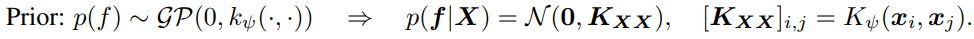
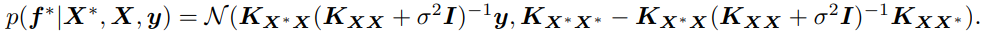
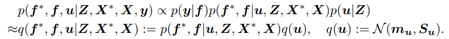
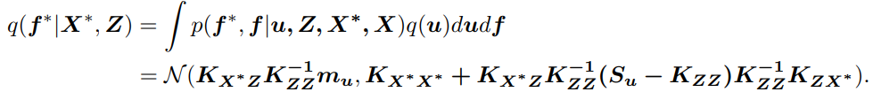
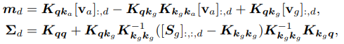
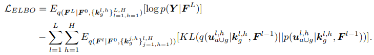

# **CALIBRATING TRANSFORMERS VIA SPARSE GAUSSIAN PROCESSES** 

## **0. Summary**  

Transformer에서 Multi-head attention blocks (MHAs)가 uncertainty calibration을 하지 못하는 점을 지적하며 이것의 output space에서 직접적으로 베이지안 추론을 할 수 있는 Sparse Gaussian Process Attention (SGPA) 라는 개념을 처음으로 제안하였음.

## **1. Introduction**
MHA의 구조를 가진 Transformers는 다양한 분야에서 성공적으로 사용되지만, calibrated uncertainty quantification(UQ)에 대해서는 많이 다루어 지지 않고 있었다. UQ에서는 베이지안 추론이 가장 강력한 방법론 중 하나이고, 다양한 뉴럴네트워크 모델에서 이미 UQ를 위해 사용 되어왔다. 그러한 베이지안 방법론 중 Gaussian Process (GP)는 reliable function-space uncertainty estiamtes에서는 가장 많이 쓰이는 방법론이기 때문에, 이 논문에서는 SGPA 방법론을 제안하는 것이다. 

이 논문의 핵심적인 contribution 은 (1) kernel-based attention 이 posterior mean of an sparse variational GP(SVGP)와 동치 관계에 있기 때문에, SGPA를 사용한 Transformer은 deep kernel 이 각각의 GP layer에 사용된 sparse deep GP라고 생각이 될 수 있고 (2) naive extension of SVGP 의 계산 비효율성을 해결하였고 (3) 실험적으로 in-distribution calibration, (out-of-distribution) OOD robustness, 그리고 OOD detection 에서 다른 모델보다 좋은 성능을 보였다.

## **2. Preliminaries**  
### 2.1 Multi-Head Self-Attention(MHSA)
$T$ 개의 queries $\boldsymbol{q} \in \mathbb{R}^{T \times d_q}$, keys $\boldsymbol{k} \in \mathbb{R}^{T \times d_k}\left(d_k=d_q\right)$ 그리고 values $\mathbf{v} \in \mathbb{R}^{T \times d_v}$ 에 대해서, dot-product attention 은 nonlinear activation 함수 $\omega$에 대해 다음과 같이 계산이 된다.
$\boldsymbol{F}=\omega\left(\boldsymbol{q} \boldsymbol{k}^{\top}\right) \mathbf{v}$.
MHSA는 이러한 self-attention block 을 H개 합친 것이라 이해할 수 있다. Input 에 대해 key, queries, values 에 각각 projection matrix를 사용하여 값을 구해서 최종적으로 다음의 값을 구한다:

$\boldsymbol{F}=\operatorname{concat}\left(\boldsymbol{F}_1, \cdots, \boldsymbol{F}_H\right) \boldsymbol{W}_F$.

### 2.2 Sparse Variational Gaussian Process(SVGP) with Deep Kernel
GP는 infinite-dimensional index set $\mathcal{X}$의 함수 $f$에 대한 분포이다. 베이지안 추론의 관점에서, GP prior over $f$는 mean function(주로 0으로 set) 과 kernel function($K_\psi(\cdot, \cdot)$)으로 나타낸다. 

학습 데이터 $(\boldsymbol{X}, \boldsymbol{y})$와 Gaussian likelihood $p(\boldsymbol{y} \mid \boldsymbol{f})=\mathcal{N}\left(\boldsymbol{f}, \sigma^2 \boldsymbol{I}\right)$ 에 대해 새로운 데이터 $\boldsymbol{X}^*$ posterior predictive distribution 은 다음과 같이 표현된다:

하지만, Gaussian 이 아닌 다른 likelihood 를 사용하거나 데이터 개수 N 이 너무 클때 scalable 하지 않기 때문에 SVGP 방법론을 많이 쓴다. M 개의 inducing variables $$(\boldsymbol{Z}, \boldsymbol{u})=\left\{\left(\boldsymbol{z}_m, u_m\right)\right\}_{m=1}^M$$을 사용하여 approximate posterior process 를 다음과 같이 표현할 수 있다:

<!-- $$p\left(\boldsymbol{f}^*, \boldsymbol{f}, \boldsymbol{u} \mid \boldsymbol{Z}, \boldsymbol{X}^*, \boldsymbol{X}, \boldsymbol{y}\right) \propto p(\boldsymbol{y} \mid \boldsymbol{f}) p\left(\boldsymbol{f}^*, \boldsymbol{f} \mid \boldsymbol{u}, \boldsymbol{Z}, \boldsymbol{X}^*, \boldsymbol{X}\right) p(\boldsymbol{u} \mid \boldsymbol{Z})$$

$\approx q\left(\boldsymbol{f}^*, \boldsymbol{f}, \boldsymbol{u} \mid \boldsymbol{Z}, \boldsymbol{X}^*, \boldsymbol{X}\right):=p\left(\boldsymbol{f}^*, \boldsymbol{f} \mid \boldsymbol{u}, \boldsymbol{Z}, \boldsymbol{X}^*, \boldsymbol{X}\right) q(\boldsymbol{u}), \quad q(\boldsymbol{u}):=\mathcal{N}\left(\boldsymbol{m}_{\boldsymbol{u}}, \boldsymbol{S}_{\boldsymbol{u}}\right)$. -->

variational parameters를 학습하기 위해서는 evidence lower-bound(ELBO)를 다음과 같이 구해서 계산한다:

$$\mathcal{L}_{E L B O}=E_{q(\boldsymbol{f} \mid \boldsymbol{X}, \boldsymbol{Z})}[\log p(\boldsymbol{y} \mid \boldsymbol{f})]-K L(q(\boldsymbol{u}) \| p(\boldsymbol{u} \mid \boldsymbol{Z}))$$.

그리고 나서 approximate posterior predictive distribution 은 다음과 같이 구할 수 있다:

<!-- $$q\left(\boldsymbol{f}^* \mid \boldsymbol{X}^*, \boldsymbol{Z}\right)=\int p\left(\boldsymbol{f}^*, \boldsymbol{f} \mid \boldsymbol{u}, \boldsymbol{Z}, \boldsymbol{X}^*, \boldsymbol{X}\right) q(\boldsymbol{u}) d \boldsymbol{u} d \boldsymbol{f}$$

$$=\mathcal{N}\left(K_{X^* Z} K_{Z Z}^{-1} m_u, K_{X^* X^*}+K_{X^* Z Z} K_{Z Z}^{-1}\left(S_u-K_{Z Z}\right) K_{Z Z}^{-1} K_{Z X^*}\right)$$ -->

## **3. Method**  
Sparse Gaussian Process Attention(SGPA)의 메인 아이디어는 scaled dot-product attention 을 kernel 로 대체하면서 SGPA 의 평균과 attention 을 연결하는 것이다. 

### 3.1 Attention as the mean of a sparse variational GP
통상적인 Transformers 의 attention block 은 scaled dot-product(SDP) attention 으로
SDP-Attention: 

$\quad \boldsymbol{F}=\operatorname{softmax}\left(\frac{\boldsymbol{q} \boldsymbol{k}^{\top}}{\sqrt{d_k}}\right) \mathbf{v}$

으로 표현된다. 이 과정에서 softmax 안은 사실 $\boldsymbol{q}, \boldsymbol{k}$ 사이의 유사성을 찾는 과정이기 때문에, kernel gram matrix $$\boldsymbol{K}_{\boldsymbol{q} \boldsymbol{k}}\left(\left[\boldsymbol{K}_{\boldsymbol{q} \boldsymbol{k}}\right]_{i, j}=K\left(\boldsymbol{q}_i, \boldsymbol{k}_j\right)\right)$$ 으로 나타낼 수 있다. 즉, 이러한 kernel attention (K-Attention)은

$K$-Attention: $\quad \boldsymbol{F}=\boldsymbol{K}_{\boldsymbol{q} \boldsymbol{k}} \mathbf{v}$

이렇게 표현이 된다. 이때, $\mathbf{v}$의 각각의 차원에 대 $$[\mathbf{v}]_{:,d} :=\boldsymbol{K}_{Z Z}^{-1} \boldsymbol{m}_{\boldsymbol{u}}$$라 하고, $q:=X, k:=Z$로 두면, SVGP posterior mean과 each dimension of the output of a kernel attention block 이 같게 된다. 

### 3.2 Standard SGPA & Its Inefficiency for Self-Attention

위의 동치 관계를 보고, approximate posterior variance computations 에 SVGP 를 사용해 볼 수 있다. 각각의 attention output 의 dimension 에 따라 서로 다른 variational parameters 를 주기 위해 $\boldsymbol{S} \in \mathbb{R}^{T \times T \times d_v}$ 를 a set of variational covariance parameters 라 정의하고 (T는 keys/inducing inputs의 개수), posterior attention output 의 평균과 분산을 다음과 같이 한다:

$$\boldsymbol{m}_d=\boldsymbol{K}_{q k}[\mathbf{v}]_{:, d}, \quad \boldsymbol{\Sigma}_d=\boldsymbol{K}_{q \boldsymbol{q}}+\boldsymbol{K}_{q k}\left(\boldsymbol{K}_{k k}^{-1}[S]_{:,:, d} \boldsymbol{K}_{k \boldsymbol{k}}^{-\mathbf{1}}-\boldsymbol{K}_{k \boldsymbol{k}}^{-\mathbf{1}}\right) \boldsymbol{K}_{k q}$$.

이것을 *standard SGPA*라 부른다. **즉, 각각의 dimension, $d$,들이 같은 kernel 을 공유하지만 서로 다른 variational parameters 를 사용한다는 것이 중요하다.** 
하지만, 이는 computationally inefficient 한 방법이다. 쉽게 생각해서, covariance parameter 이 input 과 inducing variable 에 dependent 해야한다.

### 3.1 Improving Time & Memory Efficiencies via Decoupled SGPA
이러한 문제를 "orthogonally decoupled sparse Gaussian process approximation"을 통해서 해결하고자 한다. Input-dependent 한 (amortised) keys/inducing inputs, $\boldsymbol{k}^h_a=s \boldsymbol{W}_k^h$, 에 더해, $M_g$ 개의 "global" keys/inducing inputs, $\boldsymbol{k}^h_g$,를 모든 input sequences 들이 공유한다. 메인 아이디어는, 이 global keys 들만으로 variance of sparse GP 를 계산해 효율성을 개선하고자하는 것이다. 즉, 이렇게 하면 $\boldsymbol{S}^h$가 input-independent 해도 된다. 이것에 의하면, 각각의 head 에 대한 각각의 dimension 에 대한 mean, covariance 는 다음과 같다:

<!-- $$\boldsymbol{m}_d=\boldsymbol{K}_{\boldsymbol{q} \boldsymbol{k}_a}\left[\mathbf{v}_a\right]_{:, d}-\boldsymbol{K}_{\boldsymbol{q} \boldsymbol{k}_g} \boldsymbol{K}_{\boldsymbol{k}_g \boldsymbol{k}_a}\left[\mathbf{v}_a\right]_{;, d}+\boldsymbol{K}_{\boldsymbol{q} \boldsymbol{k}_g}\left[\mathbf{v}_g\right]_{:, d}$$

$$\boldsymbol{\Sigma}_d=\boldsymbol{K}_{\boldsymbol{q} \boldsymbol{q}}+\boldsymbol{K}_{\boldsymbol{q} \boldsymbol{k}_g} \boldsymbol{K}_{\boldsymbol{k}_g \boldsymbol{k}_g}^{-1}\left(\left[\boldsymbol{S}_g\right]_{:,:, d}-\boldsymbol{K}_{\boldsymbol{k}_g \boldsymbol{k}_g}\right) \boldsymbol{K}_{\boldsymbol{k}_g \boldsymbol{k}_g}^{-1} \boldsymbol{K}_{\boldsymbol{k}_g \boldsymbol{q}}$$, -->

$$\mathbf{v}_g \in \mathbb{R}^{M_g \times d_v}, \boldsymbol{S}_g \in \mathbb{R}^{M_g \times M_g \times d_v}$ 그리고 $\mathbf{v}_a=s \boldsymbol{W}_v \in \mathbb{R}^{T\times d_v}$$. 이것을 ***decoupled SPGA*** 라 부른다. 

| Model | Time | Additional Memory |
| -------- | -------- | -------- |
| MLE     | $O\left(B T^2\right)$     | -
|Standard SGPA | $O\left(B T^3\right)$| $O\left(T^2\right)$|
|Decoupled SGPA | $O\left(B T^2M_g + M_g^3\right)$|$O\left(M_g^2\right)$|

### 3.4 Transformer Based on Decoupled SGPA
SGPA 가 Sparse GP 랑 같기 때문에, **Transformer model 을 각각의 layer 에 deep kernel 이 있는 deep GP 의 sparse approximation** 이라 생각할 수 있다. 전체적인 구조는 우리가 잘 알고있는 Transformer 과 유사하다: $l$th SGPA layer 의 input 은 $l-1$th SGPA의 output, $\boldsymbol{F}^{l-1} \in \mathbb{R}^{T \times d^{l-1}}$, 이고 우선 non-linear mapping, $G_{\phi^l}: \mathbb{R}^{d^{l-1}} \rightarrow \mathbb{R}^{d^l}$,을 한 후 다음을 계산한다.

$$\boldsymbol{q}^{l, h}=\boldsymbol{k}_a^{l, h}=G_{\phi^l}\left(\boldsymbol{F}^{l-1}\right) \boldsymbol{W}_{q k}^{l, h}, \quad \boldsymbol{k}_g^{l, h}=G_{\phi^l}\left(\boldsymbol{Z}_g^{l, h}\right) \boldsymbol{W}_{q k}^{l, h}, \quad \mathbf{v}_a^{l, h}=G_{\phi^l}\left(\boldsymbol{F}^{l-1}\right) \boldsymbol{W}_v^{l, h}$$,

$\boldsymbol{Z}_g^{l, h} \in \mathbb{R}^{M_g \times d^{l-1}}$ 은 global inducing locations of the $l$th layer이다. 그리고, variational parameters, $\left(\mathbf{v}_g^{l, h}, \boldsymbol{S}_g^{l, h}\right)$, 을 통해 posterior attention output 의 평균과 공분산을 구한 후, uncertainty propagation 을 위해 reparameterization trick 을 사용해 

$$\left[\boldsymbol{F}_h^l\right]_{:, d}=\boldsymbol{m}_d^{l, h}+\boldsymbol{\Sigma}_d^{l, h} \boldsymbol{\epsilon}_d^{l, h}, \quad \boldsymbol{\epsilon}_d^{l, h} \sim \mathcal{N}(\mathbf{0}, \boldsymbol{I})$$.

와 같이 전달 한다. 그리고 나서 최종적으로는 아래의 ELBO 를 학습시킨다:

<!-- $$\mathcal{L}_{E L B O}=E_{q\left(\boldsymbol{F}^L \mid \boldsymbol{F}^0,\left\{\boldsymbol{k}_g^{l, h}\right\}_{l=1, h=1}^{L, H}\right)}\left[\log p\left(\boldsymbol{Y} \mid \boldsymbol{F}^L\right)\right]$$

$$-\sum_{l=1}^L \sum_{h=1}^H E_{q\left(\boldsymbol{F}^l \mid \boldsymbol{F}^0,\left\{\boldsymbol{k}_g^{j, h}\right\}_{j=1, h=1}^{l, H}\right)}\left[K L\left(q\left(\boldsymbol{u}_{a \cup g}^{l, h} \mid \boldsymbol{k}_g^{l, h}, \boldsymbol{F}^{l-1}\right) \| p\left(\boldsymbol{u}_{a \cup g}^{l, h} \mid \boldsymbol{k}_g^{l, h}, \boldsymbol{F}^{l-1}\right)\right)\right]$$ -->

실제 실험에서는, Monte-Carlo 방법을 통해 이 값을 추정한다.

## **4. Experiment**  

다음과 같은 setup 으로 실험을 진행하였다.
* 데이터 : CIFAR10&CIFAR100 (CV), CoLA (NLP), IMDP (NLP)
* Network 구조 : CV 문제에는 Vision Transformers 사용함. Kernel attention 에는 NLP 에는 exponential kernel, CV 에는 ARD-RBF kernel 사용함. 
* Baselines : Maximum likelihood estimation (MLE), Bayesian inference methods including mean-field variational inference (MFVI), Monte-Carlo Dropout (MCD), Kronecker-factored last layer Laplace approximation (KFLLLA), Spectral-normalized Neural Gaussian Process (SNGP). Validation set 이 있는 문제의 경우 temperature scaling (TS)를 사용해 calibration set 으로서 활용. CV 문제에 대해서는 ensemble 도 고려해 SGPA ensemble (SGPAE) with deep ensemble (DE). 
* Evaluations & Metrics: 이 세가지를 보았음 in-distribution performance, out-of-distribution (OOD) robustness and OOD detection. 그 외 test set 에서는 다양한 metric 으로 측정하고 5개의 독립적인 run 을 통해 mean +/- two sigma 로 기록하였음. 

### 4.1 In-distribution Calibration
모든 "single model" calibration 이 in-distribution calibration 을 향상시켰다. MFVI 는 가장 낮은 calibration errors 를 갖고 있지만, underfitting 이 보인다. 전반적으로 4가지 데이터셋에서 모두 SGPA 가 다른 single-model baseline 보다 좋은 성능을 보이며 competitive predictive accuracy 도 보였다.
### 4.2 Robust Prediction on Out-of-distribution

CoLA 와 이미지 분류 문제인 CIFAR10&CIFAR 100 에서 distribution shift 가 있을때의 성능을 분석하였다. 기존의 다른 연구에서 나온 OOD 데이터를 기반으로 실험을 하였을때, SGPA 는 MLE, MCD, SNGP를 NLL, calibration errors 측면에서 향상된 성능을 보였으면서 더욱 좋은 정확도를 보였다. MFVI, KFLLLA 는 더 낮은 calibration error 를 보였지만, predictive accuracy 가 좋지 못했다. OOD robustness 에 대해서도 실험을 했을 때 이와 같은 결과가 나왔다.

### 4.3 Out-of-distribution Detection

이미지 분류 데이터에 학습된 Transformer 에 대해 OOD detection 문제를 비교해보았다. 전반적으로 다른 베이스라인 모델들보다 SGPA 가 랭크가 높았으며, ensemble 을 이용한 SGPAE 가 그중 가장 좋은 성능을 보였다.

## **5. Conclusion**  

SGPA를 제안하며 attention blocks 의 output 에 대해 approximate Bayesian inference 를 할 수 있는 방법론을 제안하였다. 다른 베이스라인에 비해 predictive accuracy 와 calibration 사이의 balance 가 훨씬 좋은 결과를 가져오게 되었다. 추가적으로 이러한 uncertainty quantification 을 잘하는 것은 distribution shift 하에서도 robustness 를 보였고, out of distribution detection 에서도 강점을 보였다. 

---  
## **Author Information**  

* Joohwan Ko  
    * Masters student at Industrial Systems and Engineering, KAIST  
    * Bayesian Machine Learning, Stochastic Optimization

## **6. Reference & Additional materials**  

* Github Implementation 
https://github.com/chenw20/SGPA 
* Reference  
Wenlong Chen and Yingzhen Li. Calibrating Transformers via Sparse Gaussian Processes. International Conference on Learning Representations (ICLR), 2023. 