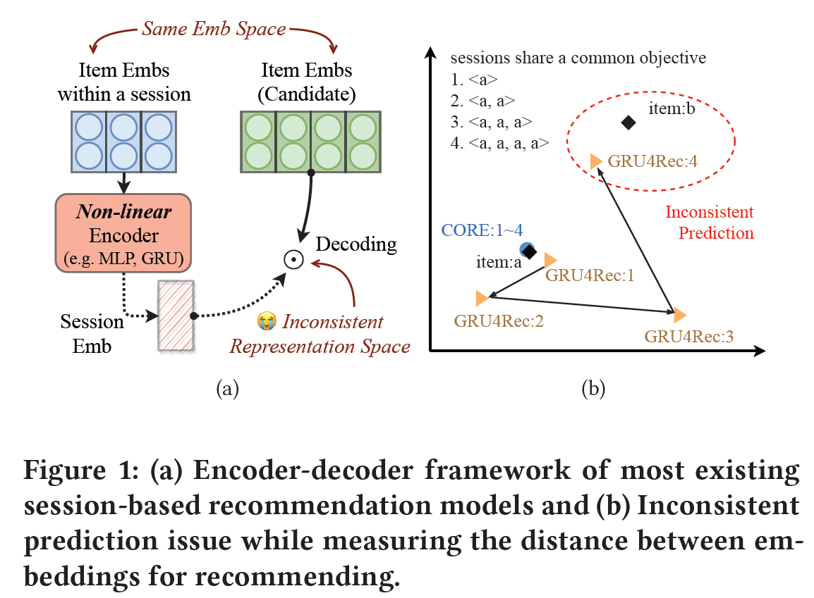
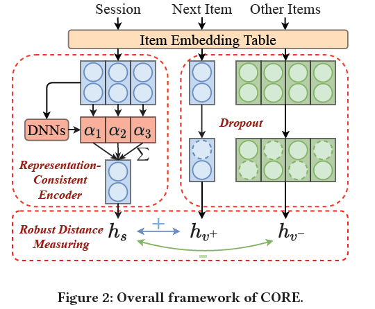
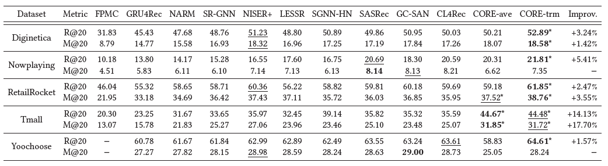
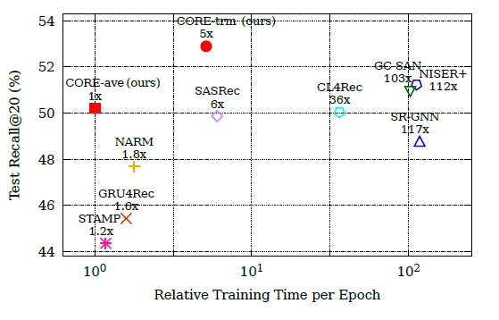
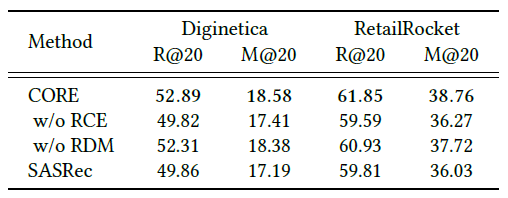
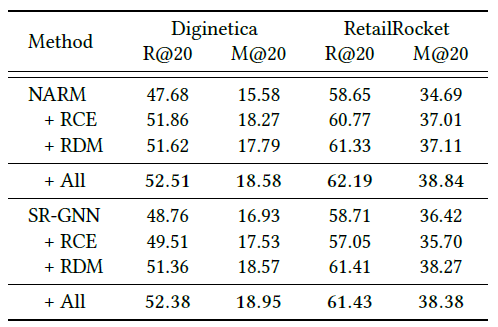

*Yupeng Hou, Binbin Hu, Zhiqiang Zhang, and Wayne Xin Zhao. 2022. CORE: Simple and Effective Session-based Recommendation within Consistent Representation Space. In Proceedings of the 45th International ACM SIGIR Conference on Research and Development in Information Retrieval (SIGIR '22). Association for Computing Machinery, New York, NY, USA, 1796–1801. https://doi.org/10.1145/3477495.3531955*

본 리뷰는 한국어로 작성되었으며, 영어 표현이 필요한 경우 괄호 안에 병기하였습니다.

## 0. Preliminary: Session Based Recommendation

추천 시스템(*Recommender System, RS*)은 과거의 모든 사용자-아이템 상호작용(*User-item interaction*) 정보를 활용하여 각 아이템에 대한 사용자의 선호도를 학습한다. 기존의 추천 시스템은 일반적으로 다음과 같은 가정을 기반으로 한다.

+ 과거의 모든 상호작용은 현재의 선호도를 예측하는 데에 동등한 중요도를 가진다.

+ 모든 사용자-아이템 상호작용에 대한 사용자와 행동 정보가 저장된다.

하지만 실제 상황에서 이러한 가정들은 다음과 같은 이유로 인해 성립하지 않는다.

+  사용자의 다음 행동은 장기적인 선호도(*Long-term preference*) 뿐만 아니라 단기적인 선호도(*Short-term preference*)의 영향을 받는다. 
	- 이때 단기적인 선호도는 사용자의 최근 행동으로 추정할 수 있다.

+ 사용자의 선호도는 정적(*Static*)이기보다는 유동적(*Dynamic*)이다.
	- 사용자의 선호도는 시간에 따라 변화하며, 이전의 선호도과 현재의 선호도가 다를 수 있다.

+ 모든 사용자-아이템 상호작용에 대해 유저 프로필과 행동 정보를 알 수 있는 것은 아니다.
	- 예를 들어, 아마존의 사용자가 로그인을 하지 않은 채로 특정 제품을 검색했다면 이 사용자-아이템 상호작용에 대한 사용자 정보를 알 수 없다.

세션 기반 추천 시스템(*Session-Based Recommender System, SBRS*)은 기존 추천 시스템과 달리 세션 정보를 바탕으로 사용자의 선호도를 학습한다. 이때 세션을 다음과 같이 정의한다.

> 세션(*Session*)은 연속적인 과정에서 발생한 사용자-아이템 상호작용으로 구성된다. 
> 이때 각 세션은 명확한 경계(*Boundary*)에 의해 구분된다.

예를 들어, 최근 인터넷 검색 기록이나 음악 앱이 켜져있는 동안 들었던 음악의 목록 등은 각각 하나의 세션이다. 

일반적으로 세션 기반 추천 시스템은 세션으로 구분된 사용자의 행동 정보를 학습하여 사용자의 다음 행동을 예측하는 것을 목표로 한다.

## 1. Introduction
### 1.1 Motivation
최근의 세션 기반 추천(*Session-Based Recommendation, SBR*) 연구는 주로 인코더-디코더(*Encoder-Decoder*) 구조를 활용하며, 효과적인 인코더를 설계하는 것을 목적으로 한다. 인코더로는 주로 순환 신경망(*Recurrent Neural Network, RNN*), 트랜스포머(*Transformer*), 그래프 신경망(*Graph Neural Network, GNN*) 등을 활용하며, 디코더로는 세션과 아이템 임베딩(*embedding*) 간의 내적(*dot product*)을 계산하여 상호작용 확률을 추정한다.

세션 기반 추천에서 세션 임베딩은 사용자의 단기적인 선호도를 반영하며, 선호하는 아이템들의 임베딩과 유사해야 한다. 하지만, 기존 연구들과 같이 비선형 신경망(*Non-linear Neural Network*)을 활용하여 얻은 세션 임베딩의 표현공간(*Representation Space*)과 아이템 임베딩의 표현공간이 반드시 일치하는 것은 아니다. 예를 들어, Figure 1(b)은 같은 아이템 *a*를 여러 번 클릭해서 얻은 세션들의 임베딩을 나타낸다. 비선형 신경망인 GRU4Rec을 활용하여 얻은 세션 임베딩들과 아이템 *a*의 임베딩이 서로 다른 위치에 있음을 확인할 수 있다.

이러한 세션 임베딩과 아이템 임베딩 간의 불일치는 잘못된 추천(*Inconsistent Prediction*)으로 이어진다. Figure 1(b)의 예시에서 아이템 a를 4번 클릭한 세션의 임베딩은 아이템 a과 전혀 관계 없는 아이템 b의 임베딩에 더 가까이 위치한다. 이 경우 다음 아이템을 추천할 때 아이템 b를 추천하는 잘못된 추천이 생성된다.

따라서 본 논문은 세션 임베딩과 아이템 임베딩 간의 불일치 문제를 해결하고자 두 임베딩 공간을 통일하는 방법을 제시한다.

### 1.2 Key Challenges

본 논문은 다음과 같은 두 가지 문제를 고려하였다.

1. 세션과 아이템 임베딩을 같은 공간에 두면서 심층 비선형 신경망(*Deep non-linear neural network*)의 장점을 가져올 수 있는 인코더를 어떻게 설계할 것인가?
2. 아이템 임베딩을 모델 최적화에 직접 사용할 때 과적합(*Overfitting*)을 방지하기 위한 거리 함수를 어떻게 설정할 것인가?

### 1.3 CORE: COnsistent REpresentation

본 논문은 세션 기반 추천을 위해 세션 임베딩과 아이템 임베딩이 같은 공간에 존재하도록 하는 간단하고 효과적인 방법을 제시하였다. 주요 아이디어는 다음과 같다.

1. 세션 임베딩을 아이템 임베딩의 선형 결합으로 인코딩하며, 가중치는 심층 비선형 신경망을 통해 학습한다. 이를 통해 아이템의 순서 및 중요도 등 귀납적 편향(*Inductive bias*)를 학습한다.
2. 기존의 주로 사용된 내적 거리(*dot product distance*)가 튜플 손실(*tuplet loss*)을 최적화하는 것과 유사함을 보이고, 다양한 방식으로 거리 함수의 강건성(*Robustness*)을 향상시킨다.

본 논문은 5개의 공개 데이터으로 실험을 진행하여 제시한 모델이 효과적임을 보이고, 기존의 세션 기반 추천 방법의 성능을 제시된 방법으로 향상시킬 수 있음을 보였다.

## 2. Method

모델의 전반적인 구조는 Figure 2와 같다.

### 2.1 Session-Based Recommendation

인코더-디코더 구조를 사용하는 일반적인 세션 기반 추천은 다음과 같은 과정으로 진행된다.

1. 각 아이템은 통일된 공간으로 임베딩된다. 이 때 아이템 임베딩은 룩업 테이블(*look-up table*)을 통해 얻는다.

	$h_ {i} = Emb(v_ {i}) \in \mathbb{R}^d$

1. 다음으로 인코더를 통해 각 세션의 임베딩을 얻는다. 인코더로는 주로 비선형 신경망을 사용한다.

	$h_ {s} = Encoder([h_ {s, 1}, \ldots , h_ {s, n}]) \in \mathbb{R}^d$

3. 마지막으로 디코더를 통해 다음 아이템에 대한 확률 분포를 계산한다.

	$\hat{y} = Decoder(h_ {s}) \in \mathbb{R}^m$

### 2.2 Representation-Consistent Encoding

본 논문은 세션 임베딩을 아이템 임베딩의 선형 결합으로 표현하는 *Representation-Consistent Encoding(RCE)* 를 제시한다. 세션 임베딩은 아이템 임베딩에 가중치를 곱하여 더한 값으로 표현되며, 심층 신경망으로 가중치를 학습하여 귀납적 편향을 학습한다. 일반적인 심층 신경망으로 아이템 임베딩의 가중치를 학습할 때,  *RCE*는 다음과 같은 수식으로 표현할 수 있다.

$\alpha = DNN([h_ {s, 1};h_ {s, 2}; \ldots ;h_ {s, n}])$

$h_ {s} = {\sum^ {n}}_ {i=1} \alpha_ {i} h_ {s, i}$

#### 2.2.1 Learning Weights via Mean Pooling
심층 신경망으로 평균 풀링 레이어(*Mean Pooling Layer*)을 사용한다.

$\alpha_ {i} = 1 / n$

#### 2.2.2 Learning Weights via Transformer
심층 신경망으로 SASRec과 같이 셀프 어텐션 레이어(*self-attention layer*)들로 이루어진 트랜스포머 구조를 사용한다. 트랜스포머의 위치 인코딩(*positional encoding*)을 활용하여 아이템들의 순서에 대한 정보를 포함한다. 다음과 같은 수식으로 표현할 수 있다.

$F = Transformers([h_ {s, 1};h_ {s, 2}; \ldots ;h_ {s, n}])$

$\alpha = softmax(w \cdot F^\intercal)$

### 2.3 Robust Distance Measuring for Decoding

세션 임베딩을 아이템 임베딩의 선형결합으로 인코딩하고 아이템 임베딩과의 거리로 디코딩하기 때문에 아이템 임베딩이 거리 계산에 직접적으로 이용된다. 이 경우 과적합 문제가 발생할 확률이 높다.

따라서 본 논문은 과적합 문제를 피하고자 기존의 거리 함수의 일반화된 형태를 제시한다.

### 2.3.1 Reviewing dot product distance

> LEMMA 1. 세션 임베딩과 아이템 임베딩들에 대해 내적 거리를 계산할 때, 크로스 엔트로피 손실(*Cross Entropy Loss*)을 최적화하는 것은 고정된 마진(*margin*) 2를 가지는 (*N-1*)-튜플 손실(*(N-1)-tuplet loss*)을 최적화하는 것과 근사적으로 비례한다.

위 Lemma는 다음과 같이 증명할 수 있다.

> $l_ {ori} = -log ( {exp(h_ {s} \cdot h_ {v^+}) \over {\sum^ {n}}_ {i=1} exp(h_ {s} \cdot h_ {v_i})} )$
> 
> $= log [1+(\vert {\mathcal{V}} \vert - 1) \sum_ {v^- \in  \mathcal{V}\backslash \{v^+\}}  exp(h_ {s} h_ {v^-} - h_ {s} h_ {v^+} )]$
> 
> $\simeq (\vert {\mathcal{V}} \vert - 1) \sum_ {v^- \in  \mathcal{V}\backslash \{v^+\}}  exp(h_ {s} h_ {v^-} - h_ {s} h_ {v^+} )$
> 
> $\simeq (\vert {\mathcal{V}} \vert - 1) \sum_ {v^- \in  \mathcal{V}\backslash \{v^+\}}  (h_ {s} h_ {v^-} - h_ {s} h_ {v^+} +1)$
> 
> $\propto \sum_ {v^- \in  \mathcal{V}\backslash \{v^+\}} (\vert \vert h_ {s} - h_ {v^+} \vert \vert ^2 - \vert \vert h_ {s} - h_ {v^-} \vert \vert ^2 + 2)$

### 2.3.2 Robust Distance Measuring

위 Lemma를 바탕으로 본 논문은 거리 함수의 강건성을 향상할 수 있는 세 가지 접근을 제시한다.

1. 데이터의 분포가 다를 수 있으므로 마진을 고정하는 대신 조정 가능한 하이퍼파라미터로 대체한다.
2. 드롭아웃(*Dropout*)을 도입한다.
3. 내적 거리 대신 코사인 거리(*cosine distance*)를 사용한다.

이러한 접근을 바탕으로 본 논문은 *Robust Distance Measuring(RDM)* 에 대한 손실함수를 다음과 같이 제시한다. 

+ $l = -log {exp(cos(h_ {s}, h'_ {v^+})/\tau) \over {\sum^ {m}}_ {i=1} exp(cos(h_ {s}, h'_ {v_i})/\tau)}$

## 3. Experiments
### 3.1 Datasets and evaluation metrics

본 논문은 5가지 공개 데이터에 대해 실험을 진행하였다.

+ *Diginetica*, *RetailRocket*, *Tmall*, *Yoochoose* : 이커머스 웹사이트에서 제공한 유저의 구매 정보 데이터셋
+ *Nowplaying* : #Nowplaying 해시태그를 달고 트윗된 음악 리스트 데이터셋

본 논문은 평가함수로 두 가지 방법을 사용하였다.

+ top-20 Recall (Recall@20): 20개를 추천할 때 사용자가 관심있는 모든 아이템 중 모델이 추천한 아이템의 비율
+ top-20 Mean Reciprocal Rank (MRR@20): 	20개를 추천했을 때 실제 다음 아이템 순위의 역수의 평균

### 3.2 Baselines

+ Matrix Factorization 기반 모델: FPMC
+ RNN 기반 모델: GRU4Rec, NARM
+ GNN 기반 모델: SR-GNN, NISER+, LESSR, SGNN-HN
+ 트랜스포머 기반 모델: SASRec, GC-SAN, CL4Rec

### 3.3 Overall comparison

+ 5개 데이터셋에 대한 전체 10개의 평가함수 중 8개에서 본 논문에서 제시한 CORE 모델이 가장 좋은 성능을 보였다.
+ CORE-ave는 아이템의 순서나 중요도를 전혀 고려하지 않는 모델임에도 3개의 평가함수에서 모든 baseline 모델보다 좋은 성능을 보였으며, 나머지 평가함수에서도 좋은 성능의 baseline 모델들과 유사한 성능을 보였다.

### 3.4 Efficiency analysis

위 그림은 한 에폭 당 소요되는 학습시간과 성능을 나타낸다. 트랜스포머를 사용한 CORE 모델이 짧은 학습시간에도 높은 성능을 보인다. 평균 풀링을 사용한 CORE 모델은 메모리 사용을 최소화하며 학습시간이 가장 짧다.

### 3.5 Ablation study

위 표는 CORE 모델의 주요 구성 요소인 RCE와 RDM의 효과를 나타낸다. 같은 트랜스포머 구조를 사용하는 SASRec과 비교하였을 때, 성능은 CORE 모델, RCE만을 이용한 CORE 모델, RDM만을 이용한 CORE 모델, SASRec 순으로 나타난다. 이때 RCE, RDM 둘 중 하나의 요소만을 이용한 CORE 모델은 각각 SASRec의 구성 요소를 RDM, RCE으로 대체한 것과 동일하다. 이를 통해 RCE와 RDM 두 요소 모두 성능 향상에 기여함을 알 수 있다.

### 3.6 Improving existing methods

위 표는 기존 모델에 본 연구에서 제시한 RCE와 RDM을 적용하였을 때의 성능을 나타낸다. 기존 모델에서 RCE와 RDM을 적용한 경우 성능이 향상되는 것을 확인할 수 있다.

## 4. Conclusion

### 4.1 Summary

+ 본 논문은 기존의 심층 신경망 기반 모델들로 얻은 세션 임베딩과 아이템 임베딩이 다른 공간으로 매핑된다는 문제를 제시하고, 이를 해결하기 위한 방법으로 세션 임베딩과 아이템 임베딩의 표현 공간을 통일하는 방법을 제시하였다. 
+ 본 논문에서 제시한 모델은 세션 임베딩을 세션을 구성하는 아이템 임베딩들의 선형 결합으로 나타내고, 가중치를 심층신경망을 활용하여 학습한다. 이때 손실함수로 코사인 거리와 마진 하이퍼파라미터로 정의되는 새로운 거리 함수를 활용한다.
+ 본 논문의 모델은 세션 기반 추천에서 기존 모델들에 비해 높은 성능과 효율성을 보였으며, 기존 모델의 성능을 본 연구의 접근을 활용하여 향상시킬 수 있다.

### 4.2 Review

본 논문은 세션 임베딩을 아이템 임베딩의 선형 결합으로 표현한다는 매우 간단한 아이디어를 바탕으로 모델의 성능을 향상시킨 논문이다. 더 복잡한 모델을 구성하여 성능을 향상시킬 수도 있지만, 이와 같이 기존 모델들의 문제점을 파악하고 이를 해결할 수 있는 간단한 아이디어를 제시하는 것 역시 중요함을 알 수 있다.

다만 실험을 통해 보인 성능 향상 외에도 Motivation을 뒷받침하는 실험의 부재가 아쉽다. Motivation에서 특정 아이템을 여러번 클릭하는 방법으로 만들어낸 데이터셋을 활용하여 기존 모델의 문제를 지적한 점은 인상적이나, 이러한 문제가 실제 데이터에서도 일어나는지에 대한 궁금증이 남는다. 이에 대해 실제 데이터에서 Motivation을 검증하기 위해 진행할 수 있는 실험을 다음과 같이 정리해볼 수 있다.
+ 우선 가상의 데이터로 진행한 실험과 유사하게 실제로 같은 아이템이 연속되어 등장하는 세션이 존재하는지 여부를 확인해야 한다. 특정 아이템이 연속적으로 등장하는 세션을 찾고, 이때 다음 아이템의 임베딩이 연속된 아이템의 임베딩과 유사하다면 Motivation에서 가정하는 상황을 만족한다.
+ 이렇게 찾은 세션에 대해 실제로 기존 모델을 활용하여 얻은 세션 임베딩이 다음 아이템의 임베딩보다 다른 아이템의 임베딩과 유사한지 확인한다. 위 조건을 만족하는 세션과 만족하지 않는 세션에서의 기존 모델들의 성능이 다르게 나타난다면, 즉 기존 모델이 이러한 세션들에 대해 잘못된 추천을 하는 경우가 많다면 Motivation에서 제시하는 문제가 실제로 존재함을 확인할 수 있다.

또한, 본 논문에서 주장하듯 세션 임베딩을 아이템 임베딩들의 선형결합으로 나타내는 것이 모든 추천 문제에서 정당한지에 대한 의문이 존재한다. 예를 들어, 음악 추천에서 같은 노래가 여러 번 등장한 경우와 이커머스 클릭 데이터에서 같은 제품을 여러 번 클릭한 경우는 다른 의미를 가질 수 있다. 음악 추천의 경우 특정 노래를 반복재생하는 경우가 많으므로 같은 노래를 다시 추천해주는 것이 의미 있으나, 클릭 데이터의 경우 같은 제품을 다시 클릭할 확률이 음악 추천에 비해 떨어진다. 또한, 본 논문의 방법대로라면 특정 아이템을 1번 클릭한 것과 10번 클릭한 것이 같아야하는데, 실제로는 같은 아이템을 여러 번 클릭한 행위 자체가 특정한 맥락이나 의미를 가질 수 있다. 이렇듯 선형결합으로 표현할 때 정보의 손실이 큰 경우가 실제 추천 데이터에 존재한다면 본 논문에서 제시한 방법으로는 좋은 추천 결과를 만들기 어려울 것이다.

이러한 부분을 보완하기 위해서 기존의 비선형 신경망을 사용하는 방법과 본 방법을 결합해볼 수 있다. 예를 들어, 기존의 비선형 신경망 기반 방법들을 사용하여 얻은 세션 임베딩과 본 연구의 선형 결합을 사용하여 얻은 세션 임베딩을 적당한 파라미터를 활용하여 다음과 같이 더할 수 있다.

+ $h_ {s} = \alpha  h_ {s, DNN} + (1-\alpha) h_ {s, CORE}$

이렇게 구해진 세션 임베딩은 어느 정도 아이템 임베딩과 유사한 표현 공간을 가지면서도 심층 신경망 모델의 장점을 더 잘 가져간다고 추정해볼 수 있다. 두 임베딩을 위와 같이 선형결합하는 방법 외에도 두 세션 임베딩을 concatenate하여 새로운 세션 임베딩을 얻을 수도 있다.

+ $h_ {s} = [h_ {s, DNN} ; h_ {s, CORE}]$

위와 같은 접근이 실제로 성능을 향상시킬 수 있는지는 알 수 없으나, 이와 같이 기존 모델과 본 논문의 모델을 잘 섞을 수 있다면 더욱 더 많은 정보를 포함하면서도 본 논문에서 제시한 문제를 완화하는 모델을 만들 수 있을 것이다.

## 5. References

+ Paper: [https://arxiv.org/abs/2204.11067](https://arxiv.org/abs/2204.11067)
+ Github: [https://github.com/RUCAIBox/CORE](https://github.com/RUCAIBox/CORE)

## Reviewer Information

+ Name: Hoyoung Choi(최호영)
+ Master student at DSAIL(Data Science and Artificial Intelligence Lab), KAIST
+ Research Topic: Graph Neural Networks, Recommender System, Sports Analytics
