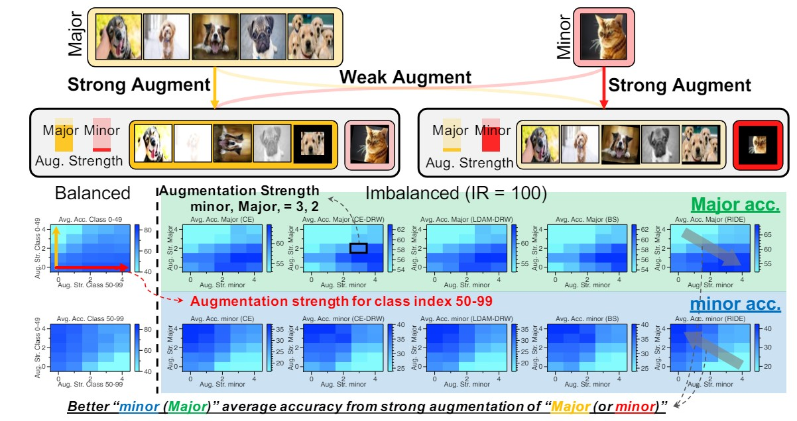
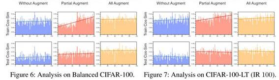
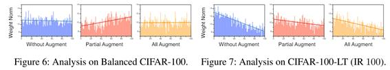
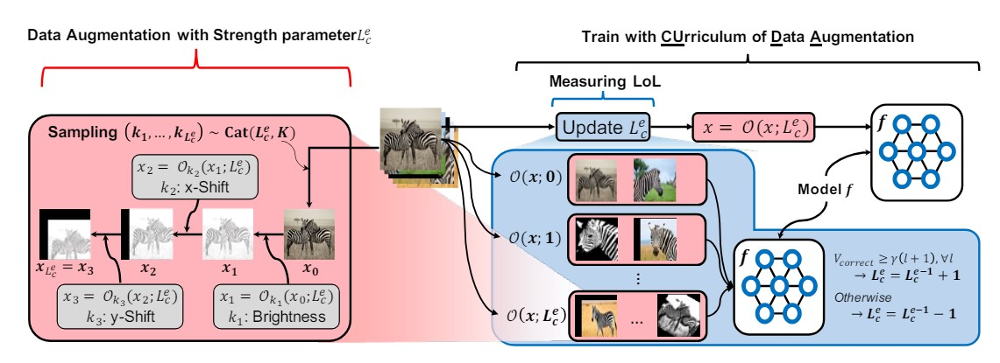
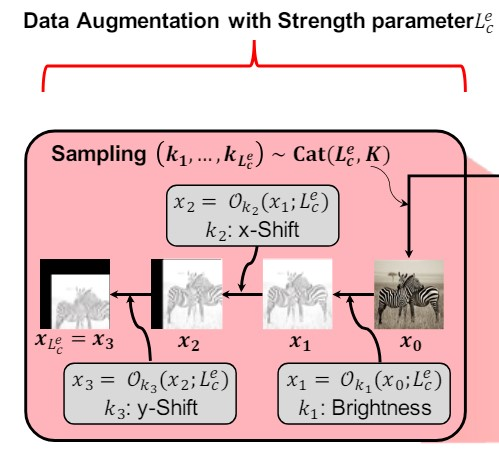
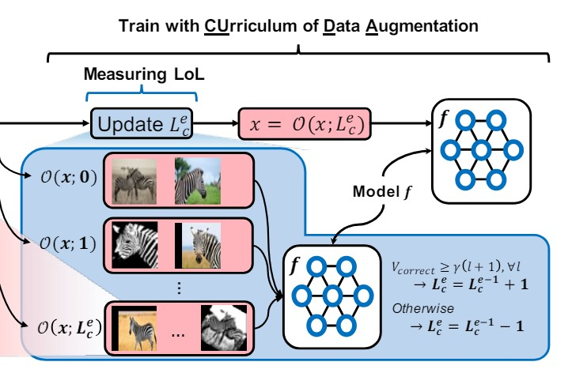
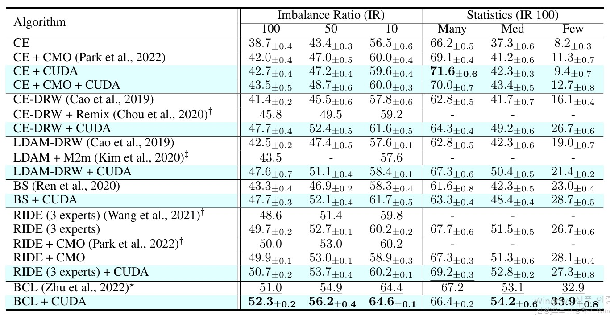
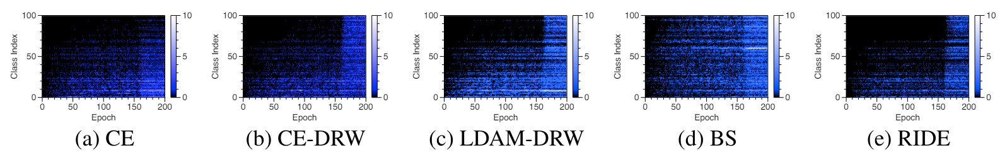

### Title
CUDA: Curriculum of Data Augmentation for Long-Tailed Recognition

### 1. Motivation
**Imbalance Dataset**은 Real World 에서 자주 나타나는 문제 중 하나로, Conventional Deep Learning Models 이 Imbalance Dataset 으로 학습할 경우 상당한 성능 저하가 나타나게 된다. 
이로 인해 발생하는 **Long-Tail Problem** 은 Computer Vision 뿐 아니라, NLP 및 Recommender System 등 다양한 도메인에서 중요하게 다뤄지고 있다. 

Data Imbalance 로 인해 야기되는 문제는 크게 아래와 같다.
- **Major Class 에 대한 Over Confidence 로 인한 Popularity Bias**
- **Minor Class 에 대한 상당한 성능 저하**

이러한 문제를 해소하기 위해, 크게 **"ReWeighting"** 과 **"ReSampling"** 이라는 2가지 방향성으로 연구가 진행되었다.
- **ReWeighting** 방식 : 학습 과정에서 계산되는 Loss 중 Minor Class Loss 에 가중치를 주는 방식
- **ReSampling** 방식 : 학습 과정에서 Major / Minor Class 의 수를 고려하여, Minor Class 를 추가적으로 Sampling 하는 방식

그러나 위 두 방법은 근본적으로 Minor Class 의 Few Sample 로 인한 Rich Information을 얻을 수 없다는 문제가 존재하고, 이를 해결하기 위해 **Data Augmentation** 방법론이 제안되었다. 

DA(Data Augmentation) 은 기존의 학습 데이터에 추가적인 변형이나 가공을 통해, 기존과 다른 데이터를 만들어서 모델이 추가적으로 학습할 수 있도록 돕는 방법을 의미한다. DA 관련 연구는 주로 **어떻게 DA를 할 것인가** 위주로 진행되었다. 

본 논문에서는  DA 가 Class 별로 **어떤 영향을 주는지**, 그리고 **어느 정도로 영향을 주는 지**에 대해 연구가 진행되지 않았다고 지적하면서 **Data Augmentation 이 Representation Part 와 Classification Part 에 어떤 방향으로 영향을 미치는 지** 를 실험을 통해 파악을 하고, 이를 토대로
- **Class 마다 최적의 DA 정도를 파악하고, Curriculum 방식을 통해 모델**을 학습하는 방법을 제안한다.

이러한 방식은 Model Agnostic하고, 다른 Long-Tail 과 결합가능하며 논문에서는 이를 **CUDA : Curriculum of Data Augmentation** 라고 부른다. 

### 2. Preliminary
#### 2.1 Data Imbalance &  Data Augmentation
기존의 Long-Tail Problem 의 방법론으로 제안된 **1. ReWeighting** 방식과 **2. ReSampling** 방식은 모두 Major Class 에 대한 성능과 Minor Class 에 대한 성능을 Trade-Off 하는 것이라는 문제가 있다. 
이를 해결하기 위해, 새롭게 제안된 방식이 **Data Augmentation** 분야이다. 
DA (Data Augmentation) 은 크게 1. Intra-Class Augmentation 과 2. Inter-Class Augmentation 으로 나뉘게 된다. 
- Intra-Class Augmentation : 하나의 데이터에 변화를 주는 방식 (i.e., Cropping in CV) 
- Inter-Class Augmentation : 한 Class 와 다른 Class 를 이용해서 새로운 정보의 데이터를 만드는 방식 (i.e., Mix-Up) 

#### 2.2 Representation & Classification at Imbalance Data
먼저, Long-Tail Problem 을 접근하는데 있어서, Representation Part 와 Classification Part 는 분리되어서 분석해야 한다. 이는 기존의 연구들에서 **Imbalance Dataset 으로 학습한 후에도, Classifier Retraining 만으로도 기존 Long-Tail Method 보다 높은 성능을 달성할 수 있음** 이 관측되면서 Long-Tail 분야에서 정립된 방법론이다. 

**Representation Part** : 모델의 Representative를 확인하기 위해서는 **Class-wise Feature Alignment** 를 분석해야 한다. 
&nbsp;&nbsp;&nbsp;&nbsp; Class-wise Feature Alignment 는 Class 내의 데이터들이 얼마나 잘 뭉쳐있는지에 대해 측정하는 것으로, Feature Vector 의 유사도를 통해서 확인하게 된다. 

**Classification Part** : 모델의 Classification Performance 를 확인하기 위해서는 마지막 Classifier Layer 의 **Class-wise(Column-wise) Norm** 을 분석해야 된다. 
&nbsp;&nbsp;&nbsp;&nbsp;Class-wise(Column-wise) Norm 은 모델이 각 Class 를 어느 정도로 중요하게 판단하는지 볼 수 있는 상대적인 정도로, 이 값이 불균형하다면 이는 모델이 특정 Class 에 대해 Bias를 갖고 있음을 의미하게 된다.

### 3. Main Idea
#### 3.1 Key Finding
논문의 Motivaion 의 시작인 Key Finding 은 다음과 같다. 
 
위 사진에서 첫 번째 줄은 Major Class 의 Accuracy, 두 번째 줄은 Minor Class 의 Accuracy를 나타낸다. 
또한 x축 방향은 Minor Class Augmentation을, y축 방향은 Major Class Augmentation을 나타낸다. 
논문의 저자는 다음과 같은 결과를 관측한다.
- Minor Class DA(X-axis) 는 Major Class 성능 증가(First-Row) 및 Minor Class(Second-Row) 성능 감소
- Major Class DA(Y-axis) 는 Major Class 성능 감소(First-Row) 및 Minor Class(Second-Row) 성능 증가

이는 Data Augmentation 연구에서의 기본적인 가정이었던, **Augmenation 이 해당 Class의 성능 향상에 도움이 될것이다** 와 완전히 상반되는 부분이었고 Data 의 Imbalance 유무에 상관없이 공통적으로 발견된 현상으로, 이러한 현상이 나타나는 원인에 대해 심층적인 분석을 하는 것이 본 논문의 Main Idea 이자 논문에서 후에 제시하는 Method 의 근거가 된다. 

#### 3.2 Representation Part
첫 번째 분석으로는 **Data Augmentation 이 Representation 에 어떤 영향을 주는가?** 를 알아보기 위해,
1. Balance (CIFAR-100) 및 Imbalance (CIFAR-100-LT) 데이터에 대해서 Without / Partial / All Augmentation 학습을 한다.
    - Partial 의 경우 Head Class에 해당하는 50% 에 대해서만 Augmentation 을 진행한 것을 의미한다. 
2. Class 별 Representative Vector 의 Similarity 를 확인한다. 

 

해당 실험을 통해 아래와 같은 점을 확인할 수 있다.
- **Train Data** 에서 Augmentation을 하게 될 경우 공통적으로 Augmented Class 의 Cosine Similarity 는 (상대적으로) 낮아지게 된다. (Partial Augment Part) 
이는 Augmented Data 의 Feature Vector 가 Feature Space 상에서 넓은 Diversification하게 되면서 발생하는 것으로 **Test Data** 에서는 나타나지 않는다.  
- **Test Data** 에서 모든 경우에 대해서, Cosine Similarity 가 균형을 이루게 되는데 이를 통해 데이터의 Imbalance 에 상관없을 뿐 아니라, 특정 Class 에 DA 를 하는 것 역시 모델의 Representative 학습에 있어서 크게 문제가 되지 않는 다는 것을 보여준다.  

#### 3.3 Classification Part
다음으로는 **Data Augmentation 이 Classification 에 어떤 영향을 주는가?** 를 알아보기 위해,
1. Balance 및 Imbalance 데이터에 대해서 Without / Partial / All Augmentation 학습을 한다. 이 중, Partial 의 경우 Head Class 50% 에 대해서만 Augmentation 을 진행한 것을 의미한다. 
2. Classifier Layer 에서 Class-wise(Columns-wise) Weight Norm 을 측정하여 Representation 능력을 확인한다. 

 

이번 실험을 통해서는 아래와 같은 점을 확인할 수 있다.
- 특정 Class 에 DA 를 할 경우 해당 Class 의 Weight Norm 이 감소하는 것을 확인할 수 있다. (Partial Augment Part)
- 이러한 원인은 Representation Part 에서 낮은 Feature Alignment 로 인해 $\mathcal{\vert\vert \Delta w\vert\vert}$ 이 작아지게 되고 학습 동안 이 차이가 누적되면서 Class 간 Weight Norm 의 Imbalance 가 발생하게 되는 것이다.

### 4. Main Method - Curriculum of Data Augmentation
#### 4.1 Overall Archtecture Preview
앞선 Key Finding 과 이에 대한 실험을 통해서 논문은 다음을 주장한다. 
- Augmented Class 의 성능이 오히려 감소했던 것은, **Representation 능력에서는 문제가 없으나 Classifier 의 Weight Norm의 불균형으로 인한 Bias 때문이다.** 
- Data Augmentation 은 일반적인 관념과 동일하게 Representation Learning 에 여전히 도움이 된다. 하지만 그 과정에서 **Classifier Layer 의 Weight Norm 이 불균형하게 될 경우 오히려 전체적인 성능이 부정적인 영향을 줄 수 있다.** 
- 따라서 Data Augmentation 을 할 경우 **Classifier Layer 가 불균형하게 되지 않도록 Data Augmentation 의 정도를 Class-wise 하게 세밀하게 조절해줄 필요가 있다.** 

이를 위해서 논문에서 제시하는 방법론인 CUDA : Curriculum of Data Augmentation 를 제안한다. 
CUDA의 전체적인 Overview는 다음과 같다. 

이러한 CUDA 는 크게 2 부분으로 구성되어 있다. 
- Strength Based Augmentation : 주어진 Strength Parameter 를 기반으로 Augmented Data 를 Generation 하는 부분 (빨간색)
- Level-of-Learning (LoL) Score :모델이 현재 얼마나 학습이 잘 되었는 지 Level-of-Learning 을 측정하는 부분 (파란색)

#### 4.2 Strength Based Augmentation 
 

해당 파트에서는 주어진 Strength Parameter 에 대해서 Augmented Data 를 만드는 방법을 정의한다. 
$O^{m_ {k_ {s}}(s)}_ {k_ {s}}$ : Strength가 $\mathcal{s}$ 일 때, 미리 정의된 Augmentation 방법 $k_ {s}$ 및 강도 $m_ {k_ {s}}(s)$ 를 적용하는 함수 
$Cat(\cdot), U(\cdot)$ : 각각 Categorical Distribution 및 Discrete Uniform Distribution  
실제로 Augmentation을 할 때에는, 여러 Augmentation 을 동시에 적용하여 아래와 같은 식으로 Augmentation을 진행하게 된다. 
$\mathcal{O(x;s)=O^{m_ {k_ {s}}(s)}_ {k_ {s}}\circ O^{m_ {k_ {s-1}}(s)}_ {k_ {s-1}} \circ \cdots \circ O^{m_ {k_ {1}}(s)}_ {k_ {1}}(x), k_ {i}\sim Cat(K, U(K))}$ 
이러한 방식의 장점으로는, Augmentation 의 종류와 순서가 랜덤하게 바뀌게 되면서 훨씬 다양한 종류의 데이터가 만들어 질 수 있다. 
이를 통해, Augmentation Strength 가 높아질 수록, **가능한 Augmented Sample 의 경우가 Exponential 하게 증가하여 모델이 점점 어려운 Augmented Sample 을 학습하도록 한다.**

#### 4.3 Level-of-Learning (LoL) Score
 
다음으로는 학습 과정에서 모델이 해당 Class 를 얼마나 잘 학습했는지 측정하는 Level-of-Learning(LoL) Score 를 구하는 부분을 설명한다. 
해당 부분에서는 각 Class 에 대해서 현재 모델이 해당 Class 를 얼마나 잘 학습했는지 확인하기 위해서 아래의 식을 계산한다. 해당 식은 Augmented Data 를 얼마나 맞췄는지를 계산하는 단순한 식이다. 
- $D_ {c}$ : A Set of Class $c$ 
- $l$ : Strength 
- $f_ {\theta}$ : Model 
- $\gamma$ : Threshold Parameter 
- $T$ : coefficient of the number of samples 

$V_ {Correct}(\mathcal{D}_ {c},l,f_ {\theta},\gamma,T)=\sum_ {x\in D_ {c}}\mathcal{I}_ {f_ {\theta}(O(x;l)=c)}$ 
이를 통해 현재 모델이 해당 Class 를 충분히 잘 학습되었다고 판단이 되면 Score 를 높여서 다음 학습에서 더 어려운 학습을 진행하게 한다. 
$V_ {LOL}(\mathcal{D}_ {c},L^{e-1}_ {c},f_ {\theta},\gamma,T) = L^{e-1}_ {c}+1$ if $V_ {Correct}(\mathcal{D}_ {c},l,f_ {\theta},\gamma,T)\geq\gamma T(l+1)$ $\forall l\in\{0,\cdots L^{e-1}_ {c}\}$ 
반면, 충분히 학습하지 못했다고 판단이 될 경우 Score 를 낮춰서 쉬운 학습을 다시 재 진행하도록 한다.
$V_ {LOL}(\mathcal{D}_ {c},L^{e-1}_ {c},f_ {\theta},\gamma,T) = L^{e-1}_ {c}-1$ Otherwise 
이러한 방식의 기준을 통해 **Class $\mathcal{c}$ 에 대해서 모델이 현재 Augmentation Strength $L^{e}_ {c}$ 에서 충분히 잘 학습했다면, Augmentation Strength 를 높인다.** 

### 5. Experiments
#### 5.1 Main Results
실험은 두 Synthetic Long-Tail Data 인 CIFAR-100-LT, ImageNet-LT 와 Real-world Data 인 iNaturalist2018 를 이용해서 진행되었다. 

Backbone Architecture는  Resnet-32를 사용하였으며, Baseline 으로는 Cross Entropy 방식 뿐 아니라 다양한 Long-Tail Algorithm 에 CUDA 를 적용한 것을 하였다. 
- Two-stage Method : CE-DRW(Defered ReWeightinh), cRT(classifier ReTraining)
- Balanced Loss(ReWeighting) : LDAM-DRW, Balanced-Softmax
- Ensemble Method : RIDE
- ReSampling Method : Remix, CMO
- Contrastive Method : BCL(Balanced Contrastive Learning)

실험 결과에서 알 수 있듯이, Baseline 에 단순히 CUDA 적용했을 때도 General Performance 뿐 아니라 Med, Few Class 에 대한 성능이 상당히 향상된 것을 확인할 수 있다. 뿐만 아니라 다른 Algorithm 들과 결합하였을 때에도 추가적인 성능 향상을 달성하는 것을 통해, CUDA 방식이 기존의 Long-Tail Algorithm 과 다른 방식으로 Long-Tail 문제를 접근하여 해결한다는 것을 확인할 수 있다. 

또한 단순히 Long-Tail Algorithm + Data Augmentation 의 조합이 성능 향상에 얼마나 영향을 주는 지 확인하기 위해, 다른 Augmentation 방법의 경우 실험을 진행하였다.  
아래에서 AA는 AutoAugmentation, FAA는 Fast AutoAugmentation, DADA는 Differentiable Automatic Data Augmentation, 마지막으로 RA 는 Random Augmentation을 의미한다. 

해당 실험을 통해 다른 Long-Tail Algorithm 에 다른 종류의 Augmentation을 적용했을 때에도 성능 향상이 나타나긴 하지만, CUDA 를 적용했을 때 가장 크게 성능이 향상되는 것을 볼 수 있다. 이를 통해 Curriculum 방식으로 쉬운 데이터 학습부터 어려운 데이터를 학습하는 것이 학습하는 데 있어서 추가적인 성과를 가져오는데 유효하다는 것을 확인할 수 있다.

마지막으로, Curriculum 방식이 얼마나 잘 동작하는지 확인하기 위해 Level-of-Learning(LoL) Score 를 추적한 실험을 진행하였다. 
아래 결과에서 낮은 Index 는 Major Class (Easy Class), 높은 Index 는 Minor Class (Hard Class) 를 의미한다. 

각각의 Long-Tail 방법에 대해서, 학습을 진행하는 과정에서 Easy Class 의 경우에는 Level-of-Learning Score 가 빠르게 높아지는 반면, Hard Class 의 경우 학습을 진행되어도 Score 가 빠르게 높아지지 않는 것을 확인할 수 있다. BS (Balanced SoftMax) 의 경우 Algorithm 내부에서 자체적으로 균형을 조절하는 부분이 있어서 Hard Class 의 경우에도 Score 가 높아지는 것으로 분석되었다.

### 6. Conclusion
본 논문에서는 Major Class Augmentation 이 Major Class 에 대한 성능은 오히려 감소하는 반면, Minor Class 에 대한 성능이 향상된다는 발견을 기반으로 하여, Class-wise Augmentation 이 실제 학습과정에서 어떠한 형태로 모델 학습에 영향을 주는지를 구체적으로 분석하였다. 
또한 이를 토대로, Class 별로 Augmenation 의 강도를 조절하여 Imbalance 한 Data 에서도 Robust하고 Generalized 한 모델 학습이 가능할 뿐 아니라 기존의 방식과도 결합가능한 새로운 방법론인 CUDA 를 제안하였다. 
논문의 제목을 통해서는 Long-Tailed Recognition 문제에 대해 좀 더 Impact 있는 Solution 을 제안할 것이라고 기대하였으나, 실제 Experiment 및 Ablation 에서는 Long-Tail Recognition 을 해결했다기 보다는 General 하게 모델 학습을 향상시켜 성능이 올라갔다고 이해하는 것이 바람직한 것 같다.  
또한, 다른 모델들과 결합하여 사용될 때, BCL(Balanceed Contrastive Loss) 의 경우 성능 차이가 다른 모델들에 비해 거의 나지 않는 데, 이에 대해서 추가적인 분석이나 설명이 없었고, 또한 LoL Score 관련 추가 실험에서 BS (Balanced Softmax) 의 경우 Score 의 차이가 거의 없음에도 BS 모델과 BS + CUDA 를 적용한 것에서 성능 차이는 무엇으로 인해 발생했는지에 대해서도 추가적인 분석이 없었다는 것이 아쉬운 부분이었다.  
그렇지만, 기존의 방법들과 다르게 Class-wise 로 Data Augmentation 을 적용하는 것은 특히 Class 라고 할 만한 것이 분명하지 않은 Recommender System 에서도 잘 적용할 수 있을 것이라고 생각한다. 단순 Head / Tail User & Item 뿐 아니란 각 User 의 정보를 이용하여 학습 과정에서 Augmentation 이나 다른 algorithm 을 Curriculum 방식으로 적용한다면 충분히 추가적인 성능 향상을 얻을 수 있을 것이라고 생각이 든다.
### 7. Reference
- Paper : [CUDA: Curriculum of Data Augmentation for Long-Tailed Recognition](https://arxiv.org/abs/2302.05499)
- Related Paper : [Decoupling representation and classifier for long-tailed recognition](https://arxiv.org/pdf/1910.09217)

### 8. Reviewer Information
- Name : Jiwan Kim (김지완)
- Master student at DSAIL(Data Science and Artificial Intelligence Lab), KAIST
- Research Topic: Recommender System, Sequential / Multimodal Recommender System