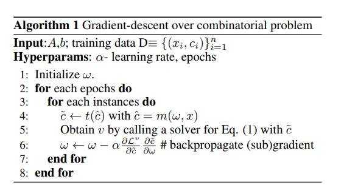
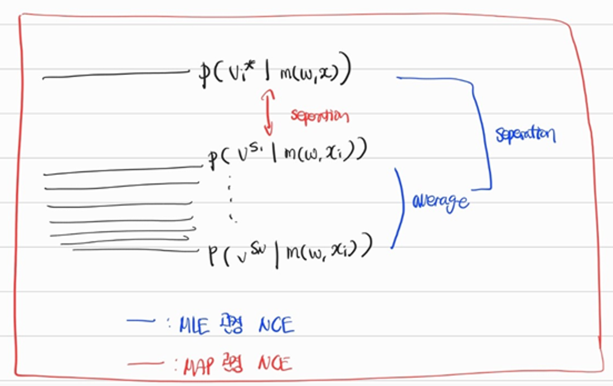
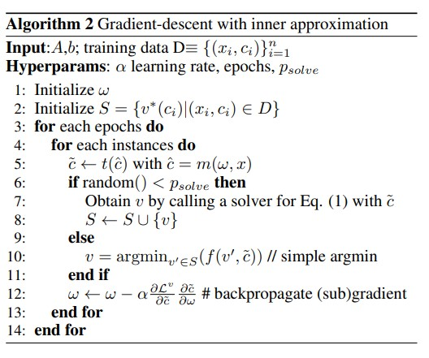

# **[IJCAI-2021] Contrastive Losses and Solution Caching for Predict-and-Optimize**  #
## **1. Introduction**
현실에서 decision-making problem들은 combinatorial optimization problem으로 정의됩니다. 그러나, 미래 에너지 가격이 불확실한 기계의 작업을 하루빨리 스케쥴링 해야 하는 것과 같이. 대부분의 입력 매개 변수는 불확실성을 가지고 있습니다. 
이러한 맥락에서 가장 널리 사용되는 관행은 먼저 ML 모델을 훈련한 다음, uncertain parameter의 point estimate를 만들고, 그 후에 최적화 문제를 해결하는 **predict-then-optimize** 방식입니다. 그러나 이 과정에서 ML 모델은 downstream optimization problem에 대한 영향을 고려하지 않고 prediction error를 최소화하도록 훈련됩니다. 
앞서 말한 이유로, predict-then-optimize 방식은 종종 sub-optimal decision을 내리곤 합니다. 이러한 문제를 야기하기 때문에, 최근 몇몇 논문들은 predict-then-optimize가 아닌 predict-and-optimize 방식이 더 효과적임을 입증했습니다. **Predict-and-optimize** 방식은 예측과 최적화 작업을 통합하고, decision-focused loss를 사용하여 ML모델을 훈련하는 방식입니다. 그러나, 이 방식은 NP-hard combinational problem을 풀 때, 계산 복잡성과 확장성 측면에서 문제를 가지고 있습니다. 따라서 본 논문에서는 non-optimal solution을 negative example로 가정하는 방식을 이용하여 새로운 surrogate loss function을 제안하였고, 이를 통해 계산 복잡성과 확장성 문제를 해결하고자 하였습니다.
## **2. Problem Setting**
본 논문에서는 combinatorial optimization problem을 다음과 같은 from으로 setting 하였습니다.

\begin{aligned}
&v^*(c) = \underset{v\in V}{argmin} f(v,c) \\
&V:\text{feasible set of solutions} \\ 
&f:\text{objective function (parametric in c)} \\
&c:\text{should be estimated}
\end{aligned}

이 때, $V$는 discrete set인 경우만 가정합니다. 이러한 형태의 문제들은 Mixed Integer Programming이나 Constraint Programming과 같은 combinatorial optimization problem의 전형적인 형태입니다. 또한 본 논문의 경우, 변수 c의 값은 알려져 있지 않지만 correlated features $x$와 historic Dataset $D = \{(x_i,c_i)\}_{i=1}^n$에 접근할 수 있다고 가정하였습니다.
### **Predict-Then-Optimize (Two-Stage Learning)**
$\hat{c}$을 학습하기 위한 전통적인 방식인 predict-then-optimize 방법은 다음과 같은 과정을 거칩니다.

- model $m(w,x)$로 model parameter $w$ 학습
- $\hat{c} = m(w,x)$가 Historical Dataset $D=\{x_i,c_i\}_{i=1}^n$에 Fitting 되도록 학습
\begin{aligned}
\underset{w}{argmin}(c-m(w,x))
\end{aligned}

### **Predict-And-Optimize (Decision-Focused Learning)**

Predict-and-optimize 방법론에서는 $\hat{c} = m(w,x)$를 단순히 real value $c$에 fitting 시키는 것이 아닌 combinatorial problem(Prediction+Optimization Problem)에서 real value $c$에 대한 optimal solution $v^{*}(c)$에 $v^*(\hat{c})$를 fitting 합니다. 이 때, **Regret**이라 불리는 모델의 새로운 성능 지표가 도입됩니다.
\begin{aligned}
\text{Regret}(\hat{c},c) = f(v^{\*}(\hat{c}),c)-f(v^{\*}(c),c)
\end{aligned}
Minimization 문제에서 Regret은 항상 양수이며, 추정된 값에 대한 최적화가 실제 최적 해 또는 그에 상응하는 해를 도출하는 경우 0이 됩니다. Predict-and-optimize 문제의 최종 목표는 prediction의 regret을 줄이는 w를 학습하는 것입니다. 이를 수식적으로 표현하면 아래와 같습니다.
\begin{aligned}
argmin_ w \ \mathbb{E}[Regret(m(w,x),c)]
\end{aligned}
그러나, backpropagation learning mechanism을 사용할 경우, Regret은 non-continuous하고, argmin을 통한 미분이 포함되기 때문에 직접적인 loss function을 사용할 수 없습니다. 때문에 predict-and-optimize에 가장 큰 도전과제는 cost function $f$와 $v^{\*}(\centerdot)$의 구조를 잘 담고 있는 미분 가능한 Loss function $L^{v^{\*}}$를 만드는 것입니다. N개의 train instance에 대한 학습은 ERM framework에 의해 아래의 수식과 같이 표현할 수 있습니다.
\begin{aligned}
\underset{w}{argmin} \ \mathbb{E}[L^{v^{\*}} (m(w,x),c)]\\
\approx \underset{w}{argmin} \ \frac{1}{N}\sum_{i=1}^N L^{v^{\*}}(m(w,x_i),c_i)
\end{aligned}

적절한 $L^{v^{\*}}$를 찾아냈다면 아래와 같이 Gradinet-Descent DFL 알고리즘으로 모델을 학습할 수 있습니다.
#### **Gradient-Descent Decision-Focused-Learning**

- 각 epoch와 instance마다 prediction을 계산 후 선택적 변환 (Line 4)
- 솔버를 호출하여 최적의 솔루션 $v^{\*}(\hat{c})$를 구한 후, 적절한 gradient를 가중해 $w$를 업데이트

기존 논문들은 optimization problem $v^{\*}(c)$의 non-continous한 성격과 computational time 문제를 극복하기 위해 원래의 작업 ${v^{\*}}$를 continuous relaxation ${g^{\*}}$로 대체하는 방법 등 다양한 방법을 제시해왔습니다.

## **3. Method(1) - Contrastive Loss for Predict-and-Optimize**
앞서 언급한 Gradient-Descent DFL method를 포함한 여러 발전된 방법들은 각 instance에 대해 optimization problem ${v^{\*}}(c)$를 반복해서 풀어야 한다는 단점이 있습니다. 본 논문에서는 각 instance마다 combinatorial problem ${v^{\*}}(c)$를 반복해서 풀 필요 없이 closed-form에서 미분 가능한 새로운 contrastive loss function을 제안하였습니다. 이는 계산 효율성을 향상시키고 학습 절차를 간소화한다는 장점이 있습니다.
본 논문에서는 $L^{v^{\*}}$를 probabiltiy model로 정의하였습니다. 이 Loss의 특징들은 아래와 같습니다.
- 가능한 할당들에 대한 확률 분포를 정의하여 이를 최대화하는 매개변수를 학습
- 지수 분포를 활용하여 optimal solution ${v^{\*}}$가 주어진 경우, 이 해가 확률적으로 가장 높은 점수를 받는 출력 할당이 되도록 함

본 논문에서 주어진 problem setting을 exponential distribution으로 표현해 보겠습니다.
- $v\in V$ : the space of feasible output assignments V for one example $x$
- **The exponential distribution over V**
\begin{aligned}
&p(v|m(w,x)) = \frac{1}{Z}exp(-f(v,m(w,x))) \\
&\text{where} \ Z=\sum_{v'\in V} exp(-f(v',m(w,x)))
\end{aligned}
수식을 기존 problem setting과 비교해보면, 기존 cost function f를 minimize하는 것이 목적이었으므로 -를 붙여서 확률을 maximize하는 MLE 방식으로 접근했음을 알 수 있습니다. 
다음과 같은 예시로 이해해 보겠습니다.
- $v = {v^{\*}(c)}$인 경우
    - likelihood $p(v^{\*}(c) \vert m(w,x))$를 maximize하기 위해 network weight w를 학습
    - 즉, 이를 통해 우리가 원했던 best scoring solution인 ${v^{\*}(c)}$를 뽑아내는 w를 학습하여 ${v^{\*}(m(w,x))}$가 동일하게 best scoring solution이 된다는 것을 의미함.

위 방식을 all training instance $(x_i,c_i)$에 대해서 extend하여 학습하는 게 본 논문이 주장하는 바입니다. 이 때, 가장 큰 challenge는 **모든 possible solution V에 대해서 cost function f를 계산하여 Z를 computing하는 것이 intractable**하다는 것입니다. 이에 대한 해결책을 본 논문에서는 2가지 방법을 언급하였습니다.

### **Noise-Contrastive Estimation**
NCE 방법은 쉽게 말해 **All feasible set Z에 대해서 direct evaluation하는 것이 어렵기 때문에 small set of negative samples로 Estimation 해보자!** 라는 주장입니다. 이러한 방법을 사용하기 위해서는 우선 negative sample을 알아보아야 합니다.

- **Negative sample**
    - Any subset of feasible solutions different from target solution $v^{\*}$
     \begin{aligned} S\in (V \setminus v^{\*}) \end{aligned}

NCE의 목적은 negative sample과 target solutin 사이의 확률 비율을 최대화하는 것입니다. 즉, $v_i^{\star} = v^{\*}(c_i)$를 target solution으로 설정하고, 각 negative sample $v_s$에 대해 $v_i^\star$의 확률이 $v_s$의 확률보다 높게 나오도록 확률 비율의 곱을 최대화하는 것입니다. 이를 수식적으로 표현하면,
\begin{aligned}
&argmax_w \ log \prod_i \prod_{v^s \in S} \frac{p(v_i^\star| m(w,x_i))}{p(v^s | m(w,x_i))} \\
&= argmax_w \sum_i \sum_{v^s \in S} (-f(v_i^\star, m(w,x_i))- log(Z)+f(v^s,m(w,x_i)) +log(Z)) \\
&=argmax_w \sum_i \sum_{v^s \in S} (f(v^s, m(w, x_i)) - f(v_i^\star, m(w,x_i)))
\end{aligned}

위 수식을 Loss minimization task로 변화하기 위한 NCE-based loss function은 
\begin{aligned}
L_{NCE} = \sum_i\sum_{v^s\in S}(f(v_i^\star,m(w,x_i))-f(v_s,m(w,x_i)))
\end{aligned}
이 Loss는 Algorithm1에 그대로 대입하여 활용될 수 있습니다.

### **MAP Estimation**
앞서 언급하였듯, 위의 NCE 방식은 $p(v|m(w,x))$를 maximize하는 w를 찾는 MLE 방식이라고 볼 수 있습니다. 만약 이에 대한 MAP Estimation을 진행한다면 어떻게 될까요?
현재 Problem에서 Prior인 **current model** $m(w,\cdot)$ 을 통해서 single sample만을 뽑아서 학습을 시켰다고 생각하면 됩니다. 즉, 기존 MLE 관점 NCE 방법이 모든 Negative Sample에 대해서 Cost function을 합했다면, MAP Estimation을 활용하면 Negative Sample set 중 가장 낮은 cost를 가지는 single sample만을 활용합니다. 이를 수식적으로 표현하면 아래와 같습니다. 
\begin{aligned}
&argmax_w \sum_i [-f(v_i^\star, m(w,x_i))+ f(\hat{v_i^\star}, m(w,x_i))] \\
&\text{where} \ \hat{v_i^\star} = argmin_{v' \in S} [f(v', m(w,x_i))], \quad \text{(MAP Solution for current model)}
\end{aligned}

위 그림을 통해 이해할 수 있듯 MLE와 MAP 모두 Noise-Contrastive 관점에서 동일한 의미를 가지고 있습니다. Loss minimization task로 변환하기 위한 NCE-based MAP loss function은 다음과 같습니다.
\begin{aligned}
L_{MAP} = \sum_i[f(v_i^\star,m(w,x_i)) - f(\hat{v_i^\star},m(w,x_i))]
\end{aligned}
### **Better Handling of Linear Cost Function**
앞서 우리는 negative contrastive loss를 활용한 NCE method에 대해 살펴보았습니다. 이 chapter에서는 NCE에서의 Loss function을 사용할 때, cost function이 Linear function인 경우에 대해서 다뤄졌습니다.
- **Example**
    - cost function $f(v,c) = c^Tv$인 경우
\begin{aligned}
L_{NCE} = \sum_i\sum_{v^s\in S}m(w,x_i)^T(v_i^\star-v^s)
\end{aligned}
        - 위 Loss를 minimize하고자 하면 model m은 학습을 통해 $\hat{c_i}=m(w,x_i)=0$으로 predict함.
    - **Advance Loss Function**
        - $\hat{c_i}-c_i = m(w,x_i)$
            - $c_i$라는 constant를 더해줌으로서 optimal solution $c_i$에 가까운 \hat{c_i}를 뽑아내도록 regularization하는 효과를 지님.

                $L_{NCE}^{(\hat{c}-c)} = \sum_i \sum_{v^s \in S} ((m(w,x_i)-c_i)^T(v_i^\star-v^s)) \quad\text{(MLE)}$

                $L_{MAP}^{(\hat{c}-c)} = \sum_i (m(w,x_i) - c_i)^T(v_i^\star-\hat{v_i^\star})\quad\text{(MAP)}$

## **4.Method(2) - Negative Samples and Inner-approximations**
### **Negative Sample Selection**
NCE를 진행하는데 있어 가장 중요한 것 중 하나는 **어떻게 'noise', 즉 negative sample $S$를 선택하는가**입니다. Negative Sample은 학습 과정에서 target solution과 구분되어야 할 대상을 제공하는 중요한 역할을 합니다. 선택된 negative sample $S$는 무조건 $S\subseteq V$라는 조건을 만족해야 합니다. 이 때, 각 iteration마다 multiple feasible solution을 구하는 것은 상당히 costly하다는 문제가 있습니다.
본 논문에서는 training 중 solver를 호출할 때마다 발견된 solution을 저장함으로서 negative sample을 축적합니다. 이렇게 구축된 solution cache는 향후 학습에서 negative sample로 활용됩니다. 이는 아래의 그림을 활용하여 설명됩니다.

- conv(S) $\rightarrow$ solution cache(blue points)에 대한 convex-hull
- set V of feasible points $\rightarrow$ set V of feasible points
- solution들을 cache에 하나씩 넣어가며 S의 size를 키우면 feasible set V에 inner approximation이 됨

이렇듯, solution cache를 활용하면 computational time을 줄임과 동시에 negative sample로서의 다양성을 보장할 수 있다고 논문에서는 주장하고 있습니다.
### **Gradient-descent with Inner Approximation**
아래의 알고리즘은 상기 제시된 gradient descent algorithm에 solution cache들을 활용하여 negative sample을 뽑아내는 과정을 설명하고 있습니다.

이 접근 방식은 반복적으로 계산을 수행하는 대신에 이미 computed solution들을 활용하여 훈련 시간을 단축하고 효율성을 높이는 방법입니다. 알고리즘은 초기화 단계에서 solution pool(i.e. all true optimal solution)을 설정하고(Line 2), 각 epoch에서 instance마다 예측된 솔루션 $\hat{c}$ 에 따라 solver를 호출할지 결정합니다. solver 호출 확률인 $p_{solve}$에 따라 solution cache확대를 할지, 혹은 MAP estimate를 위한 single negative sample을 get할지를 결정합니다. $p_solve$가 낮은 경우, cached solution을 사용하여 빠르게 approximate solution을 얻습니다. 이러한 내부 근사화는 훈련 과정에서 solver를 사용하는 부담을 줄이면서도 근사화의 정확도를 유지하는 방법으로, 복잡한 최적화 문제를 효율적으로 학습할 수 있는 새로운 방법론을 제공합니다.

## **5. Experiment**
본 논문에서는 각 실험별로 아래의 4가지 질문에 대해 답하였습니다.
**Q1. 각 loss function의 성능은 Regret 측면에서 어떠한가?
Q2. Solution Caching의 growth가 solution quality와 efficiency of learning task에 어떠한 영향을 미쳤는가?
Q3. Solution Caching이 Solver에 구애받지 않는 접근 방식(SPO, BlackBox)의 성능 향상에 어떤 영향을 미치는가?
Q4. 본 논문에서 설명한 방법론이 DFL을 위한 최신 알고리즘과 비교하여 어떻게 수행되는가?**

### **Experimental Settings**
- **Knapsack Problem**
    - Goal: 각 아이템에 임의로 할당된 가중치를 가지고 최대 가치의 아이템 집합을 선택
    - Data Generation: 2011~2013년까지의 에너지 가격 데이터를 사용하여 각 time slot(half our)마다 임의의 가중치를 할당하고 Gaussian noise를 추가하여 데이터 생성
    - Detail: 각 knapsack instance는 하루를 나타내는 48개의 time slot으로 구성되며, 각 slot마다 3,5,7 중 하나의 가중치가 할당됨.

- **Energy-cost Aware Scheduling
    - Goal: 여러 기게에서 작업을 스케쥴링하여 전체 에너지 소비 비용을 최소화
    - Problem Setting: 각 작업은 지속 시간, 가장 빠른 시작 시간, 가장 늦은 종료 시간, 에너지 사용량 등의 특성을 가짐.
    - Detail: 스케줄링은 하루를 나타내는 48개의 시간 구간으로 이루어지며, 각 작업은 해당 기간동안 특정 기계에서 시작해야 함.

- **Diverse Bipartite Matching**
    - Goal: 노드 특성을 사용하여 그래프 내 존재하는 간선 예측 및 예측된 그래프에서 maximum matching을 찾는 것
    - Problem Setting: 그래프는 27개의 상호 배타적인 노드 집합으로 분할되며, 같은 분야의 논문들 사이, 그리고 서로 다른 분야의 논문들 사이에 일부 연결이 있도록 다양성 제약 조건이 추가
    - Detail : optimization 작업보다 training 작업이 좀 더 challenge함.

### **Result**
데이터는 training(70%), validation(10%), test(20%)로 분할되었습니다.

**Q1**

Table을 통해 볼 수 있듯, knapsack problem과 scheduling problem에 대해, $L_{MAP}(\hat{c}-c)$의 성능이 가장 좋았습니다. Diverse Bipartite Matching의 경우, $L_{NCE}
$의 성능이 조금 더 좋았습니다. 이러한 결과는 각 손실 함수가 특정 문제 유형에 어떻게 적합할 수 있는지를 보여줍니다. 배낭 문제와 스케줄링 문제에서는 $L_{MAP}(\hat{c}-c)$가, 반면 매칭 문제에서는 $L_{NCE}$가 더 효과적인 손실 함수임을 보여줍니다. 이러한 차이는 손실 함수의 설계가 각 문제의 특성과 어떻게 맞물리는지에 따라 달라질 수 있음을 강조합니다.

**Q2**

이전 실험에서는 훈련 데이터에 대한 초기 discrete solution과 훈련 중에 얻은 모든 solutino을 caching하여 실행 가능한 영역의 내부 근사를 형성했습니다. 그러나 4장에서 설명한 바와 같이, 훈련 중 모든 $\hat{c}$에 대해 최적의 $v^\star(c)$를 찾아 solution cache에 추가하는 것은 계산 비용이 많이 듭니다. 대신, 본 논문에서는 $p_\text{solve}= 5\%$ , 즉 새로운 솔루션이 오직 5%의 시간에만 계산되는 실험을 실제로 진행하였습니다.

위 결과는 training time 대비 regret을 나타낸 그래프입니다. 5% 샘플링 전략으로 전환하면서 computation time이 크게 감소했습니다. 더욱이, 이러한 전략이 test regret에 해로운 영향을 주지 않습니다. 따라서 샘플링을 통해 새로운 solution을 solution cache에 추가하는 것이 높은 계산 부담 없이도 좋은 품질의 solution을 얻는 효과적인 전략이라 말할 수 있습니다.

**Q3**

본 논문에서는 inner approximation caching approach의 타당성을 조사하기 위해 SPO-caching과 Blackbox-caching을 구현하였습니다. 여기서는 각각 SPO+ 손실과 Blackbox 솔버의 미분을 수행하며, $p_{solve}$= 5%로 설정했습니다. 다시 한번, Figure (b),(c)에서 각각 SPO+와 Blackbox에 대해 훈련 시간 대비 regret을 그래프로 나타냈습니다. 이 그림들은 SPO+와 Blackbox 미분 모두에서 caching이 훈련 시간을 대폭 줄이면서 regret에 유의미한 영향을 주지 않음을 보여줍니다.

**Q4**

본 논문에서는 $L_{NCE}$, $$L^{\hat{c}-c}_{NCE}$$, $$L^{\hat{c}-c}_{MAP}$$, SPO-caching 및 Blackbox-caching을 구현하고, 이들을 최신 기술인 SPO+, QPTL, 그리고 Interior과 비교하였습니다. 이들과의 비교 목적은 비슷한 regret을 시간적 측면에서 효율적인 방식으로 달성하는 것입니다.
Figure $(a),(b),(c)$는 각각 3가지 실험에 대해 epoch당 훈련 시간 대비 test regret을 그래프로 나타냈습니다.Knapsack의 경우, $$L^{\hat{c}-c}_{MAP}$$, SPO-caching 및 Blackbox-caching은 이들과 비교할 수 있는 낮은 regret을 달성하면서 훈련 시간을 크게 단축시켰습니다. Energy Consumption의 경우, SPO-Caching과 Blackbox-Caching의 regret이 최신 기술과 비슷했으며, $L^{\hat{c}-c}_{MAP}$가 특정 경우에 매우 적은 훈련 시간으로 가장 낮은 regret을 기록했습니다. Matching의 경우, QPTL이 가장 좋은 성능을 보였으나 가장 느렸고, SPO+와 BlackBox는 two-stage approach보다 좋은 성능을 보였습니다. 이 경우 caching 방법은 효과적이지 않았으나, QPTL의 낮은 regret과 two-stage learning의 빠른 런타임 사이의 절충안으로 볼 수 있었습니다.

## **6. Conclusion**
이 논문은 Decision-Focused-Learning에 대한 연구로, 특히 predict-and-optimize를 활용한 새로운 접근 방법을 제시하고 있습니다. 주요 기여도는 NCE와 solution caching을 활용하여 반복적인 최적화 문제 해결의 계산 부담을 줄이는 것입니다. 이러한 방법은 특히 NP-hard 문제와 같은 복잡한 조합 최적화 문제에 유용하며, 다양한 문제 유형에 대해 효과적인 loss function를 개발하는 데 초점을 맞추고 있습니다.

논문의 중심 아이디어는 훈련 중 computational time을 크게 줄이면서도 높은 성능을 유지할 수 있는 새로운 loss function 및 solution caching method를 개발하는 것입니다. 이는 기존 방법들과 비교하여 훈련 시간을 단축시키면서도 비슷한 또는 더 나은 결과를 얻을 수 있음을 실험적으로 보여주었습니다.

이 논문을 통해 얻은 교훈으로는, 복잡한 최적화 문제를 효율적으로 해결하기 위해서는 단순히 모델의 예측 정확도를 높이는 것뿐만 아니라, 예측 결과가 최종 결정 과정에 미치는 영향을 고려하는 통합적 접근이 중요하다는 것입니다. 또한, Solution caching과 같은 기법을 통해 반복 계산을 줄이는 전략이 효과적일 수 있음을 시사합니다.

이 연구는 최적화 문제를 해결하는 새로운 방법론을 제공함으로써, 실제 산업 문제에 적용할 때 시간 및 비용 효율성을 개선할 수 있는 기반을 마련해 줍니다.

## **Author Information**
- 임우상 (Woo Sang Yim)
    - Master Student, Department of Industrial & Systems Engineering, KAIST
    - Interest : Optimization, Gaussian Process, AI for Finance

## **7. Reference**
Maxime Mulamba, Jayanta Mandi, , Michelangelo Diligenti, Michele Lombardi, Victor Bucarey Tias Guns, "Contrastive Losses and Solution Caching for Predict-and-Optimize", In Proceedings of the Thirtieth International Joint Conference on Artificial Intelligence(IJCAI'21)
