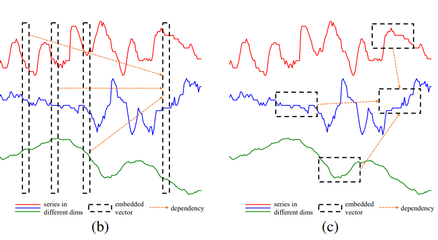
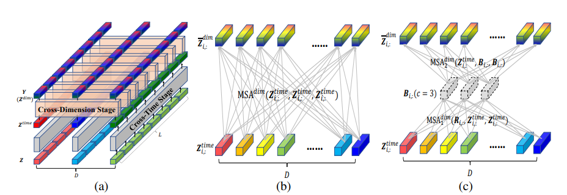
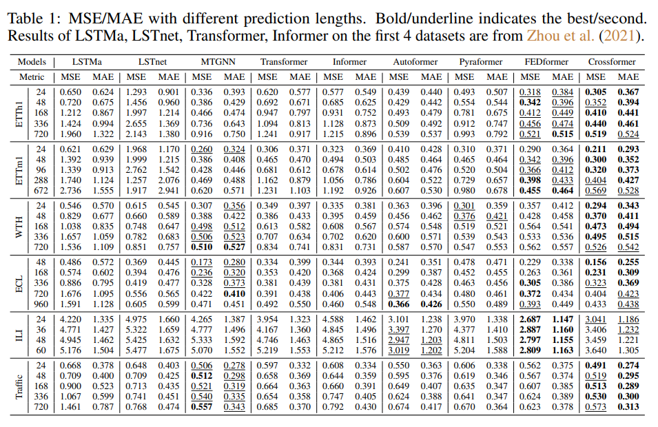
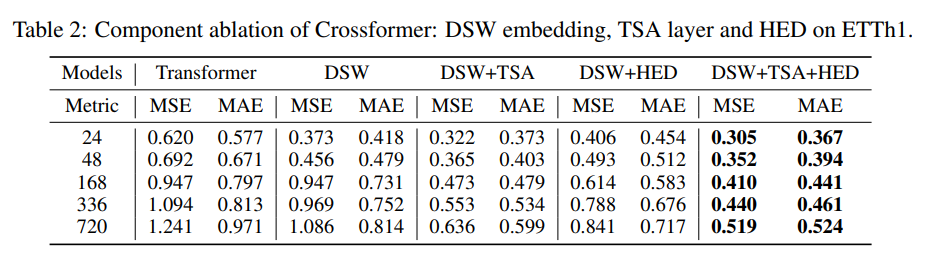
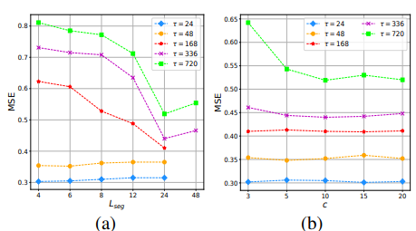
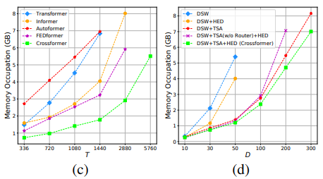

# 1. Motivation
다변량 시계열 (Multivariate Time Series, i.e. MTS)은 여러 차원을 갖는 시계열이다. 여기서 각 차원은 특정 단일변량 시계열을 나타낸다. 시간 간 종속성 (cross-time dependency)과 차원 간 종속성 (cross-dimension dependency) 모두 MTS 예측에서 중요한 역할을 한다. 

기존의 신경망 모델들은 명시적으로 차원 간 종속성을 포착한다. 즉, 잠재 특징 공간 (latent feature space)에서 차원의 정보를 보존하고 그 정보를 포착하기 위해 CNN 또는 GNN을 사용한다. 그러나 최근의 Transformer 기반 모델은 임베딩을 통해 이 종속성을 암묵적으로만 활용한다. 일반적으로 Transformer 기반 모델은 모든 차원의 데이터 포인트를 동시에 특성 벡터로 임베딩하고 서로 다른 시간 단계 사이의 종속성을 포착하려고 한다. 이러한 방식으로, 시간 간 종속성은 잘 포착되지만 차원 간 종속성은 그렇지 않을 수 있으며, 이는 예측 능력을 제한할 수 있다.

이러한 한계를 극복하기 위해 이 논문에서는 CrossFormer라는 새로운 모델을 제안한다. 저자들은 Crossformer를 사용하면 차원 간 종속성도 포착함으로써 예측 능력을 높일 수 있다고 기대한다.

CrossFormer에는 세가지 단계가 포함되어 있다: Dimension-Segment-Wise (DSW) embedding, Two-Stage-Attention (TSA) layer, 그리고 Hierarchical Encoder-Decoder (HED). 각 단계는 해당 주제에 대한 선행연구의 한게점을 보완하였다. 

# 2. Related Work
이 논문에서 다루는 주요 개념들에 대한 선행 연구를 간단히 소개하고자 한다.
## 2-1. Multivariate Time Series Forecasting models

아래 표는 MTS 예측에 사용되는 모델 유형의 예를 요약하였다:

| 유형      | 모델 예시 | 특징     |
| :---        |    :----:   |          ---: |
| 통계 기반 모델      | Vector augo-regressive models (VAR), Vector augo-regressive moving average (VARMA) | 차원 간 및 시간 간 종속성을 선형으로 가정함
| 신경망 기반 모델   | TCN, DeepAR        | MTS 데이터를 벡터 시퀀스로 취급하고 CNN/RNN을 사용하여 시간적 종속성을 포착함      |
| 신경망 기반 모델 |LSTnet| CNN을 사용하여 차원 간 종속성을 포착하고 RNN을 사용하여 시간 간 종속성을 포착함 
| 신경망 기반 모델| MTGNN | 시간적 합성곱 층 (convolution layer) 및 그래프 합성곱 층 (convolution layer)를 사용하여 시간 간 및 차원 간 종속성을 포착함

대부분의 신경망 모델은 시간 간 종속성을 포착하기 위해 CNN과 RNN을 사용하고 있다. 하지만 저자들은 장기 종속성을 모델링하는 데는 기존 모델들의 방법으로는 어려움이 있을 수 있다고 말한다.

## 2-2. Transformers for MTS Forecasting

|  모델 예시     | 설명 | 특징     |
| :---        |    :----:   |          ---: |
| LogTrans      | LogSparse attention       | 트랜스포머의 시간복잡도를 O(L^2) 에서 O(L(log L)^2)로 감소시킴   |
| Informer   | ProbSparse self-attention        | KL 발산 추정을 통해 어텐션 점수의 희소성을 활용하여 O(L log L)을 달성함     |
| Autoformer | decomposition architecture with an Auto-Correlation mechanism | 시간복잡도: O( L log L)
| Pyraformer | pyramidal attention module | 다양한 해상도에서 특징을 요약하여 O(L)을 달성
| FEDformer | frequency enhanced Transformer | 시계열이 주파수 도메인에서 희소한 표현을 가지고 있다고 주장함; O(L) 달성
| Preformer | segment-wise correlation-based attention | 임베딩된 특성 벡터 (feature vector) 시퀀스를 세그먼로 나눔

이러한 트랜스포머 기반 모델은 시간 간 종속성 모델링의 시간 복잡도를 줄이는 데 초점을 맞추었지만, 차원 간 종속성의 시간 복잡도는 고려하지 않았다.

## 2-3. Vision Transformers
저자들은 DSW 임베딩의 영감을 ViT에서 이미지를 패치로 분할하는 아이디어로부터 얻었다. ViT는 이미지를 중간 크기의 겹치지 않는 패치로 분할하고 이를 순서대로 재배열하여 트랜스포머의 입력이 되는데, Crossformer의 MTS는 차원별 세그먼트로 분할된다.

# 3. Methods
이 논문에서 제안하는 Crossformer의 downstream task는 MTS forecasting이다. MTS forecasting은 과거의 기록을 고려하여 시계열의 미래 값을 예측하는 것을 목표로 한다:

$x_ {(1:T)} \in \mathbb{R}^{T \times D} \text{  (history)}$

$x_ {(T+1):(T+\tau)} \in \mathbb{R}^{\tau \times D} \text{  (future)}$ 

## 3-1. Dimension-Segment-Wise Embedding
 
기존 방법은 동일한 시간 단계의 데이터 포인트를 벡터로 임베딩한다. 구체적으로, 다음과 같은 단계를 거친다:

$x_t \text{ -> } h_t,x_t \in \mathbb{R}^D, h_t \in \mathbb{R}^{d_ {model}}$ 
- $x_t$: 시점 t에서 D 차원의 모든 데이터 포인트를 나타냄

- 인풋 $x_ {(1:T)}$ 은 T 벡터에 {$h_1$, $h_2$, ... , $h_T$} 입력됨
- 결과적으로, T 벡터 간의 종속성이 예측을 위해 포착됨

저자들은 차원 간 종속성을 명확하게 포착하기 위한 방법을 고안하게 된다.

임베딩된 벡터는 단일 차원의 시계열 세그먼트를 나타내어야 한다. 이는 단일 단계에서 모든 차원의 값을 나타내는 것과는 대조된다. 아래 그림에서 (b)는 기존 방법으로 같은 시간 단계에서 데이터 포인트를 벡터로 임베딩하는 것을 보여주고, (c)는 이 논문에서 제안된 DSW 임베딩 방법을 보여준다. 여기서 시간에 따라 인접한 포인트가 각 차원에서 임베딩을 위한 세그먼트를 형성한다.

각 차원의 포인트는 길이에 따라 세그먼트, $L_ {seg}$,로 나누어진 다음 임베딩 된다. 이때, $x_ {i,d}^{(s)} \in \mathbb{R}^{L_ {seg}}$ 는 길이 $L_ {seg}$를 가진 $d$ 차원의 $i$번째 세그먼트이다. 이를 수식으로 표현하면 다음과 같다:

$X_ {1:T} = X_ {i,d}^{(s)}\vert 1 \le i \le \frac{T}{L_ {seg}}, 1 \le d \le D$

$X_ {i,d}^{(s)} = x_ {t,d}\vert (i-1) \times L_ {seg} < t \le i \times L_ {seg}$

각 세그먼트는 선형 투영과 위치 임베딩이 추가된 벡터에 임베딩된다. 이때, $E \in \mathbb{R}^{d_ {model} \times L_ {seg}}$은 학습 가능한 투영 행렬을 나타내고 
$E_ {i,d}^{(pos)} \in \mathbb{R}^{d_ {model}}$는 position ($i$, $d$)에 대한 학습 가능한 위치 임베딩을 나타낸다. 수식으로 표현하면 다음과 같다:

$h_ {i,d} = Ex_ {i,d}^{(s)} + E_ {i,d}^{(pos)}$

DSW 임베딩의 최종 출력은 각 $h_ {i,d}$가 단변량 (univariate) 시계열 세그먼트를 나타내는 2차원 배열이다.

$H = h_ {i,d}\vert 1 \le i \le \frac{T}{L_ {seg}}, 1 \le d \le D$  

## 3-2. Two-Stage Attention Layer

### 3-2-a. Cross-Time Stage:  $O(DL^2)$

DSW 임베딩의 아웃풋인 2차원 배열, $Z \in \mathbb{R}^{L \times D \times d_ {model}}$, 은 TSA layer의 인풋이 된다. $Z_ {i.:}$ 은 시간 단계에서 모든 차원의 벡터를 나타내고 $i$ and $Z_ {:,d}$ 은 차원 d의 모든 시간 단계의 벡터이다. 시간상의 교차 단계에서는 각 차원에 대해 다중 헤드 셀프 어텐션(Multi-Head Self-Attention, i.e. MSA)이 적용된다.

|  인풋     | 적용 기법 | 아웃풋     |
| :---        |    :----:   |          ---: |
| $Z$      | MSA, LayerNorm       |  $\hat{Z^{time}_ {:,d}}$ = LayerNorm($Z_ {:,d}+ MSA^{time}(Z_ {:,d},Z_ {:,d},Z_ {:,d}$))
| $\hat{Z^{time}}$ | MLP, LayerNorm | $Z^{time}$ = LayerNorm($\hat{Z}^{time}+ MLP({\hat{Z^{time}}}$))

같은 차원 내의 시간 세그먼트 간의 종속성은 in $Z^{time}$ 에 포착된다. 

### 3-2-b. Cross-Dimension Stage:   $O(DL)$

저자들은 잠재적으로 큰 D에 대해 라우터 메커니즘 (router mechanism)을 사용했고, 각 시간 단계 $i$에 대해 소수의 학습 가능한 벡터를 라우터로 설정했다.

|  인풋    | 적용 기법 | 아웃풋     |
| :---        |    :----:   |          ---: |
| $R_ {i,:}, Z_ {i,:}^{time}, Z_ {i,:}^{time}$      | MSA 1       |  $B_ {i,:}$
| $Z_ {i,:}^{time}, B_ {i,:}, B_ {i,:}$  | MSA 2 |  $\bar{Z^{dim}_ {i,;}}$
| $Z^{time} + \bar{Z}^{dim}$| LayerNorm | $\hat{Z}^{dim}$
| $\hat{Z}^{dim} + MLP(\hat{Z}^{dim})$ | LayerNorm | $Z^{dim}$

시간상 교차 단계와 차원상 교차 단계를 종합하면, 두 단계는 다음과 같이 모델링된다:

$Y = Z^{dim} = TSA(Z)$. 

이 때, $Z, Y \in \mathbb{R}^{L \times D \times d_ {model}}$ 
는 각각 TSA 층의 입력과 출력 벡터 배열을 나타낸다. TSA 층의 최종 시간복잡도는 $O(DL^2+DL) = O(DL^2)$ 이다.

정리하면, 위 그림의 (a)는 MTS를 표현하는 2차원 배열을 프로세싱하기 위한 TSA 층을 나타낸다. 여기서, 각 벡터는 기존 시계열의 세그먼트를 나타낸다. 전체 배열은 시간상 교차 단계와 차원상 교차 단계를 거쳐 각 종속성을 얻는다. 
그림의 (b)는 차원상 교차 단계에서 직접적으로 MSA를 사용하여 D-to-D 연결을 구축하는 경우를 나타내고, 그림의 (c)는 차원상 교차단계의 라우터 메커니즘을 나타낸다. 구체적으로, 특정 갯수 (c개) 의 라우터는 전체 차원에서 정보를 얻고 그 정보를 전파한다. 이 과정을 통해 시간복잡도가 $O(2cD)$ 에서 $O(D)$로 줄어든다.

## 3-3. Hierarchical Encoder-Decoder
마지막 단계로 저자들은 DSW 임베딩과 TSA 레이어를 사용하여 계층적 인코더-디코더를 구성했다. 트랜스포머 기반의 MTS 예측 모델은 다양한 척도의 정보를 포착하는 데 알려진 계층적 구조를 널리 활용한다. Zhou et al. 2021과 Liu et al. 2021a도 이러한 구조를 사용했다.

### Encoder:   $O(D \frac{T^2}{L^2_ {seg}})$
시간 도메인의 두 인접한 벡터를 병합하여 보다 거친 수준의 표현을 얻는다. 이 과정은 첫번째 레이어를 제외한 각 인코더 레이어에 수행된다. 이 단계에서 종속성을 포착하기 위해 TSA 층이 적용된다. 수식으로 표현하면 다음과 같다:

$Z^{enc, l} = Encoder(Z^{enc, l-1})$ 

이때, $H$는 DSW 임베딩을 통해 얻어진 2차원 배열을 나타내고 $Z^{enc,l}$는 $TSA(\hat{Z}^{enc, l})$를 나타낸다.

### Decoder:    $O(D \frac{\tau(T+\tau)}{L^2_ {seg}})$

예측을 위한 디코더에서는 N+1개의 층이 사용된다. 층 $l$은 $l$번째 인코딩된 배열을 입력으로 받고 층 $l$의 디코딩된 2차원 배열을 출력한다.

세부적인 단계는 다음과 같다:

$Z^{dec,l} = Decoder(Z^{dec, l-1}, Z^{enc, l})$

|  인풋     | 적용 기법 | 아웃풋     |
| :---        |    :----:   |          ---: |
| $\tilde{Z^{dec,l}_ {:,d}}, Z^{enc,l}_ {:,d}, Z_ {:,d}^{enc,l}$      | MSA        |  $\bar{Z^{dec,l}_ {:,d}}$
| $\tilde{Z^{dec,l}} + \bar{Z^{dec,l}}$  | LayerNorm |  $\hat{Z^{dec,l}}$
| $\tilde{Z^{dec,l}} + MLP(\hat{Z}^{dec,l})$| LayerNorm | $Z^{dec,l}$

그런 다음, 각 층의 출력에 선형 투영이 적용되어 해당 층의 예측을 생성한다. 층의 예측은 합산되어 최종 예측을 만든다.

# 4. Experiments
## 4-1. Setttings
저자들은 6개의 실제 데이터셋을 사용하여 실험을 진행하였다.

1) ETTh1 (Electricity Transformer Temperature-hourly)
2) ETTm1 (electricity Transformer Temperature-minutely)
3) WTH (Weather)
4) ECL (Electricity Consuming Load)
5) ILI (Influenza-Like Illness)
6) Traffic

데이터셋의 선택 및 train/validation/test 세트의 분할 비율(0.7:0.1:0.2)은 Zhou et al. (2021) 및 Wu et al. (2021a)의 연구에서 수행된 작업을 따랐다.

저자들은 결과 비교를 위해 다음과 같은 모델들을 기준 모델 (baseline model)로 사용하였다:

1) LSTMa (Bahdanau et al., 2015)
2) LSTnet (Lai et al., 2018)
3) MTGNN (We et al., 2020)
4) Transformer (Vaswani et al., 2017)
5) Informer (Zhou et al., 2021)
6) Autoformer (We et al., 2021a)
7) Pyraformer (Liu et al., 2021a)
8) FEDformer (Zhou et al., 2022)

실험의 설정은 다음과 같다:

1) train/validation/test 세트는 train 세트의 평균과 표준 편차로 zero-mean 정규화했다.
2) 미래 창 크기 (future window size) $\tau$가 변하는 것에 대한 성능을 평가했다.
3) 각 $\tau$에 대해, 과거 창 크기 (past window size) $T$를 탐색할 하이퍼파라미터로 고려했다.
4) 전체 세트를 스트라이드 (stride)=1로 롤하여 다양한 입력-출력 쌍을 생성했다.
5) 평가 지표로서 MSE와 MAE를 사용했다.
6) 모든 실험은 5회 반복했으며 평균만 보고했다.

## 4-2. Results

아래 Table 1에서 볼 수 있듯이, Crossformer는 대부분의 데이터셋에서 선도적인 성능을 보였다. Crossformer는 ILI 데이터셋에서 FEDformer 및 Autoformer에 뒤진 성능을 보였는데, 저자들은 이는 데이터셋 크기가 작고 이 두 모델이 네트워크 구조에 일련의 분해에 대한 사전 지식을 도입했기 때문일 것으로 추측했다. MTGNN은 명시적으로 차원 간 종속성을 사용하기 때문에 Transformer 기반의 많은 기준선보다 우수한 성능을 보였다.

## Ablation study 

Crossformer은 세 가지 방법으로 구성되었다: DSW 임베딩, TSA 레이어, 그리고 계층적 인코더-디코더. 저자들은 ETTh1 데이터셋과 Transformer를 기준선으로하여 ablation 연구를 수행했다. 세 가지 ablation 버전을 비교했다: 1) DSW, 2) DSW+TSA, 3) DSW+HED. 결과는 아래 그래프와 같았다:

|  Ablation 버전     | 결과 | 저자의 해석     |
| :---        |    :----:   |          ---: |
| DSW      |   Crossformer가 대부분의 설정에서 Transformer보다 더 나은 성능을 보임     |  DSW 임베딩의 유용성과 차원 간 종속성의 중요성을 시사
| DSW+TSA  | TSA가 예측 정확도를 지속적으로 향상시킴 | 시간과 차원을 다르게 처리하는 것은 합리적이고 TSA는 고차원 데이터에서 Crossformer의 사용을 가능하게 함
| DSW+HED| 단기 예측 길이에서는 정확도가 감소하지만, 장기 예측에서는 증가함  | 다양한 척도의 정보는 장기 예측에 도움이됨| 
DSW+TSA+HED | 모든 설정에서 최상의 결과를 보임 | 

## 하이퍼파라미터의 유용성 평가
저자들은 ETTH1 데이터셋에서 세그먼트 길이 ($L_ {seg}$)와 TSA의 라우터 수 ($c$)의 효과를 평가했다. 결과는 아래와 같았다:

1) 세그먼트 길이
- 단기 예측 ($\tau$=24, 48)에서는 더 작은 세그먼트가 상대적으로 더 나은 결과를 가져오지만, 예측 정확도는 안정적임
- 장기 예측 ($\tau \ge 168$)에서는 세그먼트 길이를 4에서 24로 연장하면 MSE가 감소함
- 따라서 장기 예측에는 장기 세그먼트를 사용해야함
2) TSA층의 라우터 수
- $\tau$ $\le$ 336에 대해 $c$에 대한 Crossformer의 성능은 안정적임
- 라우터의 수는 모든 차원 간의 정보 대역폭 (bandwidth)을 제어함

## 계산 효율성 (computational efficiency) 분석

기존의 트랜스포머 기반 모델들의 시간복잡도와 비교했을 때, Crossformer는 큰 값의 $L_ {seq}$가 사용되는 장기 예측의 경우 실제 복잡도를 크게 줄일 수 있다는 장점을 갖고 있다. 저자들은 여러 모델간의 메모리 점유량 (memory occupation)을 ETTh1 데이터셋을 사용하여 평가하였다. 예측 창의 크기 $\tau$를 336으로 설정하고 입력 길이 $T$를 연장하였다. 결과는 아래와 같았다:

그래프 (c)에 나타났듯이 $T$가 무한대에 가까워질수록 Informer, Autoformer, 그리고 FEDformer가 더 효율적이다. Crossformer는 $T$가 극단적으로 크지 않을 때 최상의 성능을 보인다. 

추가로 저자들은 차원 수 D에 대한 메모리 점유량도 분석하였다. Crossformer의 abalation 버전들간의 분석을 진행하였는데, 그래프 (d)에 나타났듯이 TSA 층은 복잡도를 줄이는데에 도움이 되고 더 나아가 라우터 메커니즘은 복잡도를 선형으로 만들어주어 Crossformer가 30차원 (D=30) 데이터 처리를 가능케 했다. 또한, 결과에 따르면 계층적 인코더-디코더 (HED)는 메모리 비용을 약간 줄일 수 있으며, 이는 세그먼트 병합 후 상위 레이어에 더 적은 벡터가 있기 때문이라고 분석하였다.

# 5. Conclusion
이 논문에서 저자들은 다차원 시계열 (MTS) 예측을 위해 cross-dimension dependency를 활용하는 트랜스포머 기반 모델인 Crossformer를 제안한다. 구체적으로, Dimension-Segment-Wise Embedding (DSW) 은 입력 데이터를 2차원 배열로 임베딩하여 시간과 차원의 정보의 보존을 가능케 한다. 그 후 TSA층을 통해 DSW 임베딩의 출력 배열의 시간 및 cross-dimension dependency를 포착하였고, 마지막으로 hierarchical encoder-decoder를 활용하여 다양한 척도의 정보를 활용하였다. 새롭게 고안된 Crossformer 모델은 6가지의 실제 데이터셋에 대해 기존 state-of-the-arts 결과에 견주는, 혹은 더 뛰어난 성능을 보였다. 

# 6. Future direction
- TSA 층의 차원상 교차 단계 (Cross-Dimension Stage)에서는 차원 간에 simple full connection을 구축하였는데, 이는 고차원 데이터셋에서 노이즈를 도입할 수 있다. Crossformer TSA층의 이러한 문제점은 최근에 연구된 sparse and efficient Graph Transformers (Wu et al., 2022)가 도움을 줄 수 있을것으로 보인다.

- 최근 연구인 Zeng et al., 2023는 MTS 예측에 대한 트랜스포머의 효과에 대한 의문을 바탕으로 일부 데이터셋에 대해 Crossformer을 포함한 모든 트랜스포머 기반 모델들을 능가하는 성능을 보이는 DLinear을 제안하였다. 이는 트랜스포머의 MSA (Multi-headed Self Attention)가 permutation-invariant (뜻: 입력 벡터 요소의 순서와 상관없이 같은 출력을 생성함)하기 때문이라고 주장하였다. 저자들은 트랜스포머의 순서 보존 능력을 강화하는것은 이러한 결점을 보완하기 위한 유망한 방법이라고 해석하였다. 

- MTS 연구에 사용된 데이터셋은 시각 및 텍스트에 사용되는 데이터셋들 보다 훨씬 작고 간단하기 때문에 새로운 모델을 넘어서 다양한 패턴의 대규모 데이터셋을 사용한 연구도 필요하다.

# 7. References
Dzmitry Bahdanau, Kyunghyun Cho, and Yoshua Bengio. Neural machine translation by jointly learning to align and translate. In International Conference on Learning Representations (ICLR), 2015.

Guokun Lai, Wei-Cheng Chang, Yiming Yang, and Hanxiao Liu. Modeling long- and short-term temporal patterns with deep neural networks. In International ACM SIGIR Conference on Research & Development in Information Retrieval (SIGIR), 2018.

Shizhan Liu, Hang Yu, Cong Liao, Jianguo Li, Weiyao Lin, Alex X Liu, and Schahram Dustdar. Pyraformer: Low-complexity pyramidal attention for long-range time series modeling and
forecasting. In International Conference on Learning Representations (ICLR), 2021a.

Ashish Vaswani, Noam M. Shazeer, Niki Parmar, Jakob Uszkoreit, Llion Jones, Aidan N. Gomez, Lukasz Kaiser, and Illia Polosukhin. Attention is all you need. In Advances in Neural Information Processing Systems (NeurIPS), 2017.

Haixu Wu, Jiehui Xu, Jianmin Wang, and Mingsheng Long. Autoformer: Decomposition transformers with auto-correlation for long-term series forecasting. In Advances in Neural Information Processing Systems (NeurIPS), 2021a

Haoyi Zhou, Shanghang Zhang, Jieqi Peng, Shuai Zhang, Jianxin Li, Hui Xiong, and Wan Zhang. Informer: Beyond efficient transformer for long sequence time-series forecasting. In AAAI Conference on Artificial Intelligence (AAAI), 2021.

# 8. Author information
- Juneyoung Ro (노준영)
- Graduate School of Data Science (M.S. student)
- contact: juneyoung.ro@kaist.ac.kr