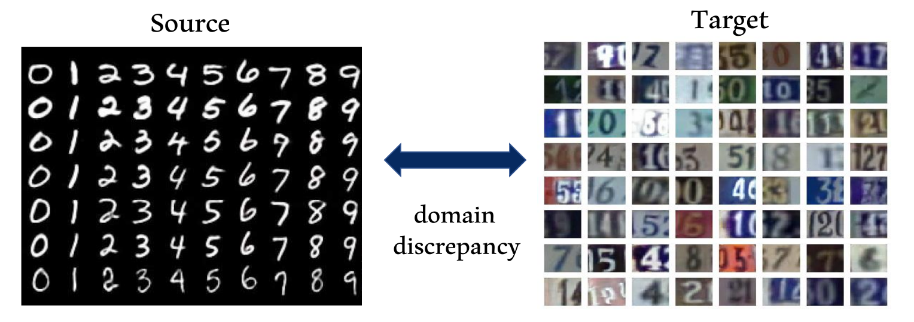
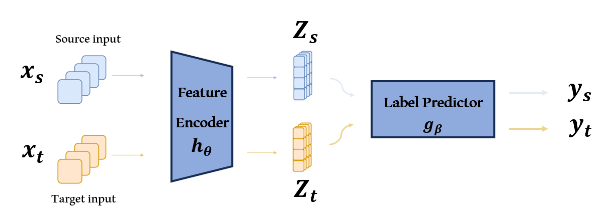
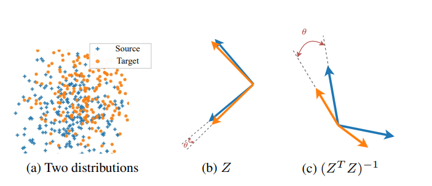

# **0. Preliminaries**

  

본 연구는 unsupervised domain adaptation regression task를 다룹니다.

  

문제 정의에 앞서, Domain Adaptation에 대해 간단히 설명드리겠습니다.

  

### Domain Adaptation이란?

우리가 보유하고 있는 데이터셋으로 학습한 모델 $f(\boldsymbol x)$가 있다고 가정하겠습니다.  

일반적인 머신러닝 task에서는 iid(independent and identically distributed) 상황을 가정합니다.

  
즉, 학습된 모델 $f$ 가 새로운 input에 대한 추론(inference)를 실시할 때, 그 input 데이터의 분포 역시 훈련 데이터의 분포와 다르지 않을 것이라고 가정합니다.

  

하지만 모델의 현실 적용에 있어서 iid와 같은 naive한 가정은 지켜지지 않는 경우가 많습니다.

  

만약 데이터의 분포 변화가 일어나게 된다면 분포 변화 이전의 데이터를 사용하여 학습된 모델 $f(\boldsymbol x)$는 분포 변화 이후의 데이터에 대해 높은 성능을 기대할 수 없을 것입니다.

  

이러한 데이터 분포의 변화를 극복하여 분포 변화 이후의 데이터에 대해서도 좋은 성능을 보이도록 하는 것이 바로 **Domain Adaptation(이하 DA)**입니다.

  

일반적인 DA에 관련한 context에서는 분포 변화 이전의 데이터를 **Source domain data**, 분포 변화 이후의 데이터를 **Target domain data**라고 일컫습니다.

  

# **1. Problem Definition**

  

DA 는 Unsupervised, Supervised로 구분됩니다.

  

Unsupervised/Supervised의 구분은 Target domain data $\chi_ t$의 label $\{ y_ t^i\}_{i=1}^{N_t}$의 유무에 달려있습니다.

  

본 연구에서 다루는 **Unsupervised DA**(이하 **UDA**)에서는, source domain의 labeled samples $\chi_ s :=\{\boldsymbol{x}_ i^S,\boldsymbol{y}_ i^S\}_ {i=1}^{N_ s}$ 과 Target domain의 unlabeled samples $\chi_ t:=\{\boldsymbol{x}_ i^T\}_ {i=1}^{N_ t}$가 주어집니다. 여기서 $N_ s$와 $N_ t$는 각각 $\chi_ s$와 $\chi_ t$의 sample size를 의미합니다. Classification problem의 Discrete labels $\mathcal Y$와 달리, 본 연구에서는 continuous and multidimensional한 labels $\mathcal Y\subset  \mathbb{R}^{N_ r}$ 를 대상으로 합니다.

  

Preliminary에서 설명드린대로, $P(\chi_ s)$와 $P(\chi_ t)$의 discrepancy를 극복하는 것이 UDA에서 풀어야 할 문제입니다. 그렇다면 우리는 궁극적으로 Target domain에서도 좋은 일반화 성능을 보이는 모델 $F:\boldsymbol x\mapsto  \boldsymbol y$ 를 학습해야 합니다.

  

MSE loss를 사용한 지도학습을 통해 $\chi_s$만으로 baseline model을 다음과 같이 훈련시킬 수 있습니다.

  

$\mathcal{L}_ {src} = \frac{1}{N_ s} \sum_{i=1}^{N_ s} \left\| \tilde{\boldsymbol y}_ s^i - \boldsymbol y_ s^i \right\|_ 2^2$

  

이 때 $\tilde{y}_ s^n=F(x_ s^i)$는 훈련용 source data $x_ s^i$에 대한 예측 값입니다.

  

하지만 Preliminary에서 설명드린대로, $P(\chi_ s)$와 $P(\chi_ t)$간에는 discrepancy가 존재합니다.

  

따라서, $\chi_ s$만을 사용한 baseline model로 $\chi_ t$에 대한 예측을 수행해서는 안됩니다. $P(\chi_ s)$와 $P(\chi_ t)$간의 차이를 극복하기 위해서는, 학습에 있어 추가적인 제약이 필요합니다. 이에 본 연구에서는 source data $\chi_ s$만을 사용한 baseline model과는 다르게 $\chi_ s$와 $\chi_ t$를 모두 활용하여 Target domain에서도 좋은 일반화 성능을 보이는 모델 $F:\boldsymbol x\mapsto  \boldsymbol y$ 를 학습하는 방법을 제시합니다.

  

수식을 사용하여 목표를 다음처럼 나타낼 수 있습니다.

  

$\arg  \min\limits_ F \mathbb{E}_ {(\boldsymbol x^t, \boldsymbol y^t)} \| F(\boldsymbol x^t), \boldsymbol y^t \|_ 2^2$

  

이때 $\boldsymbol y^t$는 학습시에 주어지지 않습니다.

  

# **2. Motivation**

  

딥러닝을 사용한 Deep UDA에서의 일반적인 접근 방식에 대해 설명드리겠습니다.

  

UDA에서의 목표는 $P(\chi_ s)$와 $P(\chi_ t)$의 discrepancy를 극복하는 것입니다.

  

확률 분포인 $P(\chi_ s)$와 $P(\chi_ t)$가 다르다는 것은, 각 분포의 marginal samples인 $\{\boldsymbol{x}_ i^S\}_ {i=1}^{N_ s}$와 $\{\boldsymbol{x}_ i^T\}_ {i=1}^{N_ T}$역시 다를 것임을 암시합니다. 서로 다른 분포의 데이터셋에 대해 동시에 좋은 예측을 하는 것은 쉽지 않은 일입니다. 그러나 Source domain data와 Target domain data간의 discrepancy가 존재한다고 하더라도, 두 데이터 간에 공유하고 있는 중요한 성질이 있을 것입니다. 그렇다면, 두 데이터 모두에 대해 좋은 성능을 내기 위해서는 두 데이터가 공유하는 중요한 성질에 근거하여 예측이 이루어져야 할 것입니다.[Figure 1 참조]

<!-- ![Figure 1](https://lh3.googleusercontent.com/fife/ALs6j_Et9hDWEt1RQTnC4RnXhZwuDE7qYGtrg-qlhjuaQYM02JGC7Ki0IDq9w-XMSkZGkGFXvsoqXhqWUWZ5HtA7quBfgm5ASNtqMiuvX92jrDSMZxtscw72JTvJg5kp-LwQQOtCVS3G_-zTftA21-FBjtq01RW6a61bTC6o3_NRRUVCUWHu7u5_2vIweDP_qo8EpFr65ow_1BZ38vydddvqsnK536D1a2SVTYRAYZo_XROakzNt7Ev4oIGoBiXEtGlosXdxMNV-VQpJjTE2TYVscz5Rxry7h43tny5tyQNKzP825gLA0qcOlFK110b3Ck3LedMhqS_d8pPsCGmHbwkPkeWkauJ8--QDzGUe7X4jKeZSrUfgmcSLmVH3LdugyiJG8JZvkhKmAUzlIqT754LcCuk_AaVZdLRw0LkK2jftYHaIME7ucCrOPMvtQ6SM6bhqBFDJGyQuA7EVhf5rDnIDbfSMRtqGNYUzFfikDloiYo-rGmUu8CSuR9cJcgPjhMDZTs3D3LIDjkfOkiJuRco8UX7-DMxvXxUxE_fD9nOX9bFF1S8aelqP3T0xVi-92CyHhF0iOkGt1cdLjZIehDJbbBbWwtWUzLeznEK0cqvxtlA6LUslxPERQfkI9fR7_XQGKxzeBoOlFKQQaqLCOyIbc9NKZiTqaZecn8tMJAAkZRka1XuwYqnWMtPp10_oJdSfawYk9cZqzvSLmS65XWT9sHgj7gOfKrHKw-w8iU3VI3e-0HPs9McUOOeLiKoPZXAXIL6GNu3zemjS_BICCAXcxX2mEjv2hoak_tlucYVinqsCukUSx6xcNHJ-mgk-S3r3LU7Tzm8KswNs-p58acyF5l7OF6mFnQUCyV4Pnu79l3_uTvr3XOiCDggvU5x1H4hIJCXV8zGa4jQxEEb4vxdxX4leMsOOR9-XALuIYeWpavPBKfbxXUGKkGRGGD75miSZGeoKXszrDRzi5lkoIosS2bFDUbqdtCcjkNFwzs4zE0-lbZt8IQDqHpoabcqPctSBIV2pASG_KkINR_wOjiAkq-Vpvt-l29a5J8xrg3bPN5Qf-9dI-bPMMiLV0XFaGtONMHH-S6r9M3FCBowPpN-3L4pCW3hHcbQyzo7fW5p46dYhJOUK-_BaIchnS6Mb48tM9g-fQoJt2AMrUU8Kd8MSnfe3cIA0ijAvNC5NGm-v3pxIXj2yrAMoj8qlxHPuO5I_nxaFhkZH2iNQqTs599ZKc15tQW1kGMooVHizT_Mq_jzE5rjwj8v1X3yGjxS2BbRMWx_rPHlaxsQDd_qUrog7IxQRgzguE4aY6-CyN-gX2JiZhTpoUsNZKrSOuNe3kzyQ2CicQ4XX0S4PBGfLl9qHXM2GKc9LJf_bl5PCbu2-It_Zwfd2tFGjxUQ33Od5T4Em5kdCC7xi-oazk4Uc7nY78PVZJBeGJzARPRnTfZYCqD_FgTAdF9dMRMJr-jt6RGlk8jgSSdLNFNBUuUx7uPr5sW-NiKe6J0GyzZjp7eFOQu6GG-qpLznOOT54egd3zet8DQeRhdEwc68tWTEiIA0EFmcoYoGinXzxSEQHnAE0GcI333kCKOizguwMJxgRYcqP00VwYcBxZ1Eg_F48yl9q5_hQJ7rLTH-Xg8tjOgmoMTINuRmzIxrSrw8=w1872-h966) -->

[Figure  1]. 모델이 source와 target에 대해 모두 좋은 예측 성능을 내기 위해서는 Source와 Target간의 차이점이 아닌, 공유하는 ‘숫자’라는 본질에 집중해야 합니다.

  

딥러닝은 latent space 상에서 데이터의 유의미한 저차원 representation을 효과적으로 추출해 내는 것으로 알려져 있습니다. Original space 상에서 $\{\boldsymbol{x}_ i^S\}_ {i=1}^{N_ s}$와 $\{\boldsymbol{x}_ i^T\}_ {i=1}^{N_ T}$간의 discrepancy가 존재하더라도 딥러닝이 제공하는 latent space 상에서 $\{\boldsymbol{x}_ i^S\}_ {i=1}^{N_ s}$와 $\{\boldsymbol{x}_ i^T\}_ {i=1}^{N_ T}$간의 discrepancy를 줄일 수 있을 것입니다. 만약 원래는 서로 달랐던 두 데이터 분포가 latent space 상에서 겹쳐진다면, latent space 상에서 하나의 label predictor $g_ \beta$(=linear layer)를 이용하여 두 데이터 셋에 대해 모두 좋은 예측을 수행할 수 있을 것입니다.

<!-- ![Figure2](https://lh3.googleusercontent.com/fife/ALs6j_Hngzjr4kdblnCnFwE1M99MoiV_3DhyMfdT503MU3PnKjWe6my3Z0fbUKBSEzNEu-tIcZpz-9LWqZJaCDWvtlvMTA253f2sV1pOtXNkn3tPGiGRCfZmRSfqFOz09av8mf_v1QhOANDKKOc_naRPxfo9Ebn3VTYwhh3PnLCBrAa6GBXhGV4M8cF8YK3gAf43DpiJt1EMmXIe7r4qBbe6Mgh7I4MGLIgNuuwabTqBe2HZT3n-YK6tHPHI638kC38ISSO6VUKJFhE4WGU7QSRbwPFzvzj6Q5410hWF1v72h3ENXOnGnWPPs1rTXTkpSzXNbl0eZdPafHMe9hf4RF_9NneHG0kXCQsNi0DcZ5GHHVA0IKtAJg1pQPHf2n2Eg_7W5imbcYowyR3pbx2qBCuwdq3tDOVSBUXy22SI9qbcXi-8v5aYOHTAGgynBxopDYS7qv6vJjf-eNUvawT6eyVtNjMVpGyiC8S3PT7JhbND1yEG404WhUP_RpED3kQ3i8Yc8yUkx1gqusBdMXCXJhCvCjczlZK43Dr5gRKXEeh8ZDkm9v-jauFaQBTTrdVfVz9Sgi_DwbbtDBASjc4NVv-B6SmBTVxqH_kKEZJUFkrGmvSNq50f5frn1Fxgif-YkPhTkL2rF9pDOP2V23gyTxMc3rURL4OfSjHZEkERnLugkcaSpWufDNXChB8iOcX9uq52INBPENGleYTKiflOCgu6Rj5TMK_6Dh7lLMyrnmZFwEd0H8pn2fX6kJeq9zTeJMOFV0LD45Tkl6c7Diac3YXbJxCoUcAlhn5Xdf2HDw6bE1T7HxDEvvG-5DOUNBoSfXTbpcgHD3LmnwSKlidq2GZXa0A0CYFldvCzSUv9xCkauUZxhW6vmjOWX--Kx5IhqH5XoJoNipw86TH3qYPMzPBsNwhl--f4iuARXwSxj3OQs3sExjBQ4kpbcVx8-9n2XaCV4JDuRRevolyzGsid5lXXgm4hMAITxflxkqPh_panpAznw32b93A_rOWd6U6UtWvo0AnqCKm21Ughaz6luK5B7o7epm6PjwDWqsRmpm_52F1gYQ3nekbei0DASHFIE6_RIt2WPuhhbF3eOb2_2JRyRfSDW1Zh9EjVlhhcaRvTmUHs-CrN6djkpA09F9Lss05MddU6nOCy9VESxEj1HEpVg1qK6tdEdm87C2DCIDSRP1DGPGgZInbqcnYCfMGlPsma8q8Quo2aDhO_5E89WEARhYeWlv1MdKyogDfoRSdEj_HgxZWaxPx7Q5FKDWIyf-nLN1Yu0FvBriinpHyGAbZ17CXyQZlaBFoKinGv-i5dDT6ZH5mAYWrPwLD71kpo7VAx6HW0ZxnFboq3zaP6dM1OeD9k29WFxT6kUGEsiGVTI4hq-IDOUI0Pqdlt1Pdqzr0npI9lPRb3u4YYb8nNJFkxNy4Zc3OqWdbPRHT1aJ3PZMqy3W7kPpzLclyGWv3kyAMHx4NxZxaCxPsqF_iMRHCrVnYip27QlWSk_q6D6Jf0xkRZEJFc7-vCWKEYP8U0juSYumtFjL2B9c_06mhVZmxNsjn1sp_6ORVLc-fmK9GSR-iu_x4L5ixJvG2KKkdD7_qgZyL4tneYa7sjW-Ybj1NXSv0TfJsD3FHjLcURZiX2lav9q1fUBVEudek=w1872-h966) -->

  

[Figure  2]. Deep UDA에서의 일반적인 접근

  

Deep DA에서는, input 데이터 $\boldsymbol x$가 주어졌을 때, deep representation인 $\boldsymbol z=h_ \theta(\boldsymbol x)$ 를 학습하기 위해, feature encoder $h_ \theta$가 사용됩니다. latent space의 representation $\boldsymbol z$는 Linear layer $g_ \beta$를 거쳐 최종 prediction $\boldsymbol y$가 됩니다. 이를 수식으로 표현하면 아래와 같습니다.

  

$\tilde{\boldsymbol y} = F(\boldsymbol x) = g_ {\beta}(h_ {\theta}(\boldsymbol x)) = g_ {\beta}(\boldsymbol z)$

  

아래와 같이 latent feature matrix $\boldsymbol Z$를 정의하겠습니다.

  

$p:=$ latent space representation $(z=h_ \theta(x)\in\mathbb{R}^{p})$

  

$b:=$ batch size

  

$\boldsymbol Z:=$ latent feature matrix $(\boldsymbol Z=[\boldsymbol z^1,...,\boldsymbol z^b]^T\in\mathbb{R}^{b\times p})$

  

앞서 ‘원래는 서로 달랐던 두 데이터 분포가 latent space 상에서 겹쳐지게 한다’라고 설명했습니다. 실제로 많은 DA 접근에서 source features $\boldsymbol Z_ s$와 target features $\boldsymbol Z_ t$의 분포 차이를 최소화 하는 것을 목표로 합니다. 그렇게 latent features가 정렬된다면, target domain에 대해 좋은 성능을 낼 것이라고 가정하곤 했습니다. 그러나 source features와 target features이 latent 상에서 유사하더라도 각각 linear layer $g_ \beta$를 통과한 후에는 둘 간의 유사성을 장담할 수 없습니다. 이는 regression problem에서 특히 주의해야 합니다. 그 이유에 대해서는 후술하겠습니다.

<!-- ![Figure3](https://lh3.googleusercontent.com/fife/ALs6j_HLRdGGUkx5ra3AHpnRwPcgDQFyWiqMXC9cNiVMtAzaEZzMjAqs4fz8z1g3f-mHN5V5_J3CrHpx1ViV2_US0k5VLE014iFBjW80TPRqP2YjUhW-7Bb0Cy_uOzdfxTUSRG4cB5sjyXNOgvk_iH2InxFuAMJm5qNx_CxKFUAvmu3mLtqPwhTtu2-SzPGe46HdgIJpasW3Lz51PgJqz0o0YlBhopoO2O33PULqASxJ5UZIGiH3cD-UL4Ktw3vHxK3kEo5eTNQRPlqIGEor6L12ljZjrKzPoumOpydNOzDdyCrNyXoXJLFlb2QzPwz3bpRf9CQGubtsci-143d_BwhDU8-KVrbs9ZyJ2hFJGZXGdUmBuAjRBCp3XCAzREBCmbX007gyw17RVjneL98qvgjybUdkjJlvsfMb_StO7BGV2ld-kgU9ig7PdFigUlCA8epXafWtkSsAAmvT_wI3c-tIJXkobyKMTksJwdWeUHyiw-bDtxOQVaeaFXtJS5BJcBNKDTkANafutZR3iiy-Kj8WzHW5JI38ZvIPnCYXdpXHH7l1YWRl8p_Y--TAFKeE3Gvv6z2Y5VfyNEKsUxTMAwfDBTDQe5rQ_jKg-621ULEA3DxFpwcTkZV7TZ1oF9dui83h5BjIZHL0wNiiAwVYgluVOTP5lI8uZyWYC93X8P9_XudYQK9D85Z5Eoo_wVHEEruwHd0YImcQxeGnHgt1zldbTaOYDqnhLAMyz9trVqouGr35K9bphLzWPkrZCZdtmrbhEH-sWVVaNtrJIKr3wcS4nnFddqR35QQ8YssNU_FECiMOHvtOPLR07cg40RiK-RDQty9yr2z_bjXvXRgRrjXJq2N5Mp74HNLjB2uwt40Sq25Er5C-cPdKAXXMKnki24eGlhydQAPIRolDdYBPZHcIAVm-WhJLkgwVNjY-2v9plRe8oTh0Mvm636_tWIi6f5jw5UZ2U-XP8yhF1Z9gaZvtm89-CzolRbO14ruo2VSpkikBMPh8MQUicx0AF6r4VCrsnCPACAuQqggA7uKZDvJdIyeEpecP1roZVGD5YsxeSRswHwp2xmQ4WER_xg1aGGlGhSL0bbBv20Mv-C3xDO8iItvfWYqGimODjMOZ1G97nQd0pTe1vwuG8pFnh7h-a2Pms8Nui7kh8otqtYepvAD3gtd-sMxmDboZdg9bdebrx6a0Sl1xBq4hG0-VTPp87jS4IgSuLXTw0Hgsecum95Q_8uin-hKB2r-dvcBt3XlPeh-A2cHg9rJOcTzCodM1r9m_t61Y6Lt8P2Timf-laS0Z1KF6kYm_ji9GBlDFxCHRAwzOKut2UVjor59h2FSqrwYx-5B0FxYMbN6Zplm0p_NrudxraGtn4_KHx3UT8yhZ19jIk7YSWwk7QduGoavnGGva4e3b58o4WZ_w2q6qzdcX6bajR_cfR4k0eXAjLqGGecmp_miZWMBuGL83fPuywpTfso7ej77GACr4nwEDBCpwzVVG_9jEah9aabUKvNSBXj9k__HVeXxISxp4CSGV6QoGlV9irEgoJWc9q448_adVRGtj80SrK13qod15zKnmfY7UQGbAnk0uoGlway-Qz7s1DfS8iGnKSvveDbEo3e4iDzZvaayuaDua3rxxq2ERnzw4QKeizwDQ9lI=w1317-h966) -->

  

[Figure  3] OLS solution에서 inverse gram 연산의 영향

  

latent feature $\boldsymbol Z$가 linear layer $g_ \beta$를 거쳐 $\boldsymbol Y$가 됩니다. 즉, $\boldsymbol Y=\boldsymbol Z\beta$라고 표현할 수 있습니다. Linear layer의 parameter $\beta$는 ordinary least-squared(OLS) closed form solution을 갖습니다.

  

$\hat{\beta}= (\boldsymbol Z^T\boldsymbol Z)^{-1}\boldsymbol Z^T\boldsymbol Y$

  

여기서 $(\boldsymbol Z^T\boldsymbol Z)^{-1}\in  \mathbb{R}^{p\times p}$는 inverse of Gram Matrix입니다. 일반적으로 데이터 행렬을 제곱한 것의 역행렬을 Gram Matrix라고 일컫습니다. 서로 다른 도메인(source and target)의 두 가지 dataset $\boldsymbol X_ s ^{'}, \boldsymbol X_ t^{'}$가 있다고 가정하겠습니다. (’을 붙인 이유는 일반적인 notation인 $\boldsymbol X$와 specific한 dataset $\boldsymbol X^{'}$를 구별하기 위함입니다.) DA가 잘 이루어 졌다면, 두 개의 데이터에 대한 예측은 최종적으로 같거나 유사해야 합니다. $\boldsymbol Z_ s^{'}=h_\theta(\boldsymbol X_ s^{'}), \boldsymbol Z_ t^{'}=h_ \theta(\boldsymbol X_ t^{'})$변환을 거치고 latent vector $\boldsymbol Z^{'}$에 대해 linear regression이 수행되므로(linear layer $g_ \beta$), $\boldsymbol Y^{'}=\boldsymbol Z^{'}\hat{\beta}=\boldsymbol Z^{'}(\boldsymbol Z^{'T}\boldsymbol Z^{'})^{-1}\boldsymbol Z^{'T}\boldsymbol Y^{'}$값이 source와 target에 대해 같거나 유사해야 합니다. 즉, DA의 목표인 source와 target이 모두 유사하게 좋은 성능을 내기 위해서는, $\hat{\beta}_ s$와 $\hat{\beta}_ t$사이의 적절한 optimal $\hat{\beta}_ *$를 linear layer의 parameter로 삼아야 합니다. $\hat{\beta}_ *$는 $\hat{\beta}_ s$와 $\hat{\beta}_ t$사이의 값이므로, $\hat{\beta}_ s$와 $\hat{\beta}_ t$의 차이가 크다면, 안정적으로 shared linear layer의 optimal parameter $\hat{\beta}_ *$을 찾을 수 없게 됩니다. 즉, 우리의 목표를 위해서는 각 도메인에 대한 $\hat{\beta}$이 유사해야 하고, 이를 위해서는 $(\boldsymbol Z^T \boldsymbol Z)^{-1}$가 비슷해야 합니다. 왜 그래야 하는지 이제 설명드리겠습니다.

  

[Figure  3]의 (a)에서 서로 다른 gaussian distribution을 따르는 Source와 Target의 데이터 분포를 확인할 수 있습니다. (b) $\boldsymbol x_ s$와 $\boldsymbol x_ t$는 feature encoder $h_ {\theta}$를 통해 latent space로 mapping 됩니다($\boldsymbol z_ i = h_ {\theta}(\boldsymbol x_ i)\;where\;i=s,t)$. $\boldsymbol Z_ s$와 $\boldsymbol Z_ t$는 latent space의 subspace입니다. $\boldsymbol Z_ s$와 $\boldsymbol Z_ t$의 basis가 서로 잘 정렬되어있다고 하더라도, (c) 두 subspace가 inverse gram 연산을 거친 후에는 더이상 정렬되어 있지 않을 수 있습니다. <Figure  3>가 말하고자 하는 바는 OLS solution과 관련이 있는 regression problem에서는 기존의 DA 방법에서 쓰던 것처럼 $\boldsymbol Z$를 정렬하는 것으로는 부족하며, 오히려 $(\boldsymbol Z^T \boldsymbol Z)^{-1}$를 latent space 상에서 정렬해야 한다는 것입니다.

  

Method에서는 우리가 집중해야 할 두 가지에 대해 알아보겠습니다.

  

1. Angle Alignment of $(\boldsymbol Z^T \boldsymbol Z)^{-1}$

2. Scale Alignment of $\boldsymbol Z$

  

# **3. Method**

  

우리에게 정렬의 대상은 $\boldsymbol Z^T \boldsymbol Z$이 아닌 $(\boldsymbol Z^T \boldsymbol Z)^{-1}$입니다. 학습 중에 batch size $b$는 embedding dimension $p$보다 일반적으로 작습니다$(\boldsymbol Z\in \mathbb{R}^{b\times p}, with\; b<p)$.  따라서  Gram  matrix $(\boldsymbol Z^T \boldsymbol Z)\in  \mathbb{R}^{p\times p}$의 rank $r$은 $b$보다 작거나 같게 됩니다. 즉, fully ranked 되지 않고 따라서 invertible 하지 않습니다. Gram matrix $\boldsymbol  Z^T  \boldsymbol  Z$가  invertible하지  않다면,  $(\boldsymbol  Z^T  \boldsymbol  Z)^{-1}$를  계산하는  데에  문제가  생기게  됩니다.  이에,  Moore-Penrose  pseudo-inverse를  사용합니다.

  

## **3.1 Angle Alignment**

  

Angle Alignment 방법에 대해 먼저 설명하겠습니다.

  

Feature matrix $\boldsymbol Z$의 SVD 형식을 $\boldsymbol Z = UDV^T$라고 하겠습니다. 따라서, Gram matrix $\boldsymbol Z^T \boldsymbol Z$는 $\boldsymbol Z$의 SVD를 이용해 다음과 같이 분해 될 수 있습니다.

  

$(\mathbf{Z}^T\mathbf{Z}) = (UDV^T)^T(UDV^T) = V\Lambda V^T,$

  

$\lambda_ k := \Lambda_ {k,k} = D_ {k,k}^2  \quad  \text{for } k = 1, \ldots, p.$

  

$\boldsymbol Z^T \boldsymbol Z$의 eigenvalues를 다음과 같이 나열할 수 있습니다.

  

$\lambda_ 1  \geq  \ldots  \geq  \lambda_ k  \geq  \ldots  \geq  \lambda_ p  \geq  0$

  

Moore-Penrose pseudo-inverse는 $\lambda_ k$보다 작은 singular values를 0으로 대체하여 유도할 수 있습니다. ($k$는 하이퍼파라미터)

  

$(\mathbf{Z}^T\mathbf{Z})$의 pseudo-inverse는 다음과 같이 표현될 수 있습니다.

  

$(\mathbf{Z}^T\mathbf{Z})^+ = V^T\Lambda^+V = V^T\begin{pmatrix}\frac{1}{\lambda_ 1} & & & \\& \ddots & & \\& & \frac{1}{\lambda_ k} & \\& & & \mathbf{0}\end{pmatrix}V$

  

위 연산은 역행렬의 가장 큰 singular value에 해당하는 차원을 제거하는 것과 동일합니다. 해당 연산의 근거를 제공하는 연구가 존재하는데, [Xinyang Chen et al. 2019]에 의하면 DA에서 큰 고윳값(우리의 경우에는 $\boldsymbol Z^T \boldsymbol Z$의 작은 고윳값을 제거하여 $(\mathbf{Z}^T\mathbf{Z})^{-1}$의 큰 고윳값을 제거함)을 제거하는 것이 성능 개선에 도움을 준다고 합니다. $k$개의 principal component로 구성된 source와 target의 Gram Matrix를 $G_ s^+ = (\mathbf{Z}_ s^T\mathbf{Z}_ s)^+$와 $G_ t^+ = (\mathbf{Z}_ t^T\mathbf{Z}_ t)^+$라고 하겠습니다.

  

지금까지의 흐름을 간단히 정리하겠습니다.

  

이번 섹션 3.1의 목표는 inverse gram matrix $(\boldsymbol Z^T \boldsymbol Z)^{-1}$의 angle alignment입니다. 하지만 $\boldsymbol Z^T \boldsymbol Z$가 non-invertible한 경우가 많기에, 우리는 pseudo-inverse gram matrix인 $G_ s^+ = (\mathbf{Z}_ s^T\mathbf{Z}_ s)^+$와 $G_ t^+ = (\mathbf{Z}_ t^T\mathbf{Z}_ t)^+$를 구했습니다.

  

이제 $G_ s^+$와 $G_ t^+$ 의 angle alignment만이 남았는데, 이는 $G_ s^+$와 $G_ t^+$ 의 column vectors간의 cosine similarity를 최대화 하여 수행할 수 있습니다. columns 간의 consine similarity는 다음과 같이 표현할 수 있습니다.

  

$\cos(\theta^{S \leftrightarrow T}_ i) = \frac{G^+_ {s,i} \cdot G^+_ {t,i}}{\|G^+_ {s,i}\| \|G^+_ {t,i}\|}\quad where\; i\in [1,p],\; and\; G_ i^+:ith\;column\;of\;the\;G_ i^+$

  

$M = [\cos(\theta_ 1^{S \leftrightarrow T}), \ldots, \cos(\theta_ p^{S \leftrightarrow T})]$일때, pseudo-inverse of Gram matrix의 선택된 $k$개의 basis를 정렬하기 위한 loss는 다음과 같습니다.

  

$\mathcal{L}_{\text{cos}}(\boldsymbol Z_ s, \boldsymbol Z_ t) = \|\mathbb{I} - M\|_ 1\quad with \;\mathbb{I}\;a\;vector\;of\;ones$

  

이 손실함수를 최소화하면, source와 target representation subspace간의 cosine similarity가 최대화되어 양 도메인의 basis 간 angle 차이를 최소화 할 수 있습니다.

  

## **3.2 Scale Alignment**

  

[Xinyang Chen et al.2021]에 의하면, UDA Regression에서는 Source domain의 feature scale를 유지하는 것이 매우 중요하다고 합니다. 3.1에서는 $(\boldsymbol Z^T \boldsymbol Z)^{-1}$의 angle alignment에 대해 알아보았는데, 이번 절에서는 feature matrix인 $\boldsymbol Z$의 scale alignment에 대해 알아보겠습니다.

  

우리는 target feature의 scale을 source feature의 scale에 맞출 것입니다. matrix의 scale을 측정하는 한가지 방법에 대해 다음과 같이 제시하겠습니다.

  

$\|\boldsymbol Z\|_ 1 = \text{Tr}\left(\sqrt{\boldsymbol Z^T\boldsymbol Z}\right) = \sum_ {i=1}^{N} \sqrt{\lambda_ i}$

  

즉, feature matrix $\boldsymbol Z$의 scale은 $\boldsymbol Z^T \boldsymbol Z$의 eigenvalue 제곱근의 합으로 정의됩니다.

  

Scale alignment를 위한 손실함수는 다음과 같습니다.

  

$\mathcal{L}_{\text{scale}}(\boldsymbol Z_ s, \boldsymbol Z_ t) = \|\lambda_ {s,i=1,\ldots,k} - \lambda_ {t,i=1,\ldots,k}\|_2$

  

손실함수가 위와 같이 정의되는 이유는 무엇일까요?

  

우리는 $\|\boldsymbol Z_ s\|_ 1$와$\|\boldsymbol Z_ t\|_ 1$를 비슷하게 하여 feature matrix의 scale를 맞춰주는 것만을 원하는 것이 아닙니다. 우리는 source와 target에서 크기순으로 $k$개의 eigenvalues를 정렬하여 인덱싱하였는데요, source의 $i$th eigenvalue는 target의 $i$th eigenvalue와 비슷해져야 source와 target의 $i$th basis의 영향력이 비슷해지기 때문입니다. 이 두가지 목표를 모두 달성하기 위해선 위와 같은 손실함수의 설계가 필요합니다.

  

## 3.3 Overview

  

학습에 있어서 고려해야 할 두 가지 요소를 알아보았습니다.

  

1. Angle alignment of $(\boldsymbol Z^T \boldsymbol Z)^{-1}$

2. Scale alignment of $\boldsymbol Z$

  

여기서 끝나면 안됩니다. 왜냐면, 기본적으로 source domain에 대한 충분한 성능이 보장되어야 하기 때문이죠. 1과 2는 source와 target domain에 대해 각각 비슷한 성능을 내는 모델을 만드는데 기여합니다. source domain에 대한 성능이 보장되지 않으면, 1과 2에 대해 비슷하게 안좋은 모델이 학습될 위험이 있습니다. 따라서 다음 요소 역시 고려되어야 합니다.

  

1. Supervised Loss of source domain

  

따라서 우리의 종합 손실함수는 다음과 같습니다.

  

$\mathcal{L}_ {\text{total}}(\mathbf{Z}_ s, \mathbf{Z}_ t) = \mathcal{L}_ {\text{src}} + \alpha_ {\text{cos}} \mathcal{L}_ {\text{cos}}(\mathbf{Z}_ s, \mathbf{Z}_ t) + \gamma_ {\text{scale}} \mathcal{L}_ {\text{scale}}(\mathbf{Z}_ s, \mathbf{Z}_ t)$

  

$where\; \alpha_ {cos},\gamma_ {scale}\;are\;hyperparameters$

  

# **4. Experiment**

  

본 연구에서는 3가지 데이터셋(dSprites, MPI3D, Biwi Kinect)에 대해 실험을 진행하였고, 3가지의 실험에 대해 모두 대조군보다 우월한 성능을 보였습니다. 실험 세팅이 크게 다른 것 없이 유사하므로 dSprites 데이터셋에 대한 실험만 소개하겠습니다.

  

### **Experiment setup**

  

- Dataset : dSprites

<!-- ![Figure4](https://lh3.googleusercontent.com/fife/ALs6j_GV2X1kNhX-nzvykI1EQ4drYns8-5yH3DDN-iM0Ieu9sHwq3QUr6FHGz-dt_hjFoJTq0iMia3lGzCqJ6J2Yia7OYcZ6aOId65712VjsA5ahQ7BAUeuc0GkSmyDjUjPVieLf9CeZ84E859o-R8q0Fs6B5EZP4xlOkDFq1UQ35mZLyznNt_mchO4knqbTE9j9GAHbKGTqM5dY2otxLFt5ug5MSbOqNOjzQRb_O6paASS2GpW1CJfNk4qDv_LgW3SO-ldxhPbqdfYaWqH-b9X9latXJAbeJ3lVq0PbeoKU8vO83asZJKp-VMFpwsfSepblGSVnxpTvNSNwBtgzlb7A8nNCUGiqsEA4B99qACMRoL4mlH0kWf2rx2EHrdIVRj6lVVmxByP_QfNDTKY1QCmpTYGP32St3Bx895gBXvDgA0ou9YFsJ-CrckEt-21VwMTWfXKuKuNi7N2MCkY3IYTLjp9lBoo3UfA_5wYoawKWT4uOaEMz8eep65W2aX4xAJ7BFlIqm8rRVOgZ7xduu5A4C2aA0J_mRIGS5-X9J6JWGXjKXK8eL3phGlrkFqW_kX_eqR2kvsnrhf-7RKy2zcH3Ot-8x9SIyqDOtQ2hKITCSJsIyem5QM9-Yff3gRzg_MkebtoiU8T39Jrb8Jkx3QHbldGv9rzDR-p9Ev2tLoinY4KE6Fabo1GJTLCcRqxjjXMnsQ4zFNuGiIwEC2OAWpTFTxgfmCggRTt9hUcHkYyor2Ba6JgqCKX-dPqvcWRmKSWKcZsWNrLwgI_rdnzJy5Vj7iHc-LsRDPYRbRcchDo5EUvOm29VlItfiOrhrpHVnsqFGYNGtA8Mi-ZWGD9168IcPcLH6S17Oye6XKOe1MjZJhaaQM5WaGmXu4gBaK-Vx0eHptXaCJAn-tnsDlr4pi1Cv8Gu5JaWkovoCvvE9lh6aaxVu_fezinLJjVI9OJxlc7-sArqjcdeVykW5qHnKy2fIA4eSRtSbdORcO1R_-0iQJjLJ85oowGu15o13PEqOes8PjlT8KK-ObzkBsq38_XUtXEIwJsB_Hz86sFz_qpjnsNgdzKW6pbIfb-vg8Mpzq5cmuqYxtNlqMYPRUT3GDbfJLj-yYLQaBUpxYPZr3-Hg-4XyvD5zSwQF3F0X1zVVP_CQjWeyCw3yeIRKzbTRmCLNIPz58W_BaHHacy0qbrjxZDSnKtnjb5JRqYYNmm4UzF3qd3cMGkB91NK9QQkSeA1xC27HsELt4B2mDxJmORbi63dPhFYk1fPJ8C-qKeIYPfq9FHqn4e_GYBiqKX1K50ZEsVO2CpEvrVLckLKYdakLrW7-q9NiJg4N_-TWcaDVR8qvNzv0EwXgFJtUq2-8nX0N8-4miQ4YeCbQXHp7_3aePIkXXuU5G1EXtBpv1nhdpLk8vD9gXScwd4BGnrIVZyV-XcKxDeOCPuVepTRfWzsBvIqXDdv0WXqYnn1Nz72G7W972qCp3jQ_z79UTi_RQQRO8m44ZRe3CCw2kPUuVbljJndhe_rdlBDhhGf64j2bDj0YBAV0-Cqf5MWSqexUIxowxCHpy2O0Hcle5Q0dfE9wGjrfI2UoQtdkRyDElcnfkTxAlsjLtkvn2_poZ1OVeajSEC6SnOwEV2u-oV5TqtV64Jlr8f4fuekGVw=w1872-h966) -->

  

dSprites 데이터셋을 사용한 regression problem은, 주어진 이미지에 대해 이미지 속 도형의 크기(Scale), x좌표(position X) y좌표(position Y) 총 3가지를 맞춰야 합니다.

  

3개의 domain(color,noisy,scream)이 있고, source와 target domain으로 6가지의 조합이 가능합니다. ($C\to N, C\to S, N\to S, N\to C, S\to C, S\to N)$

  

예를 들어 $C\to N$의 경우에 Unsupervised domain adaptation regression이 던지는 질문은

  

“$C$도메인의 labeled dataset과 $N$도메인의 unlabeled dataset을 가지고 있을때, 이것을 이용해서 $N$도메인의 regression problem을 잘 풀어낼 수 있는가?” 입니다.

  

- baseline

  

A pre-trained ResNet-18을 baseline으로 사용하였습니다.

  

- Evaluation Metric

  

MAE를 사용하였고, 각 실험을 3번씩 반복하여 평균값을 최종 실험 결과로 취하였습니다.

  

### **Result**

  

<!-- ![Figure5](https://lh3.googleusercontent.com/fife/ALs6j_FOpypFcIY29a_HnUPQILLupes1fAYW-8TorBUEdgdCSLxVYyihgoMPzHQwu75dIkvHiDLouIB2gGmU4XVYgdRb_M9XpmrDBhMTJWIpAEedAWDzy75A3C2K5Kc_StaUhlT74tlizlq417Pqo4rJ97EP5WLn-Z3vK6Td1LuiUO-KaLwSCbt2rfIsWQersWmz-DBook0DGQCEMHMCdx2ZTj3m88vSm99yC4Mf0h4G5q48boK4uDwc-3Jelp6r4lCb1L4_vZ8BZwhwKdLUe6t6EJBL43EwoN_L0c_3FkTA3xfseBFcRC7ysFiApn0IKxhcJUzuWdRTYoJ9kX1EWbIYavEryioecFrsySvTjHAdX7W1LM2QPHpjJvAqFUYOcfMX_d5uHt66M7bYvlk7_xS-4umU9ix70UQaxZofAB2OOtGhYWeCoLzjjlz3VhXodH6Owg1jEZj130jjJpFuvcTQpqs4ZXXG8KZWCww5ggVHT-LUK6Fadl3ToOFWWGwcyJyXzzFD83drtbSE3l3EQUgbnrtURjAsFWNSQxy8sQrI2bD9e9VtLwXzFSVuBvp7CPrJPI7t8SxXVJJH3NO6m7LJILajkhkzmRbku8orAHwNOGjqrkZ1il4dNJQ_tWdu7NlxrmKuQOe7JWZnVG_apq5zYJeL8b3r9DE9pTUsVTba1lj0Gj56hMlM6SG6G7iZLwyHiDYL6VNWsgtauBCI9XnPpgxOCj_Xc-91jlQ6iWpmJUErsCimthg3573Z8DAKg70sIYuP2YqxR_9ktvCWJP_DlUsJepmhcUUwOeugs7iCx0JOy_9S6MSLVgVfutGC7Tw3UQijMB0N7096PEwmStjIPz967itYMEnakNFE2QTVqh2uWasWb06qIbELVP-vONeivyPAcPppfP8OZXm9b2ARbOJ2_AZ3ghZiNZzb2ukbrWSw17kd9TXLVLtiOdcHAEqU4BnKq1bm4iXzJgILOEL0iIguHeb_4ewhhsKZhuEO5BJsGobxopce6CURt1ClvFgms16AQCbAlUn47joAmLqiqUSAxi2Uau8pGnWolKIEPXU3FHZ-4iD3NNSrQjgUzm7QnopYvZ1R_g3xPflvkdECPHoJXndpvDUNbH_mvrYfRwGath52skxxSdrd7fb8NkZw-VRFSchqdesmtBWzb86Yv0Z82hfNofn6GESuzoiz40ZcrEXnsaZhoLxefalsOm_kxGgiyBOHjLQtruvGh8W2PKgxzkeeO3E8mUjPKBGr63tT-qWRct9kCms2xgSLgKGCifciIJHStj0gISwDu04gLBAmkv-Z7d3mAXBKLPkYz8Cxt7u8IlWiRzT0TP0MGsRAXfJbpHcZsFGbkMG5oDgWE_90AHFcTj7zrLTi9bMckzq0VIgvgXx_E6FNmGaOAiSrAMlmy6tBgVod-4onwVO1GrZGgVdU9D3mUg9elNuAj6r8XsGNl9jhOadjRWdBZ4CHR-cR5x2URYxtp9_V_zwLvcKKkXhWEVXz6VhGecqTZ2_Vceatah09YjeD71sHIzb0nUywzT68MN2A30R5CPL7pRMQhQQaJTF1uWqt63_3FtnsBtVnzTUuYvH46RazzTo8TJRT_5G05cXHJFXAYf2YgnxIUUol824enyjyb7SRnw2w5tz7K02__-g=w1317-h966) -->

  

본 논문의 DARE-GRAM은 여타 domain adaptation 비교군들과 비교하여 동일한 실험 하에서 더 나은 성능을 보였습니다.

  

# **5. Conclusion**

  

우리는 labeled source domain과 unlabeled target domain 모두에서 좋은 성능을 내는 모델을 학습하기 위한 Unsupervisd Domain Adaptation Regression 방법인 DARE-GRAM에 대해 알아보았습니다.

  

학습에 있어서 우리가 고려한 것은 다음의 세 가지 입니다.

  

1. MAE on source samples

2. Angle alignment for Inverse Gram Matrix $(\boldsymbol Z^T \boldsymbol Z)^{-1}$

3. Scale alignment for feature Matrix $\boldsymbol Z$

  

아래는 본 네트워크의 전체적인 구조를 보여주는 그림입니다.

  

<!-- ![Figure6](https://lh3.googleusercontent.com/fife/ALs6j_FEarc0B4MRYuTqP2QJ6GK5BbR_834W1vK7uX3NVPNTA8825NN5tJd5tC_a5AwXESUY-ZhcFmuPNpMuCQLbZixQgvEa_dGfzxCO0KjNCQ2M5EAZGsmRu2j8TBZ90pwem7wcJStybKqmcs_nIR02slZH2CLFTRvwFnIdT70XCa68CRAtzrsvQeVyam6N0BhTBgwUz_GcUx1_GPogO1MuVuFQJbOq6QtFUjYLdRiw5_ykZhqV7rX1OMbSfJpU8rzQ28xmN9sW0aIPqclPsVG3f3qf_r7Ol0XUNcHvwbn4bV1jgtZpu4kvxysw2SdfWZn4Q26T5da3MocKYwzsd9_x8tus8ZlWkdY1y0oaJoeVX8g80AQtI1mevnPbEiD-oELOBgtsNRAwgJgjmecNGfaVmIrzUsC1Iz2Avv9wwIwwq1gsQZ4p_jhKFTWL4RXF6SIcHs5PEhnp7fP3h5GXz9FHlzTq5951JEA9eVLKW0AByvcFfK3OTRVcT2IZOB6fA2Gsf3scEUeUEr6j-n_vZSxz105JC5zrSwLx78t5fuEl4q-ijZ1JSjN81X17HoMg-XjYELo9cJL3Jt7Y7Lkm9CHJ1Vrb5R5t411G2f-OwEnREry_W3gAsRAw-NW7ixxG-IdmG4aVaK_dTSXJN5mxVNQ6YJMzotM_UKHaIC5wvRk67mJj51p9u86TYaMGm_Gmy8tyxPbRaOj3hgC6HgYnvirW3YZ80SltP-cui1hduNlio3fUFO69DIxA_3s2qD9d1Zn_-v7SLJhOXREaUxGZ_MBE6M689wxyR_9d90s2jKd-nMjHflfYYMUyzQcSNyZK_GShmMNjS3Rh2L4M3YYMekwFgZr3o0k519t_9fx0yp7g71GolPzXFJSBt1MutVgocN4E2hv5wxsaiXozJJSZ3dE3D4dQcbFnKhUDkhft84OKvqxQbi_YUl74d2ARsXA8p95AJew0FEjjkfdQjjWIBqLMkjFAgYA7iwB7V8ZG9tkzoWYehizwI37ync0G60qUX0ymrjXuNHmmfOzyC8V0ccp5v36IFksEYXZrHj_RTgYXkqEw0ITDAj6RtixdJhrSjQnQEOuOA7tm7tTTDtkeNjOLoIQMvmthvgKlmn-wc01KY6TFRs8gpaDzVGnWR9ghJlRuoHDNRW8HGhXS3mrYKfp0yfkHSbEuigBC9xKyin-92xh1Qb_ZEPkekeVBGU_dMFToKGsuvGWHUDprDLzpQb1QHEs--RTl99RoyI4C-VnExCACIi_D5eX_YYs7TeyZDd5Wn5Kwy-VQqSWQEyWYMC4t_4gqz--LKmQIU2eci2ekL5w3Dlj5dARshBd0vDqLcNwLaVE0Cu-oH7gS4yNxeD80SthIT4hWGfZKMTWWID2Lr5w516gM2T5PBouljXv_vvSiRRJzFwl4ELGE7cI9NLbuF7mWovt_K6bcmVF0y0NdbbXYyn55GsxeICnLw_JcROpZHqJGuCWM1Ao64cQ01TwVHiqXOkutUxwUo6yigvRYgmwXOv1QNWohYHDDNEwWv1c-jIO7pO_rGIGJL9O-Vy7xI_2CAbcEw8IEuYdnJ6XLdr2nTauLWbaazICHw1aauq35x74KI_D7s8ow1kT-loN4mKVbrz6E9_3e3_fAH81xLzWMU8iK7wuFtiU=w1317-h966) -->

---

  

# **Author Information**

  

- Author name : 최승준(choi seung jun)

- Affiliation : KAIST ISYSE istat lab

- contact : seungjun(at)kaist.ac.kr

- Research Topic : Causality, XAI

  

# **6. Reference & Additional materials**

  

Please write the reference. If paper provides the public code or other materials, refer them.

  

- [Github Implementation](https://github.com/ismailnejjar/DARE-GRAM)

- Reference

1. Xinyang Chen, Sinan Wang, Mingsheng Long, and Jianmin Wang. Transferability vs. discriminability: Batch spectral penalization for adversarial domain adaptation. In International conference on machine learning, pages 1081–1090. PMLR, 2019

2. Xinyang Chen, Sinan Wang, Jianmin Wang, and Mingsheng Long. Representation subspace distance for domain adaptation regression. In International Conference on Machine Learning, pages 1749–1759. PMLR, 2021.
