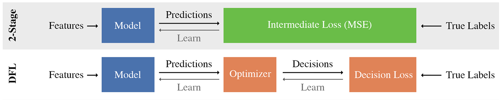
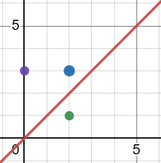
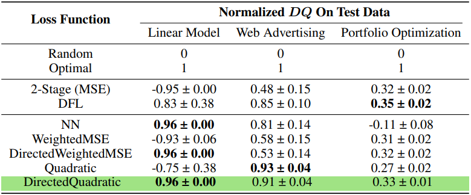

## **0. Preliminary and Motivating Example**

본 논문은 머신 러닝에서 새로운 학습 패러다임인 Decision-Focused Learning(DFL)에 관한 논문으로 기존 학습방법인 Two-stage Learning(or Predict-Focused Learning)과 Decision-Focused Learning간의 비교 설명을 먼저 해드리겠습니다.

### **Two-stage Learning**
일반적으로 어떤 stochastic modeling을 통한 optimization 문제를 풀 때 model의 input $x$와 output $y$ 간의 관계를 정확히 알고 있다면 optimization problem의 정확한 optimal solution을 찾는 것이 가능합니다. 이를 식으로 표현하면 다음과 같이 표현이 가능합니다.

Let $(x\in\mathcal{X},y\in\mathcal{Y})\sim \mathcal{D}$, $z\in\mathcal{Z}$ and expected loss $L_ {\mathcal{D}}(z)=E_ {x,y\sim\mathcal{D}}[f(x,y,z)]$.   
Then $z_ {\mathcal{D}}^{\*}=\text{argmin}_ {z} L_ {\mathcal{D}}(z)$

그러나 실제로는 $\mathcal{D} \text{ or }p(y\vert x;\theta)$를 정확히 알 수 없습니다.

따라서 전통적으로 $p(y\vert x;\theta)$를 예측하는 model $M_ {\theta}$를 주어진 $(x,y)$ 데이터를 이용하여 학습을 하고 이후에 optimal solution인 $a^{\*}(x;\theta)$를 찾아내는 방법을 사용합니다.

이를 Two-stage learning이라고 합니다.

Two-stage learning에서의 주 목적은 주어진 $(x,y)$ 데이터를 가장 잘 설명하는 $p(y\vert x;\theta)$를 찾아내는 것입니다. 따라서 $M_\theta$를 학습할 때 $loss$ $function$으로 $(M_\theta(x)-y)^2$ 같은 함수를 사용하여 학습하게 됩니다.

### **Decision-Focused Learning**

#### **Motivating example (Knapsack problem)**
우리는 주어진 feature들로 두개의 물건중 어느 물건이 더 가치가 높은지를 판단하여 하나의 물건을 고르고자 합니다.

이때 파란색 점이 실제 가치를 나타내는 점이고, 보라색 점과 초록색 점이 우리의 가치판단 모델에서 나온 결과라고 생각해봅시다. Two-stage learning관점에서는 두 점 모두 같은 값의 Loss를 얻게됩니다. 하지만 실제로 우리가 최종적으로 얻게되는 Loss는 보라색점은 0, 초록색 점은 -1이 되게 됩니다. 따라서 우리는 초록색 점으로 예측한 경우 보라색 점으로 예측한 것보다 더 높은 Loss값을 주어야 한다고 생각할 수 있습니다.

즉 $x$와 $y$의 관계를 가장 잘 설명하도록 $p(y\vert x;\theta)$를 추정하여 $a^*(x;\theta)$를 얻는 방법이

우리가 찾고자 하는 optimization solution, 다시 말해 $L_\mathcal{D}(a^*(x;\theta))$를 최소화하는 $a^*(x;\theta)$를 얻는 방법과 동일한 방법인지 의문이 들 수 있습니다.

이러한 방향에서 생겨난 방법이 Decision-Focused Learning(DFL)입니다.

DFL은 Two-stage learning 처럼 주어진 $(x,y)$ 데이터를 가장 잘 설명하는 방향으로 $M_ {\theta}$를 학습하는 것이 아니라 우리가 최종적으로 줄이고자 하는 task loss, $L_ {\mathcal{D}}(a^{\*}(x;\theta))$를 줄이는 방향으로 $M_ {\theta}$를 학습하고자 합니다.

즉 $\frac{\partial L_ {\mathcal{D}}(a^{\*}(x;\theta))}{\partial\theta}$를 계산하여 $\theta$를 $update$ 하는 방법이 DFL 입니다.

## **1. Problem Definition**  

DFL에서 가장 문제가 되는 부분이 $\frac{\partial L_ {\mathcal{D}}(a^{\*}(x;\theta))}{\partial\theta}$를 계산하기 쉽지 않다는 것입니다.

기존에 이 문제를 해결한 방법은 chain rule을 사용하여 $\frac{\partial L}{\partial \theta} = \frac{\partial L}{\partial z^{\*}} \frac{\partial z^{\*}}{\partial \theta}$로 나눈 후,

첫번째 항은 task loss function을 단순히 미분한 값이므로 쉽게 구할 수 있게 되고,

두번째 항인 $\frac{\partial z^{\*}}{\partial \theta}$가 어떤 optimization problem 의 model parameter와 optimization solution의 관계이기때문에 특정한 problem에서 적용되는 condition을 이용하여 계산하였습니다.

그러나 이러한 방법론은 특정한 problem(e.g.,convex problem)에서만 적용이 가능하다는 한계점이 존재합니다.

이에대한 대안으로 Decision loss인 $L_ {\mathcal{D}}(a^{\*}(x;\theta))$를 직접 미분하여 값을 얻어내는 것이 아니라 Decision loss에 근사하고 $\theta$로 미분이 가능한 Surrogate loss를 만들어 학습시킨 후, 학습된 Surrogate loss를 이용하여 predictive model을 학습시키는 방법론이 등장하였습니다.

본 논문에서는 이러한 Surrogate loss의 새로운 form 인 Locally Optimized Decision Losses(LODL)을 소개하고 있습니다. 

## **2. Locally Optimized Decision Losses**  

본 논문에서 소개하는 Locally Optimized Decision Losses(LODL)은 총 3가지의 특징으로 이루어져있습니다.

### 2.1 Local Loss Functions.

Locally Optimized Decision Losses 는 데이터셋의 각각의 $((x,y))$ pair마다 Surrogate loss를 학습시킵니다. 즉 하나의 $(x_ {i}, y_ {i})$ pair 마다 하나의 Surrogat loss function $LODL_ {\phi_ {i}}$ 를 학습시키는 것입니다. 

여기서 중요한 점은 각 Surrogate loss function을 어떤 sample $\hat y$들을 이용하여 학습시킬까 입니다.

이 논문에서는 우리의 predictive model $\mathbf{M}_ {\theta}$가 true label $y$에 충분히 가까이 예측할 수 있다는 가정하에 $\hat y_ {i} \approx y_ {i} \pm \epsilon$를 sampling 하여 $LODL_ {\phi} (\hat y, y)=[LODL_ {\phi_ {1}}(\hat y_ {1}),\ldots,LODL_ {\phi_ {N}}(\hat y_ {N})]$을 학습시킵니다.

### 2.2 Surrogate Loss Functions.

이 논문에서는 Surrogate Loss function의 form을 모두 convex하게 설정하였는데 그 이유는 다음 식에서 유도할 수 있습니다.

---

$LODL_ {\phi_ {i}} (\hat y_ {i}) \approx DL(\hat y_ {i}, y_ {i})-DL(y_ {i}, y_ {i})\Rightarrow DL(\hat y_ {i}, y_ {i}) \approx LODL_ {\phi_ {i}} (\hat y_ {i}) + DL(y_ {i}, y_ {i})$

---

위의 관계에서 $DL(y_ {i}, y_ {i})$가 constant 이므로 $LODL_ {\phi_ {i}}$의 form을 convex parametric form으로 설정하면 minima at $\hat y_ {i} = y_ {i}$인 convex function으로 predictive model을 학습 할 수 있습니다.

이 논문에서 설정한 $LODL$의 Surrogate loss function form 에는 크게 4가지가 있습니다.

1. **WeightedMSE:** $\text{WeightedMSE}(\hat y)=\sum_ {l=1}^{\text{dim}(y)} w_ {l}\cdot (\hat y_ {l}-y_ {l})^2$

이때 학습되어야할 parameter은 $w_ {l}$ 입니다.

2. **Quadratic:** $\text{Quadratic}(\hat y)=(\hat y - y)^T H(\hat y-y)$

이때 학습되어야할 parameter은 low-rank symmetric Positive semidefinite(PSD) matrix 인 $H=L^T L$ 입니다.

3. **DirectedWeightedMSE:**

위의 $\text{WeightedMSE}$ 와 식은 동일하나 $w_ {l}=
    \begin{cases}
      w_ {+}, & \text{if}\ \hat y_ {i}-y_ {i}\geq 0 \\
      w_ {-}, & \text{otherwise}
    \end{cases}$ 으로 
    direction을 추가하였습니다.

4. **DirectedQuadratic:**

위의 $\text{Quadratic}$ 과 식은 동일하나 $L_ {ij}=
    \begin{cases}
      L_ {ij}^{++}, & \text{if}\ \hat y_ {i}-y_ {i}\geq 0 \text{ and}\ \hat y_ {j}-y_ {j}\geq 0 \\
      L_ {ij}^{+-}, & \text{if}\ \hat y_ {i}-y_ {i}\geq 0 \text{ and}\ \hat y_ {j}-y_ {j}< 0 \\
      L_ {ij}^{-+}, & \text{if}\ \hat y_ {i}-y_ {i}< 0 \text{ and}\ \hat y_ {j}-y_ {j}\geq 0 \\
      L_ {ij}^{--}, & \text{otherwise}
    \end{cases}$ 으로
    direction을 추가하였습니다.

### 2.3 Sampling
이 논문에서는 Surrogate Loss function을 학습시키기 위해 다양한 방법으로 $\hat y$를 sampling하였습니다.

즉 $\hat y -y = \epsilon$ 이라고 하였을 때,

- $\epsilon \sim N(0,\sigma^2)$ (Random Normal)
- $\epsilon \sim U(0,\sigma)$ (Random Uniform)
- $\epsilon \sim d *N(0,\sigma^2)$ (Random Normal dropout)
등 다양한 방법으로 sampling strategy를 설정하였습니다.

---

$LODL$과 기존의 Surrogate loss들의 가장 큰 차이점은 locally하게 Surrogate loss를 학습시킨다는 것인데, 이는 기존에 dim($y$)+dim($\hat y$)차원의 Surrogate loss를 학습시켜야 한다는 것에서 벗어나 dim($\hat y$)차원의 Surrogate loss를 학습시키면 된다는 점에서 이점이 있습니다.

또한 각각의 $LODL_ {\phi_ {i}} (\hat y_ {i})$이 parallelizable하게 학습될 수 있으므로 여러개의 core를 사용할수록 cost가 near-linearly 하게 줄어들것입니다. 그리고 학습된 $LODL_ {\phi_ {i}} (\hat y_ {i})$를 재사용할경우 LODL의 training time은 거의 two-stage의 경우만큼 줄어들 것입니다.

## **3. Training method**  

본 논문에서 제시하는 방법론은 총 3가지 단계로 이루어져있습니다.

이해를 돕기 위해 간단한 그림으로 설명드리겠습니다.

### Step 1 : Sampling stage

각 $(x_ {i}, y_ {i})$ pair에 대해서 $\hat y_ {i}$를 sampling하여 dataset에 저장합니다.

### Step 2 : Loss training stage

Sampling된 $\hat y_ {i}$들로 $LODL_ {\phi_ {i}}(\hat y_ {i})\approx DL(\hat y_ {i},y_ {i})$가 되는 $\phi_ {n}$을 학습시킵니다.

### Step 3 : Model training stage

학습된 $LODL_ {\phi}$를 이용하여 predictive model을 학습합니다.

## **4. Experiment**  

본 논문에서 실험에 사용한 문제는 총 세가지 문제입니다.

1. Linear Model
2. Web Advertising
3. Portfolio Optimization

### Linear Model
Predict : feature $x_n\sim U[0,1]$를 이용하여 resource n의 utility $\hat y$를 예측합니다. 이때 true utility function : $y_ {n} = 10 x_ {n}^3 - 6.5 x_ {n}$입니다.

Optimize : $N=50$ resources 중 $B=1$개의 highest utility를 고릅니다.

$z^{\*}(\hat y)=\text{arg topk}(\hat y)$

### Web Advertising
Predict : $M=5$ websites 에서 각 website $m$에 연관된 feature $x_m$을 이용하여 $N=10$명의 users에 대한 click-through rates(CTRs)를 예측합니다. 이때 true CTRs는 Yahoo! Webscope Dataset에서 얻었습니다.

Optimize : 예측된 CTRs를 이용하여 user에게 advertise 할 $B=2$개의 website를 고릅니다.

$z^{\*}(\hat y)=\text{arg max}_ {z}\sum_ {j=0}^N(1-\prod_ {i=0}^M(1-z_ {i}\cdot\hat y_ {ij}))$ where $z_ {i}\in\{0,1\}$

### Portfolio Optimization
Predict : Stock $n$에 대한 feature $x_n$를 이용하여 미래의 stock price $y_ {n}$를 예측합니다. 이때 QuandlWIKI dataset에서 $N=50$개의 stock에 대한 2004 to 2017의 과거 데이터를 이용했습니다.

Optimize : 과거의 correlation matrix $Q$를 이용하여 $z^Ty - \lambda\cdot\hat y^TQ\hat y$를 maximize하는 distribution $z$를 고릅니다. 이때 risk aversion constant인 $\lambda$는 0.1로 설정합니다.

### Experiment setting

- 각 $y_ {i}$마다 $\hat y_{i}$를 50000개씩 sampling 하였습니다.
- LODL의 NN은 4-layer fully-connected Neural Network with 100 hidden units로 설정하였습니다.
- LODL의 DFL은 cvxpylayer을 이용한 Decision-focused learning 방식입니다.
- 2-stage방식은 standard MSE loss를 사용하여 학습하였습니다.

## **5. Result**

### Evaluation Metric  

본 논문에서 사용한 Evaluation Metric은 $\text{decision quality } DQ$로 higher is better 입니다.
$DQ$는 Random으로 y를 설정한 경우 얻은 objective를 0, Optimal하게 y를 설정한 경우 objective를 1로 설정하여 scaling합니다.

본 논문에서 제시한 Locally optimized decision loss로 학습 한 경우 Decision quality가 좋게 나오는 것을 볼 수 있습니다. 특히 Directed Quadratic의 경우 2-stage보다 세 문제 모두 결과값이 더 좋게 나오고, 일반적인 DFL방식보다 대부분 결과값이 더 좋게 나오는 것을 확인할 수 있습니다.
  
위의 결과를 토대로 우리는 세가지 결론을 얻어낼 수 있습니다.

1. $LODL$의 DirectedQuadratic function이 consistent 하게 잘 perform합니다, 특히 항상 2-stage보다 좋은 결과를 볼 수 있습니다.
2. Convexity를 가지지 않는 fucntion form이면 결과가 inconsistent 할 수 있습니다. 이는 $NN$ 의 성능이 Portfolio Optimizatin 문제에서 급격히 감소함을 토대로 해석할 수 있습니다.
3. DFL 은 performance 측면에서 매우 큰 variance를 가집니다. 이는 여러 problem에서 DFL의 variance가 highest quality를 보이는 LODL보다 더 큰 variance를 보임을 통해 해석할 수 있습니다.

## **6. Conclusion**  

본 논문은 기존의 surrogate loss들의 한계점인 optimization problem의 형태의 제약, 혹은 차원의 문제를 해결하는 새로운 surrogate loss 모델로 Locally optimized decision loss 방법론을 제시하였습니다. 2-stage 방법론보다 모든 문제에서 더 좋은 결과를 얻었으며, DFL방식보다 대부분의 문제에서 더 좋은 결과를 얻었다는 것을 확인할 수 있었습니다.

본 논문에서 제시한 LODL방법론의 한계점은 복잡한 optimization problem 문제의 경우 본 논문에서처럼 각 데이터마다 50000번의 문제를 풀기에 cost가 매우 크다는 것입니다. 또한 surrogate loss를 하나의 form으로 특정한 것이 아니라 4가지의 loss form을 제시하였는데, 실제 문제에서는 어떠한 loss form을 이용해야하는지 판단하는데 어려움이 생길것이므로 이를 해결하는 방향의 연구가 더 필요할 것으로 예상됩니다.

---  
## **Author Information**  

* 박민수 (Minsu Park) 
    * Contact: mspark0425@kaist.ac.kr
    * KAIST GSDS Financial Engineering Lab

## **6. Reference & Additional materials**  

[1] Shah, S.; Wang, K.; Wilder, B.; Perrault, A.; and Tambe, M. 2022. Decision-Focused Learning without Differentiable Optimization: Learning Locally Optimized Decision Losses. Preprint at https://arxiv.org/abs/2203.16067.