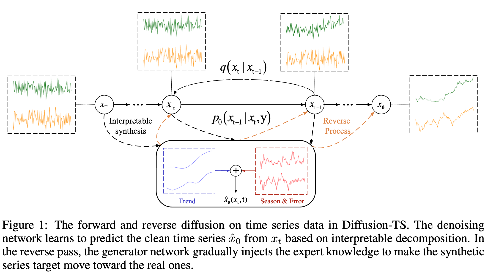
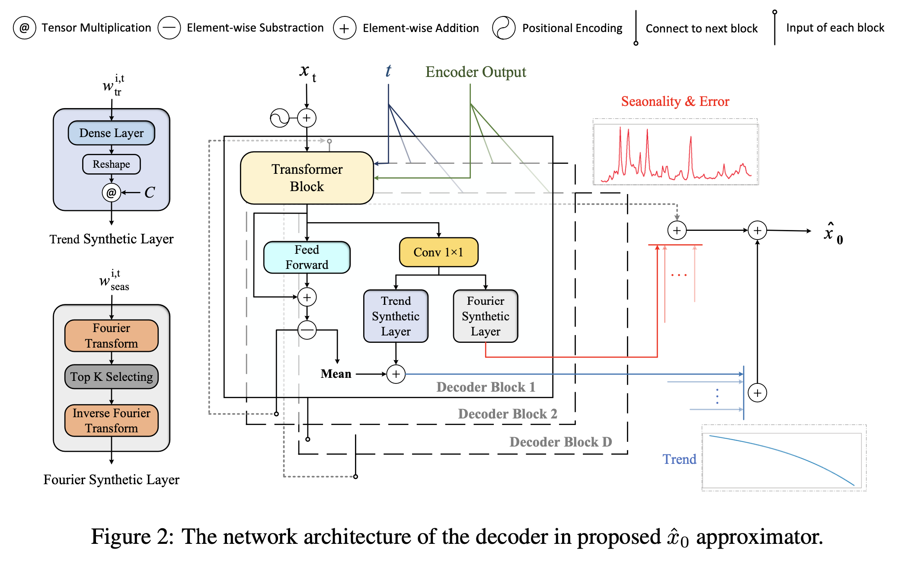
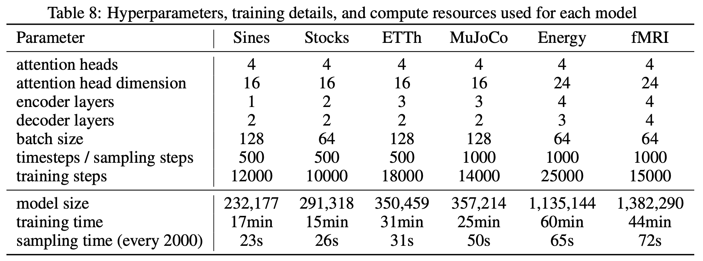
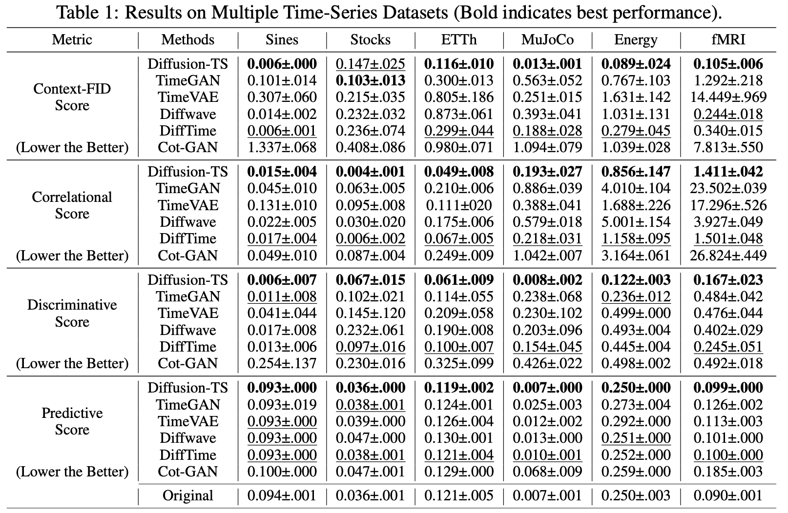
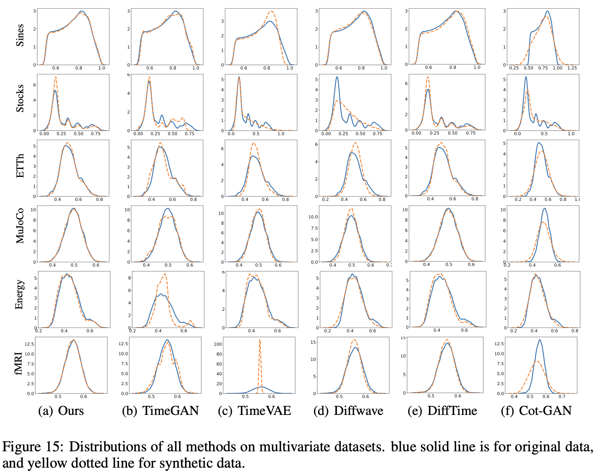
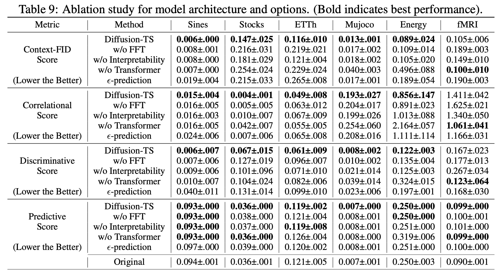

#  Diffusion-TS: Interpretable Diffusion for General Time Series Generation

## 1. Motivation
생성형 모델(Generative model)에 대한 연구가 활발히 진행됨에 따라 이를 시계열 데이터에 적용하기 위한 목적으로 다양한 시도가 이루어져 왔다. 과거에는 GAN(Generative Adversarial Networks)과 VAE(Variational Autoencoders)기반 모델을 통해 시계열 데이터를 생성하는데 중점을 두었는데, GAN 기반 모델은 학습 및 최적화 과정에서의 불안정성으로 인해 mode collapse 현상이 발생하기 쉬웠으며, VAE 기반 모델은 저품질(blurry sample)의 데이터를 생성하는 경향이 있었다. 게다가 이러한 모델들은 모두 기존의 이미지, 언어 데이터와는 다른 시계열 데이터가 가진 시간적 특성과 다변량 변수 간의 복잡한 상호 작용을 충분히 학습하는데 어려움이 있었다.

이와 같은 문제를 해결하기 위해 현재 가장 주목 받고 있는 Denoising Diffusion Probabilistic Models(DDPMs)을 기반으로 시계열 데이터의 특성을 반영할 수 있는 새로운 모델 Diffusion-TS를 제안하였다. **이 모델은 시계열 데이터의 복잡한 시간적 특성(Temporal dynamic)을 더 정확히 학습할 수 있도록 설계되었으며 생성된 데이터는 원본과 매우 유사하면서도 해석 가능한(Interpretable)결과를 제공한다.** 이로써 기존의 GAN, VAE 모델이 가진 한계를 극복하고 고품질의 다변랸 시계열 데이터 생성을 가능하게 하였다.

본 논문에서 제안한 모델이 기존의 시계열 데이터 생성모델과 대비되는 차별점은 다음과 같다.
1. **Encoder-Decoder Transformer architecture**  
기존의 모델들은 RNN기반으로 시계열 데이터를 처리한 반면, Diffusion-TS모델은 Encoder-Decoder Transformer구조를 사용해서 다변량 시계열 데이터에 대해 복잡한 시간적 의존관계와 변수들 사이의 관계 정보를 효과적으로 처리하였다.

2. **Decomposition Techniques**  
본 모델에서 구현되어 있는 Decoder블럭에는 최종적으로 시계열 데이터를 생성하기 전에 Interpretable layer을 통과한다. 여기서 입력된 시계열 데이터를 추세(Trend)부분, 주기적으로 반복되는 계절성(Seasonality)부분, 비주기적으로 발생하는 에러(Error)부분으로 분해(decomposition)하는 과정을 거쳐서 모델의 설명력을 강화하고 생성된 시계열 데이터가 원본 시계열 데이터의 시계열적 특성을 더 정확히 반영하게 하였다.

3. **Fourier-Based Loss**  
일반적인 Diffusion 기반 모델과 달리 손실 함수에 Fourier 기반 손실 항을 추가하였다. 이는 Decoding 과정에서 시계열 데이터를 재생성할 때, 원본 시계열 데이터의 주기적 패턴을 강조하여 학습하도록 함으로써 주기적 특성을 반영한 합성 시계열 데이터를 생성할 수 있도록 유도한다. 이를 통해 더욱 정확하고 향상된 품질의 시계열 데이터를 생성하는데 기여한다.

4. **State-of-the-Art Performance**  
양적(quantitative), 질적(qualitative) 측면에서 다양한 지표를 가지고 여러 비교군 모델과 실험을 진행하였고 실험결과 다른 시계열 데이터 생성 모델에 비해 가장 우수한 성능을 나타냈다.

## 2. Method
### 2.1 Diffusion Framework

<!--  -->

Figure 1은 Diffusion-TS모델에서 사용되는 diffusion 기반 학습과정을 간략히 보여주고 있다. 노이즈가 추가된 데이터 $x_t$로부터 원본 시계열 데이터인 $x_0$ 를 생성할 수 있도록 하는 분포 $p_ \theta (x_{t-1} \vert x_ t,y)$ 를 학습하려는 목적은 일반적인 diffusion 기반 모델의 학습 방식과 동일하다. **하지만 $x_t$ 를 추세(Trend)요소와 주기적으로 반복되는 계절성(Season), 비주기적으로 발생하는 에러(Error)항으로 분해한 뒤 이들을 합하여 $ \hat x_ {0} (x_t,t)$ 을 추정하고 원본 시계열 데이터 $x_0$ 와의 차이를 이 논문에서 새롭게 제안하는 손실함수를 통해 학습하는 과정은 기존의 방식과 차별화 된다.** 이처럼 시계열 데이터 $x_t$에 대해 구체적으로 분해(decomposition)하는 과정은 아래의 Encoder-Decoder Transforemr Architecture에서 구현된다.

### 2.2 Encoder-Decoder Transformer Architecture

**기존의 시계열 데이터를 다루는 모델들에서 RNN구조(LSTM, GRU 등)를 사용한 것과 달리 Diffusion-TS모델은 Transformer를 사용하여 시계열 데이터를 다루고 있다.** Transformer내의 attention을 통해 기존 모델보다 더 긴 길이의 시계열 데이터에 대해 시간적 특성(Temporal dynamic)과 다변량 변수 간의 복잡한 상호 작용을 효과적으로 반영할 수 있도록 하였다. 구체적으로 Diffusion-TS모델에서 사용된 Transformer 내부에 정의된 Encoder와 Decoder는 아래와 같다.

<!--  -->

위의 그림은 Diffusion-TS모델에서 사용된 Encoder부분을 도식화하여 보여주고 있다. Encoder는 M개의 Encoder block으로 구성되어 있고 Encoder block에는 순서대로 Embedding, Multihead-Attention, Feedforward 네트워크가 구현되어 있다. 먼저 노이즈가 첨가된 $x_t$에 시계열 데이터의 시간적 순서 정보를 유지하기 위해 positional-encoding을 추가하고 Embedding을 통해 고차원의 임베딩 벡터로 변환한다. 이후 multihead-Attention과 Feedforward 네트워크를 통해 다변량 시계열 데이터의 다른 시점간의 시간적 의존성(temporal dependencies)과 다른 Feature 사이의 상호 의존성 정보를 저장할 수 있도록 하는 인코딩된 벡터를 생성하여 Decoder에 입력값으로 사용한다.

<!--  -->

Figure 2는 Decoder의 내부 구조를 나타내고 있다. Decoder는 D개의 Decoder block으로 구성되어 있으며 각 Decoder block은 크게 Transformer block과 Interpretable block(Trend Layer, Fourier Layer)으로 구성되어 있다. 먼저 Transformer block에는 노이즈가 추가된 $x_t$에 시간적 순서 정보를 추가한 positional-encoding된 벡터뿐만 아니라 Encoder에서 생성한 벡터를 추가적으로 입력값으로 사용한다. Encoder에서와 달리 self-attention과 cross-attention을 모두 사용하여 인코딩된 벡터가 가지고 있는 시간적 의존성과 Feature간 의존성 정보를 모두 활용한다. **이후 시계열을 재생성하기 전에 Interpretable block을 통해 시계열 데이터를 추세(Trend)부분과 계절성(Seasonality)부분으로 분해한다. 이 논문의 제목과 같이 해석가능한(Interpretable) Diffusion은 바로 이 부분에서 비롯되었으며 Diffusion-TS 모델이 기존의 다른 시계열 데이터 생성 모델과 구별되는 부분이다.** 최종적으로 추세 요소와 주요 계절성 요소로 분해된 값을 결합하여 $\hat x_0$을 산출하고 원본 데이터와 차이를 loss로 설정하여 원본 데이터의 분포를 학습한다.

#### 2.2.1 Trend Synthesis
추세 요소는 시계열 데이터의 점진적이고 완만한 추세적 변화를 모델링하고 있으며 이는 polynomial regression 방식을 적용하여 아래의 식에 따라 계산한다. 직전의 transformer 블럭을 통과하여 나온 output ($w_ {\text{tr}}^{i,t}$) 과 $i$ 번째 decoder block의 결과에 평균을 취한 값 ($\chi^{i,t}_ {tr}$) 을 더한 뒤 polynomial 변환 ($C \cdot \text{Linear}()$) 한다. 여기서 $C$ 는 polynomial space를 나타내는 행렬로 $[1,c,c^2,...,c^p]$ 를 의미하고 $t$ 는 t번째 diffusion time step을 의미한다. 최종적으로 추세요소($V^{t}_ {tr}$) 는 아래의 식으로 구할 수 있다.

$V^{t}_ {tr} = {\sum}_ {i=1}^{D} (C \cdot \text{Linear} (w^{i,t}_ {tr} + \chi^{i,t}_ {tr})), \quad C = [1, c, \ldots, c^{p}]$  

#### 2.2.2 Seasonality & Error Synthesis
Decoder 블럭의 Fourier synthetic layer를 통해 시계열 데이터를 주기적으로 반복되는 계절성 요소와 주기적으로 반복되지 않는 에러 요소로 분해한다. 논문에서는 Fourier series에 기반한 시계열 요소의 trigonometric representation을 사용한다. 직전의 transformer 블럭을 통과하여 나온 output ($w^{i,t}_ {seas}$) 에 대해 주파수(frequency) $k$에 대한 이산 Fourier 변환 ($F (w^{i,t}_ {seas})_ k$) 을 적용한 값에 대해 진폭(amplitude, ${A}^{(k)}_ {i,t}$) 와 위상(phase, ${\Phi}^{(k)}_ {i,t}$) 을 각각 계산한다.  

$A^{(k)}_ {i,t} = \vert F(w^{i,t}_ {seas})_ k \vert$

$\Phi^{(k)}_ {i,t} = \phi (F(w^{i,t}_ {seas})_ k)$

이후, 진폭이 큰 순서대로 상위 K개의 주파수를 나타내는 인덱스($\kappa_ {i,t}^{(K)}$) 를 구한다.

$\kappa_ {i,t}^{(1)}, \ldots, \kappa_ {i,t}^{(K)} = \text{arg TopK} \{A^{(k)}_{i,t}\}, \quad k \in \{1, \ldots, \lfloor \tau/2 \rfloor +1\}$

앞서 구한 주파수의 인덱스에 해당하는 실제 Fourier 주파수 ($f_ {\kappa_ {i,t}^{(k)}}$) 와 진폭 ($A^{(k)}_ {i,t}$), 위상 ($\Phi^{(k)}_ {i,t}$) 을 통해 주기적으로 반복되는 계절성 요소($S_ {i,t}$) 를 아래와 같은 식으로 계산한다.

$S_ {i,t} = {\sum}_ {k=1}^{K} A^{(k)}_ {i,t} [ \cos(2\pi f_ {\kappa_ {i,t}^{(k)}}t + \Phi^{(k)}_ {i,t}) + \cos(2\pi f_ {\kappa_{i,t}^{(k)}}tC + \bar{\Phi}^{(k)}_ {i,t}) ]$

최종적으로 Decoder를 통해 생성한 시계열 데이터는 추세 + 계절성 + 에러 요소의 합으로 아래와 같이 계산되어 나온다.

$\hat {x}_ 0 (x_t, \theta) = V^{t}_ {tr} + \sum_ {i=1}^{D} S_ {i,t} + R$

### 2.3 Fourier-based Training Objective
Diffusion-TS는 기존의 다른 Diffusion기반 모델과 달리 Fourier기반의 손실항을 추가하여 학습에 사용하고 있다. **Fourier기반의 손실항은 원본 시계열 데이터가 가지고 있는 주기적 특성에 대해 생성된 시계열 데이터에서도 이러한 계절적 특성을 유지한 상태로 학습할 수 있도록 하기 위한 목적으로 추가된 손실항이다. 이를 통해 생성된 시계열 데이터가 원본 시계열 데이터의 분포를 더 유사하게 생성해낼 수 있도록 한다.**

먼저 $\hat {x}_ 0 (x_ t, \theta)$ 을 생성하는 모델을 학습하기 위해 일반적인 Diffusion 모델에서 사용되는 손실항 ($L_ {simple}$) 은 아래와 같이 정의할 수 있다. (단,기존 Diffusion model에서 사용하는 손실항은 $\epsilon$ 에 대해 정의하지만 이 논문에서는 시계열 데이터 $x$ 에 대해 바로 적용한다는 차이가 있다.) 

$L_ {simple} = \mathbb{E}_ {t,x_ 0} [ w_t \|x_0 - \hat{x}_0(x_t, \theta)\|^2 ]$ 

$w_t = \frac{\lambda \alpha_t (1 - \hat{\alpha}_t)}{\beta_t^2}$

$\alpha_t = 1 - \beta_t$ and $\hat {\alpha}_ t = \prod_ {s=1}^{t} {\alpha}_ s$

$\lambda$ = 상수 (i.e. 0.01)

여기에 최종적으로 실제 시계열 데이터의 Fourier변환을 한 값($F\mathcal{T}(x_0)$)과 생성한 시계열 데이터의 Fourier변환을 적용한 값($F\mathcal{T}(\hat{x}_0(x_t, \theta))$)의 차를 아래와 같이 손실항에 추가하여 생성된 시계열 데이터가 원본 시계열 데이터의 주기적 특성을 더 유사하게 학습할 수 있도록 한다.

$L_{\theta} = \mathbb{E}_{t,x_0} \left[ w_t \left\| x_0 - \hat{x}_0(x_t, \theta) \right\|^2 + \lambda_2 \|F\mathcal{T}(x_0) - F\mathcal{T}(\hat{x}_0(x_t, \theta))\|^2 \right]$

## 3. Experiment

### 3.1. Experiment setup
생성된 시계열 데이터가 얼마나 원본 시계열과 유사한지를 평가하기 위해 기존의 시계열 데이터 생성모델인 TimeVAE, TimeGAN, CotGAN, Diffwave, DiffTime과 비교한다.
	
#### 3.1.1. Model size

<!--  -->

일반적으로 모델의 성능은 모델의 복잡성에 비례한다. 하지만 아무리 높은 성능을 보이는 모델이라도 높은 모델의 복잡성으로 인해 학습에 오랜 시간이 
걸리는 경우 활용 가능성과 유용성이 떨어진다. 이러한 점을 고려하기 위해 Table 8은 비교에 사용된 모델들의 크기와 학습시간을 제공한다. 

#### 3.1.2. Dataset

<!--  -->

연구에서 사용된 데이터셋은 위의 Table 11과 같이 총 6개의 데이터셋을 사용한다.   

- Sines  
5개의 features을 가지는 sine data로 simulation을 위해 생성된 데이터셋이다.

- MuJoCo  
14개의 features을 가지는 다변량 물리 시뮬레이션용 시계열 데이터셋으로 생성된 데이터셋이다.

- Stocks  
2004년부터 2019년까지의 Google 주식의 일별 데이터로 6개의 features (시가, 고가, 저가, 종가, 수정종가, 거래량)을 가지는 데이터셋이다.

- ETTh(1)  
전기변압기 온도와 관련하여 2016년 7월부터 2018년 7월까지 2년동안 측정한 15분단위의 데이터셋으로 1개의 유압온도와 6개의 전력부하 features로 구성되어있다.

- Energy  
UCI에서 제공하는 응용 에너지 예측 연구용 데이터셋으로 28개의 features를 가지는 10분 단위의 4.5개월 동안 수집한 시계열 데이터 셋이다. 

- fMRI  
혈중 산소농도와 관련된 시계열 데이터로 이 연구에서는 원본데이터셋에서 50개의 features만 선별하여 사용한다.

### 3.2. Result
생성된 시계열 데이터에 대해 양적(Quantitative), 질적(Qualitative) 분석을 모두 제시한다. 양적평가를 위해서는 다음의 3가지 평가 기준을 설정하고 해당 기준을 계량적으로 측정할 수 있는 평가지표를 선정하였다.
1. 생성된 시계열 데이터가 원본 시계열 데이터와 분포적으로 유사한지
2. 시간적 의존성과 Feature의 의존성을 잘 반영하고 있는지
3. 시계열 예측에 있어서 생성된 시계열 데이터가 학습데이터로서 유용한지

질적 평가는 t-SNE와 데이터 분포를 통해 저차원으로 사영하여 생성된 시계열과 원본 시계열의 분포가 얼마나 유사한지 각각 시각화하여 제시한다.

#### 3.2.1. Quantitative result

<!--  -->

Table 1은 Context-FID score, Correlational score, Discriminative score, Predictive score을 통해 앞서 제시한 3가지 평가기준에 해당하는 생성된 시계열의 분포적 유사성, 시간적 의존성, 학습데이터로서의 유용성을 계량적으로 나타낸다. 표에서 볼 수 있듯이 대부분의 데이터셋과 평가지표에서 Best Performance를 보여주고 있으며 각각 평가지표에 대한 설명은 아래와 같다.

- Context-Fréchet Inception Distance (Context-FID) score  
단기간의 시계열 데이터의 국소적 특성(local context)에 해당하는 패턴, 추세 등을 고려하여 실제 시계열 데이터와 생성된 시계열 데이터간의 분포 차이를 계산한다. 이는 생성된 시계열 데이터가 얼마나 원본 시계열과 유사한지 측정하는데 사용되는 지표로 점수가 낮을수록 원본 데이터와 유사함을 나타낸다.

- Correlational score  
원본데이터와 생성된 데이터의 시간적 의존성(temporal dependency)를 측정하기 위한 지표로 원본 시계열 데이터와 생성된 시계열 데이터의 cross correlation matrices의 차이를 절대값으로 나타낸 지표이다. 점수가 낮을 수록 원본 시계열과 생성된 시계열이 유사한 시간적 의존성을 가지고 있음을 나타낸다.

- Discriminative score  
원본 시계열 데이터와 생성된 시계열 데이터를 Discriminator를 통과시켜서 구분하도록 하였을때, 이를 구분하지 못하는 정도를 나타내는 점수로 원본 데이터와 생성된 데이터의 유사성을 측정하기 위한 지표이다. 점수가 낮을 수록 Discriminator가 원본과 생성된 데이터를 잘 구분하지 못한다는 의미이기 때문에 생성된 시계열의 퀄리티가 높음을 의미한다.

- Predictive score  
Diffusion-TS모델을 사용하여 생성한 시계열 데이터를 훈련용 데이터로 활용하여 간단한 시계열 데이터 예측 모델을 학습시키고 실제 시계열 데이터에 적용하여 예측한 결과와 실제 값의 차이를 나타내는 점수로 점수가 낮을수록 생성한 시계열 데이터가 유용함을 나타낸다.

#### 3.2.2. Qualitative result

<!--  -->

Figure 14는 모든 데이터셋에 대해 t-SNE를 통해 2차원으로 사영하여 시각화한 모습을 보여준다. 붉은 점은 원본 시계열 데이터의 분포적 특성을 나타내고 파란 점은 생성된 시계열 데이터의 분포적 특성을 나타낸다. 붉은 점이 찍혀있는 모습과 파란 점이 찍혀있는 모습이 유사해 보일수록 생성된 시계열 데이터가 원본 시계열 데이터의 분포와 유사함을 확인할 수 있다. 현재 이 논문에서 제시한 모델이 비교대상이 되는 다른 모델에 비해 대부분의 데이터셋에 대해 분포를 가장 잘 모방하고 있음을 알 수 있다.

<!--  -->

Figure 15 역시 Figure 14와 같이 원본 시계열 데이터와 생성된 시계열 데이터의 분포를 비교하기 위한 목적으로 활용된다. 파란 선은 원본 시계열 데이터의 분포를 나타내고 노란 점선은 생성된 데이터의 분포를 나타내고 있다. Stocks 데이터셋을 제외하고는 원본 시계열 데이터에 대해 가장 근접한 분포를 보여주고 있음을 확인할 수 있다.

#### 3.2.3. Ablation study result

<!--  -->

다른 시계열 데이터 생성 모델과 달리 Diffusion-TS 모델에서 구현한 3가지 부분(Fast Fourier Transformation(FFT), Interpretability, Transformer)을 각각 제거하고 동일한 실험에 대한 양적 평가 지표를 비교하였다. 대부분의 경우에서 해당 부분들을 제거하였을 때 모델의 성능이 낮아지는 것을 보아 논문에서 제시한 방법들이 모두 모델의 성능을 높이는데 유의미한 영향을 주고 있음을 확인할 수 있다.

## 4. Conclusion
### 4.1 Summarize
Diffusion-TS모델은 원본 시계열과 매우 유사한 시계열 데이터를 생성하기 위한 과정으로 Diffusion 기반 학습을 사용한다. 다만 일반적인 Diffusion 모델에서 사용하는 손실항과 달리  $x_0$과 $\hat{x}_0(x_t, \theta)$의 차를 직접 계산하고 Fourier 기반 손실항을 추가하여 학습에 활용한다. 또한 기존의 모델들이 시계열 데이터를 처리하기 위해 RNN기반으로 구성되었던것과 달리 Encoder-Decoder transformer구조를 사용하고 있으며 이로 인해 상대적으로 더 긴 길이의 시계열데이터에 대해 시간적 의존성, 데이터 간의 의존성에 대한 정보를 효과적으로 처리하였다. Decoder 블럭에서는 시계열 데이터를 추세, 계절성, 에러 항으로 분해하여 사용함으로써 원본 시계열 데이터가 가지고 있는 시계열적 특성을 명시적으로 고려하여 학습하였고 생성된 시계열에 대해 모델의 설명력을 더하였다. 마지막으로 양적, 질적 평가를 위한 실험을 진행하였고 비교군에 해당하는 모든 모델에 비해 향상된 성능을 보였고 이는 즉, 본 논문에서 제안한 모델이 원본 시계열 데이터와 차이가 거의 없는 고품질의 시계열 데이터를 생성할 수 있음을 의미한다.

### 4.2 My opinion
저자가 원본 시계열 데이터와 매우 유사한 시계열 데이터를 생성하기 위해 시계열 분해와 Fourier 손실 항을 모델에 추가하여 원본 시계열 데이터의 시계열적 특성을 더 정확히 반영할 수 있도록 제안한 부분이 논리적이고 합당한 접근법이라고 생각했다. 이에 대해 추가적으로 들었던 생각은 다음과 같다.  
1. 모델에서 input 데이터로 사용하는 시계열 데이터는 부분적으로 잘라진 시계열 데이터를 사용하고 있다.(i.e. 전체 시계열의 길이가 100이고 부분 시계열 길이가 24라고 할 때, 인풋 데이터로 사용되는 시계열은 {0:23, 1:24, 2:25, ... , 87:100}와 같다). **일반적으로 시계열 분해 방식은 전체 시계열에 대해 추세, 계절성 등을 분해하는데 반해 현재 모델은 부분적인 시계열에 대해 시계열 분해를 진행하여 활용하고 있다.** 이에 대해 원본 시계열 데이터의 시계열적 특성을 더 정확히 반영하기 위해 전체 시계열에 대한 분해 정보를 활용해보는 접근법도 좋지 않을까 생각해보았다.
2. **질적 연구 결과를 보면 대부분의 시계열 데이터셋에 대해서는 원본 데이터와 매우 유사한 분포를 학습해내고 있음을 확인할 수 있지만 유달리 주식 데이터셋에 대해서는 성능이 떨어진다.** 이와 같은 현상은 비교군에 해당하는 다른 모든 모델들에서도 동일하게 발생하고 있다. 이에 대해 왜 주식 데이터셋에 대해서만 원본 데이터에 대한 분포학습이 정확하지 못하는지에 대해 추가적인 연구와 설명이 필요해 보인다.
3. **이 연구를 missing value를 포함하고 있는 데이터셋에 대해서는 적용하기 어려울 것으로 보인다. 모델에서 사용하고 있는 시계열 분해는 완전한 데이터셋이 아니면 부정확한 추세, 계절성 정보를 추출할 수 있기 때문이다.** 따라서 missing value를 포함하고 있는 데이터셋에 대해서 어떻게 적용할 수 있을지에 대한 연구가 필요해 보인다.

## Author info
-   정하림
    -   KIRC(Knowledge Innovation Research Center)
    -   Time Series Generation

## Reference
-   Github Implementation  
https://github.com/Y-debug-sys/Diffusion-TS
-   Reference  
https://arxiv.org/pdf/2403.01742.pdf
