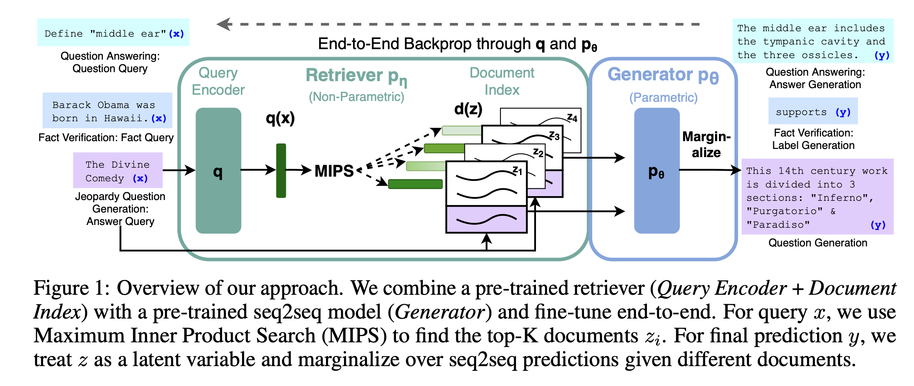
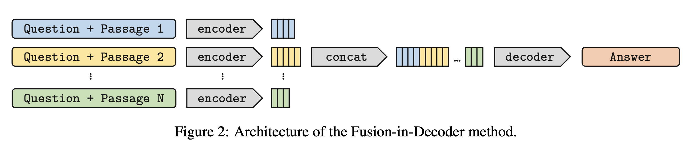
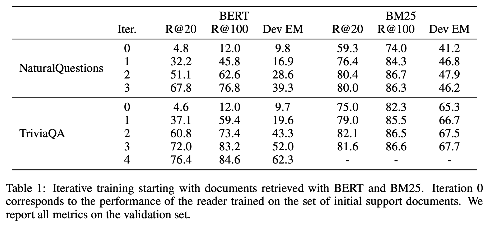
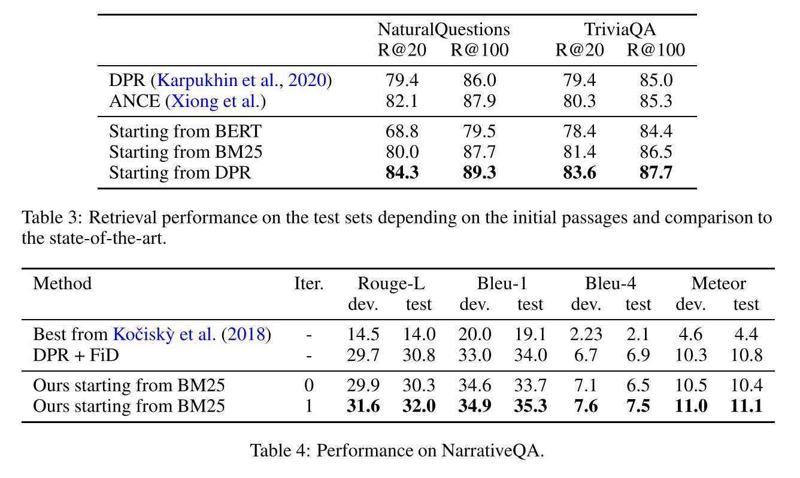
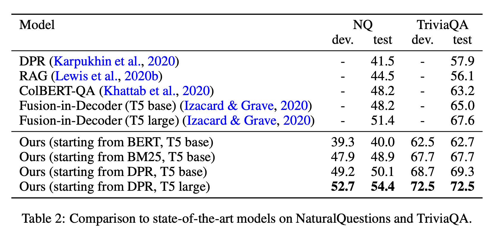
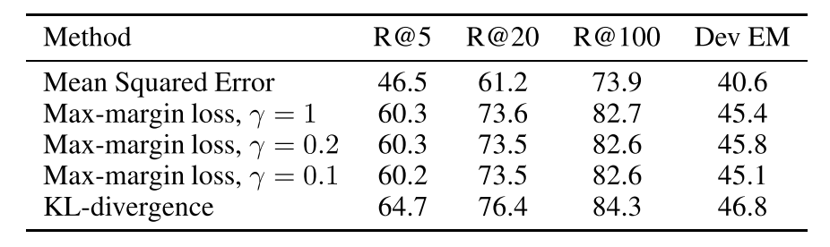

Conference: ICLR (International Conference on Learning Representations), 2021

[논문 Link](https://arxiv.org/abs/2012.04584)

---

## **1. Contributions**

RAG System(Retrieval-Augmented Generation)은 external data base에서 retriever라는 모듈을 통해 문서 검색을 하여 얻은 정보를 기반으로 answer generation을 할 수 있게 해주는 system입니다. RAG System의 retriever부분을 학습시키기 위해서는 query와 document가 쌍을 이룬 dataset이 필요합니다. 그러나 Data를 얻는 것은 어려움이 존재하는 부분입니다. 또한, 어떤 방법론에서는 정답을 포함한 document는 positive하도록 분류하여 학습하는 방식을 택합니다. 이러한 방식은 “Where was Ada Lovelace born?”이라는 질문의 정답이 “London”일 때, “Ada Lovelace died in 1852 in Londen”을 포함하는 document도 "London"이 있다는 이유로 positive로 분류될 수 있다는 문제점이 있습니다. 이 외에도 supervised learning은 여러 한계들이 있습니다.

 

본 논문에서는 unsupervised learning을 통해서 query, document pair가 없이도 RAG System을 학습할 수 있는 방법론을 제안했습니다. 본 논문의 핵심 기여는 다음과 같습니다.

 

1-1. Knowledge distillation에서 영감을 받아 reader(teacher model)와 retriever(student model)을 통해 unsupervised learning을 했습니다.

 

1-2. Reader model(Seq2Seq model)이 retriever를 지도하는 데에 있어서, 적절한 document를 찾아내게 하기 위해서 attention score를 활용했습니다.

 

1-3. 본 논문에서의 방법론을 통해서 SOTA를 달성했습니다.

 

본 논문이 Attention Score를 어떻게 활용했는지, Knowledge distillation에서의 방법론을 어떻게 활용했는지 그리고 이러한 방법론이 왜 중요한지에 대해서 다뤄보도록 하겠습니다.

 

---

## **2. Backgrounds**

## **2-1. RAG(Retrieval-Augmented Generation) System**

[Referenced Paper : "Retrieval-Augmented Generation for Knowledge-Intensive NLP Tasks", Piktus et al., Apr 2021](https://arxiv.org/pdf/2005.11401.pdf)

 

RAG는 LLM이 Text Generation을 하기 전에 신뢰할 수 있는 외부 데이터를 참고할 수 있도록 하는 프로세스입니다. 이는 LLM의 생성 능력을 활용하는 동시에 IR 메커니즘을 통해 얻은 외부 데이터를 결합하여, LLM이 더 다양하고 정확한 정보에 기반한 답변을 생성할 수 있는 구조입니다. 즉 IR메커니즘과 LLM의 융합으로 Pre-trained parametric memory와 non-parametric memory를 모두 활용한 것이 RAG System이라고 볼 수 있습니다.

- **2-1-1. RAG System의 작동 원리**
    1. 사용자로부터 질문이나 입력을 받습니다.

     

    2. 입력에 기반하여 관련된 외부 데이터 소스에서 정보를 검색합니다. 이 때, 검색 알고리즘이나 모델을 사용하여 입력과 관련성이 높은 문서나 데이터를 찾아냅니다.

     

    3. 검색된 정보를 언어 모델의 입력과 통합하여, 모델이 더 많은 데이터를 받을 수 있도록 해줍니다.

     

    4. 통합된 입력을 바탕으로 언어 모델이 최종적인 답변을 생성합니다. 결과적으로 모델은 사전 학습된 지식과 새롭게 검색된 정보를 모두 활용하게 됩니다.

 

- **2-1-2. RAG System의 도전 과제**
    - 검색된 정보의 정확성과 질문과의 관련성을 높이는 것이 중요한 과제라고 생각됩니다.

     

    - 효율적인 정보 검색을 위해서 검색 알고리즘이나 모델을 최적화하는 것도 중요한 과제라고 생각됩니다.
    
 

구체적인 Architecture는 다음과 같습니다.

 

<!-- 

  

 -->

### **2-2. FiD(Fusion-in-Decoder model)**

[Reference : “Leveraging Passage Retrieval with Generative Models for Open Domain Question Answering”, Gautier Izacard et al., 2020](https://arxiv.org/abs/2007.01282)

FiD 모델은 Transformer의 attention mechanism을 decoder에서 활용하여, 여러 document로부터 정보를 통합하고 처리합니다. 이 과정에서 주요한 두 가지 attention 작업이 수행됩니다.

 

**2-2-1. Cross-attention**

FiD의 decoder는 검색된 여러 document의 정보를 종합하기 위해 cross-attention 메커니즘을 사용합니다. 여기서 각 document는 Value와 Key로 변환되며, 질문은 Query로 변환됩니다. decoder는 질문 query와 각 document key 사이의 관계를 분석하여 문서의 value에 가중치를 부여합니다. 이를 통해 model은 질문에 **가장 관련성이 높은 정보를 식별**하고, 이 정보를 기반으로 답변을 생성합니다.

 

**2-2-2. Self-attention** 

Decoder 내부에서도 self-attention mechanism이 작동하여, 생성된 답변의 각 단어(또는 token) 사이의 관계를 modeling합니다. 이 과정은 문맥적으로 **일관되고 자연스러운 답변**을 생성하는 데 기여합니다.

<!-- 

  

 -->

위의 attention mechanism을 활용하면서, 기존의 encoder를 통과한 document를 decoder에 하나씩 개별적으로 넣어주는 방식을 하나의 sequence로 concat하는 방식으로 바꾸었습니다. Concat을 하면서 document들 끼리는 분류해주기 위해서 ‘question:’, ‘title:’, ‘context:’와 같은 special tokens를 concatenated sequence에 넣어주었습니다. 이러한 방식으로 FiD model은 당시에 SOTA를 달성한 model이라고 합니다.

 

### **2-3. KL(Kullback-Leibler) Divergence**

KL Divergence는 $P(x)$와 $Q(x)$분포가 있을 때, 두 분포가 얼마나 차이가 나는지를 측정해주는 지표라고 생각할 수 있습니다. $P(x)$와 $Q(x)$가 discrete probability distribution이라고 가정할 때, 수식은 다음과 같습니다.

 

$
D_ {\text{KL}}(P\vert \vert Q) = \sum_ {x \in X} P(x) \log(\frac{P(x)}{Q(x)})
$

 

수식을 볼 때, $P(x) \approx Q(x)$일 때, $\frac{P(x)}{Q(x)} \approx 1$이 되어, $ D_ {\text{KL}}(P \vert \vert Q) \approx 0 $이 되는 것을 알 수 있습니다. 이는 두 distribution이 유사할 때, $D_ {\text{KL}}(P \vert \vert Q)$이 작다는 것을 의미합니다.

 

KL Divergence는 entropy와 cross entropy의 차이로도 표현할 수 있습니다.

 

$
\sum_ {x \in X} P(x) \log P(x) - \sum_ {x \in X} P(x) \log Q(x) = H(P) - H(P,Q)
$

 

또한, ELBO(Evidence Lower BOund)를 계산할 때에도 쓰이기도 하고 Loss function에 포함시켜주면 두 분포를 유사하게끔 학습시킬 수 있는 만큼, KL Divergence는 Machine Learning에서 중요하다고 볼 수 있습니다.

 

 

### **2-4. BLEU(Bilingual Evaluation Understudy) Score**

일반적으로 번역에 있어서 PPL보다는 BLEU Score가 더욱 신뢰성이 있는 지표로 평가됩니다. BLEU는 0과 1 사이의 값이 나오게 되는데 그 값이 클수록 좋은 성능을 가진다고 평가합니다. 수식을 통해서 Score에 어떤 의미들이 담겨있는지 살펴보겠습니다. 

$
\text{BLEU} = \text{BP} \cdot \prod_ {n=1}^{N} P_{ n}^{w_ {n}}
$

- $p_n$ : n-gram precision
- $w_{n}$ : weights
- $\text{BP}$ : Brevity penalty - 출력이 짧을 때에 Penalty를 부과해줍니다.
- $N$ : Default가 4로 설정됩니다.

  - ### **2-4-1. n-gram precision**

먼저, n-gram precision에 대해서 살펴보겠습니다. n-gram precision은 연속한 n개 단어가 정답 문장에 존재하는지 여부로 계산합니다. 

**Target : 나는 Seq2Seq 논문을 리뷰하면서 Seq2Seq 모델의 성능을 평가하는 지표를 소개한다.**

**Prediction : 나는 Seq2Seq 논문을 읽고, Seq2Seq 논문을 리뷰하고 Seq2Seq 모델의 성능 지표를 소개한다.** 

위의 예시로 3-gram precision까지 측정해보겠습니다. n-gram Precision을 측정할 때 유의할 점은, 위의 예시에서 Prediction에는 ‘Seq2Seq’가 3개이지만, Target에는 2개가 있습니다. 이런 경우에 n-gram precision의 분자에 ‘Seq2Seq’에 대해서는 2개만 반영됩니다. 

1-gram의 경우 분모에 총 12개의 1-gram이 있다는 것이 들어가고, 분자에는 ‘나는’ 1개, ‘Seq2Seq’ 2개, ‘논문을’ 1개, ‘모델의’ 1개, ‘지표를’ 1개, ‘소개한다’ 1개로 분자에 7이 들어갑니다.

1-gram의 경우 분모에 총 11개의 2-gram이 있다는 것이 들어가고, 분자에는 ‘나는 Seq2Seq’ 1개, ‘Seq2Seq 논문을’ 1개, ‘Seq2Seq 모델의’ 1개, ‘지표를 소개한다’ 1개로 분자에 4가 들어갑니다.

이제 감이 오셨으리라 생각합니다.  $N=3$으로 가정하고 $\prod_{n=1}^N P_{n}^{w_n}$을 구해보겠습니다. 

- 1-gram precision :  $\frac{\text{Target과 Prediction에 동시에 있는 1-gram 개수}}{\text{Prediction에서 1-gram 개수}} = \frac{7}{12}$

- 2-gram precision :  $\frac{\text{Target과 Prediction에 동시에 있는 2-gram 개수}}{\text{Prediction에서 2-gram 개수}} = \frac{4}{11}$

- 3-gram precision :  $\frac{\text{Target과 Prediction에 동시에 있는 3-gram 개수}}{\text{Prediction에서 3-gram 개수}} = \frac{1}{10}$

$
\prod_ {n=1}^{N} P_ {n}^{w_ {n}} = (\frac{7}{330})^{\frac{1}{3}} = 0.2768
$

위에서 처럼 n-gram을 쓰는 이유는 1-gram만 쓴다면 ‘나는 읽고 논문을 Seq2Seq’와 같이 순서만 바뀐 것에 대해서도 좋은 평가를 하게 되기 때문에, 순서를 고려해주기 위함이라고 볼 수 있습니다.

  - ### **2-4-2. BP(Brevity Penalty)**

**Target : 나는 Seq2Seq 논문을 리뷰하면서 Seq2Seq 모델의 성능을 평가하는 지표를 소개한다.**

**Prediction : 나는 Seq2Seq 논문을 소개한다.**

위의 예시와 같이 번역을 하게 된다면, 중요한 정보가 많이 생략되어 번역을 잘 했다고 평가하기 어렵게 됩니다. 그럼에도 n-gram precision이 높은 값을 가질 수 있게 되어서, 이러한 부분에 대해 Penalty를 가해줍니다. 수식은 다음과 같습니다. 

$
\text{BP} = \begin{cases}
1&\text{if  
}   c\geq r \\
e^{(1-r/c)} & \text{if  }   c<r
\end{cases}
$

- ${r}$ : Reference(정답) 문장 길이
- ${c}$ : Candidate(예측) 문장 길이

최종적으로 BLEU Score는 위에서 구한 값에 100을 곱해준 형태로 위의 예시에서는 27.68이($\text{BP} = 1$) 나오게 됩니다.

### **2-5. ROUGE Score**

 

ROUGE (Recall-Oriented Understudy for Gisting Evaluation) score는 자동 요약이나 기계 번역의 품질을 평가하는 데 사용되는 지표입니다. 이 방법은 Generated summary이나 번역문을 사람이 작성한 Reference summary나 번역문과 비교하여, 얼마나 유사한지를 측정합니다. ROUGE 점수는 여러 가지 버전(ROUGE-N, ROUGE-L, ROUGE-W, ROUGE-S, ROUGE-SU, ROUGE-N-precision, ROUGE-N-f1)으로 제공되며, 각각 다른 측정 방식을 사용합니다. 여기서는 ROUGE-N과 ROUGE-L에 대해서만 살펴보겠습니다. 

 

- **2-5-1. ROUGE-N**

ROUGE-N은  Generated summary와 Reference summary간의 N-gram 오버랩을 측정합니다. 여기서 N은 연속적인 단어의 수를 의미합니다. ROUGE-N의 계산은 다음과 같이 이루어집니다.

$
\text{ROUGE-N} = \frac{\sum_ {S \in \{\text{Reference summaries}\}} \sum_ {\text{gram}_ {n} \in S} \text{Count}_ {\text{match}}(\text{gram}_ {n})}{\sum_ {S \in \{\text{Reference summaries}\}} \sum_ {\text{gram}_ {n} \in S} \text{Count}(\text{gram}_ {n})}
$

여기서 $\text{Count}_ {\text{match}}(\text{gram}_ {n})$은 Generated summary에서 Reference summary과 일치하는 N-gram의 수를 나타내고, $\text{Count}(\text{gram}_ {n})$은 Reference summary 내의 N-gram의 총 수를 나타냅니다. 이 공식은 주로 재현율(recall)에 초점을 맞추고 있지만, 정밀도(precision)와 F1 점수를 계산하는 데에도 사용될 수 있습니다.

 

- **2-5-2. ROUGE-L**

ROUGE-L은 Generated summary와 Reference summary간의 가장 긴 공통 부분 수열(Longest Common Subsequence, LCS)을 기반으로 평가합니다. LCS는 단어의 순서를 유지하면서 두 요약 간에 공통적으로 나타나는 최장의 단어 수열을 찾는 것입니다. ROUGE-L의 계산은 다음과 같습니다.

$
\text{ROUGE-L} = \frac{\text{LCS}(S, \text{Generated Summary})}{\vert S \vert}
$

여기서 $\text{LCS}(S, \text{Generated Summary})$는 Reference summary $S$와 Generated summary 간의 LCS 길이를 나타내며, $\|S\|$는 Reference summary의 길이입니다. ROUGE-L 점수는 Generated summary가 Reference summary의 중요한 내용을 얼마나 잘 포함하고 있는지, 그리고 단어의 순서가 얼마나 잘 유지되고 있는지를 종합적으로 반영합니다.

---

## **3. Methodology**

본 논문에서 소개한 전반적인 방법론은 attention score가 usefulness of passage의 좋은 척도라고 가정하며, 다음 두 개의 module을 활용하는 것입니다. 

 

- Reader(teacher model) - 앞서 소개한 FiD model을 활용하여 Attention score를 계산하고, 이를 토대로 Retriever(student model)을 학습합니다.

 

- Retriever(student model) - Reader로부터 제공된 attention score를 따라할 수 있도록 학습하면서, attention score를 토대 가장 연관성이 높은 passage를 선별하는 것을 목표로 합니다.

 

두 module이 구체적으로 어떻게 작동하는지 살펴보겠습니다. 

### **3-1. Cross-Attention Mechanism**

먼저, FiD에서는 BART(Bi-directional and Auto-Regressive Transformers)와 같은 encoder와 decoder가 있는 sequence-to-sequence model을 기반으로 합니다. 여기서 Decoder부분에 약간의 fusion을 가해주어 encoder로부터 받은 정보뿐만 아니라, 이전 decoder에서의 출력들도 정보로 활용하게 됩니다. 이러한 방식은 NLP(Natural Language Processing)분야에서 다양한 task들의 성능을 개선했습니다. 먼저, FiD의 핵심 중 하나인 cross attention mechanism을 살펴보겠습니다. Cross attention에서 encoder는 $n_{p}$개의 text input $(s_ {k})_ {1\leq{k} \leq{n_ {p}}}$를 독립적으로 처리합니다. 예를 들어, Wikipedia와 같은 ODQA(Open Domain Question-Answering) task에서 query $q$ 와 support passage를 결합한 $s_ {k}$가 question:, title:, context: 와 같은 special token으로 표현됩니다. support passage $s_k$는 query $q$ 앞에 더해져 encoder에 input으로 들어가는 것입니다. encoder의 output은 input text의 semantic한 정보와 구문과 관련된 정보가 담긴 vector로 나오며, vector들을 모두 concatenate하여 $X$라는 matrix로 표현됩니다. $X$의 차원은 $\sum_ {k}{l_ {k}}$ x $d$가 됩니다. 

$l_ {k}$ : length of the k-th segment

$d$ : dimension of the embeddings

  

이제 이 $X$가 cross attention module에서 어떻게 쓰이는지에 대해서 수식으로 살펴보겠습니다. 

 

먼저 $X$에 query, key, value에 해당하는 weight matrix가 각각 곱해집니다. 이 가중치 weight matrix는 나중에 model을 통해서 학습하는 대상이 됩니다. 

$
Q = W_ {Q} H ,\quad K = W_ {KX}, \quad V = W_ {V} X
$

$H \in R^d$ denotes the output from the previous self-attention.

$Q$ : Query, $K$ : Key, $V$ : Value

$W_ {Q}, W_ {K}, W_ {V}$ are the weight matrices of queries, keys, and values, respectively.

 

위의 수식을 통해서 알 수 있는 부분은 $Q, K, V$를 먼저 선형 변환 해준 다음에 아래의 수식으로 similarity를 계산해준다는 것입니다. 특히 $Q$와 $K$의 similarity를 계산하게 될텐데, $Q$에 있는 $H$는 이전 시점의 self-attention layer output이고, $X$는 input text가 encoder를 통과한 후 concatenate이 된 거라는 점에 유의하면, self-attention layer로부터 나온 context vector와 $X$에 들어있는 support passage들 사이의 similarity를 동시다발적으로 고려해준다는 것을 알 수 있습니다. 

$
\alpha_ {i,j} = Q_ {i}^TK_ {j}, \quad \tilde{\alpha}_ {i,j} = \frac{\exp(\alpha_ {i,j})}{\sum_m \exp(\alpha_ {i,m})}
$

 

마지막으로 Value에 앞서 구한 weight들로 가중합을 해준 다음에 다시 한 번 선형변환을 거치게 됩니다.

$
O_ {i} = W_ {O} \sum_ {j} \tilde{\alpha}_ {i,j}V_ {i,j}
$

위와 같이 선형변환을 해주는 이유는 같은 공간에 mapping을 해줌으로 차원을 맞출 수 있게 되며, learnable parameter를 제공해주는 등의 이유가 있습니다. 

 

본 논문에서는 위에서 구한 attention score가 query와 support passage 사이의 관련성을 고려해주는 좋은 척도라고 주장합니다. 이 이유는, attention score를 참고했을 때, 더 많은 attention을 받은 passage가 RAG System을 통해서 답변을 생성할 때, 유용하게 쓰인 passage라고 생각하기 때문입니다. 

 

Reader module이 input query $q$와 support passages set인 $D_ {q} = (p_ {k})_ {1\leq{k}\leq{n}}$을 통해 attention score가 반영된 relevance score $G_ {q, p_ {k}}$를 계산하여 Retriever module을 훈련하는 데에 쓴다고 합니다.

여담으로 논문에서 DPR(Dense Passage Retriever)를 통해서 top 100 document를 검색하여 정답 생성에 사용했을 때 48.2 EM(Exact Matching)으로 성능을 보였다고 합니다. 여기서 DPR로 추출한 100개 중에 다시 top 10 document만 사용했을 때에는 42.9의 EM이었고 DPR로 추출한 100개의 passage에서 attention score에 기반하여 다시 top10을 추출했을 때는, 46.8 EM으로 DPR만 사용했을 때에 비해서 성능에 개선이 있었다고 합니다. 

 

### **3-2. Dense Bi-Encoder for Passage Retriever**

본 논문에서는 Cross-attention score를 통해서 문서를 ranking하고자 합니다. 그러나, 모든 document와 query를 동시에 처리하는 것은 비효율적이라는 문제가 있습니다. 논문에서는 이러한 문제를 해결하기 위해서, d차원 vector로 embedding하는 함수 $E$를 retriever와 함께 사용했습니다. $E$는 BERT를 사용했으며, DPR(Dense Passage Retrieval)과는 달리 Query인 $q$와 passage인 $p$에 대해서 같은 $E$를 적용하여, $E(q)$와 $E(p)$를 얻을 수 있게 됩니다. 결과적으로 다음과 같이 similarity를 계산할 수 있게 됩니다. 

$
  S_ {\theta}(q,p) = E(q)^{T} E(p) / \sqrt{d}
$

### **3-3 Distilling the Cross-Attention Score to a Bi-Encoder**

이제 어떠한 방식으로 retriever model과 reader model을 학습했는지 그리고 Loss에 따라서 어떤 차이들이 있는지 보겠습니다. 

- Option 1 (Empirical result에서 확인해보면 가장 잘 작동한 Loss function입니다)
    
    첫 번째로 논문에서는 normalized output인 $S_ {\theta}(q,p)$와 normalized attention score인 $G_ {q,p}$의 KL-divergence를 최소화하는 것을 제안했습니다. 
    

    $
    L_ {\text{KL}}(\theta, Q) = \sum_ {q \in Q,\text{ } p \in D_ {q}} \tilde{G}_ {q,p} (\log{\tilde{G}}_ {q,p} - \log \tilde{S}_{\theta}(q,p)) 
    $

    $
    where, \quad \tilde{G}_ {q,p} = \frac{\exp(G_ {q,p})}{\sum_ {p^{'} \in D_ {q}}\exp(G_ {q, p^{'}})}, \quad \tilde{S}_ {\theta}(q,p) = \frac{\exp(S_ {\theta}(q,p))}{\sum_{p^{'} \in D_ {q}}\exp(S_ {\theta}(q, p^{'}))}
    $

- Option 2
    
    Option 2에서는 MSE를 최소화하는 Loss를 적용했습니다.

    $
    L_ {\text{MSE}}(\theta, Q) = \sum_ {q \in Q, \text{ } p \in D_ {q}} (S_ {\theta}(q,p) - G_ {q,p})^{2}
    $

- Option 3
    
    Option 3에서는 max-margin loss를 이용해 model이 순위를 잘못 예측했을 때, penalty를 주는 방식을 적용했습니다.
    
    $
    L_ {\text{ranking}}(\theta, Q) =\sum_ {q \in Q, \text{ } p_ {q}, p_ {2} \in D_ {q}} \max(0, \gamma - \text{sign}(G_ {q,p_ {1}} - G_ {q,p_ {2}})(S_ {\theta}(q,p_ {1}) - S_ {\theta}(q,p_ {2})))
    $
    
    위의 수식을 직관적으로 접근해보자면, $p_ {1}$이 $p_ {2}$보다 클 때 ( $i.e. \quad G_ {q,p_ {1}}>G_ {q,p2}$ ),  $\max(0, \gamma - (S_ {\theta}(q,p_ {1}) - S_ {\theta}(q,p_ {2})))$ 가 되어, $S_ {\theta}(q,p_ {1}) - S_ {\theta}(q,p_ {2})$이 적어도 $\gamma$보다 크게 만들어줍니다.
    
    $
    \text{consider} \quad \max(S_ {\theta}(q,p_ {1}) - S_ {\theta}(q,p_ {2}), \gamma)
    $
    
    즉, 두 score 사이에 margin을 주는 방식으로 score가 충분히 벌어지도록 하여 순위 예측을 용이하게 해준다고 볼 수 있습니다.  
    

위의 방법론들을 통해 teacher model과 student model을 반복적으로 학습했습니다. Iterative learning에서 특히 중요한 점은 current retriever가 negative sampling도 한다는 것입니다.[Reference : “Relevance-guided Supervision for OpenQA with ColBERT”, Omar Khattab et al., 2021](https://arxiv.org/abs/2007.00814) 
negative sample을 next step에서 retriever를 학습하는 데에 쓰는 discriminative training을 함으로써 model의 능력을 높이고자 했습니다. 순서는 다음과 같습니다. 

**Iterative Training**

1. reader $R$을 각각의 질문에 대한 support document의 집합인 $D_{q}^0$를 활용하여 학습시켜줍니다.

2. 통합된 Attention socres $ (G_ {q,p})_ {q \in Q, \text{ } p \in D_ {q}^{0}}$ 를 reader $R$을 통해 계산해줍니다.

3. retriever $E$ 를 $ (G_ {q,p})_ {q \in Q, \text{ } p \in D_ {q}^{0}}$ 를 활용하여 학습시켜줍니다.

4. 새롭게 학습된 retriever $E$를 활용하여 top passages를 검색해옵니다.

위의 과정을 반복해주는 방식으로 model을 학습했습니다. 

---

## **4.Empirical Results**

논문에서 제시한 방법론을 통해서 SOTA를 달성했다고 합니다. Table들을 통해서 확인해보겠습니다. 

<!-- 

  

 -->

먼저, 위의 table을 통해서 BERT보다 BM25가 retrieving task에서 성능이 더 좋다는 것을 확인할 수 있습니다. 이는 BERT를 활용하여 semantic관점에서 similarity를 고려하기 보다는, BM25를 활용하여 TF-IDF관점에서 similarity를 고려하는 것이 passage를 검색해오는 것에 더 좋은 성능은 보인다는 것을 의미합니다. 

<!-- 

  

 -->

또한, 논문에서 주장한 대로 성능이 잘 나온 것을 확인할 수 있습니다. 특히 제가 위 테이블에서 눈이 가는 부분은 더 많은 document를 top-k로 선정했을 때, 성능이 높아진다는 점입니다(R@k means extracting top-k documents). ROUGE나 BLEU score도 잘 나온 것을 확인할 수 있습니다. 

<!-- 

  

 -->

여기에서 확인할 수 있듯이, passage retrieving에는 DPR을 활용하고 answer generation에 T5 large model을 쓰는 것이 가장 성능이 좋았다는 것을 알 수 있습니다. 결과적으로, BERT보다 BM25가 성능이 좋았고, BM25보다 DPR이 성능이 더 좋다는 것을 알 수 있습니다. 

앞서서 제시한 Loss function들 중에서 무엇이 가장 잘 작동했는지는 아래 table에 있습니다.

MSE는 성능이 안 좋았고, Max-margin loss에 있어서는 $\gamma$값이 유의미한 차이를 주지 못했다는 점, 그리고 KL-divergence가 가장 성능이 좋았다는 점을 확인할 수 있습니다. 또한 R@k에서 k가 높을 수록 성능이 더 높아지는 부분도 눈에 들어옵니다. k가 높을 수록 computation cost가 높아지는 문제가 있긴 하겠지만, 성능이 좋아진다는 점은 기억해 두고 싶은 부분입니다.

---

이상으로 논문리뷰를 마치겠습니다.  

감사합니다.

## **5. Conclusion**

이 논문은 비지도 학습을 통한 RAG 시스템의 새로운 학습 방법을 제안하였습니다. 지식 증류와 어텐션 점수의 활용을 통해, query-document pair 없이도 높은 성능을 발휘할 수 있음을 실험적으로 증명하였습니다. 이러한 접근 방식은 데이터가 부족한 상황에서도 효율적으로 적용될 수 있으며, 향후 다양한 NLP 과제에 적용될 가능성이 큽니다.

## **6. References**

- Izacard, Gautier, et al. "Distilling Knowledge From Reader To Retriever For Question Answering." ICLR 2021.
- Piktus, Aleksandra, et al. "Retrieval-Augmented Generation for Knowledge-Intensive NLP Tasks." NeurlPS 2020.
