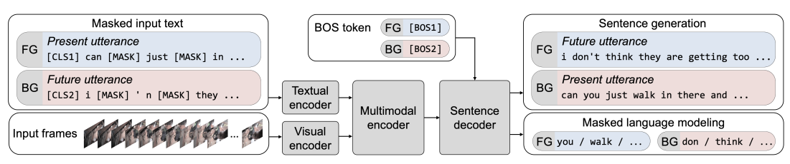
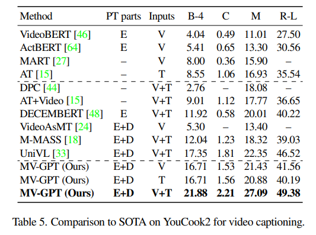
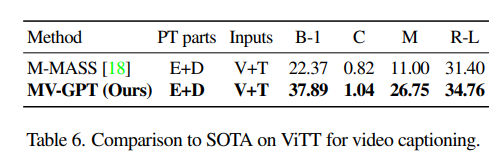
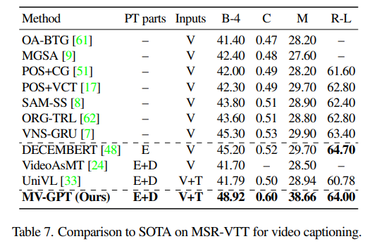
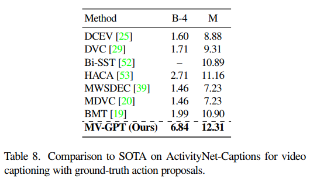
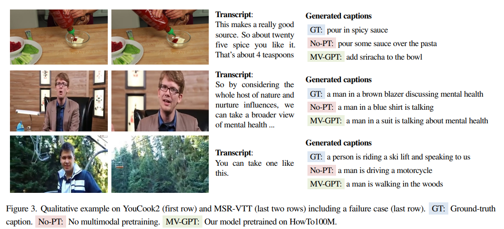

---
title: "[CVPR 2022] End-to-end Generative Pretraining for Multimodal Video Captioning"
permalink: End-to-end_Generative_Pretraining_for_Multimodal_Video_Captioning.html
tags: [reviews]
use_math: true
usemathjax: true
---

# End-to-end Generative Pretraining for Multimodal Video Captioning

## 1. Problem Definition
The paper tackles the challenge of multimodal video captioning, learning from unlabelled videos and aiming to generate accurate and coherent captions for videos. 

## 2. Motivation
The task of multimodal video captioning is an emerging benchmark of progress in AI fields. A successful model must not only understand multimodal streams of input video but also generate coherent descriptions of the content. However, there are two major limitations or challenges in this area. First, recent video and language pretraining frameworks lack the ability to generate sentences due to often lacking decoder. Secondly, the datasets often lack annotated captions in unlabelled videos. 
To tackle the first obstacle, the authors propose integrating a decoder into the framework, enabling models to generate previously unseen sentences. Moreover, departing from prior approaches that solely pretrain the encoder, they advocate for joint end-to-end training of the entire encoder-decoder model. They also want to overcome the limitation of lacking annotated videos by introducing a novel pretraining objective that requires no annotated captions and instead uses utterances sampled at various times within the same video. Finally, apart from two mentioned challenges, they want to make the encoder trainable from raw pixels and words directly, in contrast with existing methods that rely on pre-extracted visual features limiting transfer to new domains.

## 3. Method
The proposed framework is called Multimodal Video Generative Pretraining (MV-GPT) as illustrated in the figure below.

<!--  -->

Recall that the objective is to pretrain a model that can effectively encode multimodal videos (visual frames and transcribed speech) as well as decode natural language sentences. 

### Pretraining Objectives and Losses
The framework leverages unlabelled instructional video data containing video frames and associated utterances. Since unlabelled videos lack captioning targets, the model is trained to generate a future utterance (as a caption target) in the video based on the current video context and utterances (forward generation). To enable the generation of text aligned with the current video context, they add an extra backward generation loss. This involves the model generating the current utterance based on the current video frames and a future utterance (backward generation). With this bidirectional approach, the generated sentences are encouraged to be temporally aligned with the visual inputs. 
Note that the employed loss functions are minimizing the negative log-likelihood of the true future and present utterances.  

### Model
The model entirely uses transformer blocks and is trained directly from pixels and word tokens. At the beginning, there are two specific encoders: one for text using BERT-base architecture, and another for visuals using ViViT architecture. Then, they are fused using a co-attentional transformer by the multimodal encoder, where each layer is a stack of transformer blocks particular for each textual and visual stream. Lastly, the output is generated autoregressively conditioned on multimodal video features using a GPT-2 decoder with masked language modeling and special tokens, BOS and EOS. 
The model is pretrained end-to-end using Adam optimizer with the batch size of 2048.

## 4. Experiment
### Experiment Setup
* The authors utilize HowTo100M as the pretraining dataset and then evaluate on these four downstream captioning benchmarks through finetuning: YouCook2, Video Timeline Tags (ViTT), MSR-VTT, and ActivityNet-Captions
* The results are reported using the following metrics: BLEU-4 (B-4), CIDEr (C ), METEOR (M), and ROUGE-L (R-L). For ViTT, BLEU-1 (B-1) is measured instead of BLEU-4.
### Result
The comparisons of the proposed MV-GPT to existing methods on all four datasets are shown below. It can be seen that the MV-GPT outperforms all prior works with a margin in all datasets and all metrics.

<!--  -->

<!--  -->

<!--  -->

<!--  -->

Besides, the authors also show results on non-generative video understanding tasks (including VideoQA, video retrieval and action classification) to emphasize the capability other than just being a generative model.

By the end, they illustrate qualitative examples on YouCook2 (first row) and MSR-VTT (last two rows) as follows.

<!--  -->

## 5. Conclusion
The authors introduce a new framework for multimodal video captioning called MV-GPT, where both the encoder for multimodal inputs and the decoder for generating captions are trained together using a bidirectional generative objective. This involves sampling utterances from unlabeled videos at various time points instead of caption target. The model undergoes end-to-end training during both pretraining and finetuning stages. It achieves top performance on various video captioning benchmarks and other tasks such as video understanding.
In my opinion, this seems like a cutting-edge framework that will allow us to have an automated video captioning system (still being challenging nowadays) for any platforms in the near future. 

### Author Information
* Author name: Paul Hongsuck Seo
	* Affiliation: Korea University
	* Research Topic: Multimodal Interactive Intelligence, Vision, Speech and Language Understanding
* Author name: Arsha Nagrani
	* Affiliation: Google Inc.
	* Research Topic: Machine learning, Computer Vision, Speech Technology, Deep Learning
* Author name: Anurag Arnab
	* Affiliation: University of Oxford
	* Research Topic: Computer Vision, Machine Learning, Deep Learning
* Author name: Cordelia Schmid
	* Affiliation: Institut national de recherche en informatique et en automatique
	* Research Topic: Computer vision, Object Recognition, Video Recognition, Learning

## 6. Reference & Additional Materials
* [[CVPR 2022] End-to-end Generative Pretraining for Multimodal Video Captioning](https://arxiv.org/abs/2201.08264)
