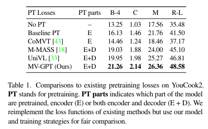
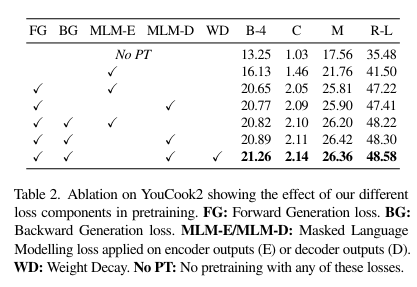
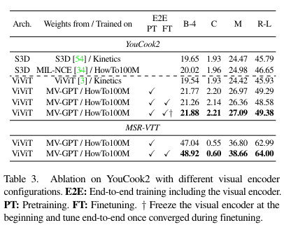
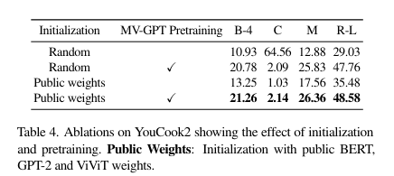
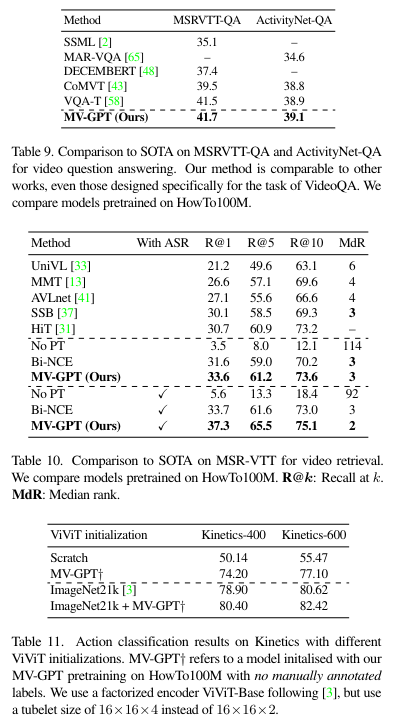

---
title: "[CVPR 2022] End-to-end Generative Pretraining for Multimodal Video Captioning"
permalink: End-to-end_Generative_Pretraining_for_Multimodal_Video_Captioning.html
tags: [reviews]
use_math: true
usemathjax: true
---

## 1. Problem Definition
The paper tackles the challenge of multimodal video captioning, learning from unlabelled videos and aiming to generate accurate and coherent captions for videos. 

## 2. Motivation
-   **Emerging Benchmark in AI:**
    
    -   Multimodal video captioning is an emerging benchmark of progress in AI fields.
-   **Requirements for Success:**
    
    -   A successful model must:
        -   Understand multimodal streams of input video.
        -   Generate coherent descriptions of the content.
-   **Major Limitations/Challenges:**
    
    1.  **Lack of Decoders:**
        -   Recent video and language pretraining frameworks often lack the ability to generate sentences due to the absence of decoders.
    2.  **Annotated Captions:**
        -   Datasets often lack annotated captions in unlabelled videos.
-   **Proposed Solutions:**
    
    -   **Integrating Decoders:**
        -   Propose integrating a decoder into the framework to enable models to generate previously unseen sentences.
    -   **Joint End-to-End Training:**
        -   Advocate for joint end-to-end training of the entire encoder-decoder model, unlike prior approaches that only pretrain the encoder.
    -   **Novel Pretraining Objective:**
        -   Introduce a pretraining objective that requires no annotated captions, instead using utterances sampled at various times within the same video.
-   **Additional Improvement:**
    
    -   **Trainable Encoder from Raw Inputs:**
        -   Make the encoder trainable from raw pixels and words directly, contrasting with existing methods that rely on pre-extracted visual features, which limits transfer to new domains.

## 3. Method
The proposed framework is called Multimodal Video Generative Pretraining (MV-GPT) as illustrated in the figure below.

<!--  -->

Recall that the objective is to pretrain a model that can effectively encode multimodal videos (visual frames and transcribed speech) as well as decode natural language sentences. 

### Pretraining Objectives and Losses
-   **Framework Overview:**    
    -   Leverages unlabelled instructional video data containing video frames and associated utterances.

-   **Training Challenges:**    
    -   Unlabelled videos lack captioning targets.

-   **Training Approach:**    
    -   **Forward Generation:**
        -   Train the model to generate a future utterance (caption target) based on the current video context and utterances.
    -   **Backward Generation:**
        -   Add an extra backward generation loss, where the model generates the current utterance based on the current video frames and a future utterance.
	-   **Bidirectional Approach:**
	    -   Encourages generated sentences to be temporally aligned with visual inputs.
	-   **Loss Functions:**    
	    -   Minimize the negative log-likelihood of the true future and present utterances.

### Model
-   **Model Architecture:**
    -   **Transformers:**
        -   Uses transformer blocks throughout the model.
        -   Trained directly from pixels and word tokens.

-   **Encoders:**
    -   **Text Encoder:**
        -   Uses BERT-base architecture.
    -   **Visual Encoder:**
        -   Uses ViViT architecture.

-   **Multimodal Fusion:**
    -   **Co-Attentional Transformer:**
        -   Fuses text and visual streams using a co-attentional transformer.
        -   Each layer is a stack of transformer blocks specific to each stream (textual and visual).

-   **Output Generation:**    
    -   **GPT-2 Decoder:**
        -   Generates output autoregressively.
        -   Conditions on multimodal video features.
        -   Uses masked language modeling and special tokens (BOS and EOS).

-   **Pretraining Details:**
    -   **Optimizer:**
        -   Pretrained end-to-end using the Adam optimizer.
    -   **Batch Size:**
        -   Uses a batch size of 2048.

## 4. Experiment
### Experiment Setup
* The authors utilize HowTo100M as the pretraining dataset and then evaluate on these four downstream captioning benchmarks through finetuning: YouCook2, Video Timeline Tags (ViTT), MSR-VTT, and ActivityNet-Captions
* The results are reported using the following metrics: BLEU-4 (B-4), CIDEr (C ), METEOR (M), and ROUGE-L (R-L). For ViTT, BLEU-1 (B-1) is measured instead of BLEU-4.
### Result
The comparisons of the proposed MV-GPT to existing methods on all four datasets are shown in the original paper. For simplicity, only the performance comparison on one dataset is displayed here while the rest can be found in the appendix section. It can be seen that the MV-GPT outperforms all prior works with a margin in all datasets and all metrics.

<!--  -->

Next, the author examines the influence of several critical design choices in MV-GPT, focusing on the backbone and objective functions. This includes analyzing pretrained losses, the effects of each loss term, the impact of random weight initialization, and the benefits of end-to-end training. The tables below illustrate the contributions and superiority of the proposed methods.

<!--  -->
* Pretraining only the encoder provides small improvements compared to training from scratch for all tested losses.
* Pretraining both the encoder and decoder together significantly boosts performance.
* MV-GPT outperforms other joint pretraining techniques.

<!--  -->

* The forward generation (FG) loss offers strong supervision.
* Using the masked language modeling loss on decoder outputs (MLM-D) instead of encoder outputs (MLM-E) slightly improves performance due to better input contextualization.
* Adding the backward generation (BG) loss further boosts all metrics.
* Using weight decay (WD) provides extra gains.

<!--  -->

* Training a visual encoder with HowTo100M shows significant gains for both architectures due to the similarity with the YouCook2 dataset. 
* However, ViViT sees larger improvements because its encoder is optimized for generative losses and can be jointly trained with other components due to its lower complexity.
* These results highlight the benefits of end-to-end pretraining.
* Examining the effects of end-to-end training for finetuning, for YouCook2, naive end-to-end finetuning from the start slightly degrades performance (row 4 to 5).
* This is overcome by initially freezing the visual encoder and starting end-to-end training after convergence, resulting in a minor gain (row 6).
* This suggests our pretrained visual encoder already captures strong representations for similar domains, making end-to-end finetuning less critical.
* However, for MSR-VTT, end-to-end finetuning is crucial due to the larger domain gap, leading to significant gains (row 7 to 8).

<!--  -->
* Testing the model's ability to learn from scratch involved initializing it randomly or with pretrained BERT, ViViT, and GPT-2 weights.
* Table 4 illustrates that with random initialization, the method performs very well (row 2).
* Interestingly, it even outperforms the model initialized with public BERT, GPT-2, and ViViT weights (row 3).

Besides, the authors also show results on non-generative video understanding tasks (including VideoQA, video retrieval and action classification) to emphasize the capability other than just being a generative model. The results can be found in the appendix section.

By the end, they illustrate qualitative examples on YouCook2 (first row) and MSR-VTT (last two rows) as follows.

<!--  -->

## 5. Conclusion
The authors introduce a new framework for multimodal video captioning called MV-GPT, where both the encoder for multimodal inputs and the decoder for generating captions are trained together using a bidirectional generative objective. This involves sampling utterances from unlabeled videos at various time points instead of caption target. The model undergoes end-to-end training during both pretraining and finetuning stages. It achieves top performance on various video captioning benchmarks and other tasks such as video understanding.
In my opinion, this seems like a cutting-edge framework that will allow us to have an automated video captioning system (still being challenging nowadays) for any platforms in the near future. 

### Author Information
* Author name: Paul Hongsuck Seo
	* Affiliation: Korea University
	* Research Topic: Multimodal Interactive Intelligence, Vision, Speech and Language Understanding
* Author name: Arsha Nagrani
	* Affiliation: Google Inc.
	* Research Topic: Machine learning, Computer Vision, Speech Technology, Deep Learning
* Author name: Anurag Arnab
	* Affiliation: University of Oxford
	* Research Topic: Computer Vision, Machine Learning, Deep Learning
* Author name: Cordelia Schmid
	* Affiliation: Institut national de recherche en informatique et en automatique
	* Research Topic: Computer vision, Object Recognition, Video Recognition, Learning

## 6. Reference & Additional Materials
* [[CVPR 2022] End-to-end Generative Pretraining for Multimodal Video Captioning](https://arxiv.org/abs/2201.08264)

## 7. Appendix
The performance comparison between SOTA on other datasets.

<!--  -->

<!--  -->

<!--  -->

The performance on video retrieval tasks.

<!--  -->