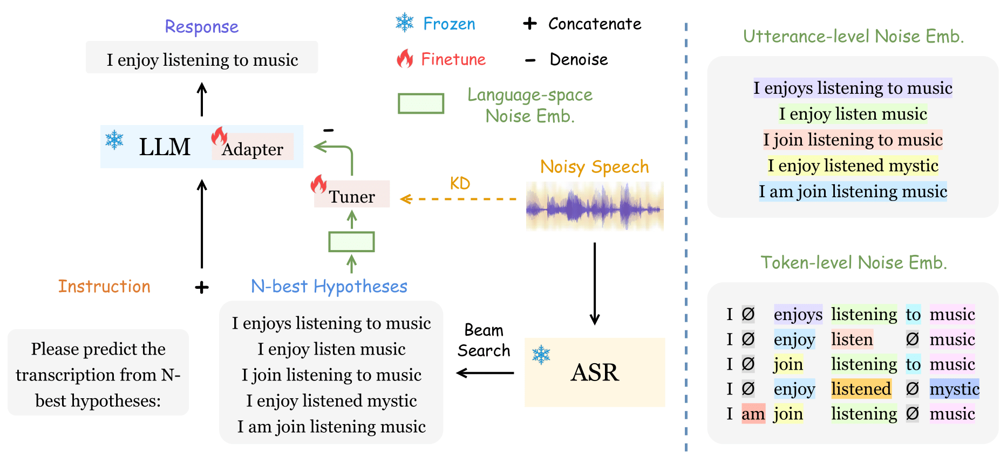
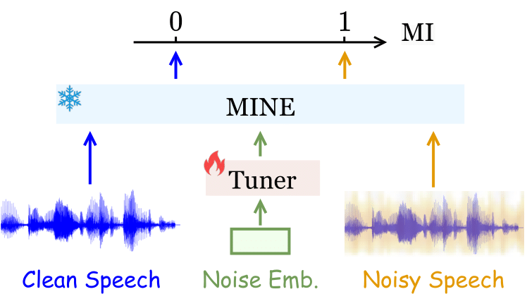
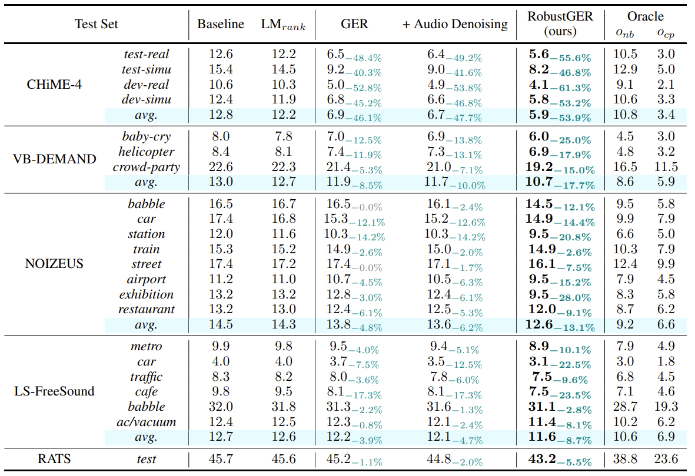
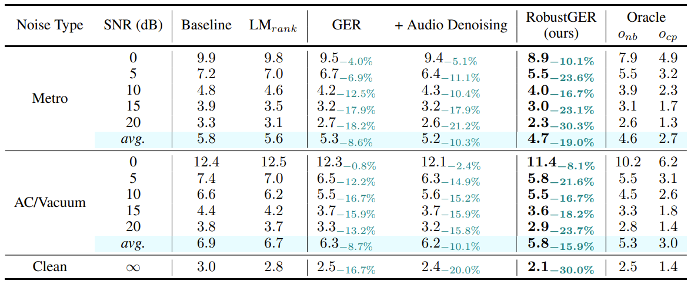
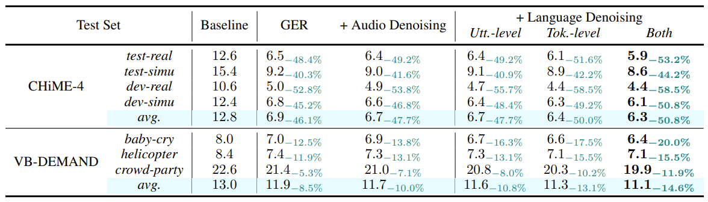
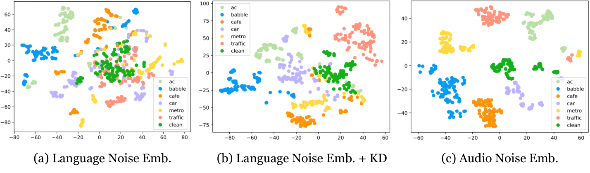
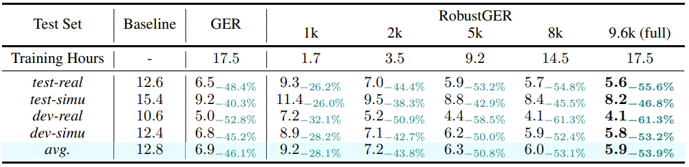
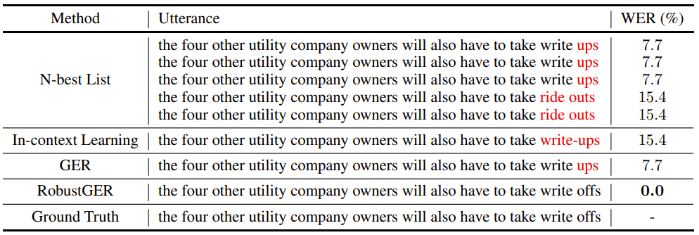

# [ICLR 2024] Large Language Models Are Efficient Learners of Noise-robust Speech Recognition

## 사전 지식
- LM (Language Model, 언어 모델)
  - 단어 sequence의 확률을 결정하기 위한 방법
  - 단어를 추론하고 생성
- ASR (Automatic Speech Recognition, 자동 음성인식)
  - 음성과 text를 활용하여 학습시킴
  - context dependency가 부족할 수 있음
  - LM을 연결할 경우 context 정보가 반영되어 성능이 올라감
- Rescoring
  - 단어가 나타날 확률을 구할 때 sparsity, long-term dependency 등의 문제가 발생
  - 모델에 global context 반영 위해 rescoring 제안
  - 여러 번 decoding 거치는 multi-pass 방법론
  - 이 논문에는 최상의 N개 결과를 이용하는 N-best list rescoring이 적용됨
    - (e.g.) (real) 북구청으로 가세요.
    - (e.g.) (top1) 북구청으로 가세요.
    - (e.g.) (top2) 북극청으로 가세요.
    - (e.g.) (top3) 북구 처음으로 가세요.
    - (e.g.) (top4) 부끄청으로 가세요.
- GER (Generative Error Correction)
  - noise-robust ASR 모델
  - noise가 있는 audio로부터 text를 생성하기 위함
- Beam Search Decoding
  - 자연어 처리에서 sequence를 생성할 때 사용하는 기법 중 하나
  - 가장 높은 확률의 token 하나를 고르는 게 아니라, 가능도가 높은 여러 개의 token을 선택해 target sequence를 늘리는 방법
  - 성능은 좋으나, 속도가 느려질 수 있다는 한계
- KD (Knowledge Distillation, 지식 증류)
  - 연산량이 적은 network가 큰 network만큼의 성능을 낼 수 있도록 teacher network의 지식을 student network에 전달하는 학습법

## 소개
- 최근 연구에서 LLM(Large Language Model)이 NLP(Natural Language Processing)에 자주 사용되고 있음.
- 이 논문은 ASR의 연구 주제 중 하나인 GER에서 N-best list rescoring을 활용하여 성능을 높이고자 함.
- 음성의 noise로 인한 부정적인 영향을 줄이고자 학습된 LLM을 fine-tuning함.
- 저자는 해당 model을 noise에 강인한 RobustGER로 소개하고 있음.
- noise가 낀 audio를 바로 적용하면 corss modality gap으로 인한 성능 저하.
  - 이 문제 해결을 위해 noise embedding 추출.
  - N-best hypothesis list로부터 noise diversity 측정.
  - worse noise condition, beam search decoding 등으로 N-best의 diversity를 높임.
- noise embedding은 language-space denoising을 위한 기법.
- mutual information estimation(KL divergence)을 통한 KD를 사용하여 audio embedding에서 noise information을 제거함.
- WER(word error rate)을 기존 GER 모델보다 53.9% 가량 개선함.

## Benchmark 모델 & 데이터
- GER (Generative Error Correction)
  - noise에 robust한 ASR 모델
  - noisy한 speech $X_n$으로부터 beam search decoding을 활용하여 N_best hypotheses $\mathcal{Y}_N=\{Y_1,Y_2,···,Y_N\}$을 생성함
  - 생성한 후보군을 text로 바꿔주는 hypotheses-to-transcription (H2T) 모델에 넣어줌

    ${Y=\mathcal{M}_ {H2T}(\mathcal{Y}_N)}$
 
 
  - ground truth가 $Y^+$일 때, cross-entropy loss를 다음과 같이 계산하여 LLM을 fine-tuning 함. ($\theta$는 learnable parameter)

    ${\mathcal{L}_ {H2T} = \sum_ {t=1}^{T}- \log \mathcal{P}_ {\theta}(y_ {t}^{+} \vert y_ {t-1}^{+}, ··· ,y_ {1}^{+},\mathcal{Y}_ {N})}$
 
 
- 데이터
  - noise한 speech audio 사용
    - CHiME-4, DEMAND, NOIZEUS, LibriSpeech-FreeSound, RATS, etc.

## 방법론
  
- 전체 Framework
  - $\mathcal{Y}_ {N}$에서 $N=5$로 설정
  - $\mathcal{Y}_ {N}$으로부터 추출한 language-space noise를 $E_ {LN}$으로 설정
  - source speech $X_n$에서 KD를 통해 noise를 제거하기 위해 ASR audio embedding을 $\mathcal{E}_ {ASR}(X_ {n})$으로 설정
  - noise 제거를 위해 denoising을 minus sign을 붙여 $-E_ {LN}$으로 표현
  - 아래 ${\mathcal{M}_ {H2T}}$는 LLM finetuning을 거친 H2T mapping

    ${Y=\mathcal{M}_ {H2T}(\mathcal{Y}_ {N};-E_ {LN})}$
 
 
- Language-space Noise Embedding
  - $E_ {LN}=[E_ {LN}^{utt};E_ {LN}^{tok}]$
  - $E_ {LN}$은 N-best list 내부의 문장 전체 diversity에 영향 끼치는 1) utterance level $E_ {LN}^{utt}$와 단어 단위에서 distribution을 측정한 2) token level $E_ {LN}^{tok}$로 나누어짐
  - 한편, raw text로부터 audio embedding을 얻기 위해 sentence-BERT (SBERT)가 사용됨
  - Utterance-level Noise Embedding

    $E_ {LN}^{utt}=Concat \{ [\mathcal{E}_ {sbert} (Y_ {i}) - \mathcal{E}_ {sbert}(Y_ {j}) ]_ {i,j=1,i>j}^{N} } \in ?^{ {N(N-1)\over{2} } \times D_ {sbert} \}$

    - 이 때, $D_ {sbert}$는 SBERT embedding size
    - $i,j$ 차이가 클 수록, worse noise가 생성됨

  - Token-level Noise Embedding
    - zero-padding ($Ø$)한 $Y_ {i}$를 일정한 길이로 잘라 $T$개의 token을 만듦

        $Y_i^{ali}=[y_ {i_ {1}}^{ali},y_ {i_ {2}}^{ali},···,y_ {i_ {T}}^{ali}], \quad y_ {i_ {t}}^{ali}\in \mathcal{V} \cup  Ø$
 
 
    - $E_ {edit}$을 통해 token-level difference를 측정

      $E_ {LN}^{tok} = Concat \{ [ E_ {edit}(Y_ {i}^{ali}, Y_ {j}^{ali}) ]_ {i,j=1,i>j}^{N} \} \in ?^{ {N(N-1)\over{2}} \times D_ {sbert} }$

      $E_ {edit}(Y_i^{ali},Y_j^{ali})=\sum_ {t=1}^T[\mathcal{E}_ {sbert}(y_ {i_t}^{ali})-\mathcal{E}_ {sbert}(y_ {j_t}^{ali})]$

  - Audio Noise Distillation
    - Mutual Information을 활용하여 clean speech와 noisy speech의 분포가 얼마나 차이 나는지 살핌

        $I(X;Z)=D_ {KL}(?_ {XZ} \vert\vert?_ {X} ?_ {Z})$
         
 
    - 아래와 같은 MINE (mutual information neural estimation)을 활용하여 parameter $\theta \in \Theta$에 대해 계산
    - $\psi_ { \mathbf{\theta} }는 \mathcal{X} \times \mathcal{Z} \rightarrow \mathbb{R}$ statistics network

        $I_ {\Theta}(X;Z) = \sup_ {\theta \in \Theta} \mathbb{E}_ {\mathbb{P}_ {XZ}}[ \psi_ { \mathbf{\theta} } ] - \log(\mathbb{E}_ {\mathbb{P}_ {X} \mathbb{P}_ {Z}}[e^{\psi_ { \mathbf{\theta} } } ])$
 
 
 

    - 학습 알고리즘은 아래와 같음

    1. **Require:**
        - LLM $\mathcal{M}_\text{H2T}$ with adapter $\mathcal{G}_ { \mathbf{\upsilon} }$.
        - MINE statistics network $\psi$ of parameters $\mathbf\theta$.
        - Language embedding tuner $\mathcal{T}$ of parameters $\mathbf{\omega}$.
        - N-best hypotheses $\mathcal{Y}_N$.
        - Parallel noisy speech $\mathcal{X}_n$ and clean speech data $\mathcal{X}_ {c}$.
        - Batch size $B$ and the total number of iterations $M$.
        - Hyper-parameter weight $\lambda$.

    2. **For** $m=1$ **to** $M$:
        - Draw $B$ N-best hypotheses samples from RobustHP dataset: $\{ \mathcal{Y}_ {N}^{(1)}, \mathcal{Y}_ {N}^{(2)}, \cdots, \mathcal{Y}_ {N}^{(B)} \}$;
        - Draw corresponding noisy and clean speech samples: $\{(X_n^{(1)}, X_c^{(1)}), (X_n^{(2)}, X_c^{(2)}), \cdots, (X_n^{(B)}, X_c^{(B)})\}$;
        - Extract language-space noise embedding from N-best list: $\{E_ {\text{LN}}^{(1)}, E_ {\text{LN}}^{(2)}, \cdots, E_ {\text{LN}}^{(B)}\}$;
        - Calculate $\mathcal{I} = \frac{1}{B} \sum_ {b=1}^{B} \psi_ {\mathbf{\theta}} (E_ {\text{LN}}^{(b)}, \mathcal{E}_ {\text{ASR}}(X_ {n}^{(b)})) - \log( \frac{1}{B} \sum_ {b=1}^{B} e^{\psi_ { \mathbf{\theta} }(E_ {\text{LN}}^{(b)}, \mathcal{E}_ {\text{ASR}}(X_ {c}^{(b)}))})$;
        - Calculate ${\mathbf{g}}_ { \mathbf{\theta} } = \nabla_ { \mathbf{\theta} }(\mathcal{I})$ and update $ \mathbf{\theta} $ by gradient ascent: $ \mathbf{\theta} \leftarrow \mathbf{\theta} + {\mathbf{g}}_ {\mathbf{\theta}}$;
        - Calculate GER cost function $\mathcal{L}_\text{H2T}$ with $\mathcal{T}_ {\mathbf\omega}(E_\text{LN}^{(b)})$ incorporated for denoising;
        - Re-calculate $\mathcal{I}_ {1} = \frac{1}{B}\sum_ {b=1}^{B} \psi_ {\mathbf{\theta}}(\mathcal{T}_ {\mathbf{\omega}}(E_ {\text{LN}}^{(b)}), \mathcal{E}_ {\text{ASR}}(X_ {n}^{(b)}))$;
        - Calculate $\mathbf{g_ {\upsilon,\omega}} = \nabla_ {\mathbf{\upsilon,\omega}}(\mathcal{L}_ {\text{H2T}} - \lambda \mathcal{I}_ {1})$ and update $\mathbf{\upsilon, \omega}$ by gradient descent: $\mathbf{\upsilon} \leftarrow \mathbf{\upsilon} - \mathbf{g_ {\upsilon}}, \mathbf{\omega} \leftarrow \mathbf{\omega} - \mathbf{g_ {\omega}}$;

## 실험
- 다양한 noise 환경의 audio에 대해 실험을 진행함
- GER은 baseline에 비해 성능 진전이 있었지만 여러 잡음 조건에 대해 성능 향상 제한적
- RobustGER은 여러 소음에 대한 일관된 성능 향상 (Table 1)
- RobustGER은 소음 정도에 대해서도 일관된 성능 향상 (Table 2)
- token-level noise가 성능 개선에 큰 기여 (Table 3)

     
**Table 1: WER (%) results of RobustGER with LLaMA-2-7b finetuning**

     
**Table 2: WER (%) results of RobustGER on different SNR-level testing conditions**

     
**Table 3: Ablation study of the language-space noise embedding in terms of utterance and token levels**

 

- noise embedding
  - KD 방식을 통해 최적의 noise embedding을 구함
  - 다음과 같이 잡음의 대표성이 잘 나타남

      

- 데이터 효율성
  - LLM fine-tuning을 활용하여 점진적으로 훈련 데이터 크기를 줄여도 WER 유지

    
**Table 4: Data efficiency of RobustGER on CHiME-4 test sets**

 

- error 수정 예시
  - 다음과 같이 RobustGER이 correction 성능이 가장 뛰어난 것을 볼 수 있음

    
**Table 5:  Case study of RobustGER**

## 결론
- language-space noise embedding을 추출하여 이를 denoising 해주었을 때, word correction 성능이 향상되는 것을 볼 수 있었음
- noise를 인식하고 noise embedding을 생성하는 복합적인 알고리즘을 활용하였음
- speech 분야에서 fine-tuning LLM의 우수한 성능을 보여줌

## 저자
- Yuchen Hu (yuchen005@e.ntu.edu.sg)
- Chen Chen (hucky@nvidia.com)

## 참조
- Github link (https://github.com/YUCHEN005/RobustGER)

