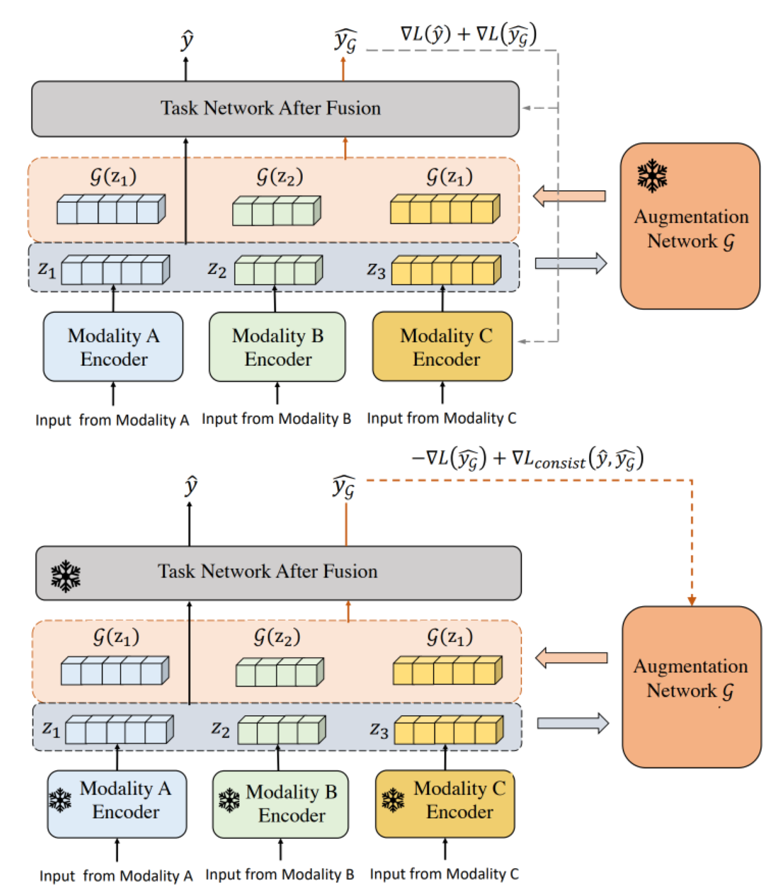
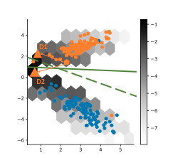
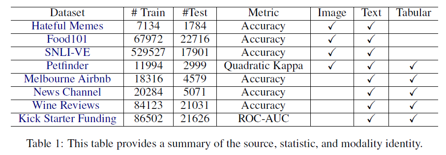
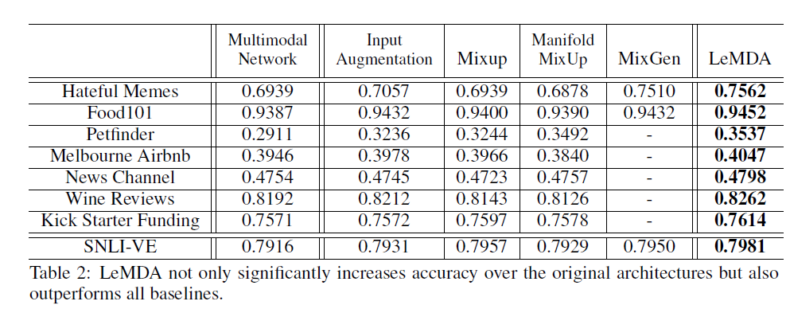
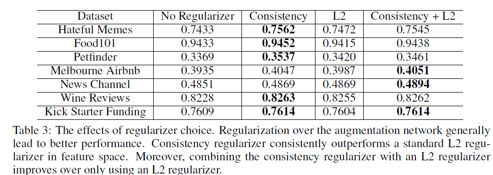
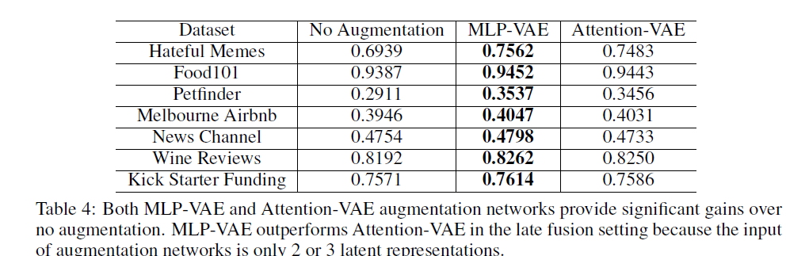
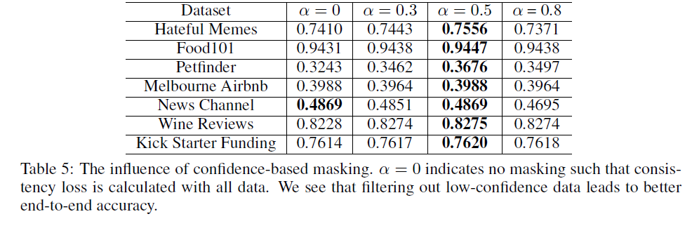

### 1. Motivation
Data Augmentation은 Computer Vision, NLP 등의 분야에서 성능을 향상시키기 위해 사용되는 기법 중 하나이다. 
기존 데이터에 다양한 transformation을 적용하여 데이터의 수를 늘릴 수 있고, 이를 통해 data efficiency와 regularization의 측면에서 좋은 성과가 나타났음을 뒷받침해주는 연구도 진행되었다. 
하지만, 기존의 data augmentation 방식을 multimodal deep learning에 적용하기에는 다음과 같은 문제점들이 존재한다. 
- Data augmentation은 주로 CV, NLP 분야에서 많이 이용되는 기법이다. Tabular, time series, latent space와 같은 형태의 데이터를 다루는 연구는 상대적으로 많이 진행되지 않은 상태이다.
- 두 가지 이상의 데이터를 동시에 고려해야 하므로 modality 간 관계를 파악하고, augmentation 이후에도 그 관계가 유지되는 것이 중요하다.
- 같은 형태의 데이터를 이용하더라도 각각의 task마다 그 데이터의 의미가 달라진다. 그 예로, image captioning과 VQA는 같은 vision-language 임에도 불구하고 task마다 language가 담고 있는 의미가 다르다.
- Data의 semantic한 구조를 유지하면서 각각의 modality를 augmentation하는 것은 어렵다.
따라서 본 연구에서는 모든 modality의 data에 적용될 수 있는 LeMDA(Learning Multimodal Data Augmentation in Feature Space)라는 기법을 제안한다. 

본 연구는 multimodal data를 다루기 위한 방안을 다음과 같이 제시한다. 
- Feature space에서 augmentation을 진행하기 위해 encoder를 활용하여 각 modality를 representation으로 변환한다.
- Adversarial training과 consistency regularizer를 이용하여 augmentation network training을 진행한다.
위와 같은 해결방안을 제시한 model을 논문에서는 LeMDA(Learning Multimodal Data Augmentation in Feature Space)라고 부른다.

### 2. Preliminary
#### - Notation  
$x$는 sampling input을 의미한다. 
input으로 여러 modality를 갖는 데이터가 사용되는데, $N$은 Modality의 개수를 뜻한다.
본 논문에서 제시된 augmentation 기법에는 $F$와 $G$라는 두 가지 네트워크가 사용된다.
$F$는 Multimodal task network이고, $G$는 augmentation network를 의미한다.

#### - Late Fusion  
Modality가 융합되는 지점에 따라 크게 early fusion과 late fusion으로 구분된다. 본 연구에서는 둘 중 late fusion에 초점을 맞추고 있다. late fusion은 backbone network를 통해 input 별로 구분된 representation을 추출한 뒤 결합하는 방식이다. 이는 modality의 종류나 task에 상관없이 적용될 수 있다는 장점이 있다.

### 3. Proposed Model  
LeMDA 는 semantic한 구조를 유지하는 informative data를 생성하도록 task network인 F를 활용하여 augmentation network인 G를 학습하는 방법을 말한다. 
우선 LeMDA 의 overview 는 다음 그림과 같다. 

 

#### - Training (multimodal) task network  
우선 task network가 어떻게 training되는지 살펴보자. 
original embedding과 augmented emvedding은 각각 fusion을 거친 뒤 task network에 입력된다. 
이 과정에서 loss function은 다음과 같다. 

$\mathcal{L} = E_{x\sim X}(\mathcal{L}(\hat{y}) + \mathcal{L}(\hat{y}_G))$
 

$\hat{y}$는 original data로 인한 output이며, $\hat{y} _{G}$ 는 augmented data로 인한 output을 의미한다. 이 loss를 최소화함으로써 task network와 각 modality의 encoder를 update할 수 있다.

### - Augmentation network  
이 부분에서는 LeMDA의 핵심 단계이자 의미를 설명한다. Augmentation network인 G는 각 modality의 encoder를 통과한 embedding vector를 augmentation하는 network이다.  
즉, LeMDA는 feature space에서 multimodal data를 연결적으로 augment하도록 augmentation network를 구성하여 학습을 진행하는 기법을 말한다. 
이를 위해 모델은 variational auto encoder를 사용한다. 본 논문에서는 두 가지의 구조를 사용하는데, 다음과 같다.
- 각 embedding을 concatenation하는 MLP-VAE
- 각 embedding을 N개의 token으로 취급하여 self-attention을 이용하는 attention-VAE

Augmentation network training의 핵심은 adversarial training과 consistency regularizer이다.

##### - Adversarial training  
이 부분은 두 네트워크의 성능을 모두 향상시키기 위한 부분이다.  
이 학습방식에서는 task network loss와 augmentation loss를 이용한다. 두 loss에 대한 식은 다음과 같다.

$$\mathcal{L} _{Task \; Network} = \text{min} E_{x\sim X}(\mathcal{L}(\hat{y}) + \mathcal{L}(\hat{y}_G))$$ 

$$\mathcal{L} _{Augmentation} = \text{max} E_{x\sim X}(\mathcal{L}(\hat{y}_G)) + \text{min} E_{x\sim X}(\mathcal{L}_{consist}(\hat{y}, \hat{y}_G))$$ 

첫 번째 loss를 통해 task 성능을 높이기 위해 task network를 학습하고, 두 번째 loss를 통해 task 성능을 낮추기 위해 augmentation network를 학습한다. 즉, adversarial training을 통해 2가지의 network의 성능을 모두 극대화할 수 있다. 

##### - Consistency regularizer  

consistency regularizer은 orginal data와 augmented data의 유사한 logit output distribution을 유도하는 역할이다. 이를 그래프와 함께 살펴보면 다음과 같다.  

주황색 동그라미(original data)로부터 두개의 화살표로 이어진 D1,D2는 모두 augmented data이다. 육각형으로 표시된 부분은 training loss를 표현한 것으로, 더 어두울수록 task training loss가 더 큰 것을 의미한다. 녹색 실선은 actual decision boundary이고, 녹색 점선은 model의 decision boundary이다. Task loss의 관점에서 봤을 때, D1과 D2 모두 original data로부터 비슷한 거리만큼 이동했기 때문에 선호도는 같다. 하지만 D2는 모델의 decision boundary를 넘어갔기 때문에 consistency regularizer에 의해 penalty가 부과된다. 이는 D2가 기존 data의 class label과 description과 맞지 않고, augmentation을 통해 original data와 많이 달라진 예시이기도 하기 때문이다. 

본 논문에서 consistency regularizer에 적용된 주요 기법은 두 가지가 있는데, 다음과 같다.
- confidence masking
- design decisions

Confidence masking이란 예측확률이 threshold인 $\alpha$보다 더 큰 sample에만 $\mathcal{L} _{consist}$를 적용한다는 것이다.이는 label이 확실하지 않은 augmented data에 penalty를 잘못 적용하면 augmentation network의 학습이 망가질 수 있기 때문이다. 
다음으로 design decisions는 상황에 맞게 학습을 위한 설계를 결정하는 것을 의미한다. LeMDA는 단순하고 일반적인 구조로 구성되어있으므로 consistency regularizer를 어떻게 정의해서 어느 범위까지 적용되어야 할지가 실험을 통해 잘 결정되어야 한다. 

### 4. Experiments
LeMDA 에 대한 평가를 위해 다양한 modality의 data가 pair로 존재하는 8개의 dataset이 사용되었다. 
실험은 크게, **LeMDA 에 대한 성능 평가**, **Ablation study**로 이루어져있다. 

#### - Baselines  
baseline 으로는 task network의 경우 multimodal-net이 사용되었고, modality encoder의 경우 modality의 종류에 따라 ConvNet, ELECTRA, Transformer 등이 사용되었다. 

Table 1은 실험에 사용된 8개의 dataset에 대한 정보이다. image, text, tabular 총 세 개의 modality의 조합으로 구성된 dataset들이 이용되었음을 알 수 있다. 
LeMDA의 성능을 평가하기 위해 총 4가지의 data augmentation method와 LeMDA를 비교하였다. 실험에 이용된 data augmentation method는 다음과 같다.
- single-modal method : Image의 경우 최신 이미지 증강 기법인 TriviralAugment가 이용되었다. Text의 경우 EDA, AEDA의 모든 transformation에서 random하게 선택된 하나가 이용되었다.
- multi-modal method : Mixup, Manifold Mixup, MixGen 

Table 2에서 확인 할 수 있듯이, LeMDA를 사용했을 때 모든 dataset에서 성능이 향상되었음을 알 수 있다. 
특히 Hateful Memes(Image-text), Petfinder(Image-Text-Tabular)에서는 6% 이상 accuracy가 증가하였다. 

마지막으로 ablation study 에 대한 분석을 진행하겠다. regularizer에 대한 Ablation study 에서 확인 할 수 있듯이 consistency가 포함된 경우 model performance가 향상되었음을 확인할 수 있다. 이는 consistency를 이용함으로써 target과 augmentation network 간의 softmax 값에 접근하면서 lebel에 대한 직접적인 정보를 제공하는 것이 중요함을 시사하는 바이다.
 
Table 4는 두 VAE를 비교한 결과이다. 모든 dataset에서 MLP-VAE를 사용했을 때 성능이 더 좋다는 것을 알 수 있다. 이는 modality의 개수와 연관이 있다. Late fusion 기준으로 fusion하는 modality의 개수가 2,3개 정도로 작은 숫자이기 때문에 attention을 수행하는 것이 효과적이지 않음을 알 수 있다.
 
Table 5는 augmentation network의 confidence masking의 threshold를 조정한 결과이다. masking을 진행하는 것이 대체로 더 좋은 성능이 나타났다. 

### 5. Conclusion
본 논문에서는 Multi modal data에 적용할 수 있는 data augmentation method를 제안함으로써 modality 간의 연결 관계를 고려하지 못하는 문제를 해결하였다. Multiodal data를 이용하면 더 쉬운 training이 가능하고, 여러 modality를 갖는 데이터 간에는 서로 보완을 한다는 관계성이 존재하기 때문에 이를 모두 고려할 수 있는 data augmentation method는 model의 더 나은 performance를 위해 꼭 필요한 기법이다. 
따라서 late fusion에 초점을 맞춰 모든 modality와 task에 적용할 수 있는 기법을 제안하여 모델의 성능 향상을 성공적으로 구현하였다.
  
논문의 마지막에서 저자는 early fusion에 대한 연구는 open question으로 남겨두었다. 
##### - personal idea 
multimodal data는 각 modality가 pair로 이뤄져야한다는 점 때문에 그 수가 unimodal data에 비해 적은 것이 사실이다. 따라서 multimodal data augmentation은 연구가 더 이뤄져야하는 부분이고, early fusion을 적용하는 것이 더 나은 상황에서의 augmentation도 필요하다. 이 경우에는 각 modality별로 augmentation을 진행한 뒤, augmented data 간의 pair를 만드는 방식의 연구가 도움이 될 것이라고 생각한다. contrastive learning 등을 이용하여 modality 간의 positive pair를 생성하는 방식을 이용하면 late fusion을 하지 않고도 multimodal data의 augmentation을 할 수 있을 것이다.

### 6. Author infromation
##### - Zichang Liu  
- Rice University