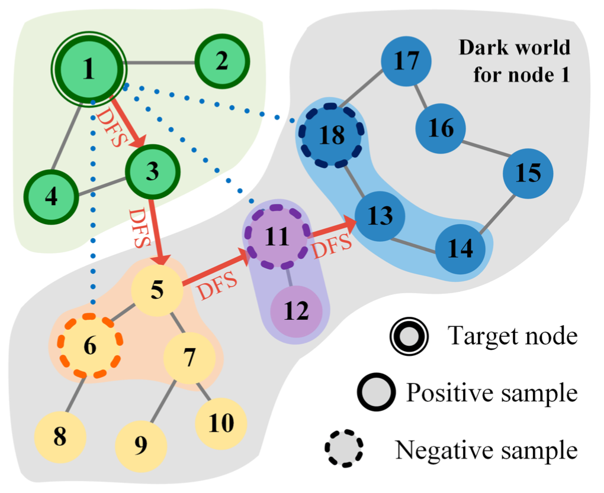
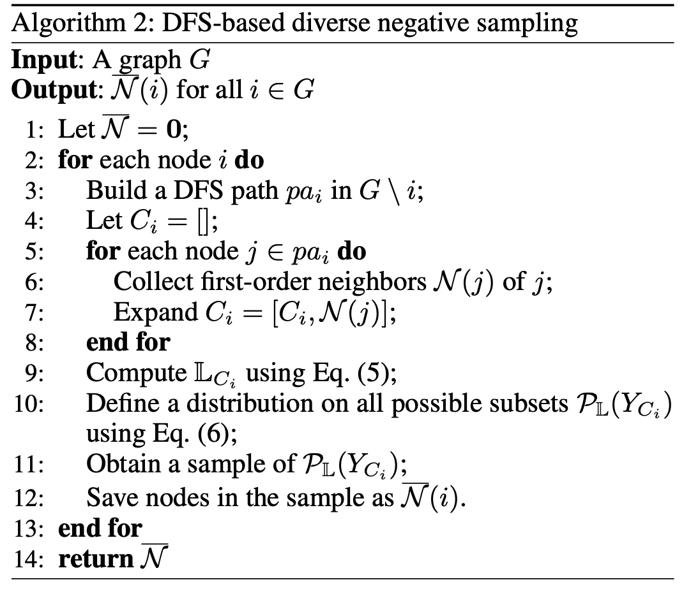
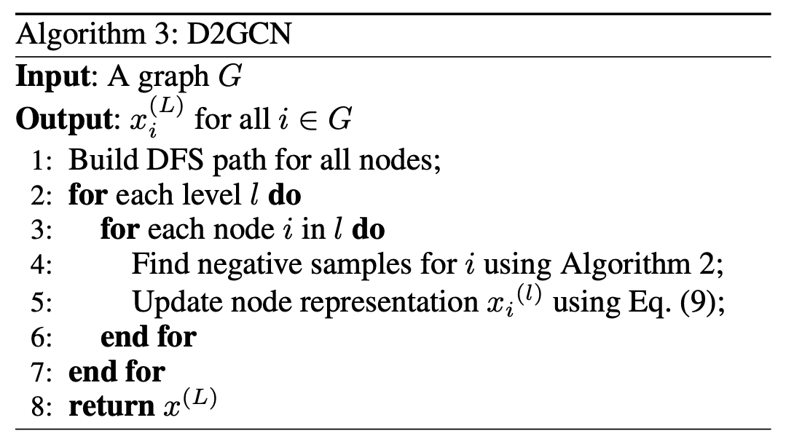
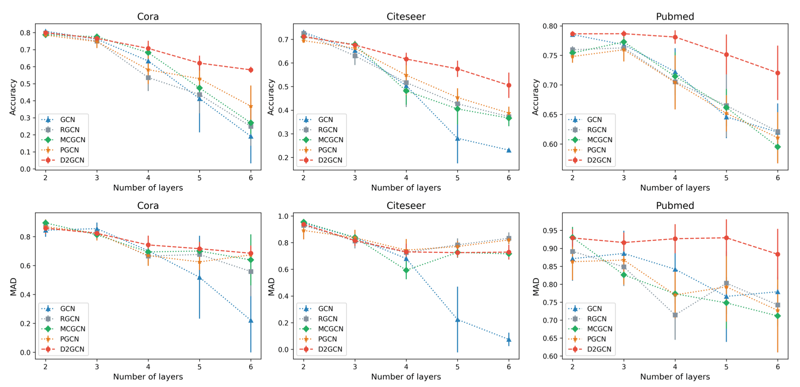
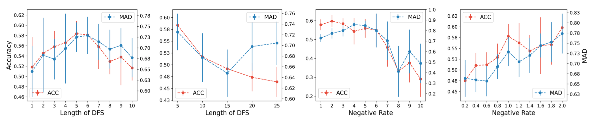

---
title:  "[AAAI 2022] Learning from the Dark: Boosting Graph Convolutional Neural Networks with Diverse Negative Samples"
permalink: Learning_from_the_Dark_Boosting_Graph_Convolutional_Neural_Networks_with_Diverse_Negative_Samples.html
tags: [reviews]
use_math: true
usemathjax: true
---

This is a review of 'Learning from the Dark: Boosting Graph Convolutional Neural Networks with Diverse Negative Samples' by Duan et al., published in AAAI 2022. The paper uses Determinantal Point Processes (DPP) in Graph Convolutional Networks (GCNs) in order to effectively use negative samples in node representation learning. Many mathematical formulae and algorithms are presented in the paper, especially to explain the concept of DPP. I have omitted micro-level details in this review to preserve conciseness, but I have not changed the labels (numbers) of the formulae and algorithms in order to keep them consistent with the paper. 

# **1. Problem Definition**
Conventionally, Graph Convolutional Neural Networks (GCNs) have learned node representations in graphs by utilizing a message passing mechanism where nodes update their representations based on information from neighboring nodes, referred to as positive samples. Yet, the potential information from non-neighboring nodes, referred to as negative samples, remains largely unexplored and undervalued in the context of representation learning. This paper claims that negative samples hold diverse and useful information as well, because two nodes without edges between them should have different representations. Thus, a good negative sample contributes negative information to a particular node, providing contrast to its positive samples. Furthermore, this helps avoid the over-smoothing problem, which refers to node representations becoming more and more similar as the number of layers of the neural network increases and each node only updates its representation according to its neighbors. The process of selecting suitable negative samples for each node is also significant, so the criteria for identifying good negative samples is defined, and an efficient algorithm is proposed.

Thus, the overarching objective of this paper is to enhance the performance of GCNs by integrating both positive and negative information during message passing, thereby improving representation learning quality and mitigating over-smoothing issues.

# **2. Motivation**
## Graph Convolutional Neural Networks
Graphs serve as effective models for diverse data types prevalent in modern society, such as molecules, social networks, and traffic networks. However, their compatibility with popular deep learning algorithms, which typically handle regular data structures, poses challenges. To bridge this gap, graph neural networks (GNNs) have emerged as suitable deep learning architectures. GNNs come in various forms tailored for specific tasks, including graph sequence neural networks, GCNs, and spatio-temporal graph convolutional networks. Among these, GCN (Kipf and Welling 2017) is a notable and straightforward variant that employs a message-passing mechanism (Geerts, Mazowiecki, and Perez 2021), where nodes update their representations based on information from neighboring nodes. While this approach is effective, a limitation is that it leads to over-smoothing. To address this, the paper suggests leveraging non-neighboring nodes (negative samples) to introduce diverse information and counter over-smoothing.

## Negative Samples
Existing works on selecting negative samples in graphs have limitations that this paper aims to address. Kim and Oh (2021) suggested a simple approach of uniform random selection from non-neighboring nodes, but this method tends to favor larger clusters in graphs, neglecting valuable information from smaller clusters. Two other methods utilize Monte Carlo chains (Yang et al. 2020) and personalized PageRank (Ying et al. 2018), yet neither adequately captures diverse information or avoids redundancy in sample selection.
In contrast, this paper introduces a Graph Convolutional Neural Network (GCN) enhanced by diverse negative samples selected via a determinant point process (DPP), a method that prioritizes diverse subsets. The proposed approach defines a DPP-based distribution on non-neighboring nodes to select diverse negative samples for each node. However, the computational complexity of this method can be high at O(N ^3^), where N is the number of non-neighboring nodes. To mitigate this, a depth-first search (DFS) based method is proposed to sequentially collect diverse negative samples along the search path for each node, significantly reducing computational costs to O(p &middot; d^3^), where p is the path length and d is the average degree of the graph.

# **3. Method**
## Definitions

In GCNs, the representation of node $i$ and layer $l$ is defined as:

$x_i^{(l)} = \Sigma_{j \in N_i \cup {\{i\}}} \frac{1}{\sqrt(d_i) \cdot \sqrt(d_j)} (\Theta^{(l)} \cdot x_j ^{(l-1)} )$ *(eq. 1)*

where $N_i$ is the neighbors of node $i$, $d_i$ is the degree of node $i$ and $\Theta^{(l)}$ is a feature transition matrix. The goal of this equation is to aggregate the weighted representation of all neighbors.

Determinant Point Process (DPP) is a special point process for defining a probability distribution on a set where more diverse subset has a higher probability. The main idea of this paper is to define a DPP-based distribution on diverse subsets of all non-neighboring nodes of a certain node, then outputting a diverse subset from this distribution.

First, $L$-ensemble for a given node i in graph G is defined as:

$L_{G_n \backslash i} (j, j') = exp(cos (x_j , x_{j'}) - 1)$ *(eq. 5)*

where $G_n \backslash i$ denotes the node set of $G_n$ excluding node $i$, $j$ and $j'$ are two nodes within $G_n \backslash i$ and $cos(\cdot , \cdot)$ is the cosine similarity between two node representations $x$.

With this $L$-ensemble, distribution on all possible subsets of all nodes in the graph except for $i$ is defined as:

$P_L (Y_{G_n \backslash i}) = \frac{\text{det}(L_{Y_{G_n \backslash i}})}{\text{det}(L_{Y_{G_n \backslash i}} + I)}$ *(eq. 6)*

where $Y_{G_n \backslash i}$ is a set of all subsets of $G_n \backslash i$ and det($\cdot$) is the matrix determinant operator. The reason why this paper uses this distribution is because it has a nice and unique property that the more diverse the subsets, the higher their probability values, and the easier it is to obtain a diverse set from this distribution by sampling. 

## DPP-Based Negative Sampling

<!-- **[Figure1.png]** -->

Good negative samples have different semantics and have complete knowledge of the whole graph. For example, nodes 6, 11, and 18 would be a good negative sample in Figure 1. To collect this, a depth-first-search (DFS) method is employed to create a fixed-length path from a given node $i$ to other nodes, capturing the first-order neighbors along this path to form a candidate set. Diverse negative samples are then selected from this set using the determinant point process (DPP) approach, aiming to represent various clusters in the graph. This DFS-based method leverages local diverse negative samples to approximate global diversity by breaking through the clusters of the current node and accessing different semantics. While collecting higher-order neighbors could enhance approximation, it would also escalate computational costs. Optimal performance is achieved when the path length is around a quarter of the graph's diameter. This procedure is detailed in Algorithm 2.

<!-- **[Algorithm2.png]** -->

## Graph Convolutional Operation
Finally, the paper proposes a new graph convolutional operation as:

$x_i^{(l)} = \Sigma_{j \in N_i \cup {\{i\}}} \frac{1}{\sqrt(d_i) \cdot \sqrt(d_j)} (\Theta^{(l)} \cdot x_j ^{(l-1)}) - \omega \Sigma_{\overline{j} \in \overline{N_i}} \frac{1}{\sqrt(d_i) \cdot \sqrt(d_{\overline{j}})} (\Theta^{(l)} \cdot x_{\overline{j} ^{(l-1)}})$ *(eq. 9)*

where $\overline{N_i}$ is the negative samples of node $i$ and $\omega$ is a hyperparameter to balance the contribution of the negative samples. In essence, each node sends two types of messages: positive messages from neighboring nodes and negative messages from non-neighboring nodes. While positive messages encourage nodes with similar semantics to have similar representations, negative messages promote nodes with different semantics to have distinct representations. The paper posits that these negative messages, which are absent in traditional GCNs, are crucial for advancing their performance. This procedure is shown in Algorithm3.

<!-- **[Algorithm3.png]** -->

# **4. Experiment**

## Experiment Setup

### Datasets

Benchmark graph datasets in the literature are used: Citeseer, Cora and Pubmed (Sen et al. 2008). The datasets include sparse bag-of-words feature vectors for each document, as well as a list of document-to-document citation connections. The experimental task is standard node classification.

### Baselines

The base model is GCN. The sampling method is compared with the three other negative sampling methods available to date, then the selected samples are inputted into the convolution operation defined above. The three sampling methods are:

- RGCN (Kim and Oh 2021), which selects negative samples in a purely random way.
- MCGCN (Yang et al. 2020), which is based on Monte Carlo chains.
- PGCN (Ying et al., 2018), which is based on personalised PageRank.

### Evaluation Metric

Two metrics are used, one measuring the prediction performance and one measuring the extent to which the algorithm alleviates the over-smoothing problem.

- Accuracy : cross-entropy loss for the node label prediction on test nodes
- Mean Average Distance (MAD) (Chen et al. 2020) : smoothness of graph representation

More specifically, MAD is:

$\text{MAD} = \frac{\Sigma_i D_i}{\Sigma_i 1(D_i)}$ , $D_i = \frac{\Sigma_j D_{ij}}{\Sigma_j 1(D_{ij})}$

### **Results**

<!-- **[Result1.png]** -->

Generally, as the depth of the models increased from 3 to 6 layers, there is a decrease in both accuracy and MAD due to over-smoothing, consistent with existing literature. PGCN shows slightly better results than RGCN and MCGCN on Cora and Citeseer, particularly at deeper layers. However, on Pubmed, GCN performs much worse than the others. The addition of negative samples to convolutional layers mitigates over-smoothing to some extent, but the selection of appropriate negative samples remains challenging. In contrast, the proposed D2GCN model consistently outperforms the other models in terms of accuracy across all datasets and exhibits outstanding MAD performance on Cora and Pubmed. While D2GCN also experiences a performance decrease with increasing depth, the rate is slower compared to other models, especially remaining nearly constant on Pubmed. These findings validate that incorporating diverse negative samples effectively alleviates over-smoothing, thereby improving prediction accuracy. Additionally, D2GCN demonstrates lower variance than the other models, possibly due to the diverse negative samples influencing node representations more dynamically compared to solely using positive samples.

<!-- **[Result2.png]** -->

Furthermore, the sensitivity of hyper-parameters (length of DFS and scale of negative rate) is analyzed on Citeseer dataset using 5-layer D2GCN. As the scale of negative rate or length of DFS increases, both accuracy and MAD increase initially, but decreases afterwards. For the length of DFS, outstanding results are obtained when it is equal to 5 or 6. For the scale of negative rate, it achieves the same performance as the trainable parameters when it was equal to {1, 2, 3}.

# **5. Conclusion**

This paper emphasizes the significance of negative samples in GCNs and establishes criteria for selecting good negative samples. The use of DPP for meaningful negative sample selection in GCNs is introduced, marking a novel approach in the field. Additionally, the paper is the first to integrate negative samples directly into graph convolution and propose a DFS-based heuristic to reduce computational costs effectively. Experimental results demonstrate that the proposed D2GCN method consistently outperforms other methods in predictive accuracy and mitigates over-smoothing issues.

Personally, I found this paper insightful because it clearly identified a problem in the field of GCNs and utilized a fairly unique idea of DPP to solve this problem. As someone who is not from a strictly AI background, I learned that research in this field is a combination of domain awareness, solid understanding of mathematical theory, and creative ideas to drive algorithm development.

---

# **Author Information**

- Joon Im
    - Department of Industrial and Systems Engineering, KAIST
    - Contact : [joonim14@kaist.ac.kr](mailto:joonim14@kaist.ac.kr)

# **6. Reference & Additional materials**

**Duan, W., Xuan, J., Qiao, M. and Lu, J., 2022, June. Learning from the dark: boosting graph convolutional neural networks with diverse negative samples. In *Proceedings of the AAAI Conference on Artificial Intelligence* (Vol. 36, No. 6, pp. 6550-6558).**

Geerts,F.;Mazowiecki,F.;andPerez,G.A.2021. Let’s agree to degree: comparing graph convolutional networks in the message-passing framework. In *Proceedings of the 38th International Conference on Machine Learning (ICML), Virtual Event*, 3640–3649.

Kim, D.; and Oh, A. H. 2021. How to find your friendly neighborhood: graph attention design with self-Supervision. In *Proceedings of the 9th International Conference on Learning Representations (ICLR), Virtual Event, Austria*.
Kipf, T. N.; and Welling, M. 2017. Semi-supervised classification with graph convolutional networks. In *5th International Conference on Learning Representations (ICLR), Toulon, France*.

Sen, P.; Namata, G.; Bilgic, M.; Getoor, L.; Gallagher, B.; and Eliassi-Rad, T. 2008. Collective classification in net- work data. AI Magazine, 29(3): 93–106.

Yang, Z.; Ding, M.; Zhou, C.; Yang, H.; Zhou, J.; and Tang, J. 2020. Understanding negative sampling in graph representation learning. In *Proceedings of the 26th ACM SIGKDD International Conference on Knowledge Discovery & Data Mining (KDD), Virtual Event, CA, USA*, 1666–1676.

Ying, R.; He, R.; Chen, K.; Eksombatchai, P.; Hamilton, W. L.; and Leskovec, J. 2018. Graph convolutional neural networks for web-scale recommender systems. In *Proceedings of the 24th ACM SIGKDD International Conference on Knowledge Discovery & Data Mining (KDD), London, UK*, 974–983.
