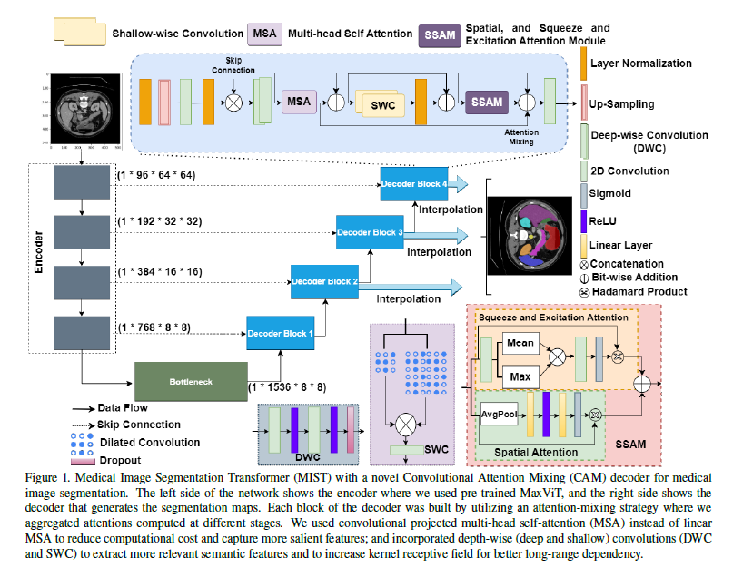
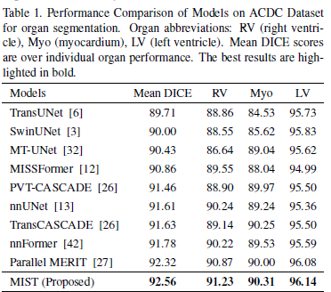
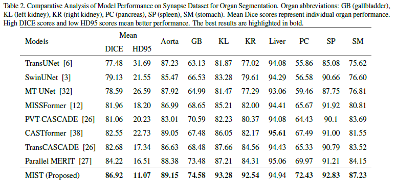
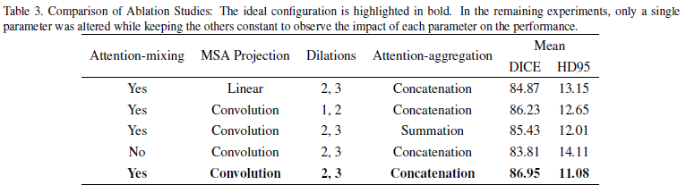

## 1. Problem Definition
Medical image segmentation is a critical and fundamental task in medical image analysis where the goal is to label specific regions or structures in medical images. It involves classifying each pixel into one or more categories based on what anatomical structure it belongs to. For instance, in a heart MRI, segmentation would involve classifying pixels as part of the myocardium, ventricles, or background. Segmentation helps in numerous healthcare applications, including:

-   **Diagnosis:** Helps in identifying diseases by clearly delineating abnormal tissue structures from normal ones.
-   **Treatment Planning:** Accurate segmentation allows for better planning of surgical interventions and therapies.
-   **Monitoring:** Enables doctors to track the progress of disease or effectiveness of treatment over time by observing changes in the shape and size of anatomical structures.

Medical image segmentation poses several challenges that the paper aims to address:

1.  **Variability in Image Quality:** Medical images can vary greatly due to different scanning protocols, machine settings, and patient movement. This variability makes it difficult to design a robust segmentation model.
2.  **Complexity of Anatomical Structures:** Many organs and tissues have complex and irregular shapes which are hard to delineate accurately.
3.  **Similarity in Tissue Appearance:** Different tissues can appear similar in medical images, making it difficult to distinguish between them.
4.  **Scale Variance:** Structures of interest can vary in size, which complicates the segmentation process.

The specific issue this research addresses is how current deep learning models in particular, CNNs and Vision Transformers, are not up to standard when it comes to managing the intricate details of medical image segmentation. The study emphasizes that these limitations can hinder the performance of medical image segmentation tasks, particularly when both local details and global contexts are crucial for accurate delineation of medical structures.

## 2. Motivation
The motivation for this study stems from the limitations in current deep learning models:

- **CNNs** are limited by their local receptive fields, which means they can miss broader context unless specifically designed with mechanisms like dilated convolutions or large receptive fields that can become computationally expensive.
- **Transformers**, adapted from NLP to handle long sequences, offer excellent capability in grasping global interactions in data but can be inefficient in processing high-resolution images due to their computational cost and can overlook local specifics crucial for high-resolution tasks like image segmentation.

Thus, the motivation is to harness the deep, hierarchical feature-processing capability of CNNs and the global contextual awareness of transformers to create a hybrid model that excels at both local detail and global context understanding.

## 3. Method

<!--  -->

### Encoder: Multi-Axis Vision Transformer (MaxViT)
The encoder utilizes a vision transformer architecture, designed to handle different stages of feature complexity in an image. Each stage consists of blocks that transform input features into increasingly abstract representations:

- **Hierarchical Processing**: Each stage processes features at a different scale, enabling the model to capture both fine and coarse details.
- **Efficient Scaling**: Lower stages have more blocks to handle finer details, while higher stages with fewer blocks focus on abstracting global features.

### Decoder: Convolutional Attention Mixing (CAM)
The CAM decoder integrates several advanced mechanisms:

- **Multi-Head Self-Attention (MSA)**:
The MSA mechanism in MIST employs convolutional layers to generate the queries, keys, and values, enhancing the model's ability to capture local spatial features.

1.  **Convolutional Projections:**
    
    -   Instead of typical linear transformations, convolutional layers are used:
        -   $Q = \text{Conv}(X)$
        -   $K = \text{Conv}(X)$
        -   $V = \text{Conv}(X)$
    -   Here, $X$ is the input feature map to the attention module.
2.  **Scaled Dot-Product Attention:**
    
    -   The attention weights are computed using the standard scaled dot-product formula, but applied to features transformed by convolutional layers:
        -   $\text{Attention}(Q, K, V) = \text{softmax}\left(\frac{QK^T}{\sqrt{d_k}}\right)V$
    -   $d_k$ represents the dimensionality of the key vectors, which helps in stabilizing the gradients during training.
3.  **Multi-Head Configuration:**
    
    -   MIST processes the attention mechanism across multiple heads, allowing the model to capture various aspects of the input data in parallel:
        -   $\text{Head}_i = \text{Attention}(QW_i^Q, KW_i^K, VW_i^V)$
    -   After processing through individual heads, the outputs are combined:
        -   $\text{MSA}(Q, K, V) = \text{Concat}(\text{Head}_1, ..., \text{Head}_h)W^O$
    -   $W^O$ here denotes the output projection matrix that integrates information across all heads.

Utilizing convolutional projections in the self-attention mechanism allows the MIST model to retain more local spatial information than would be possible with linear projections. This is particularly beneficial for tasks like medical image segmentation, where the precise localization of features within an image is critical. The convolutional approach also helps in reducing the overall computational cost by decreasing the number of parameters needed for the projection phases, making the model both efficient and effective in handling high-resolution medical images.

- **Spatial and Squeeze-and-Excitation Attention**:
  These mechanisms refine focus and recalibrate channel-wise features dynamically, enhancing the model's responsiveness to salient features.

- **Convolutional Projections**:
  Instead of projecting inputs linearly, using convolutions retains spatial hierarchies and reduces parameters, enhancing computational efficiency.

- **Skip Connections**:
  $X_{\text{out}} = \text{Concat}(X_{\text{up}}, X_{\text{enc}})$ ,where $X_{\text{up}}$ is upsampled output, and $X_{\text{enc}}$ is the encoder feature at the corresponding level. These connections enhance information flow by integrating detailed features from initial layers with the abstracted features from deeper layers, crucial for preserving edge details in segmentation.

### Loss Function:
The loss function used in the study is a weighted combination of the DICE loss and the Cross-Entropy loss.

### Loss Function Components

1.  **DICE Loss ($L_{\text{DICE}}$):**
    
    -   The DICE coefficient, also known as the Sørensen–Dice index, is widely used in image segmentation to measure the similarity between two samples. It is especially useful for datasets where the class distribution is imbalanced.
    -   Mathematically, it is defined as: $L_{\text{DICE}} = 1 - \frac{2 \times \vert Y \cap \hat{Y} \vert}{\vert Y \vert + \vert \hat{Y} \vert}$ Where $Y$ represents the ground truth mask, and $\hat{Y}$ is the predicted mask. $\vert Y \cap \hat{Y} \vert$ denotes the common elements (or pixel overlap) between the predicted and the truth masks, and $\vert Y \vert + \vert \hat{Y} \vert$ is the total number of elements in both masks.
2.  **Cross-Entropy Loss ($L_{\text{CE}}$):**
    
    -   This is a standard loss function for classification tasks, measuring the performance of a classification model whose output is a probability value between 0 and 1.
    -   Cross-entropy loss increases as the predicted probability diverges from the actual label. It is defined as: $L_{\text{CE}} = -\sum_{c=1}^M y_{o,c} \log(p_{o,c})$ Where $M$ is the number of classes, $y_{o,c}$ is a binary indicator of whether class label $c$ is the correct classification for observation $o$, and $p_{o,c}$ is the predicted probability of observation $o$ being of class $c$.

### Combined Loss Function

The total loss ($L_{\text{total}}$) used in the model is a weighted sum of the DICE loss and the Cross-Entropy loss. This approach combines the strengths of both loss functions, addressing the class imbalance problem (via DICE) and focusing on the probabilities (via Cross-Entropy), which is crucial for training segmentation models effectively. The weighted sum is defined as: $L_{\text{total}} = \gamma L_{\text{DICE}} + (1 - \gamma) L_{\text{CE}}$ Where $\gamma$ is a weight factor that balances the two losses. In their configuration, they have set $\gamma = 0.3$, giving more emphasis to the Cross-Entropy loss. This configuration helps in fine-tuning the model by focusing not only on the overlap between the segmented and ground truth areas but also on enhancing the predictive certainty across all classes.

This loss function ensures that the model is not only accurate in terms of pixel overlap (as measured by DICE) but also confident in its predictions, reducing the likelihood of misclassification across the diverse features within medical images.

## 4. Experiment

### 4.1 Experiment Setup
### 4.1.1  Datasets: 

In the study two primary datasets are used to train and evaluate the model.

### 1. **Automatic Cardiac Diagnosis Challenge (ACDC) Dataset**

 The ACDC dataset is publicly available and was originally part of a challenge aimed at cardiac image analysis. This dataset consists of cardiac MRI scans from 100 different patients, collected under varying conditions but consistent imaging protocols. It includes segmentation masks for the right ventricle, myocardium, and left ventricle, which are key structures for many cardiac studies and diagnostics. The ACDC dataset is used to assess how well the MIST model performs in segmenting relatively small, complex structures within cardiac MRI scans.
-   **Training and Testing Split:**
    -   **Training Set:** Includes 70 cases, resulting in 1,304 slices.
    -   **Validation Set:** Comprises 10 cases, resulting in 182 slices.
    -   **Testing Set:** Contains 20 cases, providing 370 slices.

### 2. **Synapse Multi-Organ Dataset**
This dataset is also publicly available and is used primarily for evaluating segmentation algorithms across multiple abdominal organs. It includes abdominal CT scans from 30 patients. Each CT scan encompasses 85 to 198 2D slices, amounting to a total of 3,779 axial contrast-enhanced abdominal slices.  The scans include detailed annotations for eight organs: the aorta, gallbladder, left kidney, right kidney, liver, pancreas, spleen, and stomach. The Synapse dataset is employed to validate the MIST model’s ability to handle segmentation tasks across a range of organs within a single imaging modality, addressing both large and small structures with varying contrasts and complexities.
-   **Training and Testing Split:**
    -   **Training Set:** Comprises 18 CT scans.
    -   **Testing Set:** Includes the remaining 12 CT scans.

### Preprocessing:
 Both datasets undergo standard preprocessing steps to ensure the images are suitable for input into the deep learning model. This typically includes resizing images to a uniform dimension (256x256 pixels in this case), normalizing the pixel values, and possibly augmenting the data with techniques like rotation, zooming, and flipping to improve model robustness.

### 4.1.2 Metrics:

  - **DICE Coefficient**: Measures the overlap, ideal for evaluating segmentation quality.
  - **Hausdorff Distance**: Assesses the maximum discrepancy between predicted and actual boundaries, critical for surgical precision.

### 4.1.3 Baseline:

The authors compare their proposed model against several state-of-the-art (SOTA) models that serve as baselines in medical image segmentation. These baselines include both recent CNN-based models and transformer-based architectures.

### 1. **TransUNet**
 TransUNet combines the strengths of CNNs and transformers, particularly leveraging the VGG network for feature extraction followed by a transformer to encode these features. It has shown strong performance in medical image segmentation tasks.

### 2. **SwinUNet**
This model adapts the Swin Transformer architecture into a U-Net-like structure. Swin Transformers use shifted windowing schemes to efficiently compute self-attention across different parts of the image, making them effective for tasks requiring detailed contextual understanding. SwinUNet is used for its efficiency in handling high-resolution medical images and its ability to model complex spatial hierarchies.

### 3. **nnUNet**
This is a robust CNN-based framework that automatically configures itself to optimally work across various segmentation tasks without manual intervention. It has been highly successful in many medical segmentation challenges. Known for its adaptability and strong performance across different datasets.

### 4. **UNet++**
 An iterative improvement over the traditional U-Net, incorporating nested, dense skip pathways and deep supervision, allowing the network to be more precise in feature propagation across the encoder-decoder structure. It is particularly effective in medical imaging tasks where precise localization of structures is needed.

### 5. **Swin Transformer and Variants**
Such as Pyramid Vision Transformer (PVT) and Convolutional Vision Transformer (CvT), which were also used for comparison. These models integrate pyramid-like structures or convolution operations to enhance the transformer's capability to process images. These models are used to address the limitations of standard transformers by incorporating strategies to capture local features more effectively.

### 6. **MISSFormer and Parallel MERIT**
These are advanced transformer models with modifications to improve segmentation accuracy by enhancing the model's ability to handle multi-scale features or by employing novel attention mechanisms. They are designed to provide better segmentation results by focusing on detailed and multi-scale understanding of medical images.

### 4.2 Result
MIST demonstrated superior segmentation accuracy across various organs and conditions, attributed to its hybrid approach which effectively combines detailed local processing with global contextual analysis..

**Table 1:**
MIST achieves the highest Mean DICE scores across all organs compared to other models, marking superior segmentation accuracy with scores of 91.23 for the right ventricle (RV), 90.31 for the myocardium (Myo), and 96.14 for the left ventricle (LV). It outperforms well-known architectures like TransUNet, SwinUNet, and Parallel MERIT, particularly excelling in LV segmentation where it slightly surpasses even the advanced Parallel MERIT model. The consistent enhancement across all organs underscores the MIST model's effective utilization of the CAM decoder and integrated attention mechanisms, highlighting its robust performance in medical image segmentation.

<!--  -->

**Table 2:**
MIST showcases top performance on the Synapse multi-organ dataset, achieving the highest Mean DICE score of 86.92 and a significantly low HD95 (Hausdorff Distance) of 11.07, demonstrating not only precise segmentation but also remarkable boundary delineation. It scores exceptionally well in complex organs such as the liver (93.28) and pancreas (92.54), which are typically challenging due to their close proximity to other structures and similar tissue densities. 

<!--  -->

 **Ablation Study**: The ablation studies focused on several aspects of the CAM decoder:

1.  **Attention-mixing**: Models with attention-mixing consistently outperformed those without, confirming that integrating multiple attention mechanisms (such as multi-head self-attention, spatial attention, and squeeze and excitation attention) effectively captures both local and global dependencies.
2.  **Convolutional MSA Projection**: Using convolutional projections in MSA was shown to be more effective than linear projections. This approach likely helped reduce computational complexity while retaining or even enhancing the model's ability to capture relevant features in the image.
3.  **Dilations**: The choice of dilation rates significantly influenced the model’s ability to process spatial information. Optimal dilation rates helped the model better understand the spatial hierarchy and context within medical images.
4.  **Attention-aggregation**: Concatenation of features was generally more effective than summation, suggesting that preserving individual feature maps before integration helped maintain critical information necessary for accurate segmentation.

<!--  -->

## 5. Conclusion
The MIST model, combining the Multi-Axis Vision Transformer with the Convolutional Attention Mixing decoder, sets a new standard in medical image segmentation. This model effectively balances detailed local accuracy with overall context awareness, which is crucial for precise medical tasks such as identifying tumors and outlining organs. Its advancements not only push the field forward but also open up possibilities for applying this technology to a broader range of medical imaging data. The integration of convolutional and transformer architectures in the model shows great potential for developing effective and efficient tools for medical image analysis. Although the model demonstrates superior performance on specific datasets (ACDC and Synapse), its ability to generalize across varied medical imaging modalities, different diseases, or diverse demographic groups might still be a challenge. Performance on one or two datasets doesnot always guarantee similar results on others due to differences in image characteristics and labeling standards. While the integration of convolutional layers within the transformer's attention mechanisms likely improves performance, it could also increase the computational complexity. This might lead to higher resource demands during training and inference, potentially limiting the model's applicability in resource-constrained environments. Additionally, the authors did not provide a comparison study of trainable parameters and GFLOPS with other models, which could have helped in evaluating the model's efficiency relative to its competitors. They also use a pretrained network but did not provide details of end-to-end training without the pretrained setup, which would be necessary to compare the performance of the decoder effectively.

##  Author Information

 - Author name: Saad Wazir
 - Affiliation: KAIST
 - Research Topic: Medical Image Segmentation

## Reference & Additional materials

Github Implementation: https://github.com/Rahman-Motiur/MIST