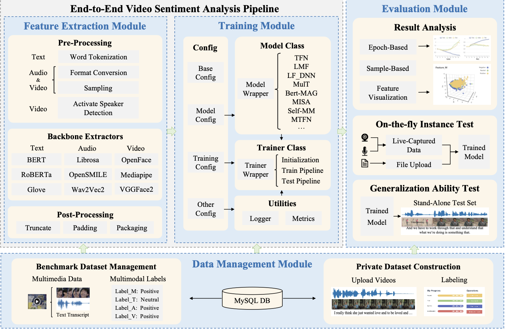
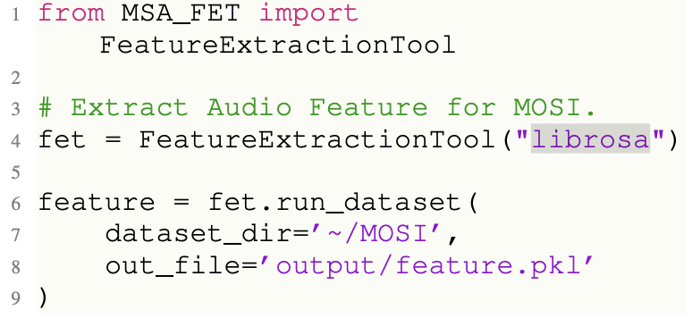
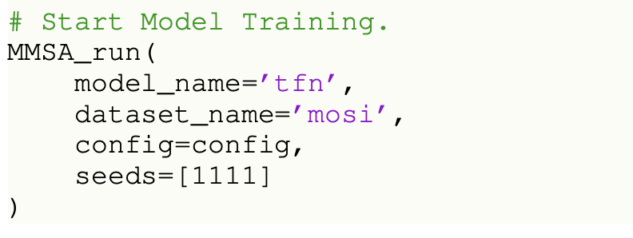
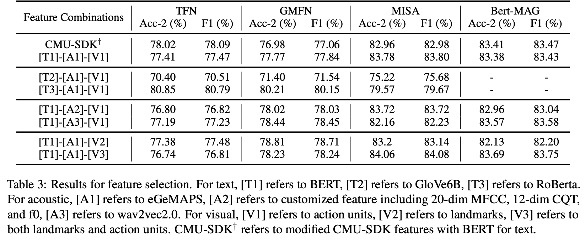
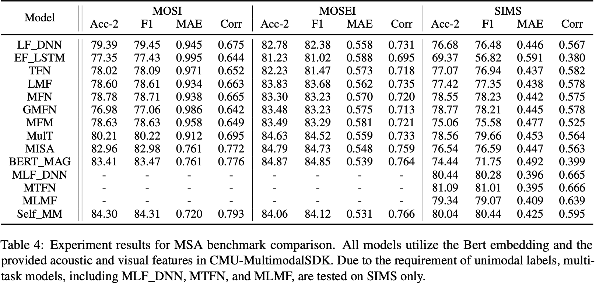
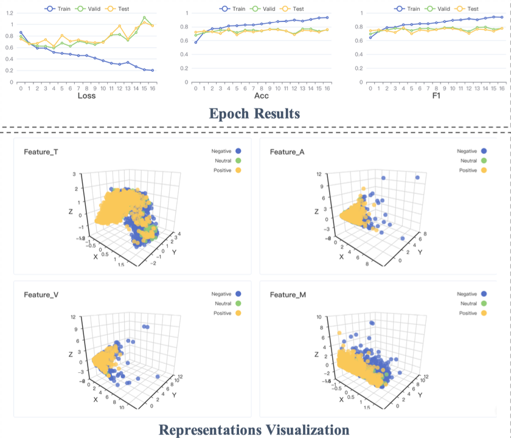
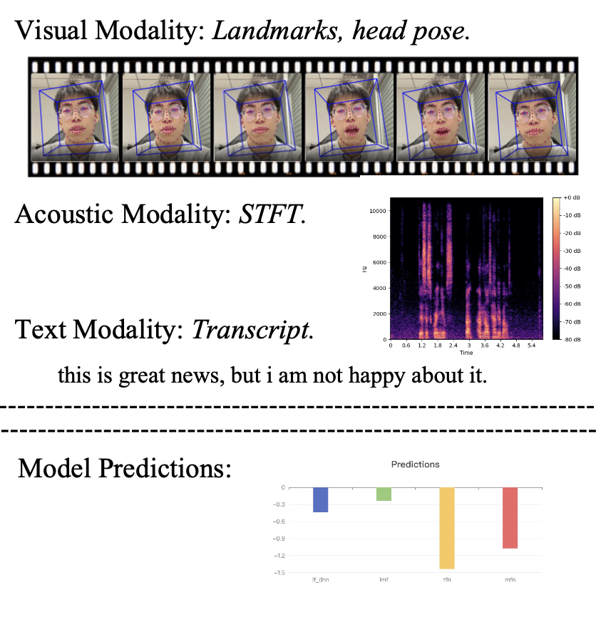
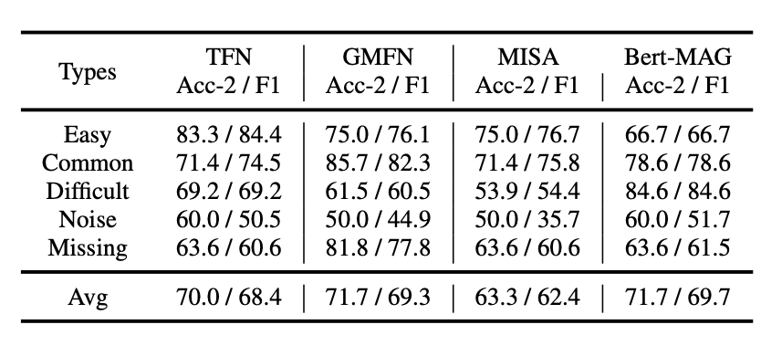

---
title:  "[CVPR 2022] M-SENA: An Integrated Platform for Multimodal Sentiment Analysis"
permalink: M_SENA_An_Integrated_Platform_for_Multimodal_Sentiment_Analysis.html
tags: [reviews]
use_math: true
usemathjax: true
---

# [ACL 2022] M-SENA: An Integrated Platform for Multimodal Sentiment Analysis

# 1. Introduction
최근 통신 매체와 영상 관련 플랫폼의 발달로 user-generated 온라인 콘텐츠(예 : 인스타그램, 유튜브 등)의 수가 폭발적으로 증가하였다. 이에 따라 사용자 수도 꾸준히 증가하고 있으며 해당 플랫폼에 업로드되는 영상들의 파급력 또한 커지게 되었다. 이 영상들의 정보와 반응을 학술적 혹은 상업적으로 활용하기 위해 영상에 포함된 다양한 정보들을 추출 및 조합하여 감성을 분석하는 Multimodal Sentiment Analysis (이하 MSA) 연구가 활발하게 진행되고 있다. 그러나 연구를 통해 MSA 성능에 많은 향상이 있었지만 여전히 보완해야할 부분이 많이 남아있다.

본 논문에서는 크게 두 가지 challenge에 대해서 소개하고 있다.
### 1. 효과적인 음향 및 시각 정보 추출과 모델 간의 공정한 비교
이전에는 멀티모달 분석을 위해 카네기멜론 대학교 연구자들이 개발한 CMU-MultimodalSDK 키트로 연구를 시도하였다. 하지만 영상의 실제 정보와 완전히 일치하는 음향 및 시각 정보를 추출하는 것은 feature selection과 backbone selection의 모호함 때문에 거의 불가능에 가깝다. 게다가 최근 감성 분류 연구에서는 음향, 시각 정보보다 텍스트 정보가 압도적인 영향력을 가지고 있어 음향 및 시각 정보를 효과적으로 추출하고 활용하기 위한 연구가 주목 받게 되었다. 이에 따라 연구자들은 음향 및 시각에 대해서 주어진 정보가 아닌 Customized modality를 활용하여 모델을 구축하는 것을 시도하고 있다. 하지만 각자 다른 modality feature들을 활용한 모델들의 성능과 fusion method를 비교하는 것은 공정하지 못하기 때문에 이를 공정하게 비교할 수 있는 방법이 필요하다.
### 2. 기존 MSA 모델을 실제 시나리오에 적용할 때 종합적인 모델 평가 및 분석 접근법의 부재
주어진 test dataset에 대해 뛰어난 성능을 보인 모델도 실제 시나리오에서는 distribution discrepancy나 random modality perturbations로 인해 제대로된 성능을 내지 못하게 된다. 또한, 연구자들이 개선 사항을 설명하고 모델을 수정하는 데에는 다양한 상황을 포함한 효과적인 모델 분석 방법이 필요하다.

이 두 가지를 해결하기 위해 본 논문에서는 The **M**ultimodal **SEN**timent **A**nalysis platform(이하 **M-SENA**)를 제시한다. **M-SENA**는 다음과 같은 기능을 제공한다.
* 음향 및 시각 정보 추출을 위해 Librosa, OpenSmile, OpenFace, MediaPipe을 통합하였고 맞춤화된 특성 추출 제공.
* 모듈화된 MSA 파이프라인을 통해, 다양한 모달리티와 fusion method를 포함한 모델 간의 공정한 비교 가능.
* 연구자들이 MSA 모델들을 평가하고 분석할 수 있도록 중간 결과 시각화, 실시간 시연, 일반화 성능 분석 툴 제공

# 2. Platform Architecture

M-SENA 플랫폼은 데이터 관리, 특성 추출, 모델 학습 그리고 결과 분석, 총 4개의 모듈을 제공한다.

### 2.1 데이터 관리 모듈
잘 알려진 MSA 벤치마크 데이터셋(CMU-MOSI, CMU-MOSEI, CH-SIMS)에 대해 로컬 환경에 다운로드하지 않고도 raw video 파일들을 볼 수 있도록 하였다. 또한 연구자들이 자신만의 데이터셋을 구축할 수 있는 그래픽 인터페이스를 제공하였다.
### 2.2 특성 추출 모듈
음향(acoutstic), 시각(visual), 문자(text)의 특성 추출을 용이하게 하기 위해 여러 특성 추출 툴을 통합하여 API를 제공한다. 각 특성에 대해서 다음과 같은 툴을 지원한다.

| 음향특성        | 시각특성           | 문자특성  |
| ------------- |:-------------:| -----:|
| ComParE_2016  | Facial Landmarks | GloVe6B |
| eGeMAPS       | Eyes Gaze      |   BERT |
| wav2vec2.0 등 | Action Unit 등      |  RoBerta 등 |
아래 코드는 해당 논문에서 제시하는 MMSA Python API를 활용해 MOSI 데이터셋에서 librosa 툴로 음향 특성을 추출하고 pickle 파일에 저장하는 예시이다.

### 2.3 모델 학습 모듈
M-SENA 플랫폼에서는 여러 연구자들을 통해 제안된 총 18개의 학습 모델(본 논문에서는 14개였으나 업데이트를 통해 추가되었음.)을 API 형식으로 제공한다. 또한 모델 학습도 특성 추출과 마찬가지로 다음과 같이 간단한 코드로 학습을 진행할 수 있다.

모델 리스트 : TFN, EF_LSTM, LF_DNN, LMF, MFN, Graph-MFN, MulT, MFM, MLF_DNN, MTFN, MLMF, SELF_MM, BERT-MAG, MISA, MMIM, BBFN(Work in Progress), CENET, TETFN.

### 2.4 결과 분석 모듈
1.  중간 결과 시각화 : M-SENA 플랫폼은 최종 멀티모달 fusion 결과를 기록하고 PCA를 적용한 뒤 각 특성에 대해 출력하여 다른 fusion method들에 관한 평가를 할 수 있도록 한다.
2. 실시간 시연 : 실시간 시연을 통해 연구자들이 선택된 모델의 effectiveness와 robustness를 평가할 수 있게 한다.
3. 일반화 성능 분석 : 제공되는 벤치마크 MSA 데이터셋이 아닌 실제 시나리오는 더욱 복잡하기 때문에 Noise나 Missing에 대해서 robust해야 한다. 이를 위해 M-SENA 플랫폼에서는 아래 표와 같이 다양한 시나리오와 유형을 포함하는 데이터를 제공하여 robustness를 평가할 수 있게 하였다.

(en : English, ch : Chinese)
# 3. Experiment
### 3.1 모달리티 특성 추출 조합에 따른 모델 성능 비교

위 표는 플랫폼을 활용하여 다양한 특성 조합에 대해 각 모델별 성능을 나타낸 것이다. 위 결과에 따르면 Bert-MAG 모델의 경우, 문자 특성에 대해 오직 Bert로만 수행되기 때문에 T2, T3에 대해서는 성능 측정이 불가능했고 T1을 기준으로 A1과 V3를 조합했을 때 성능이 가장 잘 나왔다. TFN과 GMFN 모델에서는Roberta(T3)를 사용했을 때 성능이 가장 좋았고 MISA 모델은 T1(Bert)를 사용했을 때 성능이 가장 좋았다. 결과적으로 CMU-MultimodalSDK를 그대로 사용했을 때보다는 각 모델에 맞는 특성 조합을 찾아내 사용하는 것이 중요하다고 할 수 있다.
### 3.2 모델과 데이터셋에 따른 성능 비교

위 표는 동일한 특성 조합(Bert와 CMU-Multimodal SDK)을 활용해 모델과 벤치마크 데이터셋을 기준으로 정확도, F1-Score, MAE, Corr를 나타낸 것이다. MLF_DNN, MTFN, MLMF의 경우 단일 모달에 대해서도 라벨을 필요로 하기 때문에 MOSI와 MOSEI 벤치마크 데이터셋에 대해서는 성능 평가를 하지 못하였다.

MISA와 BERT_MAG 모델이 MOSI와 MOSEI 데이터셋에 대해 전체적으로 좋은 성능을 보였으나 SIMS 데이터셋에는 성능이 다소 떨어지는 모습을 보였다. 또한 SIMS 데이터셋에 대해서는 본 논문의 저자가 과거에 제안한 MLF_DNN, MTFN, MLMF, Self_MM 모델이 좋은 성능을 보였으며 특히 Self_MM 모델의 경우 MOSI, MOSEI 데이터셋에 대해서도 좋은 성능을 보였다.

# 4. Model Anaysis Demonstration
### 4.1 중간 결과 분석
중간 결과 분석 모듈은 훈련 과정을 모니터링하고 시각화하기 위해 설계되었다. 아래 그림은 MOSI 데이터셋을 TFN 모델에 학습시키고 중간 결과 분석 모듈을 활용하여 결과를 시각화한 것이다.

Epoch Result에서는 Epoch마다 Train, Valid, Test 데이터셋에 대해 Loss, 정확도, F1-score를 그려준다. 또한 각 단계에서 학습된 멀티모달 fusion 결과와 단일 모달에 대한 결과를 3D로 표현해주면서 사용자가 멀티모달 특성 표현과 fusion 과정에 대해 직관적으로 파악할 수 있게 하였다.
### 4.2 실시간 시연
실시간 시연 모듈은 사용자가 원하는 영상 객체를 업로드하면 아래 그림처럼 해당 영상의 시각, 음향, 문자 특성 정보를 시각적으로 제공하고 그에 따른 모델의 예측(감성 점수)을 막대 그래프로 나타내 준다. 이를 통해 사용자는 각 모달의 인식 및 추출과 예측이 잘 이루어지고 있는 지 직관적으로 확인할 수 있다.

### 4.3 일반화 성능 분석
일반화 성능 분석 모듈에서는 데이터셋 유형에 따른 모델의 성능 차이를 쉽게 파악할 수 있도록 한다. 예를 들어 아래 그림은 MOSI 데이터셋에 대해 T1-A1-V3 특성 조합으로 학습된 4개의 모델들이 있고 이를 5가지 유형의 데이터셋으로 테스트 후 그 결과를 표로 나타낸 것이다.

위 표를 보면 Easy와 Common 유형의 데이터셋에 비해 Noise나 Difficult 유형의 데이터셋에서 성능이 현저히 떨어지는 것을 확인할 수 있으며 특히 Noise가 있는 데이터셋의 경우 Missing이 있는 데이터셋보다 전체적으로 더 낮은 수치를 보였으므로 real-world에 적용을 위해서는 실제 시나리오에서 발생하는 Noise에 대해 Robust한 모델을 구축하는 것이 중요하다고 할 수 있다.
# 5. Conclusion
본 논문에서는 멀티모달 감성 분석 연구자들을 위해 데이터 관리, 특징 추출, 모델 훈련, 그리고 모델 분석에 대한 단계별 모듈을 포함한 통합 플랫폼인 M-SENA를 소개한다. 특히 여러 멀티모달 감성 분석 모델들을 end-to-end 방식으로 평가하고 특성 조합과 데이터셋에 따른 모델 성능의 차이를 제시하면서 향후 연구자들이 특정 모델을 활용할 때 이를 참고할 수 있게 하였다. 그리고 모델 뿐만 아니라 입력을 위한 영상 특성 추출 과정을 단순한 함수 형태로 두어 코딩에 익숙하지 않은 연구자들도 개인 데이터셋을 쉽게 활용할 수 있도록 하였으며 중간 결과 분석, 실시간 시연, 일반화 성능 분석 모듈을 제공하여 개인 데이터셋에 대한 학습 과정 및 성능을 직관적으로 파악할 수 있게 하였다.
# 6. Reference
Paper : [https://aclanthology.org/2022.acl-demo.20.pdf](https://aclanthology.org/2022.acl-demo.20.pdf)
Code : [https://github.com/thuiar/M-SENA](https://github.com/thuiar/M-SENA), [https://github.com/thuiar/MMSA-FET](https://github.com/thuiar/MMSA-FET)
