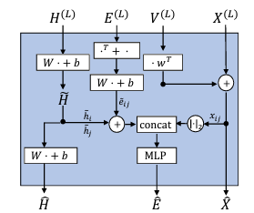
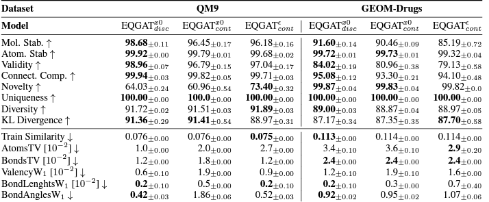
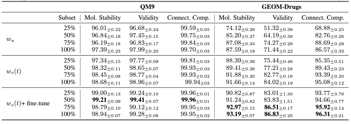
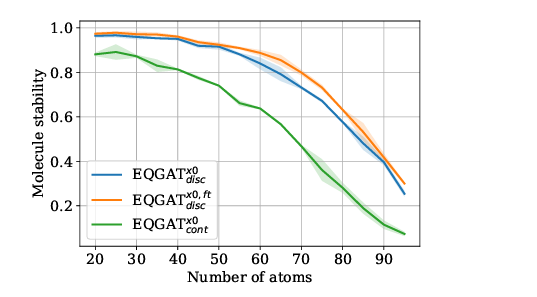
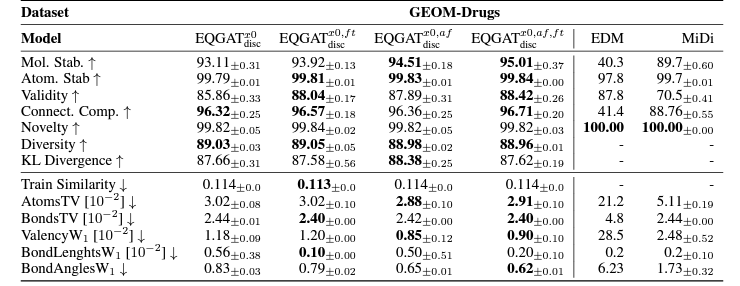

### Title
NAVIGATING THE DESIGN SPACE OF EQUIVARIANT DIFFUSION-BASED GENERATIVE MODELS FOR DE NOVO 3D MOLECULE GENERATION

### 1. Motivation
2020년 DDPM [2] 이 발표된 이후 diffusion 기반의 생성 모델들은 다양한 domain 에서 복잡한 data 분포를 학습하는 것에 큰 성공을 거두었다. 
이러한 연구들에 힘입어 diffusion 을 기반으로한 de novo 세팅에서의 3차원 분자 생성 연구 또한 여럿 발표되었다. 
이때 de novo 세팅이란 어떠한 분자의 정보가 제공되지 않은 상태에서 아래의 정보들을 생성하여 3차원 분자 구조를 정의하는 것이다. 
- 해당 분자를 이루는 원자 구성
- 각 원자들의 3차원 공간 좌표
- 원자 결합들의 topological 정보

그러나 기존의 연구들은 이러한 복잡한 화학적 정보들의 결여로 인해 원자 갯수가 20개가 넘어가는 대형 분자 구조들의 생성에 실패한다. 
또한 분자 data 의 부족으로 인해 그것들은 특정 data 에 대해서만 학습됨으로써 보편성이 결여된다는 약점을 띈다. 

해당 논문은 아래의 contribution 들을 통해 de novo 세팅에서의 보다 정확한 3차원 분자 구조 생성 모델인 EQGAT-diff 를 제안한다. 
- E(3)-equivariant diffusion model 을 통해 E(3)-equiavariant 한 분자들의 복잡한 공간 구조를 학습한다.
- 비교실험을 통해 해당 task 에서 최적의 모델 설계 방법론을 제안한다.
- PubChem3D dataset 을 토대로 학습된 pre-trained 모델을 제안하고 이것이 다른 dataset 에서 간단한 fine-tuning 만으로도 좋은 성능이 나오는 것을 보인다.

### 2. Preliminaries
**Molecule generation** 
De novo molecule generation task 는 여타 생성 모델과 마찬가지로 정의된 prior 에서 vector 를 추출하여 일련의 과정을 거쳐 새로운 분자를 생성하는 것이다. 
아래 그림은 GAN 을 통한 molecule generation 을 목표하는 MolGAN [1] 의 outline 을 도식화한 것이다. 
 
<!--   -->
생성한 분자 구조는 그래프의 형태인 $\mathcal{G} = (\mathcal{V}, \mathcal{E})$ 로 표현되며, 각 node 는 원자를, edge 는 결합을 나타낸다. 
이때 최종 분자의 novelty (i.e. train dataset 에 존재하지 않는가) 와 validity (i.e. 존재할 수 있는 분자인가) 도 중요하지만, 
목표한 화학적 특성을 갖추는 것 또한 필수적이다. 
이를 위해 모델을 현실에 존재하는 모든 분자들로 학습하는 것이 아닌, 목표하는 화학적 특징마다 개별적으로 dataset 을 구성하여 제한적인 범위의 생성 모델을 차용한다. 

**E(3)-Equivariance** 
어떠한 물체가 3차원 공간 상에서 존재하면 그것이 이동, 회전, 반전될 수 있으며, 각 변환에 따라 물체의 좌표는 달라진다. 
이때 E(3)-Equivariant 한 함수 f 란 아래의 식을 만족하는 함수로, 
$\mathcal{f(XQ + t)} = \mathcal{f(X)Q + t}$ 
3차원 vector X 가 어떠한 변환을 거치고 함수 f 를 적용하는 결과와 f 를 적용하고 변환을 거친 결과가 일치하는 함수임을 뜻한다. 
해당 논문은 최근 Geometric deep learning [3] 의 발전에 힘입어 원자들의 3차원 좌표를 생성하는 과정에서 이러한 E(3)-Equivariance 에 주목하여 모델을 설계한다. 

**DDPM and D3PM** 
 
<!--   -->
DDPM 은 생성 모델 방법론 중의 하나로, 알려지지 않은 data distribution $\mathcal{p(X_ {0})}$ 에 Markov process 형태의 점진적인 noise 를 가하여 
predefined distribution $\mathcal{p(X_ {T})}$ 으로 변환하고, 그것의 역과정을 학습하여 prior 에서의 sample 을 통해 새로운 data sample 을 생성한다. 
이때 t-1 timestep 에서 t 번째 timestep 으로 noise 를 가하는 가하는 forward process $\mathcal{q(X_ {t} \vert X_ {t-1})}$ 와 
t 번째 timestep 에서 t-1 번째 timestep 으로 noise 를 제거하는 reverse process $\mathcal{p_ {\theta}(X_ {t-1} \vert X_ {t})}$ 모두 Gaussian distribution 으로 정의한다. 
또한 모든 단계에서의 variable $\mathcal{X_ {t}}$ 들은 연속적인 값을 갖는다. 

 
<!--   -->
D3PM [4] 는 DDPM 의 성공에 힘입어 그것을 이산적인 값을 띄는 variable 을 생성하도록 변형한 생성 모델이다. 
예컨대 어떠한 이미지의 각 pixel 의 값을 0 ~ 255 까지의 정수들로 표현하고 그것이 다른 정수값으로 변하게 함으로써 noise 를 가할 수 있다. 
D3PM 은 이러한 discrete space 상에서의 state 들을 one-hot encoded vector 로 표현하고, Gaussian noise 대신 Uniform/Absorbing state/Discretized Gaussian 등의 noise 를 
정의하여 forward process $\mathcal{q(X_ {t} \vert X_ {t-1})}$ 와 reverse process $\mathcal{p_ {\theta}(X_ {t-1} \vert X_ {t})}$ 를 표현한다. 

**Parameterizations** 
DDPM 의 저자들은 loss 를 계산할 수 있는 두 가지 방법론을 제안하는데, 그것은 학습된 neural network 가 무엇을 예측하는 지에 따라 구분된다. 
첫 번째는 neural network 가 t 번째 timestep 의 noised data $\mathcal{X_ {t}}$ 을 reverse process 를 통해 denoising 된 $\mathcal{\tilde{X_ {0}}}$ 자체를 예측하는 $\mathcal{x_ {0} }$-parameterization 이다. 
두 번째는 DDPM 의 저자들이 실질적으로 활용한 방법인 $\epsilon$-parameterization 으로, reparameterization trick $\mathcal{x = \mu + \sigma \cdot \epsilon}$ 을 활용하여 
reverse process 를 통해 neural network 가 $\mathcal{X_ {t}}$ 에 적용된 noise 를 예측하는 방법론이다. 

### 3. Proposed model
 
<!--   -->
EQGAT-diff 모델은 diffusion 기반의 생성 모델을 통해 앞서 설명한 값들을 생성하여 분자를 표현하는데, 이때 학습되는 reverse process approximator 의 backbone model 로 
저자들이 이전에 발표한 E(3)-Equivariant 한 Graph Attention Network 인 EQGAT [5] 를 활용한다. 
이를 통해 message function $\mathcal{m}$ 은 2-layer MLP 표현되고, 원자들의 위치 정보를 담는 $\mathcal{X}$, 분자를 구성하는 원자 및 결합 정보 $\mathcal{H}$, $\mathcal{E}$ 를 다음과 같이 계산하여 반환한다. 
 
<!--   -->
 
<!--   -->

또한 다른 diffusion model 사이에서 널리 활용되는 weighting coefficient 를 적용하여 KL divergence 의 loss term 은 아래와 같으며, 
<!--   -->
 
Weighting 으로 $\mathcal{w_ {u} = 1}$, $\mathcal{w_ {t}}$ = min(0.05, max(1.5, SNR(t))) 를 활용한다. 

### 4. Experiments
**최적의 모델 설계 방법론 탐색** 
현재 de novo 3d molecule generation task 에서 SOTA 성능을 보이는 MiDi [7] 모델을 EDM [6] 과는 달리 아래의 변화가 존재한다. 
- $\mathcal{x_ {0} }$-parameterization 의 활용
- 연속적인 state 가 아닌 이산적인 state 을 통한 분자 정보 표현
- 별도의 화학 정보의 추가 활용

저자들은 이들 중 어떠한 변화가 가장 큰 영향이 주었는지 규명하기 위해 EQGAT-diff 에 조건을 변화시켜 QM9 과 GEOM-Drugs dataset 에 대해 성능 평가를 진행하였다. 
 
<!--   -->
여러 지표를 분석한 결과 저자들은 categorical diffusion 을 적용한 discrete state-space 와 $\mathcal{x_ {0} }$-parameterization 을 활용하는 것이 가장 높은 성능이 나온 것을 통해 
해당 방법론을 적용하는 것이 바람직할 것이라고 주장한다. 

**Pre-trained model** 
앞서 말했듯이 molecule generation task 에선 dataset 의 부족으로 인해 특정 화학적 특성을 띄는 분자들을 생성하기 위해선 별개의 모델을 새롭게 학습해야 한다는 어려움이 있다. 
하지만 해당 논문은 매번 새롭게 모델을 학습하는 것이 하닌, general 한 pre-trained 모델을 각 활용처에 맞게 별도의 fine-tuning 을 진행하는 것만으로 충분함을 실험적으로 보임으로써 
EQGAT-diff 의 실용적인 우수성을 보인다. 
이때 범용적인 분자 정보를 학습하기 위해 9570 만개의 비교적 간단한 분자들로 구성된 PubChem3D dataset 을 사용하여 pre-training 을 진행하고, 
QM9 와 GEOM-Drugs 를 각각 25%, 50%, 75%, 100% 활용하여 성능 평가를 분석하여 pre-training 의 효과를 제시하였다. 
 
<!--   -->

또한 pre-trained model 이 적은 양의 fine-tuning 만으로 괜찮은 성능이 나오는 것을 보이기 위해 아래의 실험들을 제시하였다. 
이것을 통해 training dataset 의 25% 만을 활용해도 높은 성능이 나오는 것을 확인할 수 있으며, 원자의 갯수가 많은 복잡한 경우에 대해서도 이것이 유지됨을 보여주었다. 
 
<!--   -->
 
<!--   -->

**Comparisons with other models** 
해당 논문은 baseline 으로 de novo 3D molecule generation 에서 EDM [6] 과 SOTA 성능을 보이는 모델인 MiDi [7] 를 제시하여 GEOM-Drugs dataset 을 활용해 성능 평가를 진행한다. 
GEOM-Drugs dataset 은 45만 개의 복잡한 분자들로 구성된 dataset 으로, 각 분자들의 구조와 화학적 특성 또한 담고 있어 해당 task 에서 널리 활용된다. 
이때 EQGAT-diff 는 앞서 설명한 다양한 variation 들을 모두 포함하여 실험하고, 대부분의 지표에서 모두 SOTA 성능을 기록하였다. 
또한, 분자들의 입체 구조 정보가 얼마나 잘 표현되는지 평가하는 지표들인 AtomsTV, BondsTV, BondAngles 등의 지표에서 큰 격차의 성능 향상이 발생한 것을 통해 E(3)-Equivariance 가 
실제로 물리, 화학적 현상을 반영한 분자의 구조에 필수적임을 확인할 수 있다. 
 
<!--   -->

마지막으로 아래는 EQGAT-diff 를 통해 prior 에서부터 점진적으로 noise 를 제거하여 생성한 3차원 분자 구조들을 그린 것이다 
 
<!--   -->

### 5. Conclusion
해당 논문은 새로운 방법론을 통해 기존 연구들의 한계점을 극복하기보단, 다양한 연구들의 방법론을 차용 및 조합하여 보다 정확한 de novo molecule generation framework 를 제안한다. 
이는 단순한 분자 구성뿐만 아니라 분자들의 3차원 geometry, topology 등을 동시에 생성함으로써 실제의 분자를 표현할 수 있다. 
또한 다양한 비교실험을 진행하여 해당 task 에서 적합한 모델 설계 방법론을 탐색하여 이후의 연구들이 나아가야 할 방향을 제시하였다는 의의를 갖는다. 
마지막으로 저자들은 PubChem3D dataset 으로 pre-trained 된 모델을 제안함으로써 실용적인 면에서도 기여하였다. 

### 6. Code and References
**Code** 
https://github.com/tuanle618/eqgat-diff.git 

**References** 
[1] De Cao, Nicola, and Thomas Kipf. "MolGAN: An implicit generative model for small molecular graphs." arXiv preprint arXiv:1805.11973 (2018). 
[2] Ho, Jonathan, Ajay Jain, and Pieter Abbeel. "Denoising diffusion probabilistic models." Advances in neural information processing systems 33 (2020): 6840-6851. 
[3] Bronstein, Michael M., et al. "Geometric deep learning: Grids, groups, graphs, geodesics, and gauges." arXiv preprint arXiv:2104.13478 (2021). 
[4] Austin, Jacob, et al. "Structured denoising diffusion models in discrete state-spaces." Advances in Neural Information Processing Systems 34 (2021): 17981-17993. 
[5] Le, Tuan, Frank Noe, and Djork-Arné Clevert. "Representation learning on biomolecular structures using equivariant graph attention." Learning on Graphs Conference. PMLR, 2022. 
[6] Hoogeboom, Emiel, et al. "Equivariant diffusion for molecule generation in 3d." International conference on machine learning. PMLR, 2022. 
[7] Vignac, Clement, et al. "Midi: Mixed graph and 3d denoising diffusion for molecule generation." Joint European Conference on Machine Learning and Knowledge Discovery in Databases. Cham: Springer Nature Switzerland, 2023. 