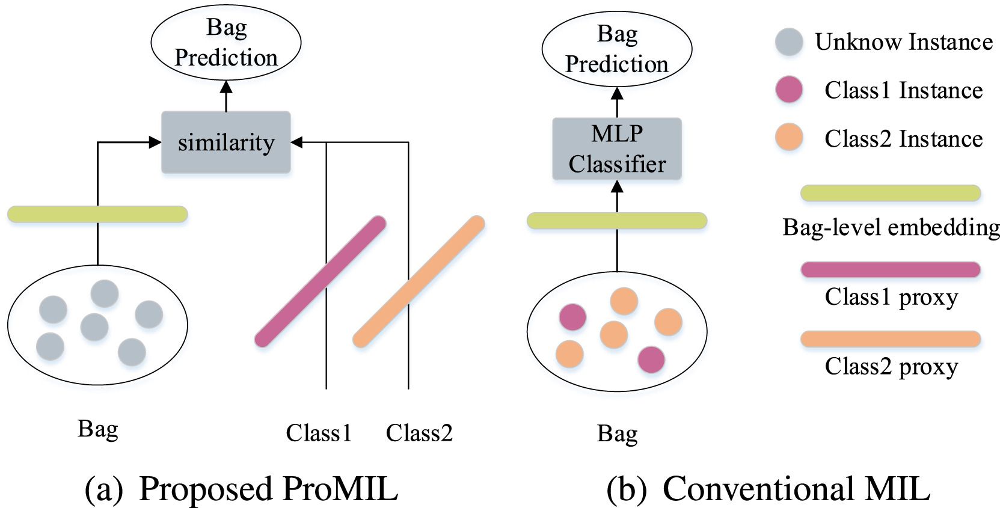
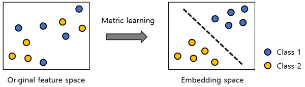
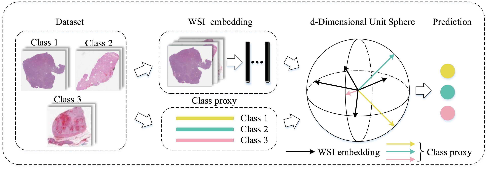
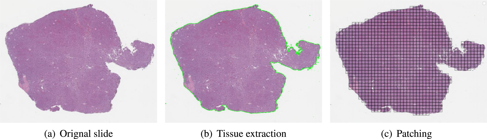
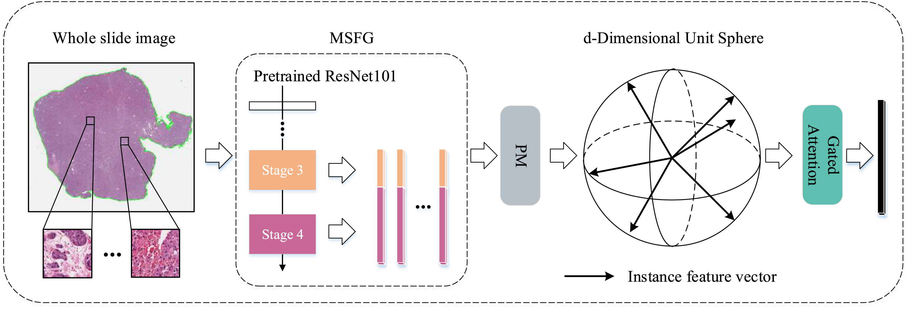
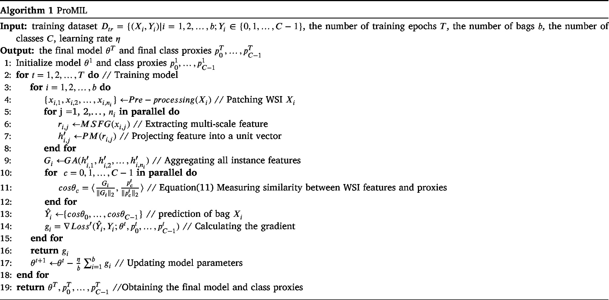
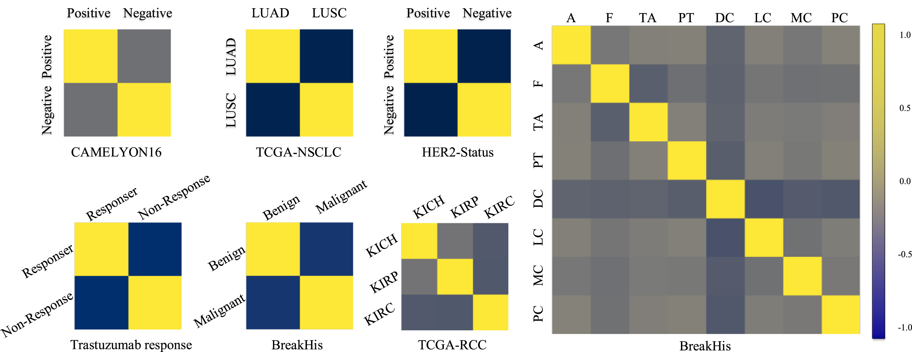
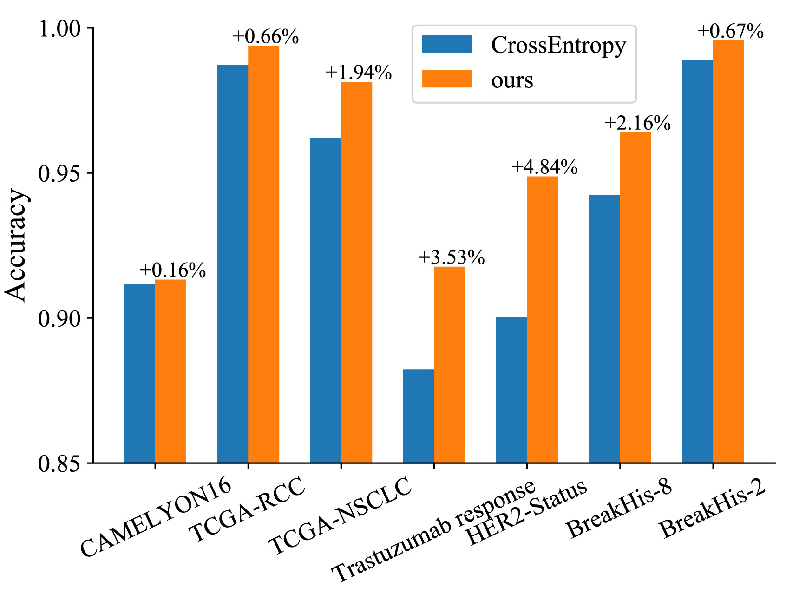
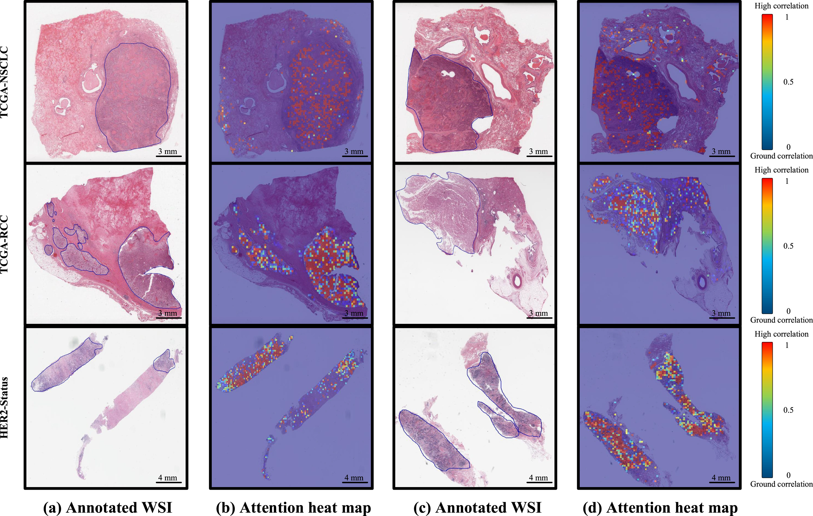

# Bag level label 예측을 위한 새로운 방법론에 대하여

## 1. Problem Definition
&emsp;WSI(Whole Slide Image)는 질병 진단, 병리학 연구 등에서 조직의 시각화에 주로 사용되는 giga pixel 단위의 이미지이다. 해당 이미지를 모델이 학습하여 다양한 예측을 수행하기 위해서는 WSI를 작은 patch들로 나누는 patching 과정이 필요하다. 또한, 병리학자들에 의한 localized annoation이 필요하나, 이는 많은 시간과 비용을 소모한다. 따라서, patch level에서의 lable 없이 Slide(WSI) 단위의 label 만을 활용하여 WSI의 범주를 분류하는 weakly supervised learning의 필요성이 부각된다. 본 논문은 class proxy를 활용하여 WSI에 대한 weakly supervised learning을 보다 효과적으로 수행하는 방안을 제시한다.

## 2. Motivation
&emsp;Multiple Instance Learning(MIL)은 WSI와 같은 고해상도 이미지를 처리하는데 효과적인 모델이다. 해당 모델은 feature extractor, aggregator, classifier로 이루어져 작은 patch들로부터 feature를 추출하여 이를 기반으로 embedding을 수행하고, WSI의 범주를 분류할 수 있다. 그러나, 기존 conventional MIL은 1장에서 언급한 바와 같이 patch level label을 필요로 하며, 범주 불균형 문제를 해결하는데 어려움을 지닌다. 이러한 문제를 해결하기 위하여 다양한 시도가 이루어졌으나, 다음과 같은 한계점을 지닌다.   

[DS-MIL(CVPR 2021)](https://arxiv.org/abs/2011.08939): Dual stream을 도입하여 중요한 patch를 중심으로 prediction은 수행한다. 1st stream은 max-pooling을 활용하여 informative patch를 식별하며, 2nd stream은 각 patch에 대한 attention score를 계산하여 prediction을 수행한다. 그러나, DS-MIL은 spatial feature를 반영하지 못한다는 한계점을 지닌다.   

[DTFD-MIL(CVPR 2022)](https://arxiv.org/abs/2203.12081): WSI level에서의 정보만 존재할 뿐, patch level의 정보는 존재하지 않기에, pseudo-bag을 도입하여 # of bag를 늘리고, 결과적으로 동일한 데이터로부터 보다 많은 정보를 얻고자 시도한다. T1 단계에서 각 pseudo-bag의 representation을 예측하고, T2 단계에서는 T1 단계에서의 정보를 반영하여 WSI level의 prediction을 수행한다. 그러나, DTFD-MIL은 pseudo-bag의 수를 실험적으로 결정해야 하며, label noise에 민감하다는 한계점을 지닌다.   

## 3. Method
&emsp;기존의 conventional MIL과 DS-MIL, DTFD-MIL 등을 보완하여 본 논문에서 제시하는 ProMIL은 patch level의 annotation 없이 class proxy를 통해 각 범주의 특성을 가장 잘 나타내는 representative한 vector를 찾고, 이를 활용하여 WSI의 class label을 예측하는 weakly supervised learning + metric learning 방법을 사용한다. Fig.1은 기존의 방법론과 ProMIL의 구조적인 차이를 간략하게 표현한다.   

  
   
  <em>Fig.1. Illustration of the difference between ProMIL and conventional MIL models</em>

### 3.1 Metric Learning
&emsp;Weakly supervised learning과는 달리 필자에게 metric learning은 다소 생소한 관계로 본 논문을 이해하기 위해서 metric learning에 대해 간략히 다루고자 한다. 기존의 feature로는 분류가 쉽지 않았던 데이터에 대해 데이터를 class label 별로 잘 구분할 수 있게 만드는 metric을 학습하는 과정을 의미한다. Fig.2는 이러한 관점에서 metric learning의 목적을 시각적으로 나타낸다.   

  
   
  <em>Fig.2. Illustration of purpose for metric learning</em>

&emsp;기존의 classification task와는 다르게 metric learning은 특히 imbalance dataset에서 높은 성능을 보인다. 분류 문제는 "$x$는 $y$이다."라는 정보를 바탕으로 학습을 수행하는 반면, metric learning은 "$x_1$은 $x_2$와는 가깝고, $x_3$와는 멀다."라는 정보를 바탕으로 하기에 보다 sparse한 label에 대해서도 다른 class label로부터 멀리 떨어지게끔 학습을 수행할 수 있기 때문이다. 즉, 같은 class끼리는 가깝게, 다른 class끼리는 멀게라는 소기 목적의 절반은 달성한 셈이다.

&emsp;Metric learning을 통해 학습된 새로운 거리 함수는 일반적으로 embedding function $𝑓: ℝ^𝑟→ℝ^𝑚$를 통해 변환된 새로운 데이터 표현에 대한 Euclidean distance로 정의된다. 예를 들어, metric learning을 통해 학습된 거리 함수를 𝑓(𝑥;𝜃)라고 할 때, 두 데이터 $𝒙_𝟏$과 $𝒙_2$에 대한 새로운 거리 함수 $d(𝒙_𝟏, 𝒙_2)$는 아래와 같이 정의된다. 따라서, metric learning 문제의 목적은 데이터를 각 목표값에 따라 잘 구분되도록 변환하는 embedding 함수 𝑓를 학습하는 것이 된다. 이떄, 𝑓가 단순한 선형 변환이 아니라, deep neural network일 경우에 앞에 deep을 붙여 deep metric learning이라고 한다. 

$d(𝒙_𝟏, 𝒙_2)=\vert\vert f(𝒙_𝟏)-f(𝒙_2)\vert\vert^2_2$

&emsp;Deep metric learning에는 contrastive loss, triplet loss 등 다양한 loss function에 기반한 방법이 있지만, 이는 sampling, calculation issue를 지니므로 본 논문에서는 class proxy, 즉 각 클래스를 가장 잘 대표하는 vector를 찾기 위한  NCA loss를 사용하였음을 밝힌다. 이때, NCA loss는 sample vector와 proxy vector를 최대한 가깝게 만드는데 목적을 두며, 모든 sample set $Z$와 sample vector $x$, proxy vector $y$에 대해서 아래와 같이 정의된다.   

$L_{NCA}(x, y, Z) = -\log \left( \frac{\exp(-d(x, y))}{\sum_{z \in Z} \exp(-d(x, z))} \right)$

### 3.2 Overall Framework
&emsp;ProMIL 모델의 overall framework는 Fig.3.에 제시된다. Patching(preprocessing) 과정을 거친 WSI 데이터에 대하여 해당 모델의 주요 workflow는 2개 분기를 포함한다. 상위 분기에서는 각 WSI embedding 과정을, 하위 분기에서는 class proxy 학습 과정을 거치며, 결과적으로, embedding vector와 proxy vector 사이의 유사도를 기반으로 NCA loss function을 활용하여 모델 파라미터와 class proxy가 업데이트된다.   

  
   
  <em>Fig.3. Illustration of ProMIL's overall framework</em>

### 3.3 Preprocessing
&emsp;WSI에는 training과 inference에 의미없는 background area가 존재한다. 따라서, RGB로부터 HSV color space로 변환된 이미지의 포화도 값과 임계값을 비교하여 조직 영역의 binary mask를 생성한다. 이후, blurring과 morphological closing을 통해 tissue extraction을 수행한다. 그러나, 추출된 조직 영역 또한 컴퓨터가 처리하기에 매우 크기에 직접 훈련에 사용할 수 없어 patch로 분할하는 과정이 필요하다. 본 논문에서는 WSI를 224x224 크기의 일련의 패치로 자른다. 그 결과, Fig.4.의 (c)와 같은 Patching을 완료한 tissue region을 얻을 수 있다.

  
   
  <em>Fig.4. Illustration of preprocessing WSI</em>

### 3.4 WSI Embedding
&emsp;앞서 3.3장의 preprocessing을 마친 WSI는 multi-scale feature generator (MSFG)에 의해 개체별로 representation matrix $R$이 생성된다. 예를 들어, $i$번째 WSI의 $j$번째 patch $x_{i,j}$는 pretrained ResNet101의 stage3 ($S_3$) & stage4 ($S_4$)를 거쳐 각자 다른 크기의 차원 $l_3, l_4$를 지니는 features $s_{i,j}^3, s_{i,j}^4$가 추출된다.   
$$
s_{i,j}^3=S_3(x_{i,j}), s_{i,j}^4=S_4(x_{i,j})
$$   
$$
s_{i,j}^3 \in \mathbb{R}^{1 \times l_3}, s_{i,j}^4 \in \mathbb{R}^{1 \times l_4}
$$

&emsp;$$s^3_{i,j},s^4_{i,j}$$ 는 concatenate되어 $i$th WSI's $j$th patch $x_{i,j}$에 대한 representation vector $r_{i,j}$가 생성되고 $i$th WSI에 대하여 $n_i$개의 patch representation vector를 토대로 representation matrix $R_i$ 가 생성된다. 이때 $z$는 concat feature의 차원을 의미한다.
$$
r_{i,j}=concat([s^3_{i,j},s^4_{i,j}]), \quad r_{i,j} \in \mathbb{R}^{1 \times z}
$$   
$$
R_i = \{ r_{i,1}, r_{i,2}, \ldots, r_{i,n_i} \}, \quad R_i \in \mathbb{R}^{n_i \times z}
$$

&emsp;$i$th WSI's representation matrix $R_i$에 대하여 batch normalization, projection, activation, regularization을 거쳐 WSI별로 matrix $$H'_i$$와 patch별로 vector $$h'_{i,j}$$가 생성된다. 이때, $$W_p$$는 projection matrix를 의미한다.
$$
R'_i=BatchNormald(R_i)
$$
$$
H^T_i=Relu(W_pR'^T_i), \quad W_p \in \mathbb{R}^{d \times z}
$$
$$
H'_i=L2-Norm(H_i), \quad H'_i \in \mathbb{R}^{n_i \times d}
$$
$$
H_i' = \{ h_{i,1}', \ldots, h_{i,n_i}' \}, \quad h_{i,j}' \in \mathbb{R}^{1 \times d}
$$

&emsp;patch별 vector $h'_{i,j}$는 [Gated-Attention (Ilse et al., 2018)](https://proceedings.mlr.press/v80/ilse18a.html?ref=https://githubhelp.com)을 통해 attention score 계산, dropout, weighted aggregation을 거쳐 $i$th WSI embedding $G_i$를 output으로 도출하게 된다.

$$
a_{i,j} = \frac{\exp{ \left( W_a \left( \tanh \left( V_a h_{i,j}' \right)^T \right) \odot \sigma \left( U_a h_{i,j}' \right)^T \right) }}{\sum_{p=1}^{n_i} \exp{ \left( W_a \left( \tanh \left( V_a h_{i,p}' \right)^T \right) \odot \sigma \left( U_a h_{i,p}' \right)^T \right) }}
$$
$$
\{ a_{i,1}', \ldots, a_{i,n_i}' \} = \text{dropout}(a_{i,1}, \ldots, a_{i,n_i})
$$
$$
G_i = \sum_{j=1}^{n_i} a_{i,j}' h_{i,j}'
$$
Fig.5는 preprocessing부터 feature extraction, projection, gated attention 등 WSI Embedding의 전체적인 과정을 보여준다.

  
   
  <em>Fig.5. Illustration of WSI embedding overflow</em>

### 3.5 Class Proxy Construction
&emsp;각 class를 가장 잘 나타내는 vector, class proxy는 random하게 initialized 되어, 3.4장에서 도출한 WSI embedding $G_i$와의 차이를 minimize하는 방향으로 $T$ epoch 동안 학습 과정에서 update 된다. 이때, cosine simliarity $\cos \theta_c$를 바탕으로 embedding vector와 proxy vector의 거리를 계산한다. 즉, ProMIL 모델은 $distance=-\cos \theta_c$라고 정의하며 $\cos \theta_c$는 아래와 같이 계산할 수 있다.

$$
p_c^1 \in \mathbb{R}^{1 \times d}, \quad c \in \{0, \ldots, C-1\}
$$
$$
\cos \theta_c = \left< \frac{G_i}{\| G_i \|_2}, \frac{p_c^t}{\| p_c^t \|_2} \right>, \quad t=1, \ldots, T
$$

### 3.6 Loss Function
&emsp;앞서 3.1장에서 class proxy를 잘 학습하기 위한 NCA loss에 대해 간략히 다루었다. 본 논문, ProMIL의 loss function $Loss'$은 NCA loss에 margin을 추가하여 보다 informative한 instances(pathces)에 더 많은 가중치를 주도록 하였다. 또한, {𝝐, 𝒎, 𝒔} 하이퍼파라미터를 추가하여 각각 모델의 overfitting 방지, cosine margin의 크기 통제, 모델 수렴 속도 향상의 목적을 달성하고자 시도하였다.
$$
Loss' = (1 - \alpha + \frac{\alpha}{C})Loss - \frac{\alpha}{C} \sum_{c=0, c \neq Y_i}^{C-1} \log \left( \frac{e^{s \cdot \cos \theta_c}}{e^{s \cdot (\cos \theta_{Y_i} - m)} + \sum_{c=0, c \neq Y_i}^{C-1} e^{s \cdot \cos \theta_c}} \right)
$$
$$
Loss = -\log \left( \frac{e^{s \cdot (\cos \theta_{Y_i} - m)}}{e^{s \cdot (\cos \theta_{Y_i} - m)} + \sum_{c=0, c \neq Y_i}^{C-1} e^{s \cdot \cos \theta_c}} \right), \quad \alpha (0 < \alpha < 1), m \geq 0, s \geq 0
$$

### 3.7 Algorithm
&emsp; Fig.6는 ProMIL 모델의 pseudo code를 제시한다. 해당 코드는 WSI embedding, simliarity measure, bag prediction, gradient calculation, parameter update 과정 등을 포함한다.

  
   
  <em>Fig.6. Model Algorithm</em>

## 4. Experiment
&emsp;본 장에서는 ProMIL 모델의 성능을 평가하기 위해 6개의 (CAMELYON16, TCGA-NSCLC, TCGA-RCC, HER2-Status, Trastuzumab response, Breakhis-2 (binary), Breakhis-8 (multi-class)) open-source dataset에 대해 실험을 진행하였다. 그 결과, ProMIL 모델이 기존 모델 DS-MIL, Trans-MIL, DTFD-MIL 등에 비해 우수한 성능을 보임을 확인할 수 있다. 실험 결과는 Table.1, Table.2, Table.3에서 확인할 수 있다.

|   Method   | CAMELYON16 Accuracy | CAMELYON16 AUC | TCGA-NSCLC Accuracy | TCGA-NSCLC AUC | TCGA-RCC Accuracy | TCGA-RCC AUC |
|:----------:|:-------------------:|:--------------:|:-------------------:|:--------------:|:-----------------:|:------------:|
|   ABMIL    |       0.845         |     0.854      |        0.869        |     0.941      |         /         |      /       |
|  MIL-RNN   |         /           |     0.930      |          /          |       /        |         /         |      /       |
|   DSMIL    |      0.8682         |     0.894      |       0.9190        |     0.9633     |         /         |      /       |
|    CLAM    |         /           |     0.936      |          /          |     0.963      |         /         |    0.991     |
|  TransMIL  |      0.8837         |     0.9309     |       0.8835        |     0.9603     |      0.9466       |    0.9882    |
| DTFD-MIL   |       0.908         |     0.946      |       0.894         |     0.961      |         /         |      /       |
|   ProMIL   |      0.9132         |     0.8991     |       0.9814        |     0.9942     |      0.9938       |    0.9968    |

Table.1. Experimental results on CAMELYON16, TCGA-NSCLC and TCGA-RCC

&nbsp;

| Status      | HER2-Status Accuracy | HER2-Status AUC | Trastuzumab response Accuracy | Trastuzumab response AUC |
|:-----------:|:--------------------:|:---------------:|:-----------------------------:|:-----------------------:|
| Unannotated |          /           |      0.82       |               /               |          0.68           |
| Annotated   |          /           |      0.90       |               /               |          0.80           |
| ProMIL      |       0.9489         |     0.9614      |           0.9176              |         0.9210          |

Table.2. Experimental results on HER2-Status and Trastuzumab response

&nbsp;

|   Model    | Binary Accuracy | Binary AUC | Multi-class Accuracy | Multi-class AUC |
|:----------:|:---------------:|:----------:|:--------------------:|:---------------:|
| CSDCNN-Raw |     0.9580      |      /     |        0.894         |        /        |
|  INV3-Raw  |     0.9684      |   0.9947   |        0.928         |        /        |
|  IRV2-Raw  |     0.9790      |   0.9957   |        0.9207        |        /        |
|  IRV2-Aug  |     0.9716      |      1     |        0.9763        |        /        |
| IRRCNN-Raw |     0.9795      |      /     |        0.9569        |        /        |
| IRRCNN-Aug |     0.9799      |      /     |        0.9709        |        /        |
|  Sharma et al.  |   0.974    |      /     |           /          |        /        |
|   C-Net    |     0.9933      |      /     |           /          |        /        |
|   ProMIL   |     0.9954      |   0.9993   |        0.9640        |      0.9771     |

Table.3. Experimental results on BreakHis

&emsp;추가적으로, 본 논문에서 활용한 다양한 technique의 유의성을 확인하기 위하여 visualization 또한 수행하였다. 그 결과는 아래 Fig.7, Fig.8, Fig.9와 같다. 본 모델은 class proxy를 활용하여 WSI의 class label을 예측한다. Fig.7을 통해 diagonal, 즉 같은 class끼리는 cosine 유사도가 높은 반면, 다른 class끼리는 유사도가 낮은 것을 확인할 수 있다. 이는 update를 마친 class proxy가 각 class에 대해 representative한 특성을 지닌다는 것을 반영한다.

  
   
  <em>Fig.7. Illustration of cosine similarity between class proxies</em>

또한, 본 모델은 기존 conventional MIL에서 주로 사용하는 cross entropy loss fucntion 대신, NCA-loss를 사용한다. Fig.8은 해당 loss function의 유의성을 검증하는 지표이다. 그래프를 통해 다양한 종류의 6개 open-source dataset에서 유의미한 성능 향상을 보이는 것을 확인할 수 있다.

  
   
  <em>Fig. 8. Illustration of the effectiveness of our loss function</em>

Fig.9은 WSI의 각 patch들이 본 모델의 Gated-Attention 과정을 거쳤을 때, attention score의 heatmap을 시각화한다. 실제 병리학자들의 patch annotation과 attention heatmap의 유사한 양상으로 보아 ProMIL 모델이 model interpretability를 갖춘 것을 확인할 수 있다.

  
   
  <em>Fig.9. Visualization of the attention scores on TCGA-NSCLC, TCGA-RCC and HER2-Status</em>

## 5. Conclusion
&emsp;4장의 실험 결과에 따르면, 본 논문에서 제시하는 모델 ProMIL은 최소한의 annotation (WSI level annotation)만을 바탕으로 기존 모델 대비 나은 성능을 이끌어낸다. 특히, balanced, imbalanced dataset에서, binary, multi-class classification과 같은 다양한 상황에서 적용 가능한 stability가 모델의 장점으로 보인다. 본 모델의 활용이 실제 병리학 분야에서의 workload 감소에 영향을 줄 수 있기를 희망한다.

## 6. Reference
[1] Ilse, Maximilian, Jakub Tomczak, and Max Welling. "Attention-based deep multiple instance learning." International conference on machine learning. PMLR, 2018.   
[2] Li, Bin, Yin Li, and Kevin W. Eliceiri. "Dual-stream multiple instance learning network for whole slide image classification with self-supervised contrastive learning." Proceedings of the IEEE/CVF conference on computer vision and pattern recognition. 2021.    
[3] Movshovitz-Attias, Yair, et al. "No fuss distance metric learning using proxies." Proceedings of the IEEE international conference on computer vision. 2017.   
[4] Zhang, Hongrun, et al. "Dtfd-mil: Double-tier feature distillation multiple instance learning for histopathology whole slide image classification." Proceedings of the IEEE/CVF Conference on Computer Vision and Pattern Recognition. 2022.   

## Author
Name: 송 찬재 (ChanJae Song)   
Affiliation: KAIST ISE   
Contact: chan4535@kaist.ac.kr   
Research Topic: Weakly Supervised Learning, Metric Learning   