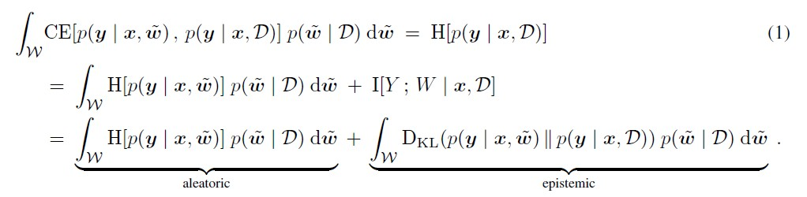
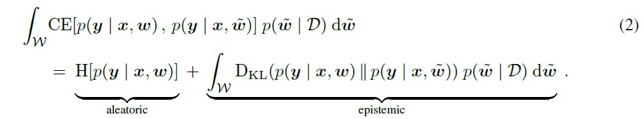
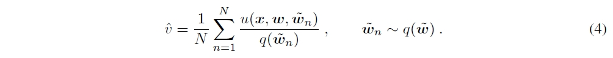
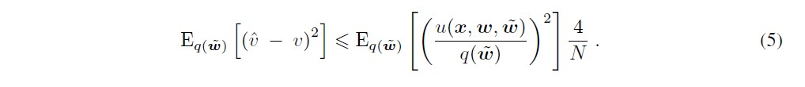
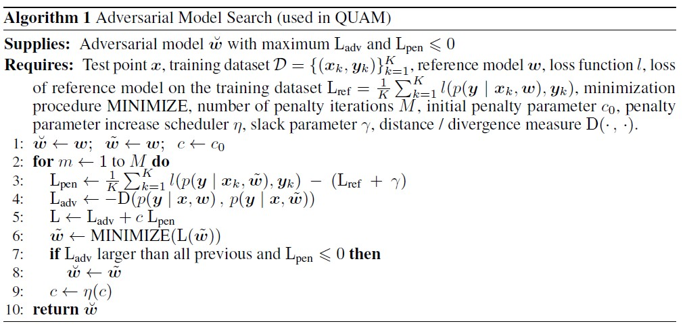
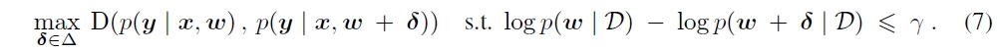
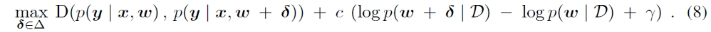
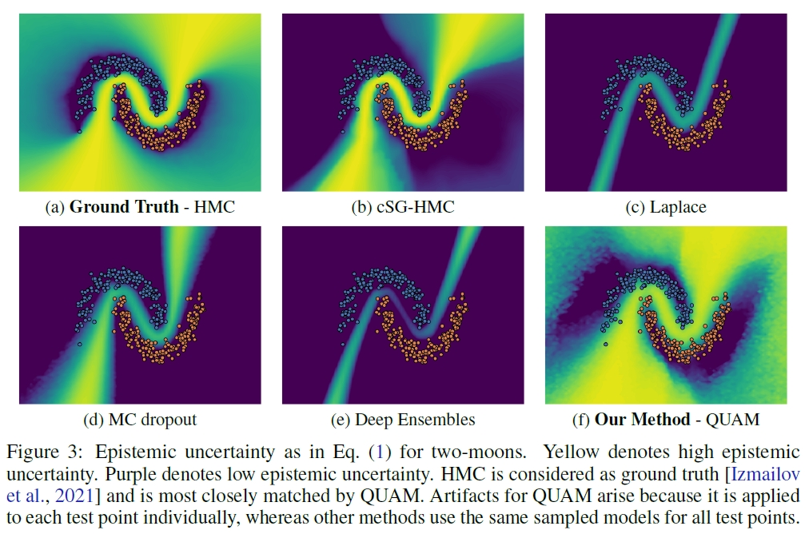
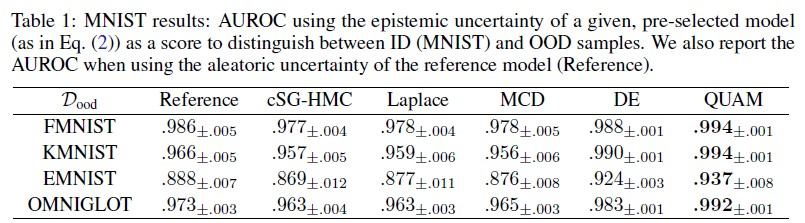
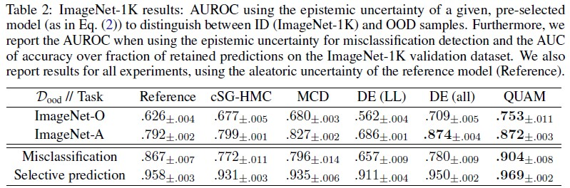

# Quantification of Uncertainty with Adversarial Models

## 1. Problem Definition
Prevalent real-world adoption of deep learning models has increased the demand for the ability to assess the reliability of the predictions of these models, especially in high stake applications. This ability could be considered by quantifying the predictive uncertainty of deep neural networks [1, 2]. Predictive uncertainty can be categorized into two types:
- *Aleatoric*, variability caused by inherent stochasticity of sampling outcomes from the predictive distribution
- *Epistemic*, uncertainty caused by the lack of knowledge of the true model or parameter uncertainty

While aleatoric uncertainty cannot be reduced, epistemic uncertainty can be reduced by more data or better models. Thus, knowing how to quantify and evaluate epistemic uncertainty is a crucial element in improving the performance of deep learning models. However, current uncertainty quantification methods like Monte-Carlo (MC) dropout [3] and Deep Ensembles [4] were found to underperform when estimating epistemic uncertainty. The reason for the underperformances was mainly because these methods primarily consider only the posterior counterpart of the integrand defining epistemic uncertainty (see **Equation 1**) and are subject to missing the important posterior modes when the whole integrand is large, including when the divergence counterpart is also large. 

## 2. Motivation
This paper discusses two different settings of predictive uncertainty quantification:
* **Expected uncertainty when selecting a model**
  
  The total uncertainty in this setting can be computed as the posterior expectation of the cross-entropy (CE) between the predictive distribution of candidate models, $p(y \vert x, \tilde{w})$, and the Bayesian model average (BMA), $p(y \vert x, D)$, which can be derived further into the equation shown in **Equation 1**. Aleatoric uncertainty here represents the expected stochasticity (entropy) of sampling outcomes from the predictive distribution of candidate models $p(y \vert x, \tilde{w})$, while epistemic uncertainty is the mismatch (KL-divergence) between the predictive distributions of candidate models and the BMA.


<!--  -->

* **Uncertainty of a given, pre-selected model**
    
  The total uncertainty in this setting can be computed similarly to the former one, with the difference being that the CE between the predictive distribution of a given, pre-selected model, $p(y \vert x, w)$, and some candidate models, $p(y \vert x, \tilde{w})$, is now computed (see **Equation 2**) instead of between those of candidate models and the BMA.


<!--  -->

As shown in **Equation 1** and **Equation 2**, quantifying epistemic uncertainty requires an estimation of the posterior integrals, which are generally approximated using MC integration. A fair approximation of these integrals requires not only to capture large values of the posterior but also large values of the KL-divergence. Variational inference [3] and ensembles [4] estimate the posterior integral mainly based on models with high posterior. Furthermore, all gradient descent-based methods are prone to missing the important posterior modes because they are invariant to the same input attributes. Since gradient descent always starts with attributes with a higher correlation to the target, posterior modes that are located far away from these input attributes’ solution space are almost never found. Other works, such as Markov Chain MC sampling approximated by stochastic gradient variants, also face limitations in real-world high-stakes applications in terms of efficiency and escaping local posterior modes.

This paper further aims to contribute to these aspects:
* Introducing a framework to approximate the integral that defines epistemic uncertainty with substantially lower approximation error of the integral estimator than previous methods
* Introducing adversarial models that will have considerably different predictions than a reference model while having similarly high posteriors
* Introducing a new setting of uncertainty quantification by quantifying the predictive uncertainty of a given, pre-selected model

## 3. Adversarial Models to Estimate the Epistemic Uncertainty

Epistemic uncertainty is estimated similarly for both mentioned settings, where BMA is the reference model in the first setting while the given, pre-selected model is the reference model in the second setting. The main idea of adversarial models is that if the reference model makes some prediction at the test point and if other candidate (adversarial) models make different predictions while explaining the training data equally well, then the epistemic uncertainty of the prediction should be high. Therefore, adversarial models are plausible outcomes of model selection, having explained the training data equally well (high posterior), that return a different prediction at the test point than the reference model (high divergence).


<!--  -->

This method approximates the posterior $p(\tilde{w} \vert D)$ from a sampling distribution $q(\tilde{w})$ and estimates the integrals of epistemic uncertainty $v$ by MC integration as described in **Equation 4**, where $u(x,w,\tilde{w}) = D(p(y \vert x,w) \vert  \vert p(y \vert x,\tilde{w}))p(\tilde{w} \vert D)$. Mixture importance sampling (MIS) is used instead of unimodal standard importance sampling because this method aims to capture different posterior modes, where each of these modes determines the location of a mixture component of the mixture distribution.


<!--  -->

Apparently, the expected mean squared error of importance sampling with $q(\tilde{w})$ can be bound by **Equation 5**, and this inequality also describes that approximating only the posterior as done by previous methods is insufficient to guarantee a low expected mean square error. Furthermore, this equation also tells us that $q(\tilde{w})$ must have modes where $u(x,w,\tilde{w})$ has modes, which are models $\tilde{w}$ with both high posterior and high KL-divergence. Ultimately, this paper comes up with an algorithm to search for these modes to determine the adversarial models $\breve{w}$, as described in **Algorithm 1**.


<!--  -->

**Adversarial Model Search** is formally defined by:
> Given are a new test data point $x$, a reference conditional probability model $p(y \vert x,w)$ from a model class parametrized by $w$, a divergence measure $D(.,.)$ for probability distributions, $\gamma>0, \lambda>0$, and a dataset $D$. Then a model with parameters $\tilde{w}$ that satisfies the inequalities $\vert log {p(w \vert D)}-log {p(\tilde{w} \vert D)} \vert <=\gamma$ and $D(p(y \vert x,w),p(y \vert x,\tilde{w})) >= \lambda$ is called an $(\gamma, \lambda)$-adversarial model.


<!--  -->

Adversarial model search corresponds to the constrained optimization problem in **Equation 7**, and by adding a weighted penalty function to replace the constraint equation, this could be rewritten as an unconstrained optimization problem as defined by **Equation 8**.


<!--  -->

Where $\delta$ is the weight perturbation that is restricted or bounded, and $c$ is the hyperparameter defining the penalty weight for the constrain violation.

## 4. Experiment

### 4.1 Experiment Setup

The uncertainty quantification methods being compared in the experiments are listed as follows:.
* Quantification of Uncertainty with Adversarial Models (QUAM),
* Cyclical Stochastic Gradient Hamiltonian Monte Carlo (cSG-HMC),
* an efficient Laplace approximation,
* MC Droupout (MCD), and
* Deep Ensembles (DE)

This paper conducts experiments on two different benchmark settings, synthetic and real-world vision datasets, as described below:
* **Synthetic benchmark**  
  A synthetic benchmark is used since it is feasible to compute the ground truth of the epistemic uncertainty. The two-moons dataset is used here, and the Hamiltonian Monte Carlo (HMC) is utilized as the ground truth for this synthetic dataset.
* **Vision Datasets**  

  * MNIST  
  Out-of-distribution (OOD) detection is performed on the FMNIST, KMNIST, EMNIST, and OMNIGLOT test datasets using the LeNet architecture, by using MNIST test dataset as the in-distribution (ID) dataset. Aleatoric uncertainty of the reference model is  utilized as a baseline to further assess the added value of estimating the epistemic uncertainty of the reference model (vanila LeNet pre-trained with the ID dataset).  
  * ImageNet-1K  
  ImageNet-1K dataset is used as an ID dataset, and different datasets are used as the test dataset to evaluate the considered methods' capabilities in terms of:
    * Out-of-distribution (OOD) detection: ImageNet-O dataset
    * Adversarial example detection: ImageNet-A dataset 
    
    The considered methods' reported uncertainty scores are also further utilized for below listed purposes:  
    * Misclassification detection
    * Selective prediction accuracy
  
    All of the ImageNet experiments are performed on variations of the EfficientNet architecture, with each considered methods applied only on the last layer. Two versions of DE are considered; pre-trained different network sizes (DE(all)) and retrained last layers of same encoder networks (DE(LL)). Aleatoric uncertainty of the reference model is also utilized as a baseline to further assess the added value of estimating the epistemic uncertainty of the reference model (Vanilla EfficientNet pre-trained with the ID dataset). Laplace approximation is not feasible to perform even only for the last layer.

For each OOD, adversarial, and misclassified sample, the epistemic uncertainty is expected to be higher than that of ID samples. Furthermore, it is also expected that the classifier is more accurate when the evaluation is only conducted based on certain samples (when the epistemic uncertainty does not score above some threshold). By using the epistemic uncertainty as a score to distinguish two classes, the **AUROC** is reported when classifying between:
* ID vs OOD samples
* ID vs adversarial samples
* Correctly classified vs misclassified samples

While for the selective prediction, the epistemic uncertainty will determine which samples are to be retained, and then the **AUC** of the accuracy are reported based on the evaluation of only these retained samples

### 4.2 Experiment Result

<!--  -->

The synthetic benchmark result shows that the QUAM matches the ground truth (HMC) epistemic uncertainty the most and is also superior in regions further away from the decision boundary (top left and bottom right) compared to other methods. This is expected because gradient descent fails to capture posterior modes with alternative predictive distributions in these regions and thus misses the important integral components.


<!--  -->


<!--  -->

From the vision dataset benchmarking, it is shown that QUAM outperforms all other methods on all tasks evaluated, except for adversarial example detection, where it performed on par with DE (all). It is also shown that QUAM is more computationally-efficient when compared to all other methods in terms of the number of forward passes in the network.

## 5. Conclusion
This paper has introduced QUAM, a method for predictive uncertainty quantification by leveraging adversarial models. Adversarial models identify important posterior modes with alternative and plausible predictive distributions that are missed by other methods. This proposed method has proven to outperform all previous methods while exploiting fewer computational resources, thus promoting its potential application in many operational use cases. Further study on how to develop a more efficient adversarial model search algorithm may be an interesting direction for future work.
## Author Information
Dimas Ahmad (dimasat@kaist.ac.kr), Graduate School of Data Science, KAIST
## References
* [Kajetan Schweighofer, Lukas Aichberger, Mykyta Ielanskyi, Gunter Klam-bauer, and Sepp Hochreiter. Quantification of   uncertainty with adversarial models. Advances in Neural Information Processing Systems, 36, 2024.](https://arxiv.org/abs/2307.03217)
* [GitHub Implementation](https://github.com/ml-jku/quam)
* References:
    * [1] Y. Gal. Uncertainty in Deep Learning. PhD thesis, Department of Engineering, University of Cambridge, 2016.
    * [2] E. Hüllermeier and W. Waegeman. Aleatoric and epistemic uncertainty in machine learning: an introduction to concepts and methods. Machine Learning, 3(110):457–506, 2021.
    * [3] Y. Gal and Z. Ghahramani. Dropout as a Bayesian approximation: Representing model uncertainty in deep learning. In Proceedings of the 33nd International Conference on Machine Learning, 2016.
    * [4] B. Lakshminarayanan, A. Pritzel, and C. Blundell. Simple and scalable predictive uncertainty estimation using deep ensembles. In Proceedings of the 31st International Conference on Neural Information Processing Systems, page 6405–6416. Curran Associates Inc., 2017.


```python

```
