## 1. Background
### Anomaly Detection
이상 탐지(Anomaly Detection)는 결함 검출(Defect Detection), 의학 진단(Medical Diagnosis), 자율 주행(Autonomous Driving) 등에서 폭넓게 적용되는 기술로 정상(Normal)과 이상(Anomaly)을 구분하는 것을 목표로 한다.   

일반적인 환경에서 Normal 데이터를 수집하는 것은 비교적 쉽지만, Anomaly 데이터를 수집하는 것은 어렵다고 한다. 
Anomaly란 Normal이 아닌 그 외의 모든 것을 뜻하므로 일부 Anomaly 데이터만으로는 Anomaly라는 특징을 전부 담아낼 수 있을만큼의 분포를 형성하는 것이 불가능하다고 여겨진다.   

이러한 이유 때문에 최근 대부분의 Anomaly Detection(AD) 연구는 Normal 데이터만으로 학습을 하고, Anomaly와 Normal을 구분하는 Unsupervised Anomaly Detection의 형태를 띈다.   

구체적으로는 분류(Classification) 측면으로 접근하여 Normal과 그 외를 구분하는 One-class classification이나,   
복원(Reconstruction) 측면으로 접근하여 Normal만을 잘 복원할 수 있게 학습하여 Reconstruction error가 큰 경우를 Anomaly로 정의하거나 하는 등의 기존 연구들이 있다.

### Few-Shot Anomaly Detection
앞서 Anomaly 데이터의 부족으로 인한 Normal로만 학습하는 Anomaly Detection이라는 Task의 특징을 알아봤다면, 최근에는 Normal 데이터또한 부족한 경우에서 학습하는 것을 목표로 하는 Few-Shot Anomaly Detection(FSAD) 연구가 진행되기 시작했다.   
산업 환경에서의 결함 검출을 예로 들면, 새로운 제품이 빠르고 많이 출시되는 환경에서 모든 제품군마다 학습을 위한 충분한 양의 데이터를 모으는 것은 비효율적이라는 견해가 있다.   

따라서 Data augmentation을 하거나 lighter estimator를 쓰는 등의 방법으로 제한된 Normal 데이터만으로도 (1장에서 16장 정도) Anomaly를 검출하고자 하는 연구들이 진행되고 있다.

### Image registration
Image registration은 한 이미지의 좌표계를 다른 이미지에 매핑하는 것을 의미한다. 따라서 일반적으로 registration 메소드는 두 개의 이미지, 즉 움직이는 이미지와 고정된 이미지를 Input으로 받고, 움직이는 이미지를 고정된 이미지에 매핑하는 것을 목표로 한다.   

### Spatial Transformer Networks
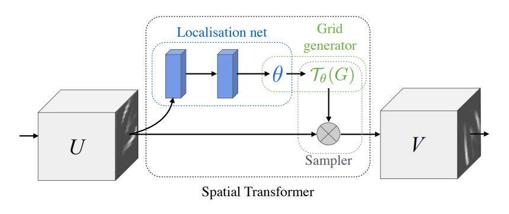
<!--   -->
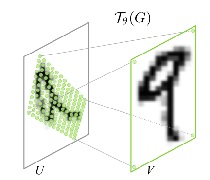
<!--     -->

(from "Spatial Trnasformer Networks", NIPS 2017)   

Spatial Transformer Networks는 기존 CNN이 동일한 이미지의 affine transformation에 대해서 균일한 결과를 내지 못하는 경향이 있다는 점에 착안해서 제안된 네트워크이다.
Localisation net을 통해 얻은 transformation 정보를 담고 있는 파라미터 $\theta$를 이용해 Grid를 생성하고, 해당 Grid로 Input Feature에서 Output Feature를 샘플링한다.
Convolutional Layer의 뒤에 Pooling Layer의 대체제로 사용되는 방법으로써 제안됐고 End-to-End 로 학습될 수 있다는 점이 장점이다.

## 2. Motivation

이 논문에서 인용한 기존의 FSAD 연구들은 1개의 목표 카테고리마다 1개의 모델이 학습될 필요가 있었다.   
하지만 이 논문에서는 실제 사람이 이상을 탐지하는 방법에 착안해서, 다수의 카테고리에 대해서 하나의 모델을 학습을 하고, 학습에 사용된 카테고리뿐 아니라 학습에서 사용되지 않았던 카테고리의 데이터에 대해서도 좋은 성능을 보이는 generalizable한 학습 방법을 제안한다.   

사람이 어떤 이미지의 이상을 탐지하고자 할 때, 단순하게 생각하면 사람은 정상 이미지와 비교하면서 다른 곳을 찾고자 할 것이다. 이 논문에서는 그런 비교 절차를 구현하고자 한다.   

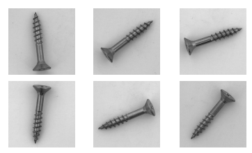
<!--      -->

한 카테고리에서 비교를 위해 2개의 이미지를 랜덤하게 선택한다고 할 때, 두 이미지는 이상 여부와는 상관 없는 물체의 affine transformation이 이미지 비교를 어렵게 만든다. 논문에서는 두 이미지의 비교를 더 용이하게 하기 위해서 두 이미지의 좌표계를 맞춰주는 Registration 방법을 채용한다.   

이 Registration은 category와 상관없이 동일한 수행을 할 것으로 예상되므로 generalizable 한 모델을 목표로 하는 해당 논문에서 사용하기에 적합하다고 주장하고 있다. 더 나아가, Feature 단에서 Registration을 수행하는 Feature Registration이나 다수의 카테고리를 동시에 학습하는 Aggregated Training 을 사용함으로써 모델의 robustness를 높이고 있다.

## 3. Method
이 논문에서 제안하는 RegAD는  다음 그림과 같은 흐름에 따라 학습되고, Anomaly를 탐지한다.   

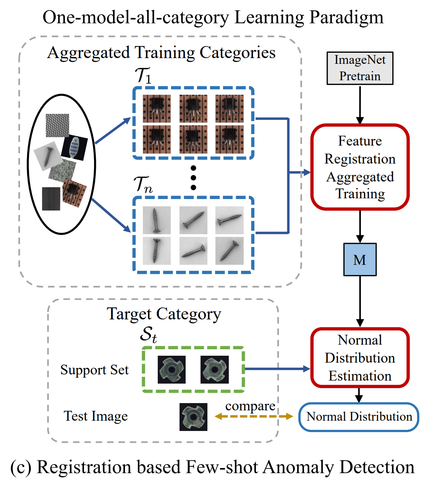
<!--     -->

우선 이상을 탐지하고자하는 목표 카테고리가 있을 때, 해당 목표 카테고리를 제외한 다른 여러 카테고리의 데이터를 하나의 Feature Registration Network로 학습한다. 다음으로는, 그렇게 학습된 Feature Registration Network에 목표 카테고리에서 준비한 Few-Shot Normal 데이터들을 포워딩한다. 그렇게 함으로써 얻을 수 있는 Few-Shot Feature들의 Normal Distribution을 추정한다. 최종적으로 Inference 단계에서는, 동일한 목표 카테고리의 테스트 이미지가 해당 Normal Distribution에서 얼마나 벗어나는지에 따라 Anomaly를 판별한다.   

### 3-1. Feature Registration Network

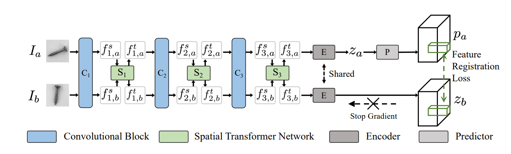
<!--     -->

Feature Registration Network는 미리 정의된 n개의 Training 카테고리들 $(c_ 1 , ... , c_ n)$에서 모은 Normal sample들로만 이루어진 $\mathcal{T}_ {train} = \left\lbrace\mathcal{T}_1,...,\mathcal{T}_n\right\rbrace$ 중 동일한 카테고리의 이미지들 $\mathcal{T}_i$ 에서 임의로 선택된 2장의 이미지 $I_a, I_b$를 입력 받아 Feature 단에서 Registration을 수행하는 네트워크이다.   

우선 Feature Extractor로는 중간 Feature를 뽑아서 사용하기 위해 ImageNet에서 Pretrain된 ResNet의 앞쪽 3개 Convolutional Block $C_i (i=1,2,3)$을 따로 잘라서 사용한다. 그리고 앞서 1. Background에서 설명했다시피 각 Convolutional Block 뒤에 Spatial Transformer Network $S_i (i=1,2,3)$를 붙여서 Feature Transformation을 수행한다.   
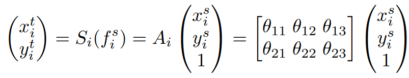
<!--     -->

해당 절차를 수식으로 설명하자면 $C_i$를 통해 추출한 feature $f_i^s$ 를 $S_i$를 통해 transformation을 수행하여 변환된 feature $f_i^t$ 를 얻는다. 이 때, $S_i$는 Learnable한 Affine Transformation이므로 위와 같이 서술할 수 있다. 마지막으로 얻은 feature $f_i^t$는 다음 Convolutional Block $C_{i+1}$에 입력되게 되고 이를 반복한다.   

<!--     -->
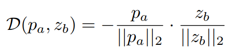

그렇게 입력된 두 장의 이미지에 대해 $f_{3,a}^t$ 와 $f_{3,b}^t$ 를 얻은 후, 동일한 Encoder $E$를 통해 $\mathcal{z}_a$ 와 $\mathcal{z}_b$ 를 얻는다. 그리고 한 쪽($\mathcal{z}_a$)에 대해서만 Predictor $P$를 통해 $\mathcal{p}_a$ 를 얻고, 반대쪽($\mathcal{z}_b$)은 학습 시 gradient가 전파되지 않게 끊어준다. 그렇게 얻은 $\mathcal{p}_a$ 와 ($\mathcal{z}_b$) negative cosine similarity loss를 적용해서 두 개의 feature의 similarity를 높여주고자 한다.   

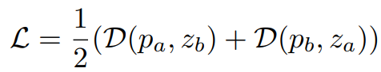
<!--     -->

Loss $\mathcal{D(\mathcal{p}_a, \mathcal{z}_b)}$ 를 구하고 난 다음, Predictor를 통하는 쪽의 branch와 gradient를 끊어주는 쪽의 branch의 역할을 뒤바꿔서 $\mathcal{D(\mathcal{p}_b, \mathcal{z}_a)}$ 를 구한다. 마지막으로 두 개의 Loss의 평균으로 Total Loss $\mathcal{L}$ 을 구하고 이를 이용해 전체 네트워크를 학습한다. 학습이 이루어지는 것은 이 파트에서 서술한 부분이 끝이고, 이후 설명할 부분에서 추가적인 학습이 이루어지지는 않는다.   

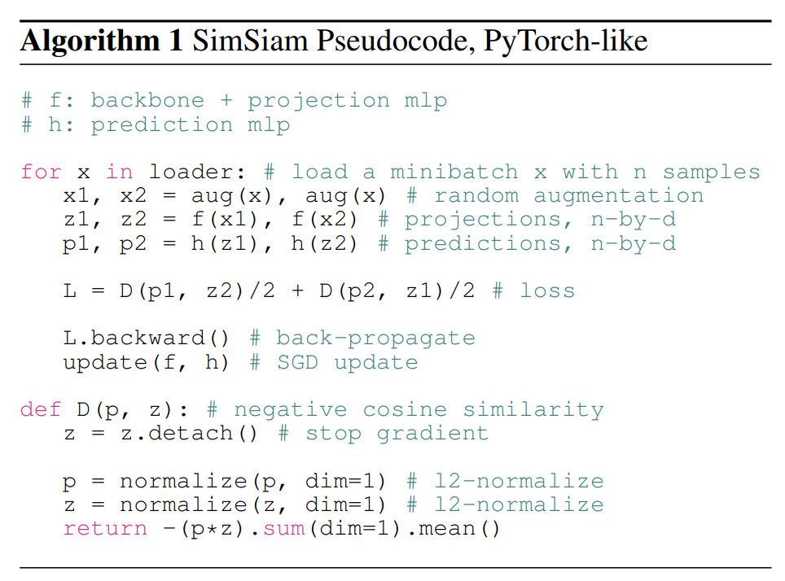
<!--     -->

(from "Exploring Simple Siamese Representation Learning", CVPR 2021)   

덧붙이자면 위와 같은 Encoder와 Predictor를 사용하는 학습 방법은 SimSiam이라는 기존 연구의 구조를 채용한 것으로, SimSiam은 한 이미지에서 파생된 augmentation들의 similarity 를 높이고자 하는 Task이다. SimSiam에서는 positive pair만 사용하는 학습 특성 상 모든 출력값이 하나의 상수값을 내게 수렴되는 collapsing 문제가 생길 수도 있다고 한다. 이 collapsing을 방지하기 위해 한 쪽 branch의 gradient를 끊어서 학습하는 방법을 사용했고, RegAD 또한 그 방법을 그대로 채택했다. 

### 3-2. Normal Distribution Estimation

앞서 3-1. 에서는 $\mathcal{T}_ {train}$ 의 데이터들에 대해 Feature Registration Network를 학습하는 방법에 대해 이야기를 하였다.   
여기서부터는 Motivation에서 언급했다시피 $\mathcal{T}_ {train}$ 에 포함되지 않는, 즉 학습 때 모델이 보지 못한 카테고리 $c_t (t \notin \lbrace 1,2,...,n \rbrace)$ 에 대해 Few-shot normal sample (Support Set $S_t$) 들의 도움을 받아, 동일한 카테고리 $c_t$ 에서 모은 Normal과 Anomaly가 섞여 있는 $\mathcal{T}_ {test}$ 에서 Anomaly를 잘 구분할 수 있게끔하는 제안 방법이다.   

이 단계에서는 학습처럼 2개의 이미지를 입력으로 받을 필요가 없으므로 1개의 branch만 사용한다. $S_t$의 이미지에 대해 기존 FSAD 연구와 같이 data augmentation(rotate, translate, flip 등)을 적용하고 앞서 학습된 네트워크에 통과시켜 Feature를 뽑는다. 자세하게 수식으로 알아보면, $W \times H$ 가 feature의 해상도라고 하면 이미지가 $(i,j) \in [1,W] \times [1,H]$ 의 그리드로 나뉜다고 가정한다. 각 patch position $(i,j)$ 에서 구한 Registered Feature는 $F_{ij} = \lbrace f_ {ij}^{k}, k \notin [1,N] \rbrace$ 로 표기할 수 있다. 여기서 N은 augmentation까지 적용된 전체 Support Image들의 갯수고, $f_{ij}$ 는 patch position $(i,j)$ 의 aggregated feature이고, aggregated feature는 3개의 Spatial Transformer Network 의 ouput인 $f_1^{t}, f_2^{t} ,f_3^{t}$ 를 Concatenate해서 사용한다. (각 output feature의 사이즈는 upsampling해서 동일하게 맞춰준다)   

Registered Feature $F_{ij}$ 에서 sample mean $\mu_{ij}$ 과 sample covariance $\Sigma_{ij}$ 를 구해서 Normal Distribution $\mathcal{N}(\mu_{ij}, \Sigma_{ij})$ 을 구할 수 있다.
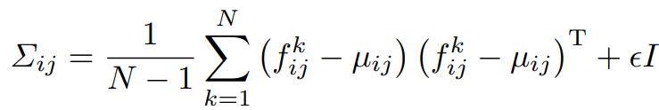
<!--     -->

Sample Covariance는 위와 같은 식으로 구할 수 있고, 이 때 $\epsilon I$ 는 regularization term으로 Sample Covariance 행렬을 full rank 및 가역행렬로 만들어준다. $I$ 는 단위행렬이고, $\epsilon$ 은 작은 스칼라 값(구현상으로는 0.01)이다.

### 3-3. Inference

학습하지 않은 카테고리 $c_t$ 의 이미지들 중 Support Set $S_t$ 를 제외한 이미지들을 테스트 데이터 $\mathcal{T}_ {test}$ 로 사용한다.   
테스트 단계에서는 3-2. 에서 구한 Normal Distribution $\mathcal{N} (\mu_ {ij}, \Sigma_ {ij})$ 이 카테고리 $c_t$ 의 모든 Normal 데이터의 Distribution이라고 간주한다. 따라서 $\mathcal{T}_ {test}$ 의 데이터가 Normal이면 Distribution $\mathcal{N}$ 안이라고 볼 수 있고,  Anomaly면 Distribution $\mathcal{N}$ 밖이라고 볼 수 있다.   

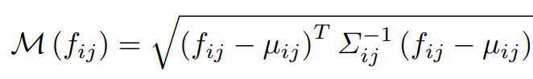
<!--     -->

따라서 sampel point와 distribution간의 거리를 측정하는데 사용되는 Mahalanobis distance $\mathcal{M}$ 을 Anomaly map으로써 사용한다. 그렇게 구한 $\mathcal{M}$ 에 Spatial Trnasformer Network에 해당되는 Affine Transformation의 역변환(Inverse Transformation)을 차례대로 취해줌으로써, 원래 인풋 이미지와 매핑이 일치하는 최종 anomaly score map $\mathcal{M}_ {final}$ 을 구할 수 있다.   

$\mathcal{M}_ {final}$ 에서 높은 Anomaly Score는 이미지 내에서 어느 영역이 이상한지 보여준다. 이미지 단위의 Anomaly 여부를 결정할 때는 $\mathcal{M}_ {final}$ 의 최댓값을 기준으로 결정한다.   
기존 FSAD 연구들은 테스트 단계에서도 data augmentation을 요구했던데에 반해, RegAD는 테스트 이미지에 대해서는 data augmentation을 필요로 하지 않아 inference cost가 적다는 점도 하나의 장점이라고 한다.

## 4. Experiment

RegAD의 실험은 MVTec과 MPDD 두개의 데이터셋을 사용했고, 두 데이터셋 모두 실제 산업환경에서의 결함 검출 시나리오를 고려한 데이터셋이다.   

Evaluation Metric으로는 기본적으로 대부분의 AD Task에서 사용되는 ROC-AUC 를 사용하여 기존 연구들과 비교를 하고 있다.   
실험 세팅은 크게 2가지 세팅으로 나눠서 실험했는데,   

(i) Aggregated Training : 다른 카테고리들에서 학습 후, 학습하지 않은 카테고리의 Few-Shot을 학습 없이 참고만 하고 해당 카테고리에서 Anomaly 구분하기 (RegAD에서 제안하는 방법)   
(ii) Individual Training : Few-Shot 들을 학습에 사용하고 해당 카테고리에서 Anomaly 구분하기 (기존 FSAD 연구들이 채택하고 있는 방법)   

로 나눠서 실험했다.   

이렇게 나눠서 실험한 이유는 RegAD가 실질적으로 학습에 사용한 데이터셋이 기존 FSAD 방법들과 다르기 때문에 동등 조건하에서의 비교가 되지 않아서이다.
그래서 이 논문에서는 동등비교를 하기 위해 기존 FSAD 연구들인 TDG, DiffNet을 각각 (i) Aggregated Training 세팅으로 실험한 TDG+, DiffNet+을 RegAD와 비교하고 있고,   
RegAD를 (ii) Individual Training 세팅으로 실험한 RegAD-L 을 기존 FSAD 연구 TDG, DiffNet과 동등비교를 하고 있다.   

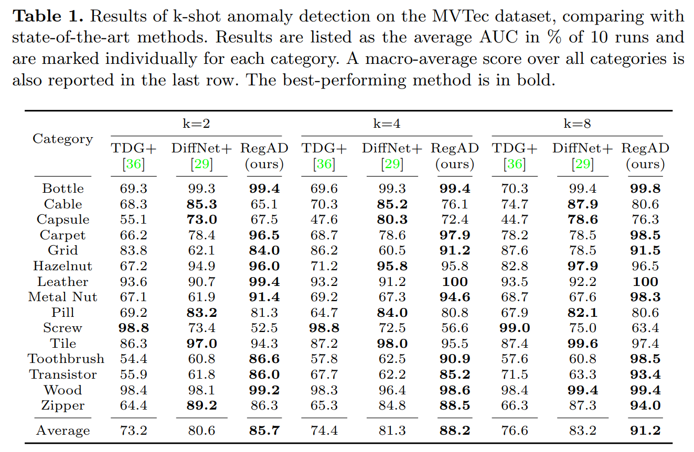
<!--     -->

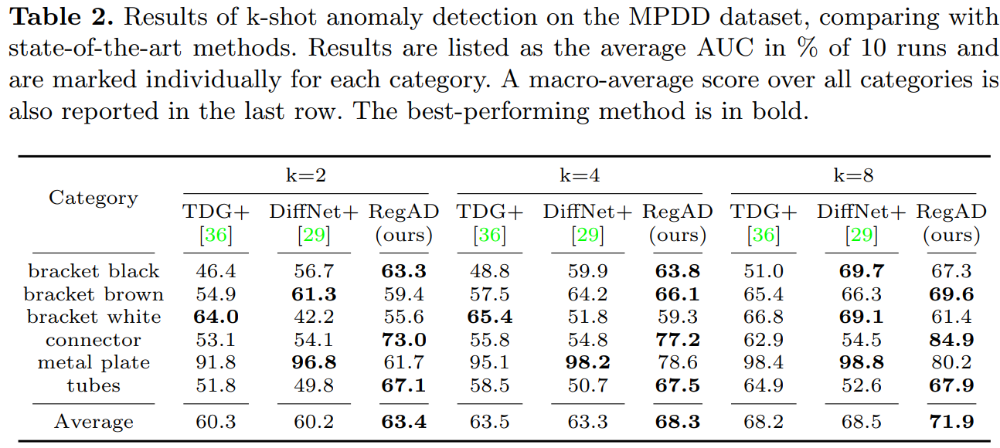
<!--     -->

Table 1과 Table 2는 각각 MVTec 과 MPDD 데이터셋에서 (i) Aggregated Training 세팅에서 실험한 결과로, RegAD가 다양한 Few-Shot 환경에서 기존 메소드들에 비해 성능 향상을 보인 것을 볼 수 있다.   

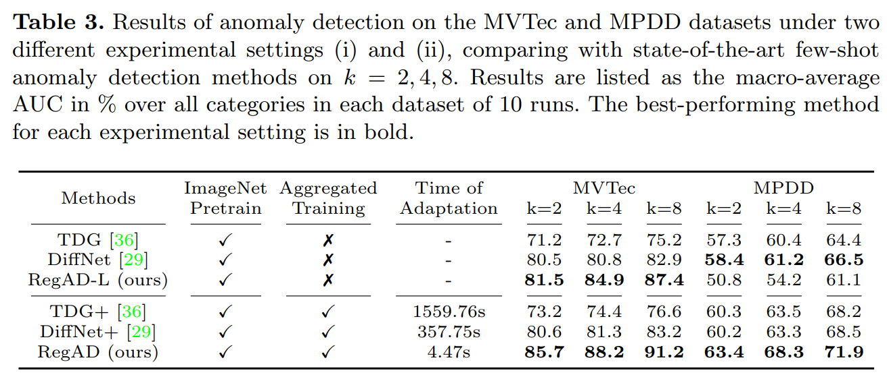
<!--     -->

Table 3는 (ii) Individual Training 세팅에서 실험한 결과도 포함되어 있다. RegAD-L의 경우, MPDD 데이터셋에서 기존 DiffNet보다 떨어지는 성능을 보이긴 한다. 하지만 RegAD와 RegAD-L을 비교해보면 RegAD-L에 비해 RegAD가 확연히 뛰어난 성능을 보이는 것을 알 수 있다. 이 실험에서 Aggregated Training 세팅에서 모델이 배우는 Registered Feature의 강점을 확인할 수 있다.   

그 외에도 Ablation Study나 FSAD가 아닌 AD 연구들과 비교한 실험결과 등 다양한 실험결과가 논문에 있으니 자세한 건 논문 참고 바람.

## 5. Conclusion

RegAD는 기존에 다른 Task에서 연구되었던 Registration이라는 개념을 Few-Shot Anomaly Detection이라는 Task에 접목시켜 해결하고자 했다.   

새로운 카테고리(제품)가 나올 때마다 다시 학습을 해야했던 기존의 FSAD 모델과는 달리, RegAD는 충분히 샘플을 모을 수 있는 다수의 카테고리에 대해 학습을 한번 해두면 그 이후로는 추가학습할 필요가 없는 category-agnostic하다는 점이 가장 큰 특징이었다.   
이와 같이 추가학습이 필요없다는 특징은 신제품이 우후죽순 쏟아져나오며 빠르게 변화하는 산업환경에서 큰 장점이 될 수 있다.   

또한 Few-Shot이 아닌 Full Data를 사용한 메소드들과 비교해도 살짝 떨어지지만 어느 정도 감안 가능한 성능을 보였으므로, Few-Shot인 경우가 더 많은 실제 환경에서의 포텐셜을 충분히 보여줬다고 볼 수 있다.   

## Author Information
KAIST 메타버스대학원 석사과정 김승헌 shkseiji5500@kaist.ac.kr

## 6. Reference & Additional materials

Review Paper: [[Link]](https://arxiv.org/pdf/2207.07361.pdf)   
Github Implementation: [[Link]](https://github.com/MediaBrain-SJTU/RegAD/tree/main)   

Spatial Transformer Networks(NIPS 2015): [[Link]](https://proceedings.neurips.cc/paper_files/paper/2015/file/33ceb07bf4eeb3da587e268d663aba1a-Paper.pdf)   
Exploring Simple Siamese Representation Learning(CVPR 2021): [[Link]](https://openaccess.thecvf.com/content/CVPR2021/papers/Chen_Exploring_Simple_Siamese_Representation_Learning_CVPR_2021_paper.pdf)