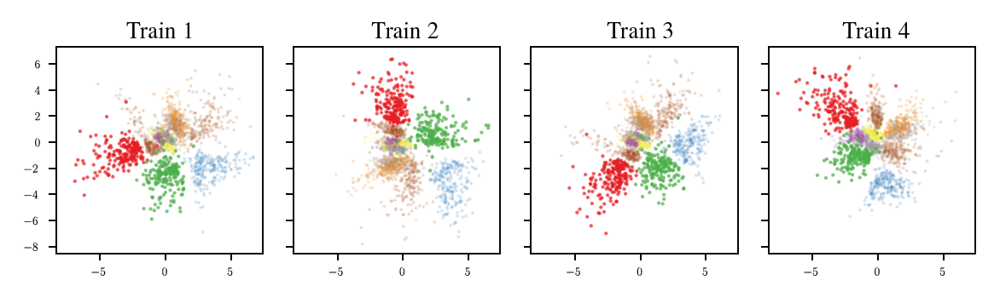
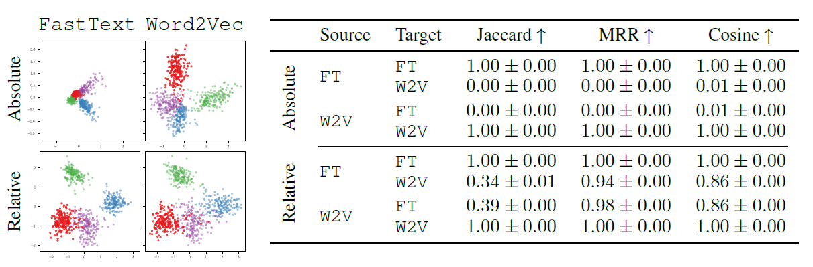
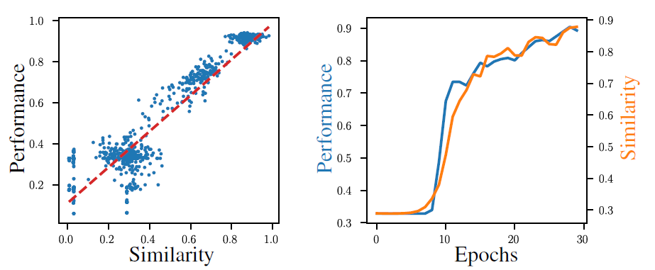
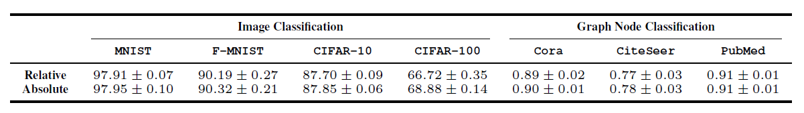
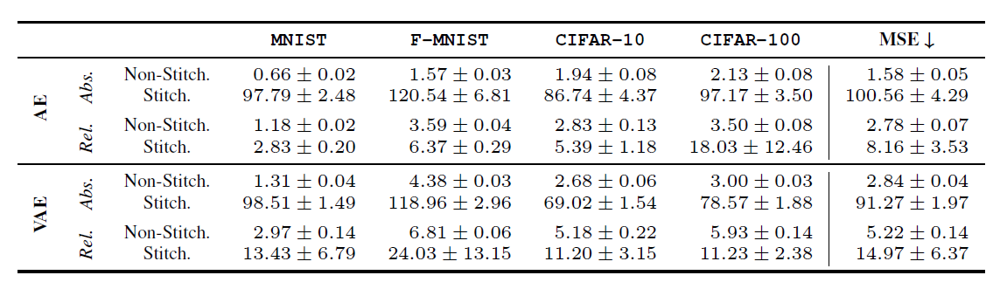
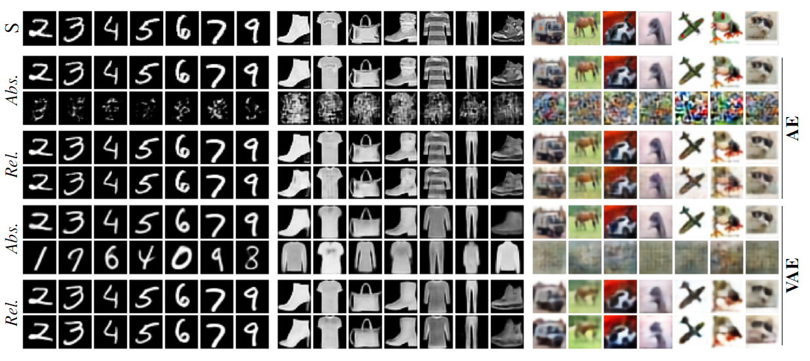
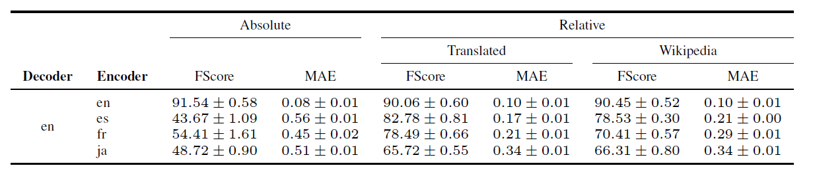
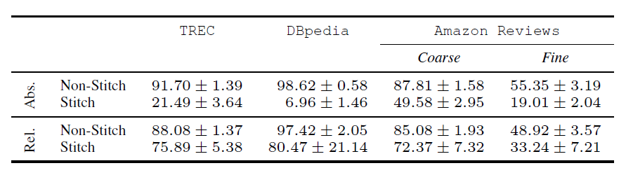
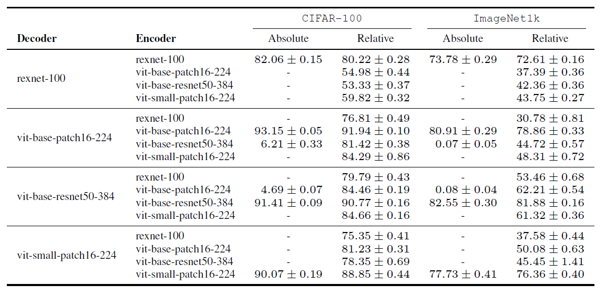

---
title:  "[ICLR 2023] Relative Representations Enable Zero-Shot Latent Space Communication"
permalink: Relative_Representations_Enable_Zero_Shot_Latent_Space_Communication.html
tags: [reviews]
use_math: true
usemathjax: true
---
Reviewer: **20223380 Yang Mingyu** 
Affiliation: _ISysE Financial Engineering Lab_

## 1. Introduction
Neural Network(NN)은 고차원의 데이터를 목적에 맞는 정보를 함축한 형태의 저차원 형태로 변환시키는 것을 학습한다. 따라서 그 목적은 어떤 초기값에서 학습을 시키던 상관없이 최적의 임베딩 형태를 학습하는 것에 있다. 하지만 실제로는 학습이 되지 않는 초기 랜덤값 (Initial weights, data shuffle 등)에 의해 최종 임베딩이 다양하게 나타나는 것을 볼 수 있다. 저자들은 그 예시로 그림 1을 제시했다. 그림 1은 같은 오토인코더를 사용하여 MNIST 데이터를 학습한 결과로 stochasticity는 비슷하지만 다른 형태의 임베딩을 이루고 있음을 보인다. 

 따라서 저자들은 이 문제를 해결하기 위해 다음과 같은 순서로 논문을 전개한다.
 * 같은 네트워크 상에서 같은 데이터를 학습시킬 때 latent embedding 사이의 각도는 보존됨을 가정한다.
 * 이를 이용해 초기값에 좌우되지 않는 형태의 relative represenation을 제시한다.
 * Zero-shot 학습을 가능하게 하는 방법론을 제시하고 이를 실험적으로 증명한다.

## 2. Related Work
* Representation Similarity
  * 다양한 분야와 네트워크에서 Well-performing network는 비슷한 도메인에서 학습이 완료되었을 때 비슷한 형태의 latent space를 만들어냄이 실험적으로 증명되었다. 따라서 저자들은 비슷한 형태의 latent space를 하나의 통일된 형태로 만들 수 있다는 가정을 한다.
 * Model Stitching
   * Lenc & Vedaldi (2015)는 학습 가능한 stitching layer을 통해 비슷한 임무를 수행하는 network에서 네트워크의 교환이 가능하다는 것을 보였다.
   * Bansal et al. (2021); Csisz´arik et al. (2021)는 stitching을 수행함을 통해 well-performing network는 비슷한 형태의 represenatation을 학습함을 실험적으로 증명했다.
   * Gygli et al. (2021); Biondi et al. (2021); Yaman et al. (2022); Bianchi et al. (2020)등은 재사용 가능한 네트워크를 학습함을 통해 stitching 없이 바로 사용 가능한 형태의 모델을 만들었다.
 * Relative Information
   * Vaswani et al. (2017), Kossen et al. (2021)는 feature간의 관계를 고려하여 더 좋은 represenation을 학습시키는 연구를 수행했고 Snell et al. (2017)는 prototypical network를 통해 metric space의 학습이 좋은 성능을 보일 수 있다는 것을 보였다.
   * Shalam & Korman (2022)과 Alvarez-Melis et al. (2019)는 feature의 transform을 통해 global invariance를 고려할 수 있음을 보였다. 

## 3. Method
### 3.1 Relative representation
일반적인 네트워크는 embedding function $E_ {\theta} : \mathbb{X} \rightarrow \mathbb{R}^{d}$ 을 통해 $x^{(i)} \in \mathbb{X}$ 를  **absolute representation** $e_ {x^{(i)}}=E_ {\theta}(x^{(i)})$로 임베딩하는 과정을 학습한다. 학습은 $\min_ {\theta} \mathbb{E}_ {x\in\mathbb{X}}[\mathcal{L}(E_ {\theta}(x)+Reg(\theta)]$ 를 목적함수로 진행되지만 학습된 파라미터 $\theta^{\*}$는 목적함수의 손실함수 뿐 아니라 다른 하이퍼 파라미터에 의해서도 다른 형태로 나타나게 된다. 본 논문에서는 모든 하이퍼 파라미터를 통틀어 $\phi$로 표기한다.  
본 논문에서는 training data $\mathbb{X}$의 부분집합 $\mathbb{A}$를 **anchor**로 정의하고 그 임베딩은 $e_ {a^{(j)}} = E(a^{(j)}), a^{(j)}\in\mathbb{A}$와 같이 나타낸다. 또한 앞서 언급된 바와 같이 **Relative representation**을 정의하는데 이는 임베딩 간의 상대적 거리를 의미한다.  
$\text{Relative Representation of }x^{(i)}\in\mathbb{X}=r_ {x^{(i)}} = (sim(e_ {x^{(i)}}, e_ {a^{(1)}}), sim(e_ {x^{(i)}}, e_ {a^{(2)}}), \dots, sim(e_ {x^{(i)}}, e_ {a^{(\vert \mathbb{A} \vert)}}))$  
$sim(e_ {x^{(i)}}, e_ {a^{(i)}})$ : generic similarity function  
### 3.2 Anchor
Anchor는 학습 데이터셋 $\mathbb{X}$에서 각각의 데이터 특성을 반영할 수 있게 선택된다. 다른 특성을 지닌 데이터 $\mathbb{X}, \mathbb{Y}$를 선택해 각각의 부분집합을 매핑하는 함수 $\mathbb{\Gamma}: P_ {\mathbb{X}} \rightarrow P_ {\mathbb{Y}}$를 이용하면 anchor $\mathbb{A}_ {\mathbb{X}} \subset P_ {\mathbb{X}}$를 직접적으로 매핑하여 $\mathbb{\Gamma}(\mathbb{A}_ {\mathbb{X}})$를 얻을 수 있다. 저자들은 아마존에 달린 두 가지 언어의 리뷰를 그 예시로 삼았다.  (parallel anchors)
혹은 학습된 데이터에 포함되지 않은 데이터셋 $\tilde{\mathbb{A}}$를 anchor로 선택해서(_OOD Anchor_) 다른 도메인에서의 네트워크 성능에 대한 평가를 진행할 수 있다. 
### 3.3 Latent Invariance
저자들은 코사인 유사도를 사용해 relative represenation을 나타냈는데 $S_ {C}$는 다음과 같이 정의된다.  
$S_ {C}(a,b) = \frac{ab}{\vert\vert a\vert\vert \vert\vert b \vert\vert} = cos \theta$
코사인 함수는 회전, 반전, 확대 등의 변형에 무관하게 일정한 값을 나타낼 수 있으므로 상대적인 값을 표시하기에 알맞다. 따라서 이를 이용한 relative representation $r_ {x^{(i)}}$는 invariant하다고 할 수 있으며 이는 embedding function $E_ {\theta}$를 다른 임베딩 함수인 $\tilde{E}$로 교체하여도 같은 representation을 나타냄을 의미한다.  
$(S_ {C}(e_ {x^{(i)}}, e_ {a^{(1)}}), S_ {C}(e_ {x^{(i)}}, e_ {a^{(2)}}), \dots, S_ {C}(e_ {x^{(i)}}, e_ {a^{(\vert \mathbb{A} \vert)}})) = (S_ {C}(\tilde{e}_ {x^{(i)}}, \tilde{e}_ {a^{(1)}}), S_ {C}(\tilde{e}_ {x^{(i)}}, \tilde{e}_ {a^{(2)}}), \dots, S_ {C}(\tilde{e}_ {x^{(i)}}, \tilde{e}_ {a^{(\vert \mathbb{A} \vert)}}))$  

## 4. Latent vector communication
저자들은 다른 데이터로 학습된 모델 간의 latent space를 비교하기 위해 각각의 embedding space가 relative representation으로 나타내졌을 때 어떠한 모습을 보이는지 관찰하고 모델의 성능에 어떤 영향을 미치는지 실험하였다. 일반적인 absolute representation을 이용할 때와 각각의 anchor과 input간의 consine similarity를 relative representation으로 활용하여 이를 학습 embedding으로 사용했을 때, 그 성능 차이와 domain, modality가 변화했을 때 기존의 학습된 모델을 간단한 transformation을 이용하여 그대로 사용할 수 있을지를 알아보는 것에 중점을 두었다.   

$\text{Absolute representation} = X \rightarrow R(X)$
$\text{Relative representation} = R(X) \times \mathbb{A}_ {\mathbb{X}} \rightarrow (S_ {C}(R(X), \mathbb{A}_ {1}), \dots, S_ {C} (R(X), \mathbb{A}_ {\vert\vert\mathbb{A}\vert\vert}))$

### 4.1 Word Imbeddings
#### Experimental Setting

|**목적**|**Dataset**|**Model**|**검증 Dataset**|**검증 방법**|**비교 metric**|
|--|--|--|--|--|--|
|학습 모델에서 Absolute representation을 Relative represenation으로 나타냈을 때 변화를 관찰|FastText (Bojanowski et al., 2017), Word2Vec (Mikolov et al., 2013a) for English language datasets|두 개의 다른 데이터를 이용해서 학습된 두 개의 모델, 몇몇 단어는 겹침|2만개의 단어를 300개의 anchor로 무작위 구성하여 검증|2만개의 단어들로 10개의 다른 seed를 이용해서 실험|Jaccard, Mean Reciprocal Rank(MRR), Cosine|
     
>* Jaccard: 이산 자카드 유사도($\frac{\text{교집합 크기}}{\text{합집합 크기}}$)를 이용하여 source와 target의 유사도를 구함
>* MRR: 해당 단어 근처 top-k neighbor(k=10)와 해당 단어의 target space에서 상대적인 순위를 구함
>* Cosine: 코사인 유사도를 구함  

#### Result

그림 2는 Absolute representation과 Relative representation의 도식화, 그리고 각각의 metric으로 source와 target의 유사도를 보여준다. 결과로 알 수 있는 사실은 다음과 같다.  
* 두 개의 embedding space를 relative representation로 나타냈을 때 놀랍도록 유사한 모습을 보인다.
* Relative representation을 이용했을 때 3개의 metric에서 모두 유사도를 보인 반면 absolute representation에서는 0%의 유사도를 보인다.
* MRR의 경우 Cosine similarity가 1에 이르지 않더라도 같은 단어에 대해서는 높은 유사도를 보인다.  
  
따라서 relative representation을 통해 embedding space를 나타냈을 때 두 모델이 비슷한 형태의 학습을 진행함을 알 수 있다.  

### 4.2 Latent distance as a performance proxy

#### Experiment Setting

|**목적**|**Dataset**|**Model**|**검증 Dataset**|**검증 방법**|
|--|--|--|--|--|
|모델의 성능과 Relative representation의 유사도 사이 관계 관찰|_Cora_ graph dataset (Sen et al., 2008)|기존의 Reference model, 다양한 layer, activation function등을 지닌 약 2000개의 모델들|무작위로 선정된 Relative embedding으로 변환된 300개의 anchor|Reference model과 타 모델들의 consine similarity와 성능을 비교|

#### Result

그림 3은 모델 간의 코사인 유사도와 성능, 그리고 학습의 진행 과정에서 유사도와 성능의 관계를 도식화해서 보여준다. 이를 통해 알 수 있는 사실은 다음과 같다.  
* 코사인 유사도와 성능은 뚜렷한 양의 상관관계를 이룬다.
* validation 성능이 0.5 이하인 모델을 거른 후 성능과 유사도는 학습 내내 매우 높은 상관관계를 유지한다.  

따라서 코사인 유사도는 미분가능하며 성능과 매우 높은 상관관계를 보이므로 teacher-student 프레임워크에서 지표로 사용되기 적합하다. 

### 4.3 Relative vs Absolute representation 학습

#### Experiment Setting

|**목적**|**Dataset**|**Model**|**비교 metric**|
|--|--|--|--|
|Relative representation을 통한 학습이 성능에 미치는 영향 관찰|MNIST, F-MNIST, CIFAR-10, CIFAR-100, Cora, CiteSeer, PubMed|학습 목적에 따라 다름|Weighted F1 score|  

#### Result

그림 4는 각각 Absolute representation과 Relative representation을 사용해 모델을 학습했을 때 Weighted f1 점수를 보여준다. 학습 데이터의 유형은 모델의 성능에 영향을 미치지 않음을 알 수 있다. 저자들은 추가적인 실험을 통해 task, domain, dataset에 따른 유의미한 차이가 없음을 보였다.  

## 5. Zero-shot model stitching

본 논문에서는 인코더와 학습 task에 따른 relative 디코더를 결합한 stitching 모델을 제안한다. Stitching이라함은 기존의 network를 별도의 수정 없이 새로운 모델의 network에 stitch함으로서 동작할 수 있게 함을 의미한다. 추가적인 학습과 하이퍼 파라미터 튜닝을 진행하지 않고 바로 동작하는 zero-shot learning을 목표로 다양한 domain에서의 실험을 진행했다. 

### 5.1 Image reconstruction

#### Experiment Setting

|**목적**|**Dataset**|**Model**|**검증방법**|**비교 metric**|
|--|--|--|--|--|
|Stitching model을 통한 이미지 재현 성능 관찰|MINST, F-MNIST, CIFAR-10, CIFAR-100 |AE와 VAE를 relative representation으로 학습|학습 모델을 새로운 모델에 stitch 후 성능 관찰|Mean Square Error(MSE)|

#### Result

그림 5는 각 데이터셋에 대해 absolute representation과 relative representation으로 학습 후, 원래 모델과 stitch 된 모델의 MSE를 나타낸 표이다. 이를 통해 알 수 있는 사실은 다음과 같다.
* AE와 VAE 모두에서 relative representation을 통해 학습된 모델을 stitch 했을 때 absolute representation을 stitch한 모델보다 월등한 성능을 보임.
* Training stochasticity에 무관하게 stitch 된 모델은 우월한 성능을 보임.
* _그림 6에서 absolute representation을 통해 학습된 VAE는 stitch된 모델에서 정답은 아니지만 의미가 있는 이미지들을 생성함._  

### 5.2 Text classification

#### Experiment Setting

|**목적**|**Dataset**|**Model**|**비교 metric**|
|--|--|--|--|
|Parallel anchor(3.2에서 언급됨)를 통한 stitching이 적용 가능한지 cross-lingual, cross-architecture 관점에서 관찰|**Cross-lingual** - 타 언어로 번역된 영어 리뷰(Translated), wikipedia에서 추출된 문장 쌍(Wikipedia)   **Cross-architecture** - TREC (Hovy et al., 2001), DBpedia (Zhang et al., 2015), Amazon Reviews (Keung et al., 2020)|**Cross-lingual** - 학습된 RoBERTa transformers (Liu et al., 2019)  **Cross-architecture** - 학습된 BERT (Devlin et al., 2019), ELECTRA (Clark et al., 2020), RoBERTa|Weighted F1 score, MAE|        

#### Result

그림 7은 cross-lingual의 결과를 그림 8은  cross-architecture의 결과를 표로 나타낸 것이다. 이를 통해 알 수 있는 바는 다음과 같다.
* 학습되지 않은 언어에 대해 랜덤으로 선택하는 absolute representation stitching에 비해 Relative representation을 통한 stitching은 learning이 된 성능을 보인다.
* Anchor의 선택에 관계없이(모델에 상관없이) 인코딩이 잘 이루어진다면 좋은 성능을 보인다.

### 5.3 Image classification

#### Experiment Setting
**목적**: OOD anchor(3.2에서 언급)에 대해서 stitching model의 성능을 관찰             
**Dataset**: ImageNet1k, CIFAR-100            
**Model**: ViT transformer (Dosovitskiy et al., 2021), RexNet (Han et al., 2020)              
**비교 metric**: Mean weighted F1 score                
#### Result

그림 9는 디코더와 인코더 조합에 대해 각각의 데이터셋에서의 성능을 표로 보인다. 이를 통해 알 수 있는 바는 다음과 같다.
* Relative representation을 통해 학습될 경우 같은 크기의 input을 이용하므로 각 모델의 차원에 관계없이 stitching이 가능하다.
* 한번도 보여지지 않은 CIFAR-100 데이터에 대해 stitching 모델은 준수한 성능을 보여준다.
* RexNet은 anchor의 갯수보다 latent dimensionality가 더 높은 유일한 네트워크인데 이를 디코더로 이용할 경우 stitching에서 급격한 성능 하락을 보인다.`

## 6. Conclusion
본 논문에서 저자들은 학습의 목적과 도메인이 비슷하다면 무작위로 선택되는 하이퍼 파라미터에 관계없이 일정한 relative representation을 보임을 실험적으로 증명했다. 이를 이용해 다른 도메인, 모델에 대해 stitching이 가능함을 제시하고 실제로 준수한 성능을 보임을 증명했다. 이는 간단한 representaton 조작을 통해 새로운 모델을 학습시킬 때 변수의 섬세한 조작이나 많은 횟수의 학습의 수고를 덜어줄 수 있음을 시사한다.

## Reference
Github: https://github.com/lucmos/relreps.git
Paper: Moschella, L., Maiorca, V., Fumero, M., Norelli, A., Locatello, F., & Rodolà, E. (2022). Relative representations enable zero-shot latent space communication. _ArXiv, abs/2209.15430_.
