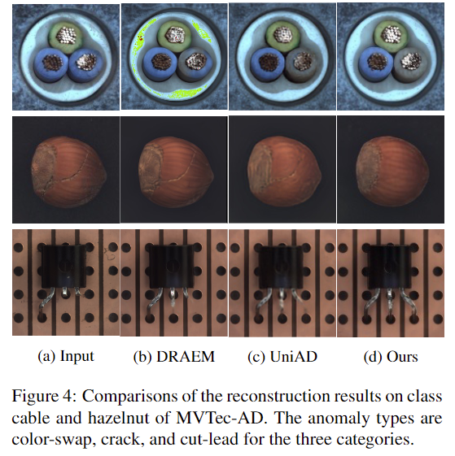

# [ICCV 2023] Removing Anomalies as Noises for Industrial Defect Localization

## 1. Introduction
### 1.1 Motivation
Anomaly detection은 산업 및 의료 분야에서 중요한 task이나, 데이터를 수집하고 주석을 달기가 비용이 많이 들기 때문에 최근에는 Unsupervised 방식이 주목을 받고 있다.
+ Few-shot segmentation studies: Training 시, ground-truth abnormal sample을 활용하지 않고 정상 데이터 분포를 학습한다. Inference에서, 정상 데이터 분포로부터 떨어진 정도에 기반하여 detection 및 localization을 수행한다.
+ Classical reconstruction-based unsupervised anomaly detection methods: 정상 데이터들로만 훈련된 AutoEncoder model은 anomaly를 reconstruct하지 못할 것이라고 가정한다. 그러나 테스트 과정에서 투입된 defect image들 중 몇몇은 anomaly가 여전히 reconstruct되는 것이 한계였다.
	+ DRAEM: Psuedo anomaly를 임의로 생성한 후 AutoEncoder로 하여금 이상 없는 image를 reconstruct하도록 훈련시켰으나, 테스트 과정에서 실제 anomaly들이 psuedo anomaly와 상당히 다를 때 잘 작동하지 못했다.
	+ Denoising AutoEncoder: 의료 분야 anomaly detection을 위해 연구된 사례가 있으나, anomlay score가 단순히 input과 reconstructed image의 pixel space에서의 차이로 측정된다. 이 경우 noisy image로부터의 reconstruction은 어려울 뿐더러 result에 더 큰 noise를 유발할 수 있어서, 더욱 복잡한 산업 anomaly detection에 적용하기 적절하지 않다. 
+ Including transformer structure: Transformer를 활용한 reconstruction model은 AutoEncoder가 input을 그대로 생성해내는 것은 방지하였으나, model은 흐릿한 결과를 만들어내었고 anomaly localization 성능은 되려 저하되었다.

### 1.2 Contribution
+ 본 연구에서는 **정확한 anomaly localization** 및 **우수한 reconstruction quality**를 보장하는 새로운 reconstruction-based anomaly detection method를 제안한다.
+ Key idea: Formulation of anomaly detection task as noise/anomaly removal problem
1. Training AutoEncoder as denoising model
	+ 입력 image에 random noise들을 주입함으로써 AutoEncoder를 denoising model로써 훈련시키면, anomaly pixel들은 noise로 취급되어 reconstruction에서 제외되지 않을 것을 기대한다.
2. Leveraging a diffusion model for denoising and reconstruction
	+ As-Is (Previous reconstruction-based methods)
		+ Noisy image로부터 직접적으로 reconstruct하는 것은 큰 reconstruction error 및 부차적인 anomaly detection 성능 저하에 영향을 줄 수 있기 때문이다.
	+ To-Be (In this paper)
		+ 정확한 anomaly localization을 위해 **diffusion model의 중간 단계를 조사하고 각 step의 reconstruction error를 측정**한다.
		+ Model로 하여금 입력 feature과 defect anomaly들을 pixel, feature space 모두에서 reconstruct 하도록 한다.
3. Gradient denoising process
	+ 본 연구의 process는 입력 image의 **전반적인 구조적 생김새**와 **높은 빈도로 나타나는 정상 구역의 특징**들을 보존하며 점진적으로 anomalous image를 normal image로 변환한다.
	+ Pre-trained deep feature extractor로부터 일정하게 gradient를 denoising함으로써 이를 가능케 하며, 결과적으로 anomaly detection result에 대한 해석가능한 설명을 제공할 수 있다.

## 2. Method
### 2.1 Preliminary
+ Diffusion model은 data distribution $p(x)$를 근사하고 진짜 같은 image를 생성하는 성능이 우수한 generative model이다. 

+ Base-model for this paper: Denoising diffusion probabilistic model (i.e. DDPM)
	+	DDPM은 data distribution $p(x)$가 주어지면 Markov Chain denoising process로 그것을 학습한다.
	+	Diffusion model은 다음과 같이 표현될 수 있다. 즉, **입력 image $x_0$의 distribution은 시점 1~T까지 발생하는 noised image들에 대하여 marginalization한 것**이다.

		$\quad\quad\quad\quad\quad\quad p_ {\theta} \left( \boldsymbol{x}_ {0} \right) = \int p \left( \boldsymbol{x}_ {0: T} \right) \mathrm{d} \boldsymbol{x}_ {1: T}$
		
	+	Structure of DDPM
		+	Forward Process
			+	model은 real image $x_0$에 random Gaussian noise들을 점진적으로 주입하고, 그 결과 일련의 noised images $\left( x_1, x_2, ...,x_T \right)$가 만들어진다. step t에서 주입되는 Gaussian noise의 variance는 ${\beta_ t}_ {(t=1,2,...,T)}$로 표현한다.
			+	Data distribution과 added noise가 모두 Gaussian distribution을 따른다고 가정하므로, step t에서의 noised image $x_t$는 다음과 같은 closed form으로 표현된다.
			
			$\quad\quad\quad\quad\quad q(x_ {t} \vert x_ {0}) = N \left( x_ {t}; \sqrt{ \bar{ \alpha_ {t}} }x_ {0}, \left(1 - \bar{ \alpha_ {t}} \right) I \right)$
		
			$\quad\quad\quad\quad\quad\quad where \quad \bar{\alpha}_ t = \prod_ {s=1}^{t} \left( 1-\beta_ s \right)$
			
	
		+ Reverse Process
			+ $p_ T(\boldsymbol{x}) \sim \mathcal{N}\left(\boldsymbol{x}_ T ; \mathbf{0}, \boldsymbol{I}\right)$으로부터 sampling 하고,  estimated $p_ \theta\left(\boldsymbol{x}_ t\right)$로부터 sampling을 수행함으로써 점진적으로 image를 denoise한다. (즉, noise가 가장 강하게 주입되는 step인 시점 T에서의 image는 standard normal distribution을 따르고, 각 시점 t마다의 distribution을 활용하여 시점 t-1 image를 생성하며 reconstruction 수행)

			$\quad\quad\quad\quad\quad p_ {\theta} ( \boldsymbol{x}_ {0: T} ) = p ( \boldsymbol{x}_ {T} ) \prod_ {t=1}^{T} p ( \boldsymbol{x}_ {t-1} \mid \boldsymbol{x}_ {t} )$
			
			$\quad\quad\quad\quad\quad p_{\theta} ( \boldsymbol{x}_ {t-1} \mid \boldsymbol{x}_ {t} ) = \mathcal{N} ( \boldsymbol{x}_ {t-1} ; \boldsymbol{\mu}_ {\theta} ( \boldsymbol{x}_ {t}, t ), \boldsymbol{\Sigma}_ {\theta} ( \boldsymbol{x}_ {t}, t ) )$

			+ Plus 1: $p_{\theta} \left( \boldsymbol{x}_ {0: T} \right) $가 $p \left( \boldsymbol{x}_ {t-1} \mid \boldsymbol{x}_ t \right) $ (직전 시점 t로 conditioned된 시점 t-1의 distribution)의 곱으로 표현될 수 있는 이유는, DDPM이 diffusion 및 generation 과정을 Markov Chain으로 modeling하기 때문이다.
			+ Plus 2: DDPM 연구에서는 $\beta_t$를 아주 작은 값으로 설정하기 때문에, reverse process의 $p\left(\boldsymbol{x}_ {t-1} \mid \boldsymbol{x}_ t\right)$도 Gaussian distribution으로 설정할 수 있다.

	+	How to train
		+ Diffusion model을 훈련하는 것은 AutoEncoder와 유사하게 다뤄질 수 있다. (즉, Reconstuction error와 Regularizer를 상정한다.)
		
		**(1) Reconstuction error:** DDPM에서 제안한 것과 동일하게 noise $\epsilon$의 크기를 예측하기 위해 MSE loss를 두고 훈련된다.
		
		$ L_ {m s e}=\mathbb{E}_ {t, \boldsymbol{x}_ 0, \boldsymbol{\epsilon}}[(\boldsymbol{\epsilon}-\boldsymbol{\epsilon}_ {\theta} (\boldsymbol{x}_ {t}, t)^{2}] $

		**(2) Regularizer:** Variational bound에 기반한 해당 loss term은 0과 T사이의 시점들에 대하여 $p_ \theta \left( \boldsymbol{x}_ {t-1} \vert \boldsymbol{x}_ t \right) $의 variational distribution으로써 $q \left( \boldsymbol{x}_ {t-1} \mid \boldsymbol{x}_ t \right)$에 $x_ 0$를 conditioning한 $q\left (\boldsymbol{x}_ {t-1} \mid \boldsymbol{x}_ t, \boldsymbol{x}_ 0 \right)$을 상정하고 KL divergence를 최소화하도록 훈련된다. 이는 diffusion model이 noise의 variance를 학습하는 과정으로 간주될 수 있다.

		$\quad\quad\quad\quad\quad L_ {v l b}=L_ {0} + L_ {1} + \cdots+L_ {T-1}+L_ {T},$

		$\quad\quad\quad\quad\quad L_ {0}=-\log p_ {\theta} \left (\boldsymbol{x}_ 0 \mid \boldsymbol{x}_ {1} \right), $

		$\quad\quad\quad\quad\quad L_ {t-1} = D_ {K L}(q(\boldsymbol{x}_ {t-1} \mid \boldsymbol{x}_ {t}, \boldsymbol{x}_ 0 ) \| p_{\theta} ( \boldsymbol{x}_ {t-1} \mid \boldsymbol{x}_ t ) ), $

		$\quad\quad\quad\quad\quad L_ {T} = D_ {K L} ( q ( \boldsymbol{x}_ {T} \mid \boldsymbol{x}_ 0 ) \vert p ( \boldsymbol{x}_ {T} ) )$

### 2.2 Denoising Model for Anomaly detection
#### Why they "Gradually" denoise and reconstruct
+ Background & limitation
	+ 몇몇 AutoEncoder 기반 reconstruction-based method들은 AutoEncoder가 학습되는 동안 input과 정확히 똑같은 output을 내도록 퇴화되는 특성 때문에 anomaly을 완전히 reconstruction 해버리는 문제가 있었다.
	+ 이는 Image에 noise를 주입하고 reconstruction을 수행함으로써 방지할 수 있다는 것이 확인되었다.
	+ 그러나 noise가 주입된 image에서 noise-free image를 직접적으로 재구성하는 것은 상당한 reconstruction error를 초래할 수 있다는 우려가 추가된다.
	+ 특히 Figure 2에 보이듯, anomalous image에 점진적으로 noise를 주입할 경우, noise 강도가 높아질수록 anomaly region이 사라져서 normal region과의 pixel 수준에서의 분간이 어렵다.

+ In this paper
	+ 기존 DDPM에서 제안된 training procedure를 따라 Diffusion model을 anomaly-free data에 대하여 훈련시킨 후, denoising과 reconstruction을 점진적으로 수행한다.

#### How to calculate anomaly score
**1. Pixel-level score**
+ As-Is: 기존 reconstruction-based method들은 RGB Space에서의 original image와 reconstruced image간의 차이를 계산
		→ 문제점: **$p(x_0|x_t)$ 추정의 어려움 및 그로 인해 결과 값에 수반되는 noise**

+ To-Be: Posterior distribution $ q(\boldsymbol{x}_ {t-1} \mid \boldsymbol{x}_ {t}, \boldsymbol{x}_ {0}) $와 가정한 distribution $p_ {\theta} (\boldsymbol{x}_ {t-1} \mid \boldsymbol{x}_ {t} )$간의 KL divergence $D_ {K L} (q (\boldsymbol{x}_ {t-1} \mid \boldsymbol{x}_ {t}, \boldsymbol{x}_ {0} ) \vert p_ {\theta} ( \boldsymbol{x}_ {t-1} \mid \boldsymbol{x}_ {t} ) ) $
		→ Figure 6을 통해 anomaly region일수록 red에 가깝게 coloring된 것을 확인할 수 있는데, 이는 anomaly를 포함한 pixel의 likelihood를 anomaly가 아닌 pixel에 비해 낮게 표현하기에 KL divergence를 활용하는 것이 적절함을 보여준다.
	
**2. Feature-level score**
+ As-Is: 기존 diffusion model들은 anomaly detection result에서 anomaly region의 경계는 명확하게 감지해냈으나 anomaly recall 측면에서 강건하지 못했다. Figure 3에 보이는 것과 같이 normal pixel과 유사한 색상의 anomaly region은 high likelihood가 할당되는 경우가 발생한다. (즉, anomaly가 아닐 것으로 예측한다.) 
	+ 해결책: 이는 명확히 구분되는 anomaly pixel에 우선순위를 부여하여 발생하는 문제이기에, **semantic information이 필요**하다.

+ To-Be: 본 연구에서는 입력 image의 deep feature를 추출하기 위해 활용하는 pre-trained feature extractor $\boldsymbol{f}$의 표기를 빌려, anomaly score를 pixel space, feature space 각각의 score의 joint distribution 형태인 $P(x, f)$를 최종 anomaly score로써 활용하고자 한다.
	+ Additional loss function의 도입
	: 입력 image $x_0$와 그로부터 noise가 추가된 시점 t의 image $x_t$에 대하여, 다음의 Mean Squared Error (이하 MSE)를 reconstruction loss function이자 feature-level anomaly score로 상정한다.
		$s_{t}^{f} = L_ {\text {mse }}^{f}=\frac{1}{C \times H \times W}	\sum \left| f \left( \boldsymbol{x}_ 0 \right) - \left( \boldsymbol{x}_ t \right) \right|^{2} $
		- $f$: a pre-trained feature extractor to extract features with shape $\mathbb{R}^{C \times H \times W}$
		- $\boldsymbol{x}_ 0$, $\boldsymbol{x}_ t$ : a noise-free image and the corresponding corrupted image with random noises, respectively.

+ 결과적으로, 본 연구의 diffusion model은 corrupted image로부터 noise-free인 image의 pixel, semantic feature 모두를 reconstruct하도록 훈련된다.

	

**3. Issue of Multi-scale noises**
+ 본 연구에서는 anomaly의 강도에 따라 noise에 대한 sensitivity가 다름을 관찰하였다. 일부 anomaly는 쉽게 detection이 가능한 반면, 어떠한 anomaly는 anomalous pixel을 압도할만큼 충분히 큰 noise가 필요하는 등의 현상이다.
	+ 해결책: **Pixel-level score과 Feature-level score를 별도로 측정한 후 weighted sum** 하고 선택한 $n$개의 timestep에 대해서만 이를 계산(i.e. averaging)하여 최종 anomaly score로 활용한다. 또한 **KL Divergence score (Pixel-level score)** 도 timestep t에 따라 상당히 달라지기에, **normalizing** 후 계산에 포함한다.

		$ A=\sum_ {i=1,2, \ldots, n} \alpha \hat{s}_ {t_i}+(1- \alpha) s_ {t_ {i}}^{f} $
		+ $\hat{s}_ {t_ {i} } $: Normalized pixel-level anomaly score by mean and standard deviation at time $t_ {i}$
		+ $ T = \left( t_ {1}, t_ {2}, \cdots, t_ {n} \right) $ : Selected timesteps of the forward-process of the diffusion model
		+ $\alpha$: Ensembling factor

**4. Unified model**
+ Detour: 종전의 연구들에서 diffusion network의 model capacity는 그 어떤 복잡한 distribution도 modeling하기에 충분함이 입증되었다.
+ 본 연구에서는 이를 반영하여 다음 두 가지의 model을 학습하고 비교한다.
	+ A single diffusion model: 하나의 model로 multiple category의 distribution을 동시에 학습
	+ Seperated diffusion model for each category: Image data 내에 포함된 category 수만큼 diffusion model을 별도로 만들고 개별 학습
	→ Table 3의 결과를 통해, 본 연구의 Single unified model이 타 연구에서 제안된 model에 비해 성능이 우수하며, 결과적으로 diffusion model을 anomaly localization 목적으로 활용하기에 효과적임을 보였다.

### 2.3 Gradient Denoising for Reconstruction
+ **Background:** 본 연구는 Image의 anomaly region을 diffusion model을 활용하여 제거될 수 있는 특수한 유형의 noise로 간주한다. 이에 따라, DDPM의 reverse diffusion process의 약간 수정된 형태인 gradient denoising process를 제안하여 anomaly removal을 시행하고자 한다. Anomaly를 포함한 image가 점진적으로 normal image로 변형되어 가는 것은 anomaly detection result에 대한 해석가능한 설명을 제공할 수 있다.

+ **To-be: Gradient descending optimization process를 통한 Anomaly reconstruction**
	+ How to measure how far deviated from anomaly-free data
		+ 본 연구에서는 Anomaly-free data의 deep feature의 distribution으로써 PaDiM에서 근사된 multivariate Gaussian distribution $\mathcal{N}(\boldsymbol{\mu}, \boldsymbol{\Sigma})$을 도입하며, Reconstruction에서 활용하는 feature extractor 역시 PaDiM에서 사용한 것과 동일한 것을 채택하여 embedding $f\left(x_0\right)$ 을 추출한다. 입력 image가 distribution의 중심으로부터 얼마나 떨어져있는지를 측정하기 위해 다음과 같은 Mahalanobis distance를 사용하며, gradient descending을 통해 시점 $1$부터 시점 $T$까지의 image를 optimize한다.

		$\quad\quad\quad\quad\quad L=( f ( \boldsymbol{x}_ 0 ) - \boldsymbol{\mu} )^{T} \boldsymbol{\Sigma}^{-1}( f ( \boldsymbol{x}_ 0 ) - \boldsymbol{\mu} ),$

		$\quad\quad\quad\quad\quad \boldsymbol{x}_ {t+1}= \omega \boldsymbol{x}_ {t} - s \nabla_ {\boldsymbol{x}_ t} L,$

		+ $\omega$: Weight decay factor
		+ $s$: learning rate
		+ 이 과정은 PaDiM에서 상정한 anomaly score가 최소화되도록 image를 optimize한다.
	
	+ Corruption of $\nabla_ {x_ {t}} L$
		+ Noisy Gradient $\nabla_ {x_ {t}} L$ (즉, 무작위의 값이 할당됨) 경우, training iteration을 거듭할수록 image를 다른 방향으로 오염(Corruption)시켜 image에 상당한 noise를 주입하게 될 우려가 있다.
		+ 본 연구는 이에 대하여, diffusion model을 gradient를 denoise하기 위한 목적으로도 활용함으로써 high-quality reconstruction을 달성하고자 한다. 이 때, 앞서 명시한 $L$의 시점 $t$에서 input image에 대한 gradient $\nabla_ {x_ t} L$가 $\nabla_ {x_ t} L$ ~ $\mathcal{N}(\boldsymbol{0}, \boldsymbol{\beta_ tI})$임을 가정하며, 여기서의 Variance $\boldsymbol{\beta}_ t$는 forwarding process의 Gaussian noise들의 variance와 같다. 위의 식에서 $\omega=\sqrt{1-s^{2}}$이라면, 각 optimization step은 noise가 $\epsilon_{t}$~$\mathcal{N} \left( \boldsymbol{0}, \boldsymbol{s^{2} \beta_ {tI}} \right)$인 diffusion step과 같아진다. (이후의 New variance $\boldsymbol{s^{2} \beta_ {t}}$는 $\boldsymbol{\hat{\beta}_ {t}}$으로 표기한다.)
		+ 이러한 방법을 통해, optimization 수행 시 diffusion model의 intermediate step에서 발생한 image들을 diffusion model이 안정적으로 denoise 할 수 있도록 한다. noise $\epsilon_t$의 variance는 상대적으로 작기 때문에, 연구에서는 지정한 몇 개의 $N_ d$번째 optimization step의 image를 denoise하고자 하며, 관련 알고리즘은 아래와 같다.
	
			$\quad\quad\quad$ **Algorithm 1: Gradient Denoising Reconstruction** 

			$\quad\quad\quad\quad$ **Input**: Image $\boldsymbol{x}_ 0$, Gaussian $(\boldsymbol{\mu},\boldsymbol{\Sigma})$

			$\quad\quad\quad\quad$ **Output**: $x_ N$

			$\quad\quad\quad\quad$ **for** $t=1, \cdots, N$ **do**

			$\quad\quad\quad\quad\quad$ $\boldsymbol{f}_ {t} = F \left( \boldsymbol{x}_ t \right)$

			$\quad\quad\quad\quad$ $\quad\boldsymbol{g} = \nabla_ {\boldsymbol{x}_ {t}} \left( \boldsymbol{f}_ {t} - \boldsymbol{\mu} \right)^{T} \boldsymbol{\Sigma}^{-1} \left( \boldsymbol{f}_ {t}-\boldsymbol{\mu} \right)$

			$\quad\quad\quad\quad\quad \boldsymbol{x}_ t = \sqrt{1-\hat{\beta}_ t} \boldsymbol{x}_ {t-1} + \sqrt{\hat{\beta}_ t} \boldsymbol{g} ;$

			$\quad\quad\quad\quad$ $\quad$ **if** $t \% N_ {d}=0$ **then**

			$\quad\quad\quad\quad\quad\quad x_ {t} \sim \mathcal{N} \left( \boldsymbol{\mu}_ {\boldsymbol{\theta}} \left( \boldsymbol{x}_ {t} \right), \boldsymbol{\sigma}_ {\theta} \left(\boldsymbol{x}_ {t} \right) \right)$

			$\quad\quad\quad\quad\quad$ **end**

			$\quad\quad\quad\quad$ **end**

+ Figure 7은 gradient denoising process을 수행하면서 intermediate step에서 발생한 image들을 reconstruct한 것을 시각화한 결과를 보여준다. 해당 결과를 통해 Input image로부터 Anomalous pixel들이 점진적으로 변형(제거)되어 normal image가 되어감을 명시적으로 확인할 수 있다.
+ Figure 4를 통해, state-of-art reconstuction-based anomaly detection method들에 비해 anomaly pixel들을 깔끔하게 제거하고 high-frequency detail들을 잘 유지하고 있음을 알 수 있다.

 
## 3. Experiment

### 3.1 Experiment setup
#### 1. Dataset
+ MVTec-AD: Industrial anomaly detection benchmark
	+ Characteristics: 해당 dataset은 15개의 categories (10 object classes + 5 texture classes)의 image data를 담고 있으며, 각 category 마다 200개의 anomaly-free image (i.e. normal image for training)과 100 anomaly image (for testing) 으로 구성되어 있다. 또한 image 별 Pixel-level Ground-truth (i.e. pixel 단위의 anomaly 여부)를 제공한다.

#### 2. Evaluation Metric
+ Pixel-level anomaly segmentation performance를 평가한다.
	+ Metrics
		1. Area Under the Receiver Operating Characteristic (AUROC)
			- Equally measures performance for each pixel
			- Tending to favor larger area anomalies
		2. Per-Region-Overlap (PRO)
			- Background: Area coverage ratios of each connected component들은 동일한 false positive rate에 대하여 평균내어진다. false positive rate을 0~0.3까지 반복적으로 계산함으로써 curve를 얻을 수 있는데, 이 curve의 normalized integral을 PRO-score이라 한다.
			- AUROC와 달리, larger/smaller anomalies에 대한 performance를 동등하게 측정하여 industrial anomaly detection에 대한 balanced evaluation metric을 제공할 수 있다.

#### 3. Implementation details
+ **Model architecture**
	+ Base model
		+ Multiple diffusion model for each category of dataset
			+ Adopt U-Net network design with attention modules
		+ Settings
			+ Time steps for diffusion process
				+ 1000 for training
				+ 250 for reverse sampling
			+ Training iterations: 10,000
				+ Batch size: 2
				+ Optimizer: AdamW
				+ Learning rate: (Annealing one starting at) 0.0001
				+ Exponential-Moving-Average (EMA): Adopted for Evaluation & Reconstruction
	+ Unified model
		+ Train a single diffusion model on all the categories of dataset
			+ Class label is provided to the UNet of the diffusion models for image reconstuction
		+ Settings
			+ Training iterations: 20,000
			+ Except # of iterations, all of other settings are same with base model.

+ **Data pre-processing**
	+ Resize the image to (256, 256)
	+ Trained the model with a 5 degree random rotation augmentation
	+ Feature Extraction function: EfficientNet

+ **Anomaly score**
	+ Ensembling factor $\alpha$: Default for 0.5 (Same for all categories) and adjusted for each category for best results
	+ Timesteps $\boldsymbol{T}$ to get different noise scales: {5, 50, 100} during the forward diffusion process for 3 different noise scales

+ **Gradient denoising process**
	+ Learning rate: 0.02
	+ Denoise period $N_d$: 5 (meaning that image is denoised once every 5 iteration)

### 3.2 Result (for 3 perspectives)
#### 1. Quantitative result
+ Base model (Multiple diffusion model for each category of dataset) 기준 분석 결과
+ Result
	+ Point 1: 서로 다른 category에 대해 hyperparameter setting을 갖는 model로 test한 결과, 15개의 diffusion model에 대하여 계산한 PRO의 평균은 기존 state-of-the-art reconstuction-based methods인 DRAEM에 비해 0.7% 향상되었다.
	+ Point 2: 서로 다른 category에 대해 adjusted hyperparameter setting을 갖는 model로 test한 결과, 15개의 diffusion model에 대하여 계산한 PRO의 평균은 기존 state-of-the-art reconstuction-based methods인 DRAEM에 비해 1.1% 향상되었다.

+ Interpretation of the result
	+ Detour: DRAEM의 경우 cable, pill, transistor class들에 대해 잘못된 psuedo anomalies를 생성했고, UniAD의 transformer-based AE는 metal nut, tile, wood class에서 잘 작동하지 못하여  두 모델의 성능 저하에 영향이 있었다.
	+ 본 연구의 결과를 통해, anomaly detection을 위해 denoising model이 정상 data distribution을 학습하는 것이 (15개의 category 전반에) 효과적이었음을 알 수 있다. 또한 이는 anomaly localization의 robustness를 강화하는 것에 대한 random noise 주입의 효과성이 입증되었음을 시사한다.

	+ Table 1: Results for each categories in MVTec-AD benchmark
	

**2. Qualitative result (of Localization)**
+ Result
	+ Figure 6의 첫 번째 column은 images with anomalies, 두 번째 column은 Ground Truth of anomalies (i.e. true label), 세 번째 column은 Pixel-level predictions based on KL divergenge, 네 번째 column은 feature-level anomaly prediction까지 반영하여 original image에 final anomaly map을 시각화한 것이다.
+ Interpertation
	+ 해당 결과는 본 연구의 denoising model이 anomaly의 정확한 범위를 추정할 수 있음을 보여준다.
 

**3. Qualitative result (of Reconstuction)**
+ Result
	+ Figure 7의 첫 번째, 두 번째 column은 각각 Ground Truth of anomalies (i.e. true label), images with anomalies이고, 이후 column들의 image들은 gradient denoising process의 intermediate result들이다.
+ Interpretation
	+ 해당 결과를 통해, 본 연구의 Denoising gradient process가 pre-trained feature extractor하에서 점진적으로 anomaly image를 normal image로 바꾸는 것이 가능함을 알 수 있다. 이를 통해 intermediate result를 확인할 수 있기에 해석가능한 defect detection이 가능해진다.
	+ Original anomaly image에서 상당 부분을 차지하는 Normal region의 특징은 그대로 유지하면서 anomaly part를 잘 제거한 것을 확인할 수 있다.

### 3.3 Ablation study
#### 1.  Ensemble factor
+ 본 연구에서는 식 (11)과 같이 final anomlay score로써 pixel-level score과 feature-level score를 결합하여 활용한다. Figure 5와 같이, AUROC, pixel AUROC, PRO 세 metric이 전반적으로 우수한 값을 보인 $\alpha=0.5$를 best ensemble factor로 채택하였다.

#### 2. Pretrained feature extractor
+ 본 연구에서는 ResNet, WideResNet에 의해 추출된 deep feature들은 high dimension을 가져서, 여기서의 denoising model로 feature을 reconsturct하는 것을 어렵게 하는 것을 관찰했다. 이로 인해 추출된 feature의 dimension이 상대적으로 작은 EfficientNet을 feature extractor로써 채택하였다.  

#### 3. Unified model
+ Table 1의 결과를 통해 본 연구의 denoising diffusion model이 복잡한 실제 산업 data의 distribution을 잘 모델링함을 알 수 있다. 이에, MVTec-AD의 모든 category들의 anomaly localization을 하나의 model로 수행해보고자single model을 구축한다. Table 2의 결과를 통해, DRAEM과 PaDiM은 unified setting으로 전환할 시 PRO metric에 대하여 5% 이상의 큰 성능 저하가 있지만, 본 연구는 1.1% 정도의 작은 성능 저하만이 있음을 알 수 있다.

## 4. Conclusion
1. Reconstruction-based anomaly localization의 성능을 향상시켰다.
2. Anomaly score으로 pixel-level과 feature-level reconstruction error 모두를 활용한다.
3. Diffusion model의 각 step 마다의 KL divergence를 활용함으로써 더 우수한 localization이 가능한 boundary-aware result를 도출하였다.
4. Pre-trained deep feature extractor로부터 gradient를 denoising함으로써 anomaly image를 high-quality normal image를 reconstruction 할 수 있었는데, 이를 통해 기존 방법들의 reconstruction 성능에 비해 상당히 우수한 reconstruction 결과를 달성하였다.
5. Reconstruction-based denoising diffusion model이 다양한 anomaly type에 대해 robust하게 작동함을 보였고, 이를 확장하여 모든 category에 대하여 범용적으로 활용이 가능한 unified anomaly detector를 구축하여 그의 성능도 보장하였다.

## 5. After reading the paper
### Limitation & Further study
+ **Model architecture; about feature extractor**
	+ 본 논문에서 저자들은 feature extraction을 위해 ImageNet dataset에 pre-trained 된 EfficientNet을 활용하였다.
	+ 그러나 industry, medical domain에서 발생하는 image들은 natural image가 주로 담긴 ImageNet dataset과 상당히 다른 특성을 갖고있을 것이다.
	+ 따라서 feature extraction에 활용하는 model 역시 함께 training 할 때, model의 추가적인 성능 향상을 도모할 수 있을 것이다.
+ **Model architecture; about computation load (or model capacity)**
	+ 본 논문에서 제안한 모델은 anomaly detection accuracy 측면에서 성능을 어필하고 있으나, model training 및 Inference에 소요된 computation time은 제시되어 있지 않다.
	+ 본 논문에서 참고한 Denoising Diffusion Probabilistic Models (DDPM) 은 training에 수 주가 걸린 것으로 알려져 있는데, 실제 industry domain에서는 model의 accuracy 만큼이나 빠르게 적용할 수 있어야 하는 accessibility 역시 중요한 조건이기에 합리적인 시간 안에 수행될 필요가 있다.
	+ computation load을 줄이도록 model을 발전시키는 방향은 다음이 있을 것이다.
		+ **Introducing discrete state space**: 현재 논문에서 활용하는 모델은 diffusion model의 각 state space가 continuous하다고 가정한다. 즉, image의 가능한 pixel값이 제한되어있지 않다. 이로 인해 무한한 공간에서의 sampling을 수행하기에, 그에 수반되는 복잡한 적분과 고차원적 연산이 computation load 증가에 영향을 미친다. 따라서 state space를 discrete 하다고 가정한 후 같은 process를 수행하도록 model을 수정할 수 있다면 computation load의 감소에 기여할 수 있을 것이다.
		+ **Introducing latent space**: Image 자체가 아닌 latent level에서 diffusion model을 학습함으로써 data의 resolution 그대로를 사용할 때에 비해 model capacity 및 inference 측면에서 computation load가 줄어들 것으로 기대된다.
		

## Author Information
+ Name: Doyun Kwon
+ Affiliation: MS Student, Dept. of Industrial and Systems Engineering, KAIST
+ Contact: dy.kwon@kaist.ac.kr

## Reference
+ [[ICCV2023] Removing Anomalies as Noises for Industrial Defect Localization](https://ieeexplore.ieee.org/document/10378530)
+ [[NeurlPS2020] Denoising Diffusion Probabilistic Models](https://proceedings.neurips.cc/paper/2020/hash/4c5bcfec8584af0d967f1ab10179ca4b-Abstract.html)
