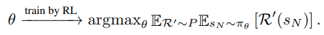

# Simulation-guided Beam Search for Neural Combinatorial Optimization

> ## **0. Abstract**

최근, 강화학습을 활용하여 순차적 의사결정을 통해 solution을 구성해가는 방법(policy)을 학습하여 Combinatorial Optimization 문제를 푸는 deep learning 기반 방법론들이 많이 제안되고 있다.  neural net을 통한 방식은 한번의 실행으로(greedy select) 빠른 시간 안에 high-quality solution을 얻을 수 있지만, 이러한 방식은 솔루션 도출을 위해 사용 가능한 시간(초단위의 빠른 솔루션 도출이 아닌 더 긴 시간을 활용할 수 있는 경우)을 충분히 활용하지 못하는 아쉬움이 있다. **본 논문은 사용 가능한 시간을 충분히 활용하기 위해 강력한 solution search 절차를 제공하고자 하는 목표로 simulation-guided beam search(SGBS)를 제안한다.** SGBS는 solution을 형성해가는 decoding 단계에서 solution 후보에 대해 학습된 neural net policy를 활용하여 평가하고, 이를 활용하여 더 좋은 solution을 찾아가고자 한다. 또한 SGBS와 Efficient active search(EAS)를 결합한 SGBS+EAS를 제안함으로써 solution의 quality를 더욱 향상시키고자 한다. TSP, CVRP, FFSP task 대한 실험을 통해, 본 논문의 방법이 합리적인 시간안에 솔루션을 크게 향상시키고 optimal에 근사한 값을 도출하는 것을 확인할 수 있다.

> ## **1. Problem definition & Motivation**

Neural Network을 통해 combinatorial optimization(CO) 문제를 푸는 연구는 최근 많은 관심을 받고 있다. 강화학습을 통해, 전문가의 지식 혹은 정답에 대한 label 없이도 high-quality solution을 제공할 수 있도록 Deep neural net을 학습시킬 수 있기 때문이다.

CO문제의 solution은 neural network에 의해 계산된 policy(action에 대한 probability distribution)를 따라 순차적 의사결정에 의해 step-by-step manner [Construction method]로 이뤄진다. 이전의 대부분 연구들은 효과적인 policy를 도출하기 위한 neural network 설계, 즉 construction method 연구에 집중해온 반면, construction method에 의해 decoding 단계에서 도출되는 solution을 더욱 향상시키고자, test 단계에서 solution의 quality를 개선하는 방법론인 inference method에 대한 연구는 거의 이뤄지지 않았다. 기존에 MCTS(Monte-Carlo tree search), Beam search와 같은 전통적인 search 전략들이 활용되어 왔지만, 너무 많은 시간이 요구되거나, 효과적이지 못한 문제점들이 존재했다. 따라서 본 논문에서는 기존 방법론들의 단점들은 보완하면서 장점은 살리고자 MCTS와 beam search를 결합한 simulation-guided beam search(SGBS) 전략을 제안한다. 또한 SGBS의 performance를 더욱 향상시키고자 efficient active search(EAS)와 결합된 SGBS+EAS도 함께 제안한다.

- *논문을 이해하기 위해선 EAS와 관련된 사전지식 필요하여, EAS 관련 내용은 이후  method 부분에서 기술함*

> ## **2. Method**

* **2.1 Preliminaries**

N개의 decision variable $a_ {0},a_ {1},…,a_ {n-1}$을 가진 일반적인 CO 문제를 가정한다. CO문제를 풀 때, 우리의 목표는 objective function을 최대화/최소화하는 솔루션(= decision variable의 sequence)을 찾는 것이다. 이를 위해 θ에 의해 매겨변수화된 $π_ {θ}(a_ {d} \vert s_ {d})$를 만들고, 이를 이용해 한 번에 하나씩 solution을 생성해 간다. (매 step마다 decision variable 중 하나를 선택해가며 solution을 구성해감) 예를 들어, Partially completed(d<N)된 solution $s_ {d}$에 대해, 신경망에 의해 도출된 확률분포 $π_ {θ}(a_ {d} \vert s_ {d})$ 에 따라 $a_ {d}$를 선택하여 솔루션을 생성해가는 방식이다. 빈 solution tuple($s_ {0}=()$)로부터 시작하여, 위와 같은 절차를 complete solution($s_ {N}=(a_ {0}, a_ {1},..., a_ {N-1})$)이 생성될 때까지 반복한다. 

Policy-based reinforcement learning 에서 $π, s_ {d}, a_ {d}, R(s_ {N})$은 각각 policy, state, action, reward에 해당한다. 이때 reward(objective value)는 complete solution이 생성되어야 지만 알 수 있다. Policy neural net( $π_ {θ}$)의 파라미터 θ는 expected reward를 증가/감소시키고자 강화학습을 통해 점진적으로 업데이트 되어진다.

<!--  -->

*P*는 target problem instances의 distiribution을 의미하며, *R'*은 *P*에서 sampling된 instance를 의미한다.

* **2.2 SGBS Algorithm and its three phases**  

CO 문제는 depth가 d인 노드가 partially completed solution인 $s_ {d}$를 나타내고 이 노드에서의 branch는 $s_ {d}$상태에서 d+1번째 decision variable을 표현하는 decision tree에서의 search problem으로 볼 수 있다. 즉 문제의 목적은 objective function을 최대화/최소화하는 root node부터 leaf node까지의 path(decision variable의 sequence를 표현)를 찾는 문제로 볼 수 있다.

SGBS 알고리즘은 solution을 만들어가는 decoding 과정에서 root node로부터 시작해서(빈 solution tuple) 매 step마다 solution 후보를 탐색하고, 탐색 결과를 바탕으로 tree의 depth를 확장해 간다(=순차적 의사결정을 통해 솔루션을 구성해 감). 

각 depth level에서 SGBS는 3가지 동작을 수행한다: **_1) expansion, 2) simulation, 3) pruning_**

.png)
<!--  -->

**2.2.1 Expansion(Pre-Pruning)**

.png)
<!--  -->

Expansion factor Γ가 주어지면, **각 beam에 포함된 노드(파랑색 노드) $s_ {d}$로부터 가능한 모든 자식 노드 중 가장 큰  $π_ {θ}(. \vert s_ {d})$를 가진(다음 의사결정으로 선택될 확률이 높은) 상위 Γ개의 자식노드가 선택된다.** 따라서 각 depth마다 expansion 단계에서 Β * Γ 개의 자식노드가 선택되고 나머지는 node는 search tree로부터 가지치기 된다. 

**2.2.2 Simulation**

.png)
<!--  -->

Expansion 단계에서 선택된  Β * Γ 개의 child node에 **greedy rollout** (policy에 따라 greedy action selection을 통해 solution을 끝까지 만들어 보는 것) 을 진행한다. Greedy rollout을 통해 각 child node의 complete solution을 구하고, 이때의 reward를 계산한다. 이를 통해 child node의 objective value를 알 수 있다.

**2.2.3 Pruning**

.png)
<!--  -->

**Β * Γ 개의 child node중 reward 기준 상위 Β개의 reward를 가진 node가 다음 step의 Beam node가 된다.** 선택되지 못한 나머지 child node는 가지치기 돼서 앞으로 고려되지 않는다.

위와 같은 3가지 과정을 모든 path가 completed solution을 구성할 때까지 반복하고, 최종적으로 생성된 여러 path중, best solution이 최종 solution으로 선택된다.

- **2.3 SGBS + EAS**

SGBS의 search 과정동안 neural net의 파라미터는 바뀌지 않으므로(같은 state에 대해 policy distribution이 변하지 않으므로) 고정된 Β, Γ가정하에 고정된 결과만을 보여준다. (greedy action을 한다는 가정하에, 여러 번 SGBS를 실행할 필요X) 이에 주어진 시간을 충분히 활용하면서 SGBS의 performance를 더욱 향상시키고자 EAS와 결합된 **SGBS+EAS**를 제안한다.

***

> **Efficient Active Search(EAS)** : [Hottung et al., 2022](https://arxiv.org/abs/2106.05126)에서 제시된 Efficient Active Search(EAS)는 기존에 제시되었던 inference method인 active search를 효과적으로 개선한 버전이다.  [Bello et al., 2017](https://arxiv.org/abs/1611.09940)에서 제시한 Active search는 강화학습을 통해 test시 single instance에 대해 추론 성능을 높이고자 학습된 모델의 파라미터를 조정하는 fine-tuning 과정을 거치는데, 각 test instance마다 모델의 모든 가중치를 조정하므로 시간과 메무리가 너무 많이 요구되고, 효과적이지 못한 문제가 있었다. EAS는 모델의 모든 parameter를 조정하는 대신, search 과정동안 모델 파라미터 일부 subset만 update하는 전략을 제시했다. 
>
> 본 논문에서는 EAS 전략 중, EAS-Lay 전략을 사용했다. EAS-Lay란 훈련된 모델에 추가적인 layer(논문에선 residual layer라고 지칭)를 삽입하는 방식으로, inference 과정 중 새로 삽입된 layer의 파라미터만 업데이트 되고, 기존 모델의 가중치는 고정된다. 실험을 통해 EAS -Lay전략이 inference method로 아주 효과적임이 밝혀져있다.
>
>  다음과 같은 두 식의 결합을 loss function의 gradient로써 사용해서 삽입된 layer의 파라미터를 update한다.
> .png)
<!-- >  -->
>
> .png)
<!-- >  -->
>
> (1) 수식은, 일반적인 REINFORCE with baseline algorithm에 따른 gradient로 생성된 solution들의 expected cost를 줄이는 것을 목적으로 한다. baseline으로는  [Kwon et al., 2020](https://arxiv.org/abs/2010.16011) 에서 제시한 POMO baseline을 사용하였다. (2) 수식은 tearcher forcing을 활용한 imitation loss gradient이다. 이를 통해 search 과정 중 찾은 best solution의 의사결정 과정을 모방하도록 학습된다. 전체적인 loss의 gradient는 다음과 같이 두 gradient의 가중합으로 정의된다.
>
> .png)
<!-- >  -->
>
> λ는 사용자 파라미터로, 높은 λ value를 설정한다면, 현재까지 찾은 솔루션 중, best solution을 모방하는데 focus하여 모델의 파라미터가 튜닝될 것이다.

***

SGBS+EAS의 알고리즘은 다음과 같다.

> .png)
<!--  -->

**SGBS는 광범위하고 효과적인 search procedure를 통해 현재 솔루션을 개선함으로써 EAS가 local optimal로부터 벗어날 수 있도록 돕고**(search를 통해 더 좋은 solution을 찾아갈 수 있으므로), 동시에 **EAS가 모델 파라미터를 지속적으로 업데이트 함으로써 SGBS가 새로운, 이전과 겹치지 않는 searh tree를 생성할 수 있게 한다.** 즉 EAS를 통해 search tree의 탐색 영역을 더 pormising한 search space로 보내고, promising한 space에서의 SGBS를 통한 search procedure를 통해 solution quality를 더욱 향상시킬 수 있다.

> ## **3. Experiments**

* **3.1 Performance of different search methods for the CVRP in three (a)-(c) scenarios**
  * **Experiments setting**
    - SGBS의 효과를 검증하고자 3가지 다른 시나리오 환경을 구상하고 실험 진행
    - node가 100개 존재하는 CVRP 문제를 대상으로 진행
    - solution을 만드는 trained model은 같은 model 사용
    - Greedy를 제외한 각각의 method는 1200번의 search를 수행하고 Best solution 도출
    - SGBS parameter: (Β=4, Γ=4)
    - Y축: HGS algorithm에 의해 얻어진 solution과의 gap

.png)
<!--  -->

**(a) 시나리오**: 학습한 instance와 같은 distribution에서 sampling된 instance에 대한 실험 진행. EAS를 제외하고는 SGBS가 가장 좋은 효과를 보여주었다.

**(b) 시나리오**: 학습한 instance와 다른 distribution에서 sampling된 instance에 대한 실험 진행. 즉 기존 trained model로는 좋은 성능을 내기 어려운 상황(domain shift)을 가정하였다. 

실험 결과, SGBS 방법이 가장 우수한 성능을 보여주었다. MCTS 방법도 유사한 성능을 보여주었지만, 계산 시간이 너무 오래 걸린다는 단점이 있다. **이처럼 instance의 distribution이 바뀌는 경우, 기존에는 model의 re-train이 요구되었지만 SGBS를 활용한다면 짧은 시간에 매우 효과적인 성능을 보여줄 수 있다. (본 논문의 주요 contribution!)**

**(C) 시나리오**: search 진행하기 이전에 test instance에 대해 fine-tuning 진행한 시나리오. 저자들이 말하길, 다른 method의 경우 local optimal에 빠지는 것을 확인할 수 있었지만, **SGBS의 경우 광범위한 탐색을 통해 solution을 찾아가므로 local optima 문제로부터 비교적 자유로운 것을 확인할 수 있다.** 또한 이는 SGBS+EAS(fine-tuning + search procedure)가 어떻게 큰 성능 향상을 가져오는지에 대한 설명을 제공한다.

* **3.2  TSP  & CVRP**

  NP-hard routing문제인 TSP, CVRP instance에 대해 다양한 instace size에 대한 실험을 진행하였다.

  TSP는 n 개의 node(cities)가 주어졌을 때, 모든 노드를 정확히 한 번만 방문하는 최단거리를 구하는 문제이다. CVRP는 TSP와 유사하지만 다른 점은 각 node마다 demand가 할당되고,  vehicle에 한 번(route)에 처리 가능한 deamd 합 제한인 capacity 제약이 추가된 문제이다.
  
  * **Experiments setting**
    * [Kool et al., 2019](https://arxiv.org/abs/1803.08475)에서 제안한 instances generation 방식 사용
    
    * 노드가 100개인 instance 10000개로 Test 진행
    
    * 일반화 성능을 검증하고자 , Train instance와 다른 distribution에서 sampling된 노드가 100, 150, 200개인 instance 1000개씩 생성하여 Test 진행 
    
    * Baseline algorithm:  
      * TSP: Concorde, LKH3
      * CVRP: HGS, LKH3
      
    * 비교 neural net기반 알고리즘: DACT, NLNS, DPDP, POMO, EAS 단독
    
    * Our method: policy network를 학습시키기 위해  [Kwon et al., 2020](https://arxiv.org/abs/2010.16011) 에서 제시된 **POMO** **training algorithm**[construction method] 사용. POMO는 REINFORCE algorithm을 기반으로 여러 CO 문제에서 좋은 성능을 보임이 검증되었다. (본 논문의 방법론은 inference method로,  construction method를 이용한 학습된 모델 필요. POMO이외에도 어느 construction method에도 적용 가능)
    
      한 epoch당 [Kool et al., 2019](https://arxiv.org/abs/1803.08475)따라 random하게 생성된 instances 100000개를 사용하여 학습. TSP task는 1900epoch의 학습 진행하였고, CVRP instance에 대해서 10000epoch 학습 진행.
    
    * 두 가지 버전의 SGBS+EAS, EAS 실험 결과 제공: **1)** 특정 시간동안만 search 진행한 결과, **2)** 수렴할때까지 진행한 결과
    
    * SGBS parameter
      * TSP: Β=10, Γ=10
      * CVRP: Β=4, Γ=4

.png)
<!--  -->

**Table1.**은 Concorde알고리즘 대비 알고리즘들의 성능 Gap(%)을 보여준다. TSP, CVRP 실험에서 모두 SGBS+EAS가 모든 neural net기반 method를 능가하는 성능을 보여는 것을 확인할 수 있다. 또한  SGBS, EAS를 단독으로 사용하는 것보다 결합했을 때 더욱 효과적임을 볼 수 있다. 특히 CVRP 실험에선 SGBS+EAS가 routing에 특화된 매우 효과적인 알고리즘인 LKH3를 능가하는 성능을 보이며 합리적인 시간 안에 near-optimal 한 성능을 보여줌을 확인할 수 있다.

비록 SGBS+EA가 Concorde, HGS와 같은 baseline의 성능을 넘는 결과를 보여준 것은 아니지만, 주목할 점은 Concode와 HGS는 routing에 특화된 handcrafted-heurisitc 알고리즘이지만, SGBS+EAS는 여러 CO문제에 적용될 수 있는 general한 data-driven 방식이라는 점이다.

* **3.3 FFSP**

  SGBS는 routing문제에 특화된게 아니라 여러 CO 문제의 어느 construction method에도 적용할 수 있는 general inference method임을 보이고자, scheduling 문제 중 하나인 Flexible Flow shp problem(FFSP)에 대한 실험을 진행하였다.

  FFS란, 작업들이 여러 stage를 순차적으로 거치며 공정이 이뤄지는데, 각 stage마다 여러 machine이 존재하고 같은 stage에서는 같은 작업을 처리하더라도 machine마다 다른 처리속도를 가진 시스템을 말한다. 이때 한 machine에서는 한 번에 하나의 작업만 처리할 수 있다는 제약이 존재한다. 

  .png)

  <!--  -->
  
  따라서 scheduling method는 작업을 각 stage에서 어느 머신에 할당할 것인지(machine selection), 각 머신에서 어떤 순서로 작업을 처리할 것인지(Jobs sequencing) 관한 의사결정을 수행해야 한다.
  
  * **Experiments setting**
    * [Kwon et al., 2021](https://arxiv.org/abs/2106.11113)에서 제안한 instances generation 방식 사용
    
    * 3개의 stage, stage별 4개의 machine이 존재하는 상황
    
    * 작업이 20, 50, 100개 존재하는 instance를 각각 1000개씩 생성해서 Test 진행
    
    * Baseline algorithm: MIP(CPLEX solver 이용), meta-heuristic solver, Neural Net base solver(Matnet)
    
    * Our method: policy networ의 파라미터를 학습시키기 위해 train 단계에서 [Kwon et al., 2021](https://arxiv.org/abs/2106.11113)에서 제시한 **Matnet** **training algorithm** [construction method] 사용. Matnet은 REINFORCE알고리즘에 기반하여 관계 데이터를 효과적으로 처리하고 좋은 성능을 보임이 검증되었다.
    
      한 epoch당 [Kwon et al., 2021](https://arxiv.org/abs/2106.11113)따라 random하게 생성된 instances 1000개를 사용하여 학습. 20, 50, 100개의 작업을 처리하는 모델에 대해 각각 54, 95, 120 epochs 학습 진행
    
    * 두 가지 버전의 SGBS+EAS, EAS 실험 결과 제공: **1)** 특정 시간동안만 search procedure 진행한 결과, **2)** 수렴할때까지 진행한 결과
    
    * SGBS parameter:  Β=5, Γ=6

.png)
<!--  -->
**Table2.** 는 SGBS+EAS 대비 알고리즘들의 성능 Gap(%)을 보여준다. 실험 결과, SGBS+EAS method가 기존 방법론들을 크게 앞서는 것을 확인할 수 있다. CPLEX의 경우 합리적인 시간 내에 solution을 도출하지 못하였다.  meta-heuristic 알고리즘들 또한 매우 큰 연산시간이 걸린거에 비해 만족스러운 solution을 도출하지 못하였다.

> ## **4. Conclusion**

CO문제를 효과적으로 풀기 위해 simulation-guided bean search(SGBS)와 EAS가 결합된 inference method 제안하였다. 기존의 construction method와 손쉽게 결합될 수 있는 장점이 있다. 실험을 통해, SGBS+EAS가 solution을 quality를 크게 높이는 것을 확인할 수 있었으며, 전문가, 도메인 지식 없이도 state-of-the-art handcrafted heuristic method와 매우 근사한 near-optimal solution의 결과를 보여주었다.

SGBS를 단독으로 사용하는 것보다 EAS와 결합하여 사용함으로써 EAS에 의해 더 promising한 search space로 tree가 보내지고, promising한 space에서의 광범위한 tree search를 통해 solution의 quality를 높이는 상호유기적인 모습이 인상깊었다. 

실제 환경은 학습한 instances distribution과 다른 distribution에서 sampling된 문제를 풀어야 하는 경우가 대다수일텐데, 이런 환경 속에서 모델을 매번 re-traning하는 것이 아니라 SGBS+EAS와 같은 inference method를 통해 빠른 시간 안에 fine-tuning하는 것이 실제 환경에서 매우 효과적일 것이라고 생각한다.

하지만, SGBS+EAS는 inference method로 여전히 효과적인 construction method에 의해 학습된 model이 요구된다. 어느 contsruction method 알고리즘에 붙어서 작용하냐에 따라 성능의 차이가 클 것이라고 예상된다. 따라서 어느 하나가 중요한게 아니라 서로 상호보완하며 같이 연구되고 성장하는 것이 중요할 것이라고 보인다.

### Author Information

* **Author**: Inguk Choi
  * **Affiliation**: KAIST MSS Lab
  * **Research Topic**: Neural Combinatorial Optimization, scheduling with Reinforcement Learning

> ## 5. Reference 

[1] Choo, Jinho, et al. "Simulation-guided beam search for neural combinatorial optimization." *Advances in Neural Information Processing Systems* 35 (2022): 8760-8772. [[LINK]](https://arxiv.org/abs/2207.06190)

[2] Kwon, Yeong-Dae, et al. "Pomo: Policy optimization with multiple optima for reinforcement learning." *Advances in Neural Information Processing Systems* 33 (2020): 21188-21198. [[LINK]](https://proceedings.neurips.cc/paper/2020/hash/f231f2107df69eab0a3862d50018a9b2-Abstract.html)

[3] Kool, Wouter, Herke Van Hoof, and Max Welling. "Attention, learn to solve routing problems!." *arXiv preprint arXiv:1803.08475* (2018). [[LINK]](https://arxiv.org/abs/1803.08475)

[4] Kwon, Yeong-Dae, et al. "Matrix encoding networks for neural combinatorial optimization." *Advances in Neural Information Processing Systems* 34 (2021): 5138-5149.[[LINK]](https://arxiv.org/abs/2106.11113)

[5] Bello, Irwan, et al. "Neural combinatorial optimization with reinforcement learning." *arXiv preprint arXiv:1611.09940* (2016).[[LINK]](https://arxiv.org/abs/1611.09940)

[6] Hottung, André, Yeong-Dae Kwon, and Kevin Tierney. "Efficient active search for combinatorial optimization problems." *arXiv preprint arXiv:2106.05126* (2021).[[LINK]](https://arxiv.org/abs/2106.05126)

> ## **6.Additional materials**

[[Link for public code]](https://github.com/yd-kwon/SGBS)

