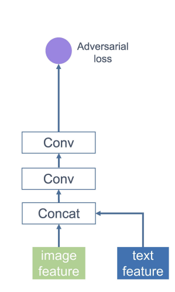
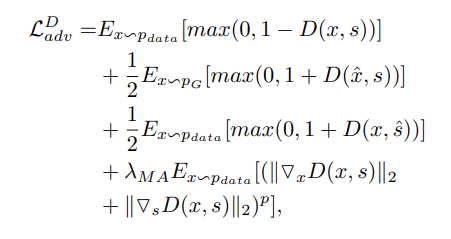
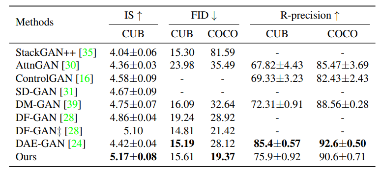
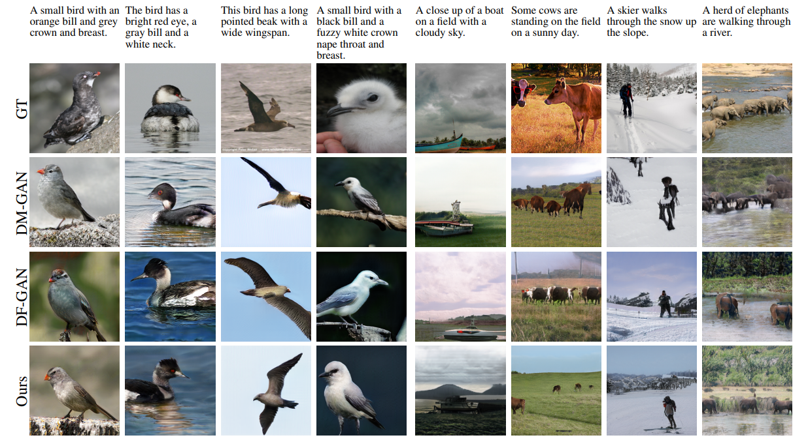
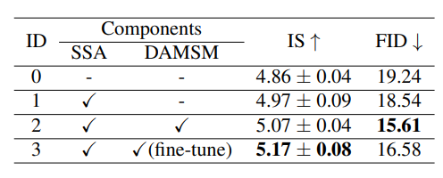

---
title:  "[CVPR 2022] Text to Image generation with Semantic-Spatial Aware GAN"
permalink: Text_to_Image_Generation_with_Semantic-Spatial_Aware_GAN.html
tags: [reviews]
use_math: true
usemathjax: true
---

## **Information**  

 - **Authors**: Wentong Liao , Kai Hu , Michael Ying Yang , Bodo Rosenhahn
	- Affiliation: TNT, Leibniz University Hannover, Germany, SUG, University of Twente, The Netherlands
 - **Topics**: GAN, Text-to-image synthesis(T2I)
 - [Paper links](https://openaccess.thecvf.com/content/CVPR2022/papers/Liao_Text_to_Image_Generation_With_Semantic-Spatial_Aware_GAN_CVPR_2022_paper.pdf)
## **1. Introduction**  
 - ### Problem definition 
Text-to-image synthesis (T2I)는 text 설명과 의미적으로 일치하는 실제 이미지를 생성하는 것을 목표로 하는 task이다. 해당 task는 text가 사람에게 시각적 장면을 묘사하는데 가장 간편하고 자연스러운 매체라는 점에서 각광 받고 있다. 그러나 해당 방법론은 text에서 image 생성이라는 cross-modal problem이며 주어진 text에 대해서 전반적으로 일치하면서도 지역적으로도 일치하는 이미지를 생성해야 한다는 점에서 도전적인 task이다.  

 - ### Limitations 
	- [AttnGAN](https://arxiv.org/abs/1711.10485) 
	
	AttnGAN은 전체 문장 벡터를 이용하여 초기 단계에서 저해상도 이미지를 생성하고, 이후 단계에서는 Attention mechanism을 통해  각 sub-region별로 가장 관련 있는 단어에 초점을 맞추어 이미지를 세밀하게 정제하는 모델이다. 더불어, Deep Attentional Multimodal Similarity Model (DAMSM)을 통해 생성된 이미지와 텍스트 사이의 유사성을 기반으로 loss를 제공하여 생성자의 학습을 돕는다. AttnGAN은 이러한 특성을 기반으로 기존 GAN 모델들을 뛰어넘는 성능을 보이며 대다수의 T2I에서 기본이 되나 몇 가지 한계점을 가지고 있다. 
	
	먼저,  AttGAN의 경우 생성 과정이 여러 단계로 이루어지는 multi-stage refinement framework를 사용한다. 그렇기에 복수의 생성자와 판별자가 필요하여 계산 복잡도가 증가할 뿐만 아니라 최종적으로 생성한 이미지가 초기 생성자가 생성한 이미지의 품질에 크게 의존하게 된다. 더불어, text는 객체나 장면의 일부만 묘사하기 때문에 공간적 정보를 반영한 이미지의 sub-region을 잘 생성하지 못한다. (ex. white crown; 어느 위치에 왕관을 어떻게 묘사할지 알 수 없음) 
	 
	 이처럼 AttGAN의 word level attention 방법론은 높은 계산 복잡도를 가져올 뿐만 아니라 sub-region을 세부적으로  표현하기에는 한계가 있다. 그래서 [COCO 데이터](https://cocodataset.org/#home) 같은 다수의 객체가 있는 복잡한 데이터 셋에서 좋은 성능을 보이지 못한다. 
	 
 - ### Contribution

	위와 같은 문제를 해결하기 위해서 본 논문에서는 새로운 frame work인 Semantic-Spatial Generative Adversarial Network (SSA-GAN)을 제안하고자 한다.  해당 모델은 다음과 같은 기여점을 가진다.
	 
	1. 하나의 생성자와 판별자만 있는 one-stage framework SSA-GAN으로 낮은 계산 복잡도와 안정된 학습 과정을 보인다. 
	
	2.  생성 과정에서 word 단위가 아닌 sentence embedding만 활용하기 때문에 구조가 단순하여 계산 비용을 낮춘다.
	
	3. 새로운 SSA block을 제안; 해당 block은 text 정보를 기반으로 각 픽셀이 설명에 부합하기 위해 어떻게 조정해야하는 지를 정의하는 Semantic mask를 생성해낸다. 더불어 이 mask predictor는 weakly-supervised로 학습이 진행되어 추가적인 annotation이 필요하지 않는다.

## **2. Method**  

<!--  -->

위 그림 1에서 볼 수 있듯이  SSA-GAN 구조는 text encoder,  7개의 SSA block 으로 이뤄진 생성자와 생성된 이미지가 주어진 text와 일치하는 지 구별하는 판별자로 이뤄져 있다.  

*1. Text encoder* 
본 연구에서는 text와 image 사이의 유사도를 기반으로 하는 DAMSM loss로 pretrain된 Bidirectional LSTM text encoder를 사용하였다. 해당 encoder는 주어진 text를 텍스트 벡터와 word feature로 인코딩한다.  
  
-  **텍스트 벡터 인코딩**: 주어진 text는 텍스트 벡터 $ē ∈ \mathbb{R}^{256}$로 인코딩된다.
 -  **단어 벡터 인코딩**:  만약, 문장의 길이가 18이라면, 단어 벡터들은 $e ∈\mathbb{R}^{256×18}$로 인코딩된다. 이때 $e$의 $i$번째 열인 $e_ i$는 $i$번째 단어의 특성 벡터를 나타낸다. 

*2. Semantic-Spatial Aware block*

 <!--  -->
- **notation** 
	$f_ i$ :  feature map generated by $i$th SSA block
	$w_ i$ : width of $f_ i$
	$h_ i$:  height of $f_ i$
	$ch_ i$: number of channels of $f_i$
	$N$ : batch size

각 SSA block은 이중 선형 보간법을 기반으로 기존 이미지 feature map 해상도를 2배로 높이는 Upsample block
,이미지의 개선 방향을 알려주는 Semantic mask predictor 그리고 실제로 이미지를 개선시키는 Semantic-spatial condition batch normalization block으로 구성되어 있다. 또한,  text 정보에 압도되어 기존 이미지 feature 가 손상되는 것을 막기 위해 residual connection이 사용되었다. 

**Upsample**

1번째 SSA block에서는 노이즈 벡터 $z$를 Fully Connected (FC) layer를 기반으로 visual domain으로 projection시킨 후에 $4 \times 4 \times 512$ 로 reshape 시킨 것을 input으로 별도의 upsampling 없이 feature map $f_1$을 생성해낸다. 

 $i$th SSA block $(i>1)$은 text feature vector $ē$와 이전 image feature map $f_ {i-1} \in \mathbb{R}^{ch_ {i-1} \times \frac{h_i}{2} \times \frac{w_i}{2}}$ 을 input으로 $f_ i \in \mathbb{R}^{ch_ {i} \times h_ i \times w_ i}$ 를 생성해낸다. 즉 7번의 SSA block 중 6번의 block에서 upsampling이 이뤄져 최종 feature maps들은 $256 \times 256$ resolution을 가진다. 

**Weakly supervised Semantic Mask Predictor**

그림2에서 회색 점선 박스로  묘사된 구조로 upsample 된 결과물을 input으로하여  semantic mask map $m_ i \in \mathbb{R}^{h_ i \times w_ i}$를 예측한다. 각 요소들의 값 $m_ {i,(h,w)}$은 [0,1] 사이의 값을 가지며 픽셀의 위치 $(h,w)$에서 아핀 변환이 어떻게 이뤄져야하는지 결정한다. 직관적으로 말하자면 현재의 feature map 이미지가 주어진 text에 대해서 의미론적으로 더 일치하기 위해서 어떤 부분이 더 강화 되어야하는지 설명해준다. 이 예측기는 특별한 loss나 mask annotation 없이 구별자가 주는 adversarial loss로 전체 네트워크와 함께 학습한다. 그렇기에 이는 약한 지도학습 과정이다. 

**Semantic Condition Batch Normalization** 

* Batch Normalization (BN) 
  
  Batch $x \in \mathbb{R}^{N \times C \times H \times W}$에 대해서 BN은 아래의 식을 통해 각 feature channel마다 평균을 0 , 표준 편차를 1로 정규화한다.
    
    $\hat{x}_ {nchw} = \frac{x_ {nchw} - \mu_ c(x)}{\sigma_ c(x)}$  
    $\mu_ c(x) = \frac{1}{NHW} \sum_ {\{n,h,w\}} x_ {nchw}$
    $\sigma_ c(x) = \sqrt{\frac{1}{NHW} \sum_ {\{n,h,w\}} (x_ {nchw} - \mu_ c)^2 + \varepsilon}$  

  
   여기서 $\varepsilon$는 안정적인 학습을 위한 작은 양수 상수이다. 이후, 각 채널에 대해서 독립적으로 아핀 변환을 진행한다.    
  
  $\tilde{x}_ {nchw} = \gamma_ c \hat{x}_ {nchw} + \beta_ c$  
  
  여기서 $\gamma_ c$ 와 $\beta_ c$ 는 배치 내의 모든 샘플들의 모든 공간 위치에 동일하게 적용되는 학습 가능한 매개변수들이다. 본 모델에서는 $\gamma_ c$ 와 $\beta_ c$ 를 텍스트 벡터로부터 학습하여, 텍스트 정보에 기반해 이미지를 조율할 수 있도록 한다. 이처럼  $\gamma_ c$ 와 $\beta_ c$ 를 특정 조건에 맞게 학습하는 것을 Conditional Batch Normalization이라고 한다. 
	
* Conditional Batch Normalization 
  기존의 BN에서 나아가 [Dumoulin et al.](https://arxiv.org/abs/1610.07629)은 CBN(Conditional Batch Normalization)을 제안했다. 앞서 언급하였듯이 CBN는 주어진 조건에 맞게 변환을 할 수 있도록 modulation paramter  $\gamma$ 와 $\beta$를 학습하는 BN을 말한다. CBN 공식은 아래와 같다.   
  
  $\tilde{x}_ {nchw} = \gamma(\text{con})\tilde{x}_ {nchw} + \beta(\text{con})$  
  
  SSA block에서는 이러한 CBN을 활용하여 text 정보를 image feature와 혼합한다. 구체적으로 말하자면 modulation parameter $\gamma$ 와 $\beta$ 를 주어진 text vector $\bar{e}$로부터 학습을 진행하여 텍스트의 의미적 내용에 따라 이미지 특성의 강도와 방향을 조정할 수 있도록 한다. 이렇게 학습한 텍스트 조건에 따른  $\gamma(\text{con})$과 $\beta(\text{con})$ 는 텍스트의 구체적인 내용이 각 채널 전체에 어떻게 영향을 미칠지를 결정한다. 예를 들어, "빨간 사과"라는 텍스트는 적색 채널의  $\gamma$와 $\beta$ 를 조정하여 전체 이미지에 빨간색이 강조되도록 할 수 있다. 
  
  텍스트 벡터는 text encoder를 통한 임베딩으로 얻어지며, 이 임베딩은 각각의 특성 채널에 대해 텍스트의 의미적 영향을 어떻게 적용할지를 학습하는 구조를 가진 MLP를 통해 $\gamma$와 $\beta$로 변환된다. 해당 과정은 아래의 식으로 나타낼 수 있다.
	 	
	$\gamma_ c = P_ {\gamma}(\hat{e}), \quad \beta_ c = P_ {\beta}(\hat{e})$
	
  여기서  $P_ {\gamma}(\cdot)$와 $P_ {\beta}(\cdot)$ 는 $\gamma_ c$와 $\beta_ c$를 학습시키기 위한 MLP를 나타낸다.  

**Semantic-Spatial Aware Batch Normalization**

  Semantic aware BN는 각 image feature map (Channel)에 대해서 공간적으로 동일하게 적용된다. Text와 일치하는 이미지를 생성하기 위해서는 우리는 변환이 text와 관련 있는 부분에서만 이뤄져야 한다. 이를 위해 앞서 mask predictor로 예측한 mask 값을 활용한다. 

$\tilde{x}_ {nchw} = m_ {i,(h,w)}\left(\gamma_ c(\hat{e})\bar{x}_ {nchw} + \beta_ c(\bar{e})\right)$

여기서 $m_ {i,(h,w)}$는 text information을 어디에다 더 해줘야할 지 알려줄 뿐만 아니라 얼만큼 더해줘야 할지도 픽셀 수준으로 알려준다.  결과적으로, 이 메커니즘은 텍스트의 의미적 요소가 이미지의 관련 영역에 정확하게 매핑되도록 하여, 텍스트 기반 이미지 생성에서의 정확성과 일관성을 높인다.

**Summary** 

요약하자면,  CBN 내의 text를 기반으로 학습한 modulation paramter  $\gamma$ 와 $\beta$ 를 통해서 전체 이미지에 걸쳐 텍스트의 의미를 반영할 수 있다. 해당 block에서는 이러한  이미지 변형(아핀 변환)을 예측된 mask를 통해 특정 위치에 맞게 다르게 조정하며 진행할 수 있게 한다. 결과적으로, SSA-block을 통해서 의미론적과 공간적 정보를 모두 반영한 text-image fusion이 이뤄질 수 있으며 이는 text와 일관된 이미지 생성을 가능하게 한다. 

*3. Discriminator*

<!--  -->

본 연구에서는  구별자의 구조에서 별도의 contribution을  가져오지 않으며 [DF-GAN](https://arxiv.org/abs/2008.05865)에서 제시한 구별자를 채택해서 사용하였다. 

이해를 위해 간략하게 설명하자면 DF-GAN의 구별자는 Target-Aware Discriminator로 Matching-Aware Gradient Penalty (MA-GP) and One-Way Output 구조로 구성되어 있다. 

MA-GP는 생성된 이미지가 관련 텍스트와 더 잘 일치하도록 유도하는 데 사용되는 gradient penalty 방법론이다. 실제 데이터 일 때,  gradient penalty를 적용하면 실제 데이터 주변의 기울기가 줄어든다. 이는 실제 데이터 주변의 손실 함수를 평활화시켜 생성자가 실제 데이터를 더 잘 모방하도록 유도한다.  다시 말해, target 데이터에 구별자가 gradient penalty를 적용하면 생성자가 보다 빠르고 안정적으로 수렴하도록 유도한다는 것이다.  본 논문에서는 주어진 text와 일치하는 실제 데이터에  gradient penalty를 주어서 생성자가 text와 일치하는 실제 image 데이터로 더 잘 수렴할 수 있도록 하였다. 이는 후에 판별자의 목적식에서 살펴 볼 수 있다. 

One-Way Output은 image의 특징과 text 벡터를 결합한 뒤, 두 개의 합성곱 층을 통해 하나의 적대적 손실을 계산하는 방식이다. DF-GAN 이전 모델들에서 사용된 Two-Way Output 방식은 실제 이미지인지 생성된 이미지 인지를 판별하는 것과 동시에 text와 image 사이의 의미적 일관성을 평가한다. 이후 이 두 가지 gradient를 단순히 합산하는 방식이기 때문에 최적화가 제대로 잘 이뤄지지 않을 수 있으며 상대적으로 학습 과정이 비효율적이다. 그에 비해 one-way output은 text와 image간에 일관성 및 실제 데이터 여부에 대해서 하나의 gradient 만을 구하기 때문에 생성자의 수렴과정을 최적화하고 가속화 시킬 수 있다. 

MA-GP와 One-Way Output의 결합을 통해 구별자는 생성자가 실제 데이터 같으면서도 text 내용에 부합하는 이미지를 더 안정적으로 생성하도록 유도한다.

*4. Objective Function*

먼저, 판별자의 목적함수부터 살펴 보겠다. 

<!--  -->

- **notation** 
	$s$ :  주어진 text description
	$\hat{s}$ :  잘못된(mismatched) text description
	$\hat{x}$: 생성된 image 
	$P_ {data}$: 실제 데이터 분포
	$P_ {G}$: 생성된 데이터 분포

첫 번째 항은 주어진 text와 일치하는 실제 데이터에 대한 손실, 두 번째 항은 주어진 text에 대해서 생성된 데이터에 대한 손실, 세 번째항은 잘못 매칭된 text가 주어졌을 때 실제 데이터에 대한 손실이다. 마지막으로 네 번째항은 주어진 text와 일치하는 실제 데이터 (target data)가 주어졌을 때, 앞서 언급한 MA-GP 기반의 gradient penalty를 주는 과정이다.  이때, $\lambda_ {MA}$와 $p$는 penalty 정도를 조절하는 하이퍼파라미터이다. 

다음은 생성자의 목적함수이다. 생성자의 총 loss는 adversarial loss와 DAMSM loss로 이뤄져있다. 

<!--  -->

- **notation** 
	$\mathcal{L}_ {adv}^G$:  생성자의 적대적 손실
	$\mathcal{L}_ {DAMSM}$:  DAMSM 손실 
	$D_ i$ : 문장 (text)
	$Q_i$ :  image
	$M$ : 배치 크기 
	

$\mathcal{L}_ {adv}^G$는 생성자의 적대적 손실을 나타낸다.$E_ {x \sim P_ G}[\cdot]$는 생성자의 데이터 분포인$P_ G$에서 샘플링된 이미지에 대한 기대값을 의미하고, $D(\hat{x}, s)$ 는 구별자가 해당 이미지 $\hat{x}$ 와 text $s$를 받았을 때 출력하는 점수이다. 구별자가 생성된 데이터를 -1 (생성된 데이터) 에 가깝게 학습할 수 록 loss가 커진다. 

이러한 적대적 손실과  Deep Attentional Multimodal Similarity Model(DAMSM) 손실의 합이 생성자의 최종 손실이 된다. DAMSM이란 AttnGAN에서 반지도 학습 방식으로 학습할 수 있도록 설계된 손실함수이다.  AttGAN에서 정의한 이미지 $D_ i$가 문장 $Q_ i$와 일치하는 후방확률 (Posterior probability)은 다음과 같다. 

$P(D_ i \vert Q_ i) = \frac{\exp(\gamma_3 R(Q_ i, D_ i))}{\sum_{j=1}^{M} \exp(\gamma_3 R(Q_ i, D_ j))}$

여기서 $R(Q_ i, D_ i)$는 코사인 유사도를 기반으로 두 모달리티의 matching score를 계산하는 식이고  $\gamma_3$는 smoothing factor로 하이퍼파라미터 변수이다. 이 배치에서, 오직 문장 $D_i$​만이 이미지 $Q_i$​와 일치하고, 나머지 M−1개의 문장들은 이미지 $Q_ i​$와 일치하지 않는 설명으로 다룬다. 후에, $P(D_ i \vert Q_ i)$를 log negative posterior probability로 변환하여 이미지가 상응하는 text와 얼마나 match되는 지를 기반으로 loss값을 구할 수 있다. 

DAMSM loss에서는 아래와 같이 4가지 확률을 기반으로 loss를 구해서 합을 구한다. 

(1) 단어가 주어졌을 때 상응하는 image segment와 match 될 확률
(2) image segment가 주어졌을 때 상응하는 단어와 match 될 확률
(3) 문장이 주어졌을 때 상응하는 image와 match 될 확률
(4) image가 주어졌을 때 상응하는 문장과 match 될 확률

다시 말해, 	$\mathcal{L}_ {DAMSM}$는 단어 수준의 fine-grained image-text matching loss 이며 $\mathcal{L}_ {DA}$는 DAMSM loss의 가중치이다. 

## **3. Experiment**  

### **Experiment setup**  
* Dataset  
	 - COCO (image 당 5개의 text description)
	 : 많은 객체를 가지고 있는 이미지 데이터 셋
	 - CUB bird (image 당 10개의 text description)
	 : 많은 상세한 특성을 담고 있는 이미지 데이터 셋 
	 
* Evaluation Metric  
	-  Inception score (IS) ($\uparrow$)
	생성된 이미지의 클래스 조건부 분포와 전체 클레스 분포 사이의 KL-divergence 점수
	
	- Frechet Inception Distance (FID) ($\downarrow$)
	생성된 이미지의 feature 분포와 실제 이미지의 feature 분포 사이의 distance 
	
	- R-precision  ($\uparrow$)
	Cosine distance를 기반으로 구하는 image와 text 사이의 의미적 일관성 

* Baseline 
StackGAN++, AttnGAN,Control-GAN, SD-GAN, DM-GAN,DF-GAN,DAE-GAN 

### **Result**  

 - **Quantitative Results**

 <!--  -->
 
IS score가 높을 수록 생성된 이미지의 품질이 높고 text -image 사이의 일관성이 높다는 것을 의미한다. FID score의 경우 낮을 수록 실제 이미지와 유사하다는 것을 의미한다. R precision은 높을 수록 text와 의미적 유관성이 높음을 알 수 있다. 

IS score의 경우, 기존의 SOTA 였던 DF-GAN에 비해 더 좋은 성능을 보이며 SOTA를 달성했다. FID score는 CUB bird set에서 최고 성능을 달성하지는 못했지만 기존의 다른 모델에 비해 낮은 값을 보이고 있다. R score 역시 DAE-GAN을 제외한 다른 모델들보다 좋은 성능을 보이고 있다. 요약하자면, 세부 사항이 많은 이미지 뿐만 아니라 다양한 객체를 가지고 있는 이미지 모두에서 SSA-GAN은 우수한 성능을 보인다. 

- **Qualitative Results**

T2I task에서 최근 SOTA 모델이었던 DM-GAN, DF-GAN 그리고 DAE과 SSA-GAN의 생성 이미지를 질적으로 비교해보았다. 

<!--  -->

전반적으로 SSA-GAN이 깔끔한 배경과 함께 text description과 일치하는 이미지를 생성해냄을 볼 수 있다. 예를 들어 CUB bird dataset을 다룬 첫 번째 열의 '회색 crown과 가슴 그리고 오렌지 색 부리를 가진 작은 새' 라는 text 에 대해서 DM-GAN은 작은 새라는 특성을 반영하지 못 했고, DF-GAN은 회색 crown과 가슴이라는 특성을 반영하지 못했다. 그에 비해 SSA-GAN은 text와 높은 일관성을 보인다. 다양한 객체를 가진 COCO dataset을 다룬 6번째 열에서 SSA-GAN을 통해 생성된 이미지 속 소들이 상대적으로 뭉쳐있는 DF-GAN 속 소들보다 더 잘 인식되어진다. 요약하자면 다양한 text에서  SSA-GAN이 가장 의미적으로 일관된 이미지를 생성해냄을 볼 수 있다.

### **Ablation study**  

 **(1) SSA Block and DAMSM** 

<!--  -->
SSA block과 DAMSM의 성능을 확인하기 위해서 ablation study를 진행했다. 기존의 SSA block 대신 DF-GAN의 UPB block (Upsampling 기반의 block)을 사용하여 결과를 비교하였다. 그 결과, IS score는 fine-tuning 한 DAMSM loss와 SSA block을 활용하였을 때, 가장 높은 성능을 보였고 FID score는 fine-tuning 하지 않은 DAMSM loss와 SSA block을 사용하였을 때 가장 높은 성능을 보였다. 이는 fine-tuning을 통해서 생성된 이미지의 다양성이 커지면서 KL divergence가 커지면서 오히려 지표상 더 낮은 성능을 달성한 것으로 추측할 수 있다. 주목할 점은 본 연구에서 제안한 SSA block을 사용하지 않은 ID0보다 사용한 ID1에서 두 지표 모두에서 우수한 성능을 보였다는 점이다.  

**(2) Semantic Mask** 

<!--  -->

한 SSA block마다 하나의 mask를 추가하고 성능을 비교하는 방식으로 mask의 성능을 증명했다. mask를 7개 추가 하였을 때, (7개의 SSA-block)이 있을 때, IS score에서 가장 높은 성능을 보였고 FID score에서 두 번째로 높은 성능을 보였다. IS score 점수를 통해 mask가 더 의미론적으로 일치할 수 있도록 image를 생성하게 유도함을 알 수 있고,  FID score를 통해 더 많은 text 정보를 담을 수록 생성된 이미지의 다양성이 높아져 오히려 점수가 높아짐을 확인할 수 있다. 

## **4. Conclusion**  
**Paper Summary**
본 논문에서는 T2I를 위한새로운 framework인 SSA-GAN을 제안했다. 해당 모델은 하나의 생성자와 판별자를 사용하며 end-to-end 방식으로 학습을 진행한다. 모델의 핵심인 SSA block은 현재 생성된 이미지를 기반으로 mask를 예측하고 text vector로부터 affine parameter를 학습하면서  semantic spatial condition batch normalization을 진행한다. 이는 text- image fusion 과정을 더 깊게 가능하게 하며 두 modality 사이의 일관성을 높인다. 더불어 다양한 데이터 셋에 대한 실험을 통해서 T2I task에서 해당 모델이 SOTA임을 증명하였다. 

**My opinion** 
  본 연구는 공간적 정보를 반영한 text 기반의 이미지 생성에 초점을 맞추어 진행되었다. 기존 DF-GAN의 판별자를 그대로 사용하였음에도 불구하고 SOTA를 달성한 점은 생성자 구조의 우수성을 증명한다. 그러나 판별자에 변화를 주었을 때 더 향상된 모델을 제안할 수 있을지에 대한 가능성을 탐구해보았다.
  
현재 판별자는 생성자의 학습 안정성을 지원하기 위해 Gradient Penalty를 사용하고 있다. 이 방법은 하이퍼파라미터, 특히 $\lambda$에 의존하는 경향이 있어,  설정에 따라 모델 성능의 변동성을 야기할 수 있다. 이에 대한 대안으로, 판별자의 학습 과정 안정화 및 생성자의 성능 향상을 위해  별도의 하이퍼파라미터 설정이  필요하지 않은 feature matching 등 다른 방법을 적용할 경우 더 좋은 모델이 될 수 있을 것이라 생각한다.

## **5. Reference & Additional materials**  

* [Github](https://github.com/wtliao/text2image) 
* Reference  
	* AttGAN 
	* StackGAN
	* DF-GAN
