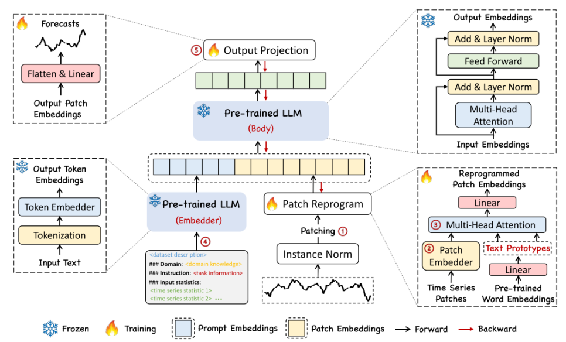
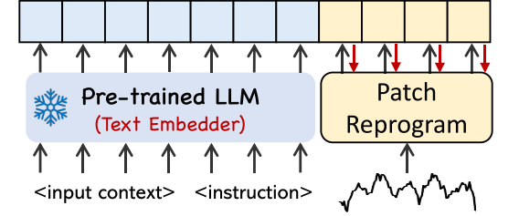
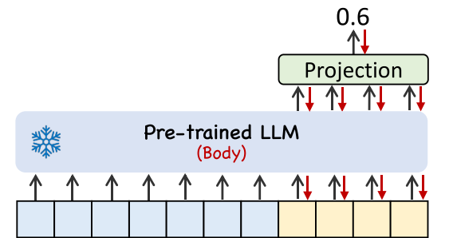
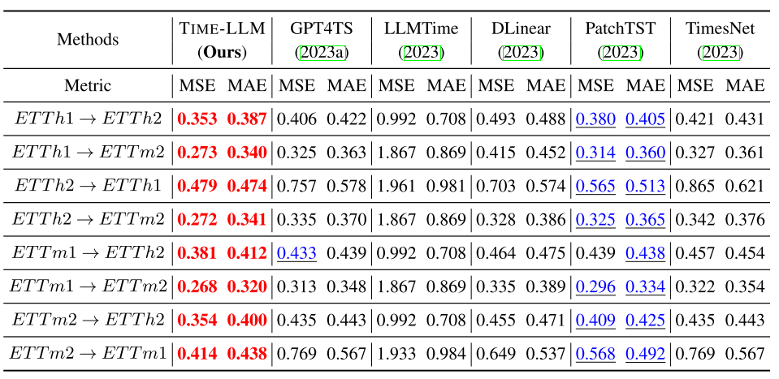

## **1. Problem Definition**  

 시계열 데이터 예측은 전통적인  AR, MA, ARIMA부터 현대의 Deep-Learning을 활용한 CNN, LSTM 등 많은 모델에서 연구되어 오고 있다. 하지만, 모델을 학습 시킬 수 있는 시계열 데이터가 부족하여 주로 예측하는 모델이 domain specialized되어 있는 경우가 많다. 최근 연구에 따르면 LLM(Large Language Models)이 복잡한 Token sequence에 대해 강력한 패턴 인식 및 추론 능력을 가지고 있는 것으로 밝혀졌다. 본 논문에서는 이런 LLM의 패턴 인식과 추론 능력을 시계열 예측에 사용하고자 하지만, LLM이 가지고 있는 강점을 시계열 데이터에 사용하기에는 적절한 modality 변환이 필요한 상황이다. 

 이런 문제 상황을 해결하기 위해 본 연구는 LLM의 backbone은 그대로 유지하면서 일반적인 시계열 예측을 진행할 수 있게하는 Reprogramming Framework를 제시한다. 크게 두 가지의 방법을 제시하는데, 먼저 시계열 데이터를 LLM의 능력이 강화될 수 있도록 Embedding, Patching을 거친 후 Text vector들과 합쳐주는 Patch Reprogramming이 있고, 그 후에 시계열 데이터의 Context나 해결해야 하는 Task의 정보, 적당한 Statistics를 Input에 합쳐주는 Prompt as Prefix가 존재한다. 이 두 가지 특별한 Process를 통해 시계열 데이터가 LLM을 통해 좋은 성능의 예측이 가능하다는 것을 보여준다.

## **2. Background**  

### **2.1. Time Series for LLM**

 Time-Series for LLM의 의미는 LLM의 속의 구조를 고정시키고, Downstream task에 대한 Fine-tuning을 진행하기보다 시계열 데이터에 주요한 변화를 주면서 Task의 성능을 높이고자 한다. 본 논문 또한, LLM에 변화를 취하기 보다는 시계열 데이터를 manipulation하는 방법을 사용한다. 이전에 LLM을 활용한 연구(Time Series Forecasting with LLMs: Understanding and Enhancing Model Capabilities, 2024, Jin) 를 살펴보자면,  Human knowledge를 미리 LLM에 추가한다면 예측의 성능이 높아지며 Sequence나 Numerical한 데이터를 LLM이 잘 이해할 수 있도록 Paraphrasing 하는 것 또한 긍정적인 효과를 불러온다는 결과가 있다.

 예를 들어, 전력량 예측에 대한 Task가 존재할 때 LLM에 미리 여름과 겨울에 전기를 많이 사용한다는 사실을 입력한다면 미래의 전력량 예측에 도움을 준다. 또한, 시계열 데이터를 input으로 사용할 때 시점 t에서 시점 t+1은 증가, 시점 t+1에서  시점 t+2은 감소처럼 이런 sequence에 대한 부연 설명을 통해 LLM이 시계열 데이터를 더 잘 이해할 수 있다.

 본 연구에서도 이와 유사한 개념으로 Prompt as Prefix와 Pre-trained word embedding을 사용하기에, 위의 예시를 참고하면 더욱 연구 Process를 이해하기 쉬울 것이다.

### **2.2. Consideration Time Series for LLM**

 ㄱ) 시계열 데이터 자체가 많이 존재하지 않는다.

 가장 큰 문제는  2024년 현재까지 시계열 데이터 셋 중 가장 크다고 여겨지는 것의 용량이 10GB 미만으로 Vision, NLP 등 다른 분야에 비해 Foundation Model을 학습시킬 데이터가 현저하게 부족하다.그렇기에 이를 해결하기 위해 GAN 같은 방법을 사용하거나 LLM 자체를 Domain에 따라 미리 Prompt를 넣어주기도 한다. 

 ㄴ) 각 시계열 데이터셋의 특징이나 모양이 상이하다. 

 먼저, Domain마다 데이터셋마다 통계적인 특성이나 Scale에서 차이가 난다. 예를 들어 제조 과정에서 얻어지는 변동성의 정도와 금융 시장의 변동성은 차원이 다른 수준이기에 이를 한 번에 통합하여 학습시키기 힘들다. 

 두 번째로 Granularity의 문제가 있다. 풀어서 얘기하자면 데이터의 time-step이 각 데이터 셋마다 다르다는 의미이다. 

## **3. Method**  

### **3.1. Model Setting**

<!-- 

 

 -->

> Framework ot Time LLM

위의 그림이 전체적인 모델의 Framework를 보여준다. 크게 Model Setting, Patch Reprogramming, Prompt as Prefix, Output Generation파트로 나눠지게 된다.
먼저 Model Setting 파트를 보게 된다면, Multivariae Time Series Data를 변수별로 나누고 Window Size만큼 input으로 사용한다. 

$\huge \mathbf{X} \in \mathbb{R}^{N \times T} \rightarrow \mathbf{X}^{(i)} \in \mathbb{R}^{1 \times T}$

> Basic Time-series Data

 이후 각 단변수 시계열 데이터마다 Normalization을 진행한다. 이는 시계열 데이터가 주로 시간 변화에 따라 Distribution이 바뀌는 문제때문에 진행하는데, 이런 Distribution shift는 Forecating model이  generalization되지 않게 만드는 원인이다. 본 논문에서는 Reversible Instance Normalization(RevIN)을 사용하여 이 Distribution shift 현상을 해결하는데, 이는 따로 논문이 존재하니 더 자세히 알고 싶다면 아래의 논문을 참고하면 좋다.

[Reversible Instance Normalization for Accurate Time-Series Forecasting against Distribution Shift](https://openreview.net/forum?id=cGDAkQo1C0p "Reversible Instance Normalization")

 Nomalization 이후 시계열 데이터 셋에 대해 Patching을 해주게 된다. 시계열 데이터의 특성상 시간에 연속적이기에 각 Time-step끼리는 연관되어 있는 Semantic Information이 있기에 이를 Patching을 통해서 단일 시점의 데이터들을 통합하여 Local semantic information을 보존한다.

$\huge \mathbf{X}^{(i)} \in \mathbb{R}^{1 \times T} \rightarrow \mathbf{X}_ P^{(i)} \in \mathbb{R}^{P \times L_ p}$

> Patching

### **3.2. Patch Reprogramming**
 시계열 데이터를 Natural Language처럼 처리될 수 있게 Modality를 Align해주는 과정이 필요하다. 이를 통해 시계열 데이터를 Backbone model이 이해하기 쉬워지고, 시계열 데이터 속에서 Temporal Interrelationship을 잘 capture하게 된다. 그래서 이 과정에서 시계열 데이터의 특성이나 변화를 설명할 수 있는 Text 등을 이전의 Patching이 된 데이터에 Cross-Attention을 수행하여 Patch Representation을 진행한다. (시계열 데이터를 설명하는 Text 예시: "Short", "Up", "Late, "Steady" 등)

 먼저 이전의 Patching을 끝낸 시계열 데이터에 대해 Linear layer를 통해 embedding을 진행시킨다.

 $\huge \mathbf{X}_ P^{(i)} \in \mathbb{R}^{P \times L_ p} \rightarrow \hat{\mathbf{X}}_ P^{(i)} \in \mathbb{R}^{P \times d_ m}$

> Time-series data embedding

 그 후 위에서 얘기한 Modality align과정을 진행하게 되는데, 기존의 존재하는 vocabulary에는 너무 많은 단어가 존재하기에 전체 Word embedding을 사용하기에는 큰 cost가 존재하고, Time-series forecasting에 필요하지 않은 Prior knowledge가 많다. 이를 해결하기 위해 Voca를 미리 Linear layer를 통과시켜 핵심 단어로만 이루어진 Text Prototypes을 만든다.

(e.g. voca 속에 있는 apple, banana 등 관련 없는 단어는 없어짐)

 $\huge E \in \mathbb{R}^{V \times D} \rightarrow E' \in \mathbb{R}^{V' \times D}$

> Text Prototypes Generation

 이후 Embedding한 시계열 데이터와 위의 Text Prototype을 Cross-attention을 활용해 Align한다. 이때 Embedding TS는 Query로 Text-Prototype은 key와 value로 이용한다.

 $\large Q_ k^{(i)} = \hat{X}_ P^{(i)} W_ k^Q, W_ k^Q \in \mathbb{R}^{d_ m \times d}$
 
 $\large K_ k^{(i)} = E'W_ k^K, W_ k^K \in \mathbb{R}^{D \times d}$
 
 $\large V_ k^{(i)} = E'W_ k^V, W_ k^V \in \mathbb{R}^{D \times d}$
 
 $D: Backbone-model-Hidden-dimension$

> Query, Key, Value

위의 Query, Key, Value를 활용해 Multi-head Cross Attention 과정을 거친다.

$\large Z_ k^{(i)} = \text{ATTENTION}\left(Q_ k^{(i)}, K_ k^{(i)}, V_ k^{(i)}\right) = \text{SOFTMAX}\left(\frac{Q_ k^{(i)} {K_ k^{(i)}}^T}{\sqrt{d_ k}}\right) V_ k^{(i)}, \quad Z_ k^{(i)} \in \mathbb{R}^{P \times d}$

> Attention process

이렇게 만들어진 각 head를 Concat하여 Attention Output을 만들고

$\huge Z^{(i)} \in \mathbb{R}^{P \times d_ m}$

> Attention Output

이 Output을 이후 Backbonemodel에 Align하기 위해 Projection을 진행하여 Patch Reprogemming을 마무리한다.

$\huge O^{(i)} \in \mathbb{R}^{P \times D}$
 

> Patch Reprogramming Output

### **3.3. Prompt as Prefix**
시계열 데이터셋의 사전 정보를 자연어 형태로 제공함으로써, LLM의 패턴 인식과 추론 능력을 향상시킨다. 이때 사전 정보는 Dataset Context, Task instruction, Input Statistics이다. 

(e.g. 전력량 예측의 경우: 전력은 여름에 많이 쓰여, 너는 내년 여름의 전력량을 예측해야 해, 올해 전력량 평균은 ---이야)

<!-- 

    

   -->

> Prompt-as-Prefix

 위의 framework를 통해 진행되며, Pre-trained LLM을 통해 시계열 데이터셋의 사전정보를 Embedding 시키고, 이전에 Patch Reprogramming의 결과물과 Concat한다.

### **3.4. Output Generation**
 이제 위의 과정을 통해 만들어진 Final Input을 Pre-trained LLM에 넣어주고, 이후 나온 Output의 Prefix part를 제거한 후 원래 시계열 데이터 부분만 남기고 Output Representation을 진행한다. 
 

<!-- 

    

   -->

> Output Generation

 마지막으로 그림과 같은 과정을 지나 나온 Output 시계열 embedding을 다시 시계열 형태로 바꿔주게 된다. 이때 데이터가 Patch 형태로 이루어져 있기 때문에 Flat하게 바꿔준 후 Projection을 진행한다. 

$\huge \tilde{\mathbf{O}}^{(i)} \in \mathbb{R}^{P \times D} \longrightarrow \hat{\mathbf{Y}}^{(i)} \in \mathbb{R}^{1 \times H}$

> Final Output

## **4. Experiment**  
### **4.1. Dataset**
아래와 같이 Long-term Forecasting과 Short-term Forecasting에 대한 데이터 셋을 나눠 놓았다. 

<!-- 

    

   -->

> Dataset for Experiments
 
 이 데이터 셋에 대해 Input window size는 512로 모두 고정했고, 다만 데이터셋의 규모가 매우 작은 ILI만 예외로 window size를 96으로 진행했다. 이는 보통 Input window size를 96으로 고정하고 ILI 셋의 경우 36으로 지정하는 것과 다르게 본 논문에서 볼 수 있는 특이한 양상이다.
 
### **4.2. Evaluation Metric**
 본 논문은 Long-term Forecasting의 경우 MSE, MAE를 Evaluation Metric으로 사용했고, Short-term Forecastiong의 경우는 SMAPE, MSAE, OWA를 사용했다.

<!-- 

    

   -->

> Evaluation Metric

### **4.3. Baseline**
LLM Backbone은 Llama-7B을 사용했다. 아래는 Baseline을 보여주는 표이다.

| Transformer based Model           | MLP based Model      | CNN based Model       | LLM based Model      |
|-----------------------------------|----------------------|-----------------------|----------------------|
| PatchTST(2023),                   | Dliner(2023),        | TimesNet(2023)        | GPT4TS(OFA, 2023),   |
| FEDformer(2022),                  | LightTS(2022)        |                       | LLMTime(2023)        |
| Autoformer(2021),                 |                      |                       |                      |
| Non-stationary transformer(2022), |                      |                       |                      |
| ETSformer(2022),                  |                      |                       |                      |
| Informer(2021), Reformer(2020)    |                      |                       |                      |

### **4.4. Result**
#### **4.4.1. Long-term Forecasting**

<!-- 

    

   -->

> Long-term Prediction Result
 
 여러 종류의 Prediction Horizon(예측하는 y의 길이)을 사용해 Metric 평균 값으로 정리한 결과 대부분의 경우 모든 Baseline보다 뛰어난 성능을 보였다. 기존 SOTA model인 PatchTST에 비해 MSE가 감소한 것과 본 논문의 모델과 유사하게 LLM을 사용하는 GPT4TS에 비해 큰 성능 향상을 보이는 것이 특별한 점이다. 하지만, GPT4TS는 Backbone 모델을 GPT2를 사용했기에 이에 유의해야 한다. 

#### **4.4.2. Short-term Forecasting**

<!-- 

    

   -->

> Short-term Prediction Result

 Short-term Prediction에 사용되는 데이터셋은 Prediction horizon을 6과 48 사이의 값을 사용하고, Input length는 Prediction horizon의 2배의 길이를 채택했다. 이 경우 또한, Time-LLm이 기존 SOTA인 N-HiTS와 비교했을 때보다 좋은 성능을 갖고, 모든 Baseline보다 뛰어난 성능을 보인다. 특히나, 같은 LLM을 사용하는 GPT4TS보다 성능이 우수하여 장단기 시계열 예측 모두 더 좋은 성능을 갖는다고 말할 수 있다.

#### **4.4.3. Few-shot Learning**

<!-- 

    

   -->

> Few-shot Learning Result with 10% Training Data

Few-shot learning을 사용해서 예측을 진행한 결과 대부분의 Baseline보다 좋은 성능을 갖는다. 또한, LLM 기반의 모델들이 좋은 성능을 보이는 것을 알 수 있는데 이는 Pre-trained LLM이 자체적으로 뛰어난 패턴 인식 능력과 추론 능력을 가지고 있기 때문이라고 말할 수 있다. 특히, 위 결과를 보면 10%의 Training Data만 사용한 Few-shot learning의 경우 거의 모든 데이터셋에서 가장 좋은 성능을 갖는다.

<!-- 

    

   -->

> Few-shot Learning Result with 5% Training Data

 5%의 Training Data만 사용한 Few-shot learning의 경우에서는 종종 Transformer의 변형 Model들도 좋은 결과를 갖는 것을 보이는데, 이는 LLM의 패턴 인식을 활용하기 위한 데이터의 양이 비교적 부족함을 의미한다. 

#### **4.4.4. Zero-shot Learning**

<!-- 

    

   -->

> Zero-shot Learning Result

위의 그림에서 A --> B라고 적혀져 있는 것은 A 데이터셋으로 학습한 후, B 데이터셋으로 테스트한 결과를 보여주는 것이다.

전체적으로 모든 Baseline보다 좋은 성능을 갖으며, 특히나 다른 LLM 기반 모델들보다 훨씬 좋은 성능을 보이기에 현실적으로 시계열 데이터가 부족한 상황에서 더 유용하다고 생각한다. 

#### **4.4.5. Model Analysis**
 이 파트에서는 Abalation analysis를 진행하여 Language Model별, Multi Modality Data를 처리하는 방법별, External Info별로 성능이 어떻게 변하는지 결과를 보여준다. 특히, 본 논문의 Framework는 잘 따르면서 LLM만 Llama(32)를 사용한 것이 가장 좋은 성능을 내었다. 이를 통해 결국 Backbone Model의 성능이 시계열 분석의 성능을 좌지우지함을 예상할 수 있다.

 <!-- 

    

   -->

> Ablation Result(MSE reported)
## **5. Conclusion**  

#### **ㄱ) LLM 기반 시계열 데이터 예측 방법인 Time-LLM 제안**

 시계열 데이터와 Natural Language를 align시키는 Patch reprogramming을 선보였고, 나아가 LLM의 성능을 높이기 위한 Prompt-as-Prefix를 제안하였다. 특히, 이전의 연구에서는 Natural language와 시계열 데이터 간의 관계를 크게 고려하지 않았지만 이 연구를 통해 직접적으로 연결고리를 고려하여 성능을 높이는데 성공했다.

#### **ㄴ) Baseline보다 더 나은 성능**
 Long-term, Short-term, Few-show, Zero-show에 대한 예측 성능이 거의 모든 Baseline보다 좋은 결과를 보여줬고, 특히나 Zero-shot의 경우 다른 LLM 기반 모델에 비해서 크게 뛰어난 성능을 가지고 있어, 현실 세계에 더 유용하다고 생각된다.

 하지만 아직 LLM의 무엇이 시계열 데이터 예측이나 분석을 잘 수행시킬 수 있는지는 알려지지 않았으며, 패턴 인식 혹은 추론 능력 정도로만 가정할 뿐이기 때문에 앞으로 더 깊은 탐구가 필요하다. 개인적으로 Backbone LLM의 발전은 결국 성능의 증가를 불러일으킬 것이라고 생각하며, 앞으로 발전된 모델이 나올 때마다 시계열 분석을 진행하면 좋을 것 같다.

---  
## **Author Information**  

* Sanha Chang  
    * Affiliation: [iStat Lab](https://istat.kaist.ac.kr/)
    * Research Topic: Spatial-Temporal Data Analysis, Deep Learning
    * Contact: jsh0319@kaist.ac.kr

## **6. Reference & Additional materials**  

Please write the reference. If paper provides the public code or other materials, refer them.  

* Github Implementation
  *   [Code for Paper](https://github.com/KimMeen/Time-LLM)
* Reference
  *  [Time-LLM: Time Series Forecasting by Reprogramming Large Language Models](https://openreview.net/forum?id=Unb5CVPtae)
  *  [Reversible Instance Normalization for Accurate Time-Series Forecasting against Distribution Shift](https://openreview.net/forum?id=cGDAkQo1C0p "Reversible Instance Normalization")

