# 0. Preliminaries
본 연구는 Next location recommendation task를 다룬다. 
Next location recommendation은 사용자의 현재 위치와 과거 이동 경로를 이용해서 미래에 사용자가 방문할 가능성이 높은 지역을 추천하는 시스템이다. 최근 Foursquare와 Gowalla 같은 위치 기반 소셜 네트워크(LBSN)의 보편화로 인해 엄청난 양의 사용자 체크인 데이터가 생성되었고 이를 활용해서 더 정교한 location recommendation 작업이 가능해졌다. 과거부터 location recommendation 성능을 높이기 위해 Markov Chain, RNN, GNN 등의 다양한 기법들이 사용되어 왔지만 최근 attention mechanism을 활용한 transformer 기반 모델이 우수한 성능을 보이고 있기 때문에 location recommandation 분야에서도 transformer 구조를 활용하고 있다. 특히 최근 우수성을 입증하고 있는 LLM 모델을 활용해서 기본 모델에 prompt-based learning을 추가해 활용하고 있는 중이다. 

# 1. Introduction

> 시간 정보를 명시적으로 통합하고 지리 정보 embedding 방법을 변경하여 다음 위치 추천(next location recommendation)을 개선 시키고 더 먼 미래의 위치 추천(interval location recommendation)도 잘 수행하는 모델을 만들었다.

본 연구는 예측할 시간의 시간 정보를 명시적으로 통합하고 새로운 지리 정보 embedding 방법을 제공하여 기존의 위치 추천 시스템의 문제를 개선하고 interval prediction도 더 잘 예측하는 모델(TPG: Temporal Prompt-based and Geography-aware Framework)을 개발했다. 또한 사용자의 real-world check-in data(Foursquare, Gowalla, Brightkite)를 이용해 TPG 모델의 성능을 확인했다.

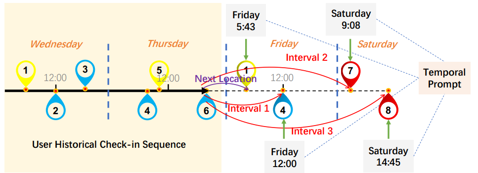

timestamp 정보를 추가 prompt로 활용해서 next , interval location prediction을 진행하는 과정

  

# 2. Motivation

위치 추천 문제는 사용자 여행 경험 향상 및 광고 등 상업적 사용에 있어 매우 중요한 요소이다. 정확한 위치 추천을 위해 기존에는 Markov chain, RNN, GNN 등의 모델들이 제안 되어왔고 최근에는 transformer 기반의 모델들이 social relationship, geography information[8] 등을 포착하고 활용하여 우수한 성능을 보여주고 있다. 하지만 기존의 모델들은 위치 추천 문제에 있어 두 가지 문제점이 존재한다.

첫 번째는 시간 정보를 implictity하게 다른 데이터와 통합해 사용하는 것이다. 기존의 모델들은 check-in data의 시간 정보와 위치 정보 등 다른 정보를 통합하여 embedding vector를 생성한다. 하지만 시간 정보는 다른 정보에 비해 큰 영향을 가진다. 예를 들어 일반적인 사람은 아침에는 직장을 점심에는 식당을 저녁에는 집으로 가는 경향이 있는 것처럼 사람의 특성상 시간 정보는 위치 예측에 있어 중요한 특징이다. 따라서 시간 정보를 다른 특징들과 통합하여 사용하게 되면 모델이 다음 위치 뿐만 아니라 더 먼 미래의 위치를 예측할 때(특히 정확한 시간의 위치를 예측할 때) 유연성과 정확성이 떨어진다. 예를 들어 기존 모델은 이전 100개의 check-in정보를 이용해서 101, 102 번째 위치 예측을 동시에 진행한다면 input이 동일하다는 문제가 발생하고 102번째를 정확히 맞추고 싶다면 다시 101번째까지의 check-in을 학습해야 한다는 문제가 있다. 따라서 TPG 모델은 명시적으로 예측할 시간 정보를 따로 prompt의 형태로 decoder 부분에 제공함으로 시간 정보를 더 잘 반영할 수 있게 해준다. (Temporal Prompt-based Decoder)

두 번째는 지리 정보를 표현함에 있어 hard-boundary 문제를 해결 하지 못했다는 것이다. real-world 데이터에서는 Check-in 데이터의 sparcity 문제로(실제 방문한 check-in 정보만 존재) 인해 위치 간의 물리적 근접성과 의존성을 포착하기 어렵다. 최근 GeoSAN[6] 모델에서 제공한 hierarchical gridding(지리적 좌표를 multi gridding으로 mapping하여 처리) 방식으로 지리 정보를 표현하는 경우 인접한 grid에 위치하는 POI(Point Of Interest)들이 인위적으로 분리되는 hard boundary 문제가 발생한다. 이를 조금더 자세히 설명하면 실제로는 인접한 grid 상에서 붙어있는 지역이지만 서로 다른 grid로 나누어져 인접한 정보를 잃어버리는 것을 말한다. 따라서 TPG 모델은 shifted window 방식을 적용해 grid의 경계 위치에 있는 POI의 지리적 특성도 잘 확인 할 수 있도록 설계되었다. (Geography-aware Encoder)

  

# 3. Method

(TPG 구조)

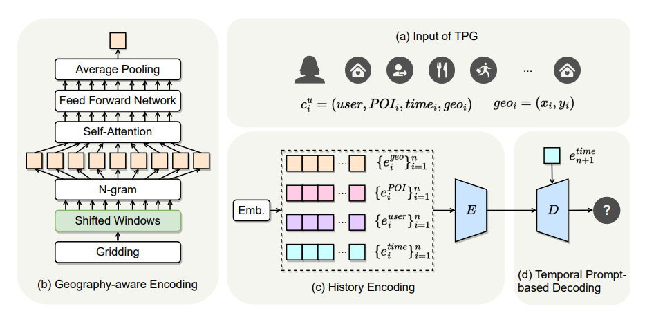

E: transformer Encoder
D: transformer Decoder

## **Preliminaries**

&nbsp;1. **TPG모델 input**: , $c^u_i = (u, t_i, p_i, geo_i)$

→ 각 유저들의 n개의 historical check-in 정보를 이용해 학습 진행한다. $C^u_ {1→n} = \{c^u_i\}^n_{i=1}$

- u: user
- $t_i$: i번째 check-in 시간
- $p_i$: i번째 check-in POI
- $geo_i$: POI의 위도, 경도 정보 → $geo_i = (x_i, y_i)$

💡 최종 목적은 $t_ {n+1}$의 $p_ {n+1}$을 맞추는 것

&nbsp;2. **tile map 방식**(지리 정보를 hierarchical gridding으로 표현한 방식)

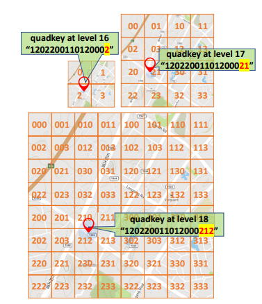

최초에 world-map을 512x512 pixel로 표현하고 level이 증가할 수록 가로, 세로 각각 2배씩 확대되는 방식이다.
- 각 tile은 고유한 quadkey를 가진다. (왼쪽 위를 시작으로 Z 방향으로 0~3값을 부여)
	→ cardinality = 4
- level이 올라갈 수록 각 tile을 하위 4개의 tile들로 나누고 나눠진 tile에는 이전 level의 quadkey에 자신의 위치에 해당하는 고유 숫자를 추가해줘 quadkey를 생성한다.

  

## 3.1 Geography-aware Encoder

위치 embedding을 생성 $(e^{geo}_i)$한다. 중심 grid와 주변 grid의 공간적 연관성이 고려된 vector를 만들어낸다.

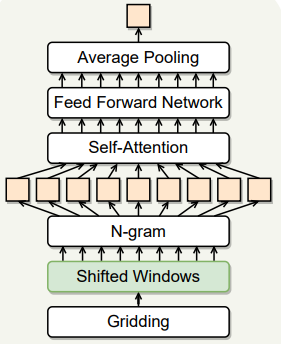

1. POI의 지리적 위치를 tile map 방식으로 grid로 분할한다.
2. shifted window 적용

	-> 기존 grid의 경계를 넘어 인접한 grid와의 연관성을 파악하고자 shifted window를 적용한다.
	
	- **sliding window**: 현재 grid를 중심으로 0.5의 스텝 크기로 window를 이동시켜 상, 하, 좌, 우 및 대각선 방향으로 총 8개의 인접 grid를 찾는다. 아래 그림은 윈도우의 이동을 나타낸다.

		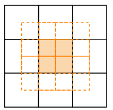

	- **Self-Attention과 n-gram**: Quadkey는 4개의 문자로 이루어진 고유 키(0, 1, 2, 3)로 다양성이 낮아 직접적으로 Self-Attention을 적용하기 어렵다. 따라서, quadkey를 n-gram 방식으로 나누어 각 n-gram 사이의 상관관계를 Self-Attention을 통해 파악한다. 예를 들어, quadkey '0123'는 2-gram으로 '01', '12', '23'로 나뉜다. 앞서 shifted window를 이용해 찾은 8개의 주변 grid와 중심 grid를 모두 n-gram 방식으로 나누고 self-attention을 진행한다. Self-Attention을 통해 각 n-gram 사이의 종속성을 학습한 후, 이를 Feed Forward Network에 입력하여 더욱 정교한 임베딩 벡터를 생성한다.

	- **임베딩 벡터 생성**: Self-Attention과 Feed Forward Network를 거친 결과를 Average Pooling을 통해 POI의 최종 embedding vector($e^{geo}_i$)를 생성한다. 
  
=> 이러한 방법을 통해 기존의 hierarchical gridding 방식으로는 해결할 수 없었던 hard-boundary 문제를 해결한다.

  

## 3.2 History Encoder

  
사용자의 과거 check-in 데이터에 있는 geo, POI, user, time 정보들을 결합해서 하나의 input으로 만들고 transformer encoder를 이용해 학습을 진행한다.

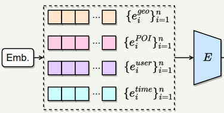

- $e^{time}$: 1주일을 시간으로 처리 24 x 7 = 168차원
- $e^{user}$ : userID에 대한 embedding
- $e^{POI}$ : 고유 POI에 대한 embedding
- $e^{geo}$ : Geography-aware Encoder 결과
	
  
모든 embedding vector들은 동일한 d차원으로 linear projected된다. 이후 모든 embedding을 결합해서 하나의 input ($e^c$)을 생성한다. $e^c = (e^{poi}, e^{user}, e^{time}, e^{geo})$ 이때 $e^c$는 element product or concatenate 2가지 옵션으로 통합 가능하다. 이후 과정은 transformer encoder 구조를 따른다. 입력 값인 $e^c_i$에 먼저 positional encoding을 적용하고 self-attention을 진행한다. 모든 self-attention 결과를 연결해 Multi-head self-attention을 진행한 결과 $e^c_ {i'}$를 얻고 ReLU를 활성화 함수로 가지는 2 layer feed-forward network를 통과해서 최종 encoder output을 얻는다.
  
- $e^c_i = PositionalEmbedding(e^c_i)$
- $\text{ATTENTION}(e^c_i) = w_z \sum_{j=1}^{N_o} \frac{\exp(w_q e^c_i \cdot w_k e^c_j)}{\sum_{m=1}^{N_o} \exp(w_q e^c_i \cdot w_k e^c_m)} w_v e^c_j + e^c_i$
- $FFN(e^c_ {i'}) = max(0, e^c_ {i'}W_1 + b_1)W_2 + b_2$

  

## 3.3 Temporal Prompt-based Decoder

Encoder에 과거 check-in 기록에 대한 시간 정보가 통합되어 있긴 하지만 독립적으로 예측을 진행할 시간 정보를 명시적으로 입력해주면 더욱 우수한 성능을 보일 것으로 예상된다. 따라서 직접 시간 정보를 prompt형식으로 decoder에 query로 넘겨 predict에 고려하도록 설정한다. decoder는 input으로 예측 시간 embedding($e^{time}_ {n+1}$)과 encoder의 output($e^C$)을 입력 받고 $e^{time}_ {n+1}$을 query로, $e^C$를 key, value로 이용해서 multi-head self-attention sub-layer, encoder-decoder attention sub-layer, feed-foward network sub-layer를 통과시키면서 최종 POI를 예측한다.

💡encoder-decoder attention의 구조는 다음과 같다
  - $\text{ATTENTION}(e^C, e^{time}_ {n+1}) = w_z \sum_{j=1}^{N_v} \frac{\exp(w_q e^{time}_ {n+1} \cdot w_k e^C)}{\sum_ {m=1}^{N_v} \exp(w_q e^{time}_ {n+1} \cdot w_k e^C)} w_v e^C + e^C$

  

## 평가 함수
  
- $L_{rec}(\tilde{y}) = -\log(\frac{exp(\tilde{y}y^+)}{exp(\tilde{y}y^+)+\sum_{y^-}exp(\tilde{y}y^-)})$
	- $\tilde{y}$ : 예측 위치 embedding
	- $y^+$: 실제 방문 위치 embedding
	- $y^-$: 실제 방문하지 않은 위치 embedding

  
  

# 4. Experiment

  

## Experiment setup

- Dataset
	- 5가지 real-world Location-Based Social Network datasets(Gowalla, Brightkite, NYC, TKY, SIN)
	- 사용자들 기준 이전 100번의 방문을 학습에 이용한다.(이전 100번 방문이 없는 사용자의 경우 padding 처리)

	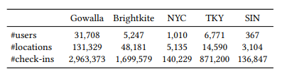

	-> NYC, SIN: 모든 데이터 학습, 나머지: 첫 2000명의 데이터 학습

- baseline
	- HSTLSTM[1]: 시공간 transfer factors를 도입하고 encoder-decoder 구조를 사용하여 예측하는 LSTM 기반 방법.
	- DeepMove[2]: 복잡한 sequential transitions과 multi-level periodicity를 캡처해서 집중적으로 학습한 순환 신경망.
    - LSTPM[3]: 장기 및 단기 선호도를 모델링하는 framework로, 장기 선호도 모델링을 위한 비지역 네트워크와 단기 선호 학습을 위한 geo-dilated RNN으로 구성.
	- CARA[4]: 피드백 시퀀스와 시퀀스에 관련된 컨텍스트 정보를 모두 활용하여 사용자의 동적 선호도를 포착하는 새로운 contextual attention recurrent architecture.
	- TMCA[5]: 다음 관심 지점(POI) 선호 예측을 위해 관련 check-in 활동과 context 요소를 adaptively 하게 선택할 수 있는 새로운 temporal and multi-level context attention LSTM-based encoder-decoder framework.
	- GeoSAN[6]: GPS 위치를 hierarchical gridding으로 표현해 공간적 이산화를 수행하고 self-attention 레이어를 사용하는 geography-aware sequential recommender system.
	- STAN[7]: 연속적인 check-in 뿐만 아니라 경로의 모든 관련 check-in을 명시적으로 집계하는 시공간 attention network.
	- MobTCast[8]: 정확한 위치 예측 분기를 auxiliary task으로 결합한 transformer 기반 context-aware network로 시간적, 의미적, 사회적 및 지리적 컨텍스트를 포착.

- Evaluation metric
	*  k = 5, 10
	- Recall@k
	- NDCG@k : 예측 순위가 높은 걸 맞췄을 때 더 높은 점수를 주는 평가 지표

  

## Result
기본적으로 baseline 모델에서는 user embedding은 추가하지 않고 TPG 모델을 학습했다.

### **next location prediction 결과**

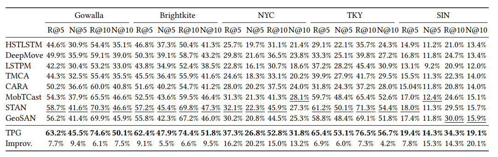

task: 101번째 위치 추천, bold: 최고 성능 모델, 밑줄: 두 번째 최고 성능 모델

- 5가지 dataset에 대해서 TPG모델이 모두 baseline 모델보다 우수한 성능을 보인 것을 확인할 수 있다.
- RNN 기반 모델(HSTLSTM, DeepMove, LSTPM, TMCA, CARA)보다  pure attention 기반 모델(MobTCast, STAN, GeoSAN, TPG)이 전반적으로 우수한 성능을 보이고 있다. 이는 attention mechanism이 check-in 데이터에서 시공간 맥락 정보를 더 잘 포착하기 떄문이다.
- sparsities 지수가 높은 NYC, SIN dataset에서 특히 TPG 모델의 성능이 다른 모델들 보다 우수한 것으로 보아 TPG 모델이 희소한 데이터를 처리하는 능력이 우수하다는 것을 알 수 있다.

	**Sparsities**: Gowalla(0.001), Brightkite(0.007), NYC(0.027), TKY(0.009), SIN(0.12)

	→ sparsity = #check-in / (#user x #location)

###  **Masking location prediction 결과**

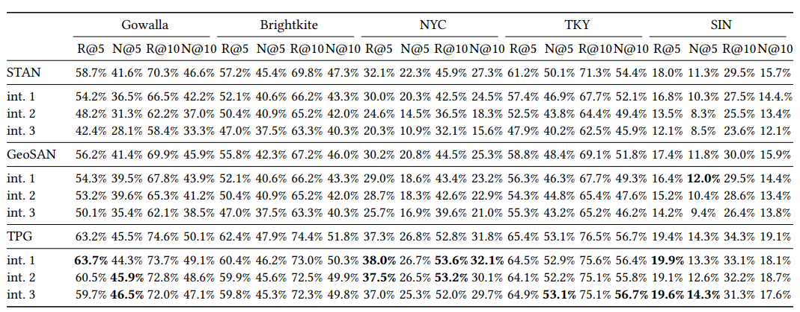

int i : 100번째 기준 이전 i개의 방문을 masking한 데이터셋

더 먼 미래의 상황을 잘 맞추는지 확인하기 위해 100번째, 99번째, 98번째를 masking하고 모델의 성능을 비교한 결과이다. STAN, GeoSAN 모델은 masking 후의 성능이 전반적으로 떨어지는 것에 비해 TPG 모델은 오히려 성능이 올라가는 경우도 있다. 따라서 TPG 모델이 더 먼 미래의 위치를 맞추는데 효과적임을 알 수 있다.

  

## Ablation Study

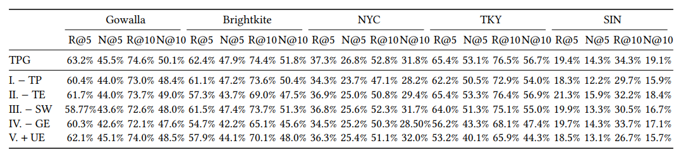

- Remove TP (Temporal-based Prompt)
- Remove TE (Time Embedding)
- Remove SW (Shifted Window Mechanism)
- Remove GE (Geography Encoder)
- Add UE (User Embedding) → baseline에서는 user embeding을 사용하지 않는다. 
  
모델에서 시간 정보를 제거하면(TP, TE) 전반적으로 성능이 나빠지는 것으로 보아 시간 정보가 위치 예측에서 큰 영향을 미치는 것을 확인할 수 있다. 특히 지역 dataset인 Gowalla, Foursquare dataset에서 TP보다 TE의 성능이 우수한 것으로 보아 예측 시간에 대한 정보가 더 중요하게 작용한다는 사실을 알 수 있다.
위치 정보를 제거한 (SW, GE) 결과가 TPG baseline 보다 낮은 성능을 보이는 것으로 보아 shifted window 방식과 위치 정보 표현 방식이 다음 위치 예측에 있어 효과적으로 작용한다는 것을 알 수 있다.
user embedding을 추가 했을떄 TPG 모델의 성능이 나빠진다. 이는 user embedding이 check-in 시퀀스와 위치 벡터의 불일치를 초래할 수 있기 때문이라고 판단된다. 따라서 향후 사용자 정보를 효과적으로 사용해 성능을 향상시키는 방법을 고려해야 할 것이다.

## Parameter Sensitivity Analysis
지리 embedding 차원과 shifted window의 크기가 중요한 파라미터라고 생각되어 두 파라미터에 대해 NYC, TKY dataset을 이용해 Parameter Sensitivity Analysis를 진행했다. 

&nbsp;1. **지리 embedding 차원 변화**

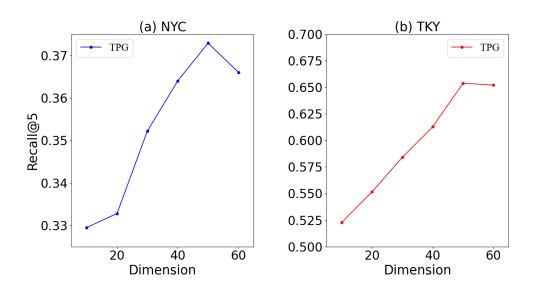

embedding 차원을 10부터 60까지 10단위로 변화시키면서 성능을 비교했다. 
embedding 차원을 증가시킬 수록 성능이 좋아지지만 차원이 50을 넘어가면 성능이 떨저지는 것을 확인하였다. 이는 차원이 낮을때는 지리 정보를 다 표현하기에는 부족한 것으로 보이고 차원이 너무 커지면 반대로 너무 많은 차원으로 noise가 발생 할 수 있음을 보여준다. 최종 TPG모델의 차원은 50이다.

&nbsp;2. **shifted window step size 변화**

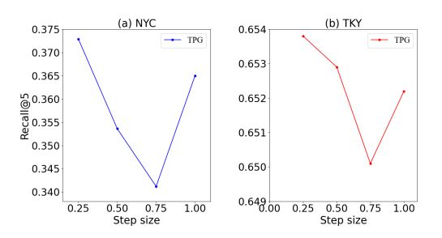

window step size를 0.25 부터 1까지 0.25씩 증가시키면서 확인했다. 여기서 step size는 window의 길이와 grid 크기의 비율을 의미한다. 
그래프를 확인해 봤을때 step size가 0.25일때 예측 성능이 가장 우수했고 0.75까지 증가할 수록 성능이 떨어지는 것을 확인할 수 있다. 비교적 작은 step size(0.25)는 중심 grid와 매우 인접한 주변 grid들의 정보를 집중적으로 분석하면서, 중요한 지역의 정보를 충분히 포착할 수 있기 때문이다. 반면 step size가 0.75로 커질때는 window가 포함하는 범위가 넓어지면서 불필요한 정보도 모델에 포함되면서 중요 정보가 희석된 것으로 볼 수 있다. 흥미롭게도, step size가 1일 때 성능이 다시 증가하는 경향을 보이는데, 이는 window가 각 레벨에서 주변 grid 전체를 포괄하여 집계하는 방식으로 전환되기 때문이다. 이러한 방식은 각 위치에서 지리적 연속성과 인접 grid 간의 상관관계를 보다 직접적으로 고려하게 되어 예측 성능을 향상시키는 것으로 판단된다. 결론적으로 최종 TPG 모델에서 최적의 window step size는 0.25로 설정되었다. 
  

# 5. Conclusion

종합해 보면 TPG모델의 강점은 두 가지가 있다. 첫 번째로 기존 위치 추천 모델들이 간과했던 예측 시간 정보를 직접 prompt를 이용해서 모델에 추가해줘 예측 성능을 높인점이다. 두 번째는 위치 정보를 표현하는 gridding 방식에 shifted window를 적용해서 위치 간 상관 관계를 추가적으로 확인한 점이다.

하지만 개인적으로는 세 가지의 아쉬운 점 및 추가 연구 필요성을 느꼈다. 첫 번째는 어떻게 시간 정보를 prompting 했는지에 대한 설명이 부족하다는 점이다. 시간 정보를 prompting 방법에 따라서도 성능의 차이가 날 수 있을 것으로 예상되므로 추가 prompting에 대한 연구가 필요해 보인다. 두 번째로는 History Encoder 부분에서 geo embedding, POI embedding, time embedding을 결합하는 부분에서 두 가지 결합 방법(element product, concatenate)을 제시했는데 두 방법에 따른 결과를 비교하는 연구가 추가적으로 진행되어야 할 것으로 보인다. 마지막으로 위치, 시간 정보 말고도 baseline으로 제시된 모델에서 적용했던 것과 같이 social relationship[8] 등의 특성들을 embedding에 추가하면 더 우수한 모델을 만들 수 있을 것으로 예상되어 추가 연구가 필요해 보인다.

  

# Author Information

- Author: Hongju Lee
- Affiliation: CDSN Lab in KAIST
- Research Topic: location recommendation system

  

# Reference & Additional materials

[1] Dejiang Kong and Fei Wu. 2018. HST-LSTM: A Hierarchical Spatial-Temporal Long-Short Term Memory Network for Location Prediction. In Proceedings of the International Joint Conference on Artificial Intelligence (IJCAI). 2341–2347
  
[2] Jie Feng, Yong Li, Chao Zhang, Funing Sun, Fanchao Meng, Ang Guo, and Depeng Jin. 2018. DeepMove: Predicting Human Mobility with Attentional Recurrent Networks. In Proceedings of the World Wide Web Conference (WWW). 1459–1468.

[3] Ke Sun, Tieyun Qian, Tong Chen, Yile Liang, Quoc Viet Hung Nguyen, and Hongzhi Yin. 2020. Where to Go Next: Modeling Long- and Short-Term User Preferences for Point-of-Interest Recommendation. In Proceedings of the AAAI Conference on Artificial Intelligence (AAAI). 214–221

[4] Jarana Manotumruksa, Craig Macdonald, and Iadh Ounis. 2018. A Contextual Attention Recurrent Architecture for Context-aware Venue Recommendation. In Proceedings of the ACM International Conference on Research and Development in Information Retrieval (SIGIR). 555–564.

[5] Ranzhen Li, Yanyan Shen, and Yanmin Zhu. 2018. Next Point-of-Interest Recommendation with Temporal and Multi-level Context Attention. In Proceedings of the IEEE International Conference on Data Mining (ICDM). 1110–1115.

[6] Defu Lian, Yongji Wu, Yong Ge, Xing Xie, and Enhong Chen. 2020. Geographyaware Sequential Location Recommendation. In Proceedings of the ACM International Conference on Knowledge Discovery and Data Mining (KDD). 2009–2019.

[7] Yingtao Luo, Qiang Liu, and Zhaocheng Liu. 2021. STAN: Spatio-Temporal Attention Network for Next Location Recommendation. In Proceedings of the World Wide Web Conference (WWW). 2177–2185.

[8] Hao Xue, Flora Salim, Yongli Ren, and Nuria Oliver. 2021. MobTCast: Leveraging Auxiliary Trajectory Forecasting for Human Mobility Prediction. In Advances in Neural Information Processing Systems (NeurIPS). 30380–30391.

## Github, arXiv
- [arxiv 논문 링크](https://arxiv.org/abs/2304.04151)
- [GitHub 저장소 링크](https://github.com/haoyi-duan/TPG)

