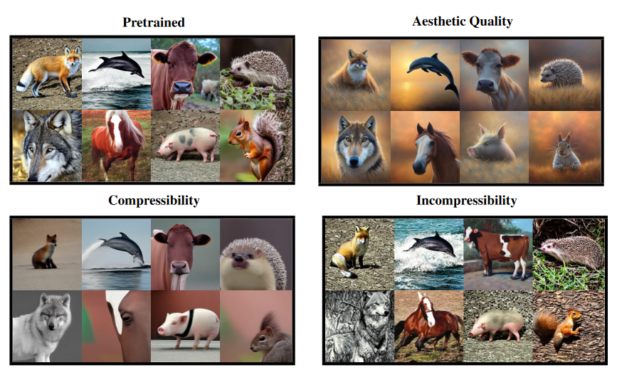
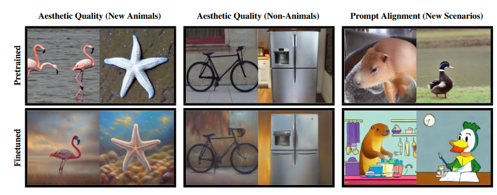

# **[DDPO]Training Diffusion Models with Reinforcement Learning**

## **1. Problem Definition & Motivation**  

Diffusion probabilistic models, 일반적으로 Diffusion model라 칭하는 모델이 최근 Image, Video, Audio, Drug/Material Design, Continuous Control 등 다양한 분야에서 두각을 보이고 있다. 

Diffusion model은 노이즈를 점진적으로 추가하는 forward process 와 이를 역으로 되돌리는 reverse process, 즉 sequential denoising process를 적용함으로서, 간단한 prior distribution을 target distribution으로 변환시킨다.
이를 학습하는 데에는, Maximum likelihood estimation에 기반해 Evidence Lower Bound(ELBO\*)등의 Trick을 이용해 Variational Lower Bound를 Maximize하는 방식을 사용한다.
* ELBO\*:  
$\log p_ \theta(\mathbf{x}) \geq  \mathbb{E}_ {q_\phi}  \left[\frac{\log p_ \theta(\mathbf{z},\mathbf{x})}{\log q_ \phi(\mathbf{z}|\mathbf{x})}\right]$ 

**Limitations:**
하지만 이러한 Likelihood 기반의 학습 방식이 가지고 있는 여러 한계가 존재했다. 
먼저, Likelihood를 직접 최적화 하는 것이 생성된 샘플의 품질 향상과는 직결되지 않는다는 단점이 존재했고(Nichol & Dhariwal, 2021; Kingma et al., 2021), 이를 계산하기 위해 많은 양의 sampling과 복잡한 계산이 필요했다. 이에, 하기 논문 (Ho et al., 2020; Denoising Diffusion Probabilistic Models[DDPM])의 등장으로 부터, 대부분의 Diffusion-based 모델들은 직접적으로 likelihood를 maximize하는 것이 아닌 아래와 같은 Approximation(Denoising Objective)을 minimize하는 방식으로 학습하였다. 
* *Modified Objective Function of Diffusion Models[DDPM]*

$L_ {\text {simple }}(\theta):=\mathbb{E}_ {t, \mathbf{x}_ 0, \boldsymbol{\epsilon}}\left[\left\vert\boldsymbol{\epsilon}-\boldsymbol{\epsilon}_ \theta\left(\sqrt{\bar{\alpha}_ t} \mathbf{x}_ 0+\sqrt{1-\bar{\alpha}_ t} \boldsymbol{\epsilon}, t\right)\right\vert^2\right]$

직접적으로 Diffusion model구조의 data distribution matching에서 Likelihood 연산을 진행하는 것은 계산량이 너무 크기 때문에 (Intractable), 이 논문에서는 denoising process를 **multi-step decision-making task**로 바라보고, 강화학습의  **Policy gradient** 방법을 적용하는 방식 DDPO(Denoising Diffusion Policy Optimization)을 제안한다. 이 모델은  **black-box reward function**과 함께, **Downstream task**에 대한 Likelihood 최적화가 가능함을 보였다.

정리하자면, RL algorithm으로 Diffusion Network를 학습시키는 방식을 제안한 것이다.

## **2. Preliminaries**  

###  2.1 Diffusion Models
(Ho et al., 2020)등의 이전 논문에서, conditional diffusion probabilistic model 은 아래와 같이 정의되며,
* $p(x_ {0}\vert c)$: sample $x_ 0$의 분포, corresponding context $c$
* $q(x_ t\vert x_ {t-1})$: Markovian forward process (점진적 노이즈 추가)
* $\mu_ \theta(x_ t, c, t)$: Reversing forward process (노이즈 제거)에 사용되는 neural net
* $\tilde {\mu}$: Posterial mean of forward process. $x_ 0, x_ t$의 가중평균.

Training은 Log-likelihood 의 Variational lower bound를 maximize함으로서 유도된, 아래 목적식을 최적화 함으로써 진행된다.

$\mathcal{L}_ {\mathrm{DDPM}}(\theta)=\mathbb{E}_ {\left(\mathbf{x}_ 0, \mathbf{c}\right) \sim p\left(\mathbf{x}_ 0, \mathbf{c}\right), t \sim  \mathcal{U}\{0, T\}, \mathbf{x}_ t \sim q\left(\mathbf{x}_ t \mid  \mathbf{x}_ 0\right)}\left[\left\vert\tilde{\boldsymbol{\mu}}\left(\mathbf{x}_ 0, t\right)-\boldsymbol{\mu}_ \theta\left(\mathbf{x}_ t, \mathbf{c}, t\right)\right\vert^2\right]$

Sampling은 random $x_ T \sim \mathcal{N}(\mathbf{0}, \mathbf{I})$ 로 부터, Reverse process $p_ \theta(x_ {t-1} \vert x_ t, c)$를 거쳐 sample $x_ 0$를 얻어내는 방식으로 진행된다.

### 2.2 Markov Decision Process and Reinforcement Learning

마르코프 결정 과정(Markov Decision Process, MDP)은 순차적 의사 결정 문제(sequential decision-making problem)를 수학적으로 정형화한 모델로,  다음과 같은 요소들로 정의된다. 
- $\mathcal{S}:$ 상태 공간(state space)
- $\mathcal{A}:$ 행동 공간(action space)
- $\mathcal{\rho_ 0}:$ 초기 상태 분포(initial state distribution)
- $\mathcal{P}:$ 전이 커널(transition kernel)
- $\mathcal{R}:$ 보상 함수(reward function)

MDP에서 에이전트(agent)는 각 타임스텝(timestep) $t$ 마다 현재 상태(state) $s_ t \in \mathcal{S}$를 관측하고, 정책(policy) $\pi(a\vert s)$에 따라 행동(action) $a_ t \in \mathcal{A}$를 선택한다. 

그 후 환경으로부터 보상(reward) $R(s_ t, a_ t)$을 받고, 전이 커널 $P(s_ {t+1}\vert s_ t, a_ t)$에 따라 다음 상태 $s_{t+1}$로 전이한다. 이런 식으로 에이전트가 환경과 상호작용하며 생성되는 상태-행동의 시퀀스 $\tau = (s_ 0, a_ 0, s_ 1, a_ 1, ..., s_ T, a_ T)$를 트래젝토리(trajectory)라고 한다.

강화학습(Reinforcement Learning, RL)의 목표는 에이전트가 정책 $\pi$를 따라 행동할 때 얻게 되는 기대 누적 보상(expected cumulative reward)을 최대화 하는 것이다. 이는 아래와 같은 수식을 Maximize 함으로서 이루어진다.

$$J_ {RL}(\pi) = \mathbb{E}_ {\tau \sim p(\tau\vert\pi)}\left[\sum_ {t=0}^T R(s_ t, a_ t)\right]$$

## **3. Methods**

### Denoising Diffusion Policy Optimization

먼저, pre-trained or random initialize된 Diffusion model이 존재한다고 가정하자. Diffusion model은 sample distribution $p_ \theta (x_ 0 \vert c)$ (context-conditional distribution)을 유도하며, Denoising diffusion RL의 목적식은 아래와 같은 reward signal $r$을 정의된 sample과 context 하에서 maximize하는 것이다.

$\mathcal{J}_ {\text  {DDRL }}(\theta)=\mathbb{E}_ {\mathbf{c}  \sim p(\mathbf{c}), \mathbf{x}_ 0 \sim p_ \theta\left(\mathbf{x}_ 0 \mid  \mathbf{c}\right)}\left[r\left(\mathbf{x}_ 0, \mathbf{c}\right)\right]$

기본적인 diffusion training에서 크게 벗어나지 않으면서, $\mathcal{J}_ {\text {DDRL}}$을 maximize 하는 방법론으로는 online RL 방식에서 sampling과 training을 반복하는 One-step MDP인 reward-weighted regression (Peters & Schaal, 2007)이라는 방법론이 존재하나, $\pi$에 대한 KL Divergence term이 존재해서, 명확히 말하자면 이는 Optimality에 도달하지 못한다. 

DDPO에서는 DPOK(Diffusion policy optimiation with KL regularization, 유사한 다른 논문)와 같은 Multi-step MDP formulation을 적용한다.

$\begin{array}{lrr}\mathbf{s}_ t \triangleq\left(\mathbf{c}, t, \mathbf{x}_ t\right) &  \pi\left(\mathbf{a}_ t \mid  \mathbf{s}_ t\right) \triangleq p_ \theta\left(\mathbf{x}_ {t-1}  \mid  \mathbf{x}_ t, \mathbf{c}\right) & P\left(\mathbf{s}_ {t+1}  \mid  \mathbf{s}_ t, \mathbf{a}_ t\right) \triangleq\left(\delta_ {\mathbf{c}}, \delta_ {t-1}, \delta_ {\mathbf{x}_ {t-1}}\right) \\\mathbf{a}_ t \triangleq  \mathbf{x}_ {t-1}  &  \rho_ 0\left(\mathbf{s}_ 0\right) \triangleq\left(p(\mathbf{c}), \delta_ T, \mathcal{N}(\mathbf{0}, \mathbf{I})\right) & R\left(\mathbf{s}_ t, \mathbf{a}_ t\right) \triangleq  \begin{cases}r\left(\mathbf{x}_ 0, \mathbf{c}\right) &  \text  { if } t=0 \\0 &  \text  { otherwise }\end{cases}\end{array}$

식에 대해 차례로 설명하자면, 
- context $c$, diffusion index $t$, $t$ 번째 step의 noised sample $x_ t$의 tuple -> state $s_ t$ ; Denoising Network가 받게되는 현재 상태.
- denoising 을 진행하는 context conditioned reverse process를 -> policy $\pi(a_ t \vert s_ t)$ ; Denoising을 하는 주체(reverse process)이자, 학습 대상이므로 이를 Policy로 설정한다.
- Dirac Delta distribution $\delta_ c, \delta_ {t-1}, \delta_ {x_ {t-1}}$의 튜플 -> Transition probability ; 여기서 Dirac Delta는 MDP transition을 Deterministic 하게 (동일한 state, action이 주어질 시 다음 state가 동일하게 정해지게) 유도하기 위한 트릭이라고 이해하면 된다. (이를 통해 최종 state에서 termination 되게 된다.)
- $x_ {t-1}$ -> action $a_ t$ ; Policy인 reverse process에서 뽑아내는 $x_ {t-1}$이 action과 같은 역할이 된다.
- context probability $p(c)$, $\delta_T$, Multivariate standard normal distribution 의 tuple -> initial state distribution; 이는 시작지점에 대한 확률분포로 Diffusion Process 시작지점으로서 생각할 수 있다.
- 보상함수 $R(s_ t, a_ t)$는 denoised 된 step $t$에 도달하는 경우에만 주는 것으로 정의한다. 원본 데이터에 얼마나 가까운지로 보상을 준다고 생각하면 된다.

복잡해 보이나, 핵심은 Diffusion model에서 사용되는 component들을 Multi-step MDP의 형태로 formulate 했다는 점이다. 즉 Diffusion Model 의 큰 틀은 변하지 않지만 보는 방식을 다르게 했다는 것이다.

이런 방식으로 Diffusion component들을 MDP로 변환하면, log-likelihood (여기서는 Policy)를 구할 수 있음과 더불어, diffusion model 파라미터에 대한 gradient(여기서는 Policy Gradient)도 구할 수 있게 된다.

**Policy gradient estimation** 

Likelihood, 그리고 likelihood의 gradient에 대해 직접적으로 access가 가능하게 되면서, $\nabla_ \theta \mathcal{J}_ {\text{DDRL}}$에 대한 Monte Carlo estimation을 진행할 수 있다.

Sampling과 parameter update를 통해 trajectories $\{x_ T, x_ {T-1}, ... , x_ 0\}$ 를 수집하고 Policy gradient 의 대표적인 알고리즘 REINFORCE(Williams, 1992; Mohamed et al., 2020)을 사용함으로서 아래와 같은 estimation을 얻을 수 있다.

$\nabla_ \theta  \mathcal{J}_ {\mathrm{DDRL}}=\mathbb{E}\left[\sum_ {t=0}^T \nabla_ \theta  \log p_ \theta\left(\mathbf{x}_ {t-1}  \mid  \mathbf{x}_ t, \mathbf{c}\right) r\left(\mathbf{x}_ 0, \mathbf{c}\right)\right]$

위 식은 REINFORCE algorithm에서 context condition이 추가된 형태다. 논문에서는 이를 DDPO-SF로 명시한다. (Score function Policy gradient estimator)

하지만 MC approach의 특성상 data collection마다 한 step의 optimization만 가능하기 때문에, 여러번의 optimization을 사용하기 위해서는 importance sampling estimator를 적용할 수 있다.

$\nabla_ \theta  \mathcal{J}_ {\mathrm{DDRL}}=\mathbb{E}\left[\sum_ {t=0}^T \frac{p_ \theta\left(\mathbf{x}_ {t-1}  \mid  \mathbf{x}_ t, \mathbf{c}\right)}{p_ {\theta_ {\text  {old }}}\left(\mathbf{x}_ {t-1}  \mid  \mathbf{x}_ t, \mathbf{c}\right)}  \nabla_ \theta  \log p_ \theta\left(\mathbf{x}_ {t-1}  \mid  \mathbf{x}_ t, \mathbf{c}\right) r\left(\mathbf{x}_ 0, \mathbf{c}\right)\right]$

이를 논문에서는 DDPO-IS (Importance sampling Policy gradient estimator) 라고 명시한다.
* Importance sampling 방식은, offline policy  혹은 offline-RL등에서 주로 사용하는 방법으로, update시에 변화하는 policy에 대해, 다른 policy에서 얻은 정보를 사용하면서도 optimality를 유지하기 위한 방법이다. 

다만 이 방법을 사용했을 때, policy 가 너무 많이 Update 되어 버리면(old policy와 current policy의 차이가 많이 나면) estimation에 문제가 생길 수 있기 때문에 (Importance sampling weight가 explode 혹은 vanish), Implementation에서는 TRPO에서의 Trust region이나 PPO의 clipping등의 방식을 적용해야 한다. 논문에서는 clipping method를 사용하였다.

### Reward functions for text-to-image diffusion
DDPO Equation을 살펴보면, 대부분의 component들은 Diffusion component들에서 명시되어 있으나, 구체적으로 어떤 방식으로 Reward를 줄 지에 대해서는 결정이 필요하다. 논문에서는 세 가지 방식의 reward를 사용했다.

**1. Compressibility and Incompressibility**

Text-to-image diffusion model은 학습시, text-image의 co-occurence로 학습을 진행하기 때문에, prompt를 이용해 file size를 명시하는 것이 어렵다. 주로 image에 대한 caption에 file size(kb, mb, gb)를 명시하지 않으므로 (EX: "고양이가 생선을 먹고있는 사진" 으로 파일 사이즈 없이 captioning이 달리므로)모델이 파일크기에 대한 정보를 수급하지 못한다. 이에 논문에서는 diffusion model의 sample들을 512x512로 고정하고, Reward로 file-size를 조정함으로서 얼마나 원본이미지의 중요한 성질을 유지하며 잘 압축시켰는지(compressibility)혹은 그 반대로 얼마나 원본 이미지 보다 더 세밀하게 구현했는지(Incompressibility)등을 하나의 지표로 사용하였다.

**2. Aesthetic Quality**

두 번째로 사용한 방식은, LAION aesthetics predictor를 reward function으로 사용해, 모델에서 생성해낸 이미지의 예술성 척도를 Reward로 사용해, 더 aesthetic 한 이미지를 생성하는 objective로 적용하였다.

**3. Automated Prompt Alignment with Vision-Language Models**

마지막으로, 인간이 직접 reward를 labeling하는 방식을 적용하면 RLHF(Reinforcement Learning with human feedback)방식이 되나, 논문에서는 이러한 Labeling 과정을 vision-language model(VLM)에서의 feedback으로 대체하였다.

위 figure가 논문에서 사용한 VLM의 예시인데, 먼저 prompt("a monkey washing dishes")를 Diffusion model에 입력해 이미지를 생성한다. 그 다음 LLaVA(Liu et al., 2023)모델에 이미지와  이미지에 대한 짧은 설명을 달라는 prompt를 함께 제공함으로서, short description을 얻는다. 처음에 입력했던 prompt와 요약된 설명의 bert similarity를 계산해 이를 reward로 사용한다. 

직관적으로 생각해 보면, prompt를 통해 생성한 이미지가 과연 그 prompt 에 맞춰 제대로 이미지를 생성해 냈는지를 확인할 수 있는 지표가 된다.

## **4. Experiment**  

논문에서 Experiment 의 목적은, User-specified objective들 (reward 세팅으로 정해짐) 에 대해서 RL algorithm으로 Diffusion model을 fine-tuning 하는 방식이 과연 효과적인가를 판단함에 있다. 특히 아래 세 가지 질문들에 답할 수 있는가에 집중하였다.
1. DDPO와, 기존 방식 RWR(Reward-weighted Regression) 간의 비교
2. VLM 방식이 인간이 수동으로 Labeling하기 힘든 부분들에 대한 대안책이 될 수 있는가?
3. RL fine-tuning이 fine-tuning 과정에서 보지 못했던 prompt 들에 대해서도 generalization이 가능한가? (overfit이 일어나지 않는가?)

**Experiment Settings**

- 모든 Experiments들에 대한 Base model로는 Stable Diffusion v1.4(Rombach et al., 2022)를 사용하였다.

- 학습에 사용된 이미지들은 ImageNet-1000 category의 398개의 동물이미지를 Uniform하게 sampling한 이미지로, Compressibility, Incompressibility에서는 이를 모두 이용해 Fine-tuning을 진행했다. 

- Aesthetic quality prompt의 경우에만 조금 더 작은 45 categories의 동물이미지를 사용하였다. 

각 실험별 상세한 Setting들은 내용 설명과 함께 진행하겠다.

### Algorithm Comparisons
논문에서는 먼저 전반적 성능 확인을 위해 Reward Setting 1, 2번에 대한 결과를 이전 알고리즘(RWR)과 대비해 분석한다.

위 그림은 서로 다른 reward function에 대한 RL Fine-tuned Result이다. 정성적 관점에서, Aesthetic Quality에서는 기본 pre-trained 이미지에 비해 훨씬 예술적인(빛의 구도 등) 이미지를 연출하며, compressibility에서는 이미지 내에서 가장 중요한 부분들을 살리고 나머지는 간소화 한 것을 확인 할 수 있다. 반대로 Incompressibility에서는 file 크기를 늘리기 위해 이미지 내의 세세한 부분들을 선명하게 구현하였음을 확인할 수 있다.

Reward 지표를 바탕으로한 정량적 분석에서는 DDPO 방식이 기존의 방법론 RWR에 비해 훨씬 지표상으로 많은 Reward를 얻었음을 확인할 수 있다. 또한 Importance sampling 기법을 사용한 것이 Monte Carlo based approach(REINFORCE)에 비해 약간 더 나은 성능을 보였다.

### Automated Prompt Alignment
다음으로, VLM 방식의 효과성을 확인하기 위해, 이전 task들에서 가장 성능이 좋았던 DDPO-IS를 바탕으로, 실험을 진행했다.

Prompt Setting은 "a(n) [animal] [activity]"를 베이스로, animal의 경우 Aesthetic에서 사용된 45개의 동물 카테고리를 사용였고, activity의 경우 "riding a bike", "playing chess", 그리고 "washing dishes" 세 가지만 사용하였다.

위 그림은 pretrained 된 stable diffusion으로부터, fine-tuning이 진행될수록 변하는 이미지를 나타내고 있다. 가장 위 "a dolphin riding a bike"를 먼저 살펴보면, pretrained된 상태에서는 이와 유사한 이미지를 생성하지도 못하지만, fine-tuning을 진행하면서 점점 faithful한 이미지를 생성해 냄을 확인할 수 있다.

그림 우측의 Prompt Alignment Score 에서도 역시 Training Sequence들이 진행되면서 Bert Score 향상의 유의미한 지표를 보여주고 있다.

논문에서 Fine-tuning이 이루어지며 점점 Cartoon 풍의 이미지로 변한다는 사실을 짚었는데, 이에 대한 해석으로 저자들은 "동물이 사람이 하는 행동을 하는 Image들 자체가 주로 만화에서 등장해서" 라고 이를 분석하였다.

### Generalization
RL Finetuning이 Generalization Property를 띈다는 다른 논문 (English instruction이 다른 언어에 대한 capability  역시 상승시켰다는 내용; Ouyang et al., 2022) 의 결과와 마찬가지로, 동물 이미지로 학습한 DDPO에 대해 보지 못했던 새로운 동물, 동물이 아닌 사물, 그리고 새로운 시나리오(앞서 언급한 3가지 행동 prompt가 아닌)에 대해서도 일반적으로 좋은 성능을 냄을 확인할 수 있었다.

위 그림에서는 학습 때 사용하지 않았던 홍학, 불가사리, 그리고 사물인 자전거와 냉장고 이미지에서도 Aesthetic fine-tuned 상황에서 이러한 특징을 잘 살리고 있음을 확인할 수 있다. 또한, "a capybara washing dishes" 나 "a duck taking an exam"과 같은 새로운 동물 + 시나리오에 대해서도 그럴듯한 이미지를 생성해 냄을 확인할 수 있다. 
  
## **5. Conclusion**  

이 논문에서는 DDPO(Denoising Diffusion Policy Optimization)를 제시해, 기존의 Diffusion model components들을 Multi-step MDP로 재정의하고, 이전 방법론(RWR)의 Suboptimality 한계를 강화학습의 Policy gradient update를 적용함으로서 극복해 Downstream task fine-tuning 성능을 향상시켰다.

더 나아가 논문은 Stable Diffusion과 같은 text-to-image 모델에 대해, Policy gradient 에 필요한 Reward function을 다양하게 설정하는 방식으로 User-specific objective를 정의하는 방법을 제시하였다. 실제 실험 결과를 통해 이러한 RL-based fine-tuning이 미리 설정된 Reward function 에 따라 효과적으로 목적을 달성함을 확인하였으며, Data-specific 하지 않고 generalization이 가능함을 증명해 보였다. 특히 LLM등에서 사용되어 파장을 일으켰던 RLHF 방법론을  VLM(Vision Language Model)등을 이용해 유저 라벨링 없이도 이용이 가능하게 설계했다는 점에서 상당한 의의가 있다.

논문에서는 Text-to-image에 한정하여 실험을 진행하였으나, Diffusion 기반 모델들의 Fine-tuning에 RL방법론을 사용할 수 있다는 점은 이 논문이 훨씬 다양한 분야로 확장이 가능함을 의미한다. 

또한, Likelihood Maximization 에 대해, Policy gradient 방법론을 적용함으로서, 조금 더 Optimality에 다다르게 밀어넣을 수 있다는 점은, MDP formulation이 가능한 MLE base의 다양한 모델에 적용해 볼 만하다는 점에서 여러 색다른 접근이 가능하다고 해석할 수 있겠다.

---  
## **Author Information**  

* Kiyoung Om
    * Affiliation: [SILAB@Kaist](http://silab.kaist.ac.kr/)
    * Research Topic: Offline-RL, Reinforcement Learning
    * Contact: se99an@kaist.ac.kr

## **6. Reference & Additional materials**  

* Github Implementation  
	* Official codes : [DDPO](https://github.com/jannerm/ddpo)
	* Website: [DDPO official explanation](https://rl-diffusion.github.io/)
* Reference  
	* Paper: [Training Diffusion Models with Reinforcement Learning](https://arxiv.org/abs/2305.13301)
* Other References
	* [Denoising Diffusion Probabilistic Models](https://arxiv.org/abs/2006.11239)
	* [DPOK: Reinforcement Learning for Fine-tuning Text-to-Image Diffusion Models](https://arxiv.org/abs/2305.16381)
	* [Policy Gradient Methods for Reinforcement Learning with Function Approximation](https://proceedings.neurips.cc/paper/1999/file/464d828b85b0bed98e80ade0a5c43b0f-Paper.pdf) 
    * [Reinforcement Learning by Reward-weighted Regression for Operational Space Control](https://is.mpg.de/fileadmin/user_upload/files/publications/ICML2007-Peters_4493%5B0%5D.pdf)