## **0. Preliminary**

### 1. N-shot Learning
[종류]
- Zero-Shot Learning: 모델이 class에 해당하는 데이터가 존재하지 않을 때 기존의 학습한 지식을 바탕으로 학습하는 방식. Zero-shot learning은 모델이 학습 과정에서 특정 클래스에 대한 데이터를 접하지 않았음에도 불구하고, 기존에 학습한 지식을 바탕으로 새로운 클래스를 예측할 수 있는 능력을 말합니다. 이는 주로 사전 학습된 모델이 가지는 일반화 능력에 의존합니다.

- One-Shot Learning: 모델이 class당 1개의 데이터가 존재할 때 학습하는 방식. One-shot learning은  제한된 데이터 환경에서 새로운 클래스를 인식할 수 있도록 모델을 훈련시키는 것을 목표로 합니다.

- Few-Shot Learning: 모델이 class 당 2-5(일반적으로 10개 미만)개의 데이터가 존재할 때 학습하는 방식. Few-shot learning은 데이터가 매우 제한적인 상황에서도 모델이 학습하고 일반화할 수 있는 능력을 개발하는 데 중점을 둡니다.

[개념]

- way : 데이터 클래스 개수
- shot, point : 데이터의 개수
- query : tets data
- source : train data

[방법]
- few shot learning을 위한 방법 : Meta Learning, Transfer Learning(Fine-tuning)

1.  Transfer Learning
Transfer learning은 사전 학습된 모델을 활용하여 소량의 데이터로 재학습(fine-tuning)하는 방식입니다. 특히, multi-task learning에서는 사전 학습된 모델을 불러와 각각의 작업(Task)에 맞게 fine-tuning합니다.

    1. 대량의 데이터로 사전 학습 모델을 생성합니다.
    2. 사전 학습 모델의 weight를 그대로 가져온 뒤 각 task에 맞도록 fine-tuning 데이터로 재학습해서 모델을 생성합니다.

2.  Meta Learning
Meta learning은 Learn to learn으로 학습 방법을 학습하는 방식입니다. 여러 개의 작업(Task)을 동시에 학습하고 각 작업 간의 차이를 학습합니다. 이를 통해 소량의 데이터로도 추론할 수 있는 범용적인 모델을 생성합니다.

    1. Source Data 학습 데이터로 학습 한 뒤에 Target Data 시험 데이터로 loss를 계산합니다.
    2. 계산된 loss를 초기모델 learner, meta-learner에 최적화합니다.
    3. 여러 개의 Support data, Query data로 이 과정을 반복합니다.
    

- transfer learning과 다르게 support data, query data로 나누는 과정이 필요합니다. 이 나누는 방법 중 하나가 에피소드 학습 방법입니다.

    - Episode Learning : 

        Multi-class classification을 가정해 봅시다. 기존 방식에서는 전체 데이터셋을 학습 데이터(Train data)로 80%, 시험 데이터(Test data)로 20% 정도로 나누어 학습한 후 성능을 평가했습니다. 반면, 에피소드 방식에서는 한 번에 모든 클래스를 활용하지 않고, 2개의 클래스를 여러 에피소드로 만들어 각 에피소드 별로 분류기를 학습시킵니다.

    **[학습 방식]**

        1. Train-test data split
            전체 학습 데이터를 메타 훈련 Meta-train dataset, 메타 테스트 Meta-test dataset으로 나눕니다. 이때 메타 테스트에 구성된 데이터 클래스는 메타 훈련에 등장하지 않은 클래스입니다.
        2. Task Sampling
            메타 훈련 데이터를 각 Task 데이터로 쪼갭니다. 전체 클래스 중 일부 클래스(일반적으로 2개) 데이터가 한 Task에 샘플링이 됩니다. 여기서 각 Task를 Episode라고 부릅니다.
        3. Support query dataset split
            각 task별 데이터를 다시 support set(training set), query set(test set)으로 샘플링합니다.
        4. Task Training
            각 task로 학습을 진행하여 모델을 생성합니다.
        5. Meta test evalution
            생성된 모델에 메타 테스트의 서포트셋으로 새로운 이미지 클래스를 학습시키고, 최종적으로 메타 테스트의 쿼리 셋을 분류해내는 것이 목적입니다.

    **[학습 목표]**

        메타 테스트에 포함된 새로운 클래스의 데이터를 일부 support 데이터로 훈련한 뒤, 메타 테스트의 query 데이터를 정확하게 분류할 수 있는지를 평가합니다.

        각 Task마다 최적의 파라미터가 다르기 때문에 모든 Task의 파라미터를 추정하는 것은 의미가 없습니다. 대신 데이터 특성과 Task 파라미터 간의 정보를 학습하는 것이 중요합니다. 새로운 데이터가 들어오면 이 정보를 통해 추정합니다. 이러한 추정 방법에는 세 가지가 있습니다.

    **[학습 방법]**

        1. Metric-based Approach : 거리 기반 학습
        - Embedding function : 학습 데이터를 저차원의 공간에 매핑합니다.
        - Distance : 새로운 데이터가 들어오면 저차원 공간에 매핑한 다음 임베딩 공간에서 제일 가까운 클래스로 분류합니다.
        - ex ) 샴 네트워크, matching network, prototype network

        2. Model based Approach : 모델 기반 학습
        - 모델 내부나 외부에 기억장치를 통해 학습 속도를 조절합니다.
        - 모델은 몇번의 training step 만으로도 파라미터를 빠르게 찾는 게 가능해짐 
        - ex ) memory network, NTM, MANN

        3. Optimization based Approach : 최적화 기반 학습
        - 각 task의 최적 파라미터를 구할 수 있는 초기 파라미터를 최적화합니다.
        - ex ) MAML, first order MAML, reptile

### 2. Attention Mechanism (Multihead Attention)
1. 어텐션 메커니즘
    - 사람이 하나에 집중하는 것처럼 입력 데이터의 중요한 부분에 집중할 수 있게 하는 매커니즘입니다. 주로 쿼리, 키, 값와 같은 세 가지 벡터를 이용하여 입력 시퀀스의 가중 합을 계산합니다.
    - 쿼리, 키, 값 벡터는 동일한 입력 데이터로부터 다른 가중치를 적용해 생성됩니다. 어텐션 가중치는 쿼리와 키 간의 유사도 계산하여 얻어집니다.

2. 멀티헤드 어텐션
    - 멀티헤드 어텐션은 여러 개의 어텐션 헤드를 병렬로 사용하여 서로 다른 부분의 상호 작용을 독립적으로 학습할 수 있게 합니다.
    - 각 어텐션 헤드는 입력 데이터에 대해 다른 프로젝션을 수행하며, 이를 통해 다양한 표현 공간에서 입력 데이터를 학습할 수 있습니다.
    - 과정
        1. 입력 프로젝션 : 입력 데이터(쿼리, 키, 값)을 여러 개의 헤드로 분할하여 각각 다른 가중치 행렬을 적용합니다. 이를 통해 각 헤드가 독립적으로 어텐션을 계산할 수 있습니다.
        2. 어텐션 계산 : 각 헤드는 쿼리, 키, 값 벡터를 사용하여 어텐션 가중치를 계산하고, 이릍 통해 가중합을 계산합니다. 이때 사용되는 어텐션 방식으로 주로 scaled-dot-product 어텐션입니다.
            - 쿼리와 키 간의 dot product를 계산하여 키의 차원 수의 제곱근으로 나누어 스케일링합니다. 그런 다음 소프트 맥스 함수를 적용하여 가중치를 정규화합니다.(섹션 3.3.3 수식 참조)
        3. 어텐션 결합 : 각 헤드의 어텐션 출력을 결합하여 하나의 벡터로 만듭니다.
        4. 최종 프로젝션 : 결합된 벡터에 다시 가중치 행렬을 곱하여 최종 출력을 만듭니다.
        

 

## **1. Problem Definition**  

### Computer Vision in a nutshell(tasks)
CV에서는 아래와 같은 task들을 주로 다룹니다.
- 이게 어떤 장면을 나타내는지
- 어떤 object가 있는지(object의 종류가 무엇인지)
- object가 어디에 있는지
- 얼마나 많은 object가 있는지
- object가 어느 영역에 있는지
- 카메라로부터 object까지 얼마나 떨어져있는지(거리)
- object의 기하학인 표면이 어디에 있는지

### Dense prediction task con situtes a fundamental class in CV
- CV의 많은 task들이 이러한 함수의 형태로 나타내게 됩니다. H * W 해상도의 이미지를 입력했을 때, 같은 크기의 H * W 크기로 출력하는 CV에서 중요한 task의 집합입니다. 각 task 마다 픽셀별로 정답을 내뱉는다는 의미입니다.
-  $ \tau = \mathbb{R}^{H \times W \times 3} \rightarrow \mathbb{R}^{H \times W \times C_\tau}, C_\tau \in \mathbb{N}$

    - H : 이미지의 높이
    - W : 이미지의 넓이

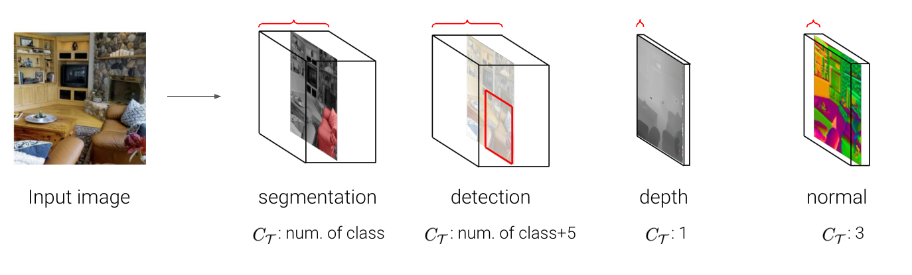
- 각 taks는 output 채널 수나, label의 차원이나, semantic과 같은 고유한 출력 구조를 가지고 있습니다.
    - ex : image > semantic segmatation $C_\tau$ : # of class, object detection $C_\tau$ : # of class + 5, depth estimation $C_\tau$ : 1, surface normal estimation $C_\tau$ : 3
- 이때까지는 각 task를 풀기 위해 다른 네트워크들이 사용되어 왔습니다.

### Supervised learning of dense prediction tasks
- 지도학습은 많은 양의 labeled data(사람이 직접 이미지를 설명하는 정답을 입력한 것)set을 이용하여 모델을 학습합니다. 이러한 지도학습의 문제점이 존재합니다.
    1.  많은 비용과 사람의 노동력이 필요할 수 있습니다.
    2.  특정한 이유로 데이터를 많이 모을 수 없습니다. (병원의 민감정보, 희귀한 경우 등)
    3.  task 자체가 지속적으로 변화할 수 있습니다. 따라서 바뀌는 task에 맞춰 데이터셋을 변화하여 모을 수 없습니다.

### Few-shot learning for dense prediction tasks
- 지도학습의 문제점을 해결하기 위해 즉, 데이터를 많이 모을 수 없는 경우 적은 labeled data를 가지고 모델을 학습하는 few-shot learning 방법을 사용합니다.
- $\hat{Y}^q = \mathcal{F}(X^q; S_\tau),   S_\tau = {(X^i, Y^i)}_{i\leq	N}$
    - $\hat{Y}^q$ : 맞춰야 할 query image의 label
    - $X^q$ : query image
    - $S_\tau$ : support set, 우리가 알고 있는 몇 장 안 되는 label이 달린 image set을 의미합니다.

### Problems in existing methods for few-shot learning
- 기존 방법들의 문제점은 특정한 task 종류에 한해서 적용되는 것입니다. 즉 다른 task로 적용이 되지 않아 일반화가 어렵습니다.

## **2. Motivation**  

- Can we design a universal few-shot learner that can flexibly adapt to unseen, arbitrary dense prediction tasks depending on a few labeled data?
- 모든 종류의 dense prediction task에서 few-shot learning을 할 수 있는 universal한 few-shot learner를 만드는 것이 목표입니다.
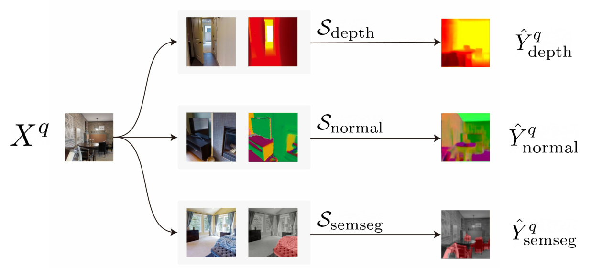
    - depth estimation을 support set으로 넣어주면, 풀고싶은 task를 사전에 학습하지 않고도 depth estimation 모델을 학습하여 출력합니다.
    - 다른 방법인 surface normal estimation, semantic segmentation 등도 마찬가지로 적용됩니다.

### Challenges
- Handling arbitrary number of channels in various tasks : 각 task 마다 요구하는 채널의 개수가 달라서 이를 handling 해야합니다. 즉 다양한 채널의 개수로 출력하게 하는 점이 어렵습니다.
- Designing a task-agnostic architecture : task 자체가 매우 달라서 task에 상관없이 작동하는 하나의 네트워크 아키텍쳐를 디자인해야합니다. task 중 semantic sementation은 물체의 종류를 예측하는 고차원의 task임에 반면에 depth estimation은 픽셀과 카메라 간의 거리만 예측하는 것으로 매우 다른 task입니다.
- Designing an efficient adaptation mechanism : task 매우 다르므로 하나의 아키텍쳐를 각 task에 맞게끔 adaptation mechanism 적응 메커니즘이 필요합니다.

## **3. Method**  

### 1. Handling arbitrary number of channels $\rightarrow$ Decomposing a task into multiple single-channel subtasks
-  $ \tau = \mathbb{R}^{H \times W \times 3} \rightarrow \mathbb{R}^{H \times W \times C_\tau}, C_\tau \in \mathbb{N}$
여러 개 채널이 있을 때 채널 각각을 하나의 single channel label로 독립적으로 추론합니다.
- $ \tau_c = \mathbb{R}^{H \times W \times 3} \rightarrow \mathbb{R}^{H \times W \times 1}, \; where \; \tau \in {\tau_1, ..., \tau_{c_\tau}}$ multiple 채널의 task를 채널이 1개인 task $C_\tau$개로 바꾸어 예측하고 그 예측값을 원래의 task의 예측으로 사용하였습니다.

### 2. Designing a task-agnostic few-shot learner
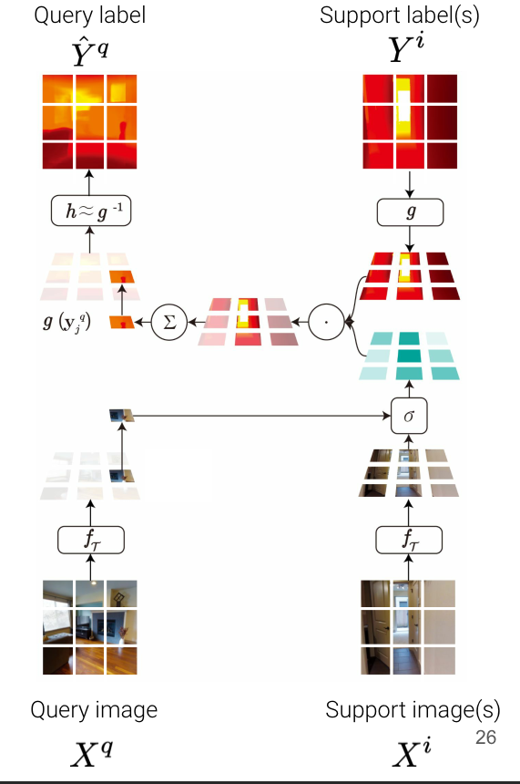

- Patch-wise matching on embedding space
    - patch 단위로 나누는 이유 : dense prediction이기 때문에 local 정보가 중요할 수 있습니다. 따라서 이미지를 통째로 사용하는 것보다 패치 단위로 나누어 패치 각각을 매칭하였습니다.    
    차별점)
    매칭은 few-shot learning에서 많이 쓰이는 기법 중 하나입니다. 일반적인 매칭과의 차별점은 이미지를 그대로 잘라서 매칭하지 않고 dense prediction을 위해 local하게 patch 단위로 나누고 label도 encoding하여 embedding space 안에서 매칭을 한다는 점입니다.
- $g(\textbf{y}^q_j = \sum_{i<=N} \sum_{k<=M} \sigma(f_\tau(\textbf{x}^q_j),f_\tau(\textbf{x}^i_k) )\;\cdot \; g(\textbf{y}^i_k)$
    - $\textbf{x}^q_j$ : query image patch(j-th) 맞추고 싶은 쿼리 이미지를 패치 단위로 자른 것 중 하나를 의미합니다.
    - $\textbf{x}^i_k$ : support image patch(k-th patch from i-th image) 정답을 알고 있는 이미지를 패치 단위로 자른 것 중 하나를 의미합니다.
    - $\textbf{y}^i_k$ : support label patch(k-th patch from i-th label) 정답을 알고 있는 이미지의 라벨을 패치 단위로 자른 것 중 하나를 의미합니다.

    - $f_\tau$ : Compute embedding of the query and support images by the shared iamge encoder $f_\tau$
    - $g$ : Embedding of the support labels by the label encoder $g$
        - encoder network를 통해서 abstract space로 보냅니다. 각각의 patch에서 embeddnig을 뽑고 그 embedding에 대해서 매칭을 진행합니다. 

    - $\sigma(f_\tau(\textbf{x}^q_j),f_\tau(\textbf{x}^i_k)) $ : Compute the pairwise similarity between the embedded image patches by the similarity measure $\sigma : \mathbb{R}^d \times \mathbb{R}^d \rightarrow [0, 1]$
        - query의 embedding vector와 모든 support image의 embedding vector들 간의 similarity를 계산합니다. 따라서 특정 쿼리 패치 하나당 서포트 패치 개수만큼 similarity가 도출됩니다.
    - $\sum_{i<=N} \sum_{k<=M} \sigma(f_\tau(\textbf{x}^q_j),f_\tau(\textbf{x}^i_k) )\;\cdot \; g(\textbf{y}^i_k)$ : Aggregate the embedding of the label patches based on the image-level similarity. This gives us the embedding of the corresponding query label patch.
        - 이 similarity를 weight로 사용하여 weighted sum을 계산합니다. 특정한 서포트 패치와 맞추고 싶은 쿼리의 패치랑 비슷하다면 서포트 패치의 label의 가중치를 많이 주고, 반대도 마찬가지로 가중치를 적게 주어서 결과적으로 비슷한 것끼리 매칭하여 비슷한 이미지의 label을 가져오게 합니다.
    - $h \approx g^{-1}$ : Convert the query label embedding into the original label space by the decoder h 
        - $\hat{\textbf{y}}^q_j = h(g(\textbf{y}^q_j))$
        - weight는 label의 embedding space에 있으니까 다시 h decoder를 이용하여 label space로 보냅니다.
    - Parameterization of encoders
        - Image encoder : $f_\tau(\textbf{x}) =f(\textbf{x};\theta, \theta_\tau) $
        - Label encoder : $g(\textbf{y}) =g(\textbf{y};\phi) $
        - Label decoder : $h(g(\textbf{y})) = h(g(\textbf{y}); \psi)$
        이미지 인코더는 태스크마다 일부의 파라미터를 따로 둬서 학습합니다. similarity가 task의 성질을 결정하는데 중요한 역할을 하게 됩니다. 태스크마다 유사도를 다르게 측정하기 위해서 이미지 인코더에 $\theta_\tau$ 를 넣었습니다. 
    

### **3. Visual Token Matching (VTM) network**
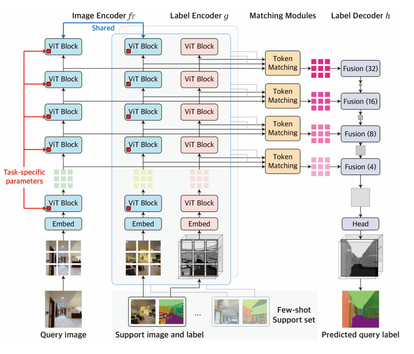

0. ViT Vision Transformer ViT(Dosovitskiy et al., 2020) 기반
    - 모델은 계층적인 인코더-디코더 아키텍쳐이며, 다중 계층에서 패치 수준의 비매개변수 매칭을 구현하는 네 가지 구성요소인 이미지 인코더, 라벨 인코더, 라벨 디코더, 매칭 모듈이 있습니다. 쿼리 이미지와 서포트 세트가 주어지면, 이미지 인코더는 각각 쿼리와 이미지 패치 수준 임베딩(토큰) 형태로 특징을 독립적으로 추출합니다. 라벨 인코더는 유사하게 각 서포트 라벨의 토큰을 추출합니다. 각 계층의 토큰이 주어지면, 매칭 모듈은 비매개변수 매칭을 수행하여 쿼리 라벨의 토큰을 추론하고, 라벨 디코더는 이를 통해 원시 쿼리 라벨을 형성합니다.
    이미지가 주어지면 로컬한 패치가 아니라 self-attention이라는 레이어를 통해서 특징을 추출합니다. 이 특징을 추출하면 토큰이 여러 개 나오게 되고, 토큰 하나하나를 매칭에 사용합니다. 토큰 형태로 변환을 하는 것이 아니라 토큰으로 특징을 나타낸다는 의미입니다.
    

1. Image encoder : $f_\tau(\textbf{x}) =f(\textbf{x};\theta, \theta_\tau)$
    - ViT 기반으로 ViT는 쿼리 이미지와 각 서포트 이미지를 독립적으로 처리하며, 가중치를 공유하여 여러 계층에서 이미지 패치의 토큰화된 표현을 생성합니다.
    - 네 개의 중간 ViT 블록에서 토큰을 추출하여 계층적 특징을 형성합니다.
    - 다양한 태스크에 대한 일반적인 표현 학습을 위해 self-supervised로 사전학습이 된 BEiT로 fine tuning을 진행하였습니다. BEiT가 자기지도학습을 하기 때문에 어떠한 레이블을 사용하지 않고 이미지만을 이용하여 학습이 되어 있기 때문에 특정한 태스크로 편향되어있지 않습니다.
    - 이미지 인코더를 두 세트의 파라미터 $ \theta $ 와 $ \theta $ 를 가지도록 설계하였습니다.  $ \theta $ 는 모든 태스크에 걸쳐 공유되며, $ \theta $ 는 각 태스크 T에 특화된 파라미터입니다.
    - $ \theta_T $ 를 통해 적응 메커니즘을 설계하기 위해서 Bias 파라미터를 태스크 특화 파라미터로 튜닝을 하는 "Bias Tuning"을 도입하였습니다. Bias가 큰 비중을 차지 하지는 않지만, 트랜스포머의 behavior를 효율적으로 바꾼다는 것이 알려져 있어서 사용하였습니다. 트랜스포머를 썼을 때 컴퓨팅 자원이 많이 드는 편입니다. 여기서 메타 학습가 메타 테스트 모두에서 각 작업에 대해 별도의 Bias Set를 사용하며 나머지 파라미터는 모두 공유합니다.

2. Label encoder : $g(\textbf{y}) =g(\textbf{y};\phi) $
    - 레이블 인코더는 이미지 인코더와 동일한 ViT 아키텍처를 사용하여 서포트 라벨의 토큰 임베딩을 추출합니다.
    - 이미지 인코더와 유사하게, 라벨 인코더는 각 서포트 라벨에 독립적으로 적용되지만, 각 채널을 독립적인 작업으로 취급하기 때문에 한 채널만 보게 됩니다.
    - 이미지 인코더와 일치하는 여러 계층에서 라벨 토큰을 추출합니다.
    - 이미지 인코더와 달리, 레이블에 대한 학습은 되어있지 않았기 때문에 처음부터 학습하였고 모든 파라미터가 태스크에 상관없이 공유됩니다.

3. Matching module

    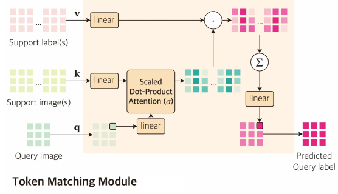

    - 매칭 모듈은 각 계층에서 Multi-Head Attention 레이어로 구현됩니다.
     MHA의 유사도를 계산한 다음, 취합하게 됩니다. 각 head가 하나의 similarity를 의미하게 됩니다.
    - 각 계층에서의 이미지와 라벨 인코더에서, 처음으로 쿼리이미지 $X_q$ 의 토큰을 $$[q_j]_{j<=M}$$ 으로 얻고 서포트 셋  $$[(X^i, Y^i)]_{i<=N}$$ 의 토큰을 $$[(k^i_k, v^i_k)]_{k≤M,i≤N}$$ 로 얻습니다.
    - 토큰을 행렬로 쌓아 $  q ∈ RM×d$ 와 $ k, v ∈ RNM×d $ 를 만듭니다.
    - 계층에서 쿼리 라벨 토큰은 멀티헤드 어텐션 레이어의 출력으로 추론됩니다.
        - $MHA(q, k, v) = Concat(o_1, ..., o_H)w^O$, where $o_h = Softmax(\frac{qw_h^Q(kw_h^K)^\top}{\sqrt{d_H}})vw_h^V$
            - H : 헤드 수
            - $d_H$ : 헤드 사이즈
    - 중요한 점은 각 어텐션 헤드는 비매개변수 매칭의 직관을 구현하는 것입니다.
    - 왜냐하면 각 쿼리 라벨 토큰이 쿼리와 서포트 이미지 토큰 q, k 간의 유사성에 기반하여 서포트 라벨 토큰 v의 가중 결합으로 추론되기 때문입니다.
    - 여기서 유사성 함수 $\sigma$ 는 scaled dot product 어텐션으로 구현됩니다.
    - 각 헤드는 다르게 학습 가능한 프로젝션 행렬 $w_h^Q, w_h^K, w_h^V$ 를 포함하므로 멀티헤드 어텐션 레이어는 서로 다른 유사성 함수를 가진 매칭 알고리즘의 여러 가지의 브랜치들을 학습할 수 있습니다.

4. Label decoder : $h(g(\textbf{y})) = h(g(\textbf{y}); \psi)$
    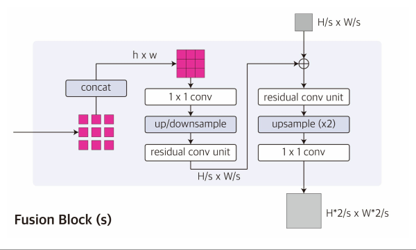
    - 컨볼루션 디코더 기반.
    - 레이블 디코더 h는 여러 계층에서 추론된 쿼리 레이블 토큰을 받고 이를 결합하여 원래 해상도의 쿼리 레이블을 예측합니다. ViT 인코더 및 multi-label과 원활하게 주고 받기 위해 the multi-scale decoder architecture of Dense Prediction Transformer를 채택하였습니다.
    - 디코더의 각 계층에서 추론된 쿼리 레이블 토큰은 먼저 일정한 크기 (M → h × w)의 feature map 특징 맵에 공간적으로 연결됩니다.
    - 그런 다음 서로 다른 stride를 가진 컨볼루션 레이어를 각 특징 맵에 적용하여 해상도가 증가하는 feature pyramid 특징 피라미드를 생성합니다.
    - multi-scale feature가 점진적으로 업셈플링 되고 컨볼루션 블록들에 의해 융합된 다음 컨볼루션 헤드가 최종 예측을 위해 따라붙습니다.
    - 레이블 인코더와 마찬가지로 레이블 디코더의 모든 매개 변수들은 처음부터 학습되어 task간 공유됩니다.
    - 이를 디코더는 예측된 쿼리 레이블 토큰에서 구조화된 레이블을 디코딩하는 일반화된 전략을 메타 학습할 수 있게 됩니다.
    - 이전에 설명했던 채널 분할(channel split)에 이어, 디코더의 결과는 단일 채널이며, 이를 통해 임의 수의 채널의 task에 적용할 수 있습니다.

정리) 이미지 인코더와 레이블 인코더는 비전 트랜스포머로 구성이 되고, 여기서 비전 트랜스포머는 인코딩을 하면서 중간에 피쳐를 계층적으로 뽑습니다. 계층적으로 뽑힌 피쳐는 각 레벨에서  MHA라는 모듈을 통해 매칭이 됩니다. 각각 매칭이 된 피쳐들을 컨볼루션 디코더가 점진적으로 퓨전을 하면서 디코딩을 하게 됩니다.

### **4. Training**

1. 스테이지 1 : episodic meta training

    $$\underset{f_\tau, g, h, \sigma}{\min} \mathbb{E}_{S_\tau, Q_\tau \sim D_{train}}\left[ \frac{1}{|Q_\tau|} \underset {(X^q, Y^q)\in Q_\tau}{\sum} L(Y^q, F(X^q;S_{\tau}))\right]$$
    - 퓨삿 러닝에서 자주 쓰이는 기법으로 다양한 태스크로 구성된 여러 개의 에피소드를 통해서 학습 모델이 퓨샷 러닝을 진행합니다.
    - <!-- --> $$\mathbb{E}_{S_\tau, Q_\tau \sim D_{\text{train}}}$$
        - 다양한 태스크로 구성된 $D_{train}$ 데이터셋에서 특정한 에피소드에서 특정 태스크에 해당하는 이미지와 레이블 페어를 뽑습니다. 이 페어를 서포트셋와 쿼리셋으로 나눕니다. 여기서 서포트셋은 이 모델이 레이블을 보게 되고 쿼리셋은 레이블을 보지 않고 이미지만 보고 맞추게 됩니다. 이렇게 서포트셋과 쿼리셋을 나누는 이유는 나중에 훈련이 끝나고 퓨샷러닝의 모델을 적용했을 때 레이블이 다르더라도 서포트셋에 있는 정보를 잘 사용해서 쿼리를 맞추도록 하기 위함입니다.
    - $F(X^q;S_{\tau}))$
        - 서포트셋을 보고 쿼리셋을 맞추도록 로스함수를 계산합니다.
    - $\underset{f_\tau, g, h, \sigma}{\min}$
        - 이러한 에피소드를 여러 가지 태스크에 대해서 많이 반복하여 퓨샷 러닝 모델이 서포트를 보고 쿼리를 맞출 수 있도록 학습하게 됩니다. 이 단계에서는 모든 파라미터를 전부 메타 훈련합니다.
    $$\underset{\theta_\tau}{\min} \mathbb{E}_{\tilde{S}, \tilde{Q} \sim S_{\tau_{train}}}\left[ \frac{1}{|\tilde{Q}|} \underset {(X^q, Y^q)\in \tilde{Q}}{\sum} L(Y^q, F(X^q;\tilde{S}))\right], S_{\tau_{test}} = \tilde{S} \cup \tilde{Q}$$
2. 스테이지 2  : task-specific fine-tuning
굉장히 다르게 생긴 레이블을 가지고 퓨샷러닝을 하면 적응, 일반화가 되지 않는 모습을 확인하였습니다. 더 피팅을 잘 하기 위해 task-specific fine-tuning을 진행합니다.
스테이지 1과 다른 점 두 가지
    1) 다양한 태스크로 구성된 데이터셋이 아니라 실제로 맞추고자 하는 few-shot 데이터를 이용하여 학습하였습니다. 파인튜닝 스테이지는 트레이닝이 다 끝나고 어떤 퓨샷러닝을 풀고 싶을 때 적용하기 때문에 사용할 수 있는 데이터가 한정적입니다. 그 적은 데이터를 서포트셋과 쿼리셋으로 나누어서 파인튜닝을 진행합니다.
    2) 모든 파라미터를 튜닝하는 것이 아니라 task-specific 파라미터만 튜닝합니다. 따라서 나머지 파라미터는 메타 트레이닝 떄 학습이 다 되어있고, task-specific 파라미터만 학습을 함으로써 굉장히 적은 데이터만으로도 효율적으로 학습을 진행할 수 있습니다.

이 단계까지 마무리하고나면 새롭게 보는 태스크도 서포트 셋만 가지고 잘 예측을 하게 됩니다.
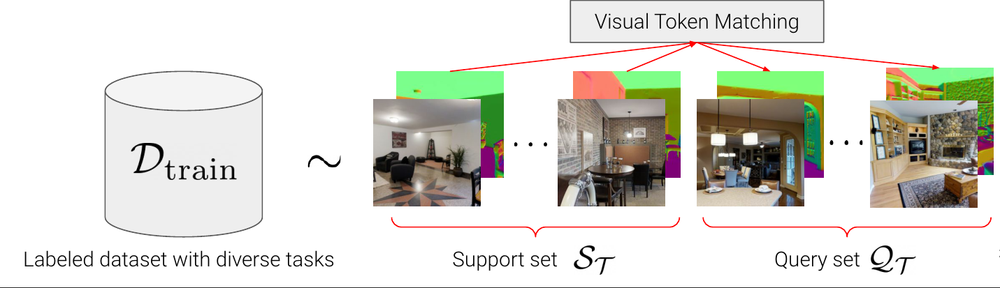

## **4. Experiment**  
### **Experiment setup**  
* Dataset : Taskonomy dataset 물체에 대한 사진으로 많은 종류의 태스크 레이블이 존재하는 데이터셋입니다.
* Dense prediction tasks
    1. Semantic Segmentation SS
    2. Euclidean Distance ED
    3. Texture Edge TE
    4. 2D Keypoints K2
    5. Reshading RS
    6. Surface Normal SN
    7. Zbuffer Depth ZD
    8. Occlusion Edge OE
    9. 3D keypoints K3
    10. Principal Curvature PC
* baseline
    - 전체 데이터를 사용하는 fully-supervised 베이스라인
        - DPT : 각 태스크를 독립적으로 보는 베이스라인
        - InvPT : 모든 태스크를 한 번에 학습하는 멀티태스크 러닝 베이스라인 
    - 퓨샷러닝 베이스라인: SS를 위한 퓨샷러닝 베이스라인
        - HSNet
        - VAT
        - DGPNet
* Evaluation Metric  
5-fold split
5개의 fold로 split를 하였습니다. 첫번쨰 fold에서는 SS와 SN를 퓨샷러닝하는 것을 목적으로 하고 스테이지 1에서는 SS와 SN을 제외한 나머지 태스크는 메타 트레이닝 학습에 사용하고, SS와 SN은 스테이지 2에서 퓨샷러닝 파인튜닝에 사용하였습니다. 두번째 fold에서는 ED, ZD를 타겟으로 두고 나머지를 트레이닝하면서 이 ED, ZD의 성능을 측정하였습니다. 이렇게 다양한 시나리오에 대해서 모델의 성능을 측정하였습니다.

### **Result**  
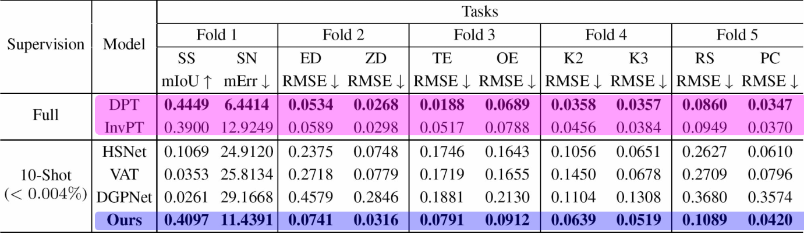

퓨샷러닝을 하는 베이스라인 보다 훨씬 성능이 좋았고, 전체 데이터를 학습하는 fully-supervised 베이스라인과 비슷한 성능을 보였습니다.
기존 퓨샷러닝과는 다르게 다양한 태스크가 있음에도 불구하고 퓨샷으로 일반화를 잘 하고 있다는 것을 보여줍니다.

### **Qualitative Result**  
10-shot 결과
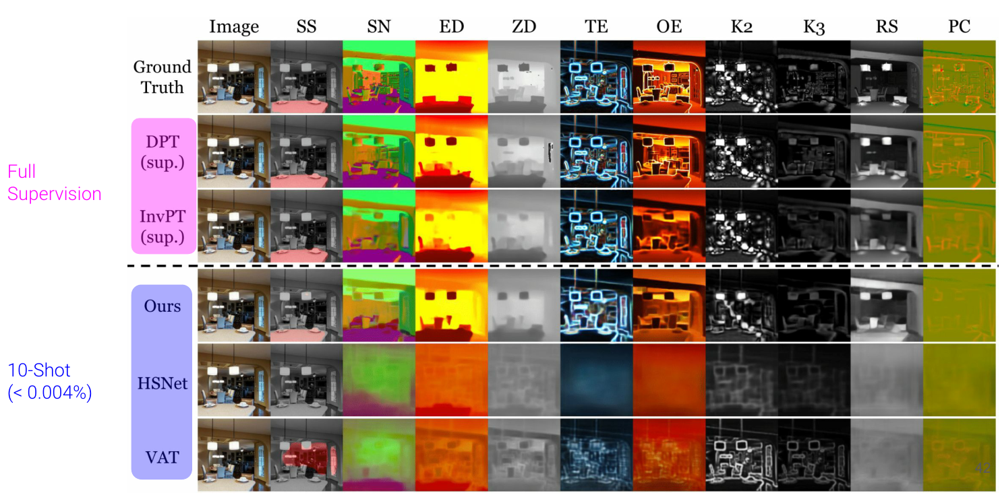

기존에 있는 특정한 태스크를 위해서 파인튜닝된 퓨샷러닝 베이스라인은 다른 태스크에서는 전혀 예측을 못하고 실패하지만 모든 태스크에 대해서 reasonable하게 예측을 하는 모습을 보여줍니다.

### **more supervision**
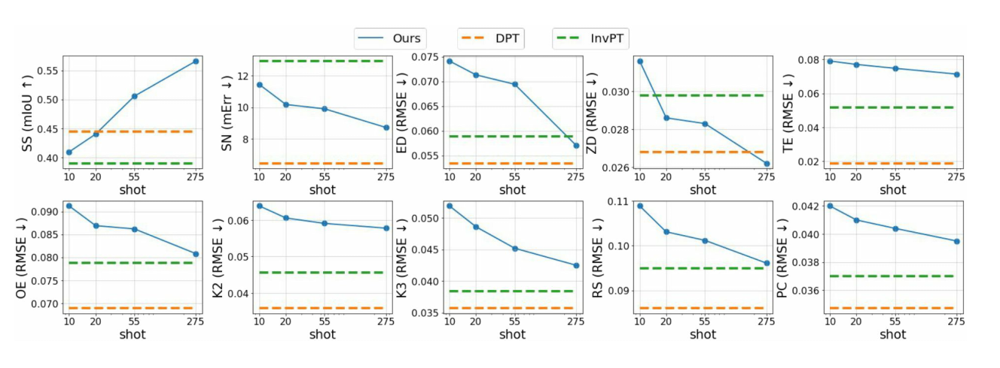

x축이 이미지와 레이블의 개수이고, y축이 성능입니다. 즉, 데이터를 늘려가면서 성능을 쟀을 때를 나타냅니다.

### **Attention map visualization**

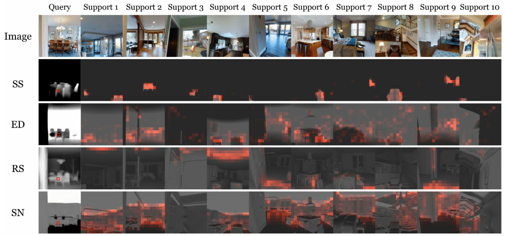

: 이 시각화가 task-specific 파라미터가 매칭에서의 similrity가 태스크마다 잘 모듈레이션 하고 있다는 것을 보여줍니다.

### **Generalization to unseen domains**

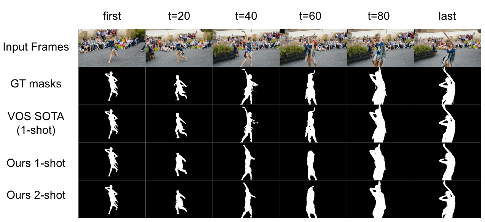
video segmentation task 
첫번째 프레임에 대해서 트래킹을 하고 싶은 오브젝트에 GT마스크를 줍니다. 
나머지 프레임에 대해서 이 사람의 바운더리를 따는 태스크입니다.
처음 프레임을 서포트셋으로 두고 나머지 프레임을 쿼리셋으로 두면 퓨샷러닝으로 포뮬레이션을 할 수 있었습니다. 

완전 다른 태스크, 완전 다른 도메인(아웃도어 신)으로 갔을 떄도 일반화가 잘 되는 것을 확인할 수 있습니다.

## **5. Conclusion**  

### **Limitation**

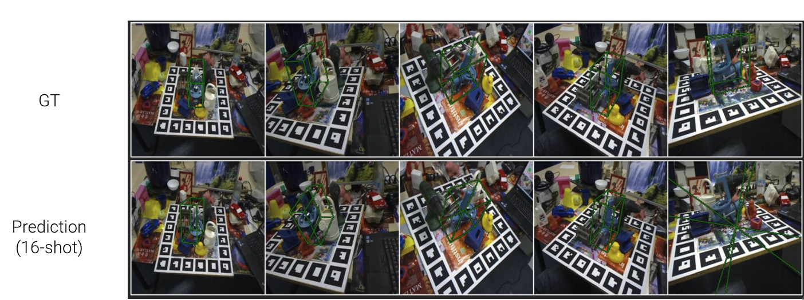

1. Channel-wise interaction is not allowed
: 채널 간 상호작용을 고려하지 못합니다.

    task마다 다른 channel 개수가 다르기 떄문에 multi-channel을 single-channel로 바꾸어서 다양한 task의 다양한 channel 수를 다룰 수 있게 하였습니다. 하지만 채널 간 강한 상호작용이 있는 task에서는 문제가 될 수 있습니다.
    - Applying Taskonomy-pretrained VTM to 6D Pose estimation(predicting nine keypoints of 3D bbox)
        - 6D Pose estimation task : target 물체의 3D bounding box를 예측
        - GT : 각 꼭짓점을 예측을 하게 되는데 바운딩 박스를 예측해야 하기 때문에 직육면체를 띄어야 합니다. 그래서 한 번에 직육면체를 예측하는 경우가 많습니다.
        - Prediction(16-shot) : 하지만 multi-channel을 single-channel로 다루고 있기 때문에 각 꼭짓점을 독립적으로 예측하기 때문에 예측된 포인트가 다른 예측 포인트에 영향을 주지 않는다. 즉, 직육면체를 띄지 않는다.

### Conclusion

- 컴퓨터비전에서는 Dense prediction 태스크가 중요한 문제 중 하나입니다. 지도 학습 방법은 높은 픽셀 단위 라벨링의 비용이 비싸기 떄문에 몇 장의 라벨링 이미지로 모든 태스크를 학습할 수 있는 학습 솔루션이 필요합니다. 하지만 현재의 퓨샷 러닝은 제한된 태스크(특히 시맨틱 세그멘테이션)를 대상으로 하여 보지 못한 임의의 태스크에 대해 유연하고 효율적으로 적응할 수 있는 일반적인 통합 모델을 설계하는 데에 어려움이 있었습니다. 그래서 Visual Token Matching VTM을 제시합니다. 해당 모델은 이미지와 레이블의 패치 단위 임베디드 토큰에 대한 비매개변수 매칭을 사용하여 모든 과제를 캡슐화합니다. 또한 매칭 알고리즘을 조절하는 퓨샷 러닝 특화 파라미터로 임의의 과제에 유연하게 적응합니다. VTM은 ViT 백본을 포함한 계층적 인코더-디코더 아키텍쳐로 구현하며, 토큰 매칭은 여러 특징 계층에서 수행됩니다.

- Taskonomy 데이터셋에서 모델 검증을 하였고, 10쌍의 데이터만으로도 다양한 태스크에 학습이 가능하다는 것을 확인하였습니다.

- 다양한 도메인, 다양한 태스크에도 잘 적용되었습니다.

- 채널 간 상호작용이 강한 태스크에서는 잘 적용이 되지 않아 한계점을 가지고 있습니다.

---  
## **Author Information**  

* Author name  
    * Affiliation  
    * Research Topic

## **6. Reference & Additional materials**  
 

* Github Implementation 
    - https://github.com/GitGyun/visual_token_matching
* Reference  
    - [EIRIC 세미나](https://www.eiric.or.kr/community/webinar_detail.php?Seq=123&totalCnt=114&searchBy&searchWord&SnxFlag&pg=1)
    - [Matching Networks for One Shot Learning by Oriol Vinyals, Charles Blundell, Timothy Lillicrap, Koray Kavukcuoglu, Daan Wierstra](https://arxiv.org/abs/1606.04080)
    - https://meta-learning.fastforwardlabs.com/
    

---
### Q&A

1. "매칭"이라는 formulation 즉, 하나의 모델로 여러 개의 태스크를 예측 할 수 있나요?
    - 공통된 임베딩 스페이스에서 보편적으로 적용 가능합니다.
2. 새로운 태스크가 주어졌을 때, 예측을 할 수 있나요?
    - 태스크 특화 파라미터를 두었기 때문에 이것을 통해서 적응이 가능합니다. 특히, 태스크 특화 파라미터를 0.3%만 두고 나머지는 공통 파라미터로 사용하여 과적합을 방지하였습니다.
     
---

