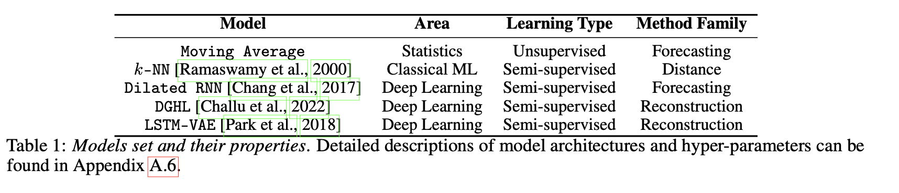

 
**key words**: Model Selection · Time-series Anomaly Detection · Unsupervised Learning

## **1. Introduction**  

시계열 데이터에서의 이상 감지는 데이터의 급격한 증가와 일부 자동 시스템의 모니터링 필요성 증대로 인해 중요성이 높아지고 있다. 다양한 이상 감지 기법들이 개발되었으며, 이러한 기법들은 간단한 알고리즘에서부터 복잡한 딥러닝 모델에 이르기까지 다양하다. 이 모델들은 데이터셋에 따라 성능의 차이가 크게 나타나며, 모든 유형의 데이터에서 다른 모델들보다 뛰어난 성능을 보이는 보편적인 방법은 존재하지 않는다. 이러한 상황은 레이블이 없는 상태에서 가장 효과적인 이상 감지 모델을 선택하는 것을 어렵게 만들며, 이는 연구자들이 레이블 없이 효과적인 모델을 선택할 수 있는 방법을 개발하는 데 관심을 갖게 했다. 이는 무엇보다도 데이터의 이상을 식별할 때 사용할 수 있는 비지도(unsupervised) 방식으로 모델을 선택하는 새로운 접근 방식의 필요성을 강조한다.  

저자의 접근 방식은 모델 성능과 상관관계가 있는 "대리(surrogate)" 메트릭을 계산하는 것을 기반으로 하며, 이 메트릭에 의해 유도된 모델 순위를 집계한다(Figure. 1). 의학, 스포츠 등 다양한 분야를 포괄하는 10개의 실제 데이터셋에서의 경험적 평가는 저자의 접근 방식이 데이터의 일부를 레이블링하여(supervised) 선택하는 것만큼 효율적으로 비지도 모델 선택을 수행할 수 있음을 보여준다.

요약하자면, 본 연구의 기여는 크게 3가지로 볼 수 있다.
-   본 연구는 시계열 데이터에서 비감독 이상 감지 모델 선택을 위한 최초의 방법 중 하나를 제안한다. 이를 위해 모델 성능에 대한 직관적이고 효과적인 비감독 메트릭을 식별한다. 이전의 작업은 이러한 비지도 방법 중 일부를 시계열 이상 감지 모델 선택 문제가 아닌 다른 문제에 사용했다.
-   여러 multiple surrogate 메트릭을 단일(single) 모델 선택 기준으로 결합하는 새로운 강력한 순위 집계 방법을 제안한다. 본 연구는 접근 방식이 데이터의 부분을 레이블링을 기반으로 선택하는 것과 동등하게 수행함을 보여준다.
-   또한, 275개 이상의 다양한 시계열을 포함하는 대규모 실험을 수행한다. 본 연구에 사용되는 시계열은 의학, 곤충학 등의 다양한 도메인에 걸쳐 있으며, 5개의 인기 있고 널리 사용되는 이상 감지 모델, 각각 1에서 4개의 하이퍼파라미터 조합으로 구성된 5,000개 이상의 훈련된 모델을 사용한다. 

## **2. Preliminaries & The Model Selection Problem**  

**Problem 1. 비지도 시계열 이상 탐지 모델 선택**

 관측치 $X_ {\text{test}}$와 $X_ {\text{train}}$을 사용하여 훈련된 모델 집합 $M = \{A_ i\}_ {i=1}^N$,이 주어졌을 때, 레이블을 사용하지 않고 이상 탐지 품질 메트릭 $Q(A_ i(X_ {\text{test}}), Y_ {\text{test}})$를 최대화하는 모델을 선택한다.

#### 2.1 이상 탐지 모델 성능 측정

이상 탐지는 이진 분류 문제로 볼 수 있으며, 각 시간 지점을 이상 혹은 정상 관측으로 분류한다. 따라서 모델 $A_ {i}$의 성능은 표준 정밀도와 재현율을 사용하여 측정할 수 있다. 그러나 이런 메트릭들은 시계열의 순차적 특성을 고려하지 않기 때문에, 시계열 이상 감지는 일반적으로 정밀도와 재현율의 조정된 버전을 사용하여 평가된다. 저자는 조정된 정밀도와 재현율의 널리 사용되는 버전을 채택한다. 이 메트릭들은 시간 점들을 독립적인 샘플로 취급하나, 이상이 연속적인 여러 시간 점에 걸쳐 발생하는 경우, 이러한 점 중 하나를 감지하는 것은 모든 이상 구간 내의 점들이 감지된 것으로 간주한다.

## **3. Surrogate Metrics of Model Performance**  

비지도 모델 선택은 지도 학습 성능 메트릭과 상관 관계가 있는 비지도 메트릭을 찾는 과정으로 볼 수 있다. 각 비지도 메트릭은 모델 성능의 '좋음'을 잡음이 섞인 척도로 제공하여, 이 메트릭에 따라 최고 성능 모델을 선택하는 문제로 단순화된다. time-series 이상 탐지 모델의 성능을 예측하는 데 있어 전문가의 직관과 일치하는 세 가지 유형의 불완전한 메트릭을 식별했다.

#### Prediction Error
- 모델이 시계열 데이터를 잘 예측하거나 재구성할 수 있다면, 그 모델은 또한 효과적인 이상 탐지 모델이 될 수 있다. 이상 탐지 방법들 중 많은 수가 예측이나 재구성 기반으로, 이상 레이블 없이 예측 오류나 재구성 오류를 계산할 수 있다. 
- 예측 오류 메트릭에는 평균 절대 오류(MAE), 평균 제곱 오류(MSE) 등이 있다.

#### Synthetic Anomaly Injection
- 좋은 이상 감지 모델은 합성적으로 이상을 주입한 데이터에서도 효과적으로 이상을 감지할 수 있어야 합니다.
- 주어진 시계열 데이터에 무작위로 다양한 유형의 이상을 주입하고, 해당 모델이 이를 어떻게 감지하는지를 평가함으로써 모델의 성능을 간접적으로 측정합니다.

#### Model Centrality (모델 중심성)
- 모든 모델이 실제 상황에 대해 만들어내는 이상 점수들의 '중심성'에 기반하여, 가장 진실에 가까운 모델을 식별하는 방법이다. 
- 모델 간의 거리를 측정하는 데 사용되는 켄달 타우 거리(Kendall's τ distance)는 모델의 순위에 따른 순서의 불일치를 계산하며 수식은 다음과 같다.

    $d_ {\tau}(\sigma_ k, \sigma_ l) = \sum_ {i < j} \mathbf{I}\{(\sigma_ k(i) - \sigma_ k(j))(\sigma_ l(i) - \sigma_ l(j)) < 0\}$

## **4. Robust Rank Aggregation (강력한 순위 집계)**  

많은 연구들이 군중 소싱(crowd-sourcing)과 같은 머신러닝의 다양한 영역에서 여러 소스의 잡음이 있는 정보를 결합하여 오류를 줄이는 이점을 탐구했다. 저자의 각 대리 메트릭(surrogate metrics)은 모델의 순위를 부과하며, 그 결과 노이즈가 있는 순위가 만들어진다. 따라서 이러한 맥락에서 저자는 두 가지 자연스러운 질문을 제기한다: (1) 여러 모델 순위를 어떻게 신뢰성 있게 결합할 수 있는가? (2) 여러 순위를 집계하는 것이 모델 선택에 도움이 되는가? 

#### 4.1 모델 선택을 순위 집계 문제로 접근하기

이상 탐지 모델의 순위를 매기기 위해 여러 대리 메트릭(surrogate metrics)을 가지고 있다고 가정해보자. 이 메트릭들에 의해 유도된 순위를 집계하는 것이 왜 유익할까? 다음의 정리는 Borda 순위 집계의 이점에 대한 통찰을 제공한다.

순위 집계 문제는 주어진 $N$개의 항목들에 대한 $M$개의 순위에서 가장 일관성 있는 요약 순위를 찾는 것이다. 주어진 집합에서 각 순위는 항목의 배열이며, 문제는 요약 순위를 나타내는 $\sigma^{*}$를 찾는 것이다.

순위 집계는 사회 선택, 생물정보학, 머신러닝 문헌에서 광범위하게 연구되었다. 특히, 케메니 순위 집계(Kemeny rank aggregation)는 순위의 집합에서 거리를 선택하고 중앙 순위를 찾는 것과 관련이 있다. 케메니 순위 집계는 다음의 목표를 가지고 있다.

**Problem 2. 순위 집계** 
주어진 $N$개의 항목에 대한 $M$개의 순위 $\sigma_ {1}, \ldots, \sigma_ {M} \in S_ {N}$ 집합이 있을 때, 어떤 목표 $C( \sigma^{\*}, \sigma_ {1}, ..., \sigma_ {M} )$에 따라 이 순위들을 가장 잘 요약하는 $\sigma^{\*} \in S_ {N}$를 찾는다.

이 문제는 케메니-영(Kemeny-Young) 문제로 알려져 있고, 목표가 다음과 같이 정의될 때, 케메니 순위 집계 문제가 된다.

$C = \frac{1}{M} \sum_ {i=1}^ M d_ {\tau}(\sigma^*, \sigma_ {i})$, 여기서 $d_ {\tau}$​는 켄달의 $\tau$거리를 나타낸다.

케메니 순위 집계는 많은 바람직한 속성을 가지고 있지만, NP-hard 문제이므로 실제로는 효율적인 근사 해법을 고려해야 한다. 예를 들어, Borda 방법은 각 항목(모델)이 각 순위(대리 메트릭)에서 점수를 받는 방법을 사용한다. Borda 방법은 다음과 같이 점수를 부여한다.

-   예를 들어, 모델이 대리 메트릭에 의해 $r$위치에 있다면, 그 메트릭으로부터 $(N - r)$ 점수를 받는다.
-   모델들은 모든 메트릭으로부터 받은 총 점수에 따라 내림차순으로 순위가 매겨진다.

이 접근 방식은 순위를 통한 모델 선택 문제에 대한 보다 구조화된 접근을 가능하게 하며, 다양한 메트릭을 통합하여 보다 견고한 결정을 내릴 수 있도록 한다.

#### 4.2 Empirical Influence and Robust Rank Aggregation
4.2절에서 저자는 Borda 방법을 사용하여 여러 대리 메트릭에서 파생된 순위를 통합하는 강력한 순위 집계 방법에 대해 설명한다. 이 방법은 각 모델이 각 메트릭에서 얻은 순위를 통해 모델의 전체 성능을 평가하는데 사용된다.
#### Borda 방법
Borda 방법은 간단하고 널리 사용되는 순위 집계 방법으로, 각 모델에 대해 각 대리 메트릭의 순위에 따라 점수를 할당하고 이 점수들을 합산하여 모델의 최종 순위를 결정한다.

$B_ {i} = \sum_ {k=1}^M (N - r_ {ik})$

여기서 $B_ {i}$​는 모델 $i$의 Borda 점수, $M$은 메트릭의 수, $N$은 모델의 수, $r_ {ik}$​는 메트릭 $k$에서 모델 $i$의 순위. 모델은 $B_ {i}$​ 점수가 높은 순으로 순위가 매겨진다.

보르다 방법은 모든 대리 메트릭을 동등하게 취급한다. 그러나 저자의 경험과 이론적 분석은 "좋은" 메트릭만을 사용하여 집계하는 것이 성능을 개선할 수 있다고 제안한다. 그러나 어떻게 이상 레이블이 없이 "좋은" 순위를 식별할 수 있을까? 이에 대한 해답은 보르다 집계 방법과 이를 향상시킬 수 있는 다양한 기법들을 통해 제공된다. 저자는 각 대리 메트릭의 신뢰성을 평가하고, 그에 따라 각 순위에 가중치를 부여하여 향상된 보르다 집계 방법을 제안한다.

#### 향상된 Borda 방법

향상된 Borda 방법은 각 대리 메트릭의 신뢰성을 고려하여 가중치를 조정한다. 더 신뢰할 수 있는 메트릭은 최종 순위 결정에 더 큰 영향을 미친다.  

$B_ {i}^{*} = \sum_ {k=1}^{M} w_ {k}(N - r_ {ik})$,  $w_ {k}$​는 메트릭 $k$의 신뢰도에 따른 가중치

이 접근 방식을 사용하면, 더 신뢰할 수 있는 메트릭의 영향을 강화하고, 덜 신뢰할 수 있는 메트릭의 영향을 감소시킬 수 있다. 이는 전체적인 모델 선택 과정에서 더 정확하고 신뢰할 수 있는 결정을 내리는 데 도움을 줄 수 있다.

## **5. Evaluation Results**  
#### 5.1 Data
저자는 다양한 시계열과 이상을 포함하는 두 개의 인기 있고 널리 사용되는 실제 데이터 컬렉션에서 실험을 수행한다:

1.  **UCR 이상 아카이브 (UCR) [Wu and Keogh, 2021]**:  이 컬렉션에는 자연적 이상과 현실적인 합성 이상이 포함되어 있다. 포함된 시계열의 이질성을 고려하여, UCR을 도메인별로 9개의 하위 집합으로 나누었다: (1) 가속도, (2) 공기 온도, (3) 동맥혈압(ABP), (4) 전기 침투 그래프(EPG), (5) 심전도(ECG), (6) 보행, (7) NASA, (8) 전력 수요, (9) 호흡(RESP). 각각의 하위 집합을 별도의 데이터셋으로 참조된다.
    
2.  **서버 머신 데이터셋 (SMD) [Su et al., 2019]**: SMD는 5주 동안 대규모 인터넷 회사의 28대 서버 머신에서 수집된 38개 특성을 가진 다변량 시계열을 포함한다. 각 엔티티에는 서버 머신의 CPU 부하, 메모리 및 네트워크 사용량과 같은 일반적인 메트릭이 포함되어 있다. 훈련 및 테스트 세트 모두 약 50,000개의 타임스탬프를 포함하며, 그 중 5%가 이상 사례이다. 
    
SMD를 단일 데이터셋으로 참조하며, 따라서 저자는 평가에서 UCR의 9개 데이터셋과 SMD를 합쳐 총 10개의 데이터셋을 고려한다.

#### 5.2 Model set
저자는 실험을 위해 5가지 인기 있는 방법의 대표적인 부분 집합을 구현했습니다(Table. 1), 이는 두 가지 다른 학습 유형(unsupervised and semi-supervised)과 세 가지 다른 방법 (forecasting, reconstruction and distance-based)에 걸쳐 있다.

각 모델의 하이퍼파라미터를 다양하게 하여 3개의 k-NN, 4개의 이동 평균, 4개의 DGHL, 4개의 LSTM-VAE, 4개의 RNN 모델을 포함하는 총 19개 조합의 풀을 생성했으며 모델을 효율적으로 훈련하기 위해, T > 2560인 모든 시계열을 10분의 1로 하위 샘플링하였다.

#### 5.3 Experimental set up

- **Evaluating model selection performance**: 모든 모델 선택 전략을 최고의 선택된 모델의 조정된 최고 F1 점수(제 2장 참조)에 기반하여 평가한다.
- **Baselines**: baseline으로는 데이터셋의 일부를 레이블링하고 이 레이블을 기반으로 최고의 방법을 선택하는 접근법을 고려한다. 구체적으로, 각 데이터셋은 선택(20%)과 평가(80%) 세트로 임의 분할된다. 즉, baselines은 선택 세트의 이상 레이블을 기반으로 모델을 선택하지만, 저자의 대리 메트릭은 선택 세트를 사용하지 않고, 대신 레이블을 사용하지 않고 평가 세트에서 계산된다. 전체 실험은 무작위 선택/평가 분할로 5번 반복된다.
- **Model selection strategies**: 5개의 예측 오류 메트릭, 9개의 합성 이상 주입 메트릭, 3개의 중심성 메트릭), Borda 순위 집계의 4가지 제안된 강력한 변형들을 포함한 17개의 개별 대리 메트릭을 비교한다.(제 3장 참조, 부록 A.7.2 참조).
- **Pairwise-statistical tests**:  우리는 유의 수준 $\alpha$ = 0.05에서 one-sided paired Wilcoxon signed rank tests를 수행하여 각 데이터셋에서 모든 모델 선택 전략 및 기준선 간의 유의미한 성능 차이를 식별한다.
- **Experimentation environment**: 모든 모델과 모델 선택 알고리즘은 scikit-learn 1.1.1, PyTorch 1.11.0를 사용하여 구축되었고 Python 3.9.13을 사용하여 훈련되었다. 모든 실험은 16개의 인텔(R) 제온(R) CPU, 122 GiB RAM 및 8 GiB GPU를 갖춘 AWS g3.4xlarge EC2 인스턴스에서 수행되었다.

#### 5.4 Results and Discussion
 

이상 탐지 모델 선택을 위한 실험 결과에 따르면(Figure3), 단일 대리 메트릭이 모든 데이터셋에서 최고의 모델을 일관되게 선택하지는 않는다. 특히 예측 오류 메트릭은 일부 데이터셋에서 오라클과 비슷한 성능을 보였지만, 다른 데이터셋에서는 무작위 선택보다 나쁜 결과를 보였다. 최소 영향 메트릭(MIM)과 robust Borda는 각각 supervised 선택과 비교하여 비슷하거나 더 나은 성능을 보였으며, 합성 이상 주입 메트릭이 예측 오류나 중심성 메트릭보다 더 나은 결과를 보여줌으로써 다른 메트릭 클래스를 능가했다.

실험은 또한 이상 유형에 대한 사전 지식이 모델 선택에 유용하게 활용될 수 있음을 보여준다. 예를 들어, 특정 데이터셋의 특성에 맞는 합성 메트릭은 해당 이상을 잘 감지하여 높은 성능을 보였다. 이는 도메인 전문가들이 데이터에 존재할 수 있는 이상의 유형을 인식하고 이를 기반으로 적절한 모델을 선택할 때, 사전 지식을 효과적으로 활용할 수 있다는 것을 의미한다.

## **6. Conclusion**  

저자는 시계열에서 이상 탐지를 위한 비지도(Unsupervised) 모델 선택 문제를 고려한다. 제안된 모델 선택 접근 방식은 이상 레이블을 요구하지 않으면서도 모델 성능과 다양한 정도로 상관관계가 있는 대리 메트릭(surrogate metric)에 기반을 두고 있다. 본 연구에서는 예측 오류, 합성 이상 주입, 그리고 모델 중심성이라는 세 가지 클래스의 대리 메트릭을 식별한다. 다양한 종류의 합성 이상을 주입하는 효과적인 절차를 고안하고 시계열에 모델 중심성의 개념을 확장한다. 다음으로, 저자는 다양한 메트릭에서 얻은 순위를 강력한 순위 집계 접근 방식을 사용하여 결합할 것을 제안하며 순위 집계에 대한 이론적 근거를 제공한다. 5000개 이상의 훈련된 모델과 17개의 대리 메트릭을 사용한 평가 결과 제안된 접근 방식이 부분 데이터 레이블링을 기반으로 한 선택(supervised)과 동등하게 수행됨을 보여준다.

---  

## **Author Information**  

* Jiyu Moon
    * Research Topic: Change point detection
    * Contact: jy_moon@kaist.ac.kr

## **Reference & Additional materials**  

Please write the reference. If paper provides the public code or other materials, refer them.  

* Github Implementation  
   *  [Code for the paper](https://github.com/mononitogoswami/tsad-model-selection)

* Reference  
  -  Ane Blázquez-García, Angel Conde, Usue Mori, and Jose A Lozano. A review on outlier/anomaly detection in time series data. ACM Computing Surveys (CSUR), 54(3):1–33, 2021.
