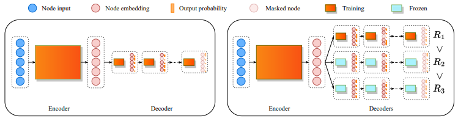
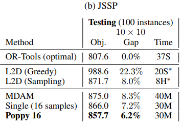

## 1. Problem Definition
최근 수 년간 조합최적화 문제를 강화학습을 활용하여 해결하려는 시도가 늘어나고 있다. 전통적인 조합최적화 문제 해결 방법인 dispatching rule은 빠른 시간 내에 해를 도출할 수 있지만 instance-specific하며 성능이 좋지 않다는 단점이 있다. 강화학습을 활용한 방법론은 dispatching rule의 장점인 짧은 연산시간을 유지하며 handcrafted dispatching rule보다 복잡한 로직을 통해 성능을 높이는, **고도화된 dispatching rule 설계**를 목적으로 한다. 본 연구는 이러한 아이디어를 기반으로 **조합최적화 문제 해결을 위한 end-to-end 강화학습 알고리즘 개발**을 목표로 한다.

## 2. Motivation
기존에는 조합최적화 문제 해결에 최적해를 구할 수 있는 수학적 방법론이나 near-optimal solution을 구할 수 있는 메타휴리스틱이 주로 사용되었다. 하지만 다양한 제약으로 문제의 복잡도가 증가하고 문제의 크기가 커짐에 따라, 긴 연산 시간을 필요로 하는 수학적 방법론 및 메타휴리스틱의 한계가 드러나고 있다. 특히 논문에서 주목한 Traveling Salesman Problem(TSP), Capacitated Vehicle Routing Problem(CVRP), Knapsack Problem(KP), Job Shop Scheduling Problem(JSSP)은 모두 NP-hard로, 전통적인 최적화 방법론 혹은 메타휴리스틱 사용 시 연산 시간이 매우 길어진다.

빠른 시간 내에 좋은 성능의 해를 얻을 수 있는 **constructive 강화학습 방법론**의 중요성이 높아지고 있다. 최근 연구들은 이러한 강화학습 dispatcher의 긍정적인 가능성을 확인하였지만, 조합최적화 문제는 복잡도가 높아 강화학습만으로는 좋은 해를 얻기 어렵다. 이 때문에 대부분의 연구에서는 이러한 강화학습 dispatcher에 domain knowledge에 기반한 search 방법론을 결합하여 성능을 높인다.

Search는 긴 연산 시간을 필요로 하며 해의 다양성을 보장하기 어렵다는 문제점이 있다. 따라서 강화학습 dispatcher를 실제 제조 현장의 스케줄링 문제처럼 복잡한 문제에 적용하기 위해서는 짧은 시간 내에 좋은 해를 도출할 수 있는 end-to-end 강화학습 dispatcher의 성능 향상이 필수적이다. 본 논문에서는 이를 위해 population based learning 알고리즘 **Poppy**를 제안한다. Poppy는 **population based learning을 통해 탐색 공간을 넓힘으로써 다양한 해를 탐색**하여, search 결합 없이 **end-to-end 강화학습**의 성능을 높이고자 했다.

## 3. Method
### 3.1. Movitating Example

좌측 그림과 같이 agent가 하나인 경우, agent는 reward의 기댓값이 가장 높은 위쪽 방향으로 움직인다. 하지만 우측 그림과 같이 agent가 여러 개인 경우, 두 agent는 서로 다른 action을 탐색해 보고 가장 좋은 action을 취할 수 있다. Poppy는 여러 agent가 다양한 action을 탐색해 본 후, reward를 최대화할 수 있는 action을 선택하는 전략을 취한다.

### 3.2. Poppy
학습 단계에서 한 번의 rollout만으로도 다양한 policy를 얻어 학습 효율을 높임으로써 성능을 제고하는 것이 본 논문의 주요 목표다. 따라서 objective는 다음과 같이 정의할 수 있다.
$$J_{pop}(\theta_1, \dots , \theta_K) = \mathbb{E}_{\rho \sim D} \mathbb{E}_{\tau_1 \sim \pi_{\theta_1}, \dots, \tau_K \sim \pi_{\theta_K}} \max \left[R(\tau_1), \dots, R(\tau_K)\right]$$
Poppy에서는 동일한 agent를 K번 sampling하여 사용하기 때문에, $\pi_{\theta_1} = \pi_{\theta_2} = \dots = \pi_{\theta_K}$이다. 이를 정리하여 gradient를 구한 결과는 아래와 같다.
$$\nabla J_{pop}(\theta) = \mathbb{E}_{\rho \sim D} \mathbb{E}_{\tau_1 \sim \pi_{\theta_1}, \dots, \tau_K \sim \pi_{\theta_K}} \left(R(\tau_{i^*}) - R(\tau_{i^{**}})\right) \nabla \log p_\theta (\tau_{i^*})$$
where $ i^* = \arg \max_{i \in \{1, \dots, K\}}\left[R(\tau_i)\right]$ and $ i^{\star\star} = \arg \max_{i \neq i^*}\left[R(\tau_i)\right]$.

전체 framework는 위 그림과 같다. 학습은 크게 1) 단일 agent 학습(좌측 그림), 2) K-agent 학습(우측 그림)의 두 단계로 나뉜다. 단일 agent 학습 단계에서는 일반적인 end-to-end 강화학습과 동일하게 reward를 최대화하도록 학습이 진행된다. 이렇게 학습된 모델 $\theta$가 K개로 clone되어 아래 알고리즘과 같은 학습 과정을 거치는 단계가 K-agent 학습이다. 최종적으로는 K개의 agent를 활용하더라도, 처음 학습 단계에서 단일 agent만을 사용해서 학습함으로써 연산 시간을 줄일 수 있다.

K-agent 학습에서는 1단계에서 학습된 모델을 clone하여 K개의 agent를 생성한다. 이 agent들은 encoder parameter는 공유하되, 개별 decoder를 사용한다. 이 학습의 objective는 K개의 reward의 최댓값을 최대화하는 것이기 때문에, backpropagation 과정에서는 가장 좋은 성능을 보인 agent만을 활용한다. 학습 과정에서는 REINFORCE 알고리즘을 사용하였으며, 이때 baseline으로는 symmetry가 있는 환경에서 효과적임이 검증된 POMO(Kwon et al., 2020)를 사용하였다.

## 4. Experiment
논문에서는 조합최적화 문제인 TSP, CVRP, KP, JSSP를 대상으로 실험을 진행하였다. 실험에 사용된 모델은 encoder는 모든 agent가 공유하고, decoder는 agent-specific한 구조이다. 이 리뷰에서는 스케줄링 문제인 JSSP 실험을 집중적으로 다룬다.

JSSP는 10개의 job과 10개의 설비 환경에서 makespan 최소화를 목적식으로 하였으며, 1000개의 instance를 생성하여 최적해를 도출하는 OR-Tools, GNN을 활용한 L2D(Zhang et al., 2020)와 비교하였다. 실험 환경 세팅은 아래와 같다.
- Poppy: JAX-based implementation, v3-8 TPU
- L2D: Intel Core i9-10940X CPU, single Nvidia GeForce 2080Ti GPU

$10\times10$ Job Shop Scheduling Problem 실험에서 동일 환경의 L2D(Zhang et al., 2020)에 비해서는 좋은 성능을 보였지만, OR-Tools가 37초 만에 optimal solution을 도출한 데 반해 Poppy(K=16)는 30분 동안 optimal gap이 6.2%인 스케줄을 도출했다. 이는 20대 이상의 설비에서 다양한 제약을 함께 고려해야 하는 실제 현장에 적용하기 매우 어려울 만큼 긴 연산 시간이다. 

## 5. Conclusion
### 5.1. Summary
다양한 action을 탐색해 보는 전략은 sequential decision을 요하는 문제에서 특히 유용하다. 조합최적화 문제를 constructive dispatching 형식으로 접근하면 매 decision point에서 취하는 action이 후속 action에 큰 영향을 미치고, 대부분 sparse reward를 가져 해당 action의 영향을 즉각적으로 파악하기 어렵다. 이러한 문제를 해결하기 위해 조합최적화 문제에서 POMO(Kwon et al., 2020)를 시작으로 symmetry를 활용해 search space를 넓히려는 연구가 지속적으로 진행되고 있고, 본 논문에서는 population based learning을 통해 search space를 넓히는 Poppy를 제안하였다.

### 5.2. Insights for Scheduling Researches
Poppy는 기존의 강화학습을 활용한 방법론에 비해 search space가 넓어 스케줄의 성능을 높이는 데는 효과적이지만, 여러 agent가 다양한 action을 탐색하도록 하는 만큼 연산 시간 역시 증가한다. 실제 제조 현장에서는 짧은 시간 내에 합리적인 성능의 스케줄을 도출하는 것이 중요하기 때문에 스케줄링 문제에서 Poppy를 바로 적용하는 데는 한계가 있다. 하지만 population-based learning의 스케줄링 문제 적용 가능성을 보여 주었다는 데 의의가 있다.

특히 현재까지 제안된 강화학습 기반 스케줄링 방법론은 많은 경우 setup time, precedence constraint와 같은 복잡한 제약을 다루는 데 분명한 한계를 보인다. 본 논문에서 제안하는 population-based learning은 evolutionary algorithm과 결합하여 사용 가능하다. 따라서 population-based learning 단계에서는 제약을 relax한 환경에서 모델을 학습시켜 빠른 시간 내에 좋은 성능의 스케줄을 도출하고, 이를 genetic algorithm과 같은 evolutionary algorithm의 초기해로 활용해 제약을 만족할 수 있도록 해당 스케줄을 modify하는 알고리즘을 고안해볼 수 있다.

이외에도 제조 환경에서의 domain knowledge를 활용하여 초기 단계부터 search space를 적절히 좁힘으로써 agent가 과도하게 다양한 action을 탐색하는 것을 방지할 수 있다. 본 논문은 해의 다양성을 높여 local optima에 빠지는 것을 방지함으로써 높은 성능의 해를 도출한다는 목적을 가지고 있다. 하지만 기존의 강화학습을 활용한 스케줄링 문제에서 보였던 연산 시간의 한계점이 Poppy에서는 작은 사이즈의 문제에서도 드러났기에, _1) 스케줄링 문제에서 강화학습 dispatcher만을 단독으로 사용할 수 있을 만큼 효과적인가, 2) 그렇지 않아 강화학습 dispatcher를 다른 search 방법이나 메타휴리스틱과 결합하여 사용해야 한다면, 강화학습 단계에서 긴 연산 시간을 투자하여 local optima에 빠지는 것을 반드시 막아야 할 필요가 있는가_ 에 대한 고민이 충분히 이루어져야 한다.

## Author Information
- Jimin Park
    - Affiliation: [Manufacturing and Service Systems Lab.](https://msslab.kaist.ac.kr/)
    - Research Topic: Scheduling with Reinforcement Learning
    - Contact: jiminpark@kaist.ac.kr

## 6. Reference & Additional Materials
- [POMO] Kwon, Y. D., Choo, J., Kim, B., Yoon, I., Gwon, Y., & Min, S. (2020). Pomo: Policy optimization with multiple optima for reinforcement learning. Advances in Neural Information Processing Systems, 33, 21188-21198.
- [L2D] Zhang, C., Song, W., Cao, Z., Zhang, J., Tan, P. S., & Chi, X. (2020). Learning to dispatch for job shop scheduling via deep reinforcement learning. Advances in neural information processing systems, 33, 1621-1632.
