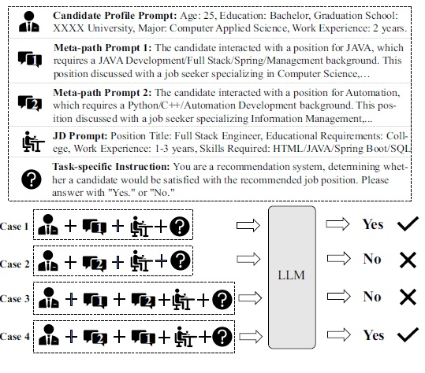
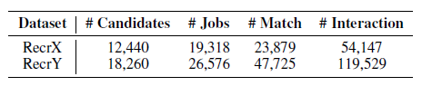
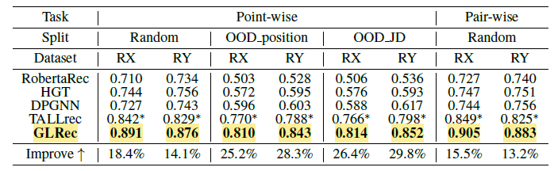
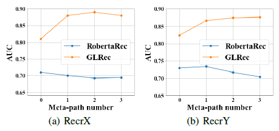
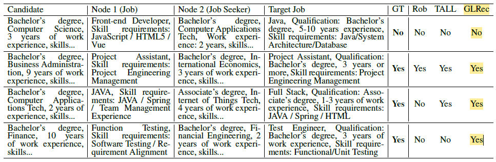
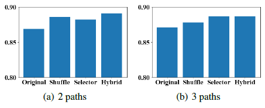

## **1. Introduction**  
온라인 채용 플랫폼에서의 추천 시스템은 구직자에게 가장 적합한 일자리를 연결시켜주는 동시에, 회사들이 필요한 인재를 연결시켜주는 중요한 역할을 수행한다. 그러나 해당 추천 시스템을 구현하는 데 있어서 여러 문제들이 존재한다. 

첫째, 채용 플랫폼은 일반적으로 희소한 상호작용 데이터 (Sparse Interaction Data) 문제가 존재한다 (Ramanath et al. 2018). 대부분의 일자리 공고는 평균적으로 소수의 지원자만 지원하기 떄문에 전통적인 Collaborative Filtering 기반 추천 시스템은 한계가 존재한다. 

둘째, 많은 채용 관련 데이터는 텍스트 형태로 되어 있어서 텍스트의 의미론적 이해를 파악하기 어렵다는 문제가 존재한다  (Qin et al. 2018; Shen et al. 2018). 최근 채용 관련 추천 시스템들들도 아직은 지도 학습 기반의 텍스트 매칭에 의존하고 있어 텍스트에 내재된 의미와 맥락을 충분히 이해하지 못한다.

셋째, 채용 시장에는 새로운 직무나 기술이 지속적으로 등장하기 때문에 분포 외 (out-of-distribution, OOD) 항목에 대한 추천이 어렵다. 기존 모델들은 이러한 새로운 항목에 대해 추천을 하지 못하는 한계가 존재한다 (Zhao et al. 2023; Jiang et al. 2023).

본 연구는 온라인 채용 추천 시스템의 현재 한계를 극복하고 빠르게 발전하는 LLM의 기술을 활용하여 추천의 정확성을 향상시키는 목표를 갖는다. 최근 연구에서는 행동 그래프를 활용하여 높은 차수의 상호작용을 포착하고 희소한 상초작용 문제를 완화하려는 시도가 있었다. 그러나 이러나 그래프 기반 모델들은 복잡한 그래프 구조를 효과적으로 학습하기 위해 많은 데이터와 연산 자원이 필요하다. 반면, LLM은 방대한 외부 지식과 강력한 언어 이해 능력을 바탕으로 다양한 도메인에서 뛰어난 성능을 보여주고 있지만 그래프 데이터나 사용자 행동을 직접 이해 시키는 데 한계가 있다. 따라서 LLM의 언어 이해 능력과 그래프 데이터의 구조적 정보를 파악할 수 있는 GLRec(Graph-understanding LLM Recommender) 프레임워크를 제안한다.

## **3. Methodology** 
본 연구는 다음 세 가지 방법으로 기존 연구의 한계를 극복한다:

1. 메타-경로 프롬프트 생성기(meta-path prompt constructor)를 도입하여 그래프 구조를 자연어 형태로 LLM에 입력함으로써, LLM이 그래프 데이터를 이해할 수 있게 한다.
2. 경로 편향 해소와 소프트 선택 메커니즘을 통해 LLM의 그래프 이해를 개선하고, 더 안정적이고 정확한 추천을 가능하게 한다.
3. LLM의 풍부한 언어 이해력과 외부 지식을 활용하여 OOD 항목에 대한 추천 성능을 향상시킨다.
### 3.1 Problem Formulation 
GLRec의 목표는 특정 구직자(Candidate)와 특정 직업 공고(Job Posting)의 호환성(Compatibility)을 예측하는 것이다.

**Input**:

- **Candidates 집합:** $C ={\{c_1, c_2, ..., c_{n1}\}}$
    - $n_1$은 전체 구직자 (이력서 작성자)의 수를 나타냄
    - 각 구직자 $c_1$는 자신의 이력서를 나타내는 텍스트 문서이다

- **Job Posting 집합:** $J ={\{j_1, j_2, ..., j_{n2}\}}$
    - $n_2$은 전체 직업 공고의 수를 나타냄
    - 각 직업 공고 $j_k$는 직무 요구 사항을 설명하는 텍스트 문서이다

- **상호작용 기록:** 구직자와 직업 공고는 방향성에 따라 다르게 묘사할 수 있다.
    - 구직자가 시작한 상호작용: $A_{ci} = \{c_i \rightarrow\ j' | c_i \in\ C,  j' \in\ J\}$

        $c_i \rightarrow\ j'$ 는 구직자 $c_i$가 직업 공고 $j'$에 대해 상호작용(예: 지원)을 시작
    - 직업 공고가 시작한 상호작용: $A_{jk} = \{j_k \rightarrow\ c' | j_k \in\ J,  c' \in\ C\}$

        $j_k \rightarrow\ c'$ 는 직업 공고 $j_k$가 구직자 $j'$에 대해 상호작용(예: 면접 요청)을 시작

위 Input들을 통해 지시문을 생성하고 두 가지 추천 작업을 정의한다 (Bao et al. 2023a).
1. Point-wise 추천: 특정 구직자가 특정 직업 공고에 만족할지 여부를 예측
2. Pair-wise 추천: 특정 구직자에게 두 개의 직업 공고 중 더 적합한 것을 선택
### 3.2 메타패스 프롬프트 생성기 (Meta-path Prompt Generation)

#### 3.2.1 이중 행동 그래프 (Heterogeneous Behavior Graph)
채용 플랫폼에서는 다양한 유형의 Node와 Edge로 구성된 이중 행동 그래프를 만들 수 있다 (Wu et al. 2021).
- Node: 구직자와 직업
- Edge: 구직자와 직업 간의 상호작용

#### 3.2.2 메타패스 생성 및 자연어 변환 (Meta-path to Prompt)
메타패스 $P$는 이중 그래프에서 특정 Node와 Edge 타입의 Sequence로, 관계를 표현할 수 있다.
- 메타-경로: $P = V_1 \xrightarrow{E_1} V_2 \xrightarrow{E_2} ... \xrightarrow{E_l} V_{l+1}$
- 예시: $c_1 \xrightarrow{\text{interview}} j_1 \xrightarrow{\text{message}} c_2$로 아래 Prompt를 생성할 수 있다.

    \"$c_1$ interviewed for position $j_1$. This position discussed with job seeker $c_2$"

#### 3.2.3 경로 Debiasing 및 Soft Selection (Path Debiasing and Soft Selection)
위 방법으로만 메타패스 Prompt를 생성하게 되면 두 가지 문제점이 발생한다. 먼저 경로 중요도의 차이가 발생할 수 있는데 어떤 메타패스를 사용하는지에 따라 추천 결과에 더 큰 영향을 미칠 수 있다 (Path Weight Influence). 또한, 같은 메타패스라도 입력 순서에 따라 다른 결과를 낼 수 있다(Position Bias). 

실제 채용 플랫폼 데이터로 위에 보면, 한 구직자 프로필에 나이, 학력, 전공, 경력 등이 포함되어 있다. 구직자에 대한 메타 프롬프트 두 가지 작성할 수 있는데, 각각 Meta-Prompt 1, Meta-Prompt 2이다. 마지막으로 직업 설명인 JD Prompt는 어떠한 조건이 필요한지 정의한다. 

Case 1과 Case 2는 동일한 구직자 프로필과 작업 지시문을 사용했지만, 메타패스 프롬프트가 달라짐에 따라 LLM의 예측 결과가 달라졌다. 이는 메타패스의 내용(기술 스택 등)이 LLM의 판단에 큰 영향을 미치기 때문이다.

Case 3과 Case 4는 메타패스 프롬프트의 순서만 바꾸었지만, LLM의 예측 결과가 달라졌다. 이는 입력 순서에 따른 **위치 편향(Position Bias)** 이 모델의 출력을 불안정하게 만들었음을 보여준다. 이러한 편향을 해결하기 위해 두 가지 절차를 추가합니다.

1. **셔플 메커니즘 (Shuffle Mechanism):** 학습 데이터 생성 시, 각 샘플의 메타패스 프롬프트 순서를 여러 번 무작위로 섞어서, 모델이 메타패스의 순서에 의존하지 않고, 모든 순서에 대해 일관된 성능을 보이도록 한다.

2. **경로 소프트 선택기(Path Soft Selector):** 각 메타패스의 중요도를 모델이 학습하여, 중요한 메타패스에 더 큰 가중치를 부여하도록 한다.

    - **메타패스 임베딩 계산:** 각 메타패스의 토큰 임베딩을 평균하여 메타패스의 임베딩 벡터 $H_i$를 계산한다. $$H_i = \frac{1}{|M_i|} \sum_{t \in M_i} e_t$$ 
        
        - $M_i$: 메타패스 $i$의 토큰 집합.
        - $e_t$: 토큰 $t$의 임베딩 벡터

    - **가중치 계산:** 학습 가능한 파라미터 $W_a$를 사용하여 각 메타패스의 중요도 가중치 $a_i$를 계산한다. $$\alpha_i = \text{softmax}(W_aH_i) = \frac{\exp(W_aH_i)}{\sum_{j=1}^M \exp(W_aH_j)}$$

        - $M$: 총 메타패스의 수.
        - $W_a$: 학습 가능한 가중치 벡터.

    - **임베딩 업데이트:** 각 메타패스의 토큰 임베딩을 가중치를 사용하여 조정한다. $$\hat{e_t} = e_t + \lambda \cdot \alpha_ie_t, t \in M_i$$

        - $\lambda$: 학습 안정성을 위한 조정 파라미터 $(0 < \lambda ≤ 0.5)$
        - $\hat{e_t}$: 조정된 토큰 임베딩

두 방법을 통해 메타패스의 순서와 중요도에 따른 편향을 동시에 완화하여, 모델의 성능과 안정성을 향상시킬 수 있다.

#### 3.2.4 LLM 미세 조정 및 추천 (Large Language Model Instruction Tuning and Recommendation)

LLM을 추천 시스템으로 사용하기 전에 LoRA (Low-Rank Adaption) 기법을 통해 계산 비용과 메모리 사용량 효율화시켜야 한다 (Hu et al. 2021). LoRA는 LLM의 원래 파라미터 $\theta$를 고정하고, 각 층(layer)에 low-rank로 구성된 추가 파라미터 ${\theta}_L$만 학습한다.
$$L_f = \max_\Theta \sum_{(x,y)\in T} \sum_{t=1}^{|y|} \log(P_{\Theta+\Theta_L}(y_t | e_x, y_{<t}))$$
- $T$: 학습 데이터 세트
- $y_t$: 출력 시퀀스에서 시점 $t$의 토큰
- $y_{<t}$: 시점 $t$ 이전의 출력 토큰들
- $e_x$: 입력 $x$의 임베딩 벡터

프롬프트 부분의 손실을 바스킹하여 모델이 출력 부분에 집중하도록 하고, 모델이 지시문에 따라 형식의 출력을 생성하도록 유도한다.

#### 3.2.5 추천 프로세스

Point-wise 추천: $P(y|x) = \text{softmax}(f_\Theta(x))$, $y \in {\text{"Yes"}, \text{"No"}}$

Pair-wise 추천: $P(y|x_A, x_B) = \text{softmax}(f_\Theta(x_A, x_B))$, $y \in {\text{"[A]"}, \text{"[B]"}}$

여기서 $f_\Theta$는 파인튜닝된 LLM, $x$는 입력 프롬프트, $x_A$와 $x_B$는 비교할 두 직무의 프롬프트이다.

## **4. Experiment**  

### **4.1 Experiment setup**  
#### 4.1.1 Dataset  
해당 시스템은 RecrX와 RecrY 데이터셋을 사용했다. 두 데이터는 실제 중국 온라인 채용 플랫폼에서 모은 데이터이다. 데이터셋은 구직자의 프로필 정보(이력서), 직업 공고의 상세 정보(직무 설명서), 그리고 구직자와 직업 공고 사이의 다양한 상호작용 데이터를 포함하고 있다.

#### 4.1.2 Baseline
GLRec 모델의 성능을 비교하기 위해 기존 추천 시스템의 대표적인 모델들을 사용했다.
1. **RobertaRec:** RoBERTa를 기반으로 한 텍스트 매칭 모델로, 구직자 이력서와 직업 공고의 텍스트를 임베딩하여 유사도를 계산한다 (Liu et al. 2019).
2. **HGT:** (Heterogeneous Graph Transformer): 이종 그래프에서의 상호작용을 모델링하는 그래프 신경망으로, 고차원적인 관계를 학습한다 (Hu et al. 2020).
3. **DPGNN:** (Dual-Perspective GNN): 구직자와 직업 공고의 이중 관점에서 선호도를 모델링하는 GNN이다 (Yang et al. 2022).
4. **TALLRec:** LLM을 활용한 최신 추천 모델로, 사용자 과거 행동을 기반으로 추천을 수행한다. 대신 Backbone LLM을 중국어 데이터도 다룰 수 있도록 BELLE를 사용한다 (Bao et al. 2023).

#### 4.1.3 Evaluation Metric
Point-wise 및 Pair-wise 추천 모두 이진 분류 테스크기 때문에 AUC(Area Under the ROC Curve)를 계산하여 평가한다. Ranking-based 지표는 ground-truth 데이터가 없기 때문에 사용하지 못했다.

#### 4.1.4 Implementation Details
TALLRec 모델에도 사용했던 BELLE-LLaMA-7B (Ji et al. 2023) 중국어 LLM Backbone 모델을 사용하였고 그 이후 LoRA를 통하여 Fine-Tuning 및 파라미터 Reduction을 수행하였다. 모든 시험은 Tesla A100 80G GPU로 진행되었고, 메타패스의 수 $M$을 다양하게 설정하였고 셔플 횟수를 2로 설정하여 모델의 성능에 미치는 영향을 분석하였다.

### **4.2 Result** 
#### 4.2.1 Quantitative Comparison

메타패스 수 $M$ 증가에 따라 성능이 향상되는 것을 확인 할 수 있었고 3일 때 최고 성능에 도달하는 것을 확인할 수 있었다. 하지만 메타패스 수가 너무 많아지면 정보의 중복이나 노이즈로 인해 성능이 점차 떨어지는 것 또한 확인할 수 있었다. 결과적으로 3개의 Node로 구성된 메타패스가 가장 정확함으로 채택하게 되었다.

GLRec은 모든 데이터셋에서 다른 모델들에 비해 더 좋은 성능을 보였다. 특히 OOD (Out-of-Distribution) 상황에서도 높은 성능을 유지하여 일반화 능력을 입증하였다. 그렇다면 앞서 언급한 어떤 절차가 편향 완화에 가장 많이 기여했는지 확인하기 위해 Debiasing 전력을 하나씩 그리고 합쳐서 실험을 진행하였다.

결과적으로 모든 절차가 성능 향상에 기여하였지만 두 가지 전력을 결합한 하이브리든 메커니즘이 가장 안정적이고 정확한 성능을 보였다.

#### 4.2.2 Qualitative Comparison

실제 사례들 통해 GLrec과 다른 모델들의 정서적인 비교를 하였다. GLRec은 메타패스 프롬프트를 통해 구직자의 선호도와 직업 공고의 요구 사항이 일치함을 파악하여 정확한 예측을 하였다. 반면에, 다른 모델들은 제공된 정보를 충분히 활용하지 못하여 예측에 실패하였다.

## **5. Conclusion**  
본 연구는 대형 언어 모델(LLM)의 자연어 처리 능력과 행동 그래프의 구조적 정보를 결합하여 추천 시스템의 성능을 향상시키는 새로운 방식을 제안하였다. 특히 기존 LLM기반 추천 시스템들 사이에서 발생할 수 있는 편향을 메타 셔플링과 경로 소프트 선택 메카니즘으로 현황을 완화시킬 수 있었다. 결과중 가장 인상싶었던 것은 OOD(Out-of Distribution) 상황에서도 일반화 능력을 통해 다른 모델들에 비해 정확한 추천을 할 수 있다는 것이었다. LLM 기술이 최근 폭팔적인 발전을 보이면서 점차 많은 추천 시스템에 탑재 될 것이라고 생각하며 이러한 연구는 꼭 필요하다고 생각한다.

## **Author Information**  

1. Likang Wu (University of Science and Technology of China, Career Science Lab, BOSS Zhipin)
2. Zhaopeng Qiu (Career Science Lab, BOSS Zhipin)
3. Zhi Zheng (University of Science and Technology of China, Career Science Lab, BOSS Zhipin)
4. Enhong Chen (University of Science and Technology of China)

## **6. Reference & Additional materials**  

Replication code for GLRec: https://github.com/WLiK/GLRec

Bao, K.; Zhang, J.; Zhang, Y.; Wang, W.; Feng, F.; and
He, X. 2023. TALLRec: An Effective and Efficient Tuning
Framework to Align Large Language Model with Recommendation.
CoRR, abs/2305.00447.

Hu, Z.; Dong, Y.; Wang, K.; and Sun, Y. 2020. Heterogeneous
graph transformer. In Proceedings of the web conference
2020, 2704–2710.

Hu, E. J.; Shen, Y.; Wallis, P.; Allen-Zhu, Z.; Li, Y.; Wang,
S.;Wang, L.; and Chen,W. 2021. Lora: Low-rank adaptation
of large language models. arXiv preprint arXiv:2106.09685.

Ji, Y.; Deng, Y.; Gong, Y.; Peng, Y.; Niu, Q.; Ma, B.; and
Li, X. 2023. BELLE: Be Everyone’s Large Language model
Engine. https://github.com/LianjiaTech/BELLE.

Jiang, J.; Zhao, H.; He, M.; Wu, L.; Zhang, K.; and Fan,
J. 2023. Knowledge-Aware Cross-Semantic Alignment for
Domain-Level Zero-Shot Recommendation. In Proceedings
of the 32nd ACM International Conference on Information
and Knowledge Management, 965–975.

Liu, Y.; Ott, M.; Goyal, N.; Du, J.; Joshi, M.; Chen, D.;
Levy, O.; Lewis, M.; Zettlemoyer, L.; and Stoyanov, V.
2019. Roberta: A robustly optimized bert pretraining approach.
arXiv preprint arXiv:1907.11692.

Qin, C.; Zhu, H.; Xu, T.; Zhu, C.; Jiang, L.; Chen, E.; and
Xiong, H. 2018. Enhancing person-job fit for talent recruitment:
An ability-aware neural network approach. In The
41st international ACM SIGIR conference on research & development
in information retrieval, 25–34.

Ramanath, R.; Inan, H.; Polatkan, G.; Hu, B.; Guo, Q.;
Ozcaglar, C.; Wu, X.; Kenthapadi, K.; and Geyik, S. C.
2018. Towards deep and representation learning for talent
search at linkedin. In Proceedings of the 27th ACM International
Conference on Information and Knowledge Management,
2253–2261.

Shen, D.; Zhu, H.; Zhu, C.; Xu, T.; Ma, C.; and Xiong, H.
2018. A joint learning approach to intelligent job interview
assessment. In IJCAI, volume 18, 3542–3548.

Wu, L.; Li, Z.; Zhao, H.; Liu, Q.; Wang, J.; Zhang, M.; and
Chen, E. 2021. Learning the implicit semantic representation
on graph-structured data. In Database Systems for Advanced
Applications: 26th International Conference, DASFAA
2021, Taipei, Taiwan, April 11–14, 2021, Proceedings,
Part I 26, 3–19. Springer.

Yang, C.; Hou, Y.; Song, Y.; Zhang, T.; Wen, J.-R.; and
Zhao, W. X. 2022. Modeling Two-Way Selection Preference
for Person-Job Fit. In Sixteenth ACM Conference on
Recommender Systems.

Zhao, C.; Zhao, H.; Li, X.; He, M.; Wang, J.; and Fan,
J. 2023. Cross-Domain Recommendation via Progressive
Structural Alignment. IEEE Transactions on Knowledge
and Data Engineering.
