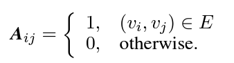
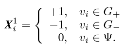
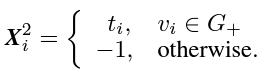
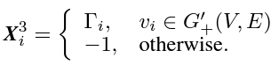

## **1. Problem Definition**  

The primary problem addressed in this paper is source detection in graphs with incomplete node information. Specifically, the task is to identify the origin of a rumor in a social network where some nodes have missing or incomplete data, such as missing timestamps of message reception or incomplete user activity.

Rumor source detection is important for mitigating the spread of misinformation on social media, but it becomes significantly harder when key data is missing. To address this, the authors drew inspiration from two emerging trends in machine learning: positional encoding (Han et al. 2021) and attention mechanisms.

## **2. Motivation**  

In real-world social networks, obtaining complete user data is often impractical due to privacy concerns, technical limitations, and the large scale of data collection (Du et al. 2017; Zhou, Jagmohan, and Varshney 2019). 

Previously existing architectures for rumor source detection typically assume access to complete and clean datasets. In practice, as showed by the investigations of this paper, most existing models that depend on full access to this information struggle with propagating information effectively across the graph when faced with incomplete datasets. Moreover, models that rely on full snapshots of the network tend to treat missing nodes or edges as noise or unknowns, which introduces errors in their predictions.

## **3. Method**  

### Problem Formulation

The social network is represented as a graph $G = (V, E)$, where:

- $V$ represents the set of nodes (users),
- $E$ represents the set of edges (connections between users).

The graph is represented by its adjacency matrix $A$, where:

The propagation of the rumor over time is modeled as a time series $\{X(t), t \geq 0\}$, where $X(t)$ is the state matrix of the graph at time $t$. Each node's state at time $t$ is either:
- $+1$ (rumor received),
- $-1$ (rumor not received),
- $0$ (missing or incomplete information).

### Propagation Process

At every time step, a vertex $v_ i$ has probability $p_ i$ of propagating the rumors it currently has access to. The propagation continues until the spread reaches a threshold of $\theta \%$ of nodes being infected. A snapshot $G'(T, U,P)$ of the network is taken, where: 
- $T$ represents the network topology, 
- $U$ represents user states and information forwarding frequency
- $P$ represents reception time of information and information propagator data

In order to deal with the incomplete information of $U$ and $P$, the incomplete data problem is formalized though the ratio of incomplete user data $\delta$:
 $U' = (1-\delta)U$, $P' = (1-\delta)P$

### **Positional Embedding Module (PEM)**

The PEM is designed to capture information about the position of nodes in the graph, especially focusing on incomplete nodes. It incorporates three main types of features: user state, propagation information, and positional information.

1. **User State Information**:
   The state of each user $v_ i$ is defined based on whether the user has been influenced by the rumor, has not been influenced, or has missing information. The user state feature $X^1_ i$ is represented as:

   

2. **Propagation Information**:
   Each user $v_ i$ also has a timestamp $t_ i$ indicating when the user received the rumor. The propagation information $X^2_ i$ is represented as:

3. **Positional Information**:
   The positional information is computed using Laplacian Positional Encodings of the infected subgraph $G^+$. For each node $v_ i$, its positional encoding $X^3_ i$ is derived by calculating the eigenvectors of the symmetrically normalized Laplacian matrix:

   $L_ {\text{sym}} = I - D^{-1/2} A D^{-1/2}$

   Where $A$ is the adjacency matrix, and $D$ is the degree matrix of the infected subgraph.
  Factorization is then performed on this matrix to obtain the relevant eigenvalues and eigenvectors: 
  $\Delta L_ {\text{sym}}^+ = \Gamma^T \Lambda \Gamma$ 
  Where $\Gamma$ and $\Lambda$ represent the eigenvector and eigenvalue matrices of $L_ {\text{sym}}$.  We select the $k$ smallest non-trivial eigenvectors as $\Gamma_ i$ for user $v_ i$'s positional information, where $k$ is a small number. Those values correspond to important clusters in our original graph.
  The positional encoding $X^3_ i$ for user $v_ i$ is then represented as: 
  
  

The final feature vector for each node is the concatenation of all features:

$X_ i = [X^1_ i \parallel X^2_ i \parallel X^3_ i]$

---

### **Attentive Fusion Module (AFM)**

The **Attentive Fusion Module (AFM)** applies a self-attention mechanism to assign different attention weights to nodes based on their information transmission capacity. The presented approach is a very classical way of implementing the attention mechanism.

The attention mechanism computes the relevance of node $v_ j$ to node $v_ i$ by defining the attention coefficient $e_ {ij}$ as follows:

$e_ {ij} = a^T \cdot \text{LReLU}(W^{(l)}[X_ i^{(l)} , X_ j^{(l)}])$

Where $W$ is a learnable weight matrix, $a$ is the attention weight vector,
$X^{(l)}$ is the feature representation of users and $LReLU$ is the activation function.

The attention weights are then normalized using a softmax function:

$\alpha_ {ij} = \frac{\exp(e_ {ij})}{\sum_ {k \in N(v_  i)} \exp(e_ {ik})}$

Where $N(i)$ is the set of neighbors of node $v_ i$.

The final representation of node $v_ i$ is a weighted sum of its neighbors' features:

$X'_ i = \sum_ {j \in N(v_  i)} \alpha_ {ij} W X_ j$

Multiple attention heads are used to capture diverse information, and the outputs are concatenated:

$X''_ i = \parallel_ {k=1}^{K}\sigma(X'^k_ i)$, where $\sigma$ is a $RELU$ activation function

For dimension alignment, there is a mean pooling layer at the end of the model:
$X'''_ i = \sigma \left( \frac{1}{K} \sum_ {k=1}^{K} X'^ k_  i \right)$

Finally, the output is passed through a softmax function for classification:
$S(\mathbf{z})_ i = \frac{e^{z_ i}}{\sum_ j e^{z_ j}}, \quad \mathbf{z} = X'''_ i$

### **Loss Function and Training**

The loss function in the framework is designed to address the class imbalance problem between source and non-source nodes. Since the number of non-source nodes is much larger than the number of source nodes, simple classification models are biased toward the majority class. To mitigate this bias, the authors introduce a **class-balancing mechanism**. This mechanism assigns a higher weight to source nodes during training, ensuring that the model pays equal attention to both source and non-source nodes. The class-balancing constant $\xi$ is computed as:

$\xi = \frac{\vert s \vert}{n - \vert s \vert}$

where $\vert s \vert$ is the number of source nodes, and $n$ is the total number of nodes. This ensures that the weight distribution between source and non-source nodes is balanced.

The overall loss function is composed of two main terms: the cross-entropy loss for both source and non-source nodes, weighted by $\xi$, and an $L_ 2$ regularization term to prevent overfitting. The complete loss function is defined as:

$\text{Loss} = \sum_ {v_ i \in s} L_ i + \xi \sum_ {v_ j \in (V - s)} L_ j + \lambda \vert w \vert_ 2$

where $L_ i$ represents the cross-entropy loss for each sample, and $\lambda$ is the regularization coefficient. 

## **4. Experiment and Results**

### **Experiment Setup**
To evaluate the effectiveness of the proposed GIN-SD model, the authors conducted experiments on eight real-world datasets of varying sizes and structures.  The task was to detect the sources of a rumor in these networks, assuming that a portion of the nodes had incomplete information. GIN-SD was compared against several state-of-the-art source detection methods, with values for $\delta$ being $0.1$ and $0.2$. The method of propagation considered is Independent Cascade (Wen et al. 2017).

Two widely used metrics were used to evaluate the model's performance:

1. Accuracy: The proportion of correctly classified source nodes among all nodes.
2. F-Score: The harmonic mean of Precision and Recall.

### **Results**

Among all methods, GIN-SD provides the best results. Compared to models that do not focus on the propagation process, GIN-SD has an average improvement of $32\%$, and compared to models tat do consider the propagation process GIN-SD's accuracy increase ranges between $5\%$ and $18\%$. 

For other models, it is noted that even when the Accuracy performance is good, the F-Score is usually low. This is caused by other models not dealing with the class imbalance issue, and non-source nodes significantly outnumbering source nodes.

#### **Impact of Incomplete Node Ratio**

The authors also investigated how the proportion of incomplete nodes affects the performance of different models. As the percentage of incomplete nodes increases from 0% to 25%, the performance of all methods decreases, but GIN-SD remains more robust compared to others, showing a significantly smaller decline in both accuracy and F-Score.

#### **Ablation Study**

To validate the necessity of each module in GIN-SD, an ablation study was conducted, showing that removing either the PEM or the class-balancing mechanism resulted in a notable drop in performance. Surprisingly, removing the AFM resulted in only a slight drop in performance. 

## **5. Conclusion**  

The experimental results demonstrated that GIN-SD significantly outperforms state-of-the-art methods across multiple real-world datasets, maintaining high accuracy and F-Score even with incomplete nodes. 

GIN-SD offers a promising solution for handling missing data and incomplete information in source detection task. The integration of class-balancing mechanisms and positional encoding techniques make GIN-SD a powerful tool for rumor source detection and similar applications.

## **Author Information**  

* Author name: Anca-Mihaela Sfia
* Affiliation: Ecole Polytechnique
* Research Topic: Recommender Systems and Graph Machine Learning

## **6. Reference & Additional materials**  

* Han, K.; Xiao, A.; Wu, E.; Guo, J.; Xu, C.; and Wang, Y. 2021. Transformer in transformer. Advances in Neural Information Processing Systems, 34: 15908–15919.
* Du, J.; Jiang, C.; Chen, K.-C.; Ren, Y.; and Poor, H. V. 2017. Community-structured evolutionary game for privacy protection in social networks. IEEE Transactions on Information Forensics and Security, 13(3): 574–589.
* Zhou, H.; Jagmohan, A.; and Varshney, L. R. 2019. Generalized Jordan center: A source localization heuristic for noisy and incomplete observations. In 2019 IEEE Data Science Workshop (DSW), 243–247. IEEE.
* Wen, Z.; Kveton, B.; Valko, M.; and Vaswani, S. 2017. Online infuence maximization under independent cascade model with semi-bandit feedback. Advances in Neural Information Processing Systems, 30.

