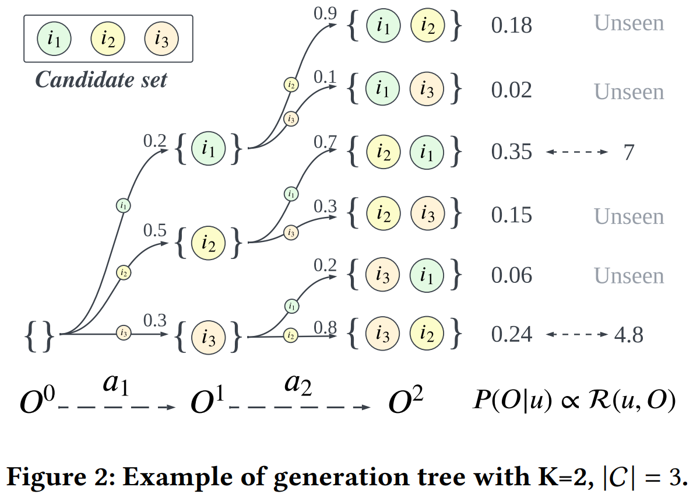
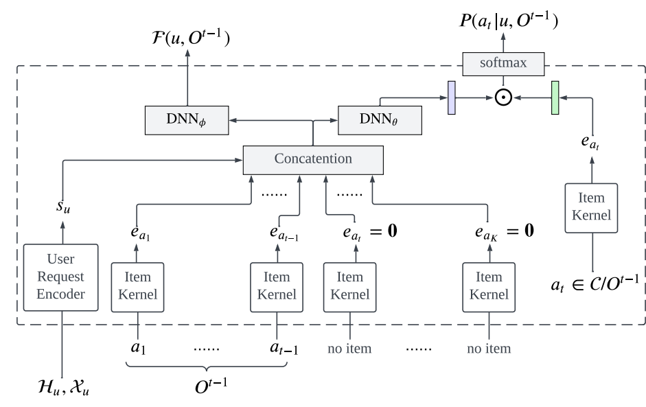
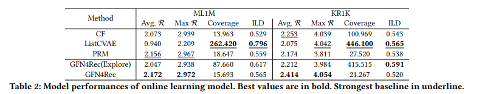
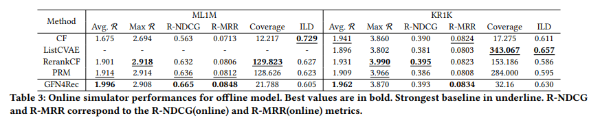
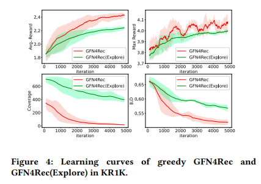
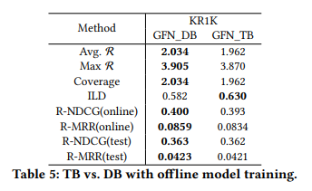

ID: 20245231\
Name: Taeyoung Yun

### 1. Motivation
개인화 추천 시스템 (Personalized Recommender System)의 목표는 사용자의 취향에 맞는 일련의 아이템 리스트를 생성하는 정책 함수(Policy)를 학습하는 것이다. 기존 방법론들은 주로 아이템 각각의 점수를 예측하는 모델을 지도 학습 (Supervised Learning)으로 학습한 뒤, 상위 $K$개의 아이템을 선택하는 방식인데, 이러한 방식은 아이템 간의 상호 보완적인 관계를 포착할 수 없다는 한계가 있다. 최근에는 아이템 리스트 전체에 대한 보상(reward)을 최대화하는 리스트를 생성하는 생성형 모델 (Generative Models)를 활용하는 연구가 주목받고 있지만. 방대한 조합 공간 탐색의 어려움과 다양한 아이템 리스트를 만들지 못한다는 한계가 존재한다. 본 연구에서는 Generative Flow Networks (GFlowNets)를 활용하여 위 문제를 해결하고자 하였다.

### 2. Preliminaries
#### 2.1. Listwise Recommendation
리스트 기반 추천 (Listwise Recommendation)문제는 다음과 같이 정의할 수 있다.
사용자 집합을 $\mathcal{U}$, 아이템 집합을 $\mathcal{I}$라고 정의하자. 리스트 기반 추천 문제는 사용자 $u\in\mathcal{U}$와 아이템 후보 집합 $C$가 주어졌을 때, 보상 함수 $\mathcal{R}(u, O)$를 최대화하는 $u$에게 추천할 $K$개의 아이템 $O\in C^{K}$를 찾는 정책 함수 $\pi(C,u;\theta)$를 찾는 문제이다. 수식으로 표현하면 다음과 같다.
$
\theta^{*}=\arg\max_ {\theta}\mathbb{E}_ {u\in\mathcal{U}}\left[\mathcal{R}(u, \pi(C, u;\theta))\right]
$

#### 2.2. Generative Flow Networks
생성 흐름 모델 (Generative Flow Networks, GFlowNets)은 생성형 모델을 학습하는 방법론 중 하나로, 공집합 (empty set)에서 시작하여 순차적으로 기본 블록 (building blocks)을 쌓아가며 우리가 원하는 object (e.g., set, list, graph, ...)를 생성하고자 한다. 순차적으로 action을 선택한다는 점에서 강화 학습 (Reinforcement Learning)과 유사하지만, GFlowNets은 주어진 보상 함수를 최대화하는 것이 아닌 학습한 정책 함수가 보상 함수에 비례하게 object를 생성하는 것을 목표로 하기 때문에 높은 보상을 얻으면서도 다양한 object를 생성할 수 있다는 장점이 있다. 수식으로 표현하면 다음과 같다.
$
P_ {\theta}(\tau)\propto \mathcal{R}(O^{T}),\\
\text{where } \tau=\lbrace\emptyset=O^{0}\rightarrow O^{1}\rightarrow\cdots\rightarrow O^{T}\rbrace
$

GFlowNets를 학습하는 방식으로는 크게 두 가지가 있는데, Trajectory Balance (TB)와 Detailed Balance (DB)가 있다. TB는 object를 생성하는 경로 $\tau$가 주어졌을 때, 아래 목적 함수를 최소화하는 방향으로 학습을 진행한다.

$
\mathcal{L}_ {\text{TB}}(\theta, \phi)=\log\left(\frac{\mathcal{F}_ {\phi}(u, \emptyset)\prod_ {t=1}^{K}P_ {\theta}(a_ t\vert u, O^{t-1})}{\mathcal{R}(u, O^{K})}\right)^2
$

TB는 object를 생성하는 경로 전체를 가지고 학습을 진행하기 때문에, 경로의 길이가 길어지는 경우 학습의 variance가 커질 위험이 있다. DB는 경로 전체가 아닌 transition을 기반으로 학습을 진행한다. DB의 목적함수는 아래와 같다.

$
\mathcal{L}_ {\text{DB}}(\theta, \phi)=\sum_ {t=1}^{K-1}\log\left(\frac{\mathcal{F}_ {\phi}(u, O^{t-1})P_ {\theta}(a_ t\vert u, O^{t-1})}{\mathcal{F}_ {\phi}(u, O^t)}\right)^2+\log\left(\frac{\mathcal{F}_ {\phi}(u, O^{K-1})P_ {\theta}(a_ t\vert u, O^{K-1})}{\mathcal{R}_ {\phi}(u, O^K)}\right)^2
$

### 3. Method
#### 3.1. Item Selection Model and Generation Tree
본 단락에서는 어떻게 모델을 정의하고 어떻게 모델을 활용하여 아이템 리스트를 생성하는 지에 대해 설명한다. 리스트를 생성하는 절차는 아래와 같다.

1. 사용자의 데이터 $u$가 들어오면, 먼저 리스트를 초기화한다. $O^{0}=\emptyset$
2. 매 timestep $t$마다 아직 선택 안 된 아이템 후보 리스트 중 어떤 아이템을 추천 리스트에 넣을 것인지를 item selection model $P_ {\theta}(i\vert u, O^{t-1})$로부터 선택한다. $a_ t\sim P_ {\theta}(i\vert u, O^{t-1})$
3. 선택한 아이템을 추천 리스트에 넣는다. $O^{t}=O^{t-1}\oplus\lbrace a_ t \rbrace$
4. timestep이 끝날 때까지 2,3번을 반복한다.

Autoregressive하게 아이템을 선택하기 때문에 우리는 쉽게 item selection model이 특정 아이템 리스트를 생성할 확률을 아래와 같이 구할 수 있다. 그림은 item selection model이 아이템 리스트를 생성하는 과정을 도식화한 것이다.

$
P_ {\theta}(O\vert u)=\prod_ {t=1}^{K}P_ {\theta}(a_ t\vert u, O^{t-1})
$

#### 3.2. Learning Objectives on Network Flow
본 단락에서는 어떻게 모델을 학습하여 보상이 높으면서도 다양한 아이템 리스트를 만드는 정책 함수를 만드는 지에 대해 설명한다. Preliminaries에서 설명하였듯이, GFlowNets의 목표는 아래와 같고, TB와 DB loss를 활용해 모델을 학습할 수 있다.
$
P(O\vert u) \propto \mathcal{R}(u, O)
$

#### 3.3. Transformer-based User Request Encoder
본 단락에서는 사용자와 관련된 정보를 처리하는 Encoder구조에 대해 이야기한다. 사용자와 관련된 정보로는 user profile $(\mathcal{X}_ {u})$와 user history $(\mathcal{H}_ {u}=\lbrace (a_ 1, Y_ {a_ 1}), \cdots, (a_ L, Y_ {a_ {L}})\rbrace)$이 주어진다. 본 논문에서는 Transformer기반 Encoder를 활용하여 user정보를 input으로 받아 user state embedding $s_t$를 만들고 이를 item selection model의 input으로 활용한다.

전체 모델 아키텍쳐는 아래 그림과 같다.

### 4. Experiments

#### 4.1. Experiment Setup
실험 세팅은 다음과 같다.
1. Datasets
    - ML1M: user의 movie rating정보를 담고 있는 데이터이다. $(\vert\mathcal{U}\vert=6400, \vert\mathcal{U}\vert=3706, \text{record}=1000208)$
    - KR1K: user의 short videos 시청 기록 정보를 담고 있는 데이터이다. $(\vert\mathcal{U}\vert=1000, \vert\mathcal{U}\vert=69219, \text{record}=2597865)$

2. Baselines
    - CF: user와 item embedding의 dot product로 user의 item에 대한 score을 예측하는 모델
    - ListCVAE: Conditional VAE를 활용하여 높은 보상을 가지는 아이템 리스트를 생성하도록 학습된 모델
    - PRM: CF 모델을 초기 랭킹 모델로 두고 Transformer기반 re-ranking모델을 학습하는 방식
    - GFN4Rec: 제안한 모델 (default: TB)

3. Simulated User Environment
    - 특정 아이템 리스트의 효과를 확인하기 위한 시뮬레이터를 만들기 위해, stochastic한 user model를 데이터를 통해 학습하였다. 

#### 4.2. Online Learning
제안한 모델의 효과를 검증하기 위해, 먼저 온라인 세팅에서 실험을 진행하였다. Online 상황이기 때문에 exploration을 진행할 때 action을 무조건 학습 중인 정책 함수로부터 sampling할 필요가 없다. 따라서 두 가지 버전을 실험하였다. 
- GFN4Rec(Explore): $\epsilon$-greedy방식으로 action을 선택
- GFN4Rec: 학습 중인 policy로 action을 선택. 
    
실험에 사용한 metric은 아래와 같다.
- Avg, Max reward: 아이템 리스트의 평균, 최대 보상. mini-batch로 들어온 user request에 대해 계산하였다.
- Coverage: mini-batch로 들어온 user request에 대해 생성한 아이템 리스트에 존재하는 서로 다른 아이템의 개수
- ILD (intra-list diversity): 1.0 - 아이템 리스트에 존재하는 아이템 간의 pairwise cosine similarity

실험 결과는 아래와 같다. 본문에서 주장하였듯이, GFN4Rec를 사용하였을 때 높은 reward를 가지면서도 상대적으로 다양한 아이템 리스트를 생성하는 것을 확인할 수 있다.

#### 4.3. Offline Learning
제안한 모델은 Offline 상황에서도 활용될 수 있다. 실험 결과는 아래와 같다. 본문에서 주장하였듯이, GFN4Rec를 사용하였을 때 Offline 상황에서도 높은 reward를 가지면서도 상대적으로 다양한 아이템 리스트를 생성하는 것을 확인할 수 있다.

#### 4.4. Ablation Studies
본 논문에서는 여러 가지 components에 대한 다양한 ablation studies를 진행하였다. 
1. Greedy vs Exploration
    - Online 상황에서는 action를 선택할 때 지금 학습하고 있는 정책 함수만 사용할 것인지, $\epsilon$-greedy와 같은 Exploration을 진행할 것인지를 선택할 수 있다. 실험 결과 평균 reward는 Greedy한 방식이 더 높지만, diversity metric인 coverage의 경우 Exploration은 진행했을 때 더 높은 것을 아래 그림에서 확인할 수 있다.

    

2. TB vs DB
    - GFlowNets를 학습하기 위해 TB혹은 DB loss를 활용할 수 있다. 실험 결과 variance가 큰 TB에 비해 상대적으로 DB가 많은 metric에서 좋은 performance를 보여주는 것을 확인할 수 있다.

    

### 5. Conclusion
본 논문에서는 Listwise Recommendation문제에서 높은 reward를 가지면서도 다양한 아이템 리스트를 생성하는 모델을 만들기 위해 Generative Flow Networks를 활용하였다. 실험 결과 추천 태스크에서 기존 baselines에 비해 높은 reward를 가지면서도 상대적으로 다양한 아이템 리스트를 생성하는 것을 확인할 수 있었다. 하지만 GFN4Rec은 다양한 hyperparameters를 요구한다는 문제와, reward-diversity trade-off를 위해서 sophisticated한 exploration strategy가 필요하다는 한계가 있다.

#### 5.1. Possible Future Works
본 문제와 같이 Conditional Generation문제에 GFlowNets를 적용하는 경우, TB loss는 variance가 크다는 한계가 있다. 많은 논문들에서 이를 해결하기 위해 VarGrad라는 기법을 활용한다 [1, 2, 3]. VarGrad는 TB와 달리 initial flow를 direct하게 parametrize하지 않고, 아래 식을 활용해 모델을 학습한다.
$
\hat{\mathcal{F}}(u, \emptyset)^{(i)} = \log\mathcal{R}(u, O^K_ {i}) - \sum_ {t=1}^{K}\log P_ {\theta}(a_ t\vert u, O^{t-1}_ {i})\\
\mathcal{L}_ {\text{VarGrad}}(\theta)=\left(\hat{\mathcal{F}}(u, \emptyset)^{(i)} - \frac{1}{B}\sum_ {j=1}^{B}\hat{\mathcal{F}}(u, \emptyset)^{(j)}\right)^2
$
위 문제에서도 이러한 기법을 활용한다면 성능 향상을 기대할 수 있을 것으로 보인다.

### References
[1] Richter et al., VarGrad: A Low-Variance Gradient Estimator for Variational Inference, NIPS 2020

[2] Zheng et al., Robust Scheduling with GFlowNets, ICLR 2023

[3] Kim et al., Amortizing Intractable Inference in Diffusion Models for Vision, Language and Control, NIPS 2024