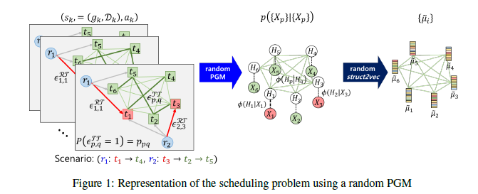
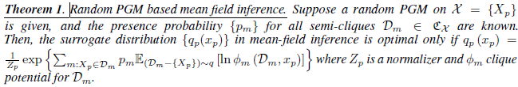
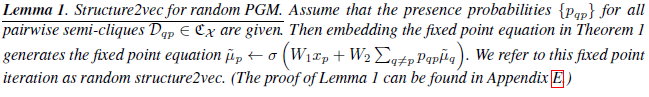
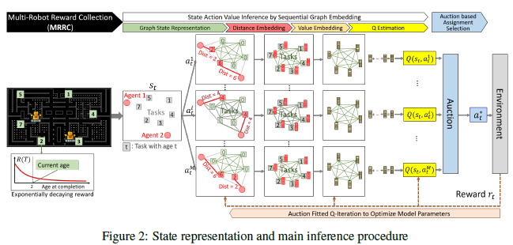
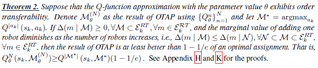
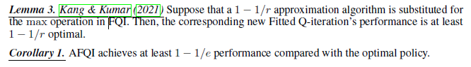
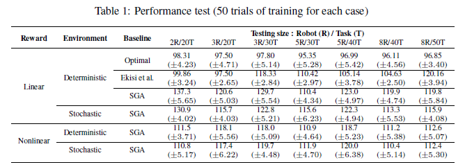
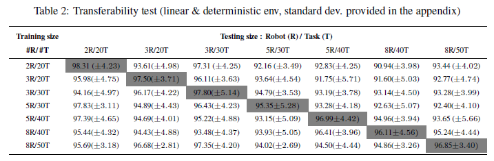
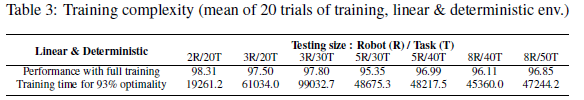

## 1. Introduction
### 1.1 문제 정의
**멀티 로봇 보상 수집 문제 (MRRC):**  
- 시간에 따라 변화하는 보상을 고려한 멀티 에이전트, 멀티 태스크 NP-난해 계획 문제.
- 동일한 로봇들이 공간적으로 분포된 작업을 수행하려고 함.
- 미리 정해진 보상 규칙에 따라, 더 빨리 작업을 완료할 때 더 높은 보상을 부여.
- MRRC 문제는 라이드 쉐어링, 픽업-딜리버리와 같은 문제를 잘 모델링함.
- 응용 분야: 고객을 운송하기 위한 운전 기사 배차, 또는 공장에서의 기계 스케줄링.

### 1.2 문제점
- **비싼 계산 비용**, 특히 문제의 규모가 커질 때.
- 멀티 에이전트 모델링 프레임워크를 사용하는 분산 접근법의 어려움:
  - 통신 없이 **에이전트 간에 합의**를 유도해 글로벌 목표를 달성하는 것이 불가능.

따라서, 이 연구는 **중앙 집중식 방법**을 사용하여 MRRC 문제를 해결하는 데 집중함.

### 1.3 연구 질문
대규모 NP-난해 스케줄링 문제를 해결하기 위해 **학습 기반 중앙 집중식 의사결정 방식**을 설계할 때, 학습과 의사결정 측면에서 **효율적이고 확장 가능한** 방법을 어떻게 설계할 수 있을까?

### 1.4 연구 기여
- state-joint action 쌍을 **random PGM(Probabilistic Graphical Model)** 으로 표현할 수 있음을 관찰. 이를 바탕으로 **random PGM 기반 Mean-field inference** 이론을 개발하고, **structure2vec** (Dai et al., 2016)의 확장판인 **random structure2vec**을 제안.
- Q-function을 랜덤 structure2vec 계층을 사용해 추정. structure2vec의 계층을 **Weisfeiler-Lehman 커널**로 해석하여, **order-transferability**(순서 전달성)라는 속성을 갖도록 설계. 이는 문제 규모에 따라 **전이 가능한** 성질을 제공함.
- **OTAP (Order-Transferability-Enabled Auction Policy)** 라는 할당 규칙을 제안하여, 할당 공간의 지수적 성장을 해결함.
- **AFQI (Auction-Fitted Q-Iteration)** 는 기존 Fitted Q-Iteration의 argmax 연산을 OTAP으로 대체해 Q-function를 **효율적으로 학습**하도록 제안됨.
- **AFQI는 다항 시간 내에** 계산 가능하며, 최적 정책의 최소 \(1 - 1/e\) 성능을 달성함이 입증됨.

## 2. Multi-Robot Reward Collection Problem (MRRC)

본문에서는 MRRC problem을 disctrete-time, discrete-state (DTDS) sequential decision-making problem으로 정의함.
- 시간 증분이 $\triangle$ 즉, $t_k = t_0 + \triangle \times k$ ($t_k$: $k$번째 결정의 실제 시간).
- 이 프레임워크에서 $s_k$는 상태를 나타내고, $a_k$는 $k$번째 에포크(epoch)에서 로봇/기계를 미완료 작업에 할당하는 조인트 할당을 의미함.
- 이 문제의 목표는 최적의 스케줄링 정책 $\pi_\theta : s_k \rightarrow a_k$를 학습하는 것이며, 이는 수집된 보상을 극대화하거나 총 작업 완료 시간을 최소화하는 것을 목적.

### 2.1 State
State $s_k = (g_k, D_k)$로 나타내며 그래프 $g_k= ((R,T_k),(E_k^{TT},E_k^{RT}))$와 관련 특성 $D_k = (D_k^R,D_k^T,D_k^{TT},D_k^{RT})$로 정의됨.

$g_k$ 정의:
- $R=${ $1,...,M$ }: 모든 로봇 set, $i$와 $j$ 인댁스로 나타냄.
- $T_k=${ $1,...,N$ }: $k$번째 에포크때 남아있는 unserved task set, $p$와 $q$ 인댁스로 나타냄.
- $E_k^{TT} = ${ $\epsilon_{pq}^{TT}|p \in T_k, q \in T_k$ }:
  - 모든 작업에서 다른 작업으로 향하는 모든 방향성 있는 간선들의 집합.
  - 각 간선은 확률 변수로 간주.
  - 작업-작업 간선 $\epsilon_{pq}^{TT} = 1$은 작업 $p$를 완료한 로봇이 이후에 작업 $q$ 를 수행하는 이벤트를 의미함.
  - 간선 $\epsilon_{pq}^{TT}$의 존재 확률을 $p(\epsilon_{pq}^{TT} = 1) \in [0, 1] $로 나타냄.
- $E_k^{RT} = ${ $\epsilon_{iq}^{RT}|i \in R, q \in T_k$ }:
  - 로봇 $R$에서 작업 $T_k$로 향하는 모든 방향성 있는 간선들의 집합
  - 로봇-작업 간선 $\epsilon_{ip}^{RT} = 1$은 로봇 $i$가 작업 $p$에 할당된 이벤트를 의미
  - 이 간선은 공동 할당 액션에 따라 deterministic.
  - 만약 로봇 $i$가 작업 $p$에 할당되면 $p(\epsilon_{ip}^{RT}) = 1$이고, 그렇지 않으면 0입니다.
 
$D_k$ 정의:
- $D_k^R=${ $d_i^R|i\in R$ }:
  - 에포크 $k$때 로봇 노드 $R$의 노드 특징들의 집합.
  - MRRC에서는 $d^R_i$를 에포크 $k$에서 로봇 $i$의 위치로 정의 (에포크 인덱스 $k$는 생략될 수 있음).
- $D_k^T=${ $d_p^T|p\in T_k$ \}
  - 에포크 $k$때 작업 노드 $T_k$의 노드 특징들의 집합
  - MRRC에서는 $d_p^T$를 에포크 $k$에서 작업 $p$의 나이로 정의 (에포크 인덱스 $k$는 생략될 수 있음).
- $D_k^{TT}=${ $d_{pq}^{TT}|p\in T_k, q\in T_k$}
  - 에포크 $k$때 작업 간의 간선 feature들의 집합
  - $d_{pq}^{TT}$는 작업 $p$를 완료한 로봇이 작업 $q$를 완료하는 데 걸리는 시간을 나타냄. 이 시간을 **작업 완료 시간**이라함.
  - MRRC에서는 작업 완료 시간이 확률 변수로 주어지며, 실제로는 이 확률 변수의 샘플 집합만 필요함.
- $D_k^{RT}=${ $d_{ip}^{RT}|i\in R, p\in T_k$}
  - 에포크 $k$때 로봇-작업 간의 간선 특징들의 집합.
  - $d_{ip}^{RT}$는 로봇 $i$가 작업 $p$에 도달하는 데 걸리는 시간을 나타냄.

### 2.2 Action
- 에포크 $k$때 액션 $a_k$는 완전 이분 그래프 $(R, T_k, E_k^{RT})$ 의 최대 이분 매칭(maximal bipartite matching)으로 정의됨. 
- 즉, 현재 상태 $s_k = (g_k, D_k)$가 주어졌을 때, $a_k$는 다음 조건을 만족하는 $E_k^{RT}$ 의 부분 집합입니다:
  1. 두 로봇이 동일한 작업에 할당될 수 없음.  
  2. 남아 있는 작업 수보다 로봇 수가 더 많은 경우에만 일부 로봇이 할당되지 않을 수 있음.
- 만약 $\epsilon^{RT}_{ip} \in a_k$ 이면, 이는 에포크 $k$ 에서 로봇 $i$가 작업 $p$에 할당된다는 것을 의미함.
- 모든 로봇에 할당된 것은 매 애포크 마다 바뀔 수 있음.
  
### 2.3 State transition
- Graph update: 작업 $p$가 완료되는 시점이 되면, 해당 작업 노드는 업데이트된 작업 노드에서 제거됨. 즉, $T_{k+1} = T_k \setminus${ $p$ }. 또한, 작업-작업 간선 $E_{k+1}^{TT}$과 로봇-작업 간선 $E_{k+1}^{RT}$도 이에 맞게 업데이트됨.
- Feature update: $D_k+1= (D_{k+1}^R,D_{k+1}^T,D_{k+1}^{TT},D_{k+1}^{RT})$은 determined.

### 2.4 Reward and objective
- 시간 0에서, 각 작업에는 초기 나이가 주어지며, 이 나이는 시간에 따라 선형적으로 증가함.
- 에포크 $k$에서 나이가 $d_p^T$ 인 작업 $p \in T_k$ 가 수행될 때 주어지는 보상 $r_k$는 $r_k = r - d_p^T$로 정의
- MRRC에서는 선형 및 비선형 보상 함수 $r$를 고려함.
- 목표는 정책 $\pi$를 학습하는 것: 정책 $\pi$ 는 현재 상태 $s$를 현재 액션 $a$로 매핑하는 함수로, 주어진 정책에 따라 총 기대 보상을 최대화하는 것을 목표로 함.
  
$$Q^\pi (s, a):=E_{P,\pi} \left\[ \sum_{k=0}^{\infty} R(s_{t_k}, a_{t_k}, s_{t_{k+1}}) \mid s_{t_0} = s, a_{t_0} = a \right\]$$

## 3. Random graph embedding: RandStructure2Vec

### 3.1 Random PGM for representing a state of MRRC
- Random probabilistic graphical model (PGM) $\chi=${ $X_p$ } (random variable)

  $$p(\chi) = \frac{1}{Z}\prod_i \phi_i(D_i)$$
  - $Z$: normalizing constant
  - $\phi_i(D_i)$: clique potnetial for $D_i$
  - $D_i$: clique (scope of $\phi_i$)
- Scenarios:
  - 주어진 상태 $s_k$와 행동 $a_k$ 에서 시작하여, “정책 $\pi$를 사용한 순차적 의사결정”이라는 랜덤 실험을 수행할 수 있음.
  - random experiment에서 '로봇들은 남아 있는 모든 작업을 어떤 순서로 수행하는가?'를 나타냄.
  - 1개의 scenario는 1개의 Bayesian Network로 나타냄.
  - scenario realization은 random하기 때문에, random node $X_k=(s_k,a_k)$와 clique potential $\phi$로 이루어진 **random** Bayesian Network로 나타낼 수 있음.
### 3.2 Mean-field inference with random PGM
- random variable인 $\chi =${ $X_p$}를 추론하는 문제에서 $G_\chi$를 가능한 모든 PGM set, $P: G_\chi \to [0,1]$ probability measure라 하면 $|G_\chi|$가 너무 커서 Monte-Carlo sampling 방법으로는 { $G_\chi,P$ } 추론이 어려움.
- semi-cliques $D_m$를 사용해서 approximation할 것:
  - $C_\chi$를 가능한 모든 clique들의 집합이라 할때 $P$에 따르면 실제 realization되는 clique는 일부뿐인데 그 잠재적 clique들 semi-clique라 함.
  - semi-clique $D_m$에 대한 확률 $p_m = \sum_{G\in G_\chi} P(G)1_{D_m\in G} $
#### Mean-field inference with random PGM
- Random PGM on $\chi =$ ({ $H_i$ },{ $X_j$ }) ($H_K$: 관측변수 $X_k$에 대응되는 잠재변수)
- 목표: p({ $H_i$ }|{ $x_j$ })를 찾아 { $X_j$ }가 주어졌을때 { $H_i$ }를 추론
- Mean-field inference에서는 { $H_i$ }들이 independent한 surrogate distribution  $q^{ \lbrace x_j \rbrace }(H_i)$의 set을 찾는 것이 목표 ($q^{ \lbrace x_j \rbrace }$는 $q$가 { $x_j$ } 로 이루어짐을 뜻함.)

    

- Theorem 1은  각 semi-clique의 확률 $p_m$을 추론 하는 것만으로 mean-field inference를 하는데 충분하며, { $G_\chi,P$ } 추론이 필요 없음을 의미함. 
#### RadStructure2Vec
- **structure2vec**: Dai et al.(2016)에서 mean-field inference와 PGM를 통해 vector space embedding을 도출함.
  - PGM이 realization될 경우 PGM의 joint distribution은 다음과 같이 factorization 된다고 가정
  
$$\prod_p \phi(H_p|I_p)\prod_{p,q} \phi(H_p|H_q) $$
  - 위 가정 하에서 { $q^{ \lbrace x_j \rbrace }(H_i)$ } 를  { $q^{ x_j  }(H_i)$ } 로 쓸 수 있음.
  - Fixed point iteration
    
    $$\tilde{\mu_p} \gets \sigma ( W_1 x_p +W_2 \sum_{q \neq p} \tilde{\mu_q} ) $$
  - $\tilde{\mu_p}$는 노드 $p$의 잠재 벡터이고, $x_p는 노드 $p$의 input
  - $\tilde{\mu_p}$를 injective embedding으로 해석할 시 structure2vec의 fixed point iteration == Mean-field inference의 fiexed point inference임을 보임

$$\tilde{\mu_i} = \int _H \phi(h_i) q^{x_i}(h_i) dh_i $$
- Random structure2vec
  - Theorem 1에 따라 random structure2vec은 mean-field inference와 random PGM를 통해 vector space embedding을 도출함.
 
      

  - Lemma 1은 GNN을 사용해 무작위 그래프를 임베딩할 때, 간선 존재 여부 간의 상호 의존성을 무시해도 된다는 이론적 근거를 제공함.
  - 그래프의 간선이 명시적으로 주어지지 않거나 무작위로 알려진 경우, 사용할 수 있는 가장 간단한 휴리스틱은 모든 간선의 존재 확률을 개별적으로 추론하고, GNN의 message propagation 과정에서 가중치를 조정하는 것.
  - Lemma 1에 따르면, 간선 간의 상호 의존성은 이러한 휴리스틱 추론의 품질에 영향을 미치지 않음.

## 4. Solving MRRC with RandStructure2Vec

- random structure2vec을 이용해 MRRC 문제를 푸는 방법에 대해 설명
- state $s_k=(g_k,D_k)$ 가 주어졌을때 $a_k$를 어떻게 할지 설명:
  1. random Bayesian Network를 통해 state 표현
  2. random graph embedding을 통해 Q-value 추정
  3. joint assignment 선택
### 4.1 Representing a state using a random PGM
- 하나의 $s_k$와 $a_k$를 bayesian network로 표현
- $H_p$: 작업 $p$에 대한 hidden random variable - 작업 $p$의 이익에 대한 정보를 담음.
- 시나리오가 주어졌을때, $H_p$는 작업 $p$의 feature $X_p$에 dependent하고 만약 같은 로봇이 작업 $p$이후 $q$를 한다면 $H_q$에도 dependent함.
- Bayesian Network는 다음과 같이 정의되며 이는 하나의 시나리오에 대응됨.

  $$p(\lbrace H_p \rbrace | \lbrace X_p \rbrace) = \prod_p \phi(H_p|X_p) \prod_{p,q} \phi(H_p|H_q) $$
- Lemma 1에 따르면 random PGM이 이러한 특성을 모델링하기 때문에 edge(semi-clique)에 대한 확률 { $p(\epsilon_{pq}^{TT}$) }을 사용한 random structure2vec을 적용
- 작업 $p$에대한 embedding $\tilde{ \mu_p } $는 다음과 같음.
  
$$\tilde{\mu_p} \gets \sigma \left( W_1 x_p +W_2 \sum_{p \neq q} p_{qp} \tilde{\mu_q} \right) $$
### 4.2 Estimating state-action value using Order trainability-enabled Q-function
- MRRC 문제에서 주어지는 $X_p$는 $d_{ip}^{RT}$ (로봇 $i$과 작업 $p$와의 거리)와 $d_p^T$ (작업 $p$의 나이)로 두 종류 이다. 
- 이를 하나의 embedding으로 나타내기 위해 action embedding과 value embedding로 구분되는 two-step의 sequntial random structure2vec network 구조를 제안함.
- 두 step 모두 random structure2vec을 사용하며 그때 들어가는 feature 종류만 다름
  - Action embedding: 로봇과 할당된 작업 간의 상대적인 위치 정보를 충분히 제공

$$ \tilde{\mu_p}^A = \sigma \left( W_1^A x_p^A +W_2^A \sum_{p \neq q} p_{qp} \tilde{\mu_q}^A \right)  \text{, where } x_p^A =d_{ip}^{RT} $$

  - Value embedding: 주어진 공동 할당에 따라 각 작업 주변의 로컬 그래프에서 발생할 수 있는 가치를 충분히 표현

$$ \tilde{\mu_p}^V = \sigma \left( W_1^V x_p^V +W_2^A \sum_{p \neq q} p_{qp} \tilde{\mu_q}^V \right)  \text{, where } x_p^V =(\tilde{\mu_p}^A,d_p^T) $$

- 최종적으로는 모든 node의 embedding vector를 더해 aggregation한 graph의 embedding을 $(s_k,a_k)$의 represnetation으로 사용하며 $Q_\theta(s_k,a_k)$ 에 input

$$ \tilde{\mu}^V  = \sum_p \tilde{\mu_p}^V $$

- **Order-Transferability**: 문제 크기(그래프 크기) 와 무관하게 Q-value를 estimate할 수 있음
  - action embedding: 각 노드 주변에서 지역적으로 규모와 무관한 작업이기 때문에 전이 가능성이 자명.
  - value embedding: 로봇과 작업의 비율이 중요. 만약 훈련 환경의 로봇-작업 비율이 테스트 환경보다 작으면 전체 임베딩 값이 과소 추정될 수 있고, 그 반대의 경우 과대 추정될 수 있다.
  - 하지만, Q-function 기반의 policy에서 Q-function의 값 순서만 동일하면 과대/과소 추정은 문제되지 않음

### 4.3 Selecting a joint assignment using OTAP
- 상태 ​$s_k$가 주어졌을 때 공동 할당(action) $𝑎_k$ = a maximal bipartite matching in the bipartite graph $(R,T_k,E_k^{RT})$
- Order Trasferability-enabled Aution Policy(OTAP): Bidding phase와 Consensus phase 마다 하나의 로봇-작업 할당을 추가해가며 $N=\max(|R|,|k|)$번 반복하며 모든 작업할당이 끝날떄까지 반복함.
  - Bidding-phase:
    - 아직 할당되지않은 로봇별로 이전 iteration들에서 이미 할당된 로봇-작업은 고정하고 자기자신과 다른 작업 pair를 추가했을때의 Q-value를 계산하고 그 중 가장 큰 작업과 Q-value bidding
  - Consensus-phase:
    - 아직 할당되지않은 로봇들의 bidding값 중 가장 큰 bidding값을 제시한 로봇에게 해당 작업을 할당
   
### 4.4 Training Q-function using AFQI
- 일반적인 fitted Q-learning (FQI):

$$ minimize_\theta \quad E_{(s_k,a_k,r_k,s_{k+1}) \sim D} \[Q_\theta(s_k,a_k) - \[r(s_k,a_k) + \gamma \max_a Q_\theta (s_{k+1},a) \]\]$$

- Auction fitted Q-learning (AFQI):

$$ minimize_\theta \quad E_{(s_k,a_k,r_k,s_{k+1}) \sim D} \[Q_\theta(s_k,a_k) - \[r(s_k,a_k) + \gamma Q_\theta (s_{k+1},\pi_{Q_\theta} (s_{k+1})) \]\]$$

## 5. Theoretical analysis
### 5.1 Performance bound of OTAP

- Theorem 2를 통해 OTAP 알고리즘이 $1-1/e$ optimality를 가짐

### 5.2 Performance bound of AFQI

- Lemma 3에 따르면 FQI의 max operator를 정책 $1-1/r$의 근사 정책으로 대체하면 FQI역시도 $1-1/r$ optimality를 가짐.
- AFQI의 경우 $1-1/e$의 근사 정책 OTAP로 max operator를 대체하였기 때문에 AFQI 알고리즘역시 $1-1/e$ optimality를 가짐

## 6. Experiment
### 6.1 Experiment setting
- 작업 완료 시간은 deterministic 환경에서는 다익스트라 알고리즘, stochastic 환경에서는 동적 프로그래밍을 사용하여 생성됨
- 확률적 환경에서는 로봇이 특정 확률로 의도한 대로 움직임.
  - 점이 있는 셀: 성공 확률 55%, 나머지 방향 각각 15%.
  - 점이 없는 셀: 성공 확률 70%, 나머지 방향 각각 10%.
- 로봇이 작업 지점에 도달하면 해당 작업은 완료된 것으로 간주. 보상 규칙으로는 두 가지를 사용:
  - Linear : $f(age) = \max\lbrace 200 - age,0 \rbrace$ 
  - Nonlinear : $f(age) = \lambda^{age} $ ($\lambda = 0.99$)
- Baselines:
  - deterministic: MILP 공식화 후 2가지 알고리즘
    - Optimal: Gurobi Optimization(2019)의 MILP 최적화 도구를 사용하여, 60분 제한 시간 내에 문제를 해결
    - Ekici et al. (2013): Operations Research 분야에서 최신 휴리스틱 알고리즘을 사용
  - stochastic or Nonlinear: 이전 연구가 없기 때문에 간접적인 benchmark사용
    -  Sequential Greedy Algorithm (SGA) :일반적인 다중 로봇 작업 할당 알고리즘(SGA; Han-Lim Choi et al., 2009)을 사용하였다.
-  Performance measure:
  
$$ \rho = \frac{\text{Rewards collected by the proposed method}}{\text{Reward collected by the baseline}} $$

### 6.2 Performance test

-제안된 방법은 결정론적/선형 보상 환경에서 최적 해보다 평균 3% 낮은 보상을 달성하며, 거의 최적의 성능을 보임. 
- 다른 환경에서도 SGA 비율이 잘 유지됨.

### 6.3 Transferability test

- 행은 훈련 조건을 나타내고, 열은 테스트 조건을 나타냄.
- 대각선 셀(빨간색)은 동일한 훈련 및 테스트 크기에서의 직접 테스트 결과를 나타내며, baseline 성능으로 사용.
- 비대각선 셀은 전이 가능성 테스트 결과를 보여주며, 다른 문제 크기에서 훈련된 알고리즘이 테스트 문제에서 얼마나 잘 수행되는지를 나타냄.
  - 하향 전이 테스트(큰 문제로 훈련하고 작은 문제에서 테스트)는 성능 손실이 거의 없음.
  - 상향 전이 테스트(작은 문제로 훈련하고 큰 문제에서 테스트)는 최대 4%의 성능 손실이 발생함.
    
### 6.4 Scalability analysis

- 훈련 복잡성
  - deterministic에서 linear 보상을 고려할 때 93% 최적 성능에 도달하는 데 필요한 훈련 시간을 측정함.
  - 표 4에 따르면, 문제 크기가 커지더라도 훈련 시간이 반드시 증가하지는 않으며, 성능이 안정적으로 유지됨
- MRRC 문제 복잡성:
  - MRRC 문제는 semi-MDP 기반의 다중 로봇 계획 문제로 공식화할 수 있음
  - $R$대 로봇, $T$개 작업, 최대시간 $H$일때, 문제 복잡도는 $O((R!/T!(R-T)!)^H)$.
  - 제안된 방법은 이걸 계산복잡도와 훈련 복잡도로 분리하여 해결.
  - 각 시간 단계에서 action을 위한 계산복잡도는 $O(|R||T|^3)$.
 
## 7. Conclusion
본 논문에서는 NP-난해한 다중 로봇/기계 스케줄링 문제를 해결하기 위해 근사 최적의 학습 기반 방법을 개발하는 도전에 대해 다루었다. 우리는 스케줄링 문제를 위한 mean-field inference 이론을 개발하고, 이에 기반한 Q-함수를 정확하게 추론할 수 있는 이론적으로 정당화된 GNN 방법을 제안하였다. 또한, 다중 로봇/기계 스케줄링 문제에서 Fitted Q-Iteration 방법의 확장성 문제를 해결하기 위해 다항 시간 내에 계산 가능한 알고리즘과 성능 보장을 제공하였다. 시뮬레이션 결과를 통해 제안된 방법의 효율성을 입증하였다.
## References
- Dai, H., Dai, B., and Song, L. Discriminative Embeddings of Latent Variable Models for Structured Data. 48:1–23, 2016. doi: 1603.05629. 
- Gurobi Optimization, L. Gurobi optimizer reference manual, 2019. URL http://www.gurobi.com.
- Ekici, A. and Retharekar, A. Multiple agents maximum collection problem with time dependent rewards. Computers and Industrial Engineering, 64(4):1009–1018, 2013. ISSN 03608352. doi: 10.1016/j.cie.2013.01.010. URL http://dx.doi.org/10.1016/j.cie.2013.01.010.
- Han-Lim Choi, Brunet, L., and How, J. Consensus-Based Decentralized Auctions for Robust Task Allocation. IEEE Transactions on Robotics, 25(4):912–926, aug 2009. ISSN 1552-3098. doi: 10.1109/TRO.2009.2022423.
