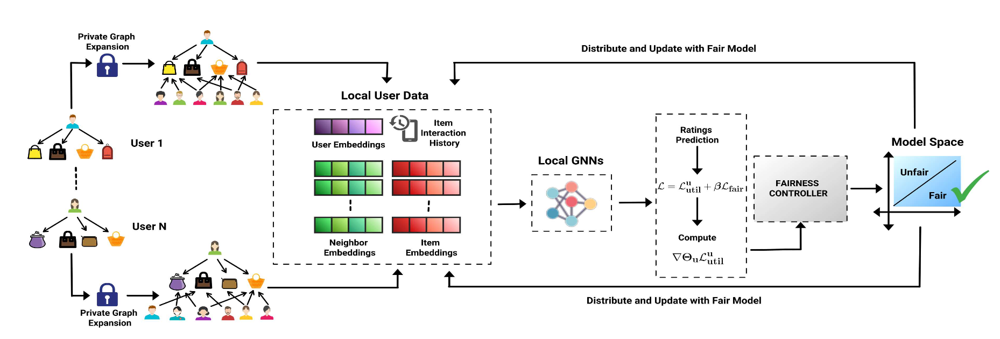
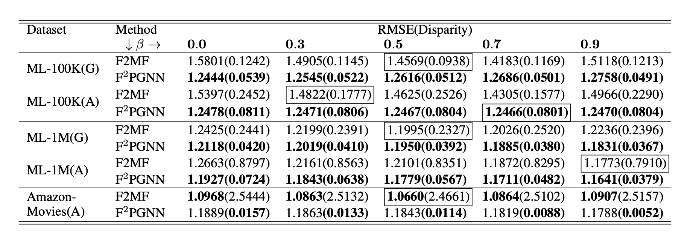
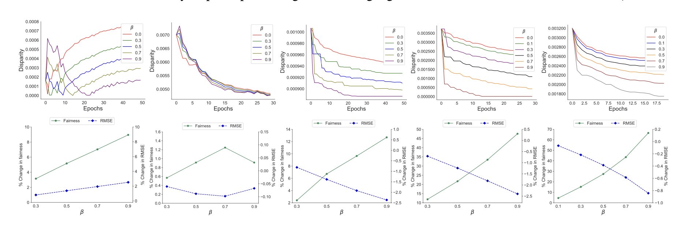
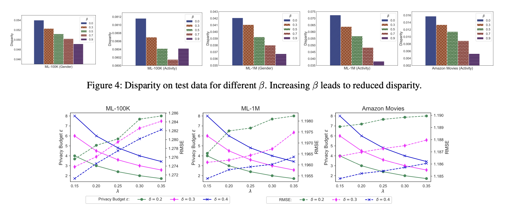

## **1. Problem Definition**  
The primary issue addressed by this paper is the challenge of achieving **fairness across demographic groups** in Federated Learning (FL)-based recommendation systems (RSs), particularly while ensuring **user privacy**. Traditional, centralized recommendation systems tend to produce biased recommendations that favor certain demographic groups (e.g., gender or age), while also violating user privacy by gathering sensitive data on central servers. FL provides a solution to the privacy issue by decentralizing data processing, but ensuring fairness without access to users' demographic information is an unresolved problem. The goal of this paper is to develop a recommendation system that mitigates demographic biases within FL environments using Graph Neural Networks (GNNs), while preserving the privacy of sensitive user information and maintaining high utility for recommendations.

## **2. Motivation**  
<b>2.1 Limitations and Challenges</b>
The use of recommendation systems has grown significantly in various industries such as e-commerce, healthcare, and entertainment. However, the following challenges remain unresolved:
  
* **Privacy and Security:** Traditional RSs rely on centralized data collection, where sensitive user information is stored and processed, leading to privacy violations [2]. 

* **Fairness Concerns:** FL allows for the decentralized training of models on local devices and transmitting the updated model back to the sever, to preserve user privacy. However, FL fail to ensure fairness across demographic groups [1] when sensitive data like gender or race, is unavailable for analysis [3].

* **Amplified Bias:** GNNs are effective at modeling user-item interactions in RSs but can inherit and  exacerbate existing biases in the data, making fairness even harder to achieve in FL environments [4].

<b>2.2 Proposed Approch</b>
The authors introduce F2PGNN (Fair Federated Personalized Graph Neural Network), a novel framework that addresses these issues through three key pillars:
1. **Fairness:** F2PGNN ensures fairness in recommendations without requiring access to sensitive demographic information.
2. **Privacy:** By using **Local Differential Privacy (LDP)**, the model maintains user privacy while sharing group-level statistics.
3. **Personalization:** The system captures both higher-order and explicit user-item interactions through a GNN model, improving recommendation accuracy while reducing bias.

## **3. Related Work**  
Research on fairness in recommendation systems and federated learning has been extensive, but integrating fairness with privacy-preserving techniques in federated settings is still a challenging area. Previous studies on fairness in centralized recommendation systems, such as those by Yao and Huang (2017) [5] and Li et al. (2021) [6], focus on mitigating bias using demographic data. However, these methods require access to centralized data, which violates privacy norms.

In the federated learning domain, models like **FedMF** [7] and **FedPerGNN** [8] have integrated fairness into federated settings, but they either rely on **Matrix Factorization**, which lacks the ability to model higher-order interactions, or introduce significant computational overhead with encryption techniques.

This paper builds on existing works but proposes a more efficient and scalable solution by utilizing GNNs for recommendation and adding privacy constraints through LDP, ensuring fairness while preserving privacy.

## **4. Methodology**  
The proposed F2PGNN  is designed to ensure fairness in federated recommendation systems by leveraging GNNs, which allow users to train models locally while preserving privacy. Below are the core components of this framework:

<b>4.1 Inductive Graph Expansion Algorithm</b>
One of the key innovations in the F2PGNN framework is the **Inductive Graph Expansion** algorithm, which allows users to incorporate higher-order interactions into their local user-item interaction graphs. Higher-order interactions refer to indirect relationships between users and items that may not be immediately apparent but can be inferred from the broader graph structure. For instance, users who have interacted with similar items can be connected, thus uncovering latent relationships and improving the quality of recommendations.

The steps in this algorithm are:
1. Users encrypt their item IDs using a public key.
2. These encrypted IDs are sent to a server, which matches them across different users to find co-interacted items (i.e., items that have been rated by multiple users).
3. The server provides anonymous embeddings for users who share interactions with the same items, allowing users to expand their graphs while maintaining privacy.

These expanded subgraphs enable each client to capture higher-order interactions, significantly improving recommendation quality.

<b>4.2 Local GNN Training</b>
Once users have expanded their local subgraphs, they train a **Graph Attention Network (GAT)** locally. GATs are particularly suited to recommendation systems as they allow the model to assign varying levels of importance to neighboring nodes (users or items), depending on the strength of their connections. The GAT model updates user and item embeddings by aggregating information from neighboring nodes, with the attention mechanism determining how much influence each neighbor has on the final embedding.

Mathematically, the attention coefficient between a user node $v$ and its neighbor $k$ is calculated as:
$$ e_{vk} = \text{LeakyReLU}(\mathbf{a}^\top [\mathbf{W}\mathbf{h}_v \| \mathbf{W}\mathbf{h}_k])$$

Here, $h_v$ and $h_k$ are the feature vectors of nodes $v$ and $k$, respectively, and $\mathbf{W}$ is the weight matrix. The operator $||$ denotes concatenation, and $\mathbf{a}$ is the attention weight vector that learns the relative importance of neighboring nodes. This attention score is then normalized across all neighbors $j \in \mathcal{N}_v$ of node $v$:
$$ \alpha_{vk} = \frac{\exp(e_{vk})}{\sum_{j \in N_v} \exp(e_{vj})} $$
The final node embedding $\mathbf{h}_v'$ for node $v$ is updated by aggregating the normalized attention-weighted features from all its neighbors:
$$ \mathbf{h}'_v = \sigma \left( \sum_{k \in N_v} \alpha_{vk} \mathbf{W}\mathbf{h}_k \right)$$
where $\sigma$ is a non-linear activation function (e.g., ReLU).

*Figure 1: The overall structure of the F2PGNN framework.*

<b>4.3 Fairness-Aware Loss Function</b>
A core innovation of F2PGNN is its **fairness-aware loss function**, designed to ensure equitable recommendations across different demographic groups. The function balances two objectives: utility (i.e., recommendation accuracy) and fairness (i.e., reducing bias between demographic groups).

The overall loss function is defined as:
$$ L = L_{util} + \beta L_{fair}$$
Here, $L_{util}$ is the utility loss, which can be the mean squared error (MSE) between the predicted and true ratings, and $L_{fair}$ is the fairness loss, which penalizes the model for disparities in performance across different demographic groups. The parameter $\beta$ ontrols the trade-off between utility and fairness, with higher values of $\beta$ placing more emphasis on fairness.

The fairness loss is defined as the absolute difference in the average performance of the model between two demographic groups $S_0$ (e.g., males) and $S_1$ (e.g., females):
$$ L_{fair}(M, S_0. S_1) = |\frac{1}{S_0}\sum_{u \in S_0}\mathcal{M}(u)-\frac{1}{S_0}\sum_{u \in S_1}\mathcal{M}(u)|^\alpha  $$
where $\mathcal{M}(u)$  is the performance metric for user $u$ (e.g., the negative loss for user $u$) and $\alpha$ is an exponent that determines the severity of the fairness penalty (typically set to 1 or 2).

<b>4.4 Fairness-Aware Gradient Adjustment</b>
To incorporate fairness into the training process, the gradients of the model are adjusted based on the fairness loss. This is crucial because it allows the model to reduce bias during training by controlling the learning speed for different groups. 

Specifically, if a user belongs to an overperforming demographic group, their learning rate is scaled down, whereas the learning rate is increased for underperforming groups, promoting fairness throughout training.

The adjusted gradient for user $u$ is computed using the following formula:
$$\nabla \Theta_u = (1 - \beta R|P - Q|^{\alpha-1}) \frac{\partial L^u_\text{util}}{\partial \Theta_u}$$
where $\nabla \Theta_u$ represents the gradient update for user $u$, $\beta$ is the fairness budget determining how much weight is given to fairness during training. $R$ is a scalar determined by the difference in performance between groups and user group membership:
$$ R = \alpha \cdot (-1)^{1(P<Q)} \cdot (-1)^{1(u \notin S_0)}$$
$P$ and $Q$ represent the average performance metrics (e.g., accuracy or utility) for groups $S_0$ and $S_1$ respectively:
$$ P = \frac{1}{|S_0|} \sum_{u \in S_0} \mathcal{M(u)}, \quad Q = \frac{1}{|S_1|} \sum_{u \in S_1} \mathcal{M(u)} $$
Here, $\mathcal{M(u)}$ represents the utility metric for user $u$, such as the recommendation accuracy.

The adjusted gradient ensures that:
* Overperforming users (i.e., those in group $S_0$ if $P>Q$) experience slower learning, reducing potential biases toward their group.
* Underperforming users (i.e., those in group $S_1$ if $P<Q$) experience faster learning, helping to close the performance gap.
Thus, fairness is promoted by adjusting the learning rates dynamically, ensuring that both groups are treated equitably during the training process.

<b>4.5 Local Differential Privacy (LDP)</b>
To ensure privacy, F2PGNN employs LDP. This mechanism ensures that sensitive information (such as individual interactions or group membership) is obfuscated during model updates. LDP is applied both to the model gradients and to the group statistics (i.e., the information used to adjust the model based on fairness).
**Model Updates:** After computing the adjusted gradients, each user applies gradient clipping to ensure that the updates are bounded, followed by adding noise to the gradients using the Laplace mechanism. This results in differentially private gradient updates, which protect the user’s data even from inference attacks.
The clipped and noisy gradient is computed as follows:
$$ \nabla \Theta_u^\text{LDP} = \text{clip}(\nabla \Theta_u, \delta) + \text{Laplace}(0, \lambda)$$
where $\text{clip}(\nabla \Theta_u, \delta)$ ensures that the gradient norm is bounded by $\delta$, and $\lambda$ controls the variance of the Laplace noise, with larger values of $\lambda$ providing stronger privacy but potentially reducing model accuracy.

**Group Statistics Updates:** To ensure fairness, the server needs to know the group-level statistics (i.e.,$P$ and $Q$) that measure the performance of different demographic groups. However, directly uploading these statistics could reveal sensitive group membership information. To address this, LDP is also applied to the group statistics updates. 

For each user $u$ the server receives the following noisy updates:
$$P_u^\text{perf} = \mathbb{I}(u \in S_0)\mathcal{M(u)} + \epsilon_1, \quad Q_u^\text{perf} = \mathbb{I}(u \in S_1)\mathcal{M(u)} + \epsilon_2$$

$$P_u^\text{count} = \mathbb{I}(u \in S_0) + \epsilon_3, \quad Q_u^\text{count} = \mathbb{I}(u \in S_1) + \epsilon_4 $$
where:
* $\mathbb{I}(u \in S_0)$ is an indicator function that equals 1 if user $u$ belongs to group $S_0$ and 0 otherwise.
* $\epsilon_1, \epsilon_2, \epsilon_3, \epsilon_4 \sim \mathcal{N}(0, \sigma^2)$ re noise terms drawn from a normal distribution with variance $\sigma^2$, ensuring privacy.
* 
By adding noise to the group statistics, the server cannot accurately infer which users belong to each group, thus preserving privacy.

<b>4.6 Training Process</b>
The overall training process involves the following steps during each communication round:
1. Users receive the global model parameters and group statistics.
2. Each user expands their local graph using the Inductive Graph Expansion algorithm and trains their GNN on the expanded subgraph.
3. Users compute adjusted gradients that incorporate fairness scaling.
4. LDP is applied to both gradients and group statistics to preserve privacy.
5. Updated parameters and statistics are sent back to the server.
6. The server aggregates these updates, computes new global model parameters, and rebroadcasts them to the users.

**Example**:
In a movie recommendation system with two demographic groups (e.g., males and females), if the average recommendation accuracy for males is higher, the fairness-aware gradient adjustment will slow the learning rate for male users and increase it for female users to reduce group disparity.

## **5. Experiment**  
<b>5.1 Experiment Setup</b>
The experimental evaluation of the F2PGNN framework  was conducted using three well-known real-world datasets commonly used in recommendation tasks:
* MovieLens-100K (ML-100K): Contains 100,000 ratings from 943 users on 1,682 movies. This dataset is frequently used in recommendation research due to its manageable size and well-documented structure.
* MovieLens-1M (ML-1M): A larger dataset with 1 million ratings from 6,040 users on 3,706 movies. It provides richer interactions, allowing for more thorough analysis of performance across different user types.
* Amazon-Movies: A large-scale dataset with approximately 500,000 ratings from 5,515 users on 13,509 movies. Its diversity and sparse interactions make it a challenging benchmark for recommendation models.

In the experiments, two types of sensitive attributes were considered:
1. Gender (G): Users were categorized as male or female based on available metadata. This was used to test how well F2PGNN mitigates gender bias in recommendations.
2. Activity Level (A): Users were classified as either "active" or "inactive" based on the number of ratings they provided. This tested the model’s ability to ensure fairness across users with varying levels of engagement.

<b>5.2 Baseline</b>
The authors compare F2PGNN against the **F2MF** (Fair Federated Matrix Factorization) model, a federated recommendation system that also incorporates fairness constraints. However, F2MF does not utilize the graph structure of user-item interactions, which limits its ability to capture higher-order relationships. The comparison between these models aims to highlight the advantages of GNNs in federated learning environments, particularly in terms of balancing fairness and utility.

<b>5.3 Evaluation Metrics</b>
Two key metrics were used to evaluate the performance of the model:
* **Utility Metric:** The accuracy of the recommendations was measured using **Root Mean Square Error (RMSE)**. A lower RMSE indicates better prediction accuracy.
* **Fairness Metric:** Fairness was measured using **group unfairness**, which calculates the absolute difference in average performance (RMSE) between demographic groups. Lower group unfairness scores indicate more equitable treatment of different user groups.

<b>5.4 Results</b>
The experimental results demonstrated the effectiveness of F2PGNN in improving fairness while maintaining high utility across all datasets. The key findings can be summarized as follows:
1. **Fairness Improvement:** F2PGNN **significantly reduced group disparity** compared to the F2MF baseline in all datasets. For example, when gender was used as the sensitive attribute in the MovieLens-1M dataset, F2PGNN reduced group disparity by up to 84% compared to F2MF. This improvement showcases the strength of incorporating fairness-aware loss functions and fairness-driven gradient adjustments in GNN-based federated recommendation systems.
2. **Utility Preservation:** Despite focusing on fairness, F2PGNN **maintained comparable or even better RMSE scores** compared to the baseline. For instance, in the MovieLens-100K dataset, F2PGNN achieved a lower RMSE than F2MF, demonstrating that the accuracy of recommendations was not compromised by introducing fairness constraints. In some cases, the RMSE slightly increased, especially when fairness constraints were stronger, but the increase was justifiable by the significant improvements in fairness.
3. **Effect of Fairness Budget ($\beta$):**  The fairness budget parameter ($\beta$) controlled the trade-off between fairness and utility. Increasing $\beta$ improved fairness by reducing group disparity, with only a minimal impact on RMSE in most cases. This trade-off makes F2PGNN adaptable to real-world applications where fairness is a critical requirement, such as personalized recommendation systems for e-commerce or healthcare.

Below is a table summarizing the performance and fairness of F2PGNN compared to F2MF in different datasets. G denotes Gender while A denotes Activity. 

*Figure 2: Performance vs Fairness comparison with different fairness budget $\beta$.*

**Disparity vs. Epochs:** The experiments included a visualization of group disparity over time. The results showed that group disparity consistently decreased with F2PGNN, particularly when a higher fairness budget ($\beta$) was used. This graph reinforced that the model is effective at reducing demographic bias as training progresses.

*Figure 3: **Top Row:** Disparity vs epoch for different fairness budget $\beta$ on validation data. **Bottom row:** % change in fairness (left y-axis) and % change in RMSE (right y-axis) w.r.t different $\beta$*

**Privacy-Utility Trade-off:** Another experiment explored the trade-off between privacy and utility by varying the parameters of the LDP mechanism. Increasing the noise variance ($\lambda$) enhanced privacy by adding more noise to the model updates, but it slightly increased RMSE. However, with proper tuning of LDP parameters (e.g., the noise variance $\lambda$ and gradient clipping threshold $\delta$), the model achieved a good balance between privacy protection and utility.

*Figure 4: Privacy budget $\epsilon$ (left y-axis) and the personalization RMSE (right y-axis) w.r.t different clipping threshold $\delta$ and noise variance $\lambda.$*

<b>5.4.1 Analysis of Results</b>
1. **Fairness vs. Utility:** The results demonstrate that F2PGNN achieves substantial improvements in fairness without a significant loss of utility. The framework provides flexibility in adjusting the fairness budget ($\beta$), allowing practitioners to prioritize fairness or accuracy based on the specific requirements of their application. This flexibility is crucial for practical implementations in industries where both fairness and recommendation accuracy are important.
2. **Privacy Protection:** The use of LDP ensures that sensitive user data, such as gender or activity level, remains protected. Even with the added noise from LDP, F2PGNN was able to maintain high utility, proving that privacy, fairness, and utility can be effectively balanced in a federated learning setup.

## **6. Conclusion**  
<b>6.1 Summary</b>
The paper introduces F2PGNN, a novel framework that incorporates fairness into federated GNN-based RSs while preserving user privacy. By leveraging GNNs and incorporating a fairness-aware loss function, F2PGNN is able to reduce demographic biases without requiring access to sensitive user attributes such as gender or activity level. The framework uses LDP to protect both model updates and group statistics, ensuring that privacy regulations are adhered to while still delivering fair recommendations.

<b>6.2 Key Contributions</b>
1. **Fair Federated GNNs:** F2PGNN is the first framework to address fairness in federated GNN-based recommendation systems, providing significant improvements in reducing group disparity and promoting equitable treatment across demographic groups.
   
2. **Privacy-Preserving Techniques:** By using LDP for both model updates and group statistics, F2PGNN adheres to strict privacy regulations, making it applicable in scenarios where privacy is of paramount importance.

3. **Practical Effectiveness:** The framework achieves fairness improvements without incurring major utility losses, demonstrating its scalability and adaptability for large datasets. Its flexibility to incorporate various sensitive attributes (e.g., gender, activity level) further underscores its practical value.

<b>6.3 Take-Home Messages</b>
F2PGNN demonstrates that integrating fairness into federated GNN-based recommendation systems is both feasible and beneficial. By carefully designing the loss function and applying privacy-preserving techniques, the framework effectively mitigates demographic biases without sacrificing recommendation quality or violating user privacy. This work provides a foundation for future developments in fair federated learning with GNNs, particularly in sensitive domains such as healthcare and finance.

---  
## **Author Information**  

* Qiuli Jin
    * Affiliation: KAIST, [Human Factors and Ergonomics Lab](https://hfel.kaist.ac.kr/)  
    * Research Topics: Virtual Reality; Data science

## **7. References**  
[1] Gupta, Manjul, Carlos M. Parra, and Denis Dennehy. "Questioning racial and gender bias in AI-based recommendations: Do espoused national cultural values matter?." Information Systems Frontiers 24.5 (2022): [1465-1481](https://doi.org/10.1007/s10796-021-10156-2).
[2] Himeur, Yassine, et al. "Latest trends of security and privacy in recommender systems: a comprehensive review and future perspectives." Computers & Security 118 (2022): [102746](https://doi.org/10.1016/j.cose.2022.102746).
[3] Kairouz, Peter, et al. "Advances and open problems in federated learning." Foundations and trends® in machine learning 14.1–2 (2021): [1-210](https://www.nowpublishers.com/article/Details/MAL-083).
[4] Wu, Chuhan, et al. "A federated graph neural network framework for privacy-preserving personalization." Nature Communications 13.1 (2022): [3091.](https://doi.org/10.1038/s41467-022-30714-9)
[5] Lyu, He, et al. "Advances in neural information processing systems." Advances in neural information processing systems 32 (2019): [1049-5258](https://par.nsf.gov/biblio/10195511).
[6] Li, Yunqi, et al. "User-oriented fairness in recommendation." Proceedings of the web conference 2021. (2021): [624-632](https://dl.acm.org/doi/abs/10.1145/3442381.3449866).
[7] Chai, Di, et al. "Secure federated matrix factorization." IEEE Intelligent Systems 36.5 (2020): [11-20](https://ieeexplore.ieee.org/abstract/document/9162459).
[8] Wu, Shiwen, et al. "Graph neural networks in recommender systems: a survey." ACM Computing Surveys 55.5 (2022): [1-37](https://dl.acm.org/doi/full/10.1145/3535101). 

## **8.Additional materials**  
## **8. Additional Materials**  
* **[Paper Link](https://arxiv.org/abs/2312.10080):** Access the full paper on arXiv.  
* **[GitHub Implementation](https://github.com/nimeshagrawal/F2PGNN-AAAI24):** Explore the implementation of F2PGNN on GitHub.

