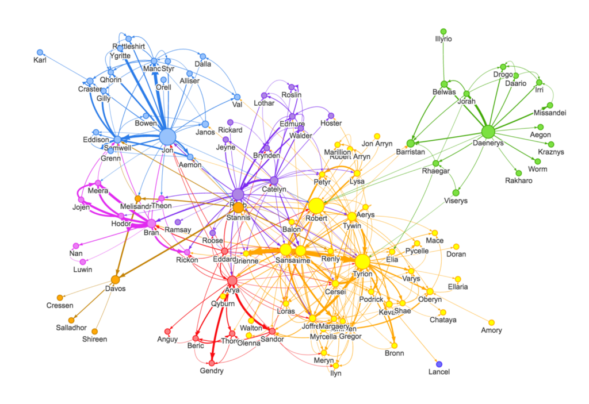
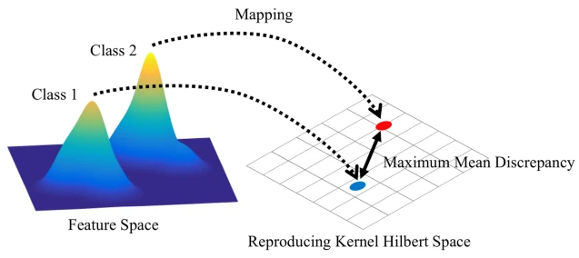
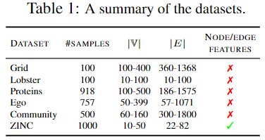
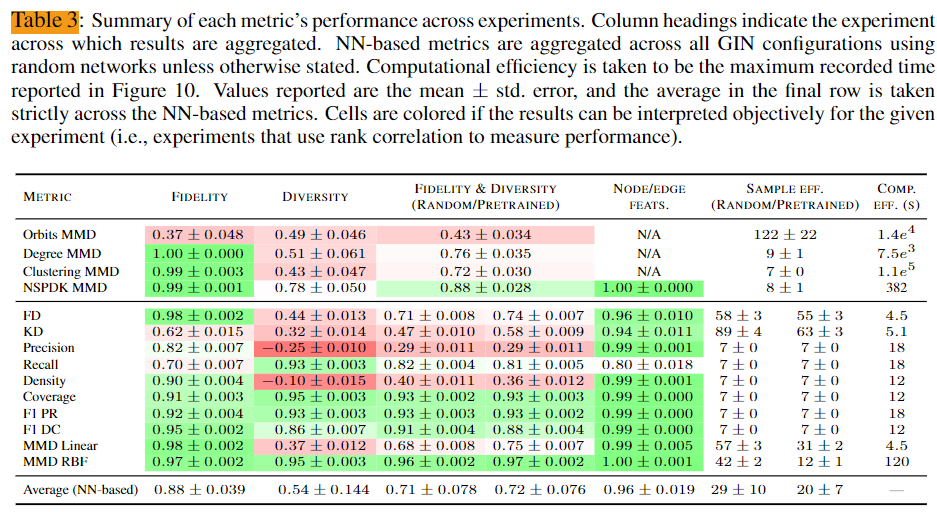
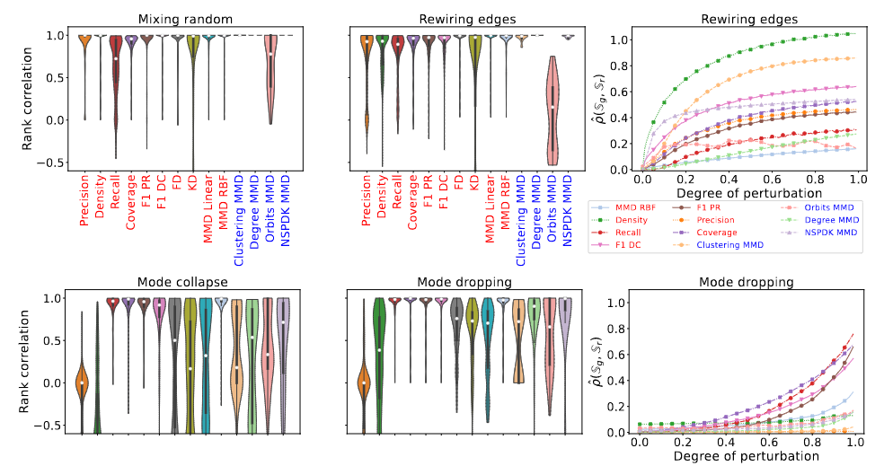

Title : On Evaluation Metrics For Graph Generative Models
Aurthor : R. Thompson et al.
Venue : ICLR 2022

### 1. Graph Generation Task는 무엇인가?

**Graph(그래프)**는 **노드(Node)**와 **엣지(Edge)**로 이루어진 데이터 구조를 의미한다. 그래프는 현실 세계의 다양한 관계와 상호작용을 표현하는데 사용된다. 예컨대, 사람들 간의 소셜 네트워크나 인터넷의 링크 구조, 분자 내의 원자 간 결합, 도로망에서의 교차로와 길 등이 있다. 즉, node는 개체를 나타내고, edge는 그들 간의 관계를 나타낸다.

최근 노벨화학상을 수상한 단백질 구조 예측 관련 연구에서도 아미노산의 결합 구조를 모델링하는데 그래프 구조가 쓰이는 등 다양한 분야의 데이터를 나타낼 수 있다.

### Graph Generation(그래프 생성)란 무엇인가?

그래프 생성 작업은 주어진 데이터셋이나 규칙에 기반하여 새로운 그래프 구조를 생성하는 것을 의미한다. 생성된 그래프는 특정한 목표를 염두에 두고 있다. 예를 들어 소셜 네트워크의 확장, 화합물의 분자 구조 예측, 도로망 시뮬레이션 등을 통해 실세계의 문제를 해결하거나 예측할 수 있다.

이러한 그래프 생성의 핵심 목표는 새로운 그래프가 기존 그래프의 특성을 얼마나 잘 모방할 수 있는가에 있다. 즉, 새로운 그래프는 실제 데이터에 기반한 현실적인 특성과 구조를 가져야 한다. 저자들은 다음과 같은 관점에서 생성된 그래프를 평가할 것을 주장한다.

1. **패턴 학습 및 예측**: 생성된 그래프가 실제 데이터에서 나타나는 패턴을 잘 반영하면, 미래의 데이터나 네트워크 구조를 예측하는 데 사용할 수 있다. 예를 들어, 소셜 네트워크에서 사람들 간의 관계를 시뮬레이션하거나, 과학적 발견을 위해 새로운 분자의 구조를 예측할 수 있다.
2. **모델링 및 시뮬레이션**: 실제 네트워크를 모방한 그래프를 생성하여 다양한 상황을 시뮬레이션할 수 있다. 예를 들어, 교통 네트워크에서 차량 흐름을 최적화하거나 인터넷 네트워크의 보안 취약점을 발견하기 위해 시뮬레이션할 수 있다.
3. **연구 및 실험**: 현실에서 수집한 데이터가 제한적이거나 비용이 많이 들 경우, 그래프 생성을 통해 연구와 실험을 더 효율적으로 수행할 수 있다. 생성된 그래프는 추가적인 실험 데이터를 제공하며, 이를 통해 다양한 연구 결과를 도출할 수 있다.

### Graph Generation의 중요성

**그래프 생성 모델(GGMs)**은 다양한 연구 및 산업 분야에서 중요한 역할을 한다. 실제 네트워크나 시스템의 동작을 시뮬레이션하거나 예측할 수 있으며, 새로운 발견이나 효율적인 시스템 설계를 가능하게 한다. 그래프 생성의 중요성은 여러 가지 이유에서 강조된다. 첫째, 데이터 부족 문제를 해결할 수 있다. 많은 경우, 충분한 실제 데이터를 확보하기 어려운 상황에서 그래프 생성은 부족한 데이터를 보완할 수 있는 강력한 도구로 사용된다. 예를 들어, 약물 개발에서 새로운 분자의 구조를 예측하는 데 필요한 데이터가 부족할 때, 그래프 생성 모델은 그 갭을 메울 수 있다. 둘째, 그래프 생성은 현재까지의 데이터에 기반하여 미래의 패턴이나 구조를 예측하는 데 필수적이다. 예를 들어, 소셜 네트워크에서 사용자가 새로운 연결을 형성할 가능성을 예측하거나, 인터넷 트래픽이 향후 어떻게 변화할지 시뮬레이션할 수 있다. 셋째, 그래프 생성은 다양한 분야에서 널리 활용될 수 있는 여지가 크다. 화학, 생물학, 물리학 등 과학 분야 뿐 아니라 경제학, 사회학 등 사회과학 분야 까지 많은 학문 분야에서 그래프는 중요한 데이터 구조이며, Graph generation은 다양한 분야의 연구에서 폭넓게 활용될 수 있다는 것이다. 

### Graph Generation Task의 주요 도전 과제

그래프 생성은 다양한 응용 가능성에도 불구하고 몇 가지 도전 과제를 가지고 있다. 생성된 그래프가 얼마나 현실적인지를 평가하고, 그 품질을 측정하는 것은 매우 중요한 일인데, 저자들이 제시한 기준은 다음과 같다.

- **그래프의 복잡성**: 그래프는 매우 복잡한 구조를 가지며, node 간의 다양한 상호작용을 모두 반영해야 한다. 이 때문에 생성된 그래프가 원본 그래프와 동일한 특성을 유지하도록 만드는 것은 매우 어려운 과제이다.
- **diversity 유지**: 생성된 그래프는 다양한 형태와 구조를 가져야 하며, 단순히 기존 데이터를 복제하는 것이 아닌, 새로운 패턴을 반영할 수 있어야 한다. 
- **평가 메트릭**: 그래프 생성의 결과물을 평가하기 위한 메트릭이 부족하거나 부정확할 수 있다. 그래프의 구조적 특성을 평가하면서도, 그 그래프가 얼마나 사실적이고 유용한지를 측정하는 새로운 메트릭이 필요하다.

이 논문은 이러한 과제 중 특히 그래프 생성 결과를 평가하는 방법에 집중하고 있다. 기존의 평가 메트릭이 가지는 한계를 분석하고, 이를 해결하기 위한 새로운 메트릭을 제안함으로써, 보다 정확하고 효율적인 그래프 생성을 가능하도록 하고자 한다.

### 2. 기존 Graph Generation 평가 지표의 한계

"""
## 2. 배경 및 관련 연구

생성 모델을 평가하는 것은 어떤 도메인에서도 매우 어려운 작업이다 (Theis et al., 2016). 기존의 생성 모델 연구에서는 주로 두 가지 평가 지표에 의존해왔다:

- **샘플 기반 지표** (Heusel et al., 2017)
- **우도 기반 지표** (Theis et al., 2016)

그러나 auto regressive GGM의 log likelihood를 비교하는 것은 모든 가능한 node 순서를 marginalize 해야 하므로 계산이 불가능하다 (Chen et al., 2021). 최근 연구에서는 최적의 순서를 학습하고 이를 추정하려고 하지만 (Chen et al., 2021), likelihood가 생성된 그래프의 품질을 나타내지 않을 수 있다는 사실을 고려한다는 점을 반영했다(Theis et al., 2016).

### 샘플 기반 평가 지표

샘플 기반 평가 지표는 실제 분포 $P_r$과 생성된 분포 $P_g$ 사이의 거리 $\rho$를 랜덤 샘플을 통해 추정한다 (Heusel et al., 2017; You et al., 2018; Bińkowski et al., 2018). 이는 다음과 같이 계산된다고 한다:

$
\hat{\rho}\left(\mathbb{S}_ g, \mathbb{S}_ r\right) \approx \rho\left(P_ g, P_ r\right)
$

여기서,

- $\mathbb{S}_r = \{\mathbf{x}_1^r, \ldots, \mathbf{x}_m^r\} \sim P_r$
- $\mathbb{S}_g = \{\mathbf{x}_1^g, \ldots, \mathbf{x}_n^g\} \sim P_g$
- $\mathbf{x}_i$는 그래프 $G_i$로부터 추출된 어떤 feature 벡터

본 연구에서는 모델에 종속적이지 않고 모든 GGM에 적용 가능한 샘플 기반 지표를 사용한다.

## 2.1 기존의 평가 지표

그래프 통계에 기반한 지표는 GGM 평가에서 표준으로 사용된다 (You et al., 2018; Liao et al., 2019; Dai et al., 2020). 이러한 지표는 $\mathbf{x}_i$를 클러스터링 계수, node 차수, 또는 4-node 오빗 카운트 히스토그램으로 설정하고, 생성된 집합 $\mathbb{S}_g$와 참조 집합 $\mathbb{S}_r$ 사이의 경험적 MMD를 계산한다 (Gretton et al., 2006):

<figure>
  
  <figcaption>MMD는 분포 사이의 거리를 각 분포의 평균 사이의 L2로 하는 metric이다</figcaption>
</figure>

$
\operatorname{MMD}\left(\mathbb{S}_ g, \mathbb{S}_ r\right) = \frac{1}{m^2} \sum_ {i,j=1}^{m} k\left(\mathbf{x}_ i^r, \mathbf{x}_ j^r\right) + \frac{1}{n^2} \sum_ {i,j=1}^{n} k\left(\mathbf{x}_ i^g, \mathbf{x}_ j^g\right) - \frac{2}{nm} \sum_ {i=1}^{n} \sum_ {j=1}^{m} k\left(\mathbf{x}_ i^g, \mathbf{x}_ j^r\right)
$

여기서 $k(\cdot, \cdot)$는 일반적인 커널 함수이다. You et al. (2018)은 RBF 커널의 한 형태를 제안하였다:

$
k\left(\mathbf{x}_ i, \mathbf{x}_ j\right) = \exp\left(-d\left(\mathbf{x}_ i, \mathbf{x}_ j\right) / 2\sigma^2\right)
$

- $d(\cdot, \cdot)$는 쌍별 거리를 계산하며, 그 연구에서는 Wasserstein Distance (=EMD)를 선택하였다.
- 이는 각 그래프 통계에 대해 세 가지 지표를 생성한다.

계산 비용을 줄이기 위해 $d(\cdot, \cdot)$로 총 변동 거리를 사용하여 (1)식을 계산할 수 있지만 (Liao et al., 2019), 이는 indefinite 커널 또는 undefined behavior, 즉 불안정한 연산을 초래한다 (O'Bray et al., 2022). 따라서 본 연구에서는 EMD를 사용하여 이러한 지표를 계산한다 (You et al., 2018).

추가로, 여러 연구 (Goyal et al., 2020; Podda & Bacciu, 2021; Kawai et al., 2019)에서는 $k(\cdot, \cdot)$를 NSPDK 그래프 커널로 대체하여 GGM을 평가하였다. 이 지표는 이산적인 edge와 node feature과 그래프 구조를 평가에 통합할 수 있다는 이점이 있다.

Moreno et al. (2018)은 You et al. (2018)이 제안한 것과 유사하게 node 차수, 클러스터링 계수, 지오데식 거리와 같은 그래프 구조 특성을 추출하였다. 그러나 이러한 특성들은 Kolmogorov-Smirnov (KS) 다차원 거리 (Justel et al., 1997)를 통해 스칼라 지표로 결합된다. 본 연구에서는 KS를 edge와 node feature을 통합할 수 없기 때문에 실험에서 제외하였다.

마지막으로, "유효한 그래프의 비율"과 같은 도메인 특화 지표도 존재한다. 우리의 목표는 이러한 지표를 통합하거나 제거하거나 평가하는 것이 아니다; 그것들은 생성된 그래프의 특성이며, 위에서 설명한 지표들과 달리 참조 분포와의 비교를 제공하지 않는다. 이러한 지표들은 GGM 평가에서 여전히 유용한 정보를 제공할 수 있다고 믿는다.

## 2.2 그래프 신경망 (GNN)

그래프를 $\mathcal{G} = (\mathbb{V}, E)$로 정의하며, 여기서 $\mathbb{V}$는 node들의 집합, $E = \{(i, j) \mid i, j \in \{1, \ldots, \vert \mathbb{V}\vert\}\}$는 edge들의 집합이다. GNN은 임의의 그래프 $G_i$로부터 고정 크기의 표현 $\mathbf{x}_i$를 추출할 수 있다.

많은 GNN 구조가 존재하지만 (Wu et al., 2020), 본 연구에서는 일반적인 GNN으로 Graph Isomorphism Networks (GINs)를 고려한다 (Xu et al., 2019). GIN은 $L$개의 전파 레이어와 그래프 Readout 레이어로 구성되어 $\mathbf{x}_i$를 얻는다.

node $v \in \mathbb{V}$에 대해, 레이어 $l \in [1, L]$에서의 node 임베딩 $\mathbf{h}_v^{(l)}$는 다음과 같이 계산된다:

$
\mathbf{h}_ v^{(l)} = \operatorname{MLP}^{(l)}\left( \mathbf{h}_ v^{(l-1)} + f^{(l)} \left( \lbrace \mathbf{h}_ u^{(l-1)} : u \in \mathcal{N}(v) \rbrace \right) \right)
$

- $\mathbf{h}_v^{(0)}$는 node $v$의 입력 feature이다.
- $\mathbf{h}_v^{(l)} \in \mathbb{R}^d$는 $l$번째 레이어 이후의 node $v$의 $d$차원 임베딩이다.
- $\mathcal{N}(v)$는 node $v$의 이웃이다.
- $\operatorname{MLP}^{(l)}$는 완전 연결 신경망이다.중ㅇ

- $f^{(l)}$는 node들에 대한 합산, 평균 또는 최대값과 같은 aggregate 함수이다.

그래프 Readout 레이어는 각 레이어 $l \in [1, L]$에서 모든 node의 feature을 aggregate하고, 이를 단일한 $L \cdot d$차원 벡터 $\mathbf{x}_i$로 연결한다 (Xu et al., 2019):

$
\mathbf{x}_ i = \operatorname{CONCAT}\left( \operatorname{READOUT}\left( \lbrace \mathbf{h}_ v^{(l)} \mid v \in \mathbb{V} \rbrace \right) \mid l = 1, 2, \ldots, L \right)
$

- 여기서 $\operatorname{READOUT}$은 $f^{(l)}$와 유사하며, 보통 합산, 평균 또는 최대값 연산을 선택한다.

## 3 랜덤 GNN의 효과성

이미지 생성 샘플의 평가에서는 Inception v3(Szegedy et al., 2016)가 널리 사용되지만, 그래프 기반 연구에서는 이러한 평가모델이 존재하지 않는다는 점이 지적된다. 이는 그래프 생성 모델(GGMs)의 표준화된 분석을 어렵게 만든다는 것이다. 이를 해결하기 위해 단일 GNN을 여러 데이터셋에 사전 학습하여 새로운 데이터셋에서도 의미 있는 임베딩을 추출하는 방법이 제안되었다(Hu et al., 2020). 그러나 그래프 데이터셋 간에 node와 edge feature의 차원이 호환되지 않는 경우가 많고, 사전 학습과 목표 작업 간의 그래프 분포 차이가 커서 사전 학습된 네트워크의 성능이 저하될 수 있다.

반면에, 랜덤 GNN은 사전 학습 없이도 의미 있는 feature을 추출하고 많은 그래프 작업을 수행할 수 있다(Kipf & Welling, 2017; Morris et al., 2019; Xu et al., 2019). 따라서 사전 학습을 피하고 랜덤 GNN을 활용하는 것을 본 연구에서는 제안한다.

이 접근법을 예비적으로 테스트하기 위해, 본 연구에서는 Grid 그래프에서 에지를 확률 $p$로 무작위 재연결하여 permutation을 적용했다. $p$가 증가할수록 원래 그래프와 변형된 그래프 사이의 차이가 증가한다. 만약 GNN이 그래프에서 강력한 표현을 추출할 수 있다면, 그래프 임베딩 간의 차이도 $p$에 따라 증가해야 한다. 사전 학습된 GIN(Xu et al., 2019)과 랜덤 GIN에서 추출한 임베딩을 시각화한 결과, 두 모델 모두 실험 전반에 걸쳐 매우 유사한 표현을 추출하는 것을 발견했다. 이는 랜덤 및 사전 학습된 GIN 모두 GGMs를 평가하는 데 유용할 수 있음을 시사한다. 본 연구에서는 그래프 동형성을 탐지하는 이론적인 능력(Xu et al., 2019) 때문에 모든 실험에서 GIN을 사용했으며, 다른 일반적인 GNN과의 비교는 부록 C.6에 제공되었다.

## 4 실험

저자들은 실험 절에서 GGM 평가 지표의 주요 속성을 설명하고, 각 지표를 이러한 속성에 대해 철저히 테스트했다. 이러한 속성에는 생성된 그래프의 **fidelity**와 **diversity**에 대한 지표의 상관성, 샘플 효율성(sample efficiency), 그리고 **계산 효율성(computational efficiency)**이 포함된다. 이러한 속성들은 강력한 평가 지표의 원하는 특성을 포착하고 GGMs의 신뢰할 수 있는 순위를 가능하게 한다고 판단된다.

데이터셋: 그래프 도메인 전반에 걸쳐 GGMs를 평가하는 능력을 테스트하기 위해 여섯 가지 다양한 그래프 데이터셋을 사용했다(표 1). 특히 Lobster, Grid, Proteins, Community, Ego와 같은 일반적인 GGM 데이터셋을 포함하였다(You et al., 2018; Liao et al., 2019; Dai et al., 2020). 또한, 각 지표가 node 및 edge feature 분포의 변화를 감지하는 능력을 보여주기 위해 분자 데이터셋 ZINC(Irwin et al., 2012)를 활용하였다.

GNN feature 추출기: GGM 문헌에서는 작은 데이터셋을 자주 사용하므로, 각 지표의 샘플 효율성이 매우 중요하다. 그래프 임베딩 $\mathbf{x}$의 차원은 여러 지표에서 핵심 요소이므로, 구별 가능성을 유지하면서 $\mathbf{x}$의 길이를 최소화하는 것이 바람직하다. 식 (4)에서 볼 수 있듯이, 전파 라운드 수 $L$과 node 임베딩 크기 $d$는 $\mathbf{x}$의 차원을 직접 결정한다. You et al.(2020)은 $L$의 선택이 다양한 그래프 작업에서 성능에 가장 중요한 요소 중 하나임을 보여주었다.

실험에서는 $L \in [2, 3, \ldots, 7]$, $d \in [5, 10, \ldots, 40]$인 GIN 모델(식 3과 4)을 고려했다. 이 범위 내에서 20개의 아키텍처를 무작위로 선택하여 랜덤 초기화된 GIN과 사전 학습된 GIN 모두를 사용하여 실험을 진행했다. 사전 학습 과정에서는 각 네트워크에 그래프 분류 작업을 수행하도록 했으며, 방법론은 부록 B에 설명되어 있다. 개별 실험에서 사전 학습된 GIN을 사용하여 계산된 지표의 결과는 부록 C.1에 제시되었으며, 논의를 용이하게 하기 위해 이러한 결과를 표 3에 요약하였다. 랜덤 및 사전 학습된 네트워크 모두에서 구별 가능성을 향상시키는 방법으로 node 차수 feature을 정수로 표현하여 사용했다. 실제로는 초기화된 랜덤 네트워크에서 직교 가중치 초기화(Saxe et al., 2014)를 활용했는데, 이는 초기화 간 지표의 분산을 약간 줄여주기 때문이다.

평가 지표 평가: 모든 실험은 $P_g \approx P_r$로 시작하며, $\mathbb{S}_g$와 $\mathbb{S}_r$ 사이의 유사성의 척도인 perturbation 정도 $t \in [0, 1]$이 단조롭게 증가한다. 저자들은 각 지표를 객관적으로 평가하기 위해 지표 점수 $\hat{\rho}$와 perturbation 정도 $t$ 사이의 Spearman 순위 상관 계수를 계산했다. 모든 지표는 $P_r = P_g$일 때 $\hat{\rho} = 0$이 되도록 정규화되었으며, 강력한 지표의 경우 $\hat{\rho}$는 $t$에 따라 증가해야 하고, 순위 상관 계수 1.0이 이상적이라고 가정하였다.

또, 이들은 각 지표와 GIN 아키텍처 조합에 대해 10개의 랜덤 시드를 통해 테스트했으며, 이는 GIN 모델 가중치(해당되는 경우)와 적용된 perturbation에 영향을 미친다. 주어진 지표에 대한 결과를 report 하는 데 있어 단일 랜덤 시드, 실험(i.e.Edge 재연결), 데이터셋(i.e.Grid), GIN 구성(i.e.$L=4, d=25$)에 대한 순위 상관 계수를 계산했다. 그런 다음 이러한 변이 요인의 조합에 걸쳐 순위 상관 계수 점수를 집계했다.

## 4.1 fidelity 측정

지표의 가장 중요한 속성 중 하나는 생성된 샘플의 **fidelity**를 반영할 수 있는가 이다. 이들은 fidelity에 대한 지표를 테스트하기 위해 두 가지 실험을 구성했다. 첫 번째 실험은 실제 샘플에 다양한 양의 랜덤 샘플을 섞어 지표의 감지 능력을 테스트하고(Xu et al., 2018), 두 번째 실험은 Edge를 무작위로 재연결하여 그래프의 품질을 서서히 저하시켰다(O'Bray et al., 2022). 두 실험 모두 $\mathbb{S}_g$를 $\mathbb{S}_r$의 복사본으로 시작하며, $\mathbb{S}_r$ 자체는 데이터셋의 복사본이다.

첫 번째 실험에서는 $\mathbb{S}_ g$의 품질에 영향을 주기 위해 랜덤 그래프를 활용했다. $\mathbb{S}_r$와 $\mathbb{S}_g$ 사이의 유사성을 감소시키기 위해, $\mathbb{S}_g(t)$에서 랜덤 그래프를 실제 그래프와 섞는 비율 $t$를 서서히 증가시켰다. 동시에 실제 그래프를 제거하여 $\vert\mathbb{S}_g\vert$가 전체적으로 일정하게 유지되도록 했다. 랜덤 그래프는 $\mathbb{S}_r$와 유사하도록 크기와 $p$ 값을 선택한 Erdős-Rényi(E-R) 그래프(Erdős & Rényi, 1960)이다.

두 번째 실험에서는 $\mathbb{S}g$의 에지를 무작위로 재연결하여 $P_r$와 $P_g$ 사이의 거리를 증가시켰다. 여기서 perturbation 정도 $t$는 각 에지 $(i, j) \in E$를 재연결할 확률이다. 각 $G \in \mathbb{S}g$와 각 $(i, j) \in E$에 대해, $x{i,j} \sim \operatorname{Bernoulli}(t)$를 샘플링했다. $x{i,j} = 1$인 에지는 재연결되며, 또 다른 샘플 $y_{i,j} \sim \operatorname{Bernoulli}(0.5)$를 사용하여 에지의 두 node 중 하나 ${i, j}$를 선택하고, 이 에지의 새로운 연결은 $\mathbb{V}$에서 균일하게 선택된다.

결과: Recall과 Orbits MMD를 제외하면, 테스트한 대부분의 지표는 순위 상관 계수가 1.0에 가까워 이 실험에서 우수한 성능을 보였다(그림 3, 1행). 그러나 Recall은 $\mathbb{S}_g$의 다양성을 측정하도록 설계되었으므로, 여기서 fidelity에 대한 낮은 민감도는 예상된 결과이다. 놀랍게도 Coverage는 $\mathbb{S}_g$의 diversity을 측정하도록 설계되었음에도 불구하고 fidelity에 대한 강한 민감도를 보였다. 또한, GRAN(Li et al., 2018)이 생성한 그래프를 사용하여 혼합 실험을 반복했으며 유사한 결과를 얻었다고 한다.

## 4.2 diversity 측정

다음으로 조사한 속성은 $\mathbb{S}_g$에 생성된 샘플의 **diversity** 을 측정하는 지표의 능력이다. 저자들이 원하는 지표는 생성 모델의 두 가지 일반적인 문제인 ** mode dropping **과 **mode collapse**에 민감해야 한다는 것이다. Xu et al.(2018)의 두 가지 실험을 그래프 도메인에 맞게 조정하여 각 지표를 독립적으로 테스트했다. 두 실험 모두 Affinity Propagation(Frey & Dueck, 2007)을 사용하여 데이터셋을 클러스터링하여 $P_r$의 모드를 식별하는 것으로 시작한다. 이 실험들은 모두 데이터셋의 절반으로 이루어진 $\mathbb{S}_r$와 $\mathbb{S}_g$로 시작한다.

mode collapse시뮬레이션: 각 데이터 포인트를 해당 클러스터의 centroid로 점차 대체했다. perturbation 정도 $t$는 이러한 방식으로 collapse한 클러스터의 비율을 나타낸다.

mode dropping 시뮬레이션: $\mathbb{S}_g$에서 클러스터를 점진적으로 제거했다. $\vert\mathbb{S}_g\vert$를 일정하게 유지하기 위해, 남은 클러스터에서 샘플을 무작위로 선택하여 중복했다. 이 실험에서 perturbation 정도 $t$는 $\mathbb{S}_g$에서 삭제된 클러스터의 비율이다.

결과: mode collapse실험에서, 모든 고전적인 지표(You et al., 2018)는 순위 상관 계수가 0.5 미만으로 저조한 성능을 보였다(그림 3, 하단). 고전적인 지표는 mode dropping 실험에서 약간 더 나은 결과를 얻었지만 여전히 최적의 결과는 아니다. 예상대로 Recall과 Coverage는 $\mathbb{S}_g$의 diversity과 강한 양의 상관 관계를 보였으며, Precision과 Density는 음의 상관 관계를 보였다. 또한, MMD RBF와 F1 PR과 같은 몇몇 스칼라 지표는 $\mathbb{S}_g$의 diversity과 강한 상관 관계를 보였으며, 두 실험 모두에서 고전적인 지표보다 우수한 성능을 보였다.

## 4.3 node 및 edge feature에 대한 민감도

이 실험에서는 기본 그래프 구조는 그대로 두면서 node 또는 edge feature 분포의 변화에 대한 각 지표의 민감도를 측정했다. Edge 재연결 실험과 유사하게, 이는 확률 $t$로 feature 를 randomize 하여 수행된다. 평가에서 node와 edge feature을 모두 포함할 수 없기 때문에 You et al.(2018)의 지표는 이 실험에서 제외되었다. 모든 NN 기반 지표와 NSPDK MMD가 이러한 perturbation에 민감하다는 것이 눈에 띈다.

## 4.4 샘플 효율성

GGM 문헌에서는 작은 데이터셋을 자주 사용하므로 **샘플 효율성(sample efficiency)**이 중요하다. 이 실험에서는 랜덤 그래프 집합 $\mathbb{S}_g$를 실제 샘플 $\mathbb{S}_r$과 구별하는 데 필요한 최소 샘플 수를 찾아 각 지표의 샘플 효율성을 결정했다. 랜덤 그래프는 4.1절에서 설명한 동일한 프로세스를 사용하여 생성된 E-R 그래프이다.

$\mathbb{S}_ r$에서 서로소인 두 집합 $\mathbb{S}_ r'$과 $\mathbb{S}_ r''$, 그리고 $\mathbb{S}_ g$에서 랜덤 그래프 집합 $\mathbb{S}_ g'$를 샘플링했다. 여기서 $\vert\mathbb{S}_ r'\vert = \vert\mathbb{S}_ r''\vert = \vert\mathbb{S}_ g'\vert = n$이고 $n$은 작다. 샘플 효율성이 높은 지표는 작은 $n$으로 $\hat{\rho}\left(\mathbb{S}_ r', \mathbb{S}_ r''\right) < \hat{\rho}\left(\mathbb{S}_ r', \mathbb{S}_ g'\right)$를 만족해야 한다. 이 실험에서는 순위 상관 계수를 사용하지 않고, 이 조건을 만족하는 가장 작은 $n$을 각 지표의 샘플 효율성으로 기록했다. $K$-최근접 이웃에 기반한 모든 지표와 많은 고전적인 지표는 높은 샘플 효율성을 보였으며, $\mathbb{S}_ r''$와 $\mathbb{S}_ g'$을 올바르게 구별하는 데 최소한의 샘플만 필요로 했다(표 3).

## 4.5 계산 효율성

**계산 효율성(computational efficiency)**은 평가 지표의 마지막으로 조사한 속성이다. 계산하기에 효율적인 지표는 학습 과정 전반에 걸쳐 진행 상황을 측정하고 모델 선택을 도울 수 있다. 그래프 데이터셋은 샘플 수, node의 평균 수, Edge의 평균 수 등 여러 차원에서 확장될 수 있다. 임의의 node 및 에지 수를 가진 그래프를 생성하기 위해 E-R 그래프를 사용하여 각 차원에서 그래프를 독립적으로 확장할 수 있게 했다.

데이터셋 크기가 10,000 샘플로 증가함에 따라 각 지표의 계산 효율성을 측정한 결과는 표 3에 나와 있다. MMD등 고전적인 지표(You et al., 2018)는 샘플 수가 증가함에 따라 계산 비용이 급격히 증가하여 계산이 부담스러워지는 반면, NN 기반 지표는 여러 배의 속도로 더 빠르며 어떤 규모에서도 효율적이라는 점을 확인할 수 있다.

### 5. 향후 연구 방향과 한계

이 논문에서는 랜덤 GNN(Random Graph Neural Networks) 기반의 평가 지표를 도입하여 기존 메트릭이 가지는 한계를 극복하고자 했다. 그러나 저자들은 몇가지 한계를 언급하며, 추후 연구 방향을 아래와 같이 제시하였다.

#### 5.1. 이론적 기반의 부족

랜덤 GNN을 사용하여 그래프 생성 모델(GGMs)을 평가하는 접근 방식은 실험적으로 매우 그럴듯한 결과를 보였지만, 이를 뒷받침하는 이론적 근거가 부족하다. 랜덤 GNN이 훈련되지 않았음에도 불구하고 유용한 feature을 추출할 수 있다는 것은 흥미로운 발견이지만, 이를 뒷받침하는 수학적 또는 이론적 분석이 부재하다는 것이다. 저자들은 향후 랜덤 GNN의 성능을 이론적으로 분석하고, 더 정교한 GNN 구조를 사용해 샘플 효율성을 높이는 방향으로 나아갈 수 있을 것으로 기대된다고 덧붙였다.

#### 5.2. 특정 도메인에 대한 한계

랜덤 GNN 기반 메트릭은 다양한 도메인에서 유용할 수 있지만, 특정 도메인에서의 사용에는 한계가 존재한다. 예를 들어 **Molecular Graphs**과 같은 특수한 도메인에서는 “약물 적합성(drug-likeness)“과 같은 도메인 특유의 평가 지표가 중요하다고 한다. 이러한 domain specific 정보를 랜덤 GNN이 충분히 반영하지 못할 수 있기 때문에, 이러한 메트릭이 모든 도메인에서 최적의 평가 도구로 사용되기에는 한계가 있다는 것이다. 따라서 향후 도메인 특화된 지표와 랜덤 GNN을 결합하여 더 나은 평가 방법을 개발하는 방향이 제안되었다.

#### 3. 기존 메트릭과의 조화

본 논문에서 저자들은 기존의 그래프 생성 모델 평가 메트릭들이 diversity과 사실성을 충분히 측정하지 못한다는 한계가 지적되었다. 그러나, 이는 기존 메트릭이 무용하다는 의미는 아니며,  **You et al. (2018)**에서 제시된 고전적 지표는 특정한 그래프 통계에 기반한 평가에는 여전히 유용할 수 있다. 따라서 향후 연구는 기존 메트릭과 랜덤 GNN 기반 메트릭을 어떻게 결합하여 더 나은 평가를 제공할 수 있을지 탐구할 필요가 있다는 것이다.

#### 4. 샘플 효율성 및 계산 효율성의 개선

랜덤 GNN 기반의 메트릭은 기존 메트릭에 비해 계산 효율성이 높지만, 샘플 효율성 측면에서는 여전히 개선의 여지가 있다는 점 또한 언급되고 있다. 저자들은 소규모 데이터셋에서 랜덤 GNN이 얼마나 효율적으로 작동할 수 있는지에 대한 추가적인 연구의 필요성을 제기하고 있다. 더 정교한 GNN 구조나 최적화된 알고리즘을 도입하여 샘플 효율성과 계산 비용을 더욱 줄이는 방향으로 연구가 진행될 필요가 있다.

#### 5. 미래 연구 방향

이 논문은 여러 가지 흥미로운 연구 방향을 제시하고 있다. 특히, 향후 연구에서는 더 정교한 GNN 구조를 탐구하여 랜덤 GNN의 성능을 향상시키는 방법을 찾는 것이 중요하다. 또한, 실험적 성능을 뒷받침하는 이론적 근거를 마련하는 작업이 필요하며, 랜덤 GNN의 다양한 변형을 실험하여 그래프 생성 모델 평가에서 최적의 메트릭을 찾아낼 수 있을 것이다.

