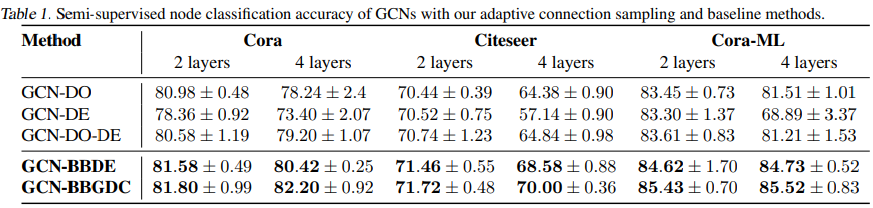

### [Review] Bayesian Graph Neural Network with Adaptive Connection Sampling

#### 1. 문제 정의

- Graph Neural Networks(이하 GNN)은 그래프에서 좋은 representation learning 측면에서 좋은 성과를 많이 내왔다.

- 하지만 GNN은 아래 2가지 한계점이 있다.
  
  1. 과적합 및 Over-smoothing 으로 인해 깊은 레이어층을 쌓았을 때 성능이 악화된다.
  
  2. 그래프 구조의 복잡성으로 인해 불확실성을 측정할 수 있는 Bayesian neural Network(이하 BNN) 적용에 어려움이 있다. 

#### 

#### 2. 연구 동기

- 과적합을 해결하는 기존의 다양한 방법이 존재하지만 Over-smoothing 문제가 발생한다. 따라서 둘을 함께 해결하는 방법을 찾을 필요가 있다.
  
  - Deep neural network에서 과적합을 해결하기 위해 Dropout을 많이 사용한다. 하지만 Dropout은 GNN에서 적용할 때 사용하는 Laplacian smoothing의 특징으로 인해, 층을 깊게 했을 때 주변 노드로의 표현값과 유사해지는 Over-smoothing 경향이 생겨 제한점이 있다.
  
  - 최근(Rong et al., 2019) 연구에서 Dropout와 DropEdge를 함께 사용했을 때 과적합과 Over smoothing 문제를 일부 해결할 수 있음을 보였다. 하지만 그 이상으로 Dropout 기반 방식에 대한 연구는 따로 없다.
  
  - 또한 기존의 방법에서는 Dropout rate를 하나의 상수 값처럼 다뤘었다. 본 연구에서는 Dropout rate를 데이터 상황에 맞춰 적응할 수 있도록 설정할 것이다.  
  
   

- GNN의 정보를 포괄적으로 활용하며 일반화할 수 있는 BNN 적용 방법이 아직 없다.
  
  - BNN는 불확실성을 1) 환경의 노이즈로 측정 향상을 통해 개선 가능한 aleatoric uncertainty (= P(D|H) : 우도)과 모델의 적합도로 데이터 확보를 통해 개선 가능한 Epistemic uncertainty( = P(H|D) : 사후 확률)을 학습할 수 있다. 이를 통해 예측 및 분류 결과의 불확실성을 측정할 수 있다.
  
  - 하지만 BNN는 사후 확률 계산에 필요한 Evidence form($\int P(D|H) P(H) dH $) 을 계산하는 데 경사 하강 등의 방법을 사용할 수 없어 현실적으로 계산할 수 없다는 한계가 있다. 최근 Sampling 기반의 MCMC 방법을 통해 근사값을 계산할 수 있으면서 Convolution neural network(이하 CNN)에 BNN을 적용할 수 있었다(Gal & Ghahramani, 2015).
  
  - GNN에서도 관측된 그래프를 임의의 랜덤 그래프 모델에서 파라미터를 바꾼 형태로 고려하여 불확실성을 학습한 연구가 있다(Zhang et al. 2019). 하지만 이 방식은 막대한 계산양 뿐만 아니라 어떤 랜덤 그래프 모델을 설정하는 가가 성능에 큰 영향을 미쳐, 다른 문제에 동일하게 적용할 수 없다는 문제가 있다. 또한 불확실성을 학습함에 있어서 그래프의 노드를 무시하고, 그래프의 위상만 고려했다는 한계가 있다.
  
   

- 따라서 이 연구는 <mark>1) 과적합 및 Over-smooth를 방지하고자 Graph DropoutConnect을 제안</mark>하며, <mark>2) BNN 활용 간 Graph 전반의 정보를 사용하도록  할 것</mark>이다. 마지막으로 <mark>3) Dropout rate를 데이터에 맞춰 적응시켜 모델 성능을 향상시킬 것이다.</mark>
  
   

#### 3. 방법

- 이 연구에서 제시하는 방법은 크게 3가지다. 
1. **Dropout 방식을 일반화한 Graph DropoutConnect(이하 GDC)를 제안한다.**
   
   > 
   > 
   > $H^{(l)}$ : $l_{th}$ Hidden layer of GNN
   > 
   > $\sigma(.)$ : Activation function
   > 
   > $f_l$ : the number of features of $l_{th}$ layer
   > 
   > $\mathfrak{N}$(A) : normalizing operator i.e. $\mathfrak{N}(A) = I_N + D^{-\frac{1}{2}} AD^{-\frac{1}{2}}$
   > 
   > $\bigodot$ : Hadamard product
   > 
   > $Z^{(l)}$ : Dropout 형태를 결정하는 Matrix.  Random binary matrix
   > 
   > - $z_{i,j}$ 값이 {0, 1} 중에서 선택되는 것은 베르누이 분포를 따른다고 가정한다.
   > 
   > $W^{(l)}$ : Feature translate $l$ layer to $l+1$ layer
   
   - Dropout Connect의 일반화 증명
     
     - $Z_{i,j}^{(l)}$ 의 값을 어떻게 설정하냐에 따라서 Dropout, Drop edge, Node sampling의 결과가 나온다.
     
     > Ex 1 - Drop out) $Z^{(l)} \in$ $\{0, 1\}^{n \times f_l}$
     > 
     > 
     
     > Ex 2 - Drop edge) $Z^{(l)} \in $ $\{0,1\}^{n \times n}$
     > 
     > 
     
     > Ex 3 - Node Sampling) $diag(z^{(l)}) \in$ $\{0,1\}^{n \times n}$
     > 
     > 
     
     → 이를 통해서 Graph DropoutConnect는 Dropout 방식들을 일반화하며, <mark>GDC를 최적화하는 것은 Dropout 와 Drop edge 등의 조합 최적화를 의미</mark>한다.
   
   - 추가로 GDC는 그래프 노드 예측을 위해 Neighborhood aggregation을 할 때, <u>각 채널별로 독립적으로 시행함으로써 Over smoothing을 방지</u>한다.

 

2. **GDC sampling이 Message passing과 동일하게 볼 수 있다는 점을 통해 Graph의 노드 정보까지 활용하는 BNN 모델을 만든다**
   
   - 우린 Gal(2017) 연구에서 'GNN 모델의 Message passing이 Variational interpretation에 따라, BNN의 evidence form 인 $q_\theta(w)$ 을 근사하는 것과 동일하다'는 점을 활용할 것이다. 
   
   - 따라서 GDC를 통한 Sampling이 GNN 모델에서의 Message passing로 해석될 수 있음을 보인다. 
     
     - GDC 식을  $l+1$ 층의 Hidden value v ($h_v^{(l+1)}$)로 범위를 좁힌다 
     
     > 
     > 
     > > $c_v$ : Constant derived from the degree of node v
     > > 
     > > $z_{vu}^{(l)}$ : $l$ layer 층의 node u 의 값 중 어떤 것을 $l+1$ layer 층에 있는  node v 로 보낼지 결정하는 Mask row vector. $s.t. z_{vu}^{(l)} \in \{0,1\}^{1 \times f_l}$
     > 
     > 이 식을 풀어내면 아래와 같다. 
     > 
     > $(s.t. W_{vu}^{(l)} := z_{uv}^{(l)}W^{(l)}
     > )$
     > 
     > > $c_v$ 는 계산을 간편하게 해주기 위해서 생략. 
     > 
     > 위의 식은<u> 노드 v에 대해서 Neighborhood에 있는 노드들을 통해 Message passing 하는 것으로 해석</u>할 수 있다. 
     
     - GDC를 통한 Sampling은 GNN 모델의 Message passing과 동일하기 때문에, GDC는 BNN의 evidence form 인 $q_\theta(w)$ 을 근사하는 것으로 볼 수 있다.  
       
       >  $w = \{w_e\}_{e=1}^{|\varepsilon|}$ where $w_e = \{ W_e^{(l)}\}_{l=1}^L$ is the set of random wights for th $e_{th}$ egde, $|\varepsilon|$ is the number of edges of input
       > 
       > $\theta$ : set of variational parameter. $\theta_l = \{ M^{(l)}, \pi_l\}$
       > 
       > $M^{(l)}$ : network weight parameter  
       
        
   
   - 이때, Variational distribution인 $q_\theta(w)$가 본래 분포인 $p(w)$ 에서 많이 벗어나지 않도록 Kullback-Leibler(이하 KL) divergence를 추후 Variational inference 간 규제항으로 삼는다. 
     
     > KL divergence : $KL(q_{\theta_l}(W_e^{(l)}) || p(W_e^{(l)}))$ 
     > 
     > let $q_{\theta_l}(W_e^{l}) = \pi_l \delta(W_e^{(l)} -0) + (1- \pi_l)\delta(W_e^{(l)} - M^{(l)})$
     > 
     > > $\delta$ : dirac delta function 
     
     > 이때, 사전 분포를 discrete quantisd Gaussian 분포라고 가정한다. 
     > 
     > - 각 층별 분포를 independent하다고 가정했기 때문에 Factorize를 통해 $q_\theta(W)$ 와 $p(W)$의 계산을 쉽게 할 수 있다. 
     >   
     >   > $KL(q_{\theta})(w || p(w)$ =$\sum_{l=1}^L\sum_{e=1}^{|\varepsilon|} KL(q_{\theta_l}(W_e^{(l)}) || p(W_e^{(l)}))$
     >   > 
     >   > 
     >   > 
     >   > $M^{(l)}$ : network weight parameters
     >   > 
     >   > $\mathcal{H}(\pi)$ : Entropy of success rate $\pi$
     > 
     > - 이는 KL term에 대한 Analytically한 평가를 가능하게 한다.(Gal et al, 2017).  
     
      
   
   - 마지막으로 Variational inference 의 Loss 항을 최소로 만드는 $\theta = \{M, \pi\}$ 을 미분을 통해 구한다
     
     > 
     > 
     > > $Y_0$ : the collection of the available labels for the observed nodes 
     
     - $M$ 에 대한 최적화는 Monte Carlo sampling을 통해서 계산할 수 있다.
     
     - 하지만 $\pi$는 Binary 값으로 미분이 불가능하여, Monte Carlo sampling 이후 Gradient descent 방식을 적용할 수 없다. 
       
       - 위 문제를 해결하는 보편적인 방법은 1) score-function gradient estimator 사용, 2) continuous relaxation of the drop masks가 있다. 
       
       - 여기에선 최근에 개발된 Augment-REINFORCE-Merge(ARM) 방법(Yin & zhou, 2019; Uin et al., 2020)을 채택한다.
   
    

3. **GDC를 Hierarchical beta-Bernoulli 로 가정하여 Droprate($\pi_l$)을 Adaptively 하게 학습시킨다**
   
   - Beta-Bernoulli process의 Marginal representation이 Indian Buffet Process 로 보일 수 있다(Ghahramain & Grifiths, 2006)는 점을 활용하여, binary random mask를 아래와 같이 제안하겠다. 
     
     > 
     > 
     > > $a_e^{(l)}$ : element of the adjacency matrix A corresponding to edge e 
     > > 
     > > $\hat a_e^{(l)}$ : element of the matrix $\hat A^{(l)} = A \bigodot Z^{(l)}$ 
   
   - 위의 수식은 random mask에 Sparcity를 부여할 수 있다(Zhou et al., 2009; Hajiramezanali et al., 2018). 그리고 이는 DropEgde에서 Deep GNN을 규제함에 있어서 필수적인 것으로 논의되어 왔다(Rong et al., 2019).
   
    
   
   - Hierarchical beta-Bernoulli GDC 계산을 위한 방법으로 Gibbs sampling이 있지만, 큰 데이터 셋에 적용하기엔 계산양이 많다. 따라서 이 연구에서 GDC 가 학습가능하도록 효과적인 Variational inference algorithm을 제안하겠다. 
     
     - Variational distribution을 $q(Z^{(l)}, \pi_l) = q(Z^{(l)}|\pi_l) q(\pi_l)$ 으로 정의한다.
       
       > $q(\pi_l) : q(\pi_l; a_l, b_l) = a_lb_l\pi_l^{a_l-1}(1-\pi_l^{a_l})^{b_l-1} s.t. a_l, b_l > 0$
       > 
       > $l$ 층의 beta 분포를 대체하기 위해 Kumaraswamy distribution로 가정
     
     - 앞서 dicrete quantised Gaussian 분포로 가정했기 때문에 각 egde가 독립이다. 따라서 $q(Z^{(l)}|\pi_l) = \prod_{e=1}^{|\varepsilon|}q(z_e^{(l)}|\pi_l)$로 표현할 수 있다. 
     
     - 정의한 $\pi_l$에 대한 Bernoulli distribution을 KL-term 및 Loss함수에 적용한다. 
     
     > 
     > 
     > 첫번째 항은 p,q 간에 동일한 분포를 가지고 있어 0이 되며, 둘째항은 Closed form으로 계산될 수 있다. 
     > 
     > 
     > 
     > > $\gamma $ : Euler-Mascheroni constant
     > > 
     > > $\Psi(.)$ : Digamma function 
     
     > KL-term의 미분할 때는 Random mask의 값이 Discrete하기 때문에 추가적인 조치가 필요하다. 가능한 방법 중 하나로 concrete distribution relaxation (Jang et al., 2016; Gal et al., 2017) 이 있으나, 이 방법은 편차를 가진다.
     > 
     > 편차를 줄이기 위해 이 연구에서는 Boluki 연구(Boluki et al.)와 동일하게 수식화하여  variational parameter를 직접 최적화하겠다. 
     > 
     > 
     > 
     > > $\alpha$ = $\{logit(1- \pi_l) \}_{l=1}^L$
     > > 
     > > $Z^{(l)} = 1_{[u^{(l)} < \sigma(\alpha_l)]}$   for $l = 1, ..., L$
     > 
     > $\{a_l, b_l\}_{l=1}^L$ 에 대한 Loss 함수의 gradient는 Chain rule과 $\pi_l$의 repameterization을 통해 쉽게 계산된다. 
     > 
     > > $\pi_l = (1- u^{\frac{1}{b_l}})^{\frac{1}{b_l}}$
     > > 
     > > $u \sim Unif[0,1]$

 

#### 4. 실험

- 실험 환경
  
  - Dataset : Cora, Citeseer, Cora-ML dataset
  
  - Condition 
    
    - Learning rate : 0.005 
    
    - Layer : 2층 이상. paramener 학습을 위해 50 warm-up training. 
    
    - Dimension of output feature : 128 
    
    - L2-regularization foctor : $5 \times 10^{-3}$, $10^{-2}$ and $10^{-3}$ for each dataset 
    
    - Temperature of concrete distribution : 0.67
    
     

- **실험 1 : Drouout 방식에 따른 노드 분류 정확도 비교**
  
  >  Baseline : GCN with Dropout(DO), GCN with DropEdge(DE), GCN with DO and DE 
  
  
  
  > BBDE : Beta-Bernoulli DropEdge
  > 
  > BBGDC : Beta-Bernoulli Graph Dropout Connect 
  
  -> BBGDC 방법이 정확도 측면에서 확률적 규제 방식 중 SOTA 성능을 달성한다. 대부분의 경우 Dropout과 DropEgde을 개별적으로 적용했을 때보다 같이 사용했을 때 성능이 향상됨을 알 수 있다. Beta- Bernoulli 분포를 통해 Adaptively 학습할 때 항상 성능이 항상된다. BBGDC을 제외한 다른 방법들은 항상 레이어 층을 늘렸을 때 성능이 떨어지나, BBGDC는 Citeseer의 경우를 제외하고 성능이 향상되었다. 
  
   

- **실험 2 : Dropout rate 최적화 방식에 따른 분류 정확도 비교**
  
  > Baseline : Bernoulli DropEdge with ARM(BDE-ARM), Beta-bernoulli DropEdge with ARM(BBDE-ARM)
  
  
  
  -> Dropout rate를 직접 최적화시키는 beta-bernoulli GDC의 정확도가 제일 높다.
  
   

- **실험 3 : Dropout 방식에 따른 불확실성 측정 결과** 
  
  > Base linde : GCN-DO 
  > 
  > Metric : Patch Accuracy vs Patch Uncertainty(PAvPU)(Mukhoti & Gal, 2018) 
  
  
  
  -> PAvPU의 값이 높을수록 예측이 잘 맞다는 것을 고려할 때, GCN-BBGDC가 모든 Threshold에서 높은 성과를 내고 있음을 확인할 수 있다. 
  
   

- **실험 4 : Dropout 방식에 따른 과적합 및 Over-fitting 방지 효과 확인**
  
  > Baseline : GCN-DO
  > 
  > Metric : Total variation(TV). TV 은 smoothness를 측정한다(Chen et al., 2015). TV 수치가 낮아질수록 over-smoothing 을 의미한다. 
  
  
  
  -> GCN-DO는 에포크가 증가함에 따라 첫번째 hidden 층에선 TV가 조금씩 증가하고, 둘째 층에선 TV가 줄어든다. 반면 GCN-BBGDC는 에포크가 증가함에 따라 첫째, 둘째 hidden 층에서 TV가 증가한다. 이러한 차이는 hidden 레이어 층의 개수를 늘렸을 때, GCD-DO는 성능이 악화되지만 GCN-BBGDC는 그렇지 않은 이유를 설명해준다. GDC의 구조 뿐만 아니라 Droprate의 Adaptive learning이 BBGDC 방법의 강건성을 제공한다.  
  
   

- **실험 5 : GDC 방법 간 Block 적용에 따른 영향 확인**
  
  - GDC는 모든 input, output 특징 간에 개별적인 Mask를 고려하기 때문에 많은 메모리 용량을 필요로 한다. 하나의 해결 방법으로 특징들을 Block 화한다면 필요로 하는 메모리 양을 줄일 수 있다. Block에 따른 성능에 미치는 영향을 확인한다.
  
  
  
  -> Block의 수가 늘어날 수록 정확도가 향상된다. 즉, Block의 개수를 정하는 것은 모델의 성능과 메모리 사용량을 Trade-off하는 요인임을 확인할 수 있다. 
  
   

#### 5. 결론

- 본 연구에서 제안한 GDC은 Dropout 방식들을 일반화한 것으로, 모델의 <mark>과적합 및 Oversmoothing을 막으며</mark> <mark>GNN 모델의 불확실성 측정을 가능하게 했다</mark>. 

- 또한 Dropout rate을고정값이 아닌 확률 변수로 다룸으로써 <mark>데이터 상황에 맞게 최적화함으로써 모델의 성능을 향상시켰다. </mark>

 

---

##### 저자 정보

- 저자명 : Arman Hasanzadeh, Ehsan Hajiramezanali, Shahin Boluki, Minguan Zhou, Nick Duffield, Krishna Narayanan, Xiaoning Qian

- 주요 참여 기관 : Electrical and Computer Engineering Department, Taxas A&M University

- 연구 주제 : Graph Machine learning, Representation Learning, Bayesian Inference

 

### 6. 참고 논문 및 추가 자료

- Reference 
  
  - Boluki, S., Ardywibowo, R., Dadaneh, S. Z., Zhou, M., and Qian, X. Learnable Bernoulli dropout for Bayesian deep learning. In Proceedings of the Twenty Third International Conference on Artificial Intelligence and Statistics,
    pp. 3905–3916, 2020.
  
  - Chen, S., Sandryhaila, A., Moura, J. M., and Kovacevic, J.Signal recovery on graphs: Variation minimization. IEEE
    Transactions on Signal Processing, 63(17):4609–4624, 2015.
    
    Gal, Y. and Ghahramani, Z. Bayesian convolutional neural networks with bernoulli approximate variational inferrence. arXiv preprint arXiv:1506.02158, 2015.
  
  - Gal, Y., Hron, J., and Kendall, A. Concrete dropout. In Advances in neural information processing systems, pp. 3581–3590, 2017
    
    Ghahramani, Z. and Griffiths, T. L. Infinite latent feature models and the Indian buffet process. In Advances in neural information processing systems, pp. 475–482, 2006.
  
  - Hajiramezanali, E., Dadaneh, S. Z., Karbalayghareh, A., Zhou, M., and Qian, X. Bayesian multi-domain learning for cancer subtype discovery from next-generation sequencing count data. In Advances in Neural Information
    Processing Systems, pp. 9115–9124, 2018.
  
  - Jang, E., Gu, S., and Poole, B. Categorical reparameterization with gumbel-softmax. arXiv preprint arXiv:1611.01144, 2016.
  
  - Mukhoti, J. and Gal, Y. Evaluating bayesian deep learning methods for semantic segmentation. arXiv preprint arXiv:1811.12709, 2018.
  
  - Rong, Y., Huang, W., Xu, T., and Huang, J. DropEdge: Towards the very deep graph convolutional networks for node classification, 2019.
  
  - Kumaraswamy, P. A generalized probability density function for double-bounded random processes. Journal of Uin et al., 2020)
  
  - Yin, M. and Zhou, M. ARM: Augment-REINFORCEmerge gradient for stochastic binary networks. In International Conference on Learning Representations, 2019.
  
  - Zhang, Y., Pal, S., Coates, M., and Ustebay, D. Bayesian graph convolutional neural networks for semi-supervised classification. In Proceedings of the AAAI Conference on Artificial Intelligence, volume 33, pp. 5829–5836, 2019.
  
  - Zhou, M., Chen, H., Ren, L., Sapiro, G., Carin, L., and Paisley, J. W. Non-parametric Bayesian dictionary learning for sparse image representations. In Advances in neural information processing systems, pp. 2295–2303, 2009

- Github : https://github.com/armanihm/GDC
