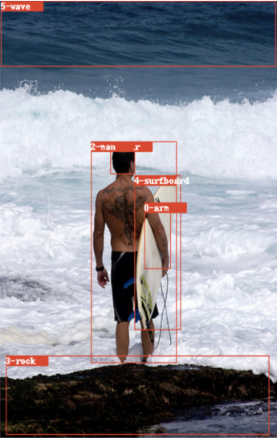
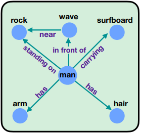
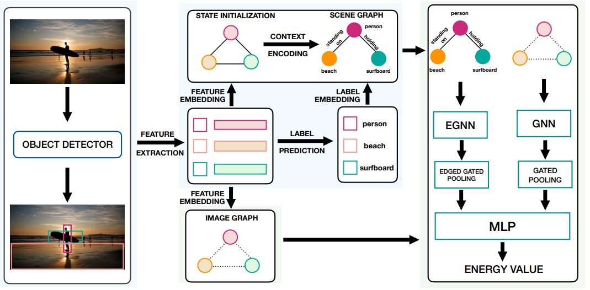
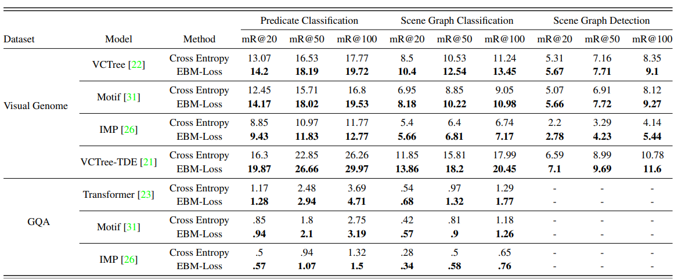
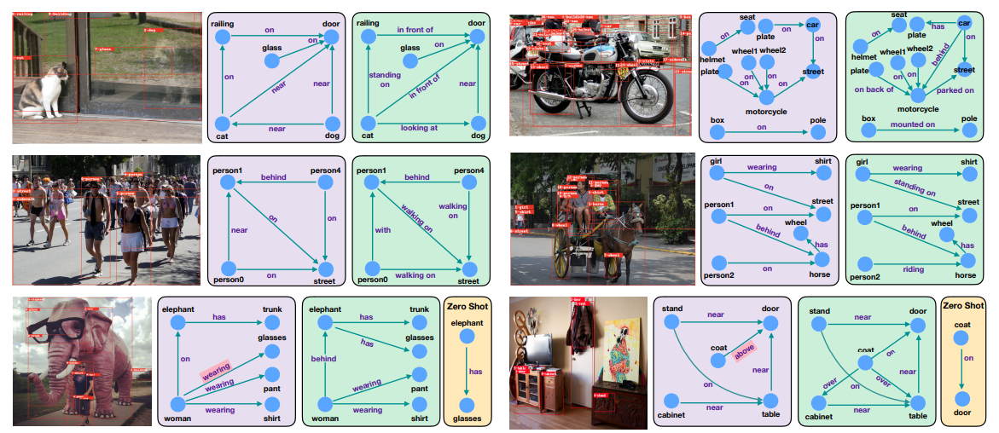

# **Energy-Based Learning for Scene Graph Generation** 

  

## **1. Problem Definition**  

*Scene Graph Generation(SGG) in Computer Vision*  

Scene Graph Generation은 이미지가 주어졌을 때 Scene Graph로 변환하는 Task를 의미한다. 예를 들어, 왼쪽의 이미지가 주어졌을 때 오른쪽 그림과 같은 Graph로 만드는 것이다. Graph의 Node은 Entity(e.g.사람, 돌)을 의미하고 Edge의 경우에는 두 Node 사이의 Edge는 Entity 사이의 Predicate(술어)를 의미한다. "**사람이 돌 위에 있다**"라고 한다면 Node는 "**사람**", "**돌**"이 될 것이고 Edge(Predicate)은 "**standing on(위에 서 있다)**"가 될 것이다.  

<!--    -->

  

  

그림 출처: [CVPR 21]Energy-Based Learning For Scene Graph Generation

## **2. Motivation**  

이전 Scene Graph Generation의 모델들은 Relation을 분류하기 위해서 Cross-Entropy Loss를 사용했다. 하지만 Cross-Entropy Loss (CE)를 사용하게 된다면 독립적으로 그 관계만 맞추려고 학습할 것이다. 예를 들면, CE loss를 이용했을 때 위의 그림을 참고하면 <man, on, rock>, <man, holding, surfboard>의 관계가 주어져 있을 때 <man, riding, wave>으로 예측하는 것은 말이 안되지만 독립적으로 man과 wave만을 보기 때문에 riding으로 예측한다.

이 논문에서는 두 객체를 보고 독립적으로 예측하는 것보다는 주변의 다른 관계까지 고려하면서 loss를 학습해야 한다고 주장한다. 예를 들면, loss를 학습할 때 위의 그림에서 <man, carrying, surfboard>를 고려한다면 <man, riding, wave>이 오는 것은 common sense로 봐도 말이 안되기 때문에 큰 Penalty를 부여하여 <man, riding, wave>가 못 나오도록 학습하게 하는 것이다.

### Discriminative Idea

이 논문에서는 CE Loss를 활용해서 두 객체만을 고려했을 때 예측하는 것보다는 Output space에서 고려하는 Energy-Based loss를 제안한다. 여기서 Input space를 고려하는 것을 CE Loss라고 봤을 때, Output space는 이미지에서 Global하게 주변의 다른 관계까지 고려하는 것을 의미하고 이를 Energy-Based Model를 활용하여 학습한다.

## **3. Method**  
Overall Framework 사진은 아래와 같다.  

  

### **1. Object Detection**  

Overall Framework의 맨 왼쪽의 그림을 보면 이미지가 주어져 있을 때, 객체를 탐지한다. Scene Graph Generation에서는 Fair Comparison을 위해서 [Faster-RCNN](https://proceedings.neurips.cc/paper/2015/file/14bfa6bb14875e45bba028a21ed38046-Paper.pdf)을 주로 활용한다. Faster R-CNN을 통해서 사람과 서핑보드 등의 객체를 먼저 탐지하게 된다. Faster R-CNN을 통과하면 객체마다 Visual Feature, Object Class, Bounding Box 정보를 추출하게 된다.  

### **2. Context 반영**  

Faster R-CNN을 통해서 객체에서 Visual Feature를 탐지하고 나면 Overall Framework에서 Feature Extraction을 통과한다. 그리고 Context 반영을 하고 Feature를 Refinement하기 위해서 Bi-LSTM, Bi-Tree LSTM을 활용한다. Scene Graph에서는 주변의 Context 반영을 하고 Refinement된 Feature를 활용하는 것이 중요하기 때문에 이 논문에서도 Visual Feature를 그대로 사용하는 것이 아니라 Refinement를 한다.  

### **3. Energy-Based Loss 사용**  

Energy-Based Loss를 사용해서 Motivation에서 언급했듯이 다른 주변의 관계까지 고려하면서 Output Space에서 학습하도록 한다. 다시 말하자면 CE Loss는 독립적으로 두 객체만을 보고 관계를 예측한다면 Energy-Based Loss는 이미지 내에서 다른 객체들의 관계를 고려하면서 학습하는 것이다.  

Notation을 먼저 설명하면, 2번에서 얘기한 Context Encoding을 하고나면 Entity와 Relation을 예측한 Scene Graph형태로 나오게 된다. Overall Framework에서 맨 위에 있는 Scene Graph를 보면 이해가 더 쉽다. 해당 Scene Graph를 라고 하자. 

Overall Framework에서 맨 아래를 보면 Image Graph가 존재하는데 이는 처음에 Faster R-CNN으로 나온 Feature로 Entity의 Feature가 존재하게 된다. 이 때는 Entity 둘 관계를 예측하지 않고 Entity만 존재하는 Graph로 보면 된다. 이를 라고 하자.  

그리고 Ground-Truth Bounding Box를 통해서 만든 Image Graph를 라고 하고, Ground-Truth Scene Graph를 라고 하자.  

$$L_e = E_{\theta}(G_I^+,G_{SG}^+)-min_{G_{SG}\in SG}E_{\theta}(G_I, G_{SG})$$

위가 Energy-Based Loss인데 설명하면 다음과 같다. Ground-Truth를 이용했을 때 Graph의 Energy (앞의 Term)와 예측했을 Graph의 Energy (뒤의 Term)을 가깝게 하는 것이다. )는 Ground Truth의 Image Graph와 Ground Truth의 Scene Graph를 이용했을 때의 Energy이다. 이를 예측한 Graph의 Energy )를 가깝게 하면, Scene Graph를 예측할 때 Ground-Truth의 Energy하고 가깝게 학습될 것이다.  
이렇게 학습을 하면 CE Loss처럼 독립적으로 두 Entity를 보고 학습하는 것이 아니라 Image에 있는 다른 관계까지 고려하면서 학습을 하게 되는 것이다. 즉 Output Space에서 학습하는 것이다.  

이 논문에서는 위를 바로 학습을 하게 된다면 Gradient Overflow가 생기게 될 수 있는데 이를 방지하기 위해서  
$$L_r=E_{\theta}(G_{I}^+,G_{SG}^+)^2+E_{\theta}(G_{I},G_{SG})^2$$  

Loss를 이용해서 Gradient Overflow를 방지한다. 

최종 Loss는 

$$L_{total}=\lambda_e L_e+\lambda_r L_r + \lambda_t L_t$$

로 구성된다. 는 CE Loss로 사용되지만 이는 Regularizor로써만 활용된다. 

### Energy Based 구현  

Scene Graph의 Energy를 계산하기 위해서는 해당 논문에서는 Graph Pooling을 한 후, MLP를 이용하여 하나의 Scalar를 추출하게 된다. 다시 정리하면 Ground-Truth Scene Graph를 활용하여 Pooling한 후, MLP를 이용하여 하나의 Scalar가 나올 것이고, Predicted Scene Graph에서도 하나의 Scalar가 나올 것이다. Predicted Scene Graph와 GT Scene Graph의 Energy를 가깝게 하는 것이다.  

## **4. Experiment**  

### **Task** 

* Predicate Classification (PredCls): Bounding Box와 Entity의 Class정보까지 Ground-Truth로 주어졌을 때 Relation만 예측하는 Task  
* Scene Graph Classification (SGCls): Bounding Box만 주어져 있고 Entity Class와 Relation을 예측하는 Task  
* Scene Graph Detection (SGDet): Image만 주어져 있을 때, Proposal만을 활용해서 Entity Class와 Relation을 예측해야 하는 Task  

### Main Table  

   

Main Table에서 볼 수 있듯이 Energy-Based Loss를 활용했을 때 성능이 올라간 것을 볼 수 있다. 이 논문에서는 기존의 Model들이 CE Loss를 활용하는데 여기에서는 그 Loss를 Energy-Based Loss를 이용했을 때 성능 변화를 보여준다.  

### Qualitative Results  

  

이 실험은 실제로 CE Loss를 썼을 때와 Energy-Based Loss를 활용했을 때 어떻게 예측했는지를 보여준다. 이 논문에서는 CE Loss보다 Energy-Based Loss를 사용했을 때 더 말이 되는 관계를 예측했음을 실제로 보여주고 더 Fine-Grained한 관계를 예측했다는 것을 보여준다.  

## **5. Conclusion**  

기존의 Model들이 CE Loss를 주로 활용했는데 CE Loss는 두 Entity를 보고 예측을 하게 된다. 하지만, 이렇게 되면 Motivation에서 밝혔듯이 주변 관계를 고려했을 때 말이 안되는 관계를 예측하게 된다. 따라서 전체적인 관계를 고려하면서 학습해야함을 주장하고 이를 실험적으로 잘 보여줬다고 생각한다.  

Energy-Based Model은 기존에 존재하던 방법론인데 이를 Scene Graph에 적절한 Limitation을 찾고 적용했다고 생각한다. 연구를 할 때 위와 같이 한계점을 찾아내고 기존에 존재하던 방법론을 작 적용하여 해결하는 것이 좋은 연구 방향 중 하나라고 생각한다.  

---  
## **Author Information**  

* 김기범  
    * Affiliation : KAIST
    * Research Topic: Graph Neural Network, Recommendation System, Scene Graph  

* Github Implementation  
[Implementation](https://github.com/mods333/energy-based-scene-graph)  
